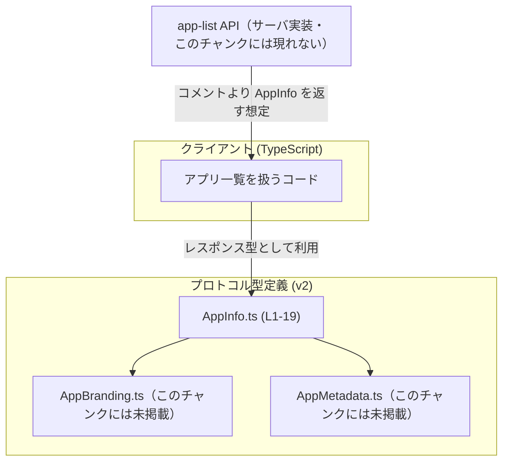
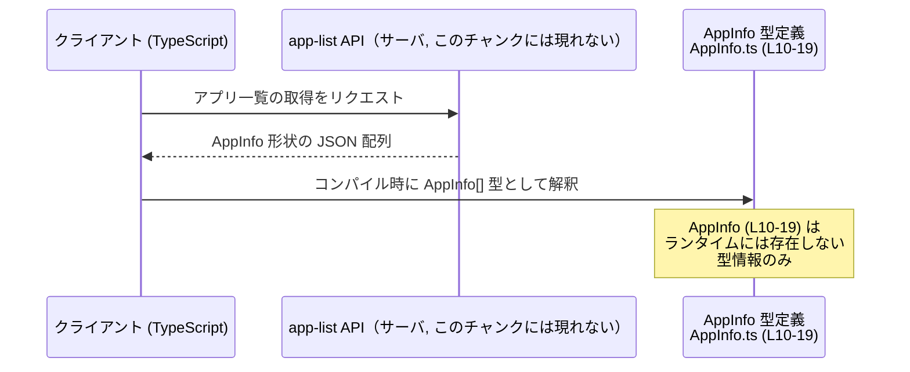

# app-server-protocol/schema/typescript/v2/AppInfo.ts コード解説

## 0. ざっくり一言

app-list API が返す「アプリ情報」の JSON 形状を、TypeScript のオブジェクト型として定義した **生成コード（手書き禁止）** のファイルです（AppInfo.ts:L1-3, L7-10）。

---

## 1. このモジュールの役割

### 1.1 概要

- このモジュールは、**app-list APIs が返すアプリのメタデータ** を表現するための `AppInfo` 型を提供します（AppInfo.ts:L7-10）。
- フロントエンドや TypeScript クライアントが、レスポンスの構造を型安全に扱うことを目的としています。
- ファイル先頭コメントにある通り、`ts-rs` によって自動生成されており、**直接編集しないこと** が前提です（AppInfo.ts:L1-3）。

### 1.2 アーキテクチャ内での位置づけ

- `AppInfo` 型は **プロトコル層の型定義** であり、サーバ側の app-list API から返される JSON を TypeScript 上で表現します（コメントより, AppInfo.ts:L7-10）。
- `AppInfo` は、同一ディレクトリの `AppBranding`・`AppMetadata` 型に依存しています（AppInfo.ts:L4-5）。
- 実際の app-list API 実装や永続化層（DB など）は、このチャンクには現れません。



### 1.3 設計上のポイント

- **純粋なデータ定義のみ**  
  - 関数やメソッドはなく、オブジェクト型のフィールド定義だけを持つ型エイリアスです（AppInfo.ts:L10-19）。
- **null を用いた任意フィールド表現**  
  - 多くのプロパティは `string | null` や `AppBranding | null` のように `null` を許容し、「値が存在しない」状態を表現します（AppInfo.ts:L10）。
- **文字列キーのラベルマップ**  
  - `labels` は任意の文字列キーに対する string 値（または未定義）を持つマップとして定義されています（AppInfo.ts:L10）。
- **生成コードであることの明示**  
  - 「GENERATED CODE! DO NOT MODIFY BY HAND!」とのコメントがあり（AppInfo.ts:L1）、Rust 側定義＋`ts-rs` から生成されることが明示されています（AppInfo.ts:L3）。
- **設定ファイルとの連動**  
  - `isEnabled` は `config.toml` の設定に対応する、とコメントで契約が明示されています（AppInfo.ts:L11-17）。

---

## 2. 主要な機能一覧

このファイルが提供する主な「機能」は 1 つです。

- `AppInfo` 型定義: app-list API が返す各アプリの ID・名称・説明・ロゴ URL・ブランド情報・メタデータ・ラベル・インストール URL・アクセス可否・有効フラグ・プラグイン表示名を表現するオブジェクト型（AppInfo.ts:L7-10）。

---

## 3. 公開 API と詳細解説

### 3.1 型一覧（構造体・列挙体など）

| 名前       | 種別                        | 役割 / 用途                                                | 定義箇所                     |
|------------|-----------------------------|-------------------------------------------------------------|------------------------------|
| `AppInfo`  | 型エイリアス（オブジェクト型） | app-list API が返す 1 つのアプリ情報を表現するコンテナ型   | AppInfo.ts:L7-10, L10-19     |

関連するがこのファイルには定義されていない型:

- `AppBranding`: アプリのブランド情報を表現する型と推測されますが、定義はこのチャンクには現れません（import のみ, AppInfo.ts:L4）。
- `AppMetadata`: アプリの追加メタデータを表現する型と推測されますが、定義はこのチャンクには現れません（import のみ, AppInfo.ts:L5）。

#### `AppInfo` のフィールド一覧

`AppInfo` は次のプロパティを持つオブジェクト型です（AppInfo.ts:L10-19）。

| フィールド名          | 型                                      | 説明 / 契約                                       | 根拠 |
|-----------------------|-----------------------------------------|--------------------------------------------------|------|
| `id`                  | `string`                               | アプリを一意に識別する ID                        | AppInfo.ts:L10 |
| `name`                | `string`                               | アプリ名                                         | AppInfo.ts:L10 |
| `description`         | `string \| null`                       | 説明文。未設定の場合は `null`                    | AppInfo.ts:L10 |
| `logoUrl`             | `string \| null`                       | ロゴ画像の URL                                   | AppInfo.ts:L10 |
| `logoUrlDark`         | `string \| null`                       | ダークテーマ用ロゴ画像の URL                     | AppInfo.ts:L10 |
| `distributionChannel` | `string \| null`                       | 配布チャネル（例: ストア種別など）。未設定は `null` | AppInfo.ts:L10 |
| `branding`            | `AppBranding \| null`                  | ブランド情報。無い場合は `null`                  | AppInfo.ts:L10 |
| `appMetadata`         | `AppMetadata \| null`                  | 任意のメタデータ。無い場合は `null`              | AppInfo.ts:L10 |
| `labels`              | `{ [key in string]?: string } \| null` | 任意のキー文字列に対するラベル値マップ。無い場合は `null` | AppInfo.ts:L10 |
| `installUrl`          | `string \| null`                       | インストール用 URL                               | AppInfo.ts:L10 |
| `isAccessible`        | `boolean`                              | クライアントからアクセス可能かどうか             | AppInfo.ts:L10 |
| `isEnabled`           | `boolean`                              | `config.toml` 上でアプリが有効かどうか（コメントより） | AppInfo.ts:L11-17, L19 |
| `pluginDisplayNames`  | `Array<string>`                        | 関連プラグインの表示名一覧                       | AppInfo.ts:L19 |

特に `labels` は次のような特徴があります。

- `labels` 自体が `null` の場合: ラベルマップが存在しないことを表します（AppInfo.ts:L10）。
- `labels` がオブジェクトの場合: 任意の文字列キーに対する値が `string` で存在するか、キー自体が存在しないかのいずれかです（`?:` でオプショナル指定, AppInfo.ts:L10）。

### 3.2 関数詳細（最大 7 件）

このファイルには **関数・メソッドの定義は存在しません**（AppInfo.ts:L1-19）。  
そのため、関数詳細テンプレートに該当する対象はありません。

### 3.3 その他の関数

- 補助関数・ユーティリティ関数も、このチャンクには一切定義されていません（AppInfo.ts:L1-19）。

---

## 4. データフロー

このセクションでは、app-list API を通じて `AppInfo` がどのように使われるかの典型的な流れを示します。  
実際の API 実装はこのチャンクにはありませんが、「app metadata returned by app-list APIs」というコメント（AppInfo.ts:L7-9）を根拠に、**レスポンス型として利用される**ことがわかります。



要点:

- サーバ側の app-list API が、各要素が `AppInfo` 形状の JSON 配列を返す、という契約になっていることがコメントから読み取れます（AppInfo.ts:L7-9）。
- TypeScript 側では `AppInfo` 型を用いることで、**各フィールドの存在・null 可能性・型（文字列 / 真偽値 / 配列）** をコンパイル時にチェックできます（AppInfo.ts:L10-19）。
- 型はコンパイル時のみに存在するため、ランタイムのオブジェクトは通常のプレーンな JavaScript オブジェクトです。

---

## 5. 使い方（How to Use）

### 5.1 基本的な使用方法

`AppInfo` を利用して、app-list API のレスポンスを安全に扱うシンプルな例です。

```typescript
// AppInfo 型をインポートする                            // 型定義のみをインポート
import type { AppInfo } from "./AppInfo";                 // AppInfo.ts と同じディレクトリを想定

// AppInfo 配列から、UI 表示用の名前を取得する関数        // AppInfo を使って表示名を決める
function getDisplayName(app: AppInfo): string {           // 引数 app は AppInfo 型
    // labels 内の "displayName" ラベルを優先的に使用     // ラベルがあればそれを使う
    const label = app.labels?.["displayName"];            // labels が null の場合にも安全にアクセス

    // ラベルが無い場合は name を使う                     // null/undefined の場合は name にフォールバック
    return label ?? app.name;                             // null 合体演算子でフォールバック
}

// AppInfo 配列から有効なアプリのみを抽出する例          // 複数の AppInfo を扱うケース
function filterEnabledApps(apps: AppInfo[]): AppInfo[] {  // AppInfo の配列を受け取る
    return apps.filter(app => app.isEnabled);             // config.toml で有効なものだけを残す
}
```

- この例では `labels` が `null` または `"displayName"` キーが存在しない場合を考慮し、`?.` と `??` を用いて安全にアクセスしています（AppInfo.ts:L10）。
- `isEnabled` は `config.toml` の設定に紐づくことがコメントで明示されているため（AppInfo.ts:L11-17）、設定上有効なアプリだけを抽出しています。

### 5.2 よくある使用パターン

1. **アクセス可能かつ有効なアプリのみ表示する**

```typescript
import type { AppInfo } from "./AppInfo";

// UI に表示する対象を絞り込む一例                      // 実際の条件は仕様に依存する
function filterVisibleApps(apps: AppInfo[]): AppInfo[] {
    return apps.filter(app => app.isEnabled && app.isAccessible);
    // isEnabled: config.toml で enabled=true か（AppInfo.ts:L11-17）
    // isAccessible: 実行時にアクセス可能かどうか（AppInfo.ts:L10）
}
```

> 上記のフィルタ条件は一例であり、実際のプロダクトの仕様によって異なります。

1. **プラグイン表示名一覧を収集する**

```typescript
import type { AppInfo } from "./AppInfo";

function collectPluginNames(app: AppInfo): string[] {
    // pluginDisplayNames は常に配列型で、空配列も許容        // 型から空配列も有効と分かる (AppInfo.ts:L19)
    return app.pluginDisplayNames;
}
```

### 5.3 よくある間違い

`null` を許容するプロパティを、そのまま非 null として扱うと型安全性を損ないます。

```typescript
import type { AppInfo } from "./AppInfo";

declare const app: AppInfo;

// ❌ よくない例: description を必ず string とみなしている
// const desc: string = app.description;                  // strictNullChecks 有効ならコンパイルエラー

// ✅ 正しい例: null を考慮してフォールバックする
const desc: string = app.description ?? "";               // description が null の場合は空文字にする

// ❌ よくない例: labels を常にオブジェクトとみなす
// const label = app.labels["key"];                       // app.labels が null だとランタイムエラー

// ✅ 正しい例: labels 自体の null とキーの有無を両方考慮
const label = app.labels?.["key"];                        // labels が null の場合は undefined になる
```

### 5.4 使用上の注意点（まとめ）

- **生成コードを直接編集しない**  
  - `// GENERATED CODE! DO NOT MODIFY BY HAND!` と明記されており（AppInfo.ts:L1）、変更は Rust 側の元定義＋`ts-rs` の生成に対して行う必要があります（Rust 側の場所はこのチャンクには現れません）。
- **null 許容フィールドのハンドリング**  
  - `description`, `logoUrl`, `branding`, `appMetadata`, `labels`, `installUrl` など多くのフィールドが `null` を許容しています（AppInfo.ts:L10）。利用時には `?.` や `??` などで `null` を考慮する必要があります。
- **ラベルマップのキーの存在**  
  - `labels` の個々のキーはオプショナル（`?:`）であり（AppInfo.ts:L10）、キーが定義されていないケースもあります。`in` 演算子や `labels?.["key"]` で存在を確認するのが安全です。
- **並行性・スレッド安全性**  
  - この型は純粋なデータコンテナであり、並行性やスレッド安全性はこの型レベルでは扱いません。並行アクセス時の整合性は呼び出し側（状態管理や API 呼び出し部分）で制御する必要があります。

---

## 6. 変更の仕方（How to Modify）

### 6.1 新しい機能を追加する場合（フィールド追加など）

このファイルは自動生成されるため、**直接のコード編集は前提とされていません**（AppInfo.ts:L1-3）。

新しいフィールドを AppInfo に追加したい場合は、一般的には次のステップになります。

1. **Rust 側の元定義を変更する**  
   - `ts-rs` が参照している Rust の構造体（おそらく `AppInfo` 相当）のフィールドを追加します。  
   - Rust 側のファイルパスや構造体名はこのチャンクには現れないため、別途リポジトリ構成の確認が必要です。
2. **`ts-rs` により TypeScript を再生成する**  
   - プロジェクトで用意されているビルド／コード生成コマンドを実行して、`AppInfo.ts` を再生成します。
3. **利用側コードを更新する**  
   - 新しいフィールドを利用する TypeScript コードに型注釈を追加し、`null` 許容かどうかに応じた処理を実装します。

### 6.2 既存の機能を変更する場合（フィールドの型変更など）

- **影響範囲の確認**  
  - `AppInfo` を型注釈として利用している TypeScript コード（インポート元）を検索し、該当箇所を洗い出す必要があります。  
  - このチャンクには利用側コードは現れません。
- **契約の維持**  
  - `isEnabled` のようにコメントで意味が明示されているフィールド（AppInfo.ts:L11-17）は、サーバとクライアント間のプロトコル契約に関わります。意味や真偽値の解釈を変える場合は、API 仕様の変更として扱うべきです。
- **型の互換性**  
  - 例えば `string | null` を `string` に変更すると、既存クライアントが `null` を前提にしていた場合に影響します。  
  - 逆に `string` を `string | null` に緩める場合は、多くの場合後方互換ですが、利用コード側で null チェックを追加する必要が出てきます。

---

## 7. 関連ファイル

このモジュールと密接に関係するファイル・ディレクトリ（このチャンク内に現れる範囲）は次の通りです。

| パス                              | 役割 / 関係 |
|-----------------------------------|-------------|
| `./AppBranding`                   | `AppInfo.branding` フィールドで利用される型を定義するファイル（import のみ確認, AppInfo.ts:L4）。定義内容はこのチャンクには現れません。 |
| `./AppMetadata`                   | `AppInfo.appMetadata` フィールドで利用される型を定義するファイル（import のみ確認, AppInfo.ts:L5）。定義内容はこのチャンクには現れません。 |
| `app-server-protocol/schema/typescript/v2/AppInfo.ts` | 本ファイル。app-list API 用の `AppInfo` 型定義（AppInfo.ts:L7-19）。 |

テストコードや生成元の Rust ファイルの場所は、このチャンクには現れないため「不明」です。
