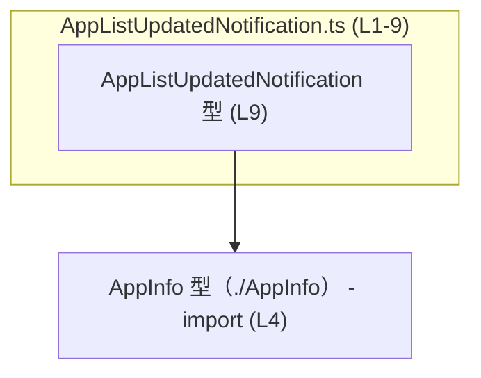
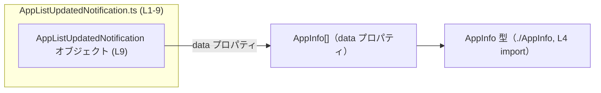

# app-server-protocol/schema/typescript/v2/AppListUpdatedNotification.ts コード解説

## 0. ざっくり一言

`AppListUpdatedNotification` 型は、アプリ一覧が更新されたときに発行される通知の **ペイロード形式（`data` に `AppInfo` の配列を持つオブジェクト）** を表現する TypeScript の型エイリアスです（`AppListUpdatedNotification.ts:L6-9`）。

---

## 1. このモジュールの役割

### 1.1 概要

- このモジュールは、**アプリ一覧の更新通知のためのデータ構造** を定義します。
- 通知は `data` プロパティに `AppInfo` 型の配列を持つオブジェクトとして表現されます（`AppListUpdatedNotification.ts:L4-9`）。
- ファイル先頭のコメントから、このコードは `ts-rs` によって自動生成されており、手動編集しないことが前提になっています（`AppListUpdatedNotification.ts:L1-3`）。

### 1.2 アーキテクチャ内での位置づけ

このファイルから分かる依存関係は次のとおりです。

- 依存先
  - `./AppInfo`: 各アプリを表す `AppInfo` 型をインポートし、`data` 配列の要素型として利用しています（`AppListUpdatedNotification.ts:L4`）。
- 依存元
  - このチャンクには、どのモジュールが `AppListUpdatedNotification` を利用しているかは現れません（不明）。

依存関係を簡単な Mermaid 図で表すと次のようになります。



### 1.3 設計上のポイント

コードから読み取れる設計上の特徴は次のとおりです。

- **自動生成コード**  
  - ファイル先頭コメントに「GENERATED CODE! DO NOT MODIFY BY HAND!」とあり、`ts-rs` による自動生成であることが明示されています（`AppListUpdatedNotification.ts:L1-3`）。
- **責務は型定義のみ**  
  - 関数やクラスはなく、`AppListUpdatedNotification` 型エイリアスだけを公開します（`AppListUpdatedNotification.ts:L9`）。
- **シンプルな構造**  
  - 通知ペイロードは `data: Array<AppInfo>` という 1 プロパティのみのオブジェクトとして表現されています（`AppListUpdatedNotification.ts:L9`）。
- **型安全性**  
  - TypeScript の型として定義されているため、`data` に `AppInfo` 以外の型を入れるとコンパイル時にエラーになります（TypeScript の一般仕様に基づく）。

---

## 2. 主要な機能一覧

このモジュールは型定義のみを提供し、実行時のロジックは持ちません。主要な提供要素は次の 1 点です。

- `AppListUpdatedNotification` 型: アプリ一覧更新通知のペイロードを表すオブジェクト型（`{ data: AppInfo[] }`）

---

## 3. 公開 API と詳細解説

### 3.1 型一覧（構造体・列挙体など）

このチャンクで定義・インポートされている主要な型のインベントリーです。

| 名前                             | 種別        | 役割 / 用途                                                                 | 根拠 |
|----------------------------------|-------------|-------------------------------------------------------------------------------|------|
| `AppListUpdatedNotification`     | 型エイリアス | アプリ一覧更新通知のペイロードを表すオブジェクト型。`data` に `AppInfo[]` を持つ。 | `AppListUpdatedNotification.ts:L6-9` |
| `AppInfo`                        | 型（詳細不明） | 各アプリの情報を表す型。`data` 配列の要素型として使用される。                     | `AppListUpdatedNotification.ts:L4` |

※ `AppInfo` の具体的なフィールド構成は、このチャンクには現れないため不明です。

#### `AppListUpdatedNotification` の詳細

```ts
export type AppListUpdatedNotification = { data: Array<AppInfo>, };
```

- **構造**（`AppListUpdatedNotification.ts:L9`）
  - オブジェクト型で、次の 1 つのプロパティを持ちます。
    - `data: Array<AppInfo>`  
      - アプリ情報 (`AppInfo`) の配列です。
      - 配列要素数は 0 個以上で、サイズ制限は型定義上はありません。
- **コメントによる意味づけ**（`AppListUpdatedNotification.ts:L6-8`）
  - 「EXPERIMENTAL - notification emitted when the app list changes.」とあり、アプリ一覧が変化したときに発行される通知であることが示唆されています。
  - 「EXPERIMENTAL」とあるため、この型やプロトコルは今後変更される可能性があることを示しています（コメントから読み取れる範囲での解釈）。

### 3.2 関数詳細（最大 7 件）

このファイルには関数・メソッドの定義は **存在しません**（`AppListUpdatedNotification.ts:L1-9`）。  
そのため、このセクションで詳しく説明すべき関数はありません。

- 不在の理由: 自動生成コードとして **純粋な型定義ファイル** になっているためです。

### 3.3 その他の関数

このチャンクには、補助関数やラッパー関数も **一切現れません**。

| 関数名 | 役割（1 行） |
|--------|--------------|
| なし   | このチャンクには関数定義が存在しません |

---

## 4. データフロー

このファイル自体には実行時処理はありませんが、`AppListUpdatedNotification` 型がどのような形でデータフローに関与するかを、型レベルで整理します。

### 4.1 型レベルのデータ構造

- 発行される通知ペイロードは、**アプリ情報の配列** を `data` プロパティにまとめた 1 つのオブジェクトです。
- 各要素は `AppInfo` 型であり、アプリの識別子やメタ情報などを含むと考えられますが、具体的な内容はこのチャンクからは分かりません（`AppInfo` 定義が別ファイルのため）。

### 4.2 依存関係ベースのデータフロー図

この型が取りうる最小限のデータフロー（「AppList 更新 → AppInfo 配列 → 通知オブジェクト」）を、型レベルの概念図として示します。



- この図は、**このファイルに現れる型同士の関係のみ** を表しています。
- 実際にどのコンポーネントがこの型を送受信するかは、このチャンクには現れないため不明です。

---

## 5. 使い方（How to Use）

### 5.1 基本的な使用方法

`AppListUpdatedNotification` は TypeScript の型エイリアスなので、「**どのような値を持つべきか**」を表現します。  
典型的には、`AppInfo[]` を用意し、それを `data` プロパティに詰めて通知オブジェクトを作成します。

```typescript
// 型をインポートする例
import type { AppListUpdatedNotification } from "./AppListUpdatedNotification"; // 本ファイルの型
import type { AppInfo } from "./AppInfo";                                       // アプリ情報の型

// どこかでアプリ一覧を取得したと仮定する（getCurrentApps は例示用の関数名）
declare function getCurrentApps(): AppInfo[]; // この関数自体はこのリポジトリには現れません（例示用）

// AppListUpdatedNotification 型の値を構築する
const apps: AppInfo[] = getCurrentApps();   // AppInfo 配列を用意
const notification: AppListUpdatedNotification = {
    data: apps,                             // data に AppInfo[] を格納
};

// notification をプロトコルに従って送信する、などの用途が想定されます
```

この例では、TypeScript の静的型チェックによって：

- `data` プロパティが **存在しない** 場合
- `data` が `AppInfo[]` ではなく別の型（例: `string[]` など）である場合

にコンパイルエラーとなり、誤った通知フォーマットの送信を防ぐことができます。

### 5.2 よくある使用パターン

このチャンクからは実際の利用箇所は分かりませんが、型の性質から想定されるパターンを、**一般的な TypeScript コード例** として示します。

1. **サーバー側での通知生成（概念的な例）**

```typescript
import type { AppListUpdatedNotification } from "./AppListUpdatedNotification";
import type { AppInfo } from "./AppInfo";

function buildNotification(apps: AppInfo[]): AppListUpdatedNotification {
    return { data: apps }; // data プロパティに配列をそのまま入れる
}
```

1. **クライアント側での受信データの型アサーション**

```typescript
import type { AppListUpdatedNotification } from "./AppListUpdatedNotification";

// any で受け取った JSON を AppListUpdatedNotification として扱う例（バリデーションは別途必要）
function handleMessage(raw: unknown) {
    // ※ ここでは簡略化のため型アサーションを使っていますが、
    //    実際にはランタイムバリデーションを行うことが推奨されます。
    const message = raw as AppListUpdatedNotification; // 型アサーション
    const apps = message.data;                         // AppInfo[] として補完・型チェックが効く
}
```

### 5.3 よくある間違い

型定義から推測される、起こりやすい誤用と正しい例です。

```typescript
import type { AppListUpdatedNotification } from "./AppListUpdatedNotification";
import type { AppInfo } from "./AppInfo";

declare const apps: AppInfo[];

// 間違い例: data プロパティ名を変えてしまう
const wrongNotification1: AppListUpdatedNotification = {
    // apps: apps, // プロパティ名が data ではないためコンパイルエラー
    //            // Property 'data' is missing ～ といったエラーが出る
};

// 間違い例: data に AppInfo ではなく別の型を入れる
const wrongNotification2: AppListUpdatedNotification = {
    // data: ["app1", "app2"], // string[] は AppInfo[] ではないためコンパイルエラー
};

// 正しい例: data に AppInfo[] を設定する
const correctNotification: AppListUpdatedNotification = {
    data: apps,
};
```

### 5.4 使用上の注意点（まとめ）

- **手動編集禁止**
  - ファイル先頭コメントにある通り、`ts-rs` により生成されたファイルであり、手で編集しない前提です（`AppListUpdatedNotification.ts:L1-3`）。
  - 仕様変更が必要な場合は、元となる Rust コードや `ts-rs` の設定を変更する必要があります（元コードはこのチャンクには現れません）。
- **ランタイムバリデーションは別途必要**
  - TypeScript の型はコンパイル時のみ有効であり、受信した JSON が本当に `AppListUpdatedNotification` 形式かどうかは実行時に検証する必要があります。
- **`data` が省略された値は不正**
  - 型としては `data` プロパティは必須です（`AppListUpdatedNotification.ts:L9`）。
  - `data` を省略したオブジェクトをこの型として扱うと、コンパイルエラー（あるいは未チェックの `any` 使用時にはランタイムバグ）につながります。
- **並行性・スレッド安全性**
  - このファイルは純粋な型定義のみであり、並行処理や共有状態を扱いません。並行性に関する問題は、この型を利用する上位レイヤーで管理されます。

---

## 6. 変更の仕方（How to Modify）

### 6.1 新しい機能を追加する場合

このファイルは自動生成されるため、**直接の編集は推奨されません**（`AppListUpdatedNotification.ts:L1-3`）。  
それを前提に、仕様変更やフィールド追加を行う場合の一般的な流れを整理します。

1. **元の定義場所を特定する**
   - コメントに `ts-rs` と書かれているため、Rust 側の構造体または型定義から生成されていると考えられます（`AppListUpdatedNotification.ts:L2-3`）。
   - その Rust 側の型に新しいフィールド（例: `timestamp` など）を追加します。
2. **ts-rs のコード生成を再実行する**
   - ビルド・スクリプトや生成コマンド（具体的なコマンドはこのチャンクには現れません）を通じて TypeScript コードを再生成します。
3. **生成された TypeScript を確認する**
   - `AppListUpdatedNotification` 型に新しいプロパティが追加されていることを確認します。
4. **利用箇所を更新する**
   - 新しいプロパティの存在を前提に、送信側・受信側のコードを更新します。

### 6.2 既存の機能を変更する場合

`data` プロパティや `AppInfo` の構造を変更する場合に注意すべき点です。

- **影響範囲の確認**
  - `AppListUpdatedNotification` を参照しているすべての TypeScript コードが影響を受けます。
  - 特に `data` の型（`AppInfo[]`）の変更は、利用箇所のコンパイルエラーとして顕在化します。
- **契約（前提条件）の維持**
  - コメントには「app list changes の通知」であると書かれているため（`AppListUpdatedNotification.ts:L6-8`）、この意味を変えるような変更はプロトコル変更となります。
- **テスト・検証**
  - このチャンクにはテストコードは現れませんが、通常はプロトコルの入出力を確認する統合テストやエンドツーエンドテストが必要になります。

---

## 7. 関連ファイル

このチャンクから直接参照が確認できるのは 1 ファイルのみです。

| パス                                      | 役割 / 関係 |
|-------------------------------------------|------------|
| `app-server-protocol/schema/typescript/v2/AppInfo.ts` | `AppInfo` 型を定義していると推測されるファイル。`AppListUpdatedNotification` の `data` 配列要素型としてインポートされます（`AppListUpdatedNotification.ts:L4`）。 |

※ `AppInfo.ts` の具体的な内容は、このチャンクには現れないため不明です。

---

## 付録: 安全性・エラー・エッジケースの整理

このモジュールは型定義のみですが、TypeScript 特有の観点で整理します。

- **型安全性**
  - `data` は必ず `AppInfo[]` として扱われるため、誤った要素型を持つ配列が紛れ込むことをコンパイル時に防げます（`AppListUpdatedNotification.ts:L9`）。
- **エラー**
  - このファイル自身はランタイムコードを持たないため、直接エラーを投げることはありません。
  - 実際のエラーは、この型に適合しない値を生成またはパースする処理側で発生します。
- **エッジケース**
  - `data` が空配列 (`[]`) の場合  
    - 型定義上は許可されます。意味的に「アプリが 0 件」であるかどうかはプロトコル設計次第ですが、このチャンクからは分かりません。
  - `data` が `null` や `undefined`  
    - 型システム上は許可されませんが、ランタイムでそうした値が来る可能性はあるため、受信側で防御的なチェックが必要です。
- **パフォーマンス・スケーラビリティ**
  - 型定義自体は性能に影響しませんが、`data` 配列が非常に大きくなる場合、シリアライズ/デシリアライズや送信コストが増大します。
  - これらはプロトコル利用側で考慮すべきポイントです。

このように、`AppListUpdatedNotification` は非常にシンプルですが、アプリ一覧更新通知のフォーマットを型安全に共有するための基礎となるモジュールになっています。
