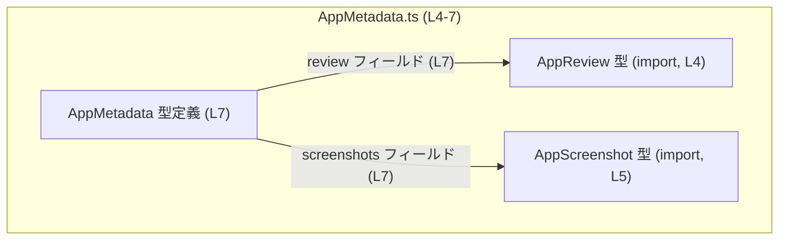
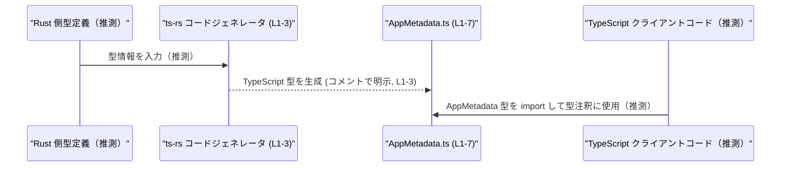
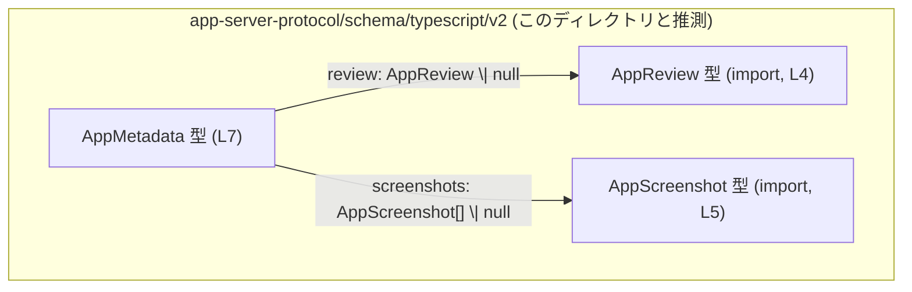
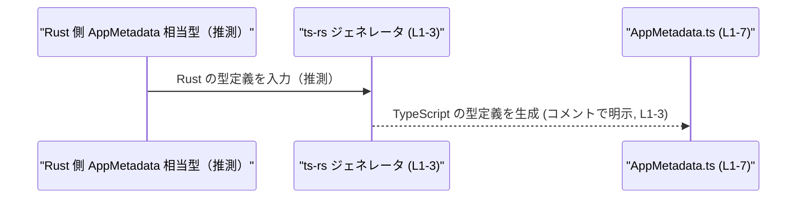

# app-server-protocol/schema/typescript/v2/AppMetadata.ts

## 0. ざっくり一言

`AppMetadata` 型は、アプリケーションのレビュー情報やカテゴリ、バージョン情報などの「メタデータ一式」をまとめて表現するための TypeScript 型定義です（AppMetadata.ts:L4-7）。

---

## 1. このモジュールの役割

### 1.1 概要

- このモジュールは、アプリに関するメタデータ構造を TypeScript 上で表現するために存在します（AppMetadata.ts:L7）。
- Rust 側の定義から `ts-rs` によって自動生成されたコードであり、手動で編集しないことが明示されています（AppMetadata.ts:L1-3）。
- レビュー (`AppReview`) やスクリーンショット (`AppScreenshot`) など、別ファイルで定義された型を組み合わせ、クライアントコードが利用するデータスキーマを提供します（AppMetadata.ts:L4-5,7）。

### 1.2 アーキテクチャ内での位置づけ

このファイル単体から分かるのは、`AppMetadata` が他の型に依存する「集約的なメタデータ型」である、という構造です。



- `AppMetadata` は `AppReview` 型と `AppScreenshot` 型を import しており（AppMetadata.ts:L4-5）、それぞれを `review` と `screenshots` フィールドとして参照します（AppMetadata.ts:L7）。
- `AppReview` / `AppScreenshot` の中身はこのチャンクには現れないため、不明です。

また、コメントから、Rust の型定義 → `ts-rs` コードジェネレータ → 本ファイル → TypeScript クライアントコードという生成フローがあることが示唆されます（AppMetadata.ts:L1-3）。



- Rust 側やクライアント側の具体的なコードはこのチャンクには現れないため、「推測」と明記しています。

### 1.3 設計上のポイント

コードから読み取れる設計上の特徴は次の通りです。

- **自動生成コードであることが明示**  
  - ヘッダコメントで「GENERATED CODE」「Do not edit manually」と明記されています（AppMetadata.ts:L1,3）。
- **ロジックを持たない純粋なデータ型**  
  - import と type alias 以外に関数・クラスなどは定義されていません（AppMetadata.ts:L4-7）。
- **nullable なフィールド設計**  
  - すべてのフィールドが `T | null` という union 型で定義されており、「値が存在しない」状態を null で表現します（AppMetadata.ts:L7）。
- **配列は `Array<...>` で表現**  
  - `categories`, `subCategories`, `screenshots` はそれぞれ配列型と null の union です（AppMetadata.ts:L7）。
- **構造体ではなく type alias**  
  - `export type AppMetadata = { ... }` という形で、構造を持つオブジェクト型への型エイリアスとして定義されています（AppMetadata.ts:L7）。

---

## 2. 主要な機能一覧

このモジュールはロジックを持たず、1つのデータ構造のみを提供します。

- `AppMetadata` 型: アプリケーションのレビュー、カテゴリ、バージョンなどのメタデータをひとまとめにしたオブジェクト型（AppMetadata.ts:L7）。

---

## 3. 公開 API と詳細解説

### 3.1 コンポーネントインベントリー（型一覧）

このチャンクに現れる型・インポートの一覧です。

| 名前           | 種別            | 役割 / 用途                                                                                           | 根拠 |
|----------------|-----------------|--------------------------------------------------------------------------------------------------------|------|
| `AppMetadata`  | 型エイリアス    | アプリのメタデータ全体（レビュー、カテゴリ、バージョン情報など）を保持するオブジェクト型            | AppMetadata.ts:L7 |
| `AppReview`    | import された型 | レビュー情報を表す型。`review` フィールドの型として参照されるが、定義内容はこのチャンクにはない     | AppMetadata.ts:L4,7 |
| `AppScreenshot`| import された型 | スクリーンショット情報を表す型。`screenshots` フィールドの型として参照されるが、定義内容は不明       | AppMetadata.ts:L5,7 |

#### `AppMetadata` のフィールド一覧

`AppMetadata` は次のフィールドを持つオブジェクト型です（AppMetadata.ts:L7）。

| フィールド名                   | 型                                 | 説明（推測を含む／仕様はコードからは不明）                               | 根拠 |
|--------------------------------|------------------------------------|-------------------------------------------------------------------------|------|
| `review`                       | `AppReview \| null`               | アプリのレビュー情報。レビューが存在しない場合は `null`                 | AppMetadata.ts:L7 |
| `categories`                   | `Array<string> \| null`           | アプリが属するカテゴリ名の配列。未設定時や不明時は `null`              | AppMetadata.ts:L7 |
| `subCategories`                | `Array<string> \| null`           | サブカテゴリ名の配列。未設定時などは `null`                            | AppMetadata.ts:L7 |
| `seoDescription`               | `string \| null`                  | 検索エンジン向けの説明文（SEO 用）。未設定時は `null`                  | AppMetadata.ts:L7 |
| `screenshots`                  | `Array<AppScreenshot> \| null`    | スクリーンショット情報の配列。スクリーンショットが無い場合は `null`    | AppMetadata.ts:L7 |
| `developer`                    | `string \| null`                  | 開発者名などの表示用文字列。未登録時は `null`                          | AppMetadata.ts:L7 |
| `version`                      | `string \| null`                  | アプリのバージョン番号。未知の場合は `null`                            | AppMetadata.ts:L7 |
| `versionId`                    | `string \| null`                  | バージョンを識別するID。`version` と同一かどうかはコードからは不明     | AppMetadata.ts:L7 |
| `versionNotes`                 | `string \| null`                  | バージョンのリリースノート等の説明文                                   | AppMetadata.ts:L7 |
| `firstPartyType`               | `string \| null`                  | ファーストパーティ区分を表す識別子と推測されるが詳細は不明            | AppMetadata.ts:L7 |
| `firstPartyRequiresInstall`    | `boolean \| null`                 | ファーストパーティで別途インストールが必要かどうかを示すと推測される   | AppMetadata.ts:L7 |
| `showInComposerWhenUnlinked`   | `boolean \| null`                 | 「未リンク時にコンポーザに表示するか」を制御するフラグと推測される     | AppMetadata.ts:L7 |

> 説明欄の文言はフィールド名からの推測を含みます。仕様はこのファイル単体からは確定できません。

**型システム上のポイント（TypeScript 特有の観点）**

- すべてのプロパティは **「存在はするが値が `null` になり得る」** という設計です。  
  - プロパティ自体に `?` は付いていないため、省略（`undefined`）ではなく `null` で「値なし」を表現します（AppMetadata.ts:L7）。
  - strictNullChecks が有効な場合、`null` の可能性に対してコンパイル時にチェックが入ります。

### 3.2 関数詳細

このファイルには関数・メソッド・クラスなどの「実行時ロジック」は定義されていません（AppMetadata.ts:L1-7）。  
したがって、関数詳細テンプレートに該当する対象はありません。

### 3.3 その他の関数

- 該当なし（関数定義が存在しないため）（AppMetadata.ts:L1-7）。

---

## 4. データフロー

このファイルは型定義のみを含むため、実行時の処理フローは記述されていませんが、**型レベル・生成レベル** のフローは次のように整理できます。

### 4.1 型レベルの依存関係フロー



- `AppMetadata` は `AppReview` と `AppScreenshot` をフィールドとして参照します（AppMetadata.ts:L4-5,7）。
- `categories` や `seoDescription` など、プリミティブ型やその配列については、追加の依存はありません（AppMetadata.ts:L7）。

### 4.2 生成フロー（コード生成の観点）

コメントから読み取れる生成フローです（AppMetadata.ts:L1-3）。



- 実際の Rust 側の型宣言や ts-rs の設定は、このチャンクには現れないため不明です。
- 生成された `AppMetadata` は、その後 TypeScript コードから `import type` で参照されると考えられますが、その呼び出し元もこのチャンクには現れません。

---

## 5. 使い方（How to Use）

### 5.1 基本的な使用方法

`AppMetadata` は型エイリアスなので、主に「**値の型注釈**」として利用します。

```typescript
// AppMetadata 型をインポートする（パスはこのファイルと同じ場所を想定）
import type { AppMetadata } from "./AppMetadata";  // AppMetadata.ts から型をインポート

// API などから取得した生データに AppMetadata 型を付ける例
const metadata: AppMetadata = {
    review: null,                                  // レビューがまだない場合
    categories: ["productivity", "tools"],         // カテゴリ配列（string[]）
    subCategories: null,                           // サブカテゴリは未設定
    seoDescription: "A powerful productivity app", // SEO 用説明文
    screenshots: null,                             // スクリーンショット未登録
    developer: "Example Inc.",                     // 開発者名
    version: "1.2.3",                              // 表示用バージョン
    versionId: "app-123-v1-2-3",                   // 内部識別用 ID として想定
    versionNotes: "Initial release",               // リリースノート
    firstPartyType: "internal",                    // ファーストパーティ区分（例）
    firstPartyRequiresInstall: false,              // インストール不要
    showInComposerWhenUnlinked: true,              // 未リンク時もコンポーザに表示
};
```

- フィールドは省略不可で、`null` を含めてすべてのキーを埋める必要があります（AppMetadata.ts:L7）。
- TypeScript の型チェックにより、フィールド名のスペルミスや不正な型の代入がコンパイル時に検出されます。

### 5.2 よくある使用パターン

#### パターン1: null チェックと安全な参照

`AppMetadata` の各フィールドは `T | null` なので、利用時は null チェックが必要です。

```typescript
import type { AppMetadata } from "./AppMetadata";

// metadata を受け取り、レビューがあれば表示する例
function printReviewSummary(metadata: AppMetadata): void {
    if (metadata.review) {                         // null でないことをチェック
        // ここでは review が AppReview 型として扱える想定
        // review の具体的なフィールドはこのチャンクからは不明
        console.log("Review exists.");             // 実際は詳細情報を出力する
    } else {
        console.log("No review yet.");
    }
}
```

- TypeScript の **型ガード**（`if (metadata.review)`）により、ブロック内では `review` が `AppReview` 型として扱えるようになります。

#### パターン2: 部分更新（null を維持しながらの更新）

`AppMetadata` は多くのフィールドを持つため、部分的に更新するケースが考えられます（一般的な TypeScript の利用パターンです）。

```typescript
import type { AppMetadata } from "./AppMetadata";

function withUpdatedVersion(
    metadata: AppMetadata,
    version: string,
    versionNotes: string | null,
): AppMetadata {
    return {
        ...metadata,                // 既存のフィールドを展開
        version,                    // version を上書き
        versionNotes,               // versionNotes を上書き（null も許容）
    };
}
```

- `AppMetadata` 自体は immutable か mutable かの制約を持たない単なる型なので、設計方針に応じて関数型／ミューテーション型、どちらの更新スタイルも取り得ます。

### 5.3 よくある間違い

#### 間違い例: null の可能性を無視して使う

```typescript
import type { AppMetadata } from "./AppMetadata";

function showSeo(metadata: AppMetadata) {
    // 間違い例: seoDescription が null の可能性を無視している
    // strictNullChecks が有効ならコンパイルエラー、無効なら実行時に .toUpperCase() で落ちる可能性がある
    console.log(metadata.seoDescription.toUpperCase());
}
```

#### 正しい例: null チェックまたは ?? を使う

```typescript
function showSeoSafe(metadata: AppMetadata) {
    const desc = metadata.seoDescription ?? "No description"; // null の場合はデフォルト文言
    console.log(desc.toUpperCase());                          // ここでは desc は string 型
}
```

- `T \| null` なフィールドをそのまま string や boolean として扱うと、型安全性が失われるか、実行時エラーの原因になります。

### 5.4 使用上の注意点（まとめ）

- **null を前提にすること**  
  すべてのフィールドが `... \| null` であるため、利用時に null チェックを行うか、`??` などでデフォルト値を用意する必要があります（AppMetadata.ts:L7）。
- **フィールドを省略しないこと**  
  型としてはプロパティ省略（`undefined`）ではなく `null` で「情報なし」を表現します。オブジェクト作成時には全フィールドを指定する前提です（AppMetadata.ts:L7）。
- **生成ファイルを直接編集しないこと**  
  コメントに明記されている通り、手動での編集は意図されていません（AppMetadata.ts:L1,3）。  
  変更は元の Rust 型または ts-rs 設定側で行う必要があります（Rust 側コードはこのチャンクには現れません）。
- **TypeScript 特有の安全性**  
  - 型チェックにより、フィールド名や型の誤りはコンパイル時に検出されます。
  - ただし、`any` へのキャストや `as AppMetadata` のような強制的な型アサーションを使うと、この安全性が失われる点に注意が必要です。

---

## 6. 変更の仕方（How to Modify）

### 6.1 新しい機能（フィールド）を追加する場合

- 先頭コメントに「GENERATED CODE」「Do not edit this file manually」とあるため（AppMetadata.ts:L1,3）、**このファイルを直接編集することは推奨されていません**。
- 一般的には、次のような手順になります（Rust/ts-rs 側の詳細はこのチャンクには現れないため、あくまで構成からの推測です）:
  1. Rust 側の対応する構造体または型に新しいフィールドを追加する。
  2. `ts-rs` のコード生成を再実行し、新しい TypeScript 型を生成する。
  3. 生成された `AppMetadata.ts` に、新しいフィールドが自動的に反映される。
- TypeScript 側で直接フィールドを追加すると、次回の自動生成で上書きされる可能性が高い点に注意が必要です。

### 6.2 既存の機能（フィールド型・名前）を変更する場合

- 同様に、このファイル自体の編集ではなく、**元の Rust 型定義の変更 → ts-rs の再生成**が前提になります（AppMetadata.ts:L1-3）。
- 変更時に注意すべき点:
  - `null` を許容していたフィールドを非 null に変更すると、既存の TypeScript コード側での null チェックロジックと整合性が取れなくなる可能性があります。
  - フィールド名の変更は、`AppMetadata` を使用しているあらゆる TypeScript コードに影響します。検索・置換や型エラーを頼りに、利用箇所をすべて更新する必要があります。
  - 配列型 → 単一値（またはその逆）といった変更は、呼び出し側のループ処理や UI 表示ロジックに影響しやすい点に注意が必要です。

---

## 7. 関連ファイル

このチャンクに明示的に現れる関連ファイルは次の通りです。

| パス（import 文字列） | 役割 / 関係                                                                                   | 根拠 |
|------------------------|-----------------------------------------------------------------------------------------------|------|
| `./AppReview`         | `AppReview` 型を提供するモジュール。`AppMetadata.review` フィールドの型として利用される      | AppMetadata.ts:L4,7 |
| `./AppScreenshot`     | `AppScreenshot` 型を提供するモジュール。`AppMetadata.screenshots` フィールドの要素型として利用 | AppMetadata.ts:L5,7 |

- これらのファイルの中身（フィールド構造やロジック）は、このチャンクには現れないため不明です。
- ただし、`AppMetadata` を理解・利用するうえで、`AppReview` と `AppScreenshot` の構造は実務上重要になると考えられます。
