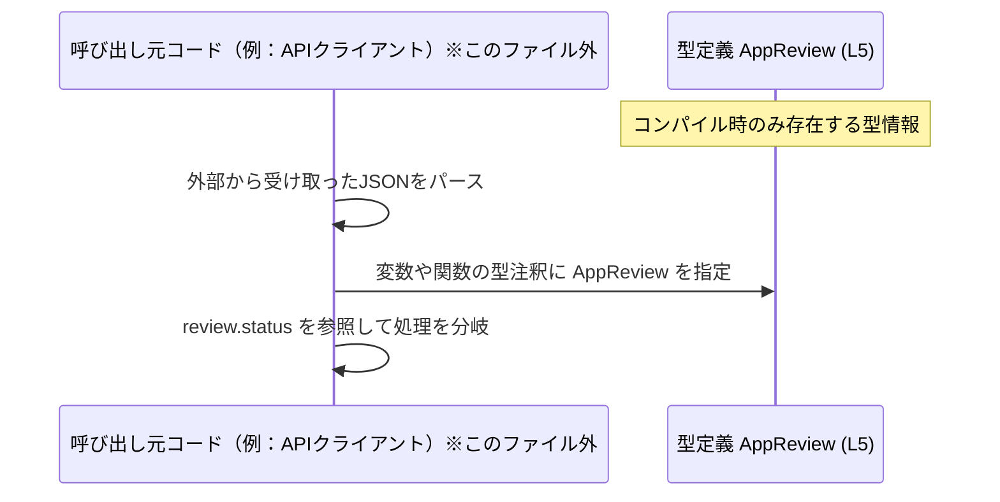

# app-server-protocol\schema\typescript\v2\AppReview.ts

## 0. ざっくり一言

- `status: string` を 1 つだけ持つ `AppReview` というオブジェクト型を、TypeScript で定義している自動生成ファイルです（`AppReview.ts:L1-3, L5-5`）。

---

## 1. このモジュールの役割

### 1.1 概要

- このモジュールは、`AppReview` という名前の TypeScript 型を提供します（`AppReview.ts:L5-5`）。
- `AppReview` はオブジェクト型で、必須プロパティ `status: string` を 1 つだけ持ちます（`AppReview.ts:L5-5`）。
- ファイル先頭に「自動生成コード」「手で編集しないこと」が明示されており、Rust 側から `ts-rs` によって生成されていることが分かります（`AppReview.ts:L1-3`）。

```ts
// GENERATED CODE! DO NOT MODIFY BY HAND!                       // 手で編集しないことが明記されている
// This file was generated by [ts-rs](https://github.com/...)   // ts-rs により生成されたことがコメントされている
export type AppReview = { status: string, };                    // AppReview 型の定義
```

### 1.2 アーキテクチャ内での位置づけ

- ファイルパスから、この型は `app-server-protocol` の `schema/typescript/v2` に属する **プロトコル v2 向けの TypeScript スキーマの一部** であることが分かります。
- このファイル自身は他のモジュールを `import` しておらず、**依存を持たない純粋な型定義モジュール**です（`AppReview.ts:L1-5`）。
- 逆に、どのモジュールが `AppReview` を `import` しているかは、このチャンクからは分かりません（このチャンクには現れません）。

依存関係を示す（依存を持たない）簡単な図です。


### 1.3 設計上のポイント

- **自動生成コード**  
  - `ts-rs` により生成されることと、手動変更禁止がコメントで明示されています（`AppReview.ts:L1-3`）。
- **シンプルなオブジェクト型**  
  - `status: string` という 1 つの必須プロパティだけを持つオブジェクト型として定義されています（`AppReview.ts:L5-5`）。
- **型エイリアス (`type`) の採用**  
  - `interface` ではなく `export type AppReview = { ... }` という **型エイリアス**として定義されており、構造はそのまま `{ status: string }` の別名です（`AppReview.ts:L5-5`）。
- **ランタイム非依存**  
  - TypeScript の型定義だけであり、ランタイム処理・エラーハンドリング・並行処理に関わるコードは一切ありません（`AppReview.ts:L1-5`）。

---

## 2. 主要な機能一覧

このファイルが提供するのは 1 つの公開型のみです。

- `AppReview` 型: `status: string` を持つオブジェクト型（`AppReview.ts:L5-5`）。

---

## 3. 公開 API と詳細解説

### 3.1 型一覧（構造体・列挙体など）

#### コンポーネントインベントリー（このチャンク）

| 名前        | 種別                         | 役割 / 用途（このファイルから読み取れる範囲）                     | 定義位置                |
|-------------|------------------------------|--------------------------------------------------------------------|-------------------------|
| `AppReview` | 型エイリアス（オブジェクト） | `status: string` を 1 つ持つオブジェクト型。用途はファイルからは不明。 | `AppReview.ts:L5-5`     |

##### `AppReview` 型の構造

- 形: オブジェクト型エイリアス（`export type AppReview = { ... }`）（`AppReview.ts:L5-5`）
- プロパティ:

| プロパティ名 | 型       | 必須/任意 | 説明（このファイルから読み取れる範囲）             | 定義位置            |
|--------------|----------|----------|-----------------------------------------------------|---------------------|
| `status`     | `string` | 必須     | 文字列型のステータス。値の内容や候補は不明。       | `AppReview.ts:L5-5` |

この型定義からは、`status` の内容（例: `"approved"`, `"rejected"` など）や意味までは読み取れません。

### 3.2 関数詳細（最大 7 件）

このファイルには **関数・メソッドが一切定義されていない** ため、詳細解説の対象となる関数はありません（`AppReview.ts:L1-5`）。

### 3.3 その他の関数

- なし（このチャンクには関数・メソッド・クラスは現れません）。

---

## 4. データフロー

このファイルは型定義のみで実装コードを含まないため、**具体的な呼び出し関係はこのチャンクには現れません**。  
ここでは、TypeScript 型という観点からの **一般的な利用イメージ** を示します（実際のリポジトリ構造はこのチャンクからは分かりません）。

### 4.1 概念的な利用フロー（例）



- `AppReview` 型自体は **コンパイル時のみ存在する型**であり、実行時には消えます。
- 実際にどのモジュールが `AppReview` を利用しているかは、このファイルからは分かりません（不明）。

---

## 5. 使い方（How to Use）

ここからは、この `AppReview` 型を **他の TypeScript コードから利用する典型例**を示します。  
※以下のコードはあくまで例であり、インポートパスなどは実際のプロジェクト構成に合わせて調整が必要です。

### 5.1 基本的な使用方法

#### 例1: 変数に型を付けて利用する

```ts
import type { AppReview } from "./AppReview";          // AppReview 型をインポート（実際のパスに合わせて変更する）

const review: AppReview = {                            // review 変数に AppReview 型を明示する
  status: "approved",                                  // 必須プロパティ status に文字列を代入
};                                                     // review は { status: string } 型のオブジェクトとして扱われる
```

このコードでは、`status` を省略したり `number` など別の型を代入すると、コンパイルエラーになります。

#### 例2: 関数の引数・戻り値に使う

```ts
import type { AppReview } from "./AppReview";                 // AppReview 型をインポート

function handleReview(review: AppReview): void {              // 引数 review に AppReview 型を指定
  console.log(review.status);                                 // status プロパティに型安全にアクセスできる
}                                                             // 戻り値は void（何も返さない）
```

### 5.2 よくある使用パターン

- **API レスポンスの型として使う（典型パターン）**

```ts
import type { AppReview } from "./AppReview";                 // 型定義をインポート

async function fetchAppReview(id: string): Promise<AppReview> {  // 戻り値の型に AppReview を指定
  const res = await fetch(`/api/apps/${id}/review`);             // API から HTTP レスポンスを取得
  const json = await res.json();                                 // JSON をパース（型は any 相当）
  // 実際にはここで runtime バリデーションを行うのが望ましい
  return json as AppReview;                                      // AppReview として扱う（型アサーション）
}
```

- **Redux などの状態管理でステート型として使う**  
  （具体的な利用コードはこのチャンクには現れませんが、一般的な使用方法として）

### 5.3 よくある間違い

```ts
import type { AppReview } from "./AppReview";

// 間違い例1: 必須プロパティ status がない
const invalid1: AppReview = {};                         // エラー: プロパティ 'status' が存在しない

// 間違い例2: 型が一致しない
const invalid2: AppReview = { status: 123 };            // エラー: number は string に代入できない

// 間違い例3: プロパティ名のタイプミス
const invalid3: AppReview = { statsu: "approved" };     // エラー: 'statsu' は期待されていないプロパティ
```

これらはすべて **コンパイル時エラー** として検出されます。  
実行時には TypeScript の型情報が存在しないため、外部から受け取ったオブジェクトを安全に扱うには別途バリデーションが必要です。

### 5.4 使用上の注意点（まとめ）

- `status` は必須プロパティであり、常に `string` 型であることを前提とされています（`AppReview.ts:L5-5`）。
- この型定義からは `status` の値の範囲（例: `"approved"`, `"rejected"` のみ許容 など）は分かりません。  
  ビジネスルールがある場合は、別途バリデーションや文字列リテラル型（ユニオン）で表現する必要があります。
- TypeScript の構造的型付けにより、`AppReview` 型変数には `status` 以外のプロパティを持つオブジェクトも代入できます（ただしリテラル代入時の余剰プロパティチェックは別途働きます）。
- このファイルにはランタイムコードがないため、スレッド安全性・並行性・I/O に関する注意点は存在しません。

---

## 6. 変更の仕方（How to Modify）

### 6.1 新しい機能（プロパティ）を追加する場合

- ファイル先頭に「GENERATED CODE」「Do not edit this file manually」とあり（`AppReview.ts:L1-3`）、**手動での編集は想定されていません**。
- ts-rs により生成されることから、プロパティ追加などの変更は、
  - この TypeScript ファイルではなく
  - **元になっている Rust 側の型定義や ts-rs の設定**
  
  に対して行う必要があります（元の Rust ファイルの場所はこのチャンクには現れません）。

### 6.2 既存の機能（プロパティ）を変更する場合

- `status` の型を `string` 以外に変更したい場合も、同様に **Rust 側の型定義を変更してから再生成**するのが前提になります。
- この TypeScript ファイルを直接編集すると、次回の自動生成時に上書きされる可能性が高く、一貫性が失われます。

---

## 7. 関連ファイル

このチャンクには `AppReview` を利用するコードや、生成元の Rust ファイルへの参照は現れません。

| パス / 種別 | 役割 / 関係 |
|-------------|------------|
| （不明）Rust 側の元型 | コメントから ts-rs による自動生成であることは分かりますが、どの Rust ファイル・型から生成されているかはこのチャンクには現れません（`AppReview.ts:L1-3`）。 |
| （不明）利用側 TypeScript ファイル | `AppReview` を `import` して利用しているモジュールは、このチャンクには現れません。 |

---

## 付録: 安全性・エッジケース・テスト・性能などの観点

このファイルは非常に小さいので、まとめて補足します。

### Bugs / Security の観点

- このファイル自体にはロジックがないため、**直接のバグや脆弱性は含まれません**。
- ただし、TypeScript の型は **実行時には存在しない** ため、外部入力（API レスポンスなど）を `AppReview` として扱う場合、
  - 実際のオブジェクトが `{ status: string }` であることを
  - ランタイムで検証しない限り保証できません。
- 型と実データの不整合により、アプリケーションロジック上のバグや想定外の動作が起こりうる点は注意が必要です。

### 契約（Contracts）とエッジケース

- 契約として読み取れるのは「`status` プロパティが存在し、型が `string` である」という点のみです（`AppReview.ts:L5-5`）。
- 文字列が空 `""`、非常に長い文字列、予期しない文字列などであっても、この型定義上は許容されます。
- 値の内容に関する制約はこのファイルからは読み取れず、別途ビジネスロジック側の契約・バリデーションが必要です。

### テスト

- このファイルにはテストコードは含まれていません。
- 型定義に対するテストは通常、型レベルのコンパイルテスト（型が期待どおりに機能するか）や、元の Rust 型と JSON スキーマの整合性テストなど別レイヤーで行うことになりますが、その有無はこのチャンクからは不明です。

### 性能・スケーラビリティの観点

- 型定義だけのファイルであり、**実行時の性能やスケーラビリティに直接の影響はありません**。
- コンパイル時間への影響も、この程度の小さな型定義であれば実質無視できるレベルです。

### トレードオフ・リファクタリング・観測性

- **トレードオフ**
  - `status` を単なる `string` にしているため、柔軟ですが、値の制約が型に表現されていません。
  - より厳密にしたい場合は、例えば `"approved" | "rejected" | "pending"` のような文字列リテラルユニオン型にする選択肢がありますが、そのような変更は元の Rust 型と生成設定次第であり、このチャンクからは不明です。
- **リファクタリング**
  - 実際の変更は Rust 側の型定義を通じて行う前提であり、TypeScript ファイル側のリファクタリング余地はほとんどありません。
- **観測性（ログ・メトリクス）**
  - このファイル自体は型定義のみで、ログ出力やメトリクス収集のコードは含まれていません。
  - `AppReview` 型の値がどのようにログ・トレースに出るかは、利用側の実装に依存します（このチャンクには現れません）。
