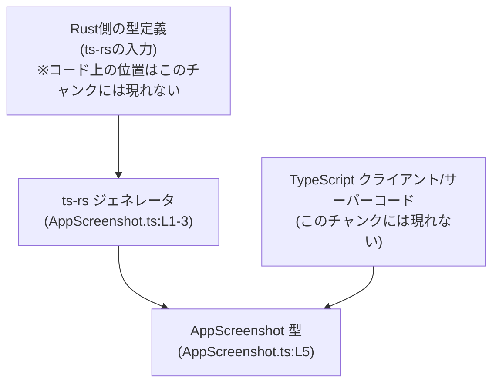
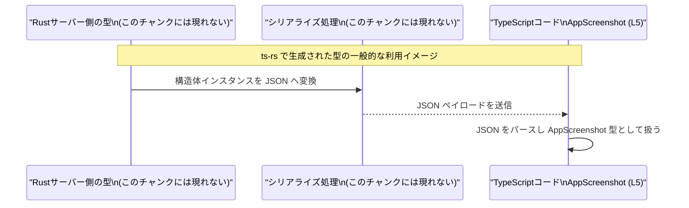

# app-server-protocol/schema/typescript/v2/AppScreenshot.ts コード解説

## 0. ざっくり一言

`AppScreenshot` という 1 つの型エイリアスを定義し、`url`・`fileId`・`userPrompt` の 3 つのプロパティを持つオブジェクト形状を表現する自動生成の TypeScript スキーマ定義ファイルです（根拠: AppScreenshot.ts:L1-5）。

---

## 1. このモジュールの役割

### 1.1 概要

- このモジュールは、`AppScreenshot` 型を通じて「`url`・`fileId`・`userPrompt` を持つオブジェクト」の構造を TypeScript の型として表現します（根拠: AppScreenshot.ts:L5）。
- ファイル先頭のコメントから、この型定義は [`ts-rs`](https://github.com/Aleph-Alpha/ts-rs) によって自動生成されており、手動編集は前提にしていないことが分かります（根拠: AppScreenshot.ts:L1-3）。

### 1.2 アーキテクチャ内での位置づけ

このファイル自体には import/export 以外の依存関係情報は含まれていません（根拠: AppScreenshot.ts:L5）。  
ただしコメントから、Rust 側の型を `ts-rs` が変換した結果としてこの TypeScript 型が存在する、という一般的な構造が読み取れます（根拠: AppScreenshot.ts:L1-3）。



この図は、ts-rs を用いた一般的な構成を表しており、このリポジトリ固有の詳細な位置づけ（具体的な Rust 型名や呼び出し元ファイル）は、このチャンクからは分かりません。

### 1.3 設計上のポイント

- **自動生成コード**  
  - `// GENERATED CODE! DO NOT MODIFY BY HAND!` と明示されており（根拠: AppScreenshot.ts:L1）、人手による編集を前提としていません。
- **型定義のみ・ロジックなし**  
  - `export type AppScreenshot = { ... }` という 1 行のみで型を定義しており（根拠: AppScreenshot.ts:L5）、関数やクラスなどの実行時ロジックは一切含まれていません。
- **nullable プロパティ**  
  - `url` と `fileId` は `string | null` 型であり、「プロパティ自体は必須だが値として `null` を取りうる」という形で表現されています（根拠: AppScreenshot.ts:L5）。
- **TypeScript のみの安全性**  
  - このファイルは型レベルの情報だけを提供し、実行時のバリデーションやエラーハンドリングは別のコードに委ねられます。そのため、型安全性はコンパイル時までであり、実行時のデータ整合性は利用側次第です。

---

## 2. 主要な機能一覧

このファイルが提供する「機能」は、型定義 1 件だけです。

- `AppScreenshot` 型定義: `url`・`fileId`・`userPrompt` を持つオブジェクト形状を表現する TypeScript の型エイリアス（根拠: AppScreenshot.ts:L5）。

---

## 3. 公開 API と詳細解説

### 3.1 型一覧（構造体・列挙体など）

#### コンポーネントインベントリー

| 名前           | 種別         | 役割 / 用途                                                                                  | 定義位置                      |
|----------------|--------------|----------------------------------------------------------------------------------------------|--------------------------------|
| `AppScreenshot` | 型エイリアス | `url`・`fileId`・`userPrompt` をプロパティに持つオブジェクト形状を表す型。型情報共有・型チェックに利用されます。 | `AppScreenshot.ts:L5-5` |

#### `AppScreenshot` フィールド詳細

`AppScreenshot` は以下の 3 プロパティを持つオブジェクト型として定義されています（根拠: AppScreenshot.ts:L5）。

| フィールド名  | 型              | 必須 / nullable                   | 説明（コードから分かる範囲）                                          | 根拠                          |
|---------------|-----------------|-----------------------------------|------------------------------------------------------------------------|-------------------------------|
| `url`         | `string \| null` | 必須 / 値は `null` 許可          | 文字列または `null` を持つプロパティ。URL らしき名前ですが、内容制約は型からは分かりません。 | AppScreenshot.ts:L5          |
| `fileId`      | `string \| null` | 必須 / 値は `null` 許可          | 文字列または `null` を持つプロパティ。ファイル識別子を示す名前ですが、詳細は不明です。       | AppScreenshot.ts:L5          |
| `userPrompt`  | `string`        | 必須 / `null` 不可               | 必須の文字列プロパティ。プロンプト内容を示す名前ですが、内容制約はコードからは分かりません。 | AppScreenshot.ts:L5          |

ここで「必須」は「プロパティがオブジェクトに必ず存在する」ことを意味し、`?` が付いていないことから読み取れます（根拠: AppScreenshot.ts:L5）。  
`url` / `fileId` は `null` を許容しますが、`undefined` は型上許容されません。

### 3.2 関数詳細（最大 7 件）

このファイルには関数・メソッド定義は一切存在しません（根拠: AppScreenshot.ts:L1-5）。  
そのため、このセクションで詳細解説すべき関数はありません。

### 3.3 その他の関数

同様に、補助関数・ラッパー関数も定義されていません（根拠: AppScreenshot.ts:L1-5）。

---

## 4. データフロー

このファイルには関数呼び出しや処理ロジックがないため、コード上に直接記述されたデータフローは存在しません（根拠: AppScreenshot.ts:L1-5）。

以下は、ts-rs で自動生成された型定義が一般的にどう使われるかのイメージです。  
このリポジトリ固有の仕様として確定できるものではなく、ts-rs の一般的な利用パターンに基づく説明です。



このファイル単体に並行処理・例外処理などの記述はないため、

- 並行性・スレッド安全性: 型定義のみであり、並行性に関する振る舞いはこのファイルからは読み取れません。
- エラーハンドリング: 実行時エラーや例外は、この型を利用するコード側の責務になります。

---

## 5. 使い方（How to Use）

### 5.1 基本的な使用方法

`AppScreenshot` 型を使ってオブジェクトを定義・利用する、最も単純な例です。

```typescript
// AppScreenshot 型をインポートする                                 // 型のみを利用するので import type が適しています
import type { AppScreenshot } from "./AppScreenshot";              // パスは実際の配置に応じて調整

// AppScreenshot 型の値を作る                                       // 3 つのプロパティすべてが必須
const screenshot: AppScreenshot = {                                // screenshot 変数は AppScreenshot 型
    url: "https://example.com/screenshot.png",                     // url は string | null 型なので文字列を設定
    fileId: null,                                                  // fileId も string | null 型なので null も許容
    userPrompt: "ホーム画面のスクリーンショットを撮影してください",  // userPrompt は null 非許容の string
};

// 型に基づく安全なアクセス                                          // TypeScript がプロパティ名・型をチェック
console.log(screenshot.userPrompt.toUpperCase());                  // userPrompt は string なので文字列メソッドが使える
```

**ポイント**

- 3 つのプロパティはすべて必須で、省略するとコンパイルエラーになります（根拠: AppScreenshot.ts:L5）。
- `url` / `fileId` は `null` を許容するため、実際の値がまだ存在しない段階などで `null` を設定できます。

### 5.2 よくある使用パターン

#### 5.2.1 関数の引数・戻り値として使う

`AppScreenshot` はデータの形を表す型なので、関数の入出力に使うのが典型的です。

```typescript
import type { AppScreenshot } from "./AppScreenshot";             // AppScreenshot 型をインポート

// AppScreenshot 型を受け取ってログを出す関数                       // 入力の構造が型で保証される
function logScreenshot(info: AppScreenshot): void {               // info は url, fileId, userPrompt を必ず持つ
    console.log("prompt:", info.userPrompt);                      // userPrompt は string として安全にアクセスできる
    console.log("url:", info.url);                                // url は string | null なので null の可能性を考慮
    console.log("fileId:", info.fileId);                          // fileId も string | null
}

// 呼び出し例                                                       // 型に合致したオブジェクトを渡す
logScreenshot({
    url: null,                                                    // URL がまだない場合など
    fileId: "file-123",
    userPrompt: "設定画面を表示してください",
});
```

#### 5.2.2 `null` をチェックするパターン

`url` / `fileId` は `null` になりえるため、使用前にチェックするコードが一般的です。

```typescript
import type { AppScreenshot } from "./AppScreenshot";             // 型をインポート

function openScreenshot(info: AppScreenshot): void {
    // url が null でない場合だけ処理を行う                          // null チェックで string に絞り込める
    if (info.url !== null) {
        // ここでは info.url は string 型とみなされる               // TypeScript の型ガードが働く
        console.log("Opening screenshot at", info.url);
    } else {
        console.log("URL is not available yet");
    }
}
```

### 5.3 よくある間違い

この型の形から起こりやすい誤用の例を挙げます。

```typescript
import type { AppScreenshot } from "./AppScreenshot";

// 間違い例: 必須プロパティを省略している
const a: AppScreenshot = {
    // url を省略している                                          // 型上は必須なのでコンパイルエラー
    fileId: null,
    userPrompt: "prompt",
};

// 間違い例: null ではなく undefined を使っている
const b: AppScreenshot = {
    url: undefined,                                               // string | null なので undefined は許容されない
    fileId: null,
    userPrompt: "prompt",
};

// 正しい例: url を null で明示的に指定する
const c: AppScreenshot = {
    url: null,                                                    // null は許可される
    fileId: null,
    userPrompt: "prompt",
};
```

**注意点**

- `url` / `fileId` は「省略可能（オプショナル）」ではなく「nullable」です。  
  - `url?: string` ではなく `url: string | null` であるため、「キー自体は必須だが値として null を許容」という契約になっています（根拠: AppScreenshot.ts:L5）。
- `undefined` は許容されず、`null` だけが特別扱いされます。

### 5.4 使用上の注意点（まとめ）

- **プロパティはすべて必須**  
  - 3 つのプロパティは必ずオブジェクトに存在させる必要があります（根拠: AppScreenshot.ts:L5）。
- **`url` / `fileId` は `null` 許容**  
  - 実際の利用コードでは、値を使う前に `null` チェックを行う必要があります。
- **実行時チェックは別途必要**  
  - この型は静的な型情報のみを提供します。外部から受け取ったデータがこの形に従っているかどうかは、実行時に別途検証する必要があります。
- **並行性・エラーハンドリング**  
  - 型定義のみであり、並行性や例外処理の戦略はこの型を利用する周辺コード（API クライアントやサーバー側ロジック）に依存します。

---

## 6. 変更の仕方（How to Modify）

### 6.1 新しい機能を追加する場合

このファイルは先頭に「GENERATED CODE! DO NOT MODIFY BY HAND!」とあり（根拠: AppScreenshot.ts:L1）、手動変更は想定されていない設計です。

ts-rs の一般的な利用方法から推測すると、`AppScreenshot` に新しいフィールドを追加したい場合は次のような流れになります（このチャンクから生成元の具体的な場所は分かりません）。

1. ts-rs の入力となる Rust 側の型定義にフィールドを追加する。  
2. ts-rs を再実行して TypeScript 側の型定義を再生成する。  
3. 再生成された `AppScreenshot.ts` をコミットする。

このファイル自体にフィールドを直接追加しても、次回の自動生成で上書きされる可能性があります。

### 6.2 既存の機能を変更する場合

既存のフィールドの型や名前を変更したい場合も、同じく生成元側で変更するのが前提と考えられます。

- 例: `url` を `URL` 型相当の別の表現にしたい場合
  - Rust 側の型定義を変更 → ts-rs で再生成 → TypeScript コードで新しい型に追従。

このチャンクには、生成元の Rust ファイル名や ts-rs の設定ファイルなどは現れないため、正確な変更手順や影響範囲は分かりません。

---

## 7. 関連ファイル

このファイルには import 文・参照コメントなどがなく、直接関係するファイルパスは明示されていません（根拠: AppScreenshot.ts:L1-5）。

| パス | 役割 / 関係 |
|------|------------|
| 不明 | このチャンクには、`AppScreenshot` を生成した元の Rust 型や、この型を利用する他の TypeScript ファイルへの参照が現れていません。 |

一般的には、

- ts-rs の入力となる Rust 側の型定義ファイル
- この `AppScreenshot` 型を import して利用する TypeScript コード

が密接に関係すると考えられますが、具体的な場所や名前は、このチャンクからは判断できません。

---

### Bugs / Security / Contracts / Edge Cases（このファイルから読み取れる範囲）

- **バグ・脆弱性について**
  - 実行時ロジックを持たない型定義のみのファイルであり、このファイル単体にバグや脆弱性になりうる処理は存在しません（根拠: AppScreenshot.ts:L1-5）。
  - セキュリティ上の性質（例えば URL の検証や XSS 対策など）は、この型を利用する実行時コードに委ねられます。

- **契約（Contract）**
  - `AppScreenshot` オブジェクトは必ず `url`, `fileId`, `userPrompt` の 3 プロパティを持つ。
  - `url` / `fileId` は `string` または `null`。`undefined` は不許可。
  - `userPrompt` は `string` であり、`null` や `undefined` は不許可。  
    （いずれも根拠: AppScreenshot.ts:L5）

- **エッジケース**
  - `url` / `fileId` に `null` が来るケース: 利用コードは `null` チェックが必要。
  - 空文字列 `""` や非常に長い文字列などについては、この型からは制約が読み取れません。実行時にどのように扱うかは利用側の設計に依存します。
  - 非同期処理・並行アクセスに関するエッジケースは、このファイルには現れません。
