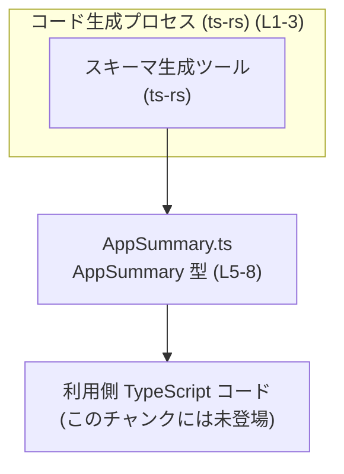
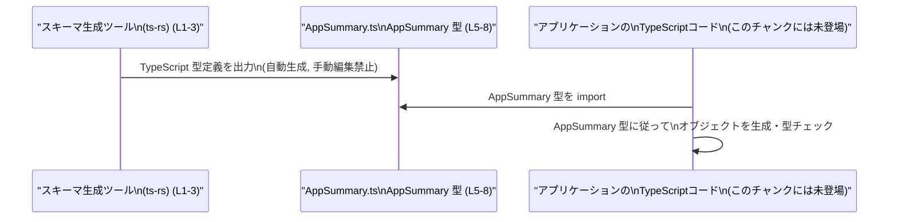

# app-server-protocol/schema/typescript/v2/AppSummary.ts コード解説

## 0. ざっくり一言

`AppSummary` は、プラグインのレスポンスに含める「アプリのメタデータ要約」を表現するための TypeScript 型エイリアスです（AppSummary.ts:L5-8）。  
このファイル自体はコード生成されており、手動での編集は想定されていません（AppSummary.ts:L1-3）。

---

## 1. このモジュールの役割

### 1.1 概要

- このモジュールは、**プラグインレスポンスに含めるアプリ情報の要約（メタデータ）** を型として定義します（AppSummary.ts:L5-8）。
- 型定義のみを提供し、処理ロジックや関数は含みません（AppSummary.ts:L8）。

> コメントに「EXPERIMENTAL - app metadata summary for plugin responses.」とあるため、プラグインレスポンス用のメタデータ要約であることが分かります（AppSummary.ts:L5-6）。

### 1.2 アーキテクチャ内での位置づけ

- このファイルは `ts-rs` によって自動生成される TypeScript スキーマの一部です（AppSummary.ts:L1-3）。
- 外部（生成元）で定義された構造を TypeScript 型としてエクスポートし、アプリケーション側のコードから利用される位置づけです（AppSummary.ts:L8）。

依存関係のイメージ（このファイルに現れる情報のみを基にした抽象的な図）:



※ `TSAppCode` は、この型を利用する側のコードが存在するであろうことを示す抽象ノードであり、本チャンクには具体的な記述はありません。

### 1.3 設計上のポイント

- **自動生成コード**  
  - 冒頭コメントにより、コード生成されたファイルであり、手動編集禁止であることが明示されています（AppSummary.ts:L1-3）。
- **単一の型エイリアスのみ**  
  - 公開 API は `export type AppSummary = ...` の 1 行のみです（AppSummary.ts:L8）。
- **Null 許容フィールド**  
  - `description` と `installUrl` は `string | null` として定義されており、値が存在しないケースを明示的に表現します（AppSummary.ts:L8）。
- **ブール値によるフラグ**  
  - `needsAuth: boolean` で、アプリの利用に認証が必要かどうかを表現します（AppSummary.ts:L8）。
- **状態やロジックを持たない**  
  - 関数・クラスは存在せず、純粋なデータ構造定義のみです（AppSummary.ts:L8）。

---

## 2. 主要な機能一覧

このモジュールは関数を持たないため、「機能」はすべて型レベルの表現です。

- `AppSummary` 型: プラグインレスポンスに含めるアプリの識別情報・表示名・説明・インストール URL・認証要否フラグをまとめて表現する（AppSummary.ts:L5-8）。

---

## 3. 公開 API と詳細解説

### 3.1 型一覧（構造体・列挙体など）

| 名前         | 種別      | 役割 / 用途                                                                                  | 定義位置                    |
|--------------|-----------|---------------------------------------------------------------------------------------------|-----------------------------|
| `AppSummary` | 型エイリアス | プラグインレスポンスに含めるアプリのメタデータ要約を表現するオブジェクト型（id, name 等を含む） | AppSummary.ts:L5-8 |

#### `AppSummary` の構造

`AppSummary` は次のプロパティを持つオブジェクト型として定義されています（AppSummary.ts:L8）。

| プロパティ名  | 型                 | 説明                                                                                   | 定義位置          |
|---------------|--------------------|----------------------------------------------------------------------------------------|-------------------|
| `id`          | `string`           | アプリを一意に識別する ID。文字列として表現されます。                                  | AppSummary.ts:L8  |
| `name`        | `string`           | アプリの表示名。ユーザー向けの名前を想定できますが、コードからは詳細不明です。        | AppSummary.ts:L8  |
| `description` | `string \| null`   | アプリの説明文。説明がない場合や非公開の場合は `null` が入ることを許容します。         | AppSummary.ts:L8  |
| `installUrl`  | `string \| null`   | アプリのインストールページの URL などを文字列で表現すると考えられますが、詳細は不明。 `null` を許容します。 | AppSummary.ts:L8  |
| `needsAuth`   | `boolean`          | アプリの利用に認証が必要かどうかを示すフラグ。真偽値のみを取ります。                  | AppSummary.ts:L8  |

> `description` と `installUrl` が `string | null` となっていることから、「存在しない／未設定」を `null` で表現する設計になっていると読み取れます（AppSummary.ts:L8）。

### 3.2 関数詳細（最大 7 件）

このファイルには関数・メソッド定義が存在しないため、詳細解説対象の関数はありません（AppSummary.ts:L1-8）。

### 3.3 その他の関数

- 関数やユーティリティは一切定義されていません（AppSummary.ts:L1-8）。

---

## 4. データフロー

このファイルには処理ロジックがないため、**型がどのように利用されるか** という観点の「典型的な利用データフロー」を示します。  
図はコード生成コメントと公開型定義から推測できる範囲の抽象モデルです（AppSummary.ts:L1-3, L5-8）。

### 4.1 型生成と利用のフロー（コンパイル・開発時）



このフローから分かるポイント:

- `ts-rs` などの生成ツールが `AppSummary.ts` を出力する（AppSummary.ts:L1-3）。
- アプリケーション側の TypeScript コードは `AppSummary` 型を import し、プラグインレスポンス用のデータ構造として利用すると考えられます（AppSummary.ts:L5-8）。
- 実行時の処理（API 呼び出し・JSON シリアライズなど）は、本チャンクには記述がありません。

---

## 5. 使い方（How to Use）

### 5.1 基本的な使用方法

`AppSummary` 型を利用して、アプリのメタデータを型安全に扱う例です（AppSummary.ts:L8）。

```typescript
// AppSummary 型をインポートする（パスはプロジェクト構成に依存）           // AppSummary.ts から型を読み込む
import type { AppSummary } from "./AppSummary";                                 // import type により型専用インポート

// AppSummary 型に準拠したオブジェクトを作成する                              // すべての必須プロパティを指定
const appSummary: AppSummary = {                                                // appSummary は AppSummary 型になる
    id: "com.example.my-app",                                                   // id: 文字列で一意な識別子
    name: "My Application",                                                     // name: ユーザーに見せるアプリ名
    description: "This is an example application.",                             // description: 説明文（null も可能）
    installUrl: "https://example.com/install",                                  // installUrl: インストール用 URL（null も可能）
    needsAuth: true,                                                            // needsAuth: 認証が必要なら true
};

// 型情報により、存在しないプロパティや型の不一致はコンパイル時に検出されます // TypeScript の静的型チェックが働く
console.log(appSummary.name);                                                   // "My Application" が出力される
```

この例では、`description` と `installUrl` に文字列を与えていますが、`null` も許容されます（AppSummary.ts:L8）。

### 5.2 よくある使用パターン

#### 5.2.1 配列として複数アプリを扱う

複数のアプリ情報をまとめて処理するパターンです。

```typescript
import type { AppSummary } from "./AppSummary";                            // AppSummary 型をインポート

// 複数アプリの要約情報を配列で保持する                                   // AppSummary[] 型の配列
const apps: AppSummary[] = [
    {
        id: "app-1",
        name: "App One",
        description: null,                                                 // 説明がない場合は null
        installUrl: null,                                                  // インストール URL も null を許容
        needsAuth: false,
    },
    {
        id: "app-2",
        name: "App Two",
        description: "Second application.",
        installUrl: "https://example.com/app2",
        needsAuth: true,
    },
];

// 認証が必要なアプリだけを抽出する                                       // needsAuth フラグでフィルタリング
const appsRequiringAuth = apps.filter(app => app.needsAuth);               // 結果も AppSummary[] 型になる
```

#### 5.2.2 `null` を考慮した表示

`description` や `installUrl` が `null` の場合に備えた表示処理の例です（AppSummary.ts:L8）。

```typescript
import type { AppSummary } from "./AppSummary";                               // 型をインポート

function formatAppDescription(app: AppSummary): string {                       // AppSummary を引数に取る関数
    // null の場合はデフォルトメッセージを表示する                            // Null合体演算子 ?? でフォールバック
    const description = app.description ?? "No description provided.";         // description が null ならメッセージに置き換え
    return `${app.name}: ${description}`;                                      // name と説明を連結
}
```

### 5.3 よくある間違い

`string | null` を考慮していないコードは、TypeScript の型チェックエラーや実行時エラーの原因になります（AppSummary.ts:L8）。

```typescript
import type { AppSummary } from "./AppSummary";

// 間違い例: null を考慮せずに string として扱ってしまう
function badUsage(app: AppSummary) {
    // app.description は string | null 型                                  // null の可能性がある
    // 下の行は --strictNullChecks 有効な環境ではコンパイルエラーになる      // 「object is possibly 'null'」
    // console.log(app.description.toUpperCase());
}

// 正しい例: null チェックを行う
function goodUsage(app: AppSummary) {
    if (app.description !== null) {                                           // 先に null かどうかを判定
        console.log(app.description.toUpperCase());                           // string と確定したので安全に呼べる
    } else {
        console.log("Description not available");                             // null の場合のフォールバック処理
    }
}
```

他によくある誤用:

- `description` や `installUrl` を **必須の `string` として型定義を別途書き直してしまう**  
  → 生成コードと矛盾が生じるため、手動で型を変えないことが重要です（AppSummary.ts:L1-3, L8）。

### 5.4 使用上の注意点（まとめ）

- **手動編集禁止**  
  - ファイル先頭に「GENERATED CODE! DO NOT MODIFY BY HAND!」と明記されており（AppSummary.ts:L1）、直接の編集は避ける必要があります。
- **`null` の扱い**  
  - `description` と `installUrl` は `null` を取り得るため、利用時に `null` チェックや `??` 演算子などでのフォールバック処理が必要です（AppSummary.ts:L8）。
- **必須プロパティの網羅**  
  - `id`, `name`, `needsAuth` は `null` を許容しておらず、オブジェクト作成時に必ず指定する必要があります（AppSummary.ts:L8）。
- **型のみの提供**  
  - このモジュールは実行時ロジックを持たないため、バリデーションやセキュリティチェックは別の層で行う必要があります（AppSummary.ts:L1-8）。

---

## 6. 変更の仕方（How to Modify）

### 6.1 新しい機能（フィールド）を追加する場合

- このファイルは `ts-rs` による自動生成であり、「DO NOT MODIFY BY HAND」と明記されています（AppSummary.ts:L1-3）。
- 新しいフィールドを追加したい場合は、**生成元のスキーマ定義** を変更し、再度コード生成を行うのが前提となります。
  - 生成元がどの言語・ファイルかは本チャンクからは分かりませんが、`ts-rs` の存在から、何らかのスキーマ定義が別にあることは確かです（AppSummary.ts:L2-3）。

変更時の一般的なステップ（抽象的な説明）:

1. 生成元の型／スキーマ定義に新しいフィールドを追加する（このチャンクには場所は現れません）。
2. `ts-rs` 等のツールを実行し、`AppSummary.ts` を再生成する（AppSummary.ts:L1-3）。
3. TypeScript 側で `AppSummary` 型の変更に追従するコードを修正・コンパイルする（AppSummary.ts:L8）。

### 6.2 既存の機能（フィールド）を変更する場合

- **フィールド名の変更** や **型の変更（例: `string | null` → `string`）** も、生成元を変更して再生成する必要があります（AppSummary.ts:L1-3, L8）。
- 変更時に注意すべき点:
  - `id`・`name`・`needsAuth` の型を変えると、それを利用する呼び出し側コードが広く影響を受けます（AppSummary.ts:L8）。
  - `description`・`installUrl` の `null` 許容を外すと、既存コードで `null` を前提としている箇所がコンパイルエラーになります（AppSummary.ts:L8）。
- 変更後は:
  - `AppSummary` を参照している全ての TypeScript ファイルで型エラーが出ないか確認する必要があります（AppSummary.ts:L8）。

---

## 7. 関連ファイル

このチャンクには他ファイル名の記述はありませんが、ディレクトリ構成から、同じディレクトリ配下に他のスキーマ定義が存在する可能性があります。

| パス                                             | 役割 / 関係                                                                 |
|--------------------------------------------------|------------------------------------------------------------------------------|
| `app-server-protocol/schema/typescript/v2/*`     | TypeScript 向けのスキーマ定義ファイル群と思われますが、具体的な内容は不明です（このチャンクには現れません）。 |
| `AppSummary.ts`                                  | 本レポート対象ファイル。`AppSummary` 型を定義し、プラグインレスポンスのアプリ要約メタデータを表現します（AppSummary.ts:L5-8）。 |

---

## 付録: 言語固有の安全性・エッジケース・テスト等

### 型安全性

- TypeScript の型チェックにより、`AppSummary` 型のプロパティに不正な型を代入するとコンパイル時に検出されます（AppSummary.ts:L8）。
- `string | null` に対して `strictNullChecks` が有効な場合、`null` を無視したメソッド呼び出しはエラーになります。

### エッジケース（Contracts / Edge Cases）

- **空文字列**  
  - `id` や `name` に空文字列 `""` が許容されるかどうかは、この型からは判断できません。バリデーションは別レイヤで行う必要があります（AppSummary.ts:L8）。
- **`null` の扱い**  
  - `description` / `installUrl` が `null` のケースは型として想定されており、呼び出し側で適切にハンドリングする必要があります（AppSummary.ts:L8）。

### Bugs / Security

- この型定義自体には実行時ロジックがないため、直接的なバグやセキュリティホールはありません（AppSummary.ts:L1-8）。
- ただし、`installUrl` が URL である場合でも、**URL の妥当性や安全性（XSS 等）を検証するロジックは含まれていない** ため、利用側での検証が必要になります（AppSummary.ts:L8）。

### テスト

- 本ファイルにはテストコードは含まれていません（AppSummary.ts:L1-8）。
- 型定義のみのため、通常はユニットテストではなく、コンパイル時の型チェックと、実際の利用コードのテストで間接的に検証される形になります。

### パフォーマンス / 並行性

- 型定義のみのため、実行時のパフォーマンスや並行性（スレッド安全性など）に直接関与する要素はありません（AppSummary.ts:L1-8）。
- この型を含むオブジェクトのコピーやシリアライズのコストは、利用側の実装に依存します。
