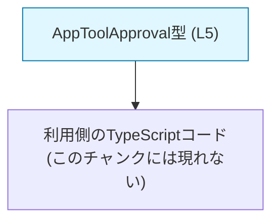
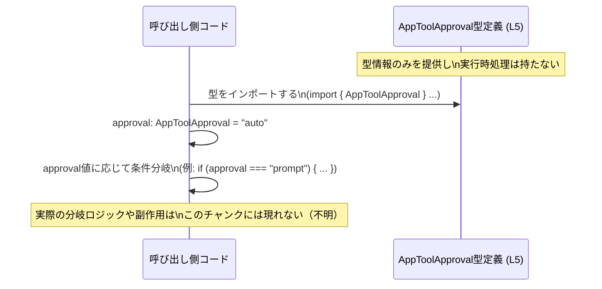

# app-server-protocol\schema\typescript\v2\AppToolApproval.ts

## 0. ざっくり一言

アプリケーション内で使用する `"auto" | "prompt" | "approve"` の3種類の文字列だけを許可する、`AppToolApproval` という型エイリアス（文字列リテラルユニオン型）を定義するファイルです（AppToolApproval.ts:L5）。

---

## 1. このモジュールの役割

### 1.1 概要

- このモジュールは、`AppToolApproval` という TypeScript の**文字列リテラルユニオン型**を定義し、外部にエクスポートします（AppToolApproval.ts:L5）。
- この型は、値が `"auto"`, `"prompt"`, `"approve"` のいずれかであることを**コンパイル時に保証**するために利用されます（TypeScriptの仕様上の性質）。

> 型名 `AppToolApproval` やリテラル `"auto"`, `"prompt"`, `"approve"` から、ツール実行に関する承認状態を表す用途が想定されますが、**具体的な意味やビジネスロジックはこのファイル単体からは判定できません**。

### 1.2 アーキテクチャ内での位置づけ

このファイル自身は型定義のみを持ち、他ファイルへの import / export 関係はこのチャンク内には現れていません（AppToolApproval.ts:L1-5）。したがって、一般的な役割として次のように位置づけられます。



- `AppToolApproval` は **型レベルの契約** を提供する小さなスキーマモジュールとして機能します。
- 実際にどのファイルがこの型を import しているかは、このチャンクには出てきません（不明）。

### 1.3 設計上のポイント

コードから読み取れる設計上の特徴は次のとおりです。

- **自動生成コード**  
  - 先頭コメントで `ts-rs` による自動生成であり、手動編集禁止であることが明示されています（AppToolApproval.ts:L1-3）。
- **状態のない純粋な型定義**  
  - 変数・クラス・関数はなく、唯一の要素は `export type` によるユニオン型定義です（AppToolApproval.ts:L5）。
- **閉じた集合を表現するユニオン型**  
  - `"auto" | "prompt" | "approve"` という**有限個の選択肢**しか取れない型になっており、型レベルで値の取りうる範囲を制限しています（AppToolApproval.ts:L5）。
- **エラーハンドリング / 並行性要素はなし**
  - 関数や実行ロジックが存在しないため、このモジュール単体にはエラー処理や並行性に関する要素はありません。

---

## 2. 主要な機能一覧

このファイルで提供される「機能」は、1つの型定義のみです。

- `AppToolApproval` 型: `"auto" | "prompt" | "approve"` の3値のみを許容する文字列リテラルユニオン型（AppToolApproval.ts:L5）。

---

## 3. 公開 API と詳細解説

### 3.1 型一覧（構造体・列挙体など）

| 名前              | 種別                           | 役割 / 用途 |
|-------------------|--------------------------------|-------------|
| `AppToolApproval` | 文字列リテラルユニオン型（typeエイリアス） | 値が `"auto"`, `"prompt"`, `"approve"` のいずれかに限定された文字列型を表します（AppToolApproval.ts:L5）。 |

#### `AppToolApproval` の型的な意味

- 型定義:  

  ```ts
  export type AppToolApproval = "auto" | "prompt" | "approve";
  ```  

  （AppToolApproval.ts:L5）
- **コンパイル時の性質（TypeScriptの仕様に基づく）**
  - `AppToolApproval` 型の変数には、`"auto"`, `"prompt"`, `"approve"` **以外の文字列を代入するとコンパイルエラー**になります。
  - 逆に、これら3つの文字列リテラルを直接代入する場合は型推論によって `AppToolApproval` と互換になるため、安全に扱えます。

> 実行時には単なる `string` として扱われるため、「外部入力（JSON, APIレスポンスなど）」から値を受け取る場合は、**実行時のバリデーションを別途実装する必要があります**。このファイルにはそのバリデーション処理は含まれていません。

### 3.2 関数詳細

このファイルには**公開関数・メソッドは一切定義されていません**（AppToolApproval.ts:L1-5）。  
そのため、関数詳細テンプレートに沿って解説すべき対象はありません。

### 3.3 その他の関数

- 該当なし（このチャンクには関数定義が存在しません）。

---

## 4. データフロー

このモジュール自体はデータ変換・I/O を行いませんが、典型的な利用シナリオとして「呼び出し側のコードが `AppToolApproval` を使って条件分岐する」流れが想定されます。以下は**例示的な**データフローです（実際の呼び出しコードはこのチャンクには現れません）。



要点:

- `AppToolApproval` は、**値の取りうる集合を制限する型情報**だけを提供します（AppToolApproval.ts:L5）。
- 実際のデータフロー（どこから値を受け取り、どこへ渡すか）は、このファイルには書かれていません。

---

## 5. 使い方（How to Use）

### 5.1 基本的な使用方法

典型的には、他の TypeScript ファイルから `AppToolApproval` を import し、関数の引数やオプションオブジェクトのプロパティとして利用します。  
以下は**パスを仮定した例**であり、実際の import パスはプロジェクト構成によって異なります。

```typescript
// AppToolApproval 型をインポートする                         // 型エイリアスのみを import（パスは例示）
import type { AppToolApproval } from "./AppToolApproval";

// approval が AppToolApproval 型であることを明示した関数     // 引数 approval に3種類の文字列のみを許可
function shouldAutoRun(approval: AppToolApproval): boolean {    // 戻り値は boolean 型
    // approval が "auto" のときだけ true を返す              // この分岐は型レベルで網羅性チェックが可能
    return approval === "auto";                                // "auto" | "prompt" | "approve" のいずれか
}

// 使用例                                                       // ここでは "auto" を渡す
const approval: AppToolApproval = "auto";                       // "auto" は AppToolApproval と互換
const result = shouldAutoRun(approval);                         // result は true になる
```

このように使用することで、`approval` に `"auto"`, `"prompt"`, `"approve"` 以外の文字列が渡されることを**コンパイル時に防止**できます。

### 5.2 よくある使用パターン

#### 1. 設定オブジェクトのプロパティとして使う

```typescript
import type { AppToolApproval } from "./AppToolApproval";

// 設定オブジェクトの型定義                                  // approval モードを AppToolApproval で表す
interface ToolConfig {
    approval: AppToolApproval;                                // "auto" | "prompt" | "approve" のいずれか
}

// 設定を利用する関数                                         // approval に応じて処理を切り替える
function executeWithApproval(config: ToolConfig) {
    if (config.approval === "auto") {                         // "auto" の場合
        // 自動実行の処理                                     // 具体的な処理は利用側で定義
    } else if (config.approval === "prompt") {                // "prompt" の場合
        // ユーザーに確認を促す処理
    } else { // "approve"                                     // 残りは "approve"
        // 事前承認がないと実行しない処理
    }
}
```

#### 2. デフォルト値との組み合わせ

```typescript
import type { AppToolApproval } from "./AppToolApproval";

const DEFAULT_APPROVAL: AppToolApproval = "prompt";           // デフォルトを "prompt" とする

function getApprovalOrDefault(maybe: AppToolApproval | undefined): AppToolApproval {
    // undefined の場合はデフォルト値を使う                  // null 合体演算子と組み合わせ可能
    return maybe ?? DEFAULT_APPROVAL;
}
```

### 5.3 よくある間違い

#### 間違い例1: 生の `string` 型で宣言してしまう

```typescript
// 間違い例: string 型だと何でも入ってしまう
let approval: string;                       // "auto" 以外も入ってしまう
approval = "AUTO";                          // タイポしてもコンパイルは通る
approval = "unknown_mode";                  // 想定外の値も許容される
```

**正しい例:**

```typescript
import type { AppToolApproval } from "./AppToolApproval";

// 正しい例: AppToolApproval を使う
let approval: AppToolApproval;
approval = "auto";                          // OK
// approval = "AUTO";                       // コンパイルエラー: 型 '"AUTO"' を割り当てられない
```

#### 間違い例2: 外部入力を無条件に型アサーションする

```typescript
declare const fromApi: string;              // 例: APIレスポンスの値

// 間違い例: 実行時チェックなしで as を使う
const approval = fromApi as AppToolApproval; // コンパイルは通るが、実行時に不正な値の可能性
```

この場合、`fromApi` が `"auto"`, `"prompt"`, `"approve"` 以外であっても**実行時にはそのまま通ってしまい**、後続のロジックで想定外の挙動を起こす可能性があります。

**より安全な例:**

```typescript
declare const fromApi: string;

// 実行時にチェックする関数
function parseApproval(value: string): AppToolApproval | undefined {
    if (value === "auto" || value === "prompt" || value === "approve") {
        return value;                                       // value は AppToolApproval と互換
    }
    return undefined;                                       // 不正値時の扱いは利用側のポリシー次第
}

const approval = parseApproval(fromApi);                    // approval は AppToolApproval | undefined
```

### 5.4 使用上の注意点（まとめ）

- **取りうる値は3種類のみ**  
  - `"auto"`, `"prompt"`, `"approve"` 以外の文字列はコンパイル時に弾かれるようにコーディングすることが前提です（AppToolApproval.ts:L5）。
- **実行時にはただの文字列**  
  - TypeScript の型はコンパイル後に消えるため、外部入力の検証を行わないと不正な値が紛れ込む可能性があります。
- **外部とのインターフェース変更リスク**  
  - サーバー側や他言語側のスキーマに `"auto"`, `"prompt"`, `"approve"` 以外の値が追加された場合、TypeScript 側でこの型を更新しないと不整合が発生します。
- **並行性・スレッド安全性**  
  - この型は単なるイミュータブルな文字列を表すだけなので、共有によるスレッド安全性の問題は通常ありません。

---

## 6. 変更の仕方（How to Modify）

### 6.1 新しい機能を追加する場合（新しい値の追加など）

このファイルは `ts-rs` によって自動生成されており、「手で変更してはいけない」と明示されています（AppToolApproval.ts:L1-3）。  
したがって、値を追加する場合の基本方針は次のとおりです。

1. **生成元の定義を変更する**
   - Rust 側の `ts-rs` 対象型（enum など）が存在すると推測されますが、その場所や名前はこのチャンクには現れません（不明）。
   - 値を追加したい場合は、そちらの定義に新しいバリアント／値を追加する必要があります。
2. **`ts-rs` による再生成を行う**
   - プロジェクトのビルド／コード生成フローに従って、この TypeScript ファイルを再生成します。
3. **利用側コードの見直し**
   - `AppToolApproval` 全値に対して `switch` や `if` で分岐している箇所がある場合、**新しい値を考慮した分岐**を追加する必要があります。
   - このファイルからは利用箇所を特定できないため、IDE の「型参照検索」などを用いて影響範囲を確認する必要があります。

### 6.2 既存の機能を変更する場合（値の削除・名称変更など）

`"auto"`, `"prompt"`, `"approve"` のいずれかを削除・変更する場合も、基本的には**生成元の変更 → 再生成**という流れになります（AppToolApproval.ts:L1-3, L5）。

変更時の注意点:

- **契約の変更として扱う必要**  
  - この型は他モジュールとのインターフェース契約として機能しているため、値の削除・名称変更は下位互換性を損なう可能性があります。
- **利用箇所のコンパイルエラーを確認**
  - TypeScript の型システムのおかげで、削除されたリテラルを使用している箇所はコンパイルエラーとして検出されます。
- **外部システムとの整合性**
  - API スキーマやデータベースの値など、外部システム側でこの3値を前提としている箇所との整合性も確認する必要があります（このファイルからはそれらの存在は分かりません）。

---

## 7. 関連ファイル

このチャンクのコードから直接読み取れる関連情報は、以下のみです。

| パス / 名称 | 役割 / 関係 |
|------------|------------|
| `ts-rs`（外部ツール） | コメントにより、このファイルが `ts-rs` による自動生成物であることが示されています（AppToolApproval.ts:L1-3）。生成元の Rust 側型定義が存在すると推測されますが、具体的なファイルパスやモジュール名はこのチャンクには現れません。 |

- このファイル自体には他の TypeScript ファイルを import する記述がなく、また他ファイルからの import もここからは追跡できません。そのため、「`AppToolApproval` を利用しているファイル」の一覧は、このチャンクだけからは特定できません。
