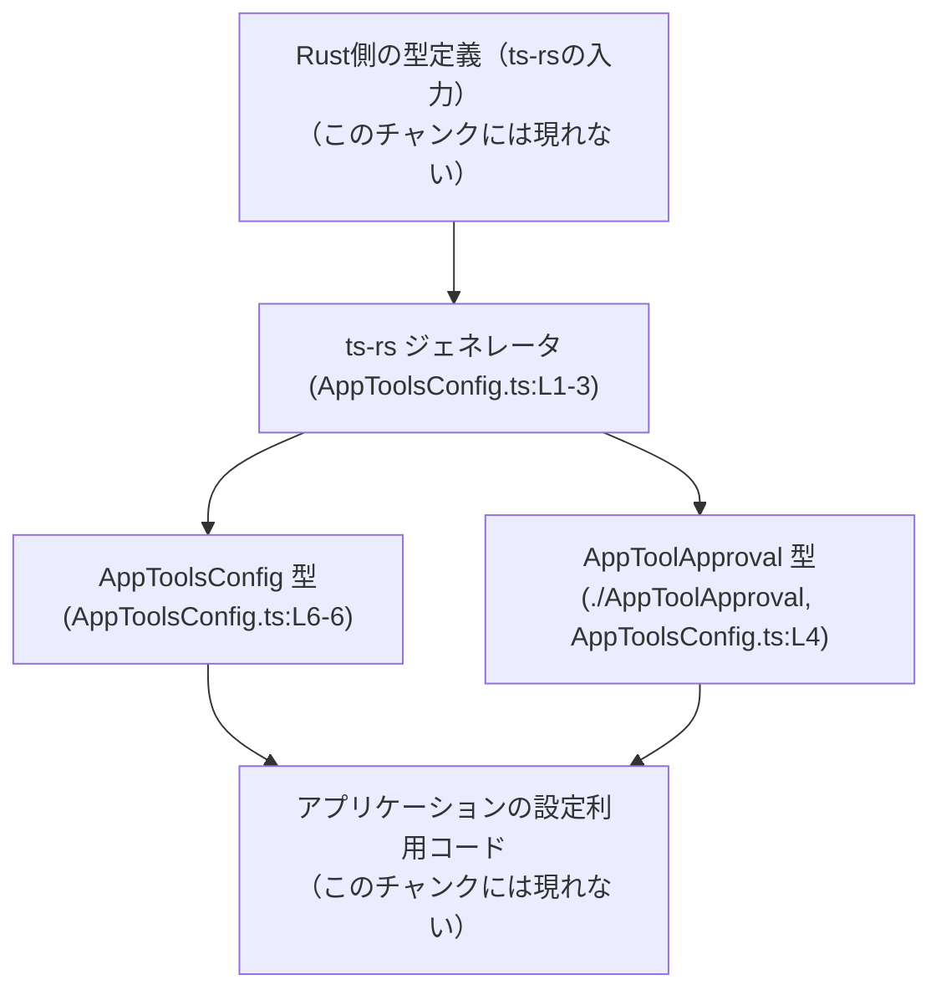
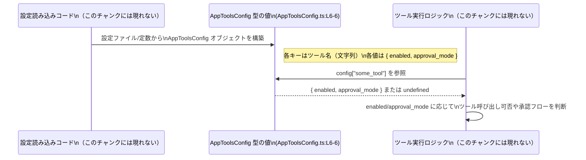

# app-server-protocol/schema/typescript/v2/AppToolsConfig.ts コード解説

## 0. ざっくり一言

`AppToolsConfig` は、「ツール名（文字列）→ ツールごとの設定オブジェクト」を表す TypeScript の設定用型エイリアスです（AppToolsConfig.ts:L6-6）。  
各ツールについて「有効／無効」と「承認モード（`AppToolApproval`）」を持つことができます。

---

## 1. このモジュールの役割

### 1.1 概要

- このモジュールは、アプリケーション内の「ツール類」の設定を表現するための **型定義** を提供します（AppToolsConfig.ts:L6-6）。
- 各ツールは文字列キーで識別され、値として「`enabled`（有効フラグ）」と「`approval_mode`（承認モード）」を持つオブジェクトが関連付けられます（AppToolsConfig.ts:L6-6）。
- ファイル先頭コメントから、この定義は Rust 側の型から `ts-rs` によって自動生成されたものであり、手動編集しない前提になっています（AppToolsConfig.ts:L1-3）。

### 1.2 アーキテクチャ内での位置づけ

このファイルから読み取れる依存関係は、以下の通りです。

- `AppToolsConfig` 型は、別ファイルで定義されている `AppToolApproval` 型に依存しています（AppToolsConfig.ts:L4, L6）。
- ファイル自体はコメントにより `ts-rs` による自動生成物であることが示されており（AppToolsConfig.ts:L1-3）、Rust 側のドメインモデルと TypeScript フロントエンド／クライアントコードの橋渡しをする層に位置づけられます。

これを簡単な依存関係図で表します。



> `Consumer`（利用側コード）がどこにあるか、どのように使っているかは、このチャンクには現れません。

### 1.3 設計上のポイント

コードから読み取れる設計上の特徴は次の通りです。

- **自動生成コードであること**  
  - 先頭コメントで「GENERATED CODE! DO NOT MODIFY BY HAND!」と明記されています（AppToolsConfig.ts:L1-3）。  
    設計上、「Rust 側の単一ソース・オブ・トゥルースから TS 型を機械的に同期させる」方針と解釈できます（コメントに基づく）。
- **キーが文字列のマップ型**  
  - `AppToolsConfig` は `{ [key in string]?: {...} }` という **マップ型（文字列キー→値）** として定義されています（AppToolsConfig.ts:L6）。  
  - キーは任意の文字列で、各キーはオプショナル（`?:`）です（AppToolsConfig.ts:L6）。
- **値オブジェクトの構造が固定されている**  
  - 各エントリの値は `{ enabled: boolean | null, approval_mode: AppToolApproval | null }` という固定構造です（AppToolsConfig.ts:L6）。
- **null を許容する設計**  
  - `enabled` と `approval_mode` に `null` が含まれているため、「真偽値／承認モードがまだ設定されていない／不明」といった状態も型レベルで表現する方針と読み取れます（AppToolsConfig.ts:L6）。
- **状態・ロジックを持たない**  
  - このファイルには関数やクラスはなく、純粋な型エイリアスのみが定義されています（AppToolsConfig.ts:L6）。  
    実行時ロジックや状態管理は、利用側コードに委ねられています（このチャンクには現れません）。

---

## 2. 主要な機能一覧

このモジュールは型定義のみを提供しますが、機能的には次の役割を持ちます。

- `AppToolsConfig`:  
  ツール名（文字列キー）ごとに、  
  - `enabled: boolean | null`（ツールが有効かどうか、または未設定）  
  - `approval_mode: AppToolApproval | null`（ツールの承認モード、または未設定）  
  を保持する設定マップ型を提供する（AppToolsConfig.ts:L6）。

---

## 3. 公開 API と詳細解説

### 3.1 型一覧（構造体・列挙体など）

このファイルに現れる主要な「コンポーネント（型）」のインベントリです。

| 名前              | 種別          | 役割 / 用途                                                                                          | 定義位置                             |
|-------------------|---------------|-------------------------------------------------------------------------------------------------------|--------------------------------------|
| `AppToolApproval` | 型（import）  | 各ツールの承認モードを表す型。具体的な中身はこのチャンクには現れないが、`approval_mode` に利用される。 | `AppToolsConfig.ts:L4`               |
| `AppToolsConfig`  | 型エイリアス  | ツール名（文字列）→ `{ enabled, approval_mode }` という設定オブジェクトへのマッピングを表す。       | `AppToolsConfig.ts:L6-6`             |

> `AppToolApproval` の定義本体は `./AppToolApproval` に存在しますが、このチャンクには現れないため詳細は不明です（AppToolsConfig.ts:L4）。

### 3.2 関数詳細

このファイルには関数・メソッドは定義されていません（AppToolsConfig.ts:L1-6）。  
したがって、関数詳細テンプレートの対象となる公開 API はありません。

### 3.3 その他の関数

同様に、補助的な関数やラッパー関数も定義されていません（AppToolsConfig.ts:L1-6）。

---

## 4. データフロー

このモジュールは型のみを定義するため、実行時の処理フローは持ちません。  
ここでは、典型的な利用シナリオとして「アプリケーションが `AppToolsConfig` 型の設定を読み取り、ツールの有効／無効や承認モードを参照する」流れのイメージを示します。

> 図中の `AppToolsConfig` は、このファイルで定義されている型（AppToolsConfig.ts:L6-6）です。  
> 実際の利用コード（設定読み込み・ツール呼び出しなど）は、このチャンクには現れません。



- `config["some_tool"]` が存在すれば、`{ enabled, approval_mode }` のオブジェクトが返る想定です（AppToolsConfig.ts:L6）。
- キーが存在しない場合、値は `undefined` になる可能性があります（オプショナルプロパティであるため、AppToolsConfig.ts:L6）。

---

## 5. 使い方（How to Use）

### 5.1 基本的な使用方法

`AppToolsConfig` を用いて、いくつかのツール設定を定義する例です。  
ここでは `AppToolApproval` が列挙型か文字列ユニオン型であると仮定した「例」を書きますが、その実体はこのチャンクからは分かりません（AppToolsConfig.ts:L4）。

```typescript
// AppToolsConfig 型と AppToolApproval 型をインポートする                        // 型定義を利用側コードに取り込む
import type { AppToolsConfig } from "./AppToolsConfig";                           // 実際のパスはビルド構成に依存する
import type { AppToolApproval } from "./AppToolApproval";                        // このチャンクには定義がない

// 何らかの AppToolApproval の値を仮定する                                     // 具体的なバリアント名はこのチャンクからは不明
declare const AUTO_APPROVE: AppToolApproval;                                      // ここでは仮に定数として宣言
declare const MANUAL_REVIEW: AppToolApproval;                                     // 同上

// AppToolsConfig 型の設定オブジェクトを定義する                                // config は "ツール名" → 設定 のマップ
const config: AppToolsConfig = {                                                  // AppToolsConfig.ts:L6 に沿った構造
    "code-search": {                                                              // 文字列キー "code-search" の設定
        enabled: true,                                                            // このツールは有効
        approval_mode: AUTO_APPROVE,                                              // 自動承認（例）
    },
    "file-upload": {                                                              // 文字列キー "file-upload" の設定
        enabled: null,                                                            // まだ有効/無効が決まっていない状態を null で表現
        approval_mode: MANUAL_REVIEW,                                             // 手動レビューが必要（例）
    },
    // 他のツール設定は省略可能                                                  // インデックスシグネチャがオプショナルなので未定義でもよい
};

// 設定を利用してツールが有効かどうかを判定する関数の例                        // 実際の実装は利用側コードで定義する
function isToolEnabled(config: AppToolsConfig, toolName: string): boolean {       // config と ツール名を受け取る
    const toolConfig = config[toolName];                                          // 対応する設定オブジェクト（または undefined）を取得
    if (!toolConfig) {                                                            // 設定自体が存在しない
        return false;                                                             // 未定義のツールは無効とみなす例
    }
    if (toolConfig.enabled === null) {                                            // null は「未設定」のケース
        return false;                                                             // ここでは無効扱いにする例
    }
    return toolConfig.enabled;                                                    // boolean の場合、そのまま返す
}
```

この例から分かるポイント:

- `AppToolsConfig` は **任意の文字列キー** を受け付けるマップ型です（AppToolsConfig.ts:L6）。
- 各値オブジェクトの `enabled` と `approval_mode` は `null` を取り得るため、利用側で `null` チェックが必須です（AppToolsConfig.ts:L6）。
- プロパティ自体が存在しない（`config[toolName]` が `undefined`）ケースも起こり得ます（オプショナルプロパティ指定、AppToolsConfig.ts:L6）。

### 5.2 よくある使用パターン

1. **静的な定数としてアプリケーション設定を定義する**

```typescript
import type { AppToolsConfig } from "./AppToolsConfig";

// アプリケーション起動時に固定の設定を持つ例                            // 実行時に変更しない前提の定数
export const DEFAULT_APP_TOOLS_CONFIG: AppToolsConfig = {
    "tool-a": { enabled: true,  approval_mode: null },                         // 承認モード未設定
    "tool-b": { enabled: false, approval_mode: null },                         // 無効化されたツール
};
```

1. **ユーザーごとの上書き設定をマージする**

```typescript
import type { AppToolsConfig } from "./AppToolsConfig";

function mergeConfigs(base: AppToolsConfig, override: AppToolsConfig): AppToolsConfig {
    // 単純なスプレッドでマージする例                                       // キーの衝突時は override 側を優先
    return { ...base, ...override };
}
```

1. **オプショナルチェーン・Null合体演算子で安全に参照する**

```typescript
import type { AppToolsConfig } from "./AppToolsConfig";

function isEnabledOrDefault(config: AppToolsConfig, toolName: string, defaultValue: boolean): boolean {
    // config[toolName]?.enabled の結果型は boolean | null | undefined が想定される
    const enabled = config[toolName]?.enabled;
    return enabled ?? defaultValue;                                            // null/undefined の場合は defaultValue を使う
}
```

### 5.3 よくある間違い

型から推測される誤用例とその修正版です。

```typescript
import type { AppToolsConfig } from "./AppToolsConfig";

// ❌ 間違い例: config[toolName] が必ず存在し、enabled が boolean だと思い込む
function badIsEnabled(config: AppToolsConfig, toolName: string): boolean {
    return config[toolName].enabled;                                           // コンパイル時点でエラー: 可能性として undefined や null がある
}

// ✅ 正しい例: undefined と null を考慮する
function goodIsEnabled(config: AppToolsConfig, toolName: string): boolean {
    const toolConfig = config[toolName];                                       // toolConfig は { ... } | undefined
    if (!toolConfig || toolConfig.enabled !== true) {                          // undefined / null / false をまとめて無効扱い
        return false;
    }
    return true;                                                               // enabled が true の場合のみ有効
}
```

**よくある間違いのポイント**

- `config[toolName]` はオプショナルプロパティのため **`undefined` になり得る**（AppToolsConfig.ts:L6）。
- `enabled` は `boolean | null` のため、`true/false` 以外に `null` もあり得ます（AppToolsConfig.ts:L6）。  
  そのため、`toolConfig.enabled` をそのまま boolean として扱うと意図しない挙動やコンパイルエラーの原因になります。

### 5.4 使用上の注意点（まとめ）

- **null と undefined の両方を考慮する必要がある**  
  - `config[toolName]` 自体が存在しない（`undefined`）ことがある（オプショナルプロパティ, AppToolsConfig.ts:L6）。
  - `enabled` / `approval_mode` は `null` を取り得る（AppToolsConfig.ts:L6）。  
    ロジック側では `undefined` と `null` の両方を明示的に扱うことが推奨されます。
- **スレッド安全性・並行性**  
  - TypeScript の型定義であり、スレッド安全性や並行処理の制御は行いません。  
    複数の非同期処理から同じ `AppToolsConfig` オブジェクトを変更する場合は、呼び出し側の設計に依存します。
- **セキュリティ**  
  - この型自体は構造の定義のみで、入力検証や権限チェックなどのセキュリティ機能は含みません。  
    例えば、外部から受け取った JSON を `AppToolsConfig` に代入する場合、値の妥当性チェックや許可されていないツール名のフィルタリングは呼び出し側で行う必要があります。
- **自動生成コードであること**  
  - コメントにより「手動で編集しない」ことが明示されているため（AppToolsConfig.ts:L1-3）、直接このファイルを書き換えると Rust 側の定義との不整合が起きる可能性があります。

---

## 6. 変更の仕方（How to Modify）

### 6.1 新しい機能を追加する場合

このファイルは `ts-rs` による自動生成物であり、先頭コメントに「Do not edit this file manually」とあるため（AppToolsConfig.ts:L1-3）、**直接編集する前提ではありません**。

新しい情報（例えば、ツールごとの別の設定項目）を `AppToolsConfig` に追加したい場合の一般的な流れは次のようになります。

1. **Rust 側の元となる型定義を特定する**  
   - `ts-rs` の入力となる Rust の構造体／マップ定義が別のリポジトリ／ディレクトリに存在しているはずですが、このチャンクには現れません。
2. **Rust 側の型定義を変更する**  
   - 例として、Rust 側の `struct` に新しいフィールドを追加するなどの変更を行います（この詳細は不明）。
3. **`ts-rs` を再実行する**  
   - ビルドスクリプトや生成コマンドを通じて `ts-rs` を再実行すると、`AppToolsConfig.ts` が再生成されます（AppToolsConfig.ts:L1-3）。
4. **TypeScript 側の利用コードを更新する**  
   - 新しいフィールドを使うように TypeScript コードを修正し、コンパイルが通るか確認します。

### 6.2 既存の機能を変更する場合

`enabled` や `approval_mode` の意味や型を変える場合なども、同様に **Rust 側の定義変更→ts-rs 再生成** の流れになります。

変更時に注意すべき点:

- **契約（Contract）の維持**  
  - 既存の利用コードは、`enabled: boolean | null` / `approval_mode: AppToolApproval | null` を前提に動いています（AppToolsConfig.ts:L6）。  
  - これらを非 null に変更したり、型を変えたりすると、利用側でコンパイルエラーやロジックの変更が必要になります。
- **互換性の確認**  
  - `AppToolsConfig` をシリアライズして保存している場合（設定ファイルや DB 等）、構造変更が互換性に与える影響を考慮する必要があります。  
    このファイルからはシリアライズ先などは分かりませんが、「マップ型の設定」として利用されうる点に注意が必要です。
- **テストの見直し**  
  - このチャンクにテストコードは現れませんが（AppToolsConfig.ts:L1-6）、利用側のテスト（ツールの有効／無効判定、承認フローなど）は変更後に再確認が必要です。

---

## 7. 関連ファイル

このモジュールと直接関係するファイル・コンポーネントは、コード上次のように読み取れます。

| パス / 参照                      | 役割 / 関係                                                                                          |
|----------------------------------|-------------------------------------------------------------------------------------------------------|
| `./AppToolApproval`              | `AppToolApproval` 型を提供するモジュール。`approval_mode` プロパティの型として参照される（AppToolsConfig.ts:L4, L6）。拡張子や具体的型はこのチャンクには現れない。 |
| Rust 側の型定義（ts-rs 入力元） | コメントによりこのファイルが `ts-rs` による自動生成物であることが示されているため（AppToolsConfig.ts:L1-3）、元となる Rust の型定義が存在すると推測されるが、このチャンクには現れない。 |

---

### 付記：テスト・性能・観測性に関する補足

- **テスト**  
  - このファイルにはテストコードは含まれていません（AppToolsConfig.ts:L1-6）。  
    `AppToolsConfig` 型を前提とした振る舞い（ツールの有効判定など）は、別のユニットテスト／統合テストでカバーされる想定です（このチャンクには現れません）。
- **性能 / スケーラビリティ**  
  - `AppToolsConfig` は単なるオブジェクトマップであり、性能特性は一般的な JavaScript のオブジェクトアクセスと同等です。  
    ツールの数が非常に多い場合でも、キーアクセスは典型的には平均 O(1) ですが、巨大な設定オブジェクトのコピー（`{ ...config }` など）はメモリと時間を消費します。
- **観測性（ログ・メトリクス）**  
  - この型定義自体はログ出力やメトリクスなどの観測性機能を含みません。  
    どのツールが有効になっているかなどを記録したい場合は、利用側コードで `AppToolsConfig` を走査してログ出力するなどの実装が必要です。
