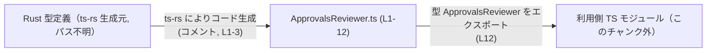
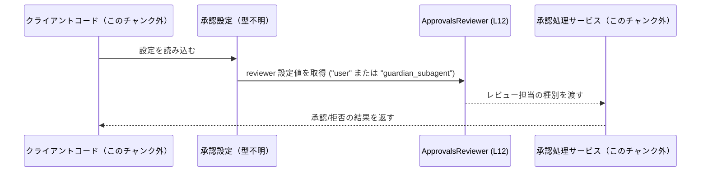

# app-server-protocol/schema/typescript/v2/ApprovalsReviewer.ts

---

## 0. ざっくり一言

承認リクエスト（サンドボックス脱出やネットワークアクセス要求など）を**誰にレビューさせるか**を表す、文字列リテラル・ユニオン型 `ApprovalsReviewer` を定義するファイルです（`"user"` または `"guardian_subagent"` に限定、`ApprovalsReviewer.ts:L5-10, L12-12`）。

---

## 1. このモジュールの役割

### 1.1 概要

- このモジュールは、承認リクエストが **どの種類のレビュー担当者にルーティングされるか** を静的に表現するために存在します（`ApprovalsReviewer.ts:L5-10`）。
- `ApprovalsReviewer` 型は `"user"` または `"guardian_subagent"` のいずれかのみを許可し、設定値の型安全性を高めます（`ApprovalsReviewer.ts:L12-12`）。
- ファイル先頭コメントから、この型定義は Rust から `ts-rs` によって自動生成されるスキーマの一部であると読み取れます（`ApprovalsReviewer.ts:L1-3`）。

### 1.2 アーキテクチャ内での位置づけ

このファイルは **型定義だけ** を提供し、実際の承認処理ロジックは別モジュール側に存在していると考えられます（処理ロジックはこのチャンクには現れません）。

- 上流: Rust 側の型定義（`ts-rs` の生成元、パス不明）から生成（`ApprovalsReviewer.ts:L1-3`）
- 本ファイル: `ApprovalsReviewer` 型を TypeScript 側にエクスポート（`ApprovalsReviewer.ts:L12-12`）
- 下流: API クライアントや設定モジュールなどが `ApprovalsReviewer` を import して利用（利用側はこのチャンクには現れません）



### 1.3 設計上のポイント

- **生成コードであること**  
  - 先頭コメントに「GENERATED CODE」「Do not edit this file manually」と明記されています（`ApprovalsReviewer.ts:L1-3`）。
  - 手動での変更は意図されておらず、変更は Rust 側の ts-rs 生成元で行う設計です。
- **純粋な型定義のみ**  
  - 関数やクラスは一切なく、`export type` のみが存在します（`ApprovalsReviewer.ts:L12-12`）。  
  - 実行時の状態や副作用を持たず、ビルド時の型チェック専用です。
- **文字列リテラル・ユニオンによる制約**  
  - `"user"` / `"guardian_subagent"` の 2 値に限定したユニオン型となっており、誤った文字列をコンパイル時に検出できます（`ApprovalsReviewer.ts:L12-12`）。
- **ドメイン知識をコメントで補足**  
  - JSDoc に、どのような承認リクエスト（サンドボックス脱出、ブロックされたネットワークアクセス、MCP プロンプト、ARC エスカレーション）が対象か、各値の意味が記述されています（`ApprovalsReviewer.ts:L5-10`）。

---

## 2. 主要な機能一覧

このファイルには「機能」としての関数はありませんが、型が提供する役割を機能として整理します。

- `ApprovalsReviewer` 型:  
  承認リクエストのレビュー担当者を `"user"` または `"guardian_subagent"` に限定して表現する型エイリアスです（`ApprovalsReviewer.ts:L12-12`）。

---

## 3. 公開 API と詳細解説

### 3.1 型一覧（構造体・列挙体など）

| 名前 | 種別 | 役割 / 用途 | 定義位置 |
|------|------|-------------|----------|
| `ApprovalsReviewer` | 型エイリアス（string リテラル・ユニオン） | 承認リクエストのレビュー担当者の種別を `"user"` または `"guardian_subagent"` のいずれかに制約する | `ApprovalsReviewer.ts:L12-12` |

### 3.2 型詳細: `type ApprovalsReviewer = "user" \| "guardian_subagent"`

#### 概要

- 承認リクエストが「誰に」レビューされるかを示す設定値の型です（`ApprovalsReviewer.ts:L5-8`）。
- `"user"` と `"guardian_subagent"` という 2 種類の文字列リテラルに限定されます（`ApprovalsReviewer.ts:L12-12`）。

#### 値の一覧

| 値 | 説明 | 根拠 |
|----|------|------|
| `"user"` | デフォルトのレビュー担当。ユーザー本人に承認・拒否を求めると説明されています。 | JSDoc に「Defaults to `user`」と記述（`ApprovalsReviewer.ts:L8-8`） |
| `"guardian_subagent"` | 注意深くプロンプトされたサブエージェントがコンテキストを収集し、リスクベースの判断フレームワークに従って承認または拒否を決定する担当を表します。 | JSDoc にサブエージェントとリスクベース判断の説明（`ApprovalsReviewer.ts:L8-10`） |

#### 型の性質（TypeScript 観点での安全性・エラー）

- **静的型安全性**  
  - `ApprovalsReviewer` 型の変数には `"user"` か `"guardian_subagent"` 以外の文字列を代入するとコンパイルエラーになります。  
  - これにより、設定値のスペルミスや想定外の値を早期に検出できます（`ApprovalsReviewer.ts:L12-12`）。
- **実行時エラーについて**  
  - このファイルには実行時コードが存在しないため、この型自体が直接実行時エラーや例外を発生させることはありません（`ApprovalsReviewer.ts:L1-12`）。
  - ただし、外部入力（JSON など）から `string` として読み込んだ値を `ApprovalsReviewer` として扱う場合は、適切なバリデーションがなければコンパイル時には検知できません（これは一般的な TypeScript の性質であり、このチャンクにはバリデーションコードは現れません）。

#### Examples（使用例）

基本的な使い方を示す TypeScript コード例です。例中で定義している `ApprovalsReviewer` は、このファイルと同じ内容です。

```typescript
// 承認のレビュー担当を表す型を定義する（実際には ApprovalsReviewer.ts に定義済み）
export type ApprovalsReviewer = "user" | "guardian_subagent";  // "user" か "guardian_subagent" のどちらか

// 設定オブジェクトの例
interface ApprovalSettings {                                    // 承認設定を表すオブジェクトの型
    reviewer: ApprovalsReviewer;                               // reviewer は ApprovalsReviewer 型
}

// ApprovalsReviewer を使う関数の例
function setReviewer(                                          // reviewer を更新する関数
    settings: ApprovalSettings,                                // 現在の設定
    reviewer: ApprovalsReviewer                                // 新しいレビュー担当（型で制約される）
): ApprovalSettings {                                          // 更新後の設定を返す
    return { ...settings, reviewer };                          // スプレッド構文で reviewer を上書き
}

// 使用例
const current: ApprovalSettings = { reviewer: "user" };        // OK: "user" は ApprovalsReviewer の一つ
const updated = setReviewer(current, "guardian_subagent");     // OK: もう一つの許可された値
// const invalid = setReviewer(current, "admin");              // コンパイルエラー: "admin" は許可されていない
```

#### Edge cases（エッジケース）

この型は **二値のユニオン** であるため、「エッジケース」は主に外部データとの境界で発生します。

- **想定外の文字列（例: `"admin"`）**  
  - コード内でリテラルとして指定した場合:  
    - `ApprovalsReviewer` 型の変数に代入するとコンパイルエラーになります（型が `"user"` または `"guardian_subagent"` のみを許容しているため, `ApprovalsReviewer.ts:L12-12`）。
  - `any` や `unknown` から代入した場合:  
    - 代入時に適切な型アサーションや型ガードを行わないと、コンパイラは検知できない可能性があります（このチャンクには型ガード実装は現れません）。
- **`null` / `undefined`**  
  - `ApprovalsReviewer` 自体には `null` や `undefined` は含まれないため、`ApprovalsReviewer | undefined` のような拡張をしない限り、これらは代入できません。
- **大文字・小文字の違い**  
  - `"User"` や `"USER"` など、大文字を含む値はすべて不正値として扱われコンパイルエラーになります（`ApprovalsReviewer.ts:L12-12`）。

#### 使用上の注意点

- このファイルは **生成コード** であり、コメントにある通り手動編集は避ける必要があります（`ApprovalsReviewer.ts:L1-3`）。
- 外部からの文字列入力（JSON, HTTP リクエストなど）をそのまま `ApprovalsReviewer` として扱う場合、
  - 実行時に `"user"` / `"guardian_subagent"` 以外の値を受け取る可能性があるため、**実行時バリデーション**を別途実装する必要があります（このチャンクには実装はありません）。
- `ApprovalsReviewer` に新しい値を追加したい場合は、このファイルではなく ts-rs の生成元（Rust 側）を変更する必要があります（`ApprovalsReviewer.ts:L1-3`）。

### 3.3 その他の関数

- このファイルには関数定義は存在しません（`ApprovalsReviewer.ts:L1-12`）。

---

## 4. データフロー

このチャンクには実際の処理ロジックは存在しませんが、JSDoc の説明から読み取れる **典型的な利用イメージ** を図示します（あくまで利用イメージであり、具体的な実装はこのチャンクには現れません）。

- 承認処理サービスが設定から `ApprovalsReviewer` の値を取得し、
- その値に応じて「ユーザー本人」か「ガーディアン・サブエージェント」にリクエストを回す、という流れを想定できます（`ApprovalsReviewer.ts:L5-10, L12-12`）。



> 注意: 上記のコンポーネント `CFG` や `S` は、このファイルには定義がなく、コメントの説明から想定した概念的なものです。

---

## 5. 使い方（How to Use）

### 5.1 基本的な使用方法

`ApprovalsReviewer` を設定型の一部として使う基本的なパターンです。import パスはプロジェクト構成に応じて調整が必要です。

```typescript
// ApprovalsReviewer 型を import する（パスはプロジェクトに合わせて変更する必要がある）
import type { ApprovalsReviewer } from "./ApprovalsReviewer";     // このファイルが同一ディレクトリにある場合の例

// 承認設定オブジェクトの型
interface ApprovalSettings {                                      // 承認に関する設定を表す
    reviewer: ApprovalsReviewer;                                 // レビュー担当を表すフィールド
}

// 承認設定を更新する関数
function updateReviewer(                                         // reviewer を更新する関数
    settings: ApprovalSettings,                                  // 現在の設定
    reviewer: ApprovalsReviewer                                  // 新しいレビュー担当
): ApprovalSettings {                                            // 更新した設定を返す
    return { ...settings, reviewer };                            // スプレッド構文で reviewer を上書き
}

// 使用例
const initial: ApprovalSettings = { reviewer: "user" };          // OK: "user" は許可された値
const withGuardian = updateReviewer(initial, "guardian_subagent"); // OK: もう一つの許可値
// const invalid = updateReviewer(initial, "admin");             // コンパイルエラーになる例
```

### 5.2 よくある使用パターン

#### パターン 1: 分岐処理（`switch`）での利用

```typescript
import type { ApprovalsReviewer } from "./ApprovalsReviewer";    // 型を import

function handleApprovalByReviewer(reviewer: ApprovalsReviewer) { // reviewer に応じて処理を分岐
    switch (reviewer) {                                          // ApprovalsReviewer に対する switch
        case "user":                                             // reviewer が "user" の場合
            // ユーザー本人に承認を求める処理
            break;
        case "guardian_subagent":                                // reviewer が "guardian_subagent" の場合
            // サブエージェントに判断を委ねる処理
            break;
        // default:                                              // 現状は不要（2 値に限定されているため）
    }
}
```

TypeScript の文字列リテラル・ユニオン型を使うことで、`switch` 文が **列挙的** に書け、将来値を追加した際もコンパイラが漏れを検知しやすくなります。

#### パターン 2: 設定スキーマとしての利用

JSON 設定を TypeScript 上で表現するときに `ApprovalsReviewer` を用いる例です（実際の JSON 読み込み処理はこのチャンクには現れません）。

```typescript
import type { ApprovalsReviewer } from "./ApprovalsReviewer";    // 型を import

interface AppConfig {                                            // アプリ全体の設定の例
    approvalsReviewer: ApprovalsReviewer;                        // 承認レビュー担当の設定
}

const config: AppConfig = {                                      // 型に基づいた設定オブジェクト
    approvalsReviewer: "user",                                  // "guardian_subagent" も指定可能
};
```

### 5.3 よくある間違い

#### 誤用例 1: `string` 型で扱ってしまう

```typescript
// 誤り: 型を string にしてしまう
let reviewer: string = "user";               // 文字列なら何でも入ってしまう

reviewer = "admin";                          // 誤った値でもコンパイルは通る
```

```typescript
// 正しい例: ApprovalsReviewer 型を使う
import type { ApprovalsReviewer } from "./ApprovalsReviewer";

let reviewer: ApprovalsReviewer = "user";    // OK
// reviewer = "admin";                      // コンパイルエラー: 許可されていない
```

#### 誤用例 2: 外部入力をそのままキャストする

```typescript
declare const valueFromJson: any;                        // 外部から来た値（型不明）

// 誤り: 安易な型アサーション
const reviewer = valueFromJson as ApprovalsReviewer;     // 実際には "user" でないかもしれない
```

外部入力に対しては、`typeof` チェックやユーザー定義型ガードなどを利用し、**実行時バリデーション**を行うことが推奨されます（バリデーション関数はこのチャンクには定義されていません）。

### 5.4 使用上の注意点（まとめ）

- このファイルは `ts-rs` による生成コードであり、**直接編集しない** 前提になっています（`ApprovalsReviewer.ts:L1-3`）。
- `ApprovalsReviewer` は文字列リテラル・ユニオン型であり、コンパイラはコード内の誤値を検出できますが、  
  外部入力に対しては別途実行時バリデーションが必要です。
- 将来 `"admin"` などの新しいレビュー担当を追加する場合、
  - ts-rs の生成元（Rust 側の型定義）を変更し、
  - 生成された TypeScript でコンパイルエラーが出る箇所を確認しながら対応を広げていくのが自然な流れになります（生成元の具体的ファイル名はこのチャンクからは分かりません）。

---

## 6. 変更の仕方（How to Modify）

### 6.1 新しい機能を追加する場合（例: 新しいレビュー担当の追加）

このファイルは自動生成されるため、**直接修正すべきではありません**（`ApprovalsReviewer.ts:L1-3`）。

1. **ts-rs の生成元（Rust 側）を特定する**  
   - コメントに「This file was generated by ts-rs」とあるため、Rust の型定義から生成されていることが分かります（`ApprovalsReviewer.ts:L3-3`）。
   - 具体的なパスはこのチャンクからは分かりません（不明）。
2. **Rust 側の型に新しいバリアントを追加する**  
   - 例: `enum` や `struct` に新しい値を追加（この操作自体はこのチャンクには現れません）。
3. **ts-rs を再実行して TypeScript スキーマを再生成する**  
   - これにより `ApprovalsReviewer` のユニオンに新しい文字列リテラルが追加されます。
4. **TypeScript 側の利用箇所を修正する**  
   - `switch` 文等で新しいケースを扱うように修正します。  
   - コンパイラが「網羅性がない」ケースを指摘することで、変更漏れを発見しやすくなります。

### 6.2 既存の機能を変更する場合（例: デフォルト担当を変える）

- デフォルトが `"user"` であることは JSDoc に記載されています（`ApprovalsReviewer.ts:L8-8`）。
- デフォルト値の変更は、この型定義のみではなく、「どこでデフォルトを適用しているか」を確認する必要がありますが、その実装位置はこのチャンクには現れません。
- 変更時の注意点:
  - 既存のクライアントコードが `"user"` を前提にしていないか確認する。
  - コメントやドキュメントも合わせて更新する（`ApprovalsReviewer.ts:L5-10` に相当する説明部分）。

---

## 7. 関連ファイル

このチャンクから直接読み取れる範囲と、コメントに基づく推測（推測であることを明示）を分けて整理します。

| パス | 役割 / 関係 |
|------|------------|
| `app-server-protocol/schema/typescript/v2/ApprovalsReviewer.ts` | 本ドキュメントの対象ファイル。`ApprovalsReviewer` 型を定義し、承認リクエストのレビュー担当者種別を表します（`ApprovalsReviewer.ts:L5-12`）。 |
| `Rust 側の ts-rs 生成元（パス不明）` | コメントに「This file was generated by ts-rs」とあるため、このファイルを生成している Rust の型定義が存在すると考えられます（`ApprovalsReviewer.ts:L3-3`）。具体的なファイル名・パスはこのチャンクには現れません。 |
| `ApprovalsReviewer を import して利用する TypeScript ファイル群（パス不明）` | この型を設定スキーマや API クライアントで利用するモジュールが存在すると考えられますが、どのファイルかはこのチャンクには現れません。 |

---

### Bugs / Security / Tests / パフォーマンスなどについての補足

- **Bugs**:  
  - このファイルは型定義のみで実行時ロジックがなく、単体ではバグの振る舞いは確認できません。
- **Security**:  
  - 実行時のセキュリティロジックは存在しませんが、型により承認経路の設定値を限定できるため、誤設定によるリスク低減には寄与します。
- **Contracts / Edge Cases**:  
  - 契約は「`"user"` か `"guardian_subagent"` のいずれかである」という点に尽きます（`ApprovalsReviewer.ts:L12-12`）。
- **Tests**:  
  - このチャンクにはテストコードは含まれていません。
- **パフォーマンス / スケーラビリティ / 並行性**:  
  - 型レベルの定義のみであり、実行時のパフォーマンスや並行性への直接の影響はありません。
