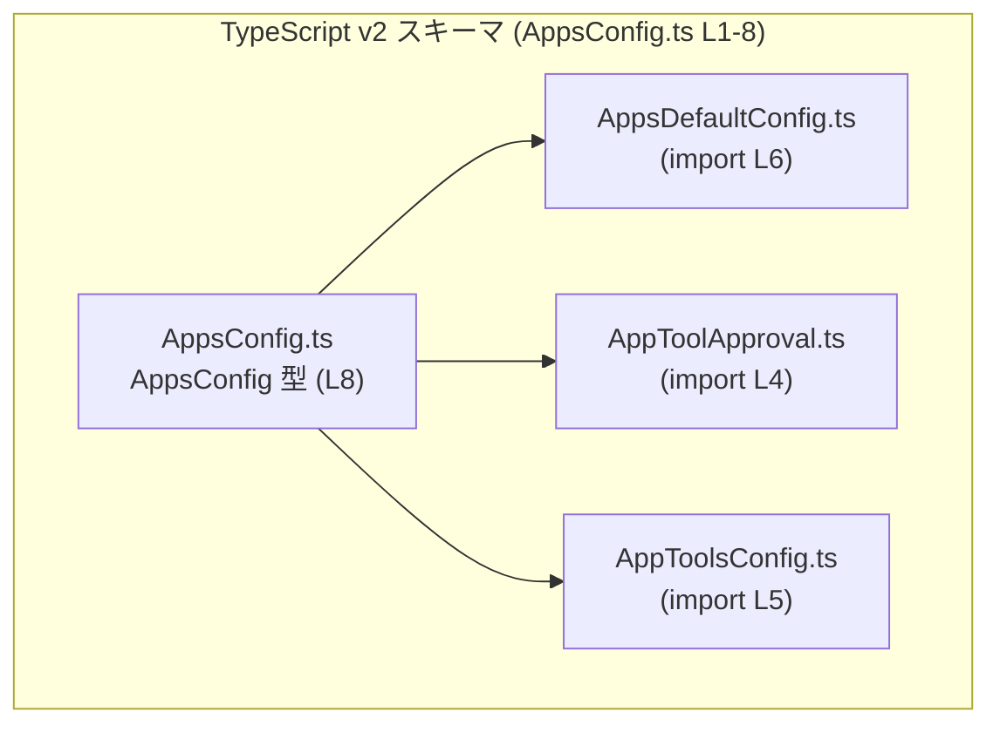
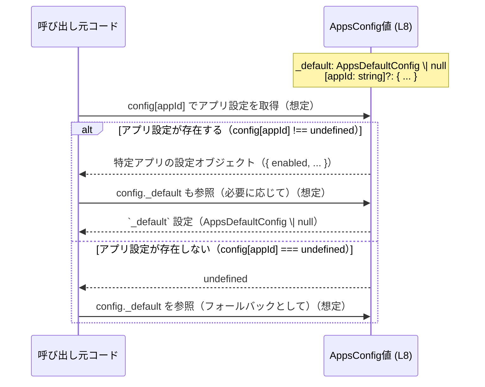

# app-server-protocol\schema\typescript\v2\AppsConfig.ts

## 0. ざっくり一言

- アプリケーションごとの設定と、全体に適用されるデフォルト設定を 1 つのオブジェクトで表現するための TypeScript 型 `AppsConfig` を定義するファイルです。  
  （`export type AppsConfig ...` より。`app-server-protocol/schema/typescript/v2/AppsConfig.ts:L8-8`）

---

## 1. このモジュールの役割

### 1.1 概要

- このモジュールは、アプリ群（Apps）の設定を表現する **スキーマ定義** を提供します。
- 型定義は `ts-rs` により自動生成されており、手動編集は禁止されています。  
  （先頭コメントより。`.../AppsConfig.ts:L1-3`）
- 型 `AppsConfig` は、  
  - `_default` フィールドで全体のデフォルト設定（`AppsDefaultConfig | null`）、  
  - 任意の文字列キーでアプリごとの設定（`{ enabled: boolean, ... }`）  
  を同時に保持するオブジェクト型です。  
  （`export type AppsConfig = ...` より。`.../AppsConfig.ts:L8-8`）

### 1.2 アーキテクチャ内での位置づけ

このファイルは TypeScript v2 スキーマ群の一部として、他の設定関連型に依存しています。

- 依存関係（import）

  - `AppToolApproval`（ツールの承認モードを表す型と解釈できる名前）：`./AppToolApproval` から import。  
    （`import type { AppToolApproval } from "./AppToolApproval";` `.../AppsConfig.ts:L4-4`）
  - `AppToolsConfig`（ツール集合の設定を表す型と解釈できる名前）：`./AppToolsConfig` から import。  
    （`.../AppsConfig.ts:L5-5`）
  - `AppsDefaultConfig`（アプリ全体のデフォルト設定）：`./AppsDefaultConfig` から import。  
    （`.../AppsConfig.ts:L6-6`）

Mermaid 図で表すと次のようになります。



> `AppToolApproval.ts` などの中身はこのチャンクには現れないため、詳細は不明です。

### 1.3 設計上のポイント

コードから読み取れる設計上の特徴は次のとおりです。

- **自動生成コードであること**  
  - 冒頭コメントに「GENERATED CODE」「Do not edit this file manually」と明記されています。  
    （`.../AppsConfig.ts:L1-3`）
- **状態を持たない純粋な型定義**  
  - 関数やクラスは存在せず、`export type AppsConfig = ...` のみです。  
    （`.../AppsConfig.ts:L8-8`）
- **交差型（intersection type）での構造合成**  
  - `_default` フィールドを持つオブジェクト型と、任意キーを持つインデックスシグネチャ型を `&` で合成しています。  
    （`{ _default: AppsDefaultConfig | null, } & ({ [key in string]?: { ... } })` `.../AppsConfig.ts:L8-8`）
- **null と optional による「上書き／継承」表現の余地**  
  - `_default` 自体が `null` を許容 (`AppsDefaultConfig | null`)。  
  - 各アプリ設定のプロパティも多くが `... | null`。  
  - インデックスシグネチャは `?` 付きで、アプリキー自体が存在しない（`undefined`）ケースもありえます。  
    （`.../AppsConfig.ts:L8-8`）
- **エラーハンドリング・並行性は型レベルのみ**  
  - 実行ロジックは含まれないため、ランタイムエラーや並行処理の制御は、このファイルからは分かりません。

---

## 2. 主要な機能一覧

このファイルが提供する「機能」は、型レベルでのデータ構造の表現に限られます。

- `AppsConfig` 型定義:  
  - `_default` フィールドにアプリ全体のデフォルト設定（`AppsDefaultConfig | null`）を保持する。  
  - 任意の文字列キーでアプリごとの設定オブジェクトを保持する。  
  - 各アプリ設定には、以下のプロパティを含めることができます（すべて必須プロパティ。ただしアプリ自体の存在が optional）。  
    - `enabled: boolean`  
    - `destructive_enabled: boolean | null`  
    - `open_world_enabled: boolean | null`  
    - `default_tools_approval_mode: AppToolApproval | null`  
    - `default_tools_enabled: boolean | null`  
    - `tools: AppToolsConfig | null`  
  （すべて `.../AppsConfig.ts:L8-8` に基づく）

---

## 3. 公開 API と詳細解説

### 3.1 型一覧（構造体・列挙体など）

このチャンクに現れる型コンポーネントのインベントリーです。

#### 型インベントリー（このファイル内で定義）

| 名前         | 種別       | 定義位置 | 役割 / 用途 |
|--------------|------------|----------|-------------|
| `AppsConfig` | 型エイリアス | `AppsConfig.ts:L8-8` | アプリ全体のデフォルト設定と、任意個のアプリごとの設定を 1 つのオブジェクトとして表現する型 |

#### 依存型インベントリー（import されているが、このチャンクでは未定義）

| 名前               | 種別       | 定義位置（このファイル内の参照） | 役割 / 用途（わかる範囲） |
|--------------------|------------|-------------------------------------|---------------------------|
| `AppToolApproval`  | 型（不明） | import: `AppsConfig.ts:L4-4` / 使用: `L8-8` | 各アプリの `default_tools_approval_mode` プロパティに使用される。具体的な列挙値や構造は、このチャンクには現れません。 |
| `AppToolsConfig`   | 型（不明） | import: `AppsConfig.ts:L5-5` / 使用: `L8-8` | 各アプリの `tools` プロパティの型として使用される。詳細なフィールドは不明です。 |
| `AppsDefaultConfig`| 型（不明） | import: `AppsConfig.ts:L6-6` / 使用: `L8-8` | `_default` プロパティの型として使用される。デフォルト設定の内容はこのチャンクからは分かりません。 |

> `AppToolApproval` などの意味については名前から用途が想像できますが、実際のフィールドや値はこのファイルには書かれていません。

### 3.2 関数詳細

- このファイルには関数・メソッドは定義されていません。  
  （`export type` のみであり、`function` / `=>` を含む宣言が存在しません。`AppsConfig.ts:L1-8`）

そのため、関数詳細テンプレートに基づく説明は該当しません。

### 3.3 その他の関数

関数インベントリーは次のとおりです。

| 関数名 | 役割（1 行） | 備考 |
|--------|--------------|------|
| なし   | このファイルには関数は定義されていません | 型定義専用ファイル |

---

## 4. データフロー

このファイルには実行ロジックが含まれないため、「どの関数がどの関数を呼ぶか」という意味でのデータフローは定義されていません。

ただし、`AppsConfig` 型の構造から、**一般的に想定される利用パターンのデータフロー**を例として示します。  
※以下は「想定例」であり、実際の関数名や具体的な処理はこのチャンクからは断定できません。

### 想定される利用シナリオ

1. ある呼び出し元コードが「アプリ ID」（例: `"calendar"`）を持っている。
2. `AppsConfig` 型のオブジェクト（`config` など）から、その ID をキーに設定オブジェクトを取得する。  
   （`[key in string]?: { ... }` により任意の文字列キーを許容。`AppsConfig.ts:L8-8`）
3. 必要に応じて `_default` 設定（`config._default`）と組み合わせて、実際に使う設定を決定する。  
   ※ `_default` が `null` の場合はフォールバックが存在しない可能性があります。

これをシーケンス図で表現すると次のようになります。



> この図は `AppsConfig` 型（`L8-8`）の構造に基づく典型的な利用イメージであり、実際にどのような合成処理を行っているかは他のコードに依存します。

---

## 5. 使い方（How to Use）

### 5.1 基本的な使用方法

ここでは、この型を利用する TypeScript 側の典型的なコードフロー例を示します。  
（パスは例です。実際の import パスはプロジェクト構成に依存します。）

```typescript
// AppsConfig 型をインポートする（型のみなので import type を使用するのが一般的です）
import type { AppsConfig } from "./AppsConfig";   // AppsConfig.ts:L8-8 で export されている

// AppsConfig 型の値を構築する例
const appsConfig: AppsConfig = {
  _default: null,          // AppsDefaultConfig | null のどちらかを指定（詳細は別ファイル）
  // 任意のアプリ ID をキーとして設定できる
  calendar: {              // "calendar" というアプリ ID の例
    enabled: true,         // アプリが有効かどうか
    destructive_enabled: null,  // null は「デフォルトに従う」などの意味を持つ可能性がありますが、このファイルからは断定できません
    open_world_enabled: null,
    default_tools_approval_mode: null, // AppToolApproval | null
    default_tools_enabled: true,
    tools: null,           // AppToolsConfig | null
  },
  // 他のアプリ ID を追加していくことも可能
};
```

このコード例から分かるポイント:

- `_default` は `AppsDefaultConfig` か `null` のどちらかになります。  
  実際のフィールドは `AppsDefaultConfig` 側で定義されています（このチャンクには現れません）。
- 各アプリ設定はオブジェクトであり、`enabled` 以外は `null` を許容するため、  
  「そのプロパティを無効にする／デフォルトに任せる」といった表現が可能です。
- アプリキー（例: `"calendar"`）自体はインデックスシグネチャが `?` 付きのため、存在しないこともあります。  

### 5.2 よくある使用パターン

#### パターン 1: アプリ設定の取得と null / undefined ハンドリング

`AppsConfig` の構造上、**キー未定義（undefined）** と **プロパティが null** が混在しうるため、両者を区別した処理が必要です。

```typescript
function getEffectiveConfig(config: AppsConfig, appId: string) {
  const appConfig = config[appId];        // 型: { ... } | undefined

  // 1. アプリ設定が存在しない場合
  if (!appConfig) {
    // appConfig が undefined のため、_default のみを利用するか、
    // 別のフォールバック戦略を取る必要があります。
    return config._default;              // AppsDefaultConfig | null
  }

  // 2. アプリ設定が存在する場合
  //    各プロパティは null を取りうるため、null チェックが必要です。
  const enabled = appConfig.enabled;     // boolean（必須）
  const destructiveEnabled = appConfig.destructive_enabled;
  // destructiveEnabled: boolean | null
  // null の意味はこのファイルからは不明ですが、「設定されていない」を表す可能性があります。

  // ここで _default と appConfig をマージするなどの処理を行うのが一般的です（想定）。
  return { ...config._default, ...appConfig }; // 例示目的のコード
}
```

このパターンでは TypeScript の型システムによって:

- `config[appId]` が `undefined` になりうることがコンパイル時に検出され、チェックが促されます。
- 各プロパティの `| null` も型として表現されているため、`strictNullChecks` が有効な環境ではその扱いを明示する必要があります。

#### パターン 2: ツール設定の存在チェック

`tools: AppToolsConfig | null` という定義から、ツール設定が存在する前提でアクセスすると型エラーになることが分かります。

```typescript
function listTools(config: AppsConfig, appId: string) {
  const appConfig = config[appId];
  if (!appConfig || !appConfig.tools) {
    // ツール設定が存在しない場合の処理
    return [];
  }

  const toolsConfig = appConfig.tools;   // AppToolsConfig 型（null は除外済み）
  // toolsConfig の具体的な構造は別ファイルですが、
  // TypeScript の型チェックにより「null ではない」ことは保証されます。
  // ここで toolsConfig のフィールドを安全に参照できます。
}
```

### 5.3 よくある間違い

#### 間違い例 1: キー未定義と null を区別しない

```typescript
// 間違い例: config[appId] が undefined の可能性を無視している
function isAppEnabled_bad(config: AppsConfig, appId: string): boolean {
  // appConfig は { ... } | undefined だが、型チェックをしていない
  const appConfig = config[appId];
  return appConfig.enabled;  // コンパイルエラー: appConfig か appConfig.enabled が undefined かもしれない
}
```

```typescript
// 正しい例: undefined を考慮して分岐する
function isAppEnabled_good(config: AppsConfig, appId: string): boolean {
  const appConfig = config[appId];
  if (!appConfig) {
    // アプリ設定がない場合は、_default か別の基準に従う必要がある
    return false;  // ここでは例として false を返しているだけで、実際の仕様は別途決まる必要があります
  }
  return appConfig.enabled;
}
```

#### 間違い例 2: null のプロパティをそのまま boolean として使う

```typescript
// 間違い例: null を考慮せず boolean として使用している
function isDestructiveEnabled_bad(config: AppsConfig, appId: string): boolean {
  const appConfig = config[appId];
  if (!appConfig) return false;

  // destructive_enabled は boolean | null
  return appConfig.destructive_enabled;  // コンパイルエラー（strictNullChecks の場合）
}
```

```typescript
// 正しい例: null を明示的に扱う
function isDestructiveEnabled_good(config: AppsConfig, appId: string): boolean | null {
  const appConfig = config[appId];
  if (!appConfig) return null;  // 設定なしを null で表現（例）

  return appConfig.destructive_enabled;  // boolean | null として返す
}
```

### 5.4 使用上の注意点（まとめ）

- **このファイルは自動生成のため直接編集しないこと**  
  - 変更が必要な場合は生成元（`ts-rs` による Rust 側の定義など）を更新する必要があります。  
    （`GENERATED CODE! DO NOT MODIFY BY HAND!` `.../AppsConfig.ts:L1-1`）
- **キー未定義と null を区別すること**  
  - `config[appId]` が `undefined` のことがあり、さらにサブプロパティが `null` のこともあります。  
  - それぞれ別の意味を持つ可能性があるため、TypeScript の型を利用して分岐を明示する必要があります。
- **コンパイル時安全性とランタイムエラー**  
  - 型定義により「存在するかもしれない／しない」ことはコンパイル時に把握できますが、  
    実際の値が期待通りに設定されているか（例: 必須アプリに設定がない）はランタイム側の検証に依存します。
- **並行性について**  
  - この型は単なるデータ構造であり、スレッドセーフティやロックなどの並行性制御は含まれていません。  
  - JavaScript / TypeScript ランタイム（ブラウザや Node.js）の並行実行モデルに従って管理する必要があります。

---

## 6. 変更の仕方（How to Modify）

### 6.1 新しい機能を追加する場合

このファイルは `ts-rs` によって生成されたコードであり、冒頭コメントで手動編集禁止が明示されています。  
（`.../AppsConfig.ts:L1-3`）

そのため、**通常はこのファイルを直接変更して新機能を追加することは想定されていません。**

一般的な手順としては（このチャンクの外側にある情報に依存しますが）:

1. 生成元のスキーマ定義（おそらく Rust の型定義）に必要なフィールドや型を追加・変更する。
2. `ts-rs` のコード生成プロセスを再実行して、`AppsConfig.ts` を再生成する。
3. 生成された新しい `AppsConfig` 型に合わせて、TypeScript 側の利用コードを更新する。

> 生成元がどのファイルか、どのように生成されるかは、このチャンクには現れないため不明です。

### 6.2 既存の機能を変更する場合

`AppsConfig` の構造を変更したい場合の影響範囲・注意点（型レベルで把握できる範囲）は次のとおりです。

- **影響範囲の確認**  
  - `AppsConfig` を import している TypeScript ファイル全てに影響します。  
    このチャンクには参照元は現れないため、実際の一覧は不明です。
- **契約（前提条件・返り値の意味など）**  
  - `_default` が `null` を取りうる点、インデックスシグネチャが optional (`?`) である点を変更すると、  
    呼び出し側の null/undefined チェックの前提が変わります。
  - プロパティ名を変更すると、設定ファイルや JSON との互換性も失われる可能性があります（ただし、このチャンクに I/O コードはありません）。
- **テストの確認**  
  - このチャンクにはテストコードは現れませんが、アプリ設定の解釈ロジックを持つ箇所のテストを更新する必要があります。

---

## 7. 関連ファイル

このモジュールと密接に関係するファイル（import されている型の定義元）は次のとおりです。

| パス                             | 役割 / 関係 |
|----------------------------------|-------------|
| `./AppToolApproval`              | `AppToolApproval` 型を定義するファイル。`AppsConfig` の `default_tools_approval_mode` プロパティの型として利用されます。`AppsConfig.ts:L4-4` |
| `./AppToolsConfig`               | `AppToolsConfig` 型を定義するファイル。`AppsConfig` の `tools` プロパティの型として利用されます。`AppsConfig.ts:L5-5` |
| `./AppsDefaultConfig`            | `AppsDefaultConfig` 型を定義するファイル。`AppsConfig` の `_default` プロパティの型として利用されます。`AppsConfig.ts:L6-6` |

> これら関連ファイルの中身はこのチャンクには現れないため、具体的なフィールドや構造は不明です。

---

## 参考: 根拠行番号一覧

このレポート内で使用した主な事実と、その根拠となる行番号をまとめます。

| 内容 | 根拠 |
|------|------|
| 自動生成コードであり、手動編集禁止 | `// GENERATED CODE! DO NOT MODIFY BY HAND!`（`.../AppsConfig.ts:L1-1`）、`// This file was generated by [ts-rs]... Do not edit this file manually.`（`L3-3`） |
| 依存型 `AppToolApproval` の import | `import type { AppToolApproval } from "./AppToolApproval";`（`L4-4`） |
| 依存型 `AppToolsConfig` の import | `import type { AppToolsConfig } from "./AppToolsConfig";`（`L5-5`） |
| 依存型 `AppsDefaultConfig` の import | `import type { AppsDefaultConfig } from "./AppsDefaultConfig";`（`L6-6`） |
| `AppsConfig` 型エイリアスの定義 | `export type AppsConfig = { _default: AppsDefaultConfig | null, } & ({ [key in string]?: { enabled: boolean, destructive_enabled: boolean | null, open_world_enabled: boolean | null, default_tools_approval_mode: AppToolApproval | null, default_tools_enabled: boolean | null, tools: AppToolsConfig | null, } });`（`L8-8`） |

この範囲を超える情報（例: 各依存型の中身、設定値の意味）は、このチャンクからは読み取れないため「不明」としました。
