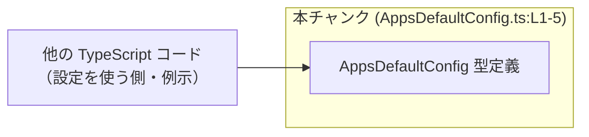
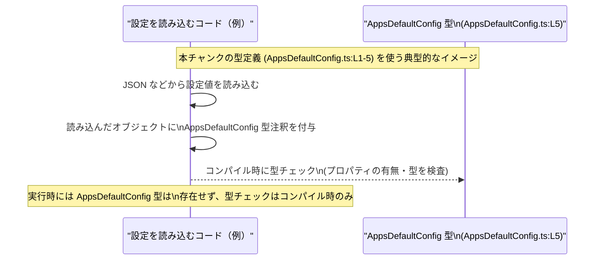

# app-server-protocol/schema/typescript/v2/AppsDefaultConfig.ts コード解説

## 0. ざっくり一言

- `AppsDefaultConfig` という、3 つの boolean フラグを持つ設定オブジェクト型を定義・エクスポートする、自動生成された TypeScript の型定義ファイルです（AppsDefaultConfig.ts:L1-5）。

---

## 1. このモジュールの役割

### 1.1 概要

- このモジュールは、`AppsDefaultConfig` という TypeScript の型エイリアス（type alias）を公開します（AppsDefaultConfig.ts:L5）。
- `AppsDefaultConfig` は、`enabled` / `destructive_enabled` / `open_world_enabled` の 3 つの boolean プロパティを持つオブジェクト型です（AppsDefaultConfig.ts:L5）。
- ファイル先頭コメントから、この型定義は `ts-rs` によって自動生成されており、手作業での編集は想定されていません（AppsDefaultConfig.ts:L1-3）。

### 1.2 アーキテクチャ内での位置づけ

このファイル自身は、**型定義のみを提供するモジュール**です。  
TypeScript の `export type` で公開されているため、他の TypeScript ファイルからインポートされて利用される前提の構造になっています（AppsDefaultConfig.ts:L5）。

以下は、「型定義モジュール」としての位置づけを示す概念図です（本チャンクの範囲 AppsDefaultConfig.ts:L1-5 を表現）。



> 注意: 上図の「他の TypeScript コード」は一般的な利用イメージであり、実際にどのモジュールがこの型をインポートしているかは、このチャンクからは分かりません。

### 1.3 設計上のポイント

- **自動生成ファイル**  
  - 冒頭コメントで「GENERATED CODE」「Do not edit this file manually」と明示されています（AppsDefaultConfig.ts:L1-3）。
  - 本来のメンテナンス対象は、`ts-rs` が参照する元のスキーマ定義側になります（元ファイルの位置はこのチャンクからは不明です）。
- **状態やロジックを持たない**  
  - 定義されているのは型エイリアス 1 つだけであり、関数・クラス・実行時ロジックは一切含まれていません（AppsDefaultConfig.ts:L5）。
- **エラーハンドリングや並行性への関与なし**  
  - 実行コードを持たないため、エラー処理・例外・並行実行などに直接関与する部分はありません。
  - TypeScript の型システムを通じて、**コンパイル時の型安全性**にのみ寄与します。

---

## 2. 主要な機能一覧

このファイルが提供する「機能」は、1 つの型定義に集約されています。

- `AppsDefaultConfig` 型:  
  3 つの boolean プロパティ `enabled`, `destructive_enabled`, `open_world_enabled` を持つオブジェクト型を定義し、他モジュールから利用可能にします（AppsDefaultConfig.ts:L5）。

---

## 3. 公開 API と詳細解説

### 3.1 型一覧（構造体・列挙体など）

| 名前                | 種別                    | 役割 / 用途                                                                 | フィールド概要                                                                                                    | 定義位置                          |
|---------------------|-------------------------|------------------------------------------------------------------------------|-------------------------------------------------------------------------------------------------------------------|-----------------------------------|
| `AppsDefaultConfig` | 型エイリアス（オブジェクト型） | 3 つの boolean フラグを持つ設定オブジェクトの形を表すコンパイル時の型。用途は名前から設定関連と推測されますが、コードからは断定できません。 | `enabled: boolean`, `destructive_enabled: boolean`, `open_world_enabled: boolean` の 3 プロパティ（すべて必須） | AppsDefaultConfig.ts:L5          |

#### `AppsDefaultConfig` の構造（TypeScript 観点）

```typescript
// AppsDefaultConfig.ts:L5
export type AppsDefaultConfig = {
    enabled: boolean,
    destructive_enabled: boolean,
    open_world_enabled: boolean,
};
```

- **型エイリアス（`type`）**  
  - `AppsDefaultConfig` という名前で、オブジェクト型に別名を付けています。
  - 実行時には存在しない「型レベルの情報」であり、JavaScript にコンパイルされると消えます。
- **boolean プロパティ**  
  - 各プロパティは `true` または `false` だけを許可し、それ以外の値（文字列 `"true"` など）はコンパイルエラーになります。
- **必須プロパティ**  
  - `?`（オプショナルマーク）が無いため、3 つとも必須です。  
    例: `{ enabled: true }` だけでは `AppsDefaultConfig` としては不完全で、コンパイルエラーになります。

### 3.2 関数詳細（最大 7 件）

- このファイルには、**関数・メソッド・クラスの定義は存在しません**（AppsDefaultConfig.ts:L1-5）。
- したがって、関数に関する詳細テンプレートの対象となる公開 API はありません。

### 3.3 その他の関数

| 関数名 | 役割（1 行） |
|--------|--------------|
| なし   | このファイルには関数定義がありません（AppsDefaultConfig.ts:L1-5）。 |

---

## 4. データフロー

このファイル自体には実行ロジックが無いため、内部でのデータフローは存在しません。  
ここでは、**典型的な利用イメージ**として、設定読み込みコードが `AppsDefaultConfig` 型を用いる場合のシーケンスを示します。

> 重要: 以下は一般的な TypeScript コードでの利用例であり、  
> 実際に本リポジトリがこのように利用しているかは、このチャンクからは分かりません。



要点:

- `AppsDefaultConfig` は **実行時の処理の通り道ではなく、コンパイル時の型チェックに関わるだけ**です。
- したがって、データの流れ・変換は利用側のコードで実装され、このモジュールはその「形」を記述する役割に留まります。

---

## 5. 使い方（How to Use）

### 5.1 基本的な使用方法

ここでは、`AppsDefaultConfig` 型をインポートして使う、最も基本的な例を示します。  
インポートパスはプロジェクト構成によりますので、例として `./AppsDefaultConfig` を用います。

```typescript
// AppsDefaultConfig 型をインポートする例                         // 実際のパスはプロジェクト構成に依存
import type { AppsDefaultConfig } from "./AppsDefaultConfig";    // 型としてのみ利用するので `import type` を使用

// AppsDefaultConfig 型に適合するオブジェクトを定義              // 3 つの boolean プロパティがすべて必須
const defaultConfig: AppsDefaultConfig = {                       // 型注釈により IDE 支援と型チェックが有効になる
    enabled: true,                                               // boolean 値
    destructive_enabled: false,                                  // boolean 値
    open_world_enabled: false,                                   // boolean 値
};

// 関数の引数として AppsDefaultConfig 型を使う例                 // この関数は設定オブジェクトを受け取る
function initWithConfig(config: AppsDefaultConfig) {             // config は 3 つのプロパティを必ず含む
    console.log(config.enabled);                                 // config.enabled は boolean として推論される
    // 実際の処理は利用側コードで定義される                      // このファイル内にはロジックは存在しない
}
```

ポイント:

- `import type` を使うと、コンパイラに「これは型だけをインポートする」と伝えられ、バンドル時に不要なコードが生成されません（TypeScript 特有の機能）。
- `AppsDefaultConfig` を使うことで、設定オブジェクトの形が明示され、プロパティ名の打ち間違いや型の不一致をコンパイル時に検出できます。

### 5.2 よくある使用パターン

1. **設定オブジェクトの引数・戻り値として使う**

```typescript
import type { AppsDefaultConfig } from "./AppsDefaultConfig";    // 型定義をインポート

// 設定を読み込む関数の戻り値として利用                           // 呼び出し側は AppsDefaultConfig 型のオブジェクトを受け取れる
function loadConfig(): AppsDefaultConfig {                       // 実装例は仮のもの
    const cfg = JSON.parse("{}");                                // 実際には外部から読み込むなど
    return cfg as AppsDefaultConfig;                             // 実運用では runtime バリデーション併用が望ましい
}

// 設定を受け取って処理する関数                                  // config の構造が型で保証される
function runWithConfig(config: AppsDefaultConfig) {              // 3 つの boolean プロパティに直接アクセス可能
    if (config.enabled) {                                        // boolean として IDE 補完が効く
        // ...
    }
}
```

1. **部分的な更新時にユーティリティ型と組み合わせる**

```typescript
import type { AppsDefaultConfig } from "./AppsDefaultConfig";    // 型定義をインポート

// Partial と組み合わせて「一部だけ更新するパッチ」を表現         // TypeScript のユーティリティ型と相性が良い
type AppsDefaultConfigPatch = Partial<AppsDefaultConfig>;       // 3 プロパティすべてがオプションになる

function updateConfig(                                          // 既存設定とパッチを受け取る
    base: AppsDefaultConfig,                                    // 元の設定
    patch: AppsDefaultConfigPatch                               // 更新したい部分だけ指定
): AppsDefaultConfig {
    return { ...base, ...patch };                               // スプレッド構文で新しい設定を作成
}
```

### 5.3 よくある間違い

#### 1. 必須プロパティの欠落

```typescript
import type { AppsDefaultConfig } from "./AppsDefaultConfig";

// 間違い例: 必須プロパティを省略している
const badConfig: AppsDefaultConfig = {
    enabled: true,               // OK
    // destructive_enabled が無い                         // コンパイルエラー
    // open_world_enabled が無い                          // コンパイルエラー
};

// 正しい例: 3 つのプロパティをすべて指定する
const goodConfig: AppsDefaultConfig = {
    enabled: true,
    destructive_enabled: false,
    open_world_enabled: false,
};
```

#### 2. 型の不一致（boolean 以外を指定）

```typescript
import type { AppsDefaultConfig } from "./AppsDefaultConfig";

// 間違い例: string を渡してしまっている
const badConfig2: AppsDefaultConfig = {
    enabled: "true",                // string 型 -> コンパイルエラー
    destructive_enabled: false,
    open_world_enabled: false,
};

// 正しい例: boolean を渡す
const goodConfig2: AppsDefaultConfig = {
    enabled: true,                  // boolean
    destructive_enabled: false,
    open_world_enabled: true,
};
```

#### 3. `any` を使って型安全性を失う

```typescript
// 間違い例: any を経由すると型チェックが効かなくなる
const fromJson: any = JSON.parse("{}");         // any 型: 何でも代入できるが危険
const badConfig3: AppsDefaultConfig = fromJson; // コンパイルは通るが、実行時にプロパティ欠落の可能性

// より安全な例: unknown からチェックしていく（例示）
const raw: unknown = JSON.parse("{}");          // unknown: 何でも入るが、そのままは使えない
// 実際にはここで runtime バリデーションや型ガードを行うべき        // このファイルにはロジックはないので、利用側で実装する
```

### 5.4 使用上の注意点（まとめ）

- **自動生成ファイルを直接編集しない**  
  - コメントに「GENERATED CODE」「Do not edit this file manually」とあるため（AppsDefaultConfig.ts:L1-3）、直接編集すると生成処理で上書きされる可能性が高いです。
- **実行時の検証は別途必要**  
  - `AppsDefaultConfig` はコンパイル時の型情報のみを提供し、実行時にオブジェクトの形を検証しません。
  - 外部入力（JSON, API レスポンスなど）をこの型として扱う場合、**別途 runtime バリデーションや型ガードを用意する必要**があります。
- **並行性・エラー処理には直接関与しない**  
  - この型は単なるデータ構造の形を表すだけであり、非同期処理・スレッド・例外処理などには影響しません。
- **プロパティ名の変更は影響範囲が大きい**  
  - 3 つのプロパティ名はすべて必須なため、名前を変えるとコンパイルエラーが多数発生する可能性があります（変更時は 6 章を参照）。

---

## 6. 変更の仕方（How to Modify）

### 6.1 新しい機能を追加する場合

このファイルは `ts-rs` によって自動生成されると明記されています（AppsDefaultConfig.ts:L1-3）。  
そのため、新しいフラグや設定項目を追加したい場合、**直接このファイルを編集するのは適切ではありません**。

一般的な手順（このチャンクから具体的なファイル名・パスは分かりません）:

1. **生成元のスキーマ定義を探す**  
   - コメントから `ts-rs` が使われていることは分かりますが（AppsDefaultConfig.ts:L1-3）、  
     どの言語・どのファイルかはこのチャンクには現れません。
2. **生成元の型定義に新しいプロパティを追加する**  
   - 例: 新しい boolean フラグ `experimental_enabled` を追加する、など。
3. **`ts-rs` によるコード生成を再実行する**  
   - これにより、`AppsDefaultConfig` 型にも新しいプロパティが反映されることが期待されます。
4. **TypeScript 側の利用コードを更新する**  
   - 新しいプロパティを必要に応じて設定・参照するように変更します。

> 注意: 生成元や生成手順の詳細は、このチャンクからは不明なため、プロジェクトのビルドスクリプトやドキュメントを確認する必要があります。

### 6.2 既存の機能を変更する場合

#### プロパティ名・型を変更する

- `enabled` / `destructive_enabled` / `open_world_enabled` の名前や型を変更すると、これらを参照しているすべての TypeScript コードが影響を受けます。
- 変更時の注意点:
  - **前提条件**: すべての利用箇所でコンパイルエラーが出なくなるまで修正する必要があります。
  - **意味的な変更に注意**: 型は boolean のままでも、名前の変更はビジネスロジックの解釈に影響する可能性があります（ただし、このチャンクからビジネス意味は読み取れません）。
  - **生成元を先に変更**: 直接このファイルを書き換えても、生成プロセスで元に戻るため、必ず生成元を変更する必要があります（AppsDefaultConfig.ts:L1-3）。

#### プロパティを削除する

- どれか 1 つでもプロパティを削除すると、そのプロパティにアクセスしているすべてのコードがコンパイルエラーになります。
- 互換性を保つ必要がある場合は、まず利用側コードからの参照を減らしたうえで型から削除する、など段階的な移行が必要です。

---

## 7. 関連ファイル

このチャンクには、直接の `import` や他ファイルへの参照は現れません（AppsDefaultConfig.ts:L1-5）。  
コメントから、自動生成に関わる「生成元」の存在だけが読み取れます。

| パス | 役割 / 関係 |
|------|------------|
| 不明（ts-rs の生成元） | コメントにより、このファイルが `ts-rs` によって生成されていることは分かります（AppsDefaultConfig.ts:L1-3）。生成元のスキーマ定義（おそらく別言語で書かれた型定義）が存在するはずですが、その位置やファイル名はこのチャンクからは特定できません。 |

---

## コンポーネントインベントリー（まとめ）

最後に、このチャンクで確認できるコンポーネントを一覧で整理します。

| 種別  | 名前                | 説明                                                                 | 定義位置                 |
|-------|---------------------|----------------------------------------------------------------------|--------------------------|
| 型    | `AppsDefaultConfig` | 3 つの boolean プロパティを持つ設定オブジェクトの型エイリアス。     | AppsDefaultConfig.ts:L5 |
| コメント | 生成コード注意書き | `ts-rs` による自動生成であり、手動編集すべきでないことを示すコメント。 | AppsDefaultConfig.ts:L1-3 |

このファイルには、関数・クラス・列挙体・定数など、その他のコンポーネントは定義されていません（AppsDefaultConfig.ts:L1-5）。
