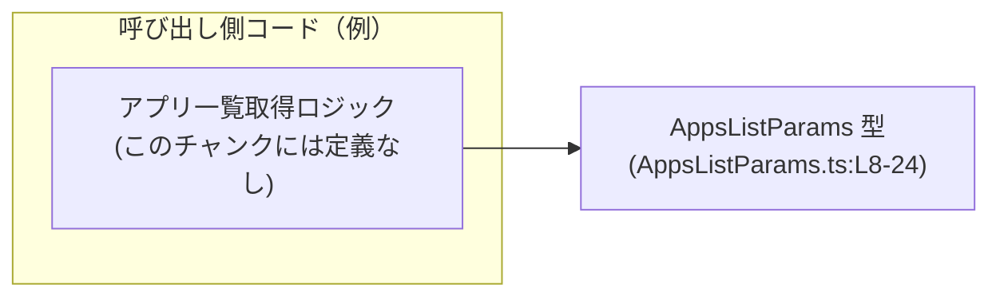
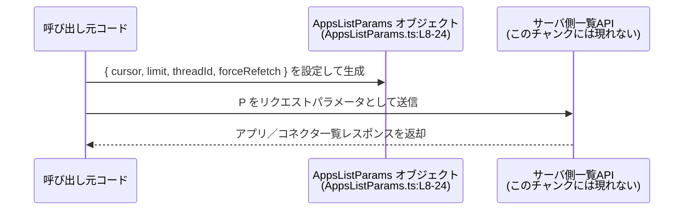

# app-server-protocol/schema/typescript/v2/AppsListParams.ts コード解説

## 0. ざっくり一言

- アプリ／コネクタの一覧取得 API のための「ページング・フィルタ用パラメータ」を表す TypeScript 型定義です（AppsListParams.ts:L5-8）。
- Rust から `ts-rs` により自動生成されており、このファイル自体は編集しない前提になっています（AppsListParams.ts:L1-3）。

---

## 1. このモジュールの役割

### 1.1 概要

- このモジュールは、**アプリ／コネクタ一覧の取得処理に渡すパラメータ**を表現する `AppsListParams` 型を提供します（AppsListParams.ts:L5-8）。
- ページネーション（`cursor`, `limit`）と、スレッドコンテキスト（`threadId`）、キャッシュバイパス指定（`forceRefetch`）をまとめて一つのオブジェクト型として定義しています（AppsListParams.ts:L9-24）。
- すべてのフィールドがオプショナルであり、省略された場合はサーバ側のデフォルトや挙動に委ねられる設計になっています（コメントより、AppsListParams.ts:L9-24）。

### 1.2 アーキテクチャ内での位置づけ

このファイル自体には import / 関数呼び出しは存在せず、他のモジュールから型として参照されることだけが読み取れます（AppsListParams.ts:L1-24）。

- 依存しているもの
  - なし（標準の TypeScript 型だけを使用しており、import 文もありません）（AppsListParams.ts:L1-24）。
- 依存されると想定されるもの
  - 「アプリ一覧取得 API のクライアント」や「型付き HTTP クライアント」などが、この型を引数やリクエストボディとして利用すると考えられますが、具体的なモジュール名はこのチャンクには現れません。

依存関係の概念図（このチャンクから分かる範囲でのイメージ）を示します。



- 図は、このファイルが「他のコードから参照されるだけの型定義」であることを表しています。
- サーバ側の実装や実際の API 関数は、このチャンクには現れないため「不明」です。

### 1.3 設計上のポイント

コードとコメントから読み取れる特徴は次のとおりです。

- **自動生成コード**  
  - ファイル冒頭で `GENERATED CODE` と `ts-rs` による生成であることが明示されています（AppsListParams.ts:L1-3）。  
  - 手動編集しない前提のため、変更は生成元（Rust 側）で行う設計です。

- **純粋なデータ型（状態を持たない）**  
  - `export type ... = { ... }` のみで、クラスや関数は定義されていません（AppsListParams.ts:L8-24）。
  - ロジックやメソッドを持たない「DTO（データ転送オブジェクト）」に近い役割です。

- **すべてのフィールドがオプショナルかつ一部が null 許容**  
  - `cursor?: string | null`（AppsListParams.ts:L9-12）  
  - `limit?: number | null`（AppsListParams.ts:L13-16）  
  - `threadId?: string | null`（AppsListParams.ts:L17-20）  
  - `forceRefetch?: boolean`（AppsListParams.ts:L21-24）  
  - 呼び出し側コードは、`undefined`（プロパティ未定義）と `null`（明示的な「値なし」）の両方を扱う必要があります。

- **エラーや並行性に関するロジックは持たない**  
  - 例外処理や非同期処理は一切なく、単なる型定義であるため、このモジュール単体ではエラー・並行性の挙動はありません。

---

## 2. 主要な機能一覧

このファイルは 1 つの公開型を提供します。

- `AppsListParams`:  
  アプリ／コネクタ一覧取得のためのパラメータをまとめたオブジェクト型。ページング、スレッドコンテキスト、キャッシュバイパスを指定可能（AppsListParams.ts:L5-8, L9-24）。

---

## 3. 公開 API と詳細解説

### 3.1 型一覧（構造体・列挙体など）

このファイルに定義されている型は次の 1 つです。

| 名前 | 種別 | 役割 / 用途 | 定義位置 |
|------|------|-------------|----------|
| `AppsListParams` | 型エイリアス（オブジェクト型） | アプリ／コネクタ一覧 API 向けのリクエストパラメータを表現する。ページングカーソル、件数上限、スレッド ID、キャッシュバイパスフラグを含む。 | AppsListParams.ts:L5-8, L9-24 |

`AppsListParams` のフィールド詳細を示します。

| フィールド名 | 型 | 必須 / 任意 | 説明 | 根拠 |
|-------------|----|------------|------|------|
| `cursor` | `string \| null`（オプショナル） | 任意 | 前回呼び出しで返された「不透明なページングカーソル」。指定するとその位置からの続きが取得される想定です（コメントより）。 | AppsListParams.ts:L9-12 |
| `limit` | `number \| null`（オプショナル） | 任意 | 1 ページあたりの最大件数。省略時はサーバ側の「妥当なデフォルト値」が使われるとコメントされています。 | AppsListParams.ts:L13-16 |
| `threadId` | `string \| null`（オプショナル） | 任意 | 特定のスレッド設定に基づいてアプリの機能制限（feature gating）を判断したい場合に使うスレッド ID。 | AppsListParams.ts:L17-20 |
| `forceRefetch` | `boolean`（オプショナル） | 任意 | `true` の場合、アプリキャッシュをバイパスし、ソースから最新データを取得することを指示するフラグ。 | AppsListParams.ts:L21-24 |

> コメント内に「EXPERIMENTAL」とあるため、API 全体が実験的であり将来的に変わる可能性があることが示唆されています（AppsListParams.ts:L5-7）。ただし、将来の具体的な変更内容はこのチャンクからは分かりません。

### 3.2 関数詳細（最大 7 件）

このファイルには関数・メソッドの定義は存在しません（AppsListParams.ts:L1-24）。  
そのため、関数詳細テンプレートを適用できる対象はありません。

- `functions=0` というメタ情報とも一致しています（ユーザー指定メタ）。

### 3.3 その他の関数

- 該当なし（このチャンクには関数やラッパー関数は現れません）。

---

## 4. データフロー

このファイルは型定義のみですが、典型的な利用シナリオとして、「クライアントコードが `AppsListParams` オブジェクトを組み立て、それを用いてサーバにアプリ一覧を問い合わせる」という流れが想定されます。

このシナリオの概念的なデータフローを sequence diagram で示します（図中の `AppsListParams` はこのファイルの定義（AppsListParams.ts:L8-24）を指します）。



- この図はあくまで「この型がどのように使われるか」の典型例を示す概念図です。
- サーバ側のエンドポイント名やレスポンス型は、このチャンクには現れないため不明です。

---

## 5. 使い方（How to Use）

### 5.1 基本的な使用方法

`AppsListParams` 型を用いて、一覧取得用のパラメータを組み立てる例です。  
ここでの `listApps` 関数は**仮の関数名であり、このチャンクには定義がありません**。

```typescript
// 仮のインポート例: 実際のパスはプロジェクト構成に依存します
import type { AppsListParams } from "./AppsListParams";  // AppsListParams 型をインポートする

// 仮の一覧取得関数: 実際の実装はこのチャンクには現れません
async function listApps(params: AppsListParams): Promise<void> {   // AppsListParams 型を引数に取る
    // ここでは実際の HTTP 呼び出しなどは省略                         // この部分の実装はこのファイルからは不明
    console.log("listing apps with params", params);               // 渡されたパラメータをログに出すだけの仮実装
}

// 一覧取得のためのパラメータを組み立てる
const params: AppsListParams = {
    cursor: null,              // 最初のページなのでカーソルは null または省略
    limit: 50,                 // 1 ページあたり 50 件を要求
    threadId: "thread_123",    // 特定スレッドの設定を考慮したい場合
    forceRefetch: false,       // 通常はキャッシュを利用
};

// 非同期で一覧取得処理を呼び出す
await listApps(params);        // 上記のパラメータを用いてアプリ一覧を取得する想定
```

この例では TypeScript の型チェックにより、`limit` に文字列を入れるなどの型不整合がコンパイル時に検出されます。

### 5.2 よくある使用パターン

1. **初回取得（デフォルト設定に任せる）**

```typescript
const params: AppsListParams = {
    // 何も指定せず、サーバ側のデフォルト挙動に任せるパターン      // cursor, limit, threadId を省略
    forceRefetch: false,                                              // キャッシュ利用（省略しても同等の挙動かどうかは不明）
};
```

- `cursor` と `limit` を省略すると、コメントの通り「妥当なサーバ側のデフォルト値」が使われると読めます（AppsListParams.ts:L13-16）。
- `forceRefetch` もオプショナルなので、省略すればサーバ側のデフォルト挙動になりますが、その具体的な内容はこのチャンクには現れません。

1. **次ページ以降の取得**

```typescript
const nextParams: AppsListParams = {
    cursor: "opaque-cursor-from-previous-call",  // 前回レスポンスでもらったカーソル
    limit: 50,                                   // 同じページサイズを指定
    // threadId や forceRefetch は必要に応じて指定
};
```

- コメントに「Opaque pagination cursor returned by a previous call」とあるため、サーバから返されたカーソル文字列をそのまま渡す前提が分かります（AppsListParams.ts:L9-12）。

1. **キャッシュを無視して最新情報を取得**

```typescript
const freshParams: AppsListParams = {
    forceRefetch: true,          // キャッシュをバイパスして最新データを取得させたい
    // 他のフィールドは状況に応じて指定
};
```

- `forceRefetch` が `true` のときにどの程度キャッシュがバイパスされるか（全てか一部か）は、このチャンクのコメント以上の詳細は不明です（AppsListParams.ts:L21-24）。

### 5.3 よくある間違い

この型を利用する際に起こりそうな誤用例と、その修正版です。

```typescript
// 誤り例: limit に文字列を渡してしまう
const wrongParams1: AppsListParams = {
    limit: "10",             // ❌ Type 'string' is not assignable to type 'number | null'
};

// 正しい例: number 型で渡す
const correctParams1: AppsListParams = {
    limit: 10,               // ✅ number 型なので AppsListParams と一致
};
```

```typescript
// 誤り例: cursor を undefined で明示的に上書きしようとする
const wrongParams2: AppsListParams = {
    cursor: undefined,       // ❌ 型上は string | null を要求しており、undefined は直接は許されない
};

// 正しい例1: プロパティ自体を省略する
const correctParams2a: AppsListParams = {
    // cursor を省略すれば OK (オプショナルなので undefined を表現できる)
};

// 正しい例2: null を使って「値なし」を明示する
const correctParams2b: AppsListParams = {
    cursor: null,            // null は型定義に含まれているため問題ない
};
```

> `cursor?: string | null` という定義から、**「プロパティを省略することで `undefined`」と「null を明示することで `null`」を区別できる**ことが分かります（AppsListParams.ts:L9-12）。

### 5.4 使用上の注意点（まとめ）

- **自動生成ファイルを直接編集しない**  
  - 冒頭コメントに「GENERATED CODE! DO NOT MODIFY BY HAND!」とあり、手動編集しない方針が明示されています（AppsListParams.ts:L1-3）。  
  - 型定義を変更したい場合は、生成元（Rust の型定義）および `ts-rs` 側の設定を変更する必要があります。このチャンクから生成元の場所は分かりません。

- **オプショナルかつ null 許容フィールドの扱い**  
  - `cursor`, `limit`, `threadId` は「省略（undefined）」と「null」が区別される設計です（AppsListParams.ts:L9-20）。  
  - これらを受け取る関数を実装する場合は、`value === undefined` と `value === null` の両方に対する処理を検討する必要があります。

- **エラーやバリデーションは別レイヤーで行う必要がある**  
  - この型定義だけでは、「limit の最大値」や「cursor のフォーマット」などは制約されません。  
  - 実際のバリデーションロジックは他のコード（このチャンクには現れない）で実装される必要があります。

- **並行性・非同期性との関係**  
  - この型は純粋なデータコンテナであり、Promise や async/await などの非同期構造とは直接関係しません。  
  - 非同期処理における競合（例: 異なる cursor での並列リクエストなど）の扱いは、呼び出し側の実装に依存します。

---

## 6. 変更の仕方（How to Modify）

このファイルは自動生成であるため、**直接の編集は推奨されません**。変更を行う場合の考え方を、生成元を変更することを前提に整理します。

### 6.1 新しい機能を追加する場合

例: 新たに `appType` のようなフィルタパラメータを追加したい場合。

1. **生成元の Rust 型を修正**  
   - `ts-rs` に対応した Rust 構造体に新しいフィールドを追加する必要があります。  
   - 生成元の具体的なファイルパスや型名は、このチャンクには現れないため不明です。

2. **`ts-rs` による再生成を実行**  
   - ビルドスクリプトやコード生成スクリプトを通して TypeScript ファイルを再生成します。  
   - 再生成後、`AppsListParams.ts` に新しいフィールド定義が反映されるはずです。

3. **呼び出し側コードの更新**  
   - 追加フィールドを利用する場合、TypeScript 側で `AppsListParams` を使っている箇所のオブジェクトリテラルを更新します。
   - 新しいフィールドを必須にした場合は、コンパイルエラーで不足箇所が検出されます。

### 6.2 既存の機能を変更する場合

例: `limit` の意味を変える、型を変える、フィールド名を変更するなど。

- **影響範囲の確認**
  - `AppsListParams` 型を import している全てのファイルが影響を受けます。  
  - 具体的な import 先はこのチャンクからは分からないため、プロジェクト全体で `AppsListParams` を検索して確認する必要があります。

- **契約（前提条件・返り値の意味）の維持**
  - コメントには API の利用者向けの契約（例: 「limit はデフォルト値を持つ」「cursor は不透明な値」）が簡易的に記述されています（AppsListParams.ts:L9-16）。  
  - これらの意味を変更する場合は、API ドキュメント側も含めて整合性を取る必要があります。

- **テスト・利用箇所の再確認**
  - このファイル内にはテストコードは存在しません（AppsListParams.ts:L1-24）。  
  - 型を参照する上位レイヤー（HTTP クライアントやビジネスロジック）のテストを実行し、リクエストフォーマットの変更が問題を起こしていないか確認する必要があります。

---

## 7. 関連ファイル

このチャンクから直接分かる関連は限られていますが、推論ではなく事実として読み取れる範囲で整理します。

| パス / コンポーネント | 役割 / 関係 |
|-----------------------|------------|
| `app-server-protocol/schema/typescript/v2/AppsListParams.ts` | 現在のファイル。アプリ一覧取得用のパラメータ型 `AppsListParams` を定義する（AppsListParams.ts:L5-8, L9-24）。 |
| `ts-rs` （外部クレート / ツール） | ファイル冒頭コメントに、このファイルが `ts-rs` によって生成されたと記載されています（AppsListParams.ts:L1-3）。生成元の Rust コードや設定はこのチャンクには現れません。 |

- 実際に `AppsListParams` を import して使っている TypeScript ファイルや、生成元の Rust 構造体のファイルパスは、このチャンクには現れないため「不明」です。
- テストコードやサポートユーティリティとの関係も、このチャンクだけからは判断できません。

---

### Bugs / Security / Contracts / Edge Cases に関する補足

- **Bugs / Security**  
  - このファイルは型定義のみでロジックを持たないため、このチャンク単体から具体的なバグやセキュリティ問題を特定することはできません。  
  - `forceRefetch` によってキャッシュバイパスが増えると、バックエンドの負荷が高まる可能性はありますが、その具体的な実装や防御策はこのチャンクには現れません。

- **Contracts（契約）**  
  - コメントにより、各フィールドの意味と挙動上の契約が簡潔に示されています（AppsListParams.ts:L9-24）。  
  - 特に `cursor` が「不透明値」であること、`limit` がサーバ側デフォルトを持つことは API 仕様上の重要な契約と解釈できます。

- **Edge Cases（エッジケース）**  
  - すべてのフィールドがオプショナルであるため、「完全に空のオブジェクト `{}`」も `AppsListParams` として有効です（AppsListParams.ts:L8-24）。  
  - `cursor`, `limit`, `threadId` は `undefined`（プロパティ未定義）と `null`（明示的な空値）の両方を取り得るため、利用側での条件分岐に注意が必要です。
