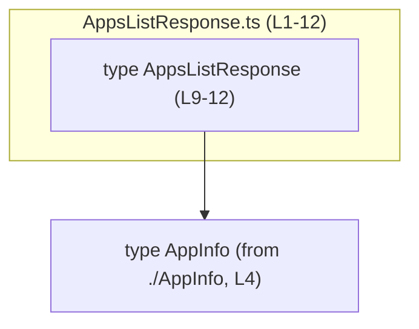
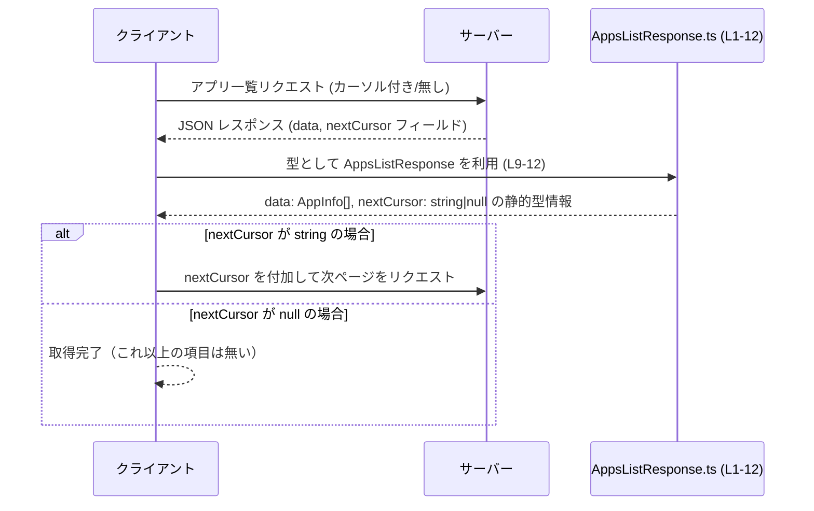

app-server-protocol/schema/typescript/v2/AppsListResponse.ts

---

## 0. ざっくり一言

`AppsListResponse` は、アプリ一覧 API（実験的）のレスポンス構造を表す **TypeScript の型定義**です。  
アプリ情報の配列と、続きのページを取得するためのカーソル文字列（または `null`）から成ります（AppsListResponse.ts:L1-12）。

---

## 1. このモジュールの役割

### 1.1 概要

- このモジュールは「アプリ一覧取得 API のレスポンス形式」を TypeScript で表現するために存在しています（AppsListResponse.ts:L6-12）。
- `data` フィールドで `AppInfo` の配列を、`nextCursor` フィールドでページネーション用カーソルを表します（AppsListResponse.ts:L9-12）。
- ファイル先頭コメントより、このファイルは `ts-rs` により **自動生成**されており、手動で編集しないことが明示されています（AppsListResponse.ts:L1-3）。

### 1.2 アーキテクチャ内での位置づけ

コードから読み取れる依存関係は次の通りです。

- 依存先:
  - `./AppInfo` から `AppInfo` を型としてインポート（AppsListResponse.ts:L4）
- 提供する公開 API:
  - `export type AppsListResponse`（AppsListResponse.ts:L9-12）



> 補足: `import type { AppInfo } from "./AppInfo";` という相対パス（AppsListResponse.ts:L4）から、このファイルと同じディレクトリに `AppInfo.ts` が存在すると考えられますが、当該ファイルの内容はこのチャンクには現れません。

### 1.3 設計上のポイント

コードとコメントから読み取れる設計上の特徴は以下の通りです。

- **自動生成コード**（AppsListResponse.ts:L1-3）
  - 手動編集禁止がコメントで明示されています。
  - スキーマの単一源泉（おそらく Rust 側）から TS 型を同期させる前提の設計です。
- **純粋なデータ型定義のみ**
  - 関数やクラス、メソッドは存在せず、型エイリアスのみを公開します（AppsListResponse.ts:L9-12）。
  - ランタイムロジック・検証・変換処理はこのモジュールには含まれません。
- **ページネーション用カーソルの表現**
  - `nextCursor: string | null` により、「あるときは文字列、終端では `null`」という契約を型レベルで表現しています（AppsListResponse.ts:L9-12）。
  - コメントでは「If None, there are no more items to return.」とあり、Rust 側の `Option` 由来であることが示唆されています（AppsListResponse.ts:L10-12）。
- **型安全性**
  - `data` は `Array<AppInfo>` として、配列要素の型が明示されているため、TypeScript のコンパイル時チェックにより誤用を防げます（AppsListResponse.ts:L9-12）。
- **状態／並行性**
  - このモジュールは状態を持たない純粋な型定義であり、スレッドセーフ性・並行性に関するロジックは存在しません。

---

## 2. 主要な機能一覧

このファイルが提供する「機能」は、実行時の処理ではなく **スキーマ定義**です。

- `AppsListResponse` 型定義: アプリ一覧レスポンスの構造（`data` と `nextCursor`）を表現する（AppsListResponse.ts:L9-12）。
- `AppInfo` への依存: 各アプリの詳細構造を `AppInfo` 型に委ねる（AppsListResponse.ts:L4, L9-12）。

---

## 3. 公開 API と詳細解説

### 3.1 型一覧（構造体・列挙体など）

このファイル内に現れる主要な型の一覧です。

| 名前                | 種別        | 役割 / 用途                                                                                           | 定義/使用行                   |
|---------------------|-------------|--------------------------------------------------------------------------------------------------------|-------------------------------|
| `AppsListResponse`  | 型エイリアス | アプリ一覧 API のレスポンス全体の形を表す。`data` と `nextCursor` を含むオブジェクト型（公開 API）      | 定義: AppsListResponse.ts:L9-12 |
| `AppInfo`           | 型（外部）  | 個々のアプリ情報の構造を表す型。ここでは配列要素の型としてのみ参照される（インポートのみ）             | import: AppsListResponse.ts:L4, 使用: L9 |

#### `AppsListResponse` のフィールド詳細

`AppsListResponse` は、次の 2 つのプロパティを持つオブジェクト型です（AppsListResponse.ts:L9-12）。

```typescript
export type AppsListResponse = {
    data: Array<AppInfo>,          // アプリ情報の配列
    nextCursor: string | null,     // 次ページ取得用カーソル（なければ null）
};
```

- `data: Array<AppInfo>`（AppsListResponse.ts:L9）
  - 意味: アプリ一覧データ本体。
  - 型安全性:
    - 各要素は `AppInfo` 型として扱われ、例えば `id` や `name` など `AppInfo` で定義されたプロパティ以外は利用できません（`AppInfo` の中身自体はこのチャンクからは不明）。
- `nextCursor: string | null`（AppsListResponse.ts:L10-12）
  - 意味: 次のページを取得するために API に渡す不透明なカーソル文字列。
  - コメントより、`null` の場合は「これ以上返すアイテムがない」ことを表すとされています（AppsListResponse.ts:L10-12）。
  - 型安全性:
    - ユニオン型 `string | null` により、「必ずプロパティは存在するが、値が `null` の場合がある」ことがコンパイル時に分かります。
    - `strictNullChecks` が有効な TypeScript 設定であれば、`nextCursor` を文字列として扱うには `null` チェックが必須となります。

### 3.2 関数詳細（最大 7 件）

このファイルには **関数やメソッドは定義されていません**（AppsListResponse.ts:L1-12）。

したがって、「関数詳細テンプレート」を適用すべき対象は存在しません。

- ページネーション処理や API 通信処理は、別のモジュールで実装されているか、もしくはこのチャンクには現れません。

### 3.3 その他の関数

- 該当なし（このファイルには関数が存在しません）。

---

## 4. データフロー

このモジュール自体はデータ構造のみを定義しますが、型名とコメントから想定される典型的な利用フローを示します。  
ここで示すフローは **想定例**であり、実際の API パスや実装はこのチャンクからは分かりません。

1. クライアントが「アプリ一覧取得 API」を呼び出す。
2. サーバーがアプリ一覧と、次のページがあればカーソルを含むレスポンスを返す。
3. クライアントはレスポンス JSON を `AppsListResponse` として扱う。
4. `nextCursor` が `null` でなければ、同じ API をカーソル付きで再度呼び出す。



> 根拠: `EXPERIMENTAL - app list response.` というコメント（AppsListResponse.ts:L6-8）と `nextCursor` の説明（AppsListResponse.ts:L10-12）から、「リスト API のページネーションレスポンス」であると解釈できます。

---

## 5. 使い方（How to Use）

### 5.1 基本的な使用方法

`AppsListResponse` を利用する典型的な TypeScript コード例です。  
ここでは、外部 API から JSON を取得し、この型として扱う想定です。

```typescript
// AppsListResponse 型をインポートする
import type { AppsListResponse } from "./AppsListResponse";  // ファイル名と一致 (L9-12)

// アプリ一覧を 1 ページ取得する例
async function fetchAppsPage(nextCursor: string | null): Promise<AppsListResponse> {
    // nextCursor があればクエリに付与する
    const query = nextCursor ? `?cursor=${encodeURIComponent(nextCursor)}` : "";

    // 外部 API から JSON を取得する（API の実体はこのチャンク外）
    const res = await fetch(`/api/apps${query}`);

    // JSON をパースし、AppsListResponse として扱う
    const json = await res.json();
    return json as AppsListResponse;  // 型アサーションで静的型を付与
}

// 利用側: data と nextCursor を扱う
async function exampleUsage() {
    let cursor: string | null = null;

    const page: AppsListResponse = await fetchAppsPage(cursor);

    // data は AppInfo[] 型として扱える（要素構造は AppInfo の定義による）
    console.log("アプリ件数:", page.data.length);

    // nextCursor が null かどうかで続きがあるか判定
    if (page.nextCursor !== null) {
        console.log("続きのページがあります。次カーソル:", page.nextCursor);
    } else {
        console.log("これ以上のページはありません。");
    }
}
```

- この例は、`AppsListResponse` の **フィールド構造と `string | null` の扱い**を示すためのものであり、実際の API パスやエラーハンドリングはこのチャンクからは分かりません。

### 5.2 よくある使用パターン

1. **単一ページだけを取得して使う**

```typescript
import type { AppsListResponse } from "./AppsListResponse";

async function fetchFirstPage(): Promise<void> {
    const res = await fetch("/api/apps");
    const body = (await res.json()) as AppsListResponse;

    // 1ページ目の data のみ利用し、nextCursor は無視するパターン
    body.data.forEach(app => {
        // app は AppInfo 型（構造は AppInfo 定義による）
        console.log(app);
    });
}
```

1. **全ページを走査するページネーションループ**

```typescript
import type { AppsListResponse } from "./AppsListResponse";

async function fetchAllApps(): Promise<void> {
    let cursor: string | null = null;
    const allApps: Array<unknown> = [];   // 実際は AppInfo 型にすべきだが、ここでは型詳細が不明

    while (true) {
        const res = await fetch(`/api/apps${cursor ? `?cursor=${cursor}` : ""}`);
        const page = (await res.json()) as AppsListResponse;  // (L9-12)

        allApps.push(...page.data);

        // nextCursor が null なら終了（AppsListResponse.ts:L10-12）
        if (page.nextCursor === null) {
            break;
        }

        cursor = page.nextCursor;
    }

    console.log("取得したアプリ総数:", allApps.length);
}
```

### 5.3 よくある間違い

この型定義から起こりやすい誤用例と、その修正例です。

#### 誤用例 1: `nextCursor` を常に文字列だと思い込む

```typescript
import type { AppsListResponse } from "./AppsListResponse";

function wrongUsage(resp: AppsListResponse) {
    // ❌ 誤り: nextCursor が null の可能性を無視している
    console.log("カーソル長:", resp.nextCursor.length);  // 実行時に TypeError になりうる
}
```

正しい例:

```typescript
function correctUsage(resp: AppsListResponse) {
    if (resp.nextCursor !== null) {                          // null を明示的にチェック
        console.log("カーソル長:", resp.nextCursor.length);  // ここでは string として安全に使える
    } else {
        console.log("次ページはありません");
    }
}
```

> 根拠: `nextCursor: string | null` という型定義（AppsListResponse.ts:L9-12）と、コメント「If None, there are no more items to return.」（AppsListResponse.ts:L10-12）。

#### 誤用例 2: `data` をオプショナルだと誤解する

```typescript
function wrongUsage2(resp: AppsListResponse) {
    // ❌ 誤り: data プロパティがない可能性を考慮している（実際には必須）
    if (!resp.data) {
        // data は常に定義されているため、この分岐は想定外
        console.log("データがありません");
    }
}
```

正しい理解:

```typescript
function correctUsage2(resp: AppsListResponse) {
    // data は必須フィールド（AppsListResponse.ts:L9）
    if (resp.data.length === 0) {
        console.log("0 件ですが、レスポンスとしては有効です");
    } else {
        console.log("アプリ件数:", resp.data.length);
    }
}
```

### 5.4 使用上の注意点（まとめ）

- **自動生成コードのため編集禁止**
  - 先頭コメントに「GENERATED CODE! DO NOT MODIFY BY HAND!」とある通り、変更は元スキーマ側で行う必要があります（AppsListResponse.ts:L1-3）。
- **`nextCursor` の null 取り扱い**
  - `string | null` であり、終端では `null` になるとコメントされています（AppsListResponse.ts:L10-12）。
  - 文字列として利用する場合は必ず `null` チェックを行う必要があります。
- **バリデーションは別モジュールで必要**
  - この型は静的な構造のみを表すため、実際の入力値検証（例: 不正な文字列やサイズ制限など）は、別の層で実装する必要があります。
- **並行性**
  - このモジュールは単なるデータ型定義であり、並行アクセスに関する問題は原理的にありません。  
    ただし、レスポンスの取得や更新ロジック（API 呼び出しなど）側では、同時リクエストの整合性に留意する必要があります（このチャンクには現れません）。

---

## 6. 変更の仕方（How to Modify）

### 6.1 新しい機能を追加する場合

このファイルは自動生成されているため、**直接変更すべきではありません**（AppsListResponse.ts:L1-3）。  
新しいフィールドや機能を追加したい場合の一般的な手順は、コメントから読み取れる範囲では次の通りです。

1. **元スキーマの変更**
   - コメントに `ts-rs` が言及されていることから、Rust 側の構造体や型定義を変更することで、この TypeScript 型が再生成されると考えられます（AppsListResponse.ts:L1-3）。
   - 具体的な Rust 側のファイルや型名は、このチャンクには現れません。
2. **コード生成の再実行**
   - `ts-rs` を用いたビルドまたはコード生成手順を実行し、新しい `AppsListResponse.ts` を生成します。
3. **利用側コードの更新**
   - 追加したフィールドを TypeScript コードから参照するよう修正します。
   - 既存の利用箇所で、追加フィールドが必須かオプションかに応じた対応を行います。

### 6.2 既存の機能を変更する場合

同様に、`AppsListResponse.ts` の直接編集は避ける必要があります（AppsListResponse.ts:L1-3）。

- **フィールド名・型の変更**
  - Rust 側（`ts-rs` の入力となる構造体）で名前や型を変更し、再生成します。
  - 変更に伴い、TypeScript 側のすべての参照箇所を更新する必要があります。
  - 例: `nextCursor: string | null` を `cursor: string | null` に変える場合、全呼び出し元で `nextCursor` から `cursor` への修正が必要になります。
- **互換性への配慮**
  - 既存クライアントとの下位互換性を維持するかどうかは、このチャンクからは分かりませんが、API レスポンス変更には互換性の検討が必須です。
- **テスト**
  - このファイルにはテストコードは存在しません（AppsListResponse.ts:L1-12）。  
    変更に応じて、API レスポンスを検証するテスト（統合テストや型レベルのテスト）を別途用意する必要があります。

---

## 7. 関連ファイル

このモジュールと密接に関係すると思われるファイル・ディレクトリです（コードから直接読み取れる範囲に限定します）。

| パス（推定を含む）                                           | 役割 / 関係 |
|-------------------------------------------------------------|------------|
| `app-server-protocol/schema/typescript/v2/AppInfo.ts`（推定） | `import type { AppInfo } from "./AppInfo";` に対応するファイルと考えられます（AppsListResponse.ts:L4）。各アプリの詳細情報の型を定義し、本モジュールの `data: Array<AppInfo>` で使用されます（AppsListResponse.ts:L9）。 |
| Rust 側のスキーマ定義ファイル（具体的パスは不明）            | コメントに `ts-rs` が記載されていることから、この TypeScript 型の元となる Rust の型定義が存在すると考えられます（AppsListResponse.ts:L1-3）。ただし、このチャンクから具体的パスや型名は不明です。 |

---

### Bugs / Security / Contracts / Edge Cases / Tests / Performance まとめ

このファイルは単なる型定義であり、実行時ロジックは含みませんが、観点ごとに整理します。

- **Bugs**
  - 型定義自体に実装上のバグは見当たりません（AppsListResponse.ts:L9-12）。
  - 利用側で `nextCursor` の `null` を扱わない場合、実行時エラーを招く可能性があります（5.3 参照）。
- **Security**
  - この型は外部からのデータ形式を表すため、実データが信頼できない場合は、別途バリデーションやサニタイズが必要です。
  - 型定義だけでは、入力サイズや内容に対する制限を強制できません。
- **Contracts（契約）**
  - `data` は必須の配列フィールド（AppsListResponse.ts:L9）。
  - `nextCursor` は常に存在するが、終端時は `null`（AppsListResponse.ts:L10-12）。
- **Edge Cases**
  - `data` が空配列 `[]` のケース（有効なレスポンスである可能性がある）。
  - `nextCursor === null` であるケース（ページネーション終端）。
- **Tests**
  - このファイルにはテストコードが存在しないため、型定義の整合性や API レスポンスの検証は別途テストコードで行う必要があります。
- **Performance / Scalability**
  - このモジュール自体は型定義のみであり、パフォーマンスへの直接の影響はありません。
  - 実運用では、`data` の配列サイズが大きくなりすぎないよう、サーバー側のページサイズ設計が必要になります（このチャンクには現れません）。
