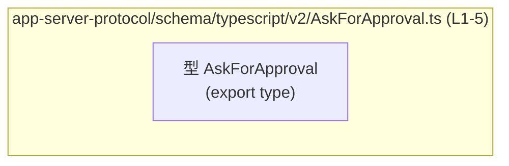
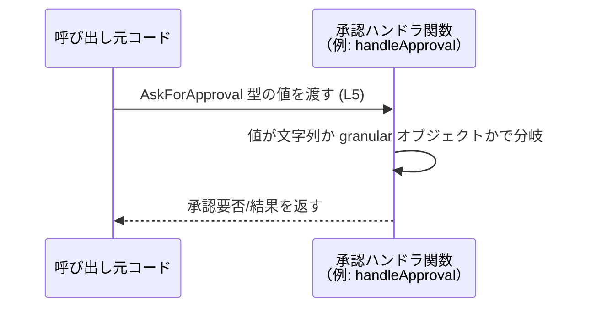

# app-server-protocol/schema/typescript/v2/AskForApproval.ts コード解説

## 0. ざっくり一言

`AskForApproval` という名前の **承認ポリシーを表す TypeScript の union 型定義**です。  
4 種類の文字列リテラルと、詳細なフラグを持つオブジェクト形式、そして `"never"` を 1 つの型としてまとめています（AskForApproval.ts:L5-5）。

---

## 1. このモジュールの役割

### 1.1 概要

- このモジュールは、`AskForApproval` という **設定値／状態を表す型**を 1 つだけ公開しています（AskForApproval.ts:L5-5）。
- `AskForApproval` は、以下のいずれかの形を取る union 型です（AskForApproval.ts:L5-5）。
  - `"untrusted"`
  - `"on-failure"`
  - `"on-request"`
  - `"never"`
  - `{ granular: { sandbox_approval: boolean; rules: boolean; skill_approval: boolean; request_permissions: boolean; mcp_elicitations: boolean } }`
- コメントにより、このファイルは `ts-rs` によって自動生成されており、手動で編集すべきでないことが明記されています（AskForApproval.ts:L1-3）。

名前からは「何かの操作について、どのタイミング・どの粒度で承認を求めるか」を指定する設定型と推測されますが、実際に何を承認しているかまではこのチャンクからは分かりません。

### 1.2 アーキテクチャ内での位置づけ

- このファイルは型定義のみを含み、**他モジュールの import や関数定義は存在しません**（AskForApproval.ts:L1-5）。
- そのため、このチャンクからは **どのモジュールから利用されているか・どこに依存しているか** は分かりません。

依存関係の観点で、このファイル単体を表す図は次のようになります。



### 1.3 設計上のポイント

コードから読み取れる設計上の特徴は次のとおりです。

- **自動生成ファイル**  
  - 先頭コメントに「GENERATED CODE」「Do not edit this file manually」とあり（AskForApproval.ts:L1-3）、Rust 側の型定義などから `ts-rs` で生成されていることが分かります。
- **union 型による状態表現**（AskForApproval.ts:L5-5）
  - 単純なケースは文字列リテラル（`"untrusted"`, `"on-failure"`, `"on-request"`, `"never"`）で表現。
  - より細かい制御が必要な場合は `granular` オブジェクトで表現。
- **構造化された詳細設定**  
  - `granular` の中はすべて `boolean` フラグであり（AskForApproval.ts:L5-5）、複数の側面を組み合わせて制御できる設計になっています。
- **ランタイムのロジックを含まない**  
  - 型定義のみであり、実行時の処理・エラーハンドリング・並行処理はこのファイル内には存在しません（AskForApproval.ts:L1-5）。

---

## 2. 主要な機能一覧

このファイルが提供する機能は 1 点のみです。

- `AskForApproval` 型:  
  承認ポリシー／承認要求の戦略を、文字列リテラルまたは粒度の細かいブールフラグを持つオブジェクトとして表現する union 型です（AskForApproval.ts:L5-5）。

---

## 3. 公開 API と詳細解説

### 3.1 型一覧（構造体・列挙体など）

| 名前              | 種別              | 役割 / 用途                                                                                     | 根拠 |
|-------------------|-------------------|--------------------------------------------------------------------------------------------------|------|
| `AskForApproval`  | 型エイリアス（union 型） | 承認ポリシーを表す union 型。4 種の文字列リテラルと、`granular` オブジェクト、`"never"` を取る。 | AskForApproval.ts:L5-5 |

#### `AskForApproval` の構造（詳細）

`AskForApproval` は次の 5 種類の形のいずれかになります（AskForApproval.ts:L5-5）。

1. **文字列リテラル（単純モード）**
   - `"untrusted"`
   - `"on-failure"`
   - `"on-request"`
   - `"never"`

2. **オブジェクト（粒度指定モード）**

   ```ts
   {
     granular: {
       sandbox_approval: boolean;
       rules: boolean;
       skill_approval: boolean;
       request_permissions: boolean;
       mcp_elicitations: boolean;
     };
   }
   ```

   すべて `boolean` 型のプロパティです（AskForApproval.ts:L5-5）。  
   プロパティ名から、どのような承認の側面かはおおよそ推測できますが、具体的な意味・挙動はこのファイルからは分かりません。

- `sandbox_approval`: サンドボックスに関する承認フラグと推測されます。
- `rules`: 「ルール」に関する承認フラグと推測されます。
- `skill_approval`: 「skill」に関する承認フラグと推測されます。
- `request_permissions`: 権限要求に関する承認フラグと推測されます。
- `mcp_elicitations`: `mcp_elicitations` に関する承認フラグと推測されます。

いずれも **推測であり、このチャンクのみからは挙動は断定できません**。

#### 型安全性・エラー・並行性の観点

- **型安全性**
  - `AskForApproval` は union 型のため、TypeScript の型チェックにより **許可されていない文字列や構造** はコンパイルエラーになります（例えば `"always"` などは代入不可）。
  - 分岐処理で `switch` や `if` を使う際に、**各バリアントに対して明示的に条件分岐を書くことで、抜け漏れをコンパイル時に検出しやすくなります。**
- **エラー**
  - このファイル自体には関数がなく、ランタイムエラーを投げるコードは含まれません（AskForApproval.ts:L1-5）。
  - 型に反する値を扱おうとすると、コンパイル時に TypeScript の型エラーとなります。
- **並行性**
  - 型定義のみのため、スレッドや非同期処理に直接関係するロジックはありません（AskForApproval.ts:L1-5）。

### 3.2 関数詳細（最大 7 件）

このファイルには **関数定義が 1 つも存在しません**（AskForApproval.ts:L1-5）。  
したがって、詳細テンプレートを適用すべき公開関数はありません。

### 3.3 その他の関数

- 関数・メソッド・クラスは一切定義されていません（AskForApproval.ts:L1-5）。

---

## 4. データフロー

### このファイルから分かる範囲

- 本ファイルは **型定義のみ**であり、値がどのように生成・利用されるかという具体的な処理フローは、このチャンクからは読み取れません（AskForApproval.ts:L1-5）。
- したがって、「どのコンポーネントが `AskForApproval` を受け取り、どのような結果を返すか」という **実際のデータフローは不明**です。

### 一般的な利用イメージ（参考例）

以下は、**TypeScript の union 型としての一般的な利用例**を示した参考図です。  
この図は一般的なパターンであり、このリポジトリ内の具体的実装を示すものではありません。



- **根拠**: `AskForApproval` が文字列リテラルとオブジェクトの union 型であるため、使用側で「どの形か」に応じた分岐を行うのが自然な利用方法と考えられます（AskForApproval.ts:L5-5）。

---

## 5. 使い方（How to Use）

### 5.1 基本的な使用方法

`AskForApproval` 型の値を定義し、分岐に利用する基本例です。  
インポートパスは、実際のディレクトリ構成に合わせて調整が必要です。

```ts
// 承認ポリシーの型をインポートする例
import type { AskForApproval } from "./AskForApproval";  // 実際のパスはプロジェクト構成に依存する

// 単純な文字列表現を使う例
const policy1: AskForApproval = "on-request";             // OK: union に含まれるリテラル

// 粒度の細かい設定オブジェクトを使う例
const policy2: AskForApproval = {                         // OK: granular オブジェクト
  granular: {                                             // 必須プロパティ granular
    sandbox_approval: true,
    rules: false,
    skill_approval: true,
    request_permissions: false,
    mcp_elicitations: true,
  },
};

// `"never"` を使う例
const policy3: AskForApproval = "never";                  // OK: union に含まれる
```

`policyX` を引数に取る関数側では、次のように **型ガード** を使うと安全に分岐できます。

```ts
function needsApproval(policy: AskForApproval): boolean {      // AskForApproval 型を受け取る
  if (policy === "never") {                                    // 文字列リテラルの一種を判定
    return false;                                              // 例: 一切承認不要とみなすケース
  }

  if (typeof policy === "string") {                            // 文字列（untrusted/on-failure/on-request）のいずれか
    // ここでは policy は "untrusted" | "on-failure" | "on-request"
    return true;                                               // 例: いずれも何らかの承認が必要とみなす
  }

  // ここまで来たら policy は { granular: {...} } 型に絞られている
  return policy.granular.sandbox_approval                      // granular フラグの一つを利用
      || policy.granular.rules
      || policy.granular.skill_approval
      || policy.granular.request_permissions
      || policy.granular.mcp_elicitations;
}
```

この例のロジックはあくまでサンプルであり、実際の意味・判定条件はこのリポジトリのコードからは分かりません。

### 5.2 よくある使用パターン

1. **簡易モードとしての文字列リテラル利用**

   ```ts
   const policy: AskForApproval = "on-failure";   // 失敗時にだけ承認を求める、という意味合いと推測される
   ```

   - 設定ファイルや環境変数から読み込んだ文字列を、そのまま `AskForApproval` として扱うパターンが考えられます。
   - union 型のおかげで、誤った文字列（例: `"always"`）を代入しようとするとコンパイルエラーになります。

2. **詳細制御モードとしての `granular` オブジェクト利用**

   ```ts
   const granularPolicy: AskForApproval = {
     granular: {
       sandbox_approval: true,
       rules: true,
       skill_approval: false,
       request_permissions: true,
       mcp_elicitations: false,
     },
   };
   ```

   - 各フラグの意味はこのファイルからは不明ですが、複数の側面を組み合わせて承認の挙動を細かく制御するユースケースが想定されます。

### 5.3 よくある間違い

型定義から推測できる、起こりやすそうな誤用例と正しい例を対比します。

```ts
// 間違い例: granular のラッパーを省略してしまう
const badPolicy: AskForApproval = {
  // エラー: TypeScript の型チェックで弾かれる
  sandbox_approval: true,
  rules: false,
  skill_approval: true,
  request_permissions: false,
  mcp_elicitations: true,
};

// 正しい例: granular プロパティの下にフラグを置く
const goodPolicy: AskForApproval = {
  granular: {
    sandbox_approval: true,
    rules: false,
    skill_approval: true,
    request_permissions: false,
    mcp_elicitations: true,
  },
};
```

- **根拠**: 許可されているオブジェクト形は `{ granular: { ... } }` のみであり、トップレベルに `sandbox_approval` などを置く構造は union 型のどれにも一致しません（AskForApproval.ts:L5-5）。

### 5.4 使用上の注意点（まとめ）

- **自動生成ファイルを直接編集しない**
  - 先頭コメントにある通り「Do not edit this file manually」と明記されています（AskForApproval.ts:L1-3）。
  - 振る舞いを変えたい場合は、このファイルの生成元（おそらく Rust 側の型定義）を変更して、`ts-rs` で再生成する必要があります。
- **union 型の分岐漏れに注意**
  - `switch (policy)` などの分岐で `"never"` や `granular` を扱い忘れると、ロジックの抜けが発生します。
  - TypeScript の `never` チェックを利用して、すべてのバリアントを網羅しているか検証することが推奨されます（一般的な TypeScript のパターン）。
- **ランタイムでは単なる値である**
  - TypeScript の型はコンパイル時にのみ存在し、JavaScript に変換された後は消滅します。
  - 実行時には文字列やオブジェクトとして扱われるため、外部からの入力を扱う場合は、別途ランタイムのバリデーションが必要です（このファイルには含まれていません）。

---

## 6. 変更の仕方（How to Modify）

### 6.1 新しい機能を追加する場合

- このファイルは自動生成であり、1 行目と 3 行目に「GENERATED CODE」「Do not edit this file manually」と明記されています（AskForApproval.ts:L1-3）。
- そのため、**直接このファイルに新しいバリアントやフラグを追加するのは想定されていません。**
- 一般的には次の手順が必要になります（コメントと `ts-rs` のリンクに基づく推測です）。

  1. `ts-rs` の生成元となっている Rust 側の型定義を変更する。
  2. `ts-rs` のコード生成処理を再実行し、TypeScript の型を再生成する。
  3. 生成された新しい `AskForApproval.ts` を利用側で取り込む。

具体的な Rust ファイルの位置や生成コマンドは、このチャンクからは分かりません。

### 6.2 既存の機能を変更する場合

- `"untrusted"`, `"on-failure"`, `"on-request"`, `"never"` の文字列を変更・削除したい場合や、`granular` 内のフラグ名・型を変更したい場合も、**同様に生成元を修正して再生成する必要があります**（AskForApproval.ts:L1-3, L5-5）。
- 変更時に確認すべき点（一般的な注意点）:

  - `AskForApproval` を使用しているすべての TypeScript コードが、新しい union 型を正しくハンドリングしているか。
  - 文字列リテラルの名称変更により、設定ファイルや外部 API との互換性が失われていないか。
  - `granular` の構造変更により、既存データのマイグレーションが必要にならないか。

これらの使用箇所・テストコードは、このチャンクには現れないため、別途リポジトリ全体を検索する必要があります。

---

## 7. 関連ファイル

このチャンクから分かる事実に基づくと、関連ファイルは次の通りです。

| パス | 役割 / 関係 |
|------|------------|
| （不明） | `AskForApproval` の生成元となる Rust 側の型定義ファイル。コメントにある `ts-rs` により本ファイルが生成されていることから存在が推測されますが、具体的なパスはこのチャンクには現れません（AskForApproval.ts:L1-3）。 |

- TypeScript 側で `AskForApproval` を利用しているファイル（例: サーバ設定、承認ロジックを実装するモジュールなど）は、このチャンクには登場しないため **不明**です。
- 依存関係や利用箇所を把握するには、リポジトリ全体で `AskForApproval` を検索する必要があります。

---

### コンポーネントインベントリー（まとめ）

最後に、このチャンクで登場したコンポーネントの一覧を整理します。

| 種別     | 名前             | 説明                                                                               | 根拠 |
|----------|------------------|------------------------------------------------------------------------------------|------|
| 型別名   | `AskForApproval` | 承認ポリシーを表す union 型。4 種の文字列と 1 種のオブジェクト形、および `"never"` を含む。 | AskForApproval.ts:L5-5 |

このファイルには関数・クラス・列挙体・名前空間など、他のコンポーネントは存在しません（AskForApproval.ts:L1-5）。
