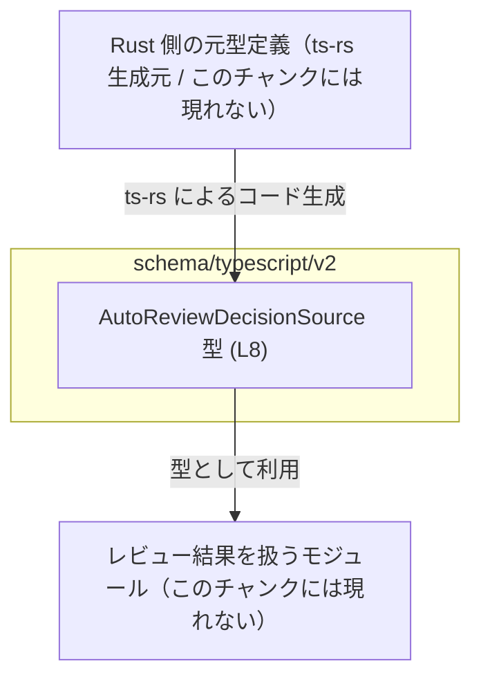
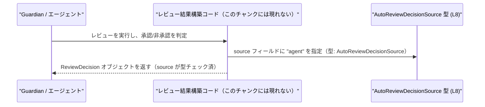

# app-server-protocol/schema/typescript/v2/AutoReviewDecisionSource.ts

## 0. ざっくり一言

- Guardian の「承認レビュー決定の発生源」を表す、文字列リテラル型 `AutoReviewDecisionSource` を 1 つだけ公開する、自動生成された TypeScript 型定義ファイルです（`AutoReviewDecisionSource.ts:L1-3, L8`）。

---

## 1. このモジュールの役割

### 1.1 概要

- このモジュールは、**終端の guardian 承認レビュー決定の「ソース（発生源）」を表す型**を提供します（JSDoc コメントより、`AutoReviewDecisionSource.ts:L5-7`）。
- 実体は `"agent"` という **文字列リテラル型**（特定の文字列のみを許容する型）であり、`AutoReviewDecisionSource` 型としてエクスポートされています（`AutoReviewDecisionSource.ts:L8`）。
- ファイル全体は `ts-rs` により **Rust 側定義から自動生成されており、手動変更禁止**と明記されています（`AutoReviewDecisionSource.ts:L1-3`）。

### 1.2 アーキテクチャ内での位置づけ

このファイルのパスとコメントから、次のような位置づけが読み取れます。

- `schema/typescript/v2` 以下にあるため、**アプリケーションサーバープロトコル v2 の TypeScript スキーマ定義群の一部**と考えられます（パス名からの推測であり、他ファイルはこのチャンクには現れません）。
- コメントにより、`ts-rs` による **Rust 型定義からの自動生成物**であることが明示されています（`AutoReviewDecisionSource.ts:L1-3`）。
- 実際にこの型を利用する呼び出し元コード（レビュー結果オブジェクトや API I/F など）は、このチャンクには含まれていません。

概念的な依存関係を Mermaid で表すと、次のようになります。



この図は、Rust 側の元定義から `AutoReviewDecisionSource` が生成され、アプリケーションコードがこの型を参照していることを示す概念図です。Rust 側や利用モジュールの実体は、このチャンクには含まれていません。

### 1.3 設計上のポイント

コードから分かる設計上の特徴は次のとおりです。

- **自動生成 + 手動変更禁止**
  - ファイル先頭に「GENERATED CODE」「Do not edit manually」と明記されています（`AutoReviewDecisionSource.ts:L1-3`）。
  - 設計上、このファイルは**生成物**であり、仕様変更は生成元（Rust 側）で行う前提になっています。
- **文字列リテラル型による厳密な型付け**
  - `export type AutoReviewDecisionSource = "agent";` と定義されており（`AutoReviewDecisionSource.ts:L8`）、`AutoReviewDecisionSource` は `"agent"` という 1 つの文字列のみを許す型です。
  - これにより、`string` 全体ではなく、**特定の文字列だけを許容する**ことで、TypeScript の静的型チェックによる安全性が高まります。
- **不安定 API であることの明示**
  - JSDoc コメントに `[UNSTABLE]` と付いており（`AutoReviewDecisionSource.ts:L5-7`）、将来的な仕様変更（値の追加・変更など）がありうることが示唆されています。
- **エラー・並行性のロジックを持たない純粋な型定義**
  - 関数・クラス・ロジックは一切なく、**コンパイル時の型チェック専用**です（`AutoReviewDecisionSource.ts:L1-8`）。
  - そのため、実行時エラー処理や並行性制御は、このモジュールの責務には含まれていません。

---

## 2. 主要な機能一覧

このファイルが提供する「機能」は、1 つの型エイリアスだけです。

- `AutoReviewDecisionSource` 型: 終端 guardian 承認レビュー決定の「発生源」を表す文字列リテラル型（現在 `"agent"` のみ）（`AutoReviewDecisionSource.ts:L5-8`）。

---

## 3. 公開 API と詳細解説

### 3.1 型一覧（構造体・列挙体など）

このファイルに存在する公開型は 1 つです。

| 名前                         | 種別                            | 役割 / 用途                                                                 | 定義位置                         |
|------------------------------|---------------------------------|------------------------------------------------------------------------------|----------------------------------|
| `AutoReviewDecisionSource`   | 型エイリアス（文字列リテラル型） | 終端 guardian 承認レビュー決定の「発生源」を `"agent"` で表すための型 | `AutoReviewDecisionSource.ts:L8` |

> 補足: 文字列リテラル型とは、`"agent"` のような特定の文字列だけを許可する TypeScript の型で、`string` よりも制約が厳しい型です。

### 3.2 型の詳細解説（関数は存在しないため型に適用）

#### `AutoReviewDecisionSource`

**概要**

- JSDoc コメントに「Source that produced a terminal guardian approval review decision.」とあり（`AutoReviewDecisionSource.ts:L5-7`）、**最終的な guardian 承認レビュー決定を生成した「ソース」を表現するための型**として定義されています。
- 現在、この型が取りうる値は **文字列リテラル `"agent"` のみ**です（`AutoReviewDecisionSource.ts:L8`）。

**取りうる値**

- `"agent"`
  - Guardian 承認レビュー決定が「agent」によって生成されたことを示すラベルとして使用されると解釈できます（コメントと識別子名からの推測であり、このチャンクだけでは他のソース種別は不明です）。

**戻り値・エラーの観点**

- この型は**値そのものではなく型定義**なので、「戻り値」や「エラー」を直接持ちません。
- ただし、この型を利用する関数やオブジェクトフィールドに対し、TypeScript は次のような**コンパイル時チェック**を行います。

  - 有効な代入例（コンパイル成功）:

    ```typescript
    const src: AutoReviewDecisionSource = "agent";  // OK: 型が "agent"
    ```

  - 無効な代入例（コンパイルエラー。実行時エラーではない）:

    ```typescript
    const src: AutoReviewDecisionSource = "user";   // エラー: '"user"' 型は '"agent"' に代入できない
    ```

  これらはコンパイル時のみのチェックであり、実行時には `AutoReviewDecisionSource` という型情報は存在しません。

**内部処理の流れ（アルゴリズム）**

- 型定義のみであり、**実行されるロジックは一切ありません**（`AutoReviewDecisionSource.ts:L8`）。
- そのため、アルゴリズムや条件分岐、ループなどは存在しません。

**Examples（使用例）**

1. オブジェクトのフィールドとして利用する例

   Guardian レビュー結果に `source` フィールドを持たせる場合の典型的な利用例です。

   ```typescript
   // 型のインポートパスはプロジェクト構成に依存します。
   // ここでは相対パス例として記述していますが、このチャンクから正確なパスは決定できません。
   import type { AutoReviewDecisionSource } from "./AutoReviewDecisionSource"; // AutoReviewDecisionSource 型をインポートする

   interface ReviewDecision {                               // レビュー決定を表すインターフェースの例
       source: AutoReviewDecisionSource;                    // 発生源を AutoReviewDecisionSource 型として保持する
       approved: boolean;                                   // 承認されたかどうかのフラグ
   }

   const decision: ReviewDecision = {                       // ReviewDecision 型の値を作成する
       source: "agent",                                     // 許可されている値 "agent" を設定（OK）
       approved: true,                                      // 承認済みフラグ
   };
   ```

2. 関数引数として利用し、型安全に値を受け取る例

   ```typescript
   import type { AutoReviewDecisionSource } from "./AutoReviewDecisionSource"; // 型のインポート（パスは例）

   function logDecisionSource(source: AutoReviewDecisionSource): void {       // source の型を AutoReviewDecisionSource に限定する
       console.log("Decision source:", source);                               // source は "agent" であることがコンパイル時に保証される
   }

   logDecisionSource("agent");                                                // OK
   // logDecisionSource("user");                                             // コンパイルエラー: "user" は許可されない
   ```

**Errors / Panics（型安全性・エラーまわり）**

- `AutoReviewDecisionSource` は型定義のみであり、**実行時にこの型が原因で例外やパニックが発生することはありません**。
- 型に違反する値を代入しようとすると、**コンパイルエラー**になります。
  - 例: `"user"` や `"system"` など `"agent"` 以外の文字列は `AutoReviewDecisionSource` に代入できません（`AutoReviewDecisionSource.ts:L8` の定義により）。
- 外部から JSON などで `"agent"` 以外の値が入ってくるケースでは、**この型だけでは実行時の検証は行われません**。
  - 実行時に安全性を確保するには、別途バリデーション処理が必要です（そのコードはこのチャンクには含まれていません）。

**Edge cases（エッジケース）**

- `"agent"` 以外の文字列
  - TypeScript の型チェックによりコンパイル時に弾かれます。
- 汎用的な `string` 型の値からの代入

  ```typescript
  const s1 = "agent";                             // s1 の型は "agent"（文字列リテラル型）
  const s2: string = "agent";                     // s2 の型は string（より広い型）

  const ok: AutoReviewDecisionSource = s1;        // OK: "agent" 型は AutoReviewDecisionSource に代入可能
  // const ng: AutoReviewDecisionSource = s2;     // エラー: string 型は "agent" に代入不可
  ```

  - これは TypeScript の「文字列リテラル型」と「string 型」の関係による挙動です。
- 値が `null` や `undefined` の場合
  - 定義上、`AutoReviewDecisionSource` には `null` や `undefined` は含まれていないため、直接代入しようとするとコンパイルエラーになります。
- 将来的な値追加
  - コメントに `[UNSTABLE]` とあるため（`AutoReviewDecisionSource.ts:L5-7`）、将来 `"agent"` 以外の値（例: `"system"` など）が Rust 側に追加され、再生成される可能性があります。
  - ただし、**現時点のこのチャンクには `"agent"` 以外の値は定義されていません**。

**使用上の注意点**

- **自動生成コードのため直接編集しない**
  - 冒頭コメントにあるように、`ts-rs` 生成物であり、手作業での変更は想定されていません（`AutoReviewDecisionSource.ts:L1-3`）。
  - 新しいソース種別を追加したい場合は、生成元（Rust 側の型定義）を変更し、このファイルを再生成する必要があります（生成元コードはこのチャンクには現れません）。
- **不安定 API であることを前提に利用する**
  - `[UNSTABLE]` の注記があるため（`AutoReviewDecisionSource.ts:L5-7`）、この型の取りうる値が将来変更・追加される可能性があります。
  - 長期互換性を前提としたプロトコル固定値として扱う場合は、バージョン固定や適切な互換性管理が必要です。
- **実行時の安全性は別途確保が必要**
  - `AutoReviewDecisionSource` はコンパイル時の型チェックのみを提供し、実行時の値検証は行いません。
  - 外部入力（API リクエスト、DB、メッセージキューなど）から値を受け取る場合は、実行時バリデーション（スキーマ検証等）を別途実装する必要があります（このチャンクにはその処理は含まれていません）。

### 3.3 その他の関数

- このファイルには、**関数・メソッド・クラス・列挙体などは一切定義されていません**（`AutoReviewDecisionSource.ts:L1-8`）。

---

## 4. データフロー

このファイル自体にはロジックが存在しないため、**`AutoReviewDecisionSource` 型が関与するであろう典型的なデータフロー**を、コメントから読み取れる範囲で概念的に示します。

- Guardian のレビューシステム内でレビューが行われる。
- レビュー結果を表すオブジェクトが構築され、その中の「ソース」を `AutoReviewDecisionSource` 型として表現する。
- 呼び出し側コードは、この型定義により `"agent"` という有効な値のみを利用し、他の文字列を使うとコンパイルエラーになる。

概念的なシーケンスを Mermaid で表すと次の通りです。



この図は、「レビュー結果構築コード」が `AutoReviewDecisionSource` 型を利用して `source` フィールドを `"agent"` に設定し、コンパイル時に値の妥当性が保証される、というデータフローを表した概念図です。レビュー結果の具体的な型や他フィールドは、このチャンクには現れません。

---

## 5. 使い方（How to Use）

### 5.1 基本的な使用方法

`AutoReviewDecisionSource` を含むレビュー結果型を定義し、値を設定する基本的な例です。

```typescript
// インポートパスはプロジェクトによって異なります。
// ここでは同一ディレクトリからの相対インポート例として記述しています。
import type { AutoReviewDecisionSource } from "./AutoReviewDecisionSource"; // AutoReviewDecisionSource 型をインポートする

interface ReviewDecision {                           // レビュー決定を表す型の例を定義する
    source: AutoReviewDecisionSource;                // 発生源を AutoReviewDecisionSource 型で表現する
    approved: boolean;                               // 承認されたかどうか
    reason?: string;                                 // 任意の理由（任意）
}

const decision: ReviewDecision = {                   // ReviewDecision 型のオブジェクトを作成する
    source: "agent",                                 // 有効な値 "agent" を設定（型チェックで保証される）
    approved: true,                                  // 承認済み
    reason: "All checks passed",                     // 任意の理由
};

console.log(decision.source);                        // "agent" が出力される
```

この例では、`source` プロパティに `"agent"` 以外を指定するとコンパイルエラーになります。

### 5.2 よくある使用パターン

1. **関数の引数として利用して、受け取れる値を制限する**

   ```typescript
   import type { AutoReviewDecisionSource } from "./AutoReviewDecisionSource"; // 型のインポート

   function recordSource(source: AutoReviewDecisionSource): void {             // source の型を AutoReviewDecisionSource に限定する
       // ここでは source が "agent" であることがコンパイル時に保証される
       console.log("Recorded decision source:", source);                       // ログ出力などに利用する
   }

   recordSource("agent");                                                      // OK
   // recordSource("system");                                                 // コンパイルエラー
   ```

2. **結果オブジェクトの一部として利用し、他モジュールに渡す**

   ```typescript
   import type { AutoReviewDecisionSource } from "./AutoReviewDecisionSource"; // 型のインポート

   interface DecisionPayload {                                                // 外部に渡すペイロードの例
       source: AutoReviewDecisionSource;                                      // AutoReviewDecisionSource を利用
       // 他のフィールドはこのチャンクには現れない
   }

   function buildPayload(): DecisionPayload {                                 // ペイロードを構築する関数の例
       return { source: "agent" };                                            // 有効な値のみ設定される
   }
   ```

### 5.3 よくある間違い

1. **汎用的な `string` からそのまま代入してしまう**

```typescript
import type { AutoReviewDecisionSource } from "./AutoReviewDecisionSource"; // 型のインポート

let rawSource: string = "agent";                          // 外部入力などから得た string 型の値

// 間違い例: 広い型（string）から狭い型（"agent"）へ直接代入しようとしている
// let src: AutoReviewDecisionSource = rawSource;         // コンパイルエラー

// 正しい例: 値をチェックしてから代入する
if (rawSource === "agent") {                              // 値が "agent" かどうかを確認する
    const src: AutoReviewDecisionSource = rawSource;      // このブロック内では rawSource は "agent" とみなせる
    console.log(src);                                     // "agent" が出力される
} else {
    // 想定外の値に対する処理（このチャンクにはロジックは現れない）
}
```

1. **型を `string` にしてしまい、型安全性を失う**

```typescript
// 間違い例: source を string にしてしまうと、任意の文字列が入ってしまう
interface BadDecision {
    source: string;                                       // 何でも入ってしまう
}

// 正しい例: AutoReviewDecisionSource を利用して `"agent"` のみに制限する
import type { AutoReviewDecisionSource } from "./AutoReviewDecisionSource";

interface GoodDecision {
    source: AutoReviewDecisionSource;                     // `"agent"` のみ許可する
}
```

### 5.4 使用上の注意点（まとめ）

- このファイルは **自動生成コード** であり、コメントに従い手動編集は行わない設計になっています（`AutoReviewDecisionSource.ts:L1-3`）。
- 型は `[UNSTABLE]` とマークされているため（`AutoReviewDecisionSource.ts:L5-7`）、将来のバージョンで値が変更・追加される可能性があります。
- `AutoReviewDecisionSource` は **コンパイル時の型安全性**を提供しますが、**実行時のバリデーション**は別途実装が必要です。
- 非同期処理や並行処理に関するコードはこのモジュールには含まれず、この型自体は並行性に関する制約や問題を持ちません。

---

## 6. 変更の仕方（How to Modify）

### 6.1 新しい機能を追加する場合

- このファイルは `ts-rs` による生成物であり、ファイル先頭で明示的に手動編集禁止とされています（`AutoReviewDecisionSource.ts:L1-3`）。
- そのため、**このファイルに直接コードや新しい値を追加することは前提とされていません**。
- もし `AutoReviewDecisionSource` の取りうる値（例: `"system"` や `"user"` など）を追加したい場合は、一般的には次の流れになります（生成元コードはこのチャンクにはありません）。

  1. Rust 側の元型定義（`enum` や `struct` など）を変更する。
  2. `ts-rs` によって TypeScript スキーマを再生成する。
  3. 生成された `AutoReviewDecisionSource.ts` が新しい値を含むようになる。

- 具体的な生成コマンドや生成元ファイルのパスは、このチャンクからは分かりません。

### 6.2 既存の機能を変更する場合

- `AutoReviewDecisionSource` の定義（現在 `"agent"` のみであること）を変更する必要がある場合も、**直接編集ではなく生成元を変更する**必要があります（`AutoReviewDecisionSource.ts:L1-3`）。
- 変更時に考慮すべき点（一般論）:

  - **契約の確認**
    - `AutoReviewDecisionSource` を利用している他の TypeScript コードが、特定の値（例: `"agent"`）に依存していないかを確認する必要があります。
    - これらの利用箇所は、このチャンクには現れないため、別途検索などで確認する必要があります。
  - **互換性**
    - `[UNSTABLE]` とあるとはいえ、他のコンポーネントや外部クライアントと値をやり取りしている場合、値の追加・変更が互換性に影響しうるため注意が必要です。
  - **テスト**
    - `AutoReviewDecisionSource` を利用する部分のテスト（ユニットテスト・統合テスト）があれば、それらが新しい値や変更に対応しているかを確認する必要があります（テストコードはこのチャンクには含まれていません）。

---

## 7. 関連ファイル

このチャンクから直接参照できる関連ファイルはありませんが、構造とコメントから推測できるものを整理すると次の通りです（実体はこのチャンクには存在しません）。

| パス / 名称（推定）                       | 役割 / 関係                                                                                     |
|------------------------------------------|--------------------------------------------------------------------------------------------------|
| Rust 側の元型定義ファイル（不明）        | `ts-rs` が参照する元定義。ここを変更すると `AutoReviewDecisionSource.ts` の内容が再生成される。 |
| `schema/typescript/v2` 配下の他の型定義 | 同じく `ts-rs` により生成された、他のプロトコルスキーマの TypeScript 型定義（このチャンクには現れない）。 |
| `AutoReviewDecisionSource` を参照するコード | レビュー結果や guardian ロジックを実装するアプリケーションコード（このチャンクには現れない）。 |

これらのファイルやコードは、このチャンクには含まれていないため、具体的なパスや内容は不明です。
