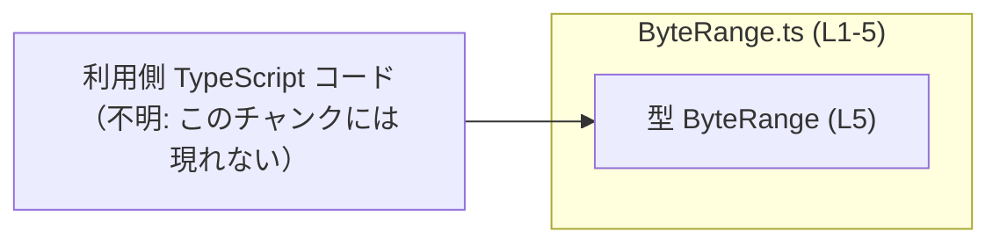
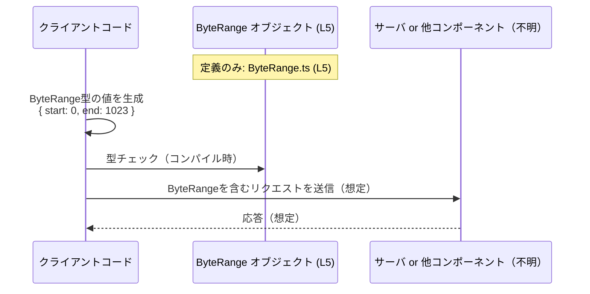

# app-server-protocol/schema/typescript/v2/ByteRange.ts コード解説

## 0. ざっくり一言

このファイルは、バイト範囲を表現すると考えられる `ByteRange` という TypeScript のオブジェクト型を **自動生成**された形で定義しているファイルです（ByteRange.ts:L1-5）。

---

## 1. このモジュールの役割

### 1.1 概要

- このモジュールは、`ByteRange` という型を **1つだけ公開**します（ByteRange.ts:L5-5）。
- `ByteRange` は `start: number` と `end: number` という 2 つの数値プロパティを持つオブジェクト型です（ByteRange.ts:L5-5）。
- ファイル先頭のコメントから、この型定義が Rust 側の型から `ts-rs` によって **自動生成されたものであり、手動変更禁止**であることが分かります（ByteRange.ts:L1-3）。

命名と構造から、何らかのデータの「開始位置」と「終了位置」を表すための型と想定されますが、**具体的に何のバイト範囲かはこのファイルだけからは判定できません**。

### 1.2 アーキテクチャ内での位置づけ

- このファイルは `export type ByteRange = ...` だけを持ち、**他のモジュールを import していません**（ByteRange.ts:L5-5）。
- したがって、**依存先は 0** であり、「この型を利用する側（クライアントコード）」だけが依存元になりますが、その具体的なモジュールはこのチャンクには現れていません。

このファイル内の構成を示す簡単な依存関係図です。



### 1.3 設計上のポイント

- **自動生成コードであることを明記**  
  - 「GENERATED CODE」「Do not edit this file manually」と明示されており（ByteRange.ts:L1-3）、**直接編集しないことが前提**です。
- **シンプルなオブジェクト型エイリアス**  
  - `export type ByteRange = { start: number, end: number, };` という 1 行で完結しており（ByteRange.ts:L5-5）、クラスや関数はありません。
- **型レベルではバリデーションを持たない**  
  - `number` 型のみで、`start <= end` や `0 <= start` といった制約は型に含まれていません（ByteRange.ts:L5-5）。
  - そのため、**値の妥当性チェックはこの型を利用する側のロジックで行う必要があります**。
- **TypeScript の型安全性**  
  - `start`/`end` ともに `number` 型のため、TypeScript コンパイラが「文字列を代入する」などの型ミスを検出できますが、`NaN` や負数などの「値の意味的な妥当性」は検出しません。

---

## 2. 主要な機能一覧

このモジュールが提供する機能は 1 つだけです。

- `ByteRange` 型: `start: number` と `end: number` を持つオブジェクトによる範囲表現（ByteRange.ts:L5-5）

---

## 3. 公開 API と詳細解説

### 3.1 型一覧（構造体・列挙体など）

| 名前       | 種別                             | 役割 / 用途                                                                                                         | 定義位置 / 根拠                       |
|-----------|----------------------------------|----------------------------------------------------------------------------------------------------------------------|----------------------------------------|
| `ByteRange` | 型エイリアス（オブジェクト型） | `start` と `end` という 2 つの `number` プロパティを持つ範囲表現用のデータ構造。命名からバイト範囲を表すと想定されるが、このファイル単体からは用途は確定できない。 | ByteRange.ts:L5-5（`export type ...`） |

※ 用途の部分の「バイト範囲」という解釈は、**型名とプロパティ名からの推測**であり、コードから直接的に用途が示されているわけではありません。

#### 型の詳細

```typescript
export type ByteRange = { start: number, end: number, };
```

- **オブジェクト構造**
  - `start: number` — 範囲の開始位置を表す数値プロパティ（ByteRange.ts:L5-5）
  - `end: number` — 範囲の終了位置を表す数値プロパティ（ByteRange.ts:L5-5）
- **必須プロパティ**
  - `start` / `end` ともに `?` が付いていないため **必須プロパティ** です。
- **読み取り専用ではない**
  - `readonly` 修飾子は無いため、オブジェクトを通じて `start` / `end` を後から書き換えることができます（型レベルでは禁止されていません）。

**型安全性（TypeScript の視点）**

- コンパイル時:
  - `start` / `end` の欠落や `string` など非 `number` を代入するコードはコンパイルエラーになります。
- 実行時:
  - JavaScript として実行されるため、`start` や `end` に `NaN`, `Infinity`, 負数 等も入り得ますが、それを禁止する仕組みはこの型にはありません。

### 3.2 関数詳細（最大 7 件）

このファイルには **関数・メソッドは一切定義されていません**（ByteRange.ts:L1-5）。

- したがって、エラーハンドリング・並行性制御・アルゴリズムといった「ロジック」の説明対象はありません。
- `ByteRange` は**純粋なデータコンテナ型**です。

### 3.3 その他の関数

- 該当なし（このチャンクには関数定義が存在しません: ByteRange.ts:L1-5）。

---

## 4. データフロー

このファイル自身には処理フローは存在せず、型定義だけが記述されています（ByteRange.ts:L5-5）。  
ここでは、**この型が利用されるであろう典型的なデータフローの「仮想例」**として、クライアントコード内の利用イメージを示します。



**注意**

- 上のシーケンス図は、**型名・プロパティ名から想定した一般的な利用例**であり、**このファイル内に対応する送受信処理は存在しません**。
- 実際にどのコンポーネントが `ByteRange` を使っているかは、このチャンクからは分かりません。

---

## 5. 使い方（How to Use）

### 5.1 基本的な使用方法

`ByteRange` を import して、範囲を表すオブジェクトとして利用する基本例です。  
パスは例示であり、実際の import パスはプロジェクト構成によって異なります。

```typescript
// ByteRange型をimportする（相対パスはプロジェクトに応じて調整が必要）
import type { ByteRange } from "./ByteRange";  // このファイル: app-server-protocol/schema/typescript/v2/ByteRange.ts を想定

// 先頭1024バイトを表すByteRange値を作成する例
const headerRange: ByteRange = {
    start: 0,      // 開始位置。number型で必須
    end: 1023,     // 終了位置。number型で必須
};

// 関数の引数としてByteRangeを受け取る例
function readRange(range: ByteRange) {        // range.start / range.end が利用できる
    console.log(`start=${range.start}, end=${range.end}`);
}
readRange(headerRange);
```

ポイント:

- `start`/`end` が欠けているとコンパイルエラーになります。
- `start: "0"` のように文字列を渡すとコンパイルエラーになります。
- 値の関係（`start <= end` など）は型では保証されないため、必要なら `readRange` 内などでチェックが必要です。

### 5.2 よくある使用パターン

#### 5.2.1 複数範囲の管理

複数の範囲（例: 部分的なチャンク）を配列で扱う例です。

```typescript
import type { ByteRange } from "./ByteRange";

// 複数のByteRangeを配列で扱う
const ranges: ByteRange[] = [
    { start: 0,    end: 1023 },   // 第1チャンク
    { start: 1024, end: 2047 },   // 第2チャンク
];

// 各範囲を処理する
for (const range of ranges) {
    // range.start, range.end は number として扱える
    console.log(`Processing range ${range.start}-${range.end}`);
}
```

#### 5.2.2 部分更新（Copy & Spread）

`ByteRange` はただのオブジェクト型なので、オブジェクトのコピーや更新を行いやすいです。

```typescript
import type { ByteRange } from "./ByteRange";

const original: ByteRange = { start: 0, end: 1023 };

// 終了位置だけ変更した新しい範囲を作る
const extended: ByteRange = {
    ...original,   // 既存のstart, endをコピー
    end: 2047,     // endだけ新しい値を上書き
};
```

### 5.3 よくある間違い

#### 5.3.1 必須プロパティの欠落

```typescript
import type { ByteRange } from "./ByteRange";

// 間違い例: end がないためコンパイルエラー
// const invalidRange: ByteRange = {
//     start: 0,
// };

// 正しい例: start, end の両方を指定する
const validRange: ByteRange = {
    start: 0,
    end: 100,
};
```

#### 5.3.2 型の不一致

```typescript
import type { ByteRange } from "./ByteRange";

// 間違い例: start, end が string なのでコンパイルエラー
// const invalidRange: ByteRange = {
//     start: "0",           // string は許されない
//     end: "100",           // string は許されない
// };

// 正しい例: number 型で指定する
const validRange: ByteRange = {
    start: Number("0"),     // number に変換してから代入
    end: Number("100"),
};
```

#### 5.3.3 自動生成ファイルを直接編集する

```typescript
// 間違い例（コメントベースの注意）:
// ByteRange.ts 内に直接プロパティを追加・削除する
//   export type ByteRange = { start: number, end: number, foo: string }; // ← 手動で追加
//
// このファイルは自動生成であり（ByteRange.ts:L1-3）、次回のコード生成で上書きされます。

// 正しい運用:
// Rust 側の元となる型定義（ts-rs が参照する構造体など）を変更し、ts-rs を再実行してTypeScriptコードを再生成する。
// その具体的なRustファイルのパスや内容は、このチャンクには現れません。
```

### 5.4 使用上の注意点（まとめ）

- **自動生成ファイルを直接編集しない**  
  - ByteRange.ts は `ts-rs` による生成物であり、次回生成時に上書きされます（ByteRange.ts:L1-3）。  
    仕様変更は Rust 側の元定義を更新して行う必要があります。
- **値の妥当性は利用側で保証する**  
  - `number` 型であることは TypeScript が保証しますが、負数・`NaN`・`start > end` などの不正な組み合わせは型では防げません（ByteRange.ts:L5-5）。
- **大きな数値の扱い（一般的な注意）**  
  - TypeScript/JavaScript の `number` は IEEE 754 倍精度浮動小数点数です。  
    **2^53 を超える整数は正確に表現できない**ため、もし `ByteRange` が非常に大きなオフセットを扱う用途に使われる場合は注意が必要です（このファイルから利用範囲は分かりませんが、一般論としての注意点です）。
- **並行性**  
  - TypeScript 自体は単一スレッドの JavaScript 上で動くことが多く、この型にはスレッドセーフ性に関する情報はありません。  
    `ByteRange` はただのデータ構造であり、共有・更新に伴う整合性は利用側ロジックの責務になります。

---

## 6. 変更の仕方（How to Modify）

### 6.1 新しい機能を追加する場合

このファイルは **自動生成**されているため、機能追加は次のような流れになります。

1. **ts-rs の元となる Rust 側の型定義を変更する**  
   - 例: Rust 側で `struct ByteRange { start: u64, end: u64 }` にフィールドを追加する、など。  
   - ただし、そのRustコードや正確な型名・パスはこのチャンクには現れないため、「Rust側を変更する必要がある」というレベルでしか言及できません。
2. **ts-rs によるコード生成を再実行する**  
   - これにより、`app-server-protocol/schema/typescript/v2/ByteRange.ts` が新しい構造で再生成されます。
3. **利用側 TypeScript コードを更新する**  
   - 追加されたフィールドや変更された型に合わせて、利用側コードを修正します。

TypeScript 側で "補助的な" 型を定義したい場合は、**別ファイル** を作成し、`ByteRange` を元にユーティリティ型（例: `Readonly<ByteRange>` や `Partial<ByteRange>`）を定義するのが安全です。

### 6.2 既存の機能を変更する場合

- **直接編集を避ける理由**
  - ByteRange.ts を手で書き換えても、次回の `ts-rs` 実行で元に戻ってしまう（または上書きされる）ため、永続的な変更にはなりません（ByteRange.ts:L1-3）。
- **変更時に注意すべき契約**
  - `start`/`end` が必須で `number` 型である、という契約が、利用側コードに広く依存している可能性があります。  
  - Rust 側の型を変更する際は、TypeScript 側の利用箇所をすべてビルドして型エラーがないか確認する必要があります。
- **影響範囲の確認**
  - `ByteRange` を import している全ファイルが影響範囲になりますが、**具体的な import 先はこのチャンクからは分かりません**。
  - プロジェクト全体で `ByteRange` に対する検索（型名検索）を行うことで影響箇所を特定することが一般的です。

---

## 7. 関連ファイル

このチャンクには `ByteRange.ts` 以外のファイル情報は含まれていません。  
想定される関連ファイルを、分かる範囲で記述します（パスは不明です）。

| パス | 役割 / 関係 |
|------|------------|
| 不明（Rust 側の型定義ファイル） | `ts-rs` が参照する元の Rust 型定義。ここを変更してコード生成し直すことで `ByteRange.ts` が更新されると考えられますが、具体的な場所や型名はこのチャンクには現れません。 |
| 不明（他の TypeScript ファイル群） | `ByteRange` 型を import して利用するアプリケーションコード。どのファイルが利用しているかは、このチャンクからは分かりません。 |

---

### Bugs / Security / Contracts / Edge Cases のまとめ（このファイルに関して）

- **潜在的なバグ要因**
  - `start` > `end`、負数、`NaN`、`Infinity` など、意味的に不正な値の組み合わせを防ぐ仕組みが型に含まれていない。
- **セキュリティ上の観点**
  - このファイル自体は単なる型定義であり、直接的な入力検証やデシリアライズ処理を含まないため、セキュリティ問題はここからは見えません。
- **契約（Contracts）**
  - `ByteRange` には `start: number` と `end: number` が必須である、ということだけが明示された契約です（ByteRange.ts:L5-5）。
  - それ以外の制約（単調増加、非負など）は **契約としてコードに書かれていません**。
- **エッジケース**
  - `start === end` や `start > end` などのケースがどう扱われるべきかは、このファイルからは分かりません。扱いは利用側ロジックの設計に依存します。
