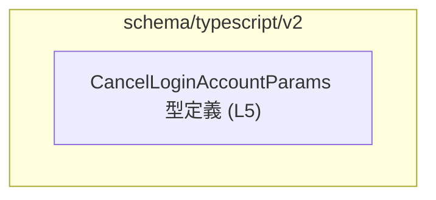
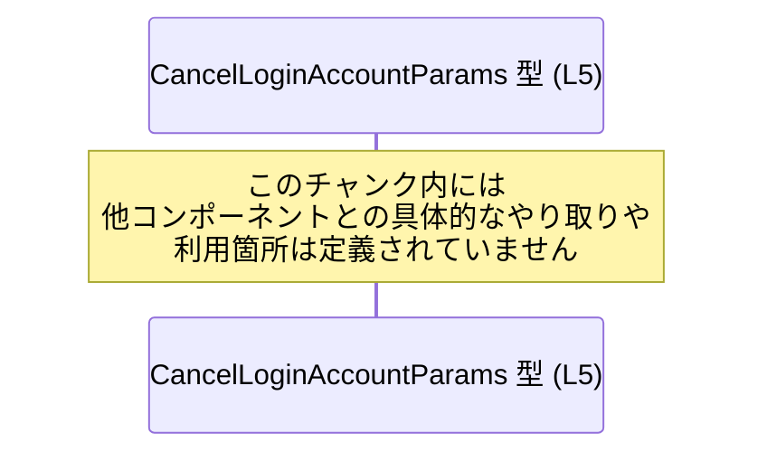

# app-server-protocol\schema\typescript\v2\CancelLoginAccountParams.ts

## 0. ざっくり一言

`CancelLoginAccountParams` という 1 つの型エイリアスを定義し、「ログインアカウントのキャンセル」に関するリクエストパラメータの形を TypeScript 上で表現するファイルです（型情報のみで、実行ロジックは含みません）。

---

## 1. このモジュールの役割

### 1.1 概要

- このモジュールは、**`CancelLoginAccountParams` 型を公開**することだけを目的としています。
- 型名とディレクトリパスから、アプリケーションサーバとのプロトコル定義の一部として、「ログインアカウントのキャンセル操作」に使うパラメータを表現する型と解釈できますが、**実際の利用箇所はこのチャンクには現れていません**。
- コード先頭のコメントから、このファイルは **`ts-rs` による自動生成コード**であり、手動編集しないことが前提です（`CancelLoginAccountParams.ts:L1-3`）。

### 1.2 アーキテクチャ内での位置づけ

このファイルに現れている要素は以下だけです。

- 自動生成コメント
- `export type CancelLoginAccountParams = { loginId: string, };` という型エイリアス（`CancelLoginAccountParams.ts:L5-5`）

インポートや関数定義はなく、他モジュールとの具体的な依存関係はこのチャンクからは分かりません。

依存関係図（このチャンク内で確認できる範囲）：



- 他モジュールからの参照があるかどうかは、このチャンク単体からは不明です。

### 1.3 設計上のポイント

- **自動生成コード**  
  - `// GENERATED CODE! DO NOT MODIFY BY HAND!` および `ts-rs` のコメントから、手動変更禁止の設計になっています（`CancelLoginAccountParams.ts:L1-3`）。
- **シンプルなデータ構造**  
  - 1 フィールド `loginId: string` だけを持つオブジェクト型です（`CancelLoginAccountParams.ts:L5-5`）。
- **状態・ロジックを持たない**  
  - 関数やクラスは存在せず、**静的な型情報のみ**を提供します。したがってこのモジュール自身は状態管理やエラーハンドリングを行いません。
- **TypeScript の構造的型付け**  
  - `export type` による型エイリアスであり、「`loginId` プロパティを持つ任意のオブジェクト」がこの型として扱われます（名目型ではなく構造的型）。

---

## 2. 主要な機能一覧

このファイルが提供する機能は 1 つだけです。

- `CancelLoginAccountParams` 型定義: `loginId` という文字列プロパティを必須フィールドとして持つリクエストパラメータ型を提供します（`CancelLoginAccountParams.ts:L5-5`）。

---

## 3. 公開 API と詳細解説

### 3.1 型一覧（構造体・列挙体など）

| 名前                        | 種別          | 役割 / 用途                                                                                      | 定義位置                              |
|---------------------------|-------------|-------------------------------------------------------------------------------------------------|---------------------------------------|
| `CancelLoginAccountParams` | 型エイリアス（オブジェクト型） | `loginId: string` を必須フィールドとして持つ、キャンセル要求パラメータの構造を表現する型 | `CancelLoginAccountParams.ts:L5-5` |

#### 型の構造（`CancelLoginAccountParams.ts:L5-5`）

```typescript
export type CancelLoginAccountParams = { loginId: string, };
```

- `export type`  
  - TypeScript の **型エイリアス**です。値ではなく「型の別名」を定義します。
- `CancelLoginAccountParams`  
  - 外部モジュールからインポートして利用できる公開型です。
- `{ loginId: string, }`  
  - 1 つのプロパティ `loginId` を持つオブジェクト型です。
  - `loginId` は **必須** であり、省略することはできません。
  - 型レベルでは「空文字でない」「特定のフォーマット」などの制約は表現されていません。任意の `string` が許容されます。

### 3.2 関数詳細（最大 7 件）

このファイルには **関数・メソッドは定義されていません**。

- 実行時の処理ロジック・バリデーション・API 呼び出しなどは、すべてこのファイルの外側で行われます。

### 3.3 その他の関数

このファイルには **補助的な関数も存在しません**。

---

## 4. データフロー

このファイルには **型定義のみ**が含まれており、具体的な処理フローや呼び出し関係は現れていません。そのため、このチャンクから確定できるデータフローは以下のとおり極めて限定的です。

### 4.1 このチャンクから分かる範囲のシーケンス



- `CancelLoginAccountParams` 自体は、**値を運ぶためのコンテナとしての形だけ**を規定しています。
- 実際には「どこで生成され」「どの API に渡されるか」はこのチャンクには書かれておらず、不明です。

### 4.2 一般的な利用イメージ（参考・コード外）

以下は、この型がどのように使われるかの「一般的なパターン例」であり、**実際のリポジトリ内コードではありません**。

```typescript
// ※利用イメージの例（このファイルには含まれていません）
import type { CancelLoginAccountParams } from "./CancelLoginAccountParams";

async function cancelLoginAccount(params: CancelLoginAccountParams): Promise<void> {
    // ここで params.loginId を使って API を呼び出すなどの処理を行う想定
}
```

- この例では、`CancelLoginAccountParams` は
  - 呼び出し側で `{ loginId: "..." }` の形で構築され、
  - API ラッパー関数 `cancelLoginAccount` の引数として渡される、
という**想定される使い方**を示しています。

---

## 5. 使い方（How to Use）

### 5.1 基本的な使用方法

このモジュールの典型的な使い方は、**型注釈として利用し、`loginId` を持つオブジェクトの形を保証する**ことです。

```typescript
// CancelLoginAccountParams 型をインポートする例
// 実際のインポートパスはプロジェクト構成によって異なります。
import type { CancelLoginAccountParams } from "./CancelLoginAccountParams";

// キャンセルリクエストのパラメータを構築する
const params: CancelLoginAccountParams = {     // params には loginId: string が必須
    loginId: "user-1234",                      // string なので OK
};

// 何らかの API クライアントに渡す想定の関数
async function sendCancelRequest(p: CancelLoginAccountParams): Promise<void> {
    // ここでは p.loginId が string で存在することがコンパイル時に保証されます
    console.log("cancel login account:", p.loginId);
}
```

- TypeScript の型システムにより、
  - `loginId` を指定し忘れた場合
  - `loginId` に `number` などの別型を渡した場合  
  はコンパイル時にエラーになります。

### 5.2 よくある使用パターン

#### パターン 1: 既存文字列からそのまま構築する

```typescript
import type { CancelLoginAccountParams } from "./CancelLoginAccountParams";

function buildParams(loginId: string): CancelLoginAccountParams {
    // loginId は string 型なので、そのままフィールドに代入できる
    return { loginId };
}

const idFromForm: string = "user-5678";
const params = buildParams(idFromForm);  // params は CancelLoginAccountParams 型
```

- このパターンでは **型推論**により、戻り値 `params` は `CancelLoginAccountParams` として扱われます。

#### パターン 2: 部分的なオブジェクトから整形して渡す

```typescript
import type { CancelLoginAccountParams } from "./CancelLoginAccountParams";

type RawInput = {
    loginId?: string;    // ユーザー入力などで未定義の可能性がある
};

function normalize(input: RawInput): CancelLoginAccountParams {
    if (!input.loginId) {
        // ここでバリデーションやデフォルト処理を行う必要があります（型では保証されない部分）
        throw new Error("loginId is required");
    }
    return { loginId: input.loginId };   // ここでは loginId: string が保証された形になる
}
```

- `CancelLoginAccountParams` では `loginId` は必須なので、
  - 「任意」な入力（`loginId?: string` 等）からこの型に変換する際は、**明示的なチェックが必要**になります。

### 5.3 よくある間違い

#### 間違い例 1: 型が一致しない

```typescript
import type { CancelLoginAccountParams } from "./CancelLoginAccountParams";

const badParams: CancelLoginAccountParams = {
    // loginId: 1234,         // 間違い例: number 型は許されない（コンパイルエラー）
    loginId: "1234",          // 正しい例: string 型を渡す
};
```

#### 間違い例 2: 必須フィールドの省略

```typescript
import type { CancelLoginAccountParams } from "./CancelLoginAccountParams";

// 間違い例: loginId を省略している
// const badParams: CancelLoginAccountParams = {};  // コンパイルエラー

// 正しい例: loginId を必ず指定する
const goodParams: CancelLoginAccountParams = { loginId: "user-123" };
```

### 5.4 使用上の注意点（まとめ）

- **自動生成ファイルを直接編集しない**  
  - 冒頭コメントの通り、`ts-rs` が生成するコードであり、手動編集は想定されていません（`CancelLoginAccountParams.ts:L1-3`）。
- **型レベルでの制約は「string である」ことのみ**  
  - 空文字やフォーマット（メールアドレスかどうか等）は型では制約されません。必要に応じて呼び出し側・サーバ側で追加バリデーションが必要です。
- **実行時チェックは行われない**  
  - TypeScript の型はコンパイル時のみ有効であり、**実行時には消える**ため、外部から来た生データ（JSON 等）は必ず実行時に検証する必要があります。
- **並行性（Concurrency）への影響はない**  
  - このファイルは純粋に型定義のみを提供し、共有状態・ミューテーション・非同期処理を持たないため、直接的なレースコンディションやスレッドセーフティの問題は発生しません。

---

## 6. 変更の仕方（How to Modify）

### 6.1 新しい機能を追加する場合

このファイルは `ts-rs` により生成されており、**直接の修正は推奨されていません**（`CancelLoginAccountParams.ts:L1-3`）。

「`CancelLoginAccountParams` に新しいフィールドを追加したい」といった場合、一般的には以下のような手順になります。

1. **生成元（Rust 側）の型定義を変更する**  
   - `ts-rs` は Rust の型定義から TypeScript の型を生成するライブラリです。
   - 生成元の Rust 構造体・型に新しいフィールドを追加します。  
     （どのファイルかはこのチャンクからは分かりません。）

2. **`ts-rs` を再実行して TypeScript コードを再生成する**  
   - ビルドスクリプトや専用コマンドにより、この `CancelLoginAccountParams.ts` が再生成されます。

3. **TypeScript 側の利用箇所を更新する**  
   - 新しいフィールドが追加された場合、`CancelLoginAccountParams` を使っている全ての呼び出し側で、必要に応じてフィールドをセットするよう修正します。

### 6.2 既存の機能を変更する場合

既存の型を変更する場合も、**必ず生成元（Rust 側）を修正して再生成**する必要があります。

変更時に注意すべき点：

- **互換性（Breaking Change）に注意**  
  - `loginId` の型を `string` から他の型に変更するなどは、`CancelLoginAccountParams` を使う全ての TypeScript コードに影響します。
- **前提条件の維持**  
  - `loginId` を「必須」から「オプショナル」に変える / その逆を行う際は、呼び出し側のバリデーション・エラー処理の見直しが必要です。
- **生成元と生成結果の同期**  
  - Rust 側定義を変更した後は、確実に再生成・再コンパイルすることで、Rust と TypeScript の型の不整合を防ぐ必要があります。
- **テストの再確認**  
  - `CancelLoginAccountParams` を利用する API クライアントやフロントエンドのテストを再実行し、型変更による影響を確認することが望ましいです。

---

## 7. 関連ファイル

このチャンクにはインポート・利用箇所が現れていないため、**具体的な関連ファイルのパスは特定できません**。分かる範囲だけをまとめます。

| パス / 種別 | 役割 / 関係 |
|------------|------------|
| （不明）Rust 側の生成元型 | コメントにある `ts-rs` によって、この TypeScript 型が自動生成されていると考えられますが、生成元の Rust ファイルの場所はこのチャンクからは分かりません。 |
| 他の TypeScript モジュール（不明） | `CancelLoginAccountParams` を実際にインポートして利用するモジュールが存在するはずですが、このチャンクには現れていません。 |

---

## 付録: コンポーネントインベントリーと安全性 / 契約のまとめ

### コンポーネントインベントリー（このチャンク分）

| 種別   | 名前                        | 内容                                         | 行番号                          |
|--------|---------------------------|----------------------------------------------|---------------------------------|
| 型定義 | `CancelLoginAccountParams` | `{ loginId: string }` を表す型エイリアス     | `CancelLoginAccountParams.ts:L5-5` |

### 契約（Contracts）

- **型契約**  
  - `CancelLoginAccountParams` として扱うオブジェクトは、  
    - `loginId` プロパティを必ず持ち、
    - その値が `string` であることが求められます。
- **生成契約**  
  - このファイルは `ts-rs` により生成されるため、手動編集しないことが前提です（`CancelLoginAccountParams.ts:L1-3`）。

### Edge Cases（入力の境界・エッジケース）

型レベルでは以下の値もすべて許容されます（実行時に受け入れるべきかどうかは別問題です）。

- `loginId` が空文字 `""`
- 極端に長い文字列
- 特定フォーマット（メールアドレス / UUID 等）になっていない文字列

これらの扱いは、**呼び出し側・サーバ側のロジックに委ねられており、このファイルでは定義されていません。

### Bugs / Security の観点（このファイル単体）

- このファイルには実行時コードがなく、**直接的なバグや脆弱性の発生元にはなりません**。
- ただし、
  - 型ではフォーマットや内容の妥当性は保証されないため、
  - `loginId` を使う側で適切なサニタイズ・バリデーションを行わないと、  
    認証・認可の不備や予期しない入力による問題が生じる可能性があります。  
  これは、この型の**利用側の実装**に依存するため、このチャンクからは詳細は分かりません。

### 並行性 / パフォーマンス

- 型定義のみであり、CPU 使用・メモリ割り当て・I/O などの処理は一切行われません。
- そのため、このファイル単体では **パフォーマンス問題や並行性の問題は発生しません**。
