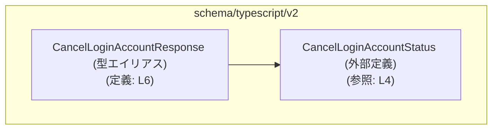
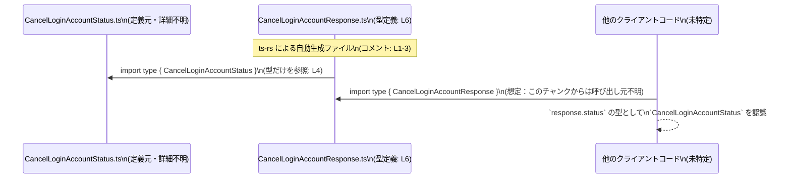

# app-server-protocol/schema/typescript/v2/CancelLoginAccountResponse.ts

## 0. ざっくり一言

ログインアカウントのキャンセルに対するレスポンスを表す **TypeScript の型定義**を提供する、自動生成ファイルです（`CancelLoginAccountResponse.ts:L1-3, L6-6`）。

---

## 1. このモジュールの役割

### 1.1 概要

- このモジュールは、`CancelLoginAccountResponse` という型をエクスポートし、ログインアカウントキャンセル処理のレスポンスとして **`status` フィールドのみを持つオブジェクト型**を定義しています（`CancelLoginAccountResponse.ts:L6-6`）。
- `status` は `CancelLoginAccountStatus` 型であり、キャンセル処理の結果状態を表すことが分かります（型名とフィールド名からの解釈、定義は別ファイル。`CancelLoginAccountResponse.ts:L4, L6-6`）。

### 1.2 アーキテクチャ内での位置づけ

- このファイルは `schema/typescript/v2` 配下にあり、**「サーバープロトコルのスキーマを TypeScript 型として表現したもの」**という位置づけが読み取れます（パス名とコメントより。`CancelLoginAccountResponse.ts:L1-3`）。
- `CancelLoginAccountStatus` を型としてインポートしており、このステータス定義に依存しています（`CancelLoginAccountResponse.ts:L4`）。

依存関係のイメージは次のようになります。



> ※ `CancelLoginAccountStatus` の中身はこのチャンクには現れないため不明です（`CancelLoginAccountResponse.ts:L4`）。

### 1.3 設計上のポイント

- **自動生成ファイルであること**  
  - 「GENERATED CODE」「Do not edit manually」と明記されており、手動編集を前提としていないことが分かります（`CancelLoginAccountResponse.ts:L1, L3`）。
  - [ts-rs](https://github.com/Aleph-Alpha/ts-rs) により生成されたとコメントされています（`CancelLoginAccountResponse.ts:L3`）。
- **データのみを表す純粋な型**  
  - 関数・クラス・ロジックはなく、オブジェクト型のエイリアスのみが定義されています（`CancelLoginAccountResponse.ts:L6-6`）。
  - 状態や副作用を持たない、**純粋なデータ構造**です。
- **型専用の依存**  
  - `import type` を使って `CancelLoginAccountStatus` を読み込んでおり、**実行時には依存を発生させない型専用インポート**であることが分かります（`CancelLoginAccountResponse.ts:L4`）。
- **エラーハンドリング・並行性の記述はなし**  
  - このファイル内にはエラー処理や非同期処理、並行性制御に関するコードは存在せず、これらは他レイヤーで扱われる前提の「型定義レイヤー」であると解釈できます（`CancelLoginAccountResponse.ts:L4-6`）。

### 1.4 コンポーネント一覧（このファイル内）

| 名前                         | 種別                      | 役割 / 用途                                                     | スコープ      | 根拠 |
|------------------------------|---------------------------|------------------------------------------------------------------|--------------|------|
| `CancelLoginAccountResponse` | 型エイリアス（オブジェクト型） | キャンセルレスポンスを表す。`status` フィールドを 1 つ持つ。      | このファイルで定義・公開 | `CancelLoginAccountResponse.ts:L6-6` |
| `CancelLoginAccountStatus`   | 型（詳細不明）           | レスポンスのステータスを表す型。実体は別ファイルに存在。        | 外部依存（型インポート） | `CancelLoginAccountResponse.ts:L4`   |

---

## 2. 主要な機能一覧

このファイルはロジックではなく型定義のみを提供します。主要な「機能」は以下の 1 点です（`CancelLoginAccountResponse.ts:L6-6`）。

- **`CancelLoginAccountResponse` 型**:  
  キャンセルログインアカウントのレスポンスとして、`status: CancelLoginAccountStatus` を持つオブジェクト型を定義する。

---

## 3. 公開 API と詳細解説

### 3.1 型一覧（構造体・列挙体など）

#### `CancelLoginAccountResponse`

| 項目       | 内容 |
|------------|------|
| 種別       | TypeScript 型エイリアス（オブジェクト型） |
| 定義       | `export type CancelLoginAccountResponse = { status: CancelLoginAccountStatus, };` |
| フィールド | `status: CancelLoginAccountStatus` の 1 つだけ。必須プロパティ。 |
| 根拠       | `CancelLoginAccountResponse.ts:L6-6` |

フィールド詳細:

| フィールド名 | 型                       | 説明                                   | 根拠 |
|--------------|--------------------------|----------------------------------------|------|
| `status`     | `CancelLoginAccountStatus` | キャンセル処理のステータスを表す値。必須。 | `CancelLoginAccountResponse.ts:L6-6` |

> `CancelLoginAccountStatus` 自体の具体的な内容（列挙か文字列かなど）はこのチャンクには現れないため不明です（`CancelLoginAccountResponse.ts:L4`）。

### 3.2 関数詳細

- このファイルには関数やメソッドの定義は存在しません（`CancelLoginAccountResponse.ts:L1-6`）。
- そのため、「関数詳細テンプレート」を適用できる対象はありません。

### 3.3 その他の関数

- 補助関数・ユーティリティ関数なども定義されていません（`CancelLoginAccountResponse.ts:L1-6`）。

---

## 4. データフロー

このファイル自体は型定義のみを提供し、実行時処理は行いません。  
ここでは **「型がどのように依存・利用されるか」** という観点でのデータ（＝型情報）の流れを示します。



- 上図は **型の依存関係と利用の一般的なイメージ** を示しています。
- 実際にどのモジュールが `CancelLoginAccountResponse` をインポートしているかは、このチャンクには現れないため不明です。

---

## 5. 使い方（How to Use）

### 5.1 基本的な使用方法

この型は、**キャンセルログインアカウント API のレスポンスオブジェクトの型注釈**として利用されることが想定されます（型名・パスからの解釈。コード上では汎用的なオブジェクト型として使えることのみが確定）。

以下は、型の使い方の一例です。

```typescript
// CancelLoginAccountResponse 型と CancelLoginAccountStatus 型をインポートする
import type { CancelLoginAccountResponse } from "./CancelLoginAccountResponse";  // 本ファイル
import type { CancelLoginAccountStatus } from "./CancelLoginAccountStatus";      // ステータス定義

// どこか別の場所で定義されたステータス値を受け取る想定
declare const status: CancelLoginAccountStatus;  // status は CancelLoginAccountStatus 型

// CancelLoginAccountResponse 型のオブジェクトを作成する
const response: CancelLoginAccountResponse = {
    status,  // 型的に CancelLoginAccountStatus であることが保証される
};

// 型システムにより response.status の型補完・チェックが効く
// response.status の具体的な値の種類は、このチャンクからは分かりません
```

このコードにより、`response` が **必ず `status` プロパティを持つ** ことを TypeScript コンパイラが保証します。

### 5.2 よくある使用パターン

1. **API クライアントの戻り値として使用**

```typescript
import type { CancelLoginAccountResponse } from "./CancelLoginAccountResponse";

async function cancelLoginAccount(): Promise<CancelLoginAccountResponse> {
    // 実際の HTTP 呼び出しなどは、このファイルには定義されていません
    const json = await fetch("/api/cancel-login-account").then(r => r.json());

    // json が CancelLoginAccountResponse と同じ構造だと仮定した型注釈
    const response: CancelLoginAccountResponse = json;
    return response;
}
```

> ※ 実際にどのような API を呼ぶか、あるいは fetch を使うかどうかは、このチャンクには現れません。上記は **型の当て方の例** です。

1. **ステータスに応じた分岐処理（擬似コード）**

`CancelLoginAccountStatus` の具体的な中身が不明なため、ここでは「ステータスに応じて処理を変える」という一般的な構造例のみを示します。

```typescript
import type { CancelLoginAccountResponse } from "./CancelLoginAccountResponse";

// response: CancelLoginAccountResponse を受け取る関数
function handleCancelResponse(response: CancelLoginAccountResponse) {
    // response.status の型は CancelLoginAccountStatus であることが保証される
    // 具体的な比較対象は、このチャンクには出てこないため記述できません

    // 例示: ステータス値の種別に応じた処理分岐が可能
    // switch (response.status) { ... } など
}
```

### 5.3 よくある間違い

型の性質から、起こりうる誤用とそのコンパイルエラー例です。

```typescript
import type { CancelLoginAccountResponse } from "./CancelLoginAccountResponse";
import type { CancelLoginAccountStatus } from "./CancelLoginAccountStatus";

// ❌ 間違い例: 必須フィールド `status` を省略している
const badResponse1: CancelLoginAccountResponse = {
    // status がないためコンパイルエラー
    // プロパティ 'status' は型 '...' に存在しません
};

// ❌ 間違い例: status の型が異なる
const badResponse2: CancelLoginAccountResponse = {
    status: "success",  
    // ここで "success" が CancelLoginAccountStatus と互換でない場合、
    // 型 '"success"' を型 'CancelLoginAccountStatus' に割り当てることはできません というエラーになる
};

// ✅ 正しい例: status に CancelLoginAccountStatus 型の値を渡す
declare const status: CancelLoginAccountStatus;

const okResponse: CancelLoginAccountResponse = {
    status,
};
```

### 5.4 使用上の注意点（まとめ）

- **必須プロパティ `status` を必ず指定する必要がある**  
  未指定の場合はコンパイルエラーになります（`CancelLoginAccountResponse.ts:L6-6`）。
- **`status` の具体的な値の種類は、このファイルからは分からない**  
  正しい値を渡すには、`CancelLoginAccountStatus` の定義側を確認する必要があります（`CancelLoginAccountResponse.ts:L4`）。
- **ランタイムのバリデーションは行われない**  
  この型は静的な型チェックのためのものであり、実行時に JSON などを検証するコードは含まれていません（`CancelLoginAccountResponse.ts:L1-6`）。

---

## 6. 変更の仕方（How to Modify）

### 6.1 新しい機能を追加する場合

このファイルはコメントにより **自動生成コードであり、手動で変更すべきではない** と明記されています（`CancelLoginAccountResponse.ts:L1, L3`）。

- `// GENERATED CODE! DO NOT MODIFY BY HAND!`（`CancelLoginAccountResponse.ts:L1`）
- `// This file was generated by [ts-rs] ...`（`CancelLoginAccountResponse.ts:L3`）

そのため:

1. **直接この TypeScript ファイルを編集しないこと**  
   - 手動変更は、次回の自動生成で上書きされる可能性が高いです。
2. **変更したい場合は、生成元（Rust 側の型定義＋ts-rs の設定）を修正して再生成する必要がある**と考えられます。  
   - これは ts-rs の一般的な利用形態に基づくものであり、このチャンクには Rust 側コードは現れません。

例: フィールドを追加したいケース（概念的な流れ）

- Rust の `CancelLoginAccountResponse` に相当する構造体にフィールドを追加する。
- ts-rs を用いて TypeScript スキーマを再生成する。
- そうすると本ファイルの `CancelLoginAccountResponse` にもフィールドが追加される、という形が想定されます。

### 6.2 既存の機能を変更する場合

- **`status` の型や意味を変えたい場合**  
  - `CancelLoginAccountStatus` の定義側（`./CancelLoginAccountStatus`）を変更し、必要であれば Rust 側の型定義も更新する必要があります（`CancelLoginAccountResponse.ts:L4`）。
- **影響範囲**  
  - `CancelLoginAccountResponse` をインポートしている全ての TypeScript コードが影響を受けますが、それらはこのチャンクには現れないため、具体的な一覧は不明です。
- **契約の維持**  
  - `status` が必須プロパティである、という契約を変える（オプショナルにするなど）場合は、クライアントコードの型チェック・分岐処理が破壊される可能性があります。

---

## 7. 関連ファイル

このモジュールと密接に関係するファイルは、コードから次の 1 つが読み取れます。

| パス                          | 役割 / 関係 |
|-------------------------------|-------------|
| `./CancelLoginAccountStatus`  | `CancelLoginAccountStatus` 型の定義を提供するファイル。`status` フィールドの型として本ファイルから型インポートされている（`CancelLoginAccountResponse.ts:L4`）。 |

その他の関連ファイル（このレスポンス型を利用する API クライアントやサーバー実装、テストコードなど）は、このチャンクには現れないため不明です。

---

### 安全性・バグ・テスト・パフォーマンスに関する補足

- **安全性 / セキュリティ**  
  - このファイルは型定義のみであり、データの送受信や認可・認証などのロジックは持ちません（`CancelLoginAccountResponse.ts:L1-6`）。  
  - したがって、このファイル単体から直接的なセキュリティ上の脆弱性は読み取れません。
- **バグの可能性**  
  - 型定義としては単純であり、`status` フィールドの有無や型の不一致はコンパイル時に検出されます。  
  - 実行時の値が本当にキャンセルレスポンスであるかどうかの検証は別のレイヤーで行う必要があります。
- **テスト**  
  - このファイル内にはテストコードは含まれていません（`CancelLoginAccountResponse.ts:L1-6`）。型生成の正しさは、生成元と生成ツール（ts-rs）のテストに依存します。
- **パフォーマンス / 並行性**  
  - `import type` および型エイリアスだけで構成されており、ランタイムオーバーヘッドや並行性への影響はありません（`CancelLoginAccountResponse.ts:L4, L6`）。
