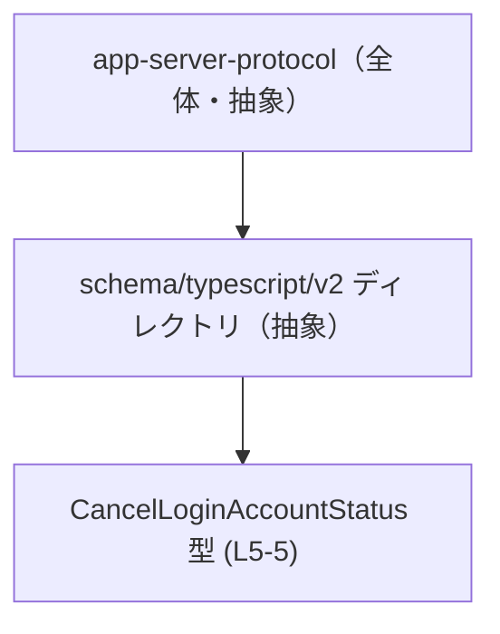
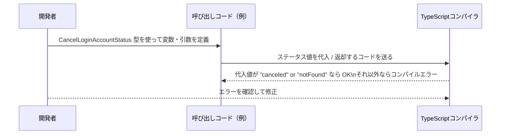

# app-server-protocol/schema/typescript/v2/CancelLoginAccountStatus.ts コード解説

## 0. ざっくり一言

- ts-rs によって自動生成された、「`canceled`」または「`notFound`」の 2 通りの文字列だけを取れるステータス型 `CancelLoginAccountStatus` を定義するファイルです。  
  （`CancelLoginAccountStatus.ts:L1-3, L5-5`）

---

## 1. このモジュールの役割

### 1.1 概要

- このモジュールは、`CancelLoginAccountStatus` という TypeScript の **文字列リテラル・ユニオン型**を 1 つだけ公開しています。（`CancelLoginAccountStatus.ts:L5-5`）
- `CancelLoginAccountStatus` は `"canceled" | "notFound"` という 2 つの文字列のいずれかのみを許可することで、ステータス値の取りうる範囲を型レベルで制約します。（`CancelLoginAccountStatus.ts:L5-5`）
- 冒頭コメントから、このファイルが ts-rs による **自動生成コード**であり、手作業で編集しない前提であることが分かります。（`CancelLoginAccountStatus.ts:L1-3`）

> 型名からは「ログインアカウントのキャンセル状態」を表す意図が推測できますが、具体的にどの処理のステータスかは、このファイル単体からは分かりません。

### 1.2 アーキテクチャ内での位置づけ

- ファイルパスから、この型が「app-server-protocol」の TypeScript スキーマ定義（v2）の一部であることが読み取れます。（質問で与えられたパス情報）
- このファイル自体は他モジュールを `import` / `export` しておらず、**依存関係は持たない純粋な型定義ファイル**です。（`CancelLoginAccountStatus.ts:L1-5`）

代表的な位置づけ（このファイルから分かる範囲＋抽象化した図）:



※ `Proto` や `TSv2` の中身の詳細は、このチャンクには現れません。

### 1.3 設計上のポイント

- **自動生成コード**  
  - 冒頭に「GENERATED CODE! DO NOT MODIFY BY HAND!」「Do not edit this file manually.」と明示されています。（`CancelLoginAccountStatus.ts:L1-3`）
- **責務の限定**  
  - 1 つの型エイリアスだけをエクスポートし、ロジックや状態は一切持ちません。（`CancelLoginAccountStatus.ts:L5-5`）
- **文字列リテラル・ユニオンによる型安全性**  
  - ステータスを `string` ではなく `"canceled" | "notFound"` に限定することで、TypeScript のコンパイル時チェックにより、その他の文字列の誤使用を防ぎます。（`CancelLoginAccountStatus.ts:L5-5`）
- **エラー処理・並行性**  
  - 関数やクラスが存在しないため、このファイル単体にはエラー処理ロジックや並行処理に関わるコードはありません。（`CancelLoginAccountStatus.ts:L1-5`）

---

## 2. 主要な機能一覧

このファイルが提供する機能は、次の 1 点に集約されます。

- `CancelLoginAccountStatus` 型定義:  
  `"canceled"` または `"notFound"` の 2 通りの文字列ステータスだけを取れる TypeScript 型エイリアス。（`CancelLoginAccountStatus.ts:L5-5`）

---

## 3. 公開 API と詳細解説

### 3.1 型一覧（構造体・列挙体など）

このチャンクで定義されている型の一覧です。

| 名前                       | 種別                            | 役割 / 用途（このファイルから分かる範囲）                               | 定義位置 / 根拠 |
|----------------------------|---------------------------------|--------------------------------------------------------------------------|-----------------|
| `CancelLoginAccountStatus` | 型エイリアス（文字列ユニオン） | `"canceled"` または `"notFound"` の 2 通りのみを取れるステータス型。     | `CancelLoginAccountStatus.ts:L5-5` |

#### 型の詳細

```typescript
export type CancelLoginAccountStatus = "canceled" | "notFound";
```

（`CancelLoginAccountStatus.ts:L5-5`）

- **型エイリアス**: `type` による別名定義です。`CancelLoginAccountStatus` という名前で、右辺の型（ユニオン）を表します。
- **文字列リテラル・ユニオン型**:  
  - `"canceled"` と `"notFound"` という 2 つの文字列リテラル型のユニオン（和集合）です。
  - この型が付いた変数には、コンパイル時点でこれ以外の文字列は代入できません。

> TypeScript の仕様に基づく一般的な挙動であり、このファイルに固有の記述ではありません。

### 3.2 関数詳細（最大 7 件）

- このファイルには関数・メソッドは一切定義されていません。（`CancelLoginAccountStatus.ts:L1-5`）
- そのため、「関数詳細」テンプレートを適用できる対象はありません。

### 3.3 その他の関数

- 補助関数やラッパー関数も定義されていません。（`CancelLoginAccountStatus.ts:L1-5`）

---

## 4. データフロー

このファイル単体には実行時ロジックが無いため、**実行時のデータフロー**は存在しません。（`CancelLoginAccountStatus.ts:L1-5`）

ここでは、`CancelLoginAccountStatus` が他コードから利用されるときの **コンパイル時の型チェックの流れ**を、概念的に示します（このファイル外のコードは例示であり、このチャンクには現れません）。



- `CancelLoginAccountStatus` 型自体は、**型レベルの情報だけ**を提供し、実行時には影響しません。
- 実行時に `"canceled"` 以外の文字列が入ってくる可能性は、TypeScript 全般の話としては存在しうるため、必要であれば別途ランタイムバリデーションが必要になります（このファイルにはそのコードはありません）。

---

## 5. 使い方（How to Use）

### 5.1 基本的な使用方法

`CancelLoginAccountStatus` を関数の引数や戻り値に付けて、ステータスを明示的に制約する典型的な利用例です。  
（※ import パスは、実際のプロジェクト構成に応じて変更が必要です。ここでは同一ディレクトリからの相対パスの例を示します。）

```typescript
// CancelLoginAccountStatus 型をインポートする（相対パスは例）              // 型定義を呼び出し側で利用する準備
import type { CancelLoginAccountStatus } from "./CancelLoginAccountStatus";  // このファイル名に対応する .ts から型を読み込む

// キャンセル処理の結果をハンドリングする関数                            // ステータス値に応じて処理を分岐する
function handleCancelStatus(status: CancelLoginAccountStatus): void {        // 引数 status に CancelLoginAccountStatus 型を付与
    if (status === "canceled") {                                            // "canceled" の場合だけにマッチする分岐
        console.log("キャンセルが完了しました");                           // キャンセル成功時の処理
    } else if (status === "notFound") {                                     // "notFound" の場合だけにマッチする分岐
        console.log("対象アカウントが見つかりません");                     // 見つからなかった場合の処理
    }
}
```

- `status` には `"canceled"` か `"notFound"` 以外を渡そうとすると、TypeScript コンパイラがエラーにしてくれます。
- 実行時には型情報は存在しないため、外部入力から来る値は別途検証する必要があります（このファイルにはそのコードはありません）。

### 5.2 よくある使用パターン

`CancelLoginAccountStatus` は、次のような場所で利用されることが多いと考えられます（一般的な TypeScript コードのパターンであり、このリポジトリ固有の使用箇所は、このチャンクからは分かりません）。

1. **オブジェクトのプロパティ型として使う**

```typescript
// キャンセル API のレスポンスを表す型（例）                                 // API レスポンスの構造定義の例
import type { CancelLoginAccountStatus } from "./CancelLoginAccountStatus";  // ステータス型をインポート

interface CancelResponse {                                                   // レスポンス全体の型
    status: CancelLoginAccountStatus;                                        // ステータスを CancelLoginAccountStatus に制約
    message?: string;                                                        // 任意のメッセージ（オプション）
}
```

1. **関数の戻り値型として使う**

```typescript
import type { CancelLoginAccountStatus } from "./CancelLoginAccountStatus";  // ステータス型をインポート

// キャンセル処理を行い、結果のステータスを返す関数（例）                // 戻り値の型として利用
function cancelAccount(/* 引数は省略 */): CancelLoginAccountStatus {        // 戻り値の型を CancelLoginAccountStatus に指定
    // 実際の処理はここでは省略                                             // 実装内容はこのファイルからは分からない
    return "canceled";                                                       // 許可された文字列リテラルを返す例
}
```

### 5.3 よくある間違い

TypeScript のユニオン型の特性に基づく、ありがちな誤りと正しい例です。

```typescript
import type { CancelLoginAccountStatus } from "./CancelLoginAccountStatus";

// 間違い例: 型を単なる string にしてしまう                               // 型安全性が損なわれる例
let status1: string;                                                         // 何でも入ってしまう string 型
status1 = "canceled";                                                        // OK だが
status1 = "cancelled";                                                       // スペルミスでもコンパイルは通ってしまう

// 正しい例: CancelLoginAccountStatus を使う                               // 許可された値だけに制約する
let status2: CancelLoginAccountStatus;                                       // 型エイリアスを使用
status2 = "canceled";                                                        // OK
// status2 = "cancelled";                                                   // コンパイルエラー: 型 '"cancelled"' を割り当てられない
```

- 「なんとなく `string` にしてしまう」と、スペルミスや未定義ステータスがコンパイル時に検知できなくなります。
- `CancelLoginAccountStatus` を使うことで、値の取りうる範囲を明示的に絞ることができます。

### 5.4 使用上の注意点（まとめ）

- **手動編集禁止**  
  - 冒頭コメントに「GENERATED CODE! DO NOT MODIFY BY HAND!」「Do not edit this file manually.」と明示されており、このファイルを直接編集しない前提になっています。（`CancelLoginAccountStatus.ts:L1-3`）
  - 新しいステータスを追加したい場合は、通常は ts-rs が参照する **元の Rust 側の型定義**を更新し、ts-rs による再生成を行う必要があります（一般的な ts-rs の運用に基づく説明であり、このリポジトリ固有の手順はこのチャンクからは分かりません）。
- **コンパイル時のみ有効な制約**  
  - `CancelLoginAccountStatus` による制約は TypeScript のコンパイル時にのみ機能し、実行時に自動で検証されるわけではありません。
  - 外部から JSON などで値を受け取る場合には、実行時のバリデーションを別途用意する必要があります（このファイルには含まれていません）。
- **エラー・並行性**  
  - 関数や状態を持たない型定義のみのファイルのため、このファイル単体が原因のランタイムエラーや並行性の問題は想定されません。（`CancelLoginAccountStatus.ts:L1-5`）

---

## 6. 変更の仕方（How to Modify）

### 6.1 新しい機能を追加する場合

- このファイルは ts-rs による自動生成物であり、「手で変更しない」ことがコメントで明示されています。（`CancelLoginAccountStatus.ts:L1-3`）
- 一般的な ts-rs の運用に基づくと、次のような流れが想定されます（ただし、このリポジトリ固有の手順はこのチャンクからは不明です）。
  1. Rust 側の元となる型定義（enum など）を修正し、新しいステータス値を追加する。
  2. ビルド、または ts-rs 用のスクリプト／コマンドを実行して TypeScript コードを再生成する。
  3. 生成された TypeScript 側の `CancelLoginAccountStatus` に新しい文字列リテラルが反映される。

- このファイルに直接別の型やロジックを追加すると、次回の自動生成で上書きされる可能性が高いため、**生成物には新機能を追加しない**のが一般的です。

### 6.2 既存の機能を変更する場合

`CancelLoginAccountStatus` 自体を変更したい場合の注意点です。

- **影響範囲の確認**  
  - どのモジュールが `CancelLoginAccountStatus` を参照しているかを、エディタの「参照検索」などで確認する必要があります。このファイル単体からは使用箇所は分かりません。
- **契約の変更**  
  - `"canceled"` を `"cancelled"` に変更する、`"notFound"` を削除するなどは、呼び出し側との「契約」を破る変更になります。
  - すべての呼び出しコードで、新しい文字列値に合わせて修正が必要です。
- **変更手順**  
  - コメントに従うなら、このファイルを直接書き換えるのではなく、生成元の Rust 側定義を変更し、ts-rs により再生成する形で変更を反映するのが自然です。（`CancelLoginAccountStatus.ts:L1-3`）

---

## 7. 関連ファイル

このチャンクから直接分かるファイル・ディレクトリと、推測レベルの関係を区別して列挙します。

| パス                                                       | 役割 / 関係 |
|------------------------------------------------------------|------------|
| `app-server-protocol/schema/typescript/v2/CancelLoginAccountStatus.ts` | 本解説の対象ファイル。ts-rs により生成された `CancelLoginAccountStatus` 型を定義する。（`CancelLoginAccountStatus.ts:L1-5`） |
| `app-server-protocol/schema/typescript/v2/`                | ディレクトリ名から、TypeScript 用 v2 スキーマ定義が配置される場所と推測されますが、具体的なファイル構成はこのチャンクには現れません。 |
| （Rust 側の元定義ファイル）                               | コメントに ts-rs が言及されているため、どこかに対応する Rust 型定義が存在するはずですが、パスやファイル名はこのチャンクからは不明です。（`CancelLoginAccountStatus.ts:L1-3`） |

---

### コンポーネントインベントリー（このチャンクのまとめ）

| 種別       | 名前                       | 説明                                                         | 根拠 |
|------------|----------------------------|--------------------------------------------------------------|------|
| 型エイリアス | `CancelLoginAccountStatus` | `"canceled"` または `"notFound"` の 2 通りの文字列だけを許可するステータス型。 | `CancelLoginAccountStatus.ts:L5-5` |

このファイルは非常に小さく、ロジックを持たない純粋な型定義ですが、TypeScript の型システムを活用してステータス値を厳密に制約する役割を担っています。
