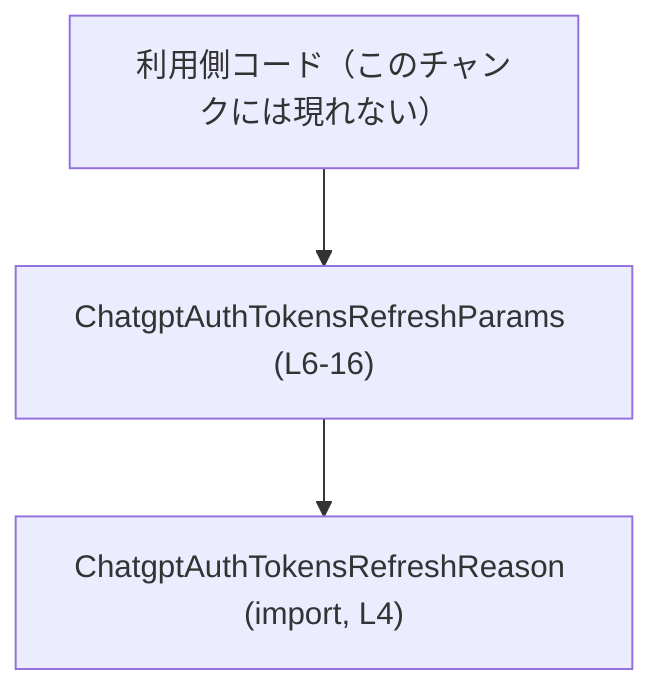
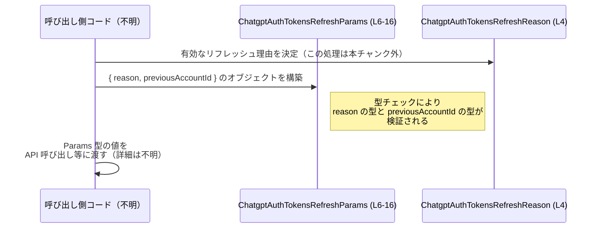

# app-server-protocol/schema/typescript/v2/ChatgptAuthTokensRefreshParams.ts コード解説

## 0. ざっくり一言

ChatGPT 認証トークンをリフレッシュする際に使われるパラメータオブジェクトの TypeScript 型を定義しているファイルです（型名とコメントからの解釈であり、実際の利用箇所はこのチャンクには現れません）。

---

## 1. このモジュールの役割

### 1.1 概要

- このモジュールは、`ChatgptAuthTokensRefreshParams` という **パラメータ用オブジェクト型**を提供します（`export type ...` から明らかです）。  
  - 根拠: `export type ChatgptAuthTokensRefreshParams = { ... };`  
    （ChatgptAuthTokensRefreshParams.ts:L6-16）
- フィールドとして、
  - リフレッシュ理由 `reason`
  - 以前使用していたワークスペース／アカウント ID `previousAccountId`
  を含みます（後者はオプションかつ `null` 許容）。  
  - 根拠: `reason: ChatgptAuthTokensRefreshReason,` と `previousAccountId?: string | null`  
    （ChatgptAuthTokensRefreshParams.ts:L6-6, L16-16）

### 1.2 アーキテクチャ内での位置づけ

このモジュールが直接依存しているのは、リフレッシュ理由を表す型 `ChatgptAuthTokensRefreshReason` のみです。

- 依存関係:
  - このファイル → `ChatgptAuthTokensRefreshReason` モジュール
    - 根拠: `import type { ChatgptAuthTokensRefreshReason } from "./ChatgptAuthTokensRefreshReason";`  
      （ChatgptAuthTokensRefreshParams.ts:L4-4）

Mermaid で依存関係を表すと、次のようになります。



- `Caller` ノードは、この型を利用する他モジュールが存在するであろう、という一般的な前提を示す抽象ノードです。具体的なモジュール名や階層はこのチャンクには出てきません。

### 1.3 設計上のポイント

- **自動生成コードであること**  
  - 冒頭コメントにより、このファイルは `ts-rs` により生成され、手動編集すべきでないことが明示されています。  
    - 根拠: `// GENERATED CODE! DO NOT MODIFY BY HAND!`  
      （ChatgptAuthTokensRefreshParams.ts:L1-1）  
      および `// This file was generated by [ts-rs](...). Do not edit this file manually.`  
      （ChatgptAuthTokensRefreshParams.ts:L3-3）
- **純粋な型定義のみ**  
  - 関数やクラス・実行ロジックは一切なく、型エイリアスのみをエクスポートしています。  
    - 根拠: `export type ...` 行以外に `function`, `class` などは存在しない  
      （ChatgptAuthTokensRefreshParams.ts:L1-16 全体）
- **厳密な理由表現と柔軟なアカウント識別子**  
  - `reason` は専用の型 `ChatgptAuthTokensRefreshReason` により表現され、許可された理由のみを取り得る設計になっています。  
    - 根拠: `reason: ChatgptAuthTokensRefreshReason`  
      （ChatgptAuthTokensRefreshParams.ts:L6-6）
  - `previousAccountId` は「任意 + null 許容」のプロパティで、コメントから「以前のワークスペース／アカウント識別子」の補助情報として使われることが分かります。  
    - 根拠: JSDoc コメントと `previousAccountId?: string | null`  
      （ChatgptAuthTokensRefreshParams.ts:L7-15, L16-16）
- **ステートレス**  
  - 実行時状態を保持するオブジェクトや変数はなく、純粋なデータコンテナ型の宣言になっています。

---

## 2. 主要な機能一覧（コンポーネントインベントリー）

このファイルに登場する主要なコンポーネントは次の通りです。

- `ChatgptAuthTokensRefreshParams`: ChatGPT 認証トークンのリフレッシュに関するパラメータを表すオブジェクト型（用途は型名とコメントからの推測）。  
  - 根拠: 型定義本体  
    （ChatgptAuthTokensRefreshParams.ts:L6-16）
- フィールド `reason`: リフレッシュの理由を表す必須フィールド。  
  - 根拠: `reason: ChatgptAuthTokensRefreshReason,`  
    （ChatgptAuthTokensRefreshParams.ts:L6-6）
- フィールド `previousAccountId`: 以前使用していたワークスペース／アカウントの識別子を表す任意フィールド。`string` または `null`。  
  - 根拠: JSDoc コメント + `previousAccountId?: string | null`  
    （ChatgptAuthTokensRefreshParams.ts:L7-15, L16-16）
- 外部依存型 `ChatgptAuthTokensRefreshReason`: リフレッシュ理由の型。詳細はこのチャンクには現れません。  
  - 根拠: `import type { ChatgptAuthTokensRefreshReason } from "./ChatgptAuthTokensRefreshReason";`  
    （ChatgptAuthTokensRefreshParams.ts:L4-4）

---

## 3. 公開 API と詳細解説

### 3.1 型一覧（構造体・列挙体など）

| 名前                            | 種別                               | 役割 / 用途                                                                                           | 定義箇所                                  |
|---------------------------------|------------------------------------|--------------------------------------------------------------------------------------------------------|-------------------------------------------|
| `ChatgptAuthTokensRefreshParams` | 型エイリアス（オブジェクト型）     | ChatGPT 認証トークンのリフレッシュ処理に渡されるパラメータオブジェクトを表す型（用途は名前とコメントからの推測）。 | ChatgptAuthTokensRefreshParams.ts:L6-16   |
| `ChatgptAuthTokensRefreshReason` | 外部モジュールの型（import のみ） | `reason` フィールドの型として使用される、リフレッシュ理由の列挙/ユニオン等を表す型。詳細はこのチャンクにはない。 | ChatgptAuthTokensRefreshParams.ts:L4-4    |

#### フィールド一覧（`ChatgptAuthTokensRefreshParams`）

| フィールド名         | 型                                | 必須/任意  | 説明                                                                                                                      | 定義箇所                                  |
|----------------------|-----------------------------------|------------|---------------------------------------------------------------------------------------------------------------------------|-------------------------------------------|
| `reason`             | `ChatgptAuthTokensRefreshReason` | 必須       | トークンリフレッシュを行う理由を表します。`ChatgptAuthTokensRefreshReason` 型により、取り得る値が制限されています。      | ChatgptAuthTokensRefreshParams.ts:L6-6    |
| `previousAccountId`  | `string \| null`                 | 任意（`?`）| 以前 Codex が使用していたワークスペース／アカウントの識別子。コメントによると、マルチアカウント環境でのヒントとして利用。 | ChatgptAuthTokensRefreshParams.ts:L7-15, L16-16 |

### 3.2 関数詳細

このファイルには **関数は定義されていません**。  
そのため、「関数詳細テンプレート」を直接適用できる対象はありません。

代わりに、このファイルが提供する公開 API である **型 `ChatgptAuthTokensRefreshParams`** について、関数テンプレートに準じた形で詳しく説明します。

#### `ChatgptAuthTokensRefreshParams`

**概要**

- ChatGPT 認証トークンのリフレッシュ処理に渡されるパラメータオブジェクトの構造を表す TypeScript の型エイリアスです（型名とコメントからの推測）。  
  - 根拠: `export type ChatgptAuthTokensRefreshParams = { ... };`  
    （ChatgptAuthTokensRefreshParams.ts:L6-16）

**フィールド**

| フィールド名        | 型                                | 説明 |
|---------------------|-----------------------------------|------|
| `reason`            | `ChatgptAuthTokensRefreshReason` | トークンリフレッシュの理由。どのような値を取り得るかは、`ChatgptAuthTokensRefreshReason` の定義に依存します（このチャンクには現れません）。 |
| `previousAccountId` | `string \| null` （オプション）  | Codex が以前使用していたワークスペース／アカウント ID。コメントによると、マルチアカウント／マルチワークスペース環境で「どのワークスペースのトークンを更新するか」のヒントとして利用されます。`undefined`（プロパティが存在しない）、`null`、空文字 `""` がそれぞれ区別される点に注意が必要です。 |

- `previousAccountId` の意味に関するコメント  
  - 根拠: JSDoc コメント  
    - 「Workspace/account identifier that Codex was previously using.」  
      （ChatgptAuthTokensRefreshParams.ts:L7-8）  
    - 「Clients that manage multiple accounts/workspaces can use this as a hint ...」  
      （ChatgptAuthTokensRefreshParams.ts:L10-11）  
    - 「This may be `null` when the prior auth state did not include a workspace identifier ...」  
      （ChatgptAuthTokensRefreshParams.ts:L13-14）

**戻り値**

- 型定義であり、関数ではないため戻り値はありません。

**内部処理の流れ（アルゴリズム）**

- 実行ロジックを持たない単なる型宣言のため、「処理の流れ」は存在しません。

**Examples（使用例）**

`ChatgptAuthTokensRefreshParams` 型の値を構築し、他の関数に渡すことを想定した例です。  
（ここで登場する `refreshTokens` 関数や `reason` 変数は、このファイル外の仮想的なコードであり、このチャンクには定義がありません。）

```typescript
// 仮想的な import 例: 実際のパスはこのチャンクからは不明だが、相対パスはコードに基づく
import type { ChatgptAuthTokensRefreshParams } from "./ChatgptAuthTokensRefreshParams";   // L6 の型を利用
import type { ChatgptAuthTokensRefreshReason } from "./ChatgptAuthTokensRefreshReason";   // L4 の型を利用

// どこか別の場所で定義されていると仮定するリフレッシュ理由
declare const reason: ChatgptAuthTokensRefreshReason;  // 実際の中身はこのチャンクからは不明

// 以前のアカウント ID 情報がある場合のパラメータ構築例
const paramsWithAccount: ChatgptAuthTokensRefreshParams = {
    reason,                              // 必須フィールド: L6 の定義に対応
    previousAccountId: "workspace-123",  // string 値を渡す: L16 の型に対応
};

// 以前のアカウント情報がない場合（プロパティを省略するパターン）
const paramsWithoutAccount: ChatgptAuthTokensRefreshParams = {
    reason,                              // previousAccountId は省略可能（?）: L16
};

// 以前の auth state にアカウント ID が含まれていないことを明示するために null を使うパターン
const paramsWithNullAccount: ChatgptAuthTokensRefreshParams = {
    reason,
    previousAccountId: null,             // コメントにある「This may be `null` ...」に対応: L13-14
};

// 仮想的なトークンリフレッシュ関数に渡す
declare function refreshTokens(params: ChatgptAuthTokensRefreshParams): Promise<void>;

async function doRefresh() {
    await refreshTokens(paramsWithAccount);
}
```

**Errors / Panics**

- このファイル自体は型定義のみであり、実行時のエラーや例外処理は含まれていません。
- 型チェック上の注意点:
  - `reason` を省略すると TypeScript のコンパイルエラーになります（必須フィールドのため）。  
    - 根拠: `reason` には `?` が付いていない  
      （ChatgptAuthTokensRefreshParams.ts:L6-6）
  - `previousAccountId` に `number` など `string` / `null` 以外の型を指定するとコンパイルエラーになります。  
    - 根拠: `previousAccountId?: string | null`  
      （ChatgptAuthTokensRefreshParams.ts:L16-16）

**Edge cases（エッジケース）**

- `previousAccountId` が **未指定 (`undefined`)** の場合  
  - オブジェクトにプロパティを含めないことは許容されます（`?` のため）。  
    - 根拠: `previousAccountId?`  
      （ChatgptAuthTokensRefreshParams.ts:L16-16）
- `previousAccountId` に **`null` を明示的に渡す**場合  
  - コメントに「This may be `null` ...」とあるため、`null` を使うケースも想定されています。  
    - 根拠: コメントと `string | null`  
      （ChatgptAuthTokensRefreshParams.ts:L13-14, L16-16）
- `previousAccountId` に **空文字 `""` を渡す**場合  
  - 型としては `string` なのでコンパイル上は許容されますが、空文字を「識別子あり」とみなすかどうかは利用側のロジック次第であり、このチャンクからは判断できません。
- `reason` の値のバリデーション  
  - `ChatgptAuthTokensRefreshReason` の具体的な定義がこのチャンクにはないため、「どの値が有効か」「エラーになるケース」がどう扱われるかは不明です。

**使用上の注意点**

- **必須フィールド `reason` の指定**  
  - 常に `reason` を指定する必要があります。省略するとコンパイルエラーになります。  
    - 根拠: `reason` に `?` が付いていない  
      （ChatgptAuthTokensRefreshParams.ts:L6-6）
- **`previousAccountId` の 3 状態の違い**  
  - `undefined`（プロパティが存在しない）  
  - `null`（「ID がない」ことを明示する値）  
  - `"..."` のような文字列  
  が区別されるため、利用側ではこれらを意識して扱う必要があります。  
  - コメントには `null` の意味しか書かれていないため、「プロパティ自体がない場合」をどう解釈するかはこのチャンクからは分かりません。  
    - 根拠: コメントと `?` 付き定義  
      （ChatgptAuthTokensRefreshParams.ts:L7-15, L16-16）
- **セキュリティ／プライバシー上の配慮**  
  - この型にはアクセストークンそのものは含まれていませんが（フィールド名に token 等がないことから分かります）、`previousAccountId` はユーザーやワークスペースを識別しうる情報です。ログ出力などでは取り扱いに注意が必要です。

### 3.3 その他の関数

- このファイルには関数・メソッド・クラスは定義されていません。

---

## 4. データフロー

このファイルは型定義のみですが、`ChatgptAuthTokensRefreshParams` が使われる典型的なデータフローを、「呼び出し側コード」を抽象化して示します。  
（呼び出し側の具体的なモジュール名や処理内容はこのチャンクには現れないため、抽象的な表現に留めています。）



要点:

- `ChatgptAuthTokensRefreshParams` 自体は「データの形」を定めるだけで、実際の送受信や保存処理はこのチャンクには含まれません。
- `reason` の決定ロジックや、`previousAccountId` に何を入れるかは、呼び出し側の責務です（このチャンクでは不明）。

---

## 5. 使い方（How to Use）

### 5.1 基本的な使用方法

`ChatgptAuthTokensRefreshParams` 型を使ってパラメータオブジェクトを作り、それを関数に渡す例です。  
（関数 `refreshTokens` はこのファイルには定義されていない仮想的なものです。）

```typescript
import type { ChatgptAuthTokensRefreshParams } from "./ChatgptAuthTokensRefreshParams";   // L6 の型を import
import type { ChatgptAuthTokensRefreshReason } from "./ChatgptAuthTokensRefreshReason";   // L4 の型を import

// どこかで決まったリフレッシュ理由（実際の中身はこのチャンクからは不明）
declare const reason: ChatgptAuthTokensRefreshReason;

// 以前のワークスペース ID が分かっているケース
const params: ChatgptAuthTokensRefreshParams = {
    reason,                               // 必須: L6
    previousAccountId: "workspace-123",   // 任意 + string: L16
};

// 仮想的なトークンリフレッシュ関数
declare function refreshTokens(params: ChatgptAuthTokensRefreshParams): Promise<void>;

async function main() {
    await refreshTokens(params);
}
```

### 5.2 よくある使用パターン

1. **アカウント ID ありのリフレッシュ**

```typescript
declare const reason: ChatgptAuthTokensRefreshReason;

const paramsWithAccount: ChatgptAuthTokensRefreshParams = {
    reason,
    previousAccountId: "account-42",  // マルチアカウント環境でどのアカウントかを示す: L10-11, L16
};
```

1. **アカウント ID 不明／未使用のリフレッシュ（プロパティ省略）**

```typescript
declare const reason: ChatgptAuthTokensRefreshReason;

const paramsWithoutAccount: ChatgptAuthTokensRefreshParams = {
    reason,  // previousAccountId は省略（undefined）: L16 の ? に対応
};
```

1. **「以前の auth にはアカウント ID がなかった」ことを明示（`null`）**

```typescript
declare const reason: ChatgptAuthTokensRefreshReason;

const paramsWithNull: ChatgptAuthTokensRefreshParams = {
    reason,
    previousAccountId: null,  // コメントにある `This may be null ...` に対応: L13-14
};
```

### 5.3 よくある間違い

```typescript
import type { ChatgptAuthTokensRefreshParams } from "./ChatgptAuthTokensRefreshParams";

// 間違い例 1: reason を省略している（必須フィールド）
// const badParams1: ChatgptAuthTokensRefreshParams = {
//     previousAccountId: "workspace-123",
// };
// → コンパイルエラー: 'reason' プロパティがない

// 間違い例 2: previousAccountId に number を渡している
// const badParams2: ChatgptAuthTokensRefreshParams = {
//     reason,                 // 仮に有効な reason があるとして
//     previousAccountId: 123, // 型は string | null なのでエラー: L16
// };

// 正しい例
declare const reason: import("./ChatgptAuthTokensRefreshReason").ChatgptAuthTokensRefreshReason;

const goodParams: ChatgptAuthTokensRefreshParams = {
    reason,                   // 必須
    previousAccountId: "123", // string であれば OK
};
```

### 5.4 使用上の注意点（まとめ）

- `reason` は必須フィールドであり、省略できません（L6-6）。
- `previousAccountId` は
  - 省略（プロパティなし）
  - `null`
  - 非空／空の `string`
  を取り得るため、利用側で明示的に条件分岐するなどして扱いを統一する必要があります（L16-16）。
- このファイルは自動生成されるため、直接編集せず、元になっている Rust 側の定義や `ts-rs` 設定を変更するのが前提です（L1-1, L3-3）。

---

## 6. 変更の仕方（How to Modify）

### 6.1 新しい機能を追加する場合

このファイルは `ts-rs` による自動生成コードであり、冒頭コメントで「手で編集しないこと」が明示されています（L1-1, L3-3）。したがって、直接この TypeScript ファイルを編集するのではなく、**元となる Rust 側の型定義**を変更し、再生成する必要があります。

想定される手順（一般論であり、具体的な Rust ファイルの場所はこのチャンクからは不明です）:

1. Rust 側で `ChatgptAuthTokensRefreshParams` に対応する構造体（または類似の型）を探す。  
   - このファイルのコメントにある `ts-rs` から、Rust 型に `#[derive(TS)]` 等が付与されていると推測されますが、実際の定義場所は不明です。
2. その Rust 型に新しいフィールドを追加する、あるいは既存フィールドの型を変更する。
3. `ts-rs` のコード生成コマンド（ビルドスクリプトや手動コマンド）を実行し、本ファイルを再生成する。

### 6.2 既存の機能を変更する場合

既存フィールドの変更についても同様に、Rust 側で行う必要があります。

変更時の注意点:

- **`reason` の型を変える場合**  
  - `ChatgptAuthTokensRefreshReason` の定義を変更することになります。この型を使っている他の箇所への影響が大きい可能性があります。
- **`previousAccountId` の optional / null 許容を変える場合**  
  - `?` を外す（必須にする）、`null` を許容しない、などは API コントラクトの変更となり、呼び出し側のコードがコンパイルエラーになることがあります。
  - コメントの内容（「This may be `null` ...」など）も合わせて更新する必要があります。
- **影響範囲の確認**  
  - TypeScript 側では、この型を import している全ファイルでコンパイルエラーが出る可能性があります。型変更後は必ずビルドして確認する必要があります。

---

## 7. 関連ファイル

| パス / モジュール名                     | 役割 / 関係 |
|----------------------------------------|------------|
| `./ChatgptAuthTokensRefreshReason`     | `ChatgptAuthTokensRefreshReason` 型を提供するモジュール。`reason` フィールドの型として使用されます（ChatgptAuthTokensRefreshParams.ts:L4-4）。 |
| Rust 側の対応する型定義ファイル（不明） | この TypeScript ファイルを `ts-rs` が生成する際の元となる Rust 型定義。具体的なパスはこのチャンクからは分かりませんが、変更はそちらで行う必要があります（ChatggtAuthTokensRefreshParams.ts:L1-1, L3-3 から自動生成であることのみ分かります）。 |

このチャンクにはテストコードやこの型を実際に利用するコードは含まれていないため、利用箇所の詳細な一覧は不明です。
