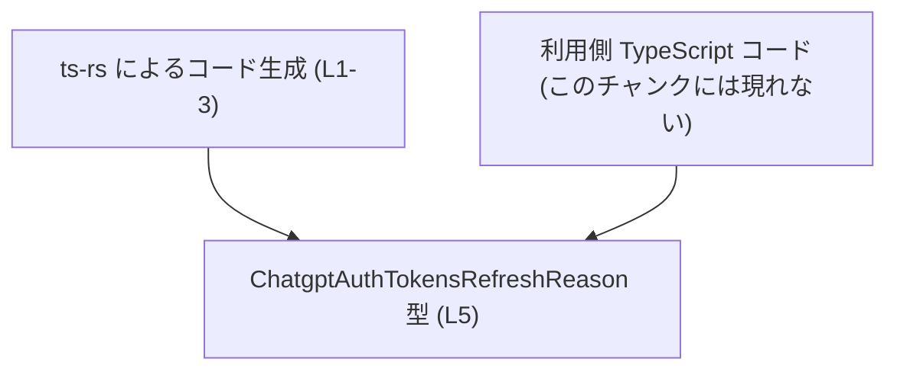
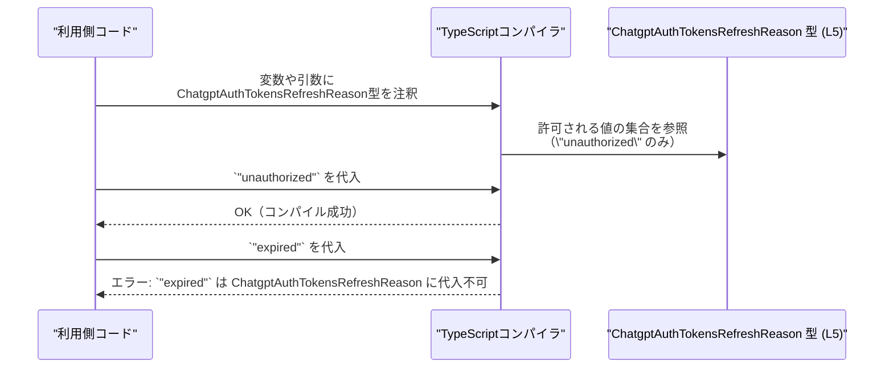

## app-server-protocol\schema\typescript\v2\ChatgptAuthTokensRefreshReason.ts

---

## 0. ざっくり一言

ChatGPT 関連と推測される認証トークンの「リフレッシュ理由」を、`"unauthorized"` という文字列リテラルだけを許可する型エイリアスとして定義した、自動生成ファイルです（`ChatgptAuthTokensRefreshReason.ts:L1-3, L5-5`）。

---

## 1. このモジュールの役割

### 1.1 概要

- このモジュールは、`ChatgptAuthTokensRefreshReason` という TypeScript の型エイリアスを定義しています（`ChatgptAuthTokensRefreshReason.ts:L5-5`）。
- 型の実体は `"unauthorized"` という **文字列リテラル型** であり、この型を使った場所では `"unauthorized"` 以外の文字列はコンパイル時にエラーになります（TypeScript の文字列リテラル型の仕様）。
- 先頭コメントから、このファイルは `ts-rs` というツールによる **自動生成コード** であり、手動で編集しないことが明示されています（`ChatgptAuthTokensRefreshReason.ts:L1-3`）。

> 型名から、ChatGPT の認証トークンのリフレッシュ理由を表す用途が想定されますが、具体的な業務的意味はこのチャンクだけからは断定できません。

### 1.2 アーキテクチャ内での位置づけ

- ディレクトリパス `app-server-protocol\schema\typescript\v2\` から、このファイルは「アプリケーションサーバのプロトコルスキーマ（バージョン v2）の TypeScript 表現」の一部であると解釈できますが、詳細な構成はこのチャンクには現れません。
- コメントから、このファイルは `ts-rs` ツールにより生成されたスキーマ型定義であり（`ChatgptAuthTokensRefreshReason.ts:L1-3`）、**他のコードからインポートされて利用される前提の“定義専用モジュール”** になっています。

この関係を概念的に表すと、次のようになります（依存元のコード自体はこのチャンクには含まれていません）:



※ 図は、コメントとファイルパスから読み取れる **役割の関係** を概念的に示したものであり、実際のプロジェクト構造の詳細はこのチャンクからは分かりません。

### 1.3 設計上のポイント

- **自動生成コードであること**
  - `// GENERATED CODE! DO NOT MODIFY BY HAND!` と `ts-rs` による生成である旨がコメントに明記されています（`ChatgptAuthTokensRefreshReason.ts:L1-3`）。
  - 設計として、「生成源（おそらく別言語や別スキーマ）の変更 → 再生成」で管理する前提になっています。
- **状態やロジックを持たない純粋な型定義**
  - エクスポートされているのは型エイリアス 1 つだけで、関数・クラス・変数は存在しません（`ChatgptAuthTokensRefreshReason.ts:L5-5`）。
  - そのため、**実行時状態や副作用、並行性（スレッド安全性）に関する懸念はありません**。安全性はコンパイル時の型チェックのみです。
- **TypeScript 特有の型安全性**
  - `"unauthorized"` という **1 つの文字列リテラルのみ** を許可することで、誤った文字列の代入をコンパイル時に防ぎます（`ChatgptAuthTokensRefreshReason.ts:L5-5`）。
  - 実行時には通常の `string` と同様に扱われ、追加のランタイムチェックはこのファイル自体には含まれていません。

---

## 2. 主要な機能一覧

このモジュールが提供する主要な機能は、次の 1 点です。

- `ChatgptAuthTokensRefreshReason` 型定義: リフレッシュ理由として `"unauthorized"` だけを許可する文字列リテラル型エイリアス（`ChatgptAuthTokensRefreshReason.ts:L5-5`）

---

## 3. 公開 API と詳細解説

### 3.1 型一覧（構造体・列挙体など） ― コンポーネントインベントリー

| 名前 | 種別 | 役割 / 用途 | 定義位置 |
|------|------|-------------|----------|
| `ChatgptAuthTokensRefreshReason` | 型エイリアス（`"unauthorized"` という文字列リテラル型） | 認証トークンのリフレッシュ理由を `"unauthorized"` に限定して表現するための型。これを使うことで、他の文字列の代入をコンパイル時に禁止できる。 | `ChatgptAuthTokensRefreshReason.ts:L5-5` |

#### 型の仕様（契約 / Contract）

- **許可される値**
  - この型に代入できる値は **文字列 `"unauthorized"` のみ** です（`ChatgptAuthTokensRefreshReason.ts:L5-5`）。
- **禁止される値（代表例）**
  - `"expired"`, `"forbidden"`, `""`（空文字） など、 `"unauthorized"` 以外のすべての文字列は **コンパイルエラー** になります（TypeScript の文字列リテラル型仕様に基づく）。
- **ランタイムでの挙動**
  - コンパイル後の JavaScript からは型情報が消えるため、ランタイムでは単なる `string` として扱われます。
  - したがって、**ランタイムでの不正値混入を防ぐためには、呼び出し側やサーバとの連携でのバリデーションが必要**になる可能性があります（このファイルにはバリデーションロジックは存在しません）。

#### エッジケース（型レベル）

- 空文字列 `""`: この型には代入できず、コンパイルエラーになります。
- `null` / `undefined`: それ自体は `"unauthorized"` ではないため、型注釈が `ChatgptAuthTokensRefreshReason` の変数には代入できません。
- ワイドな型への代入:
  - `const x: ChatgptAuthTokensRefreshReason = "unauthorized";` は正しい。
  - `const s: string = x;` は、`string` の方が広いので許可されます（情報は広がるが制約は失われます）。

### 3.2 関数詳細（最大 7 件）

このファイルには **関数・メソッド・クラスは一切定義されていません**（`ChatgptAuthTokensRefreshReason.ts:L1-5`）。

そのため、

- 実行時エラー
- 例外スロー
- 非同期処理や並行処理に関する振る舞い

など、関数に紐づくロジックは存在しません。

### 3.3 その他の関数

| 関数名 | 役割（1 行） | 定義位置 |
|--------|--------------|----------|
| （なし） | このファイルには補助関数も含めて関数定義がありません。 | `ChatgptAuthTokensRefreshReason.ts:L1-5` |

---

## 4. データフロー

### 4.1 このモジュール単体のデータフロー

- このモジュールは **型定義のみ** を提供し、自身では値を生成・変換・送受信しません（`ChatgptAuthTokensRefreshReason.ts:L5-5`）。
- したがって、**実行時のデータフロー（データの通過経路）は、このファイル単体には存在しません**。
- TypeScript 特有の観点では、「利用側コード → TypeScript コンパイラ → この型定義」という形で **コンパイル時に参照される** のみです。

### 4.2 型チェックの流れ（概念図）

以下は、`ChatgptAuthTokensRefreshReason` 型がコンパイル時にどのように使われるかを示した **概念的なシーケンス図** です。  
※ これは TypeScript の一般的な振る舞いを表したものであり、このリポジトリ内の特定のファイル間呼び出しを示すものではありません。



---

## 5. 使い方（How to Use）

### 5.1 基本的な使用方法

以下は、同一ディレクトリにあると仮定して `ChatgptAuthTokensRefreshReason` をインポートし、インターフェースで利用する例です（パスは例示であり、実プロジェクトの構成はこのチャンクからは分かりません）。

```typescript
// ChatgptAuthTokensRefreshReason 型をインポートする（同一ディレクトリ想定）
import type { ChatgptAuthTokensRefreshReason } from "./ChatgptAuthTokensRefreshReason"; // 仮のパス

// トークンリフレッシュ結果を表す型
interface TokenRefreshResult {
    reason: ChatgptAuthTokensRefreshReason; // リフレッシュ理由を型で制約する
}

// 正しい使用例: 許可された文字列だけを代入
const ok: TokenRefreshResult = {
    reason: "unauthorized", // ChatgptAuthTokensRefreshReason に代入可能な唯一の値
};

// 誤った使用例: コンパイルエラーとなる（IDE でも警告される）
const ng: TokenRefreshResult = {
    // @ts-expect-error - "expired" は ChatgptAuthTokensRefreshReason に代入できない
    reason: "expired",
};
```

この例から分かるように、

- 型を使うことで、**許容される理由文字列をコンパイル時に制約できる** ため、ミスタイプや仕様外の値を早期に検出できます。
- ランタイムでは JavaScript にダウンコンパイルされ、型情報は消えますが、コンパイル段階でエラーにできることが TypeScript の安全性のポイントです。

### 5.2 よくある使用パターン

#### パターン 1: 関数引数として利用する

```typescript
import type { ChatgptAuthTokensRefreshReason } from "./ChatgptAuthTokensRefreshReason"; // 仮のパス

// リフレッシュ理由に応じた処理を行う関数
function handleTokenRefreshReason(
    reason: ChatgptAuthTokensRefreshReason, // この引数には "unauthorized" 以外を渡せない
): void {
    if (reason === "unauthorized") {
        // 例: 再ログインを促す UI を表示する など
        console.log("Token refresh failed: unauthorized");
    }

    // 現時点では他の分岐は存在しない（型が1値のみのため）
}
```

- 呼び出し側は `handleTokenRefreshReason("unauthorized")` のみ許容され、誤った文字列はコンパイル時エラーになります。
- 将来、生成元のスキーマが拡張されて `"expired"` などが追加された場合には、この関数の分岐も増やすことになります（ただし、その変更がこのファイルにどのように反映されるかはこのチャンクからは分かりません）。

#### パターン 2: フィールド型として利用する

```typescript
import type { ChatgptAuthTokensRefreshReason } from "./ChatgptAuthTokensRefreshReason"; // 仮のパス

interface RefreshEvent {
    // 他フィールドは省略
    refreshReason: ChatgptAuthTokensRefreshReason; // 理由を厳密に型で表現
}

const event: RefreshEvent = {
    refreshReason: "unauthorized", // 型に一致
};
```

### 5.3 よくある間違い

#### 間違い例 1: 単なる `string` 型として宣言してしまう

```typescript
// 間違い例: string 型にしてしまうと制約が効かない
let reason1: string = "unauthorized"; // 一見正しそうだが…
reason1 = "expired";                  // これもコンパイル上は許可されてしまう

// 正しい例: ChatgptAuthTokensRefreshReason 型で宣言する
import type { ChatgptAuthTokensRefreshReason } from "./ChatgptAuthTokensRefreshReason"; // 仮のパス

let reason2: ChatgptAuthTokensRefreshReason = "unauthorized";
// reason2 = "expired"; // コンパイルエラー: "expired" は代入不可
```

- 誤り: 広い `string` 型にしてしまうと、仕様外の値が紛れ込んでもコンパイラはエラーを出せません。
- 正解: `ChatgptAuthTokensRefreshReason` 型を利用することで、**プロトコル仕様とコードの整合性を保ちやすく** なります。

#### 間違い例 2: 生成コードを直接書き換えてしまう

```typescript
// 間違い例（やってはいけない）:
// export type ChatgptAuthTokensRefreshReason = "unauthorized" | "expired";
```

- このファイルには `// GENERATED CODE! DO NOT MODIFY BY HAND!` と明記されており（`ChatgptAuthTokensRefreshReason.ts:L1-3`）、**手動変更は想定されていません**。
- 正しい対応は、「生成元のスキーマ」や `ts-rs` の設定側を変更して、再生成することです（生成元の位置はこのチャンクには現れません）。

### 5.4 使用上の注意点（まとめ）

- **前提条件**
  - `ChatgptAuthTokensRefreshReason` 型の変数・フィールドには、`"unauthorized"` だけを代入できる前提があります（`ChatgptAuthTokensRefreshReason.ts:L5-5`）。
- **バグ / セキュリティ上の注意**
  - この型自体は **コンパイル時の型制約を提供するだけ** であり、ランタイムで値を検証する機能はありません。
  - サーバからのレスポンスや外部入力が、想定外の文字列を含んだとしても、**ランタイムで自動的に弾かれるわけではない** 点に注意が必要です（別途バリデーション層が必要）。
- **並行性 / スレッド安全性**
  - 型定義だけで状態やロジックを持たないため、**並行性やスレッド安全性に関する問題は発生しません**。
- **パフォーマンス**
  - 実行時には追加のオブジェクトや処理を導入せず、JavaScript の `string` として扱われるだけなので、パフォーマンスコストはありません。
- **編集禁止**
  - ファイル先頭のコメントの通り、このファイルは自動生成コードであり、**手動で書き換えると生成元との不整合や再生成時の上書き** が発生します（`ChatgptAuthTokensRefreshReason.ts:L1-3`）。

---

## 6. 変更の仕方（How to Modify）

### 6.1 新しい機能を追加する場合

ここでは、「新しいリフレッシュ理由を追加したい」というケースを想定します。

1. **このファイルを直接編集しない**
   - `// GENERATED CODE! DO NOT MODIFY BY HAND!` と明記されているため（`ChatgptAuthTokensRefreshReason.ts:L1-3`）、ここを手で書き換えると、再生成時に上書きされるなどの問題が起きます。
2. **生成元（ts-rs の入力側）に手を入れる**
   - コメントから、このファイルは `ts-rs` によって生成されたと分かります（`ChatgptAuthTokensRefreshReason.ts:L1-3`）。
   - したがって、新しい理由（例: `"expired"` など）を追加したい場合は、
     - `ts-rs` が参照している元の型定義・スキーマを変更する
     - `ts-rs` を再実行して TypeScript スキーマを再生成する  
     というフローになると考えられます（生成元の具体的な位置や言語は、このチャンクからは分かりません）。
3. **利用側コードの対応**
   - 生成された型に新しいリテラルが追加された場合、`switch` 文や `if` 分岐で `reason` を扱う関数など（例: `handleTokenRefreshReason`）を更新する必要があります。
   - このファイルだけからは利用側コードは分からないため、IDE のリファレンス検索などで `ChatgptAuthTokensRefreshReason` の使用箇所を特定することになります。

### 6.2 既存の機能を変更する場合

- **型の意味・契約を変更する場合の注意点**
  - `"unauthorized"` というリテラルを別の文字列に変えたり、値を削除したりすることは、その型を利用しているすべてのコードに影響します。
  - 変更後の型がコンパイルエラーを引き起こす箇所を確認し、呼び出し側のロジックを合わせて修正する必要があります。
- **影響範囲の確認方法**
  - `ChatgptAuthTokensRefreshReason` をシンボル検索し、参照箇所を一覧するのが基本です。
  - このファイルには参照元の情報は含まれていないため、IDE やビルドエラーを手掛かりに追うことになります。
- **Contracts / Edge Cases 観点**
  - 仕様として、「この型が表現する値の集合」が契約です。
  - 値を追加・削除すると、その契約が変わるため、関連する API ドキュメントやサーバ側の仕様との整合性も確認する必要があります（ただし、その仕様はこのチャンクには現れません）。

---

## 7. 関連ファイル

このチャンクには他ファイルへの具体的な参照はありませんが、ディレクトリ構造から推測できる範囲で整理します（推測であることを明示します）。

| パス | 役割 / 関係 |
|------|------------|
| `app-server-protocol\schema\typescript\v2\` ディレクトリ全体 | 本ファイルと同様に、`ts-rs` によって生成されたと考えられる TypeScript スキーマ定義ファイル群が配置されているディレクトリであると推測できますが、このチャンクには具体的なファイル一覧や内容は現れていません。 |
| （不明） | `ChatgptAuthTokensRefreshReason` の生成元となるスキーマ／型定義ファイル（おそらく `ts-rs` の入力）は、このチャンクには現れず、パスや言語も特定できません。 |

---

このファイルは、**自動生成された単一の文字列リテラル型エイリアス** という非常にシンプルな構造ですが、TypeScript の型システムを利用してプロトコルレベルの値の制約を表現するという点で、プロジェクト全体の型安全性に寄与するコンポーネントになっています。
