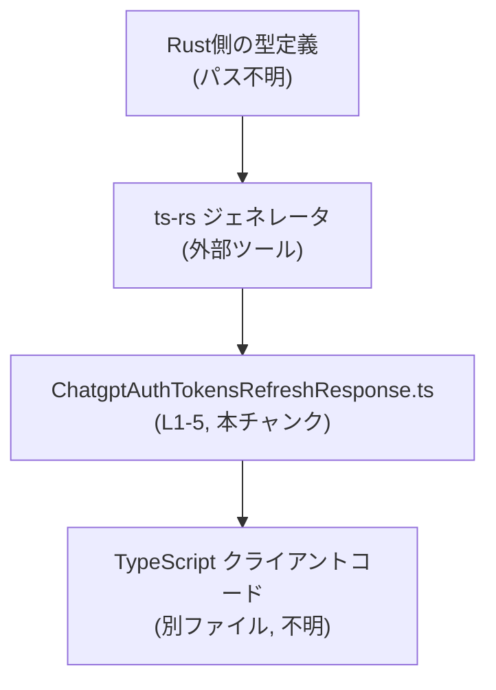
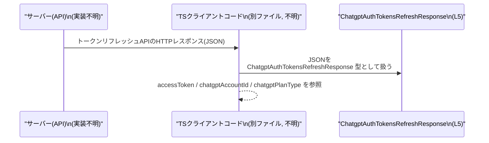

# app-server-protocol/schema/typescript/v2/ChatgptAuthTokensRefreshResponse.ts コード解説

## 0. ざっくり一言

ChatGPT の認証トークンをリフレッシュした結果を表す **TypeScript の型定義**です（型エイリアス）。  
3 つの必須プロパティを持つオブジェクト構造を表現しています（`accessToken`, `chatgptAccountId`, `chatgptPlanType`）。  
（定義: `app-server-protocol/schema/typescript/v2/ChatgptAuthTokensRefreshResponse.ts:L5-5`）

---

## 1. このモジュールの役割

### 1.1 概要

- このファイルは、`ChatgptAuthTokensRefreshResponse` という型エイリアスを 1 つエクスポートしています（`...ChatgptAuthTokensRefreshResponse.ts:L5-5`）。
- コメントから、このファイルは Rust 向けライブラリ **ts-rs** によって自動生成されたものであり、手動編集は想定されていません（`...ChatgptAuthTokensRefreshResponse.ts:L1-3`）。
- 型名とフィールド名から、この型は「ChatGPT 認証トークンのリフレッシュ API のレスポンス」を表すオブジェクト構造として利用されることが想定されますが、このファイル単体からは実際の使用箇所は分かりません。

### 1.2 アーキテクチャ内での位置づけ

コメントから読み取れる範囲と、ts-rs の一般的な役割に基づき、このファイルは「サーバー側（Rust）の型」と「クライアント側（TypeScript）の型」を橋渡しする自動生成コードとして位置づけられます。



- `R`（Rust 側の型）はコメントから存在が推測されますが、このチャンクには定義が現れません（パス不明）。
- `T` は本ファイルそのもので、`ChatgptAuthTokensRefreshResponse` を提供します（`...ChatgptAuthTokensRefreshResponse.ts:L5-5`）。
- `C`（利用側の TS コード）は別ファイルにあり、この型をインポートして利用すると考えられますが、こちらもこのチャンクには現れません。

### 1.3 設計上のポイント

コードから読み取れる設計上の特徴は次のとおりです。

- **自動生成コード**  
  - 冒頭コメントで明示されています（`...ChatgptAuthTokensRefreshResponse.ts:L1-3`）。  
  - 変更は元となる Rust 側の定義で行い、ts-rs で再生成する前提の設計です。
- **単純なデータコンテナ型**  
  - 関数やクラスではなく、1 つのオブジェクト型エイリアスのみを提供し、ロジックや状態は持ちません（`...ChatgptAuthTokensRefreshResponse.ts:L5-5`）。
- **null を許容するフィールド**  
  - `chatgptPlanType` は `string | null` で定義されており、プラン種別が存在しないケースを型で表現しています（`...ChatgptAuthTokensRefreshResponse.ts:L5-5`）。
- **エラーハンドリング・並行性**  
  - このファイルには実行時処理・I/O・非同期処理が一切ないため、エラー処理・並行性に関するロジックは存在しません。

---

## 2. 主要な機能一覧

このファイルは「機能」というより「データ構造の定義」のみを提供します。

- `ChatgptAuthTokensRefreshResponse`: ChatGPT 認証トークンリフレッシュの結果を表すオブジェクト型。`accessToken`, `chatgptAccountId`, `chatgptPlanType` の 3 フィールドを持つ（`...ChatgptAuthTokensRefreshResponse.ts:L5-5`）。

---

## 3. 公開 API と詳細解説

### 3.1 型一覧（構造体・列挙体など）

**コンポーネントインベントリー**

| 名前 | 種別 | 役割 / 用途 | 主なフィールド | 定義位置 |
|------|------|-------------|----------------|----------|
| `ChatgptAuthTokensRefreshResponse` | 型エイリアス（オブジェクト型） | ChatGPT 認証トークンリフレッシュ応答の構造を表現する | `accessToken: string`, `chatgptAccountId: string`, `chatgptPlanType: string \| null` | `app-server-protocol/schema/typescript/v2/ChatgptAuthTokensRefreshResponse.ts:L5-5` |

各フィールドの意味は、名前から次のように解釈できます（用途は推測ですが、型情報はコードから確認できます）。

- `accessToken: string`（`...ChatgptAuthTokensRefreshResponse.ts:L5-5`）  
  - 新しいアクセストークンを表す文字列。
- `chatgptAccountId: string`（同上）  
  - 対応する ChatGPT アカウントの ID を表す文字列。
- `chatgptPlanType: string | null`（同上）  
  - アカウントの料金プラン種別を表す文字列、または未設定／不明などを示す `null`。

### 3.2 関数詳細（最大 7 件）

このファイルには **関数・メソッドは 1 つも定義されていません**（確認範囲: `...ChatgptAuthTokensRefreshResponse.ts:L1-5`）。  
したがって、詳細な関数解説の対象はありません。

### 3.3 その他の関数

同様に、補助関数やラッパー関数も存在しません（`...ChatgptAuthTokensRefreshResponse.ts:L1-5`）。

---

## 4. データフロー

この型は純粋なデータ定義のみを提供し、処理フローは含みませんが、**型名とフィールド名から推測される典型的な利用イメージ**を示します。  
（以下の図はあくまで利用イメージであり、このチャンクのコードだけからは呼び出し元・URL などの詳細は分かりません。）



このイメージにおいて:

- **契約（Contract）**  
  - サーバーは少なくとも次のプロパティを含む JSON を返す前提になります。  
    - `accessToken`: 文字列
    - `chatgptAccountId`: 文字列
    - `chatgptPlanType`: 文字列または `null`  
  - TypeScript 側は、この契約をコンパイル時の型として `ChatgptAuthTokensRefreshResponse` を利用します。

---

## 5. 使い方（How to Use）

### 5.1 基本的な使用方法

`ChatgptAuthTokensRefreshResponse` 型を利用して、トークンリフレッシュ API のレスポンスに型を付ける例です。  
インポートパスや URL はプロジェクト構成に合わせて変更する必要があります。

```typescript
// インポートパスは実際のプロジェクト構成に合わせて調整する
import type { ChatgptAuthTokensRefreshResponse } from "./ChatgptAuthTokensRefreshResponse";

// トークンリフレッシュAPIを呼び出して、型付きのレスポンスとして扱う例
async function refreshTokens(): Promise<ChatgptAuthTokensRefreshResponse> {
    const res = await fetch("/api/chatgpt/auth/refresh"); // 仮のエンドポイント
    const json = await res.json();                        // 実行時には any 型に近い

    // 実際にはスキーマ検証を行うのが安全だが、
    // ここでは単純化のため型アサーションを用いている
    return json as ChatgptAuthTokensRefreshResponse;
}

// 取得したレスポンスを利用する例
async function useTokens() {
    const resp = await refreshTokens();

    // string 型として扱えるフィールド
    console.log(resp.accessToken);      // 新しいアクセストークン
    console.log(resp.chatgptAccountId); // アカウントID

    // chatgptPlanType は string | null なので null チェックが必要
    if (resp.chatgptPlanType !== null) {
        console.log(resp.chatgptPlanType.toUpperCase());
    } else {
        console.log("プラン未設定");
    }
}
```

この例から分かるポイント:

- TypeScript はコンパイル時に `accessToken` 等の存在・型をチェックできますが、**実行時に JSON の形が異なっても自動で検出されるわけではない**ことに注意が必要です。
- `chatgptPlanType` に対しては、型が `string | null` であるため、**null チェックを行ってから文字列メソッドを呼び出す必要があります**。

### 5.2 よくある使用パターン

1. **API クライアントの戻り値型として利用する**

```typescript
import type { ChatgptAuthTokensRefreshResponse } from "./ChatgptAuthTokensRefreshResponse";

async function callRefreshApi(): Promise<ChatgptAuthTokensRefreshResponse> {
    // 戻り値型に ChatgptAuthTokensRefreshResponse を指定することで、
    // 呼び出し側はフィールド名と型の補完・チェックを受けられる
    /* ... */
    throw new Error("実装例"); // 実装はプロジェクト依存
}
```

1. **レスポンスの一部だけを別型にマッピングする**

```typescript
import type { ChatgptAuthTokensRefreshResponse } from "./ChatgptAuthTokensRefreshResponse";

type SimpleTokenInfo = {
    accessToken: string;
    plan: string | null;
};

function mapToSimpleInfo(
    resp: ChatgptAuthTokensRefreshResponse
): SimpleTokenInfo {
    return {
        accessToken: resp.accessToken,
        plan: resp.chatgptPlanType, // そのまま string | null として受け渡し
    };
}
```

### 5.3 よくある間違い

1. **`chatgptPlanType` の null を考慮しない**

```typescript
// 誤りの例: chatgptPlanType を常に string だと仮定している
function printPlan(resp: ChatgptAuthTokensRefreshResponse) {
    // コンパイル時にはエラーになるが、型アサーションや any 経由だと
    // 実行時に TypeError になる可能性がある
    console.log(resp.chatgptPlanType.toUpperCase());
}

// 正しい例: null チェックを行う
function safePrintPlan(resp: ChatgptAuthTokensRefreshResponse) {
    if (resp.chatgptPlanType) {
        console.log(resp.chatgptPlanType.toUpperCase());
    } else {
        console.log("プラン情報なし");
    }
}
```

1. **`any` を使って型安全性を失う**

```typescript
// 誤りの例: any を使うことで ChatgptAuthTokensRefreshResponse の型チェックを無効化
async function badUsage() {
    const resp: any = await fetch("/api/...").then(r => r.json());

    // accessToken の綴りを間違えてもコンパイルエラーにならない
    console.log(resp.accesToken); // 実行時に undefined になる可能性
}

// 正しい例: 型エイリアスを利用してプロパティ名を型で保証する
async function goodUsage() {
    const resp = (await fetch("/api/...").then(r => r.json())) as ChatgptAuthTokensRefreshResponse;
    console.log(resp.accessToken); // 補完が効き、綴りのミスも検出されやすい
}
```

### 5.4 使用上の注意点（まとめ）

- **自動生成コードを直接編集しない**  
  - コメントで「DO NOT MODIFY BY HAND」と明記されています（`...ChatgptAuthTokensRefreshResponse.ts:L1-3`）。  
  - 変更が必要な場合は、元の Rust 側の定義を修正し、ts-rs で再生成する必要があります。
- **null 許容フィールドの扱い**  
  - `chatgptPlanType` は `string | null` であるため、利用時には null チェックを行う前提で設計する必要があります（`...ChatgptAuthTokensRefreshResponse.ts:L5-5`）。
- **ランタイム検証の不在**  
  - TypeScript の型はコンパイル時のみ有効であり、実行時には自動で JSON のスキーマを検証しません。  
  - セキュリティや信頼性を重視する場合、別途ランタイムのスキーマ検証（`typeof` チェックやバリデーションライブラリなど）を組み合わせる必要があります。
- **並行性・スレッド安全性**  
  - この型はイミュータブルなデータ構造の仕様を示すだけであり、共有して読み取り専用で使う限り、並行処理に起因する問題はありません。

---

## 6. 変更の仕方（How to Modify）

### 6.1 新しい機能を追加する場合

このファイル自体は自動生成されるため、直接の編集は推奨されません（`...ChatgptAuthTokensRefreshResponse.ts:L1-3`）。

新しいフィールドや機能を追加する一般的な手順は次のとおりです（元定義の場所はこのチャンクからは不明です）。

1. **Rust 側の元定義を特定する**  
   - `ChatgptAuthTokensRefreshResponse` に対応する Rust の構造体（struct）や型を探します。  
   - パスはこのチャンクには現れないため、「不明」です。
2. **Rust 側の型にフィールドを追加・変更する**  
   - 例: `plan_type: Option<String>` など、ts-rs が解釈可能な形で定義する。
3. **ts-rs で TypeScript コードを再生成する**  
   - プロジェクトで採用しているビルドスクリプトやコマンドに従って再生成します。
4. **TypeScript 側の利用コードを更新する**  
   - 追加フィールドを参照するコードを書いたり、null チェック等のロジックを調整します。

### 6.2 既存の機能を変更する場合

既存フィールドの型や名前を変更する場合の注意点:

- **契約変更の影響範囲**  
  - サーバーとクライアント間の「データ契約」が変わるため、両側の実装変更が必要です。
  - 例: `chatgptPlanType` を `string` のみにすると、これまで `null` を受け取っていたクライアントが実行時エラーになる可能性があります。
- **互換性の確認**  
  - 既存のクライアントコードで `ChatgptAuthTokensRefreshResponse` を参照している箇所をすべて確認し、コンパイルエラーやロジックの不整合がないかを確認する必要があります。
- **テストの必要性**  
  - このチャンクにはテストコードは現れませんが（`...ChatgptAuthTokensRefreshResponse.ts:L1-5`）、実際には API 応答のスナップショットテストや型に基づく検証テストを追加・更新することが望ましいです。

---

## 7. 関連ファイル

このチャンクから直接参照できる関連ファイルのパスは存在しませんが、概念的に関連しうる要素を整理します。

| パス | 役割 / 関係 |
|------|------------|
| 不明（Rust 側の元型定義） | ts-rs によって本ファイルが生成される元となる Rust の構造体・型定義。コメントから存在が推測されますが、このチャンクには現れません。 |
| 不明（TypeScript 側の利用コード） | `ChatgptAuthTokensRefreshResponse` をインポートして利用するクライアントコード。API クライアントやフロントエンドロジック等が該当すると考えられますが、パスはこのチャンクには現れません。 |

---

### まとめ

- このファイルは、**自動生成された 1 つの TypeScript 型エイリアス**を提供するシンプルなモジュールです（`...ChatgptAuthTokensRefreshResponse.ts:L5-5`）。
- 公開 API は `ChatgptAuthTokensRefreshResponse` のみであり、コアロジック・エラー処理・並行性の制御などは一切含みません。
- 実用上は、**API レスポンスの型安全な取り扱い**と、`chatgptPlanType` の null を考慮したコード設計が重要なポイントになります。
