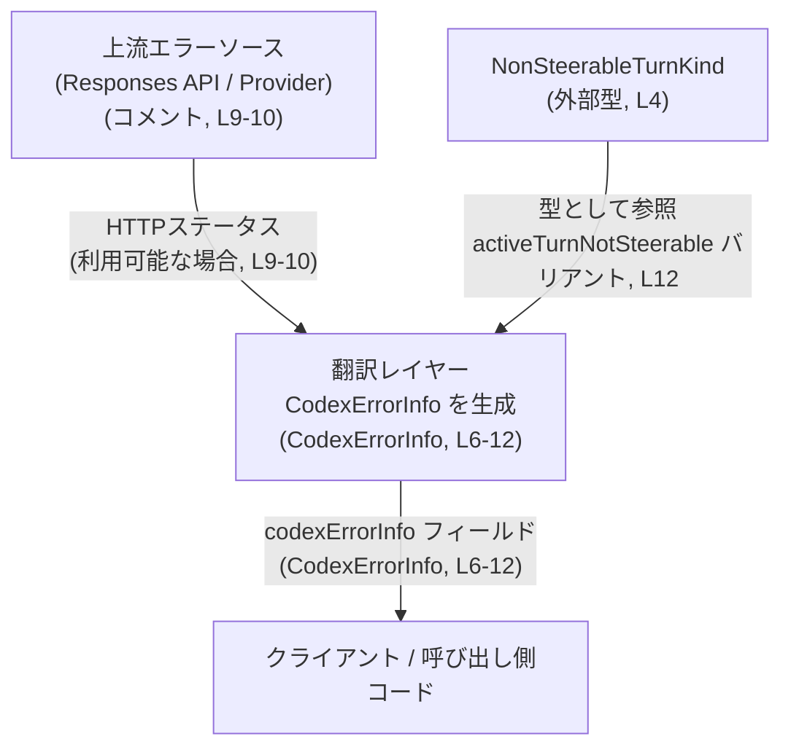
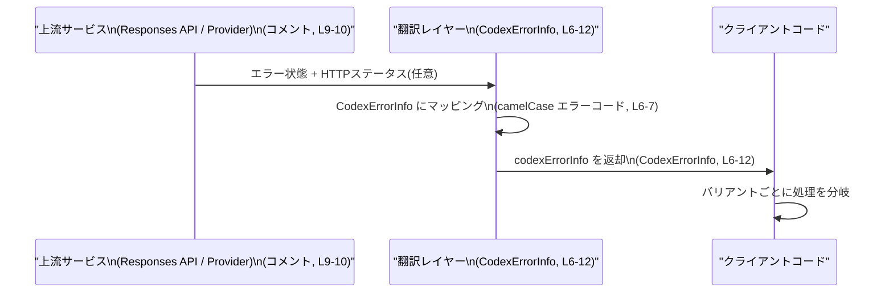

# app-server-protocol/schema/typescript/v2/CodexErrorInfo.ts コード解説

## 0. ざっくり一言

`CodexErrorInfo` は、Codex プロトコルのエラー情報を **camelCase のエラーコード**と、必要に応じて **HTTP ステータスコード**や `NonSteerableTurnKind` とともに表現するための TypeScript の union 型です（`CodexErrorInfo.ts:L6-12`）。

---

## 1. このモジュールの役割

### 1.1 概要

- このモジュールは、Codex が扱うエラーを **型安全な形** で表現するための **型定義**を提供します（`CodexErrorInfo.ts:L6-12`）。
- コメントから、この型は「翻訳レイヤー」の一部として、Codex のエラーコードを **camelCase で外部に公開する**役割を持つことが分かります（`CodexErrorInfo.ts:L6-10`）。
- 上流（Responses API やプロバイダー）から取得できる HTTP ステータスコードを、該当するバリアントの `httpStatusCode` フィールドに転送する契約になっています（`CodexErrorInfo.ts:L9-10`）。

### 1.2 アーキテクチャ内での位置づけ

コメントから読み取れる範囲での、周辺コンポーネントとの関係イメージです。



- 実際の「翻訳レイヤー」や「クライアント」のクラス／関数は、このチャンクには現れません。上図はコメントの記述（`CodexErrorInfo.ts:L6-10`）から読み取れる概念レベルの関係です。

### 1.3 設計上のポイント

コードとコメントから読み取れる特徴は次のとおりです。

- **自動生成コード**  
  - ファイル先頭のコメントにより、`ts-rs` によって生成されたコードであり、手動編集は禁止とされています（`CodexErrorInfo.ts:L1-3`）。
- **純粋な型定義のみ**  
  - 関数やクラスはなく、`type` エイリアスによる union 型定義のみが存在します（`CodexErrorInfo.ts:L12-12`）。
- **文字列リテラルとオブジェクトの union**  
  - 多くのバリアントは文字列リテラル（例: `"contextWindowExceeded"`）で表現され、一部は HTTP ステータスや `NonSteerableTurnKind` を含むオブジェクトとして表現されています（`CodexErrorInfo.ts:L12-12`）。
- **camelCase に統一されたエラーコード**  
  - コメントにより、エラーコードを camelCase で公開するための翻訳レイヤーであると明記されています（`CodexErrorInfo.ts:L6-7`）。
- **HTTP ステータスコードの転送**  
  - 利用可能な場合、上流の HTTP ステータスコードが `httpStatusCode: number | null` として該当バリアントに含まれる契約になっています（`CodexErrorInfo.ts:L9-10, L12-12`）。
- **状態や並行性を持たない**  
  - 値オブジェクトのみの定義であり、状態管理やスレッド／並行処理はこのファイルの関知するところではありません。

---

## 2. 主要な機能一覧

ここでいう「機能」は、この型が表現できるエラー内容（バリアント）を指します。名前から推測できる範囲を含みますが、推測であるものはその旨を明示します。

- `"contextWindowExceeded"`: コンテキストウィンドウの制限超過を表すと考えられるバリアント（命名からの推測、`CodexErrorInfo.ts:L12-12`）。
- `"usageLimitExceeded"`: 利用量（クォータなど）の制限超過を表すと考えられるバリアント（推測、`CodexErrorInfo.ts:L12-12`）。
- `"serverOverloaded"`: サーバー過負荷状態を表すと考えられるバリアント（推測、`CodexErrorInfo.ts:L12-12`）。
- `{ "httpConnectionFailed": { httpStatusCode: number | null } }`: HTTP 接続の失敗と、可能であれば関連する HTTP ステータスコードを表すバリアント（`CodexErrorInfo.ts:L9-10, L12-12`）。
- `{ "responseStreamConnectionFailed": { httpStatusCode: number | null } }`: レスポンスストリーム接続の失敗と関連ステータスコード（`CodexErrorInfo.ts:L12-12`）。
- `"internalServerError"`: 内部サーバーエラーを表すと考えられるバリアント（推測、`CodexErrorInfo.ts:L12-12`）。
- `"unauthorized"`: 認証／認可の失敗を表すと考えられるバリアント（推測、`CodexErrorInfo.ts:L12-12`）。
- `"badRequest"`: 不正なリクエストを表すと考えられるバリアント（推測、`CodexErrorInfo.ts:L12-12`）。
- `"threadRollbackFailed"`: スレッドのロールバック失敗を表すと考えられるバリアント（推測、`CodexErrorInfo.ts:L12-12`）。
- `"sandboxError"`: サンドボックス内エラーを表すと考えられるバリアント（推測、`CodexErrorInfo.ts:L12-12`）。
- `{ "responseStreamDisconnected": { httpStatusCode: number | null } }`: レスポンスストリームの切断と関連ステータスコード（`CodexErrorInfo.ts:L12-12`）。
- `{ "responseTooManyFailedAttempts": { httpStatusCode: number | null } }`: 多数の失敗試行後のレスポンスエラーとステータスコード（命名からの推測、`CodexErrorInfo.ts:L12-12`）。
- `{ "activeTurnNotSteerable": { turnKind: NonSteerableTurnKind } }`: ステア不可能なアクティブターンを表すバリアント。`turnKind` の意味は `NonSteerableTurnKind` の定義側に依存します（`CodexErrorInfo.ts:L4, L12-12`）。
- `"other"`: 上記以外のその他のエラーを表すフォールバックバリアント（命名からの推測、`CodexErrorInfo.ts:L12-12`）。

---

## 3. 公開 API と詳細解説

### 3.1 型一覧（構造体・列挙体など）

このファイルおよびその直近の依存に関する型インベントリーです。

| 名前 | 種別 | 役割 / 用途 | 定義位置 / 根拠 |
|------|------|-------------|------------------|
| `NonSteerableTurnKind` | 外部定義の型（具体的な種別はこのチャンクには現れません） | `"activeTurnNotSteerable"` バリアントにおいて、ステア不可能なターンの種別を表す型として使用されます。 | インポート文から（`CodexErrorInfo.ts:L4-4`） |
| `CodexErrorInfo` | 型エイリアス（union 型） | Codex のエラーコードを camelCase の文字列および、必要に応じて HTTP ステータス / `NonSteerableTurnKind` とともに表現するための公開エラー情報型です。 | `export type CodexErrorInfo = ...`（`CodexErrorInfo.ts:L12-12`） |

#### `CodexErrorInfo` の構造

`CodexErrorInfo` は以下のような union 型です（`CodexErrorInfo.ts:L12-12`）。

- 単純な文字列リテラルのバリアント:
  - `"contextWindowExceeded"`
  - `"usageLimitExceeded"`
  - `"serverOverloaded"`
  - `"internalServerError"`
  - `"unauthorized"`
  - `"badRequest"`
  - `"threadRollbackFailed"`
  - `"sandboxError"`
  - `"other"`
- HTTP ステータスコードを含むバリアント:
  - `{ "httpConnectionFailed": { httpStatusCode: number | null } }`
  - `{ "responseStreamConnectionFailed": { httpStatusCode: number | null } }`
  - `{ "responseStreamDisconnected": { httpStatusCode: number | null } }`
  - `{ "responseTooManyFailedAttempts": { httpStatusCode: number | null } }`
- `NonSteerableTurnKind` を含むバリアント:
  - `{ "activeTurnNotSteerable": { turnKind: NonSteerableTurnKind } }`

TypeScript 的には、「**文字列リテラル型**」と「**オブジェクト型**」を組み合わせた **判別可能な union 型に近い構造** です。ただし判別キーは `"httpConnectionFailed"` 等のトップレベルプロパティ名になります。

### 3.2 関数詳細（最大 7 件）

このファイルには **関数・メソッドの定義は存在しません**（`CodexErrorInfo.ts:L1-12`）。  
したがって、このセクションでテンプレートを適用すべき公開関数はありません。

### 3.3 その他の関数

同様に、このファイル内には補助関数やラッパー関数も存在しません。

---

## 4. データフロー

この型がどのように使われるかについて、コメントから読み取れる範囲で典型的な流れを整理します。

- 上流の API やプロバイダーが、HTTP エラーやその他のエラー状態を返す（`CodexErrorInfo.ts:L9-10`）。
- 翻訳レイヤーが、これを `CodexErrorInfo` のいずれかのバリアントに変換し、利用可能な場合は `httpStatusCode` に HTTP ステータスコードを転送する（`CodexErrorInfo.ts:L6-10, L12-12`）。
- 呼び出し側（クライアント）は、`CodexErrorInfo` の値を受け取り、バリアントごとにエラーハンドリングを分岐させる。

この流れはコメント上の記述からの抽象化であり、具体的な関数やクラス名はこのチャンクには現れません。



---

## 5. 使い方（How to Use）

ここでは、この型を使う側（クライアントコード）の例を示します。  
実際のプロジェクト構成はこのチャンクからは分からないため、インポートパスは概念的なものです。

### 5.1 基本的な使用方法

#### 例1: エラー値を生成して返す

```typescript
// CodexErrorInfo 型と NonSteerableTurnKind 型をインポートする
import type { CodexErrorInfo } from "./CodexErrorInfo";            // 型エイリアスのインポート
import type { NonSteerableTurnKind } from "./NonSteerableTurnKind"; // 外部で定義された型

// HTTP 接続失敗時に CodexErrorInfo を生成する例
function createHttpConnectionError(statusCode: number | null): CodexErrorInfo {
    // httpConnectionFailed バリアントのオブジェクトを返す
    return {
        httpConnectionFailed: {
            httpStatusCode: statusCode, // number または null を設定
        },
    };
}

// ステア不可能なターンのエラーを生成する例
function createActiveTurnNotSteerableError(turnKind: NonSteerableTurnKind): CodexErrorInfo {
    return {
        activeTurnNotSteerable: {
            turnKind, // NonSteerableTurnKind 型の値
        },
    };
}

// 単純な文字列リテラルのエラーを返す例
function createUsageLimitError(): CodexErrorInfo {
    return "usageLimitExceeded"; // 文字列リテラルも CodexErrorInfo に含まれる
}
```

このように、**バリアントによって値の形が異なる**ことに注意する必要があります。

#### 例2: エラーを判別して処理する

```typescript
import type { CodexErrorInfo } from "./CodexErrorInfo";

// CodexErrorInfo に基づいてリトライ可能かどうか判定する例
function isRetryable(error: CodexErrorInfo): boolean {
    // まず、文字列バリアントとオブジェクトバリアントを分ける
    if (typeof error === "string") {
        switch (error) {
            case "serverOverloaded":        // サーバー過負荷（推測）
                return true;                // リトライする方針の例
            case "unauthorized":            // 認可エラー（推測）
            case "badRequest":              // クライアント側の誤り（推測）
                return false;
            default:
                return false;
        }
    }

    // ここに来る時点で error はオブジェクト型に絞られている
    if ("httpConnectionFailed" in error || "responseStreamConnectionFailed" in error) {
        return true;                        // 接続系のエラーはリトライ可能とする例
    }

    // その他のオブジェクトバリアントについては個別に判定してもよい
    if ("responseTooManyFailedAttempts" in error) {
        return false;                       // 多数失敗後は打ち切る方針の例
    }

    return false;
}
```

- `typeof error === "string"` のチェックによって、文字列バリアントとオブジェクトバリアントを**型ガード**で分けています。
- その後、オブジェクトバリアントに対して `in` 演算子を用いて特定のバリアントを判別しています。

### 5.2 よくある使用パターン

1. **HTTP ステータスの有無で分岐**

```typescript
function describeHttpError(error: CodexErrorInfo): string {
    if (typeof error !== "string" && "httpConnectionFailed" in error) {
        const detail = error.httpConnectionFailed;
        if (detail.httpStatusCode != null) {
            // HTTP ステータスコードが利用可能な場合
            return `HTTP connection failed with status ${detail.httpStatusCode}`;
        } else {
            // ステータスコードがない場合
            return "HTTP connection failed with unknown status";
        }
    }

    return "Non-HTTP error";
}
```

- `httpStatusCode` は `number | null` であるため、`null` チェックが必要です（`CodexErrorInfo.ts:L12-12`）。

1. **ログ用途での一括出力**

```typescript
function logCodexError(error: CodexErrorInfo): void {
    if (typeof error === "string") {
        console.error("Codex error:", error); // 文字列バリアントをそのまま出力
        return;
    }

    // オブジェクトバリアントは JSON にして出力する例
    console.error("Codex error (object variant):", JSON.stringify(error));
}
```

### 5.3 よくある間違い

推測される誤用パターンと、その修正版です。

```typescript
import type { CodexErrorInfo } from "./CodexErrorInfo";

// 誤り例 1: 常に httpStatusCode がある前提でアクセスしてしまう
function incorrectGetStatus(error: CodexErrorInfo): number {
    // ❌ 文字列バリアントにも httpStatusCode があると思っている
    // return error.httpStatusCode; // コンパイルエラー & ランタイムエラーの可能性

    // ✅ 正しい例: まず型ガードでオブジェクトかどうかを確認し、
    // さらに httpStatusCode を持つバリアントかどうかを判別する
    if (typeof error !== "string" && "httpConnectionFailed" in error) {
        return error.httpConnectionFailed.httpStatusCode ?? 0;
    }
    return 0;
}

// 誤り例 2: エラーコードを snake_case で扱ってしまう
function incorrectCompare(error: CodexErrorInfo): boolean {
    // ❌ コメントに反して snake_case を使用
    // return error === "context_window_exceeded";

    // ✅ 正しい例: camelCase の "contextWindowExceeded" を使用
    return error === "contextWindowExceeded";
}
```

- コメントにある通り、この翻訳レイヤーは **camelCase のエラーコード**を公開するためのものなので、呼び出し側も camelCase の文字列リテラルを使用する必要があります（`CodexErrorInfo.ts:L6-7`）。

### 5.4 使用上の注意点（まとめ）

- **型ガードの必須性**  
  - `CodexErrorInfo` は文字列バリアントとオブジェクトバリアントの両方を含む union 型のため、プロパティアクセス前に `typeof error === "string"` などで適切に分岐する必要があります。
- **`httpStatusCode` の null 取り扱い**  
  - `httpStatusCode: number | null` なので、「HTTP ステータスコードが利用可能な場合に限り設定される」という契約に沿って、`null` チェックを行う必要があります（`CodexErrorInfo.ts:L9-10, L12-12`）。
- **セキュリティ上の注意**  
  - この型自体は単なるデータ表現であり、直接的なセキュリティ機構はありません。ただし、ログやクライアントへのレスポンスにそのまま出力する際には、上流から渡ってきた `httpStatusCode` や `NonSteerableTurnKind` に機密情報が含まれていないか、別途確認する必要があります。
- **並行性に関する注意**  
  - このファイルは純粋な型定義のみであり、JavaScript のイベントループや非同期処理、Web Worker 等との直接の関係はありません。並行処理時に共有されるのは「イミュータブルな値オブジェクト」として扱うのが前提です。
- **互換性・契約（Contract）**  
  - バリアント名（文字列リテラル）とオブジェクト構造は、他のコンポーネントとの API 契約そのものです。変更すると、フロントエンド・バックエンド間の互換性が壊れる可能性があります。

---

## 6. 変更の仕方（How to Modify）

### 6.1 新しい機能を追加する場合（新バリアントの追加）

このファイルは自動生成であり、手動編集が禁止されています（`CodexErrorInfo.ts:L1-3`）。したがって、**このファイルそのものを直接編集してはなりません**。

一般的な ts-rs の利用形態と、先頭コメント（`CodexErrorInfo.ts:L3-3`）から言える範囲での手順は以下の通りです。

1. **生成元の型定義を変更する**
   - ts-rs は Rust 側の型定義から TypeScript の型を生成するツールとして知られています。
   - 新しいエラーバリアントを追加する場合は、Rust 側の対応する型（構造体・列挙体など）にバリアントを追加する必要があります。  
     （具体的なファイル名や型名はこのチャンクには現れないため不明です。）
2. **ts-rs による再生成を実行する**
   - プロジェクト側で用意されているビルド／コード生成コマンド（例: `cargo test` あるいは専用スクリプト）を実行して TypeScript コードを再生成します。
3. **呼び出し側コードを更新する**
   - 新しいバリアントが追加された場合、`CodexErrorInfo` を使用している箇所の `switch` / `if` 分岐などで、そのバリアントを扱うロジックを追加する必要があります。

### 6.2 既存の機能を変更する場合

- **バリアント名を変更する場合**
  - 文字列リテラル（例: `"serverOverloaded"`）を変更すると、それを比較しているすべてのクライアントコードが動作しなくなります。
  - コメントにある「camelCase で公開する」というポリシー（`CodexErrorInfo.ts:L6-7`）との整合性も確認する必要があります。
- **`httpStatusCode` の型や意味を変更する場合**
  - `number | null` から別の型に変更すると、既存の型ガードや null チェックが無効になります。
  - 「上流の HTTP ステータスを転送する」という契約（`CodexErrorInfo.ts:L9-10`）も再定義が必要になります。
- **`NonSteerableTurnKind` の変更**
  - `activeTurnNotSteerable` バリアントの意味を左右するため、その型の変更はこの union 型の意味にも影響します。
  - `NonSteerableTurnKind` の具体的な定義はこのチャンクにないため、変更時の詳細な影響範囲はそちらのファイル側で確認する必要があります。

変更を行う際の共通の注意点:

- 生成元の Rust 型、`CodexErrorInfo` を使用する TypeScript 側の呼び出しコード、両方のテストを更新・再実行する必要があります。
- 型定義の変更はコンパイル時エラーとして現れるため、型チェックを通すことで誤りを早期に発見できます。

---

## 7. 関連ファイル

このモジュールと特に関係が深いと考えられるファイルやコンポーネントです。

| パス / 名称 | 役割 / 関係 |
|-------------|------------|
| `./NonSteerableTurnKind` | `CodexErrorInfo` の `"activeTurnNotSteerable"` バリアントで使用される型が定義されているファイルです（`CodexErrorInfo.ts:L4-4`）。具体的な中身はこのチャンクには現れません。 |
| ts-rs 生成元の Rust 型定義（パス不明） | ファイル先頭のコメントから、この TypeScript 型は ts-rs により自動生成されていることが分かります（`CodexErrorInfo.ts:L1-3`）。新バリアント追加や構造変更は、この生成元側の型定義で行う必要があります。 |
| Codex プロトコルのクライアント／サーバーコード（パス不明） | `CodexErrorInfo` を `codexErrorInfo` フィールドとして露出し、エラーハンドリングに利用する側のコードが存在すると推測されますが、このチャンクには現れません。 |

このチャンク単体からは、より広範なアーキテクチャの詳細や具体的な呼び出し元／呼び出し先は分かりません。そのため、実際の利用箇所を特定するには、プロジェクト全体の参照検索（`CodexErrorInfo` の使用箇所検索など）が必要になります。
