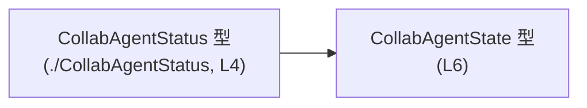
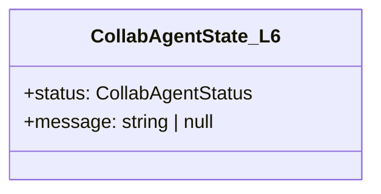
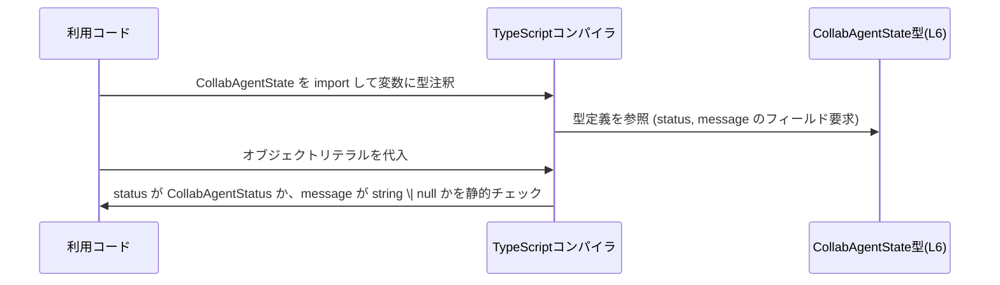

# app-server-protocol/schema/typescript/v2/CollabAgentState.ts コード解説

## 0. ざっくり一言

`CollabAgentState` は、コラボレーション用のエージェントの「状態」を表す TypeScript の型エイリアスで、状態コード `status` と任意の説明メッセージ `message` をまとめて表現するためのデータ構造です（`CollabAgentState.ts:L4-6`）。

---

## 1. このモジュールの役割

### 1.1 概要

- このモジュールは、**コラボエージェントの状態情報を表現する型** を提供します。
- Rust 側の型から `ts-rs` により自動生成された TypeScript 型であり、**手動編集は想定されていません**（`CollabAgentState.ts:L1-3`）。
- 状態は `CollabAgentStatus` 型の `status` と、任意の文字列 `message`（`string | null`）のペアとして表現されます（`CollabAgentState.ts:L4-6`）。

### 1.2 アーキテクチャ内での位置づけ

このファイルは、TypeScript 側の「スキーマ定義レイヤー」に属し、他モジュールから参照される**データ契約（DTO 的な型）**として使われる位置づけと考えられます。

実際に依存関係として確認できるのは、以下のみです。

- 依存先:
  - `./CollabAgentStatus` から型 `CollabAgentStatus` をインポート（`import type`）している（`CollabAgentState.ts:L4-4`）。
- 提供するもの:
  - `export type CollabAgentState = { ... }` により、外部から `CollabAgentState` 型を利用できる（`CollabAgentState.ts:L6-6`）。

この依存関係を Mermaid で表すと次のようになります。



> 注: `CollabAgentStatus` の中身や他モジュールからの利用状況は、このチャンクには現れないため不明です。

### 1.3 設計上のポイント

コードから読み取れる設計上の特徴は次のとおりです。

- **自動生成コードであることが明示されている**  
  - ファイル先頭に「GENERATED CODE! DO NOT MODIFY BY HAND! / ts-rs による生成」と記載されています（`CollabAgentState.ts:L1-3`）。
- **状態は 2 フィールドで表現される単純なレコード型**  
  - `status: CollabAgentStatus` と `message: string | null` の 2 つのプロパティだけを持つオブジェクト形の型エイリアスになっています（`CollabAgentState.ts:L6-6`）。
- **メッセージの任意性は `null` によって表現**  
  - `message` は `string | null` 型で、プロパティ自体は必須だが値として `null` を取り得る形になっています（`CollabAgentState.ts:L6-6`）。
- **実行時ロジックは一切持たない**  
  - このファイル内には関数やクラスは存在せず、静的型定義のみが提供されています（`CollabAgentState.ts:L1-6`）。

---

## 2. 主要な機能一覧

このモジュールは関数やメソッドを提供しません。提供する「機能」は、次の1つの型定義です。

- `CollabAgentState`:  
  コラボエージェントの状態を `status`（`CollabAgentStatus`）と `message`（`string | null`）として表現するための型エイリアス（`CollabAgentState.ts:L4-6`）。

---

## 3. 公開 API と詳細解説

### 3.1 型一覧（構造体・列挙体など）

このファイルに登場する主要な型および依存関係の一覧です。

| 名前 | 種別 | 役割 / 用途 | 根拠行 (`ファイル名:L開始-終了`) |
|------|------|-------------|-----------------------------------|
| `CollabAgentState` | 型エイリアス（オブジェクト型） | コラボエージェントの状態を、`status` と任意メッセージ `message` のペアで表現するデータ構造。外部に公開される主要型。 | `CollabAgentState.ts:L6-6` |
| `CollabAgentStatus` | 型（外部定義, import only） | エージェント状態を表す型。`CollabAgentState.status` の型として使用される。具体的な中身はこのチャンクには現れない。 | `CollabAgentState.ts:L4-4` |

#### `CollabAgentState` のフィールド構成

`CollabAgentState` は次の 2 つのプロパティを持つ形状として定義されています（`CollabAgentState.ts:L6-6`）。

- `status: CollabAgentStatus`
- `message: string | null`

TypeScript の観点では、両フィールドとも「必須プロパティ」であり、`message` の値として `null` を許容しますが、プロパティ自体は省略できません（`?` が付いていないため）。

### 3.2 関数詳細（最大 7 件）

このファイルには関数・メソッドは定義されていません（`CollabAgentState.ts:L1-6`）。  
したがって、詳細解説対象となる関数はありません。

### 3.3 その他の関数

補助関数やラッパー関数も、このファイルには存在しません（`CollabAgentState.ts:L1-6`）。

---

## 4. データフロー

このファイルは型定義のみを提供し、実行時処理や関数呼び出しは存在しません。そのため、ここでは**型レベルのデータ構造の流れ**として、「`CollabAgentState` の内部構造におけるデータの関係」を示します。

### 4.1 型レベルの構造図



- `CollabAgentState_L6` は `CollabAgentState` 型（`CollabAgentState.ts:L6`）を表します。
- `status` フィールドは `CollabAgentStatus` 型の値を保持します（`CollabAgentState.ts:L4, L6`）。
- `message` フィールドは、説明文などの文字列または `null` を保持します（`CollabAgentState.ts:L6`）。

### 4.2 概念的な利用フロー（型レベル）

このチャンクには具体的な呼び出しコードは存在しませんが、TypeScript の型システムの観点から、一般的には次のような静的フローになります。



> 注: 上記の sequence diagram は TypeScript の一般的な型チェック挙動を概念的に示したものです。具体的な利用コードはこのチャンクには現れないため不明です。

---

## 5. 使い方（How to Use）

### 5.1 基本的な使用方法

ここでは、同じディレクトリにある別ファイルから `CollabAgentState` を利用する基本例を示します。`CollabAgentStatus` の具体的な定義はこのチャンクには現れないため、値そのものは抽象化しています。

```typescript
// CollabAgentState と CollabAgentStatus の型を import する
import type { CollabAgentState } from "./CollabAgentState";     // このファイルで定義された型
import type { CollabAgentStatus } from "./CollabAgentStatus";   // 依存している状態型（中身は別ファイル）

// どこかから渡される CollabAgentStatus 型の値を仮定する
declare const currentStatus: CollabAgentStatus;                 // 具体値はこのファイルからは不明

// CollabAgentState 型の値を作成する
const state: CollabAgentState = {                               // 型注釈に CollabAgentState を使用
    status: currentStatus,                                      // status フィールド: CollabAgentStatus 型の値
    message: "エージェントは正常に動作中です",                       // message フィールド: string 型
};                                                              // 2 つの必須フィールドを満たしているので型チェックは成功

// message を null にするパターン
const idleState: CollabAgentState = {
    status: currentStatus,
    message: null,                                              // string | null 型なので null も許容される
};
```

ポイント:

- **`status` プロパティは必須**で、`CollabAgentStatus` 型でなければなりません（`CollabAgentState.ts:L4, L6`）。
- **`message` プロパティも必須**ですが、値として `string` か `null` を取ることができます（`CollabAgentState.ts:L6`）。
- `message` を単に省略することは型上許されません（オプショナル `?` が付いていないため）。

### 5.2 よくある使用パターン

#### パターン1: メッセージ付き状態

```typescript
import type { CollabAgentState } from "./CollabAgentState";
import type { CollabAgentStatus } from "./CollabAgentStatus";

declare const status: CollabAgentStatus;                        // 状態は外部から提供されると仮定

const withMessage: CollabAgentState = {
    status,                                                     // 必須: CollabAgentStatus 型
    message: "ユーザーAと共同編集中",                               // 状態の説明メッセージを付与
};
```

#### パターン2: メッセージなし（`null`）

```typescript
import type { CollabAgentState } from "./CollabAgentState";
import type { CollabAgentStatus } from "./CollabAgentStatus";

declare const status: CollabAgentStatus;

const withoutMessage: CollabAgentState = {
    status,                                                     // 状態コードのみを保持
    message: null,                                              // メッセージが存在しないことを明示
};
```

### 5.3 よくある間違い

#### 間違い例1: `message` を省略する

```typescript
import type { CollabAgentState } from "./CollabAgentState";
import type { CollabAgentStatus } from "./CollabAgentStatus";

declare const status: CollabAgentStatus;

const invalidState: CollabAgentState = {
    status,                                                     // OK
    // message フィールドを省略している
    // TypeScript エラー: Property 'message' is missing ...
};
```

- `CollabAgentState` の定義では `message` は必須プロパティであり（`CollabAgentState.ts:L6`）、オプション (`?`) ではないため、省略するとコンパイルエラーになります。

#### 間違い例2: `message` に `number` を渡す

```typescript
import type { CollabAgentState } from "./CollabAgentState";
import type { CollabAgentStatus } from "./CollabAgentStatus";

declare const status: CollabAgentStatus;

const invalidState2: CollabAgentState = {
    status,                                                     // OK
    message: 123,                                               // NG: number は string | null に代入できない
    // TypeScript エラー: Type 'number' is not assignable to type 'string | null'.
};
```

### 5.4 使用上の注意点（まとめ）

- **`message` は「省略」ではなく「`null`」で表現する**  
  - メッセージが存在しない状態を表す場合、`message: null` を明示する必要があります（`CollabAgentState.ts:L6`）。
- **`undefined` は型定義上許可されていない**  
  - `message` に `undefined` を代入すると、`string | null` には代入できないため型エラーになります。
- **実行時安全性とエラー**  
  - この型自体はコンパイル時の型チェックのみを提供し、実行時のバリデーションロジックは含まれていません。実行時に外部入力から構築する場合は、別途バリデーションが必要です（このチャンクにはその処理は現れません）。
- **並行性**  
  - ただのオブジェクト型であり、並行アクセスやスレッド安全性に関する仕組みは持ちません。並行環境で共有する際は、呼び出し側のコード側で適切に制御する必要があります。

---

## 6. 変更の仕方（How to Modify）

### 6.1 新しい機能を追加する場合

このファイルは **自動生成コード** と明記されているため（`CollabAgentState.ts:L1-3`）、直接編集することは推奨されません。

- `CollabAgentState` にフィールドを追加したい場合などは、**生成元（Rust 側の型定義 + ts-rs 設定）を変更し、再生成する必要があります**。
- 生成元のファイルパスや具体的な定義内容は、このチャンクには現れないため不明です。

一般的な手順のイメージ（※生成元コードはこのチャンクには含まれないため概念レベルです）:

1. Rust 側で `CollabAgentState` に対応する構造体／型定義を修正。
2. `ts-rs` によるコード生成を再実行。
3. 生成された `CollabAgentState.ts` を利用する TypeScript コード側を、変更されたフィールドに合わせて更新。

### 6.2 既存の機能を変更する場合

- **直接編集は避ける**  
  - コメントに「GENERATED CODE! DO NOT MODIFY BY HAND!」とあるため（`CollabAgentState.ts:L1-3`）、このファイルを手動で変更すると、次回の自動生成で上書きされる可能性が高いです。
- **契約（型）の変更に伴う影響範囲**  
  - `CollabAgentState` を利用しているすべての TypeScript コードで、`status` と `message` の扱いが変わる可能性があります。利用箇所はこのチャンクには現れないため、別途検索などで確認する必要があります。
- **契約の互換性**  
  - 既存のフィールドの型や意味を変更する場合、バックエンド（Rust 側）とのデータ互換性や既存クライアントとの互換性に注意が必要です。この点に関する具体的な実装は、このチャンクには現れません。

---

## 7. 関連ファイル

このモジュールと密接に関係するファイルとして、コードから直接確認できるものは以下のとおりです。

| パス | 役割 / 関係 | 根拠行 |
|------|------------|--------|
| `./CollabAgentStatus` | `CollabAgentStatus` 型を定義していると考えられるファイル。`CollabAgentState.status` の型として参照される。具体的な内容はこのチャンクには現れない。 | `CollabAgentState.ts:L4-4` |

> それ以外の関連ファイル（Rust 側の生成元型、利用側の TypeScript コードなど）は、このチャンクには現れないため不明です。

---

## 付録: Bugs / Security / Contracts / Edge Cases / Tests / Performance などの観点

- **Bugs**  
  - このファイルは単なる型定義であり、ロジックを含まないため、直接的なバグ要因は確認できません（`CollabAgentState.ts:L1-6`）。
- **Security**  
  - 型定義自体にセキュリティ上の懸念は見当たりません。外部入力をこの型にマッピングする処理の実装側での検証が重要ですが、そのコードはこのチャンクには現れません。
- **Contracts / Edge Cases**  
  - 契約: `message` は必須フィールドだが値は `string | null`。  
  - エッジケース: `null` を使う/使わない、`undefined` を渡さない、プロパティを省略しない、などは 5.4 で述べたとおりです。
- **Tests**  
  - このファイル内にはテストコードは存在しません（`CollabAgentState.ts:L1-6`）。型定義のテストは、通常、コード生成元や利用側のテストで行われます。
- **Performance / Scalability**  
  - 単純なオブジェクト型であり、パフォーマンスやスケーラビリティに直接影響するような処理は持ちません。
- **Observability**  
  - ログ出力やメトリクスなどの観測用コードは含まれていません（`CollabAgentState.ts:L1-6`）。ログ内容などに `message` を使用するかどうかは利用側の設計に依存します。
