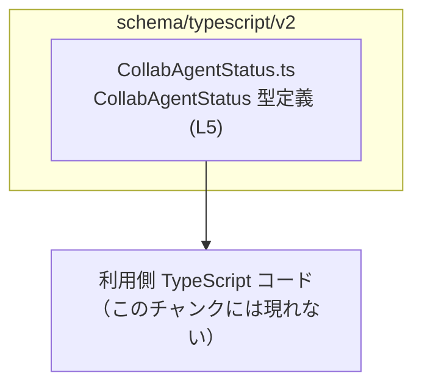
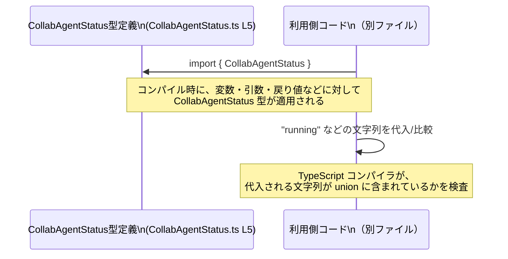

# app-server-protocol/schema/typescript/v2/CollabAgentStatus.ts

## 0. ざっくり一言

`CollabAgentStatus` は、コラボレーション用エージェント（名前からの推測）の状態を表す **文字列リテラルの union 型** を定義する、自動生成された TypeScript スキーマファイルです。[CollabAgentStatus.ts:L5-5]

---

## 1. このモジュールの役割

### 1.1 概要

- このモジュールは、`CollabAgentStatus` という型エイリアスを通じて、許可されるステータス文字列を列挙します。[CollabAgentStatus.ts:L5-5]
- コメントにより、Rust から TypeScript 型を生成するツール `ts-rs` によって自動生成されたことが明示されています。[CollabAgentStatus.ts:L1-3]
- これにより、他の TypeScript コードから、状態を型安全に扱うための共通型として利用される位置づけになっています。

### 1.2 アーキテクチャ内での位置づけ

このチャンクで確認できるのは「型定義単体」のみであり、実際にどのモジュールから参照されるかは分かりません。ただし、ファイルパスとコメントから、次のような関係が読み取れます（利用側は抽象的に表現します）。



- `CollabAgentStatus.ts` はスキーマ定義層に属し、実行ロジックではなく **データモデル** を提供していると解釈できます。
- Rust 側の型定義から `ts-rs` によって同期されているため、Rust と TypeScript 間で状態値の不整合を防ぐ目的があると考えられますが、Rust 側のコードはこのチャンクには現れません。

### 1.3 設計上のポイント

コードから読み取れる特徴は次のとおりです。

- **自動生成コード**  
  - 「手動で編集してはいけない」旨がコメントで明示されています。[CollabAgentStatus.ts:L1-3]  
  - 人手による変更ではなく、元の Rust 定義を更新して再生成する運用が前提になります。
- **状態の表現に string literal union を使用**  
  - `export type CollabAgentStatus = "pendingInit" | "running" | ...` のように、列挙された文字列以外をコンパイル時に排除します。[CollabAgentStatus.ts:L5-5]
- **ステートレス・ロジックレス**  
  - 関数やクラス、変数の実装はなく、実行時のロジックや状態は一切持ちません。型情報のみを提供します。

---

## 2. 主要な機能一覧（コンポーネントインベントリー）

このファイルには 1 つの公開コンポーネント（型定義）のみが存在します。

| 名前                | 種別                     | 役割 / 用途                                                                                 | 定義箇所                        |
|---------------------|--------------------------|----------------------------------------------------------------------------------------------|---------------------------------|
| `CollabAgentStatus` | 型エイリアス（union 型） | コラボレーションエージェントの状態を表す、許可された文字列リテラルの集合を定義するための型 | `CollabAgentStatus.ts:L5-5`     |

列挙されている文字列は以下です。[CollabAgentStatus.ts:L5-5]

- `"pendingInit"`
- `"running"`
- `"interrupted"`
- `"completed"`
- `"errored"`
- `"shutdown"`
- `"notFound"`

これら以外の文字列は、`CollabAgentStatus` 型には代入できません（コンパイル時エラーになります）。

---

## 3. 公開 API と詳細解説

### 3.1 型一覧（構造体・列挙体など）

上記 2. の表が、このファイルにおける公開 API 一覧です。クラスやインターフェース、列挙体などは定義されていません。

### 3.2 関数詳細

このファイルには関数やメソッドは定義されていません。[CollabAgentStatus.ts:L1-5]  
したがって、関数詳細テンプレートに基づく解説対象はありません。

### 3.3 その他の関数

- 補助関数・ラッパー関数も存在しません。[CollabAgentStatus.ts:L1-5]

---

## 4. データフロー

### 4.1 概念的なデータフロー

このファイルは型定義だけなので、実行時の処理フローは持っていません。  
代わりに、「型としてどのように使われるか」というコンパイル時のデータフローを示します。



- このチャンクには、`CollabAgentStatus` を **実際に使用するコード** は含まれていません。
- したがって、「どの関数からどの関数に渡るか」といった呼び出しフローは不明です。

---

## 5. 使い方（How to Use）

### 5.1 基本的な使用方法

`CollabAgentStatus` を関数の引数やオブジェクトのプロパティとして用いることで、ステータスの取りうる値を限定できます。

```typescript
// CollabAgentStatus 型をインポートする（相対パスはプロジェクト構成に依存）   // 型エイリアスを利用側ファイルに取り込む
import type { CollabAgentStatus } from "./CollabAgentStatus";                      // このチャンクにはインポート元は現れない

// ステータスを受け取って処理する関数                                                 // CollabAgentStatus 型を引数に指定
function handleStatus(status: CollabAgentStatus): void {                           // status には union に含まれる文字列だけが渡せる
    if (status === "running") {                                                   // "running" の場合の処理
        console.log("エージェントは実行中です");                                   
    } else if (status === "completed") {                                          // "completed" の場合の処理
        console.log("エージェントは完了済みです");
    } else if (status === "errored") {                                            // "errored" の場合の処理
        console.error("エージェントでエラーが発生しました");
    }
    // 他のステータス ("pendingInit" / "interrupted" / "shutdown" / "notFound") も必要に応じて分岐可能
}

// 正しい使用例                                                                      // union に含まれる文字列は OK
handleStatus("running");                                                           // コンパイル成功

// 誤った使用例                                                                      // union に含まれない文字列は型エラー
// handleStatus("unknown");                                                        // エラー: 型 '"unknown"' を 'CollabAgentStatus' に割り当てできない
```

このように、**TypeScript の型システム**により、誤ったステータス文字列の使用がコンパイル段階で検出されます。

### 5.2 よくある使用パターン

1. **オブジェクトの状態フィールドとして使用する**

```typescript
import type { CollabAgentStatus } from "./CollabAgentStatus";                     // 型をインポート

// エージェント情報を表すインターフェース                                             // 状態フィールドに CollabAgentStatus を利用
interface CollabAgent {                                                           
    id: string;                                                                   // 一意な ID
    status: CollabAgentStatus;                                                    // 状態: union 型で制約
}

// 状態を更新する関数                                                                  // status 引数にも同じ型を利用
function updateAgentStatus(agent: CollabAgent, status: CollabAgentStatus): CollabAgent {
    return { ...agent, status };                                                  // 新しい状態でオブジェクトを返す
}
```

1. **API レスポンスの型として使用する**

このチャンクには具体的な API 定義はありませんが、一般的には以下のようにレスポンス型の一部として組み込むことができます。

```typescript
import type { CollabAgentStatus } from "./CollabAgentStatus";                     // 状態型を利用

interface AgentStatusResponse {                                                   // API レスポンスを表す型の例
    agentId: string;                                                              // エージェント ID
    status: CollabAgentStatus;                                                    // 状態
    updatedAt: string;                                                            // 更新時刻 (ISO 文字列など)
}
```

### 5.3 よくある間違い

**誤用例: 任意の文字列を許容してしまう**

```typescript
// 間違い: status を string 型のままにしている                                      // どんな文字列でも代入できてしまう
interface BadAgent {
    id: string;
    status: string;                                                               // "runing" などの typo も許容されてしまう
}
```

**正しい例: `CollabAgentStatus` を使用して制約する**

```typescript
import type { CollabAgentStatus } from "./CollabAgentStatus";                     // union 型をインポート

interface GoodAgent {
    id: string;
    status: CollabAgentStatus;                                                    // 許可された文字列以外はコンパイルエラー
}
```

### 5.4 使用上の注意点（まとめ）

- `CollabAgentStatus` は **コンパイル時の型制約** であり、実行時に自動でバリデーションを行うわけではありません。  
  外部入力（HTTP リクエスト・WebSocket 等）に対しては、別途ランタイムの検証が必要です。
- 自動生成ファイルであるため、**直接編集すると元の Rust 定義との不整合** が発生する可能性があります。[CollabAgentStatus.ts:L1-3]  
  変更が必要な場合は、元の Rust 側の型を更新してから `ts-rs` による再生成を行う必要があります。

---

## 6. 変更の仕方（How to Modify）

### 6.1 新しい機能（ステータス）を追加する場合

このチャンクから分かる変更パターンは、「状態の種類を増やす・減らす・名称を変える」といった **union のメンバー編集** に限られます。

- 自動生成ファイルなので、通常は **手動で union を編集すべきではありません**。[CollabAgentStatus.ts:L1-3]
- 新しいステータス（例: `"paused"`）を追加したい場合の正しい手順は、一般に次のようになります（Rust 側は推測であり、このチャンクからは見えません）。
  1. Rust 側の対応する型定義に新しいバリアントを追加する（このチャンクには現れないため詳細は不明）。
  2. `ts-rs` のコード生成を再実行し、このファイルを再生成する。
- こうして union に新しい文字列が追加されると、TypeScript 側では:
  - それを使用するコードで `switch` 文や `if` による分岐を実装している場合、**新しいステータスに対する処理を追加し忘れる**可能性があります。
  - TypeScript は string union に対して網羅性チェックを自動では行わないため、`never` チェックなどで不足がないかを明示的に確認する運用が望ましいです（一般論）。

### 6.2 既存の機能を変更する場合

1. **ステータス名を変更する場合**

   - 例: `"pendingInit"` を `"initializing"` に変更するなど。
   - これも自動生成ファイルを直接書き換えるのではなく、元の Rust 定義を変更して再生成する必要があります。[CollabAgentStatus.ts:L1-3]
   - 名前変更後、TypeScript コード中で旧文字列に依存している箇所はコンパイルエラーになり、そこをすべて修正する必要があります。

2. **ステータスを削除する場合**

   - union から文字列が削除されると、そのステータスを使っているすべての箇所でコンパイルエラーが発生し、削除ミスを検出しやすくなります。
   - ただし、実行環境や API でまだ古い値が送受信される可能性がある場合は、ランタイム側の互換性にも注意する必要があります（このチャンクからは外部とのプロトコルは不明）。

---

## 7. 関連ファイル

このチャンクには `CollabAgentStatus.ts` 以外のファイル内容は含まれていません。そのため、実際にどのファイルと直接関連しているかは分かりません。

推測できる範囲を「推測」と明記して整理します。

| パス / 種別                            | 役割 / 関係                                                                 | 根拠 |
|----------------------------------------|-----------------------------------------------------------------------------|------|
| Rust 側の型定義ファイル（推測）       | `ts-rs` によってこの TypeScript 型が生成される元の定義。具体的なパスは不明 | `ts-rs` により生成とのコメント [CollabAgentStatus.ts:L3-3] |
| `schema/typescript/v2` 配下の他ファイル（推測） | 他のスキーマ定義 (`*.ts`) が存在し、同様に Rust から生成されている可能性 | ディレクトリ名からの推測。コード自体には現れない |

このファイル単体からは、テストコードやユーティリティとの直接の関係は読み取れません。

---

## 付録: Bugs / Security / Contracts / Tests / 性能 などの観点

このファイルは 1 行の型定義のみを含むため、各観点は次のように整理できます。

- **Bugs（バグの可能性）**
  - 実行時ロジックがないため、この型定義単体でランタイムバグを発生させることはありません。
  - ただし、**実際の値がこの union と一致しているという前提が外部入力で崩れた場合**、型定義と実際のデータが乖離するリスクはあります（TypeScript 全般の注意点）。

- **Security（セキュリティ）**
  - 型定義自体はセキュリティリスクを直接持ちません。
  - 外部からの入力値を `CollabAgentStatus` として扱う場合は、実行時に値を検証しないと、不正値によるロジック分岐漏れなどが発生する可能性があります。

- **Contracts / Edge Cases（契約 / エッジケース）**
  - 契約: `CollabAgentStatus` 型の変数に代入できるのは、列挙された 7 種類の文字列のみです。[CollabAgentStatus.ts:L5-5]
  - エッジケース: 空文字列 `""` や `null` / `undefined` / それ以外の文字列は、コンパイル時点で排除される（適切に型が付けられていれば）という点が、主な仕様になります。

- **Tests（テスト）**
  - このファイルにはテストコードは含まれていません。
  - 型定義に対するテストは通常、実際の利用コード（関数・クラス）側で、型チェックや型に依存した挙動を検証する形になります。

- **Performance / Scalability（性能 / スケーラビリティ）**
  - コンパイル時のみの型定義であり、実行時性能への影響は事実上ありません。
  - union のメンバー数が増加しても、通常の範囲では性能問題になることはほとんどありません。

- **Observability（観測性）**
  - ログ出力やメトリクス等は一切含まれていません。
  - 観測性は、この型を利用する実行ロジック側で設計されることになります。

以上が、このチャンク（`CollabAgentStatus.ts`）から読み取れる範囲での、公開 API とコアロジック（実際には型レベルの契約）の整理です。
