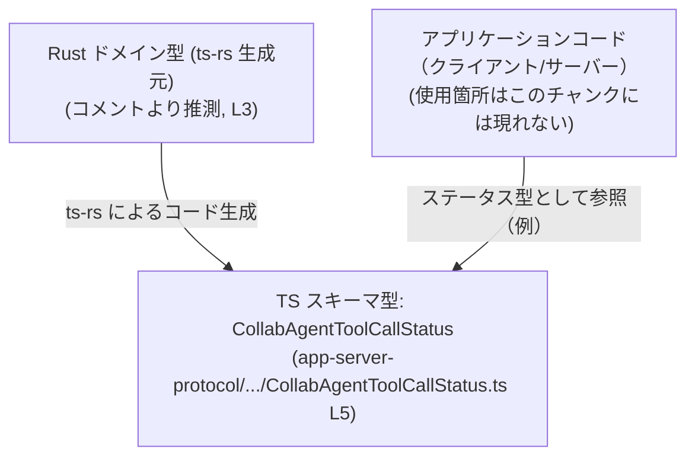
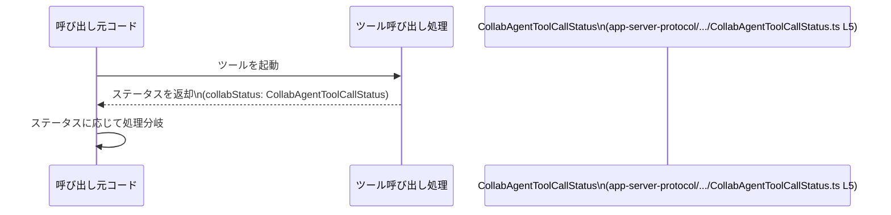

# app-server-protocol/schema/typescript/v2/CollabAgentToolCallStatus.ts コード解説

## 0. ざっくり一言

`CollabAgentToolCallStatus` は、コラボレーションエージェントのツール呼び出し状態を `"inProgress" | "completed" | "failed"` の3種類の文字列で表現するための、**文字列リテラル・ユニオン型**です。  
このファイルは ts-rs により自動生成されています（編集禁止）  
（`app-server-protocol\schema\typescript\v2\CollabAgentToolCallStatus.ts:L1-3, L5-5`）。

---

## 1. このモジュールの役割

### 1.1 概要

- このモジュールは、**ツール呼び出しの状態（ステータス）を型安全に表現するための共通型**を提供します。
- ステータスは `"inProgress"`, `"completed"`, `"failed"` のいずれかに制限されます  
  （`app-server-protocol\schema\typescript\v2\CollabAgentToolCallStatus.ts:L5-5`）。
- コメントから、このファイルは Rust の型定義から ts-rs により自動生成された TypeScript スキーマの一部であると分かります  
  （`app-server-protocol\schema\typescript\v2\CollabAgentToolCallStatus.ts:L1-3`）。

### 1.2 アーキテクチャ内での位置づけ

このチャンクには他モジュールとの直接の依存関係は現れていません。  
ファイルパスとコメントから、**アプリケーションサーバープロトコル v2 の TypeScript スキーマ定義群の一部**として位置づけられていると解釈できます  
（`app-server-protocol\schema\typescript\v2\CollabAgentToolCallStatus.ts:L1-3`）。

以下は、一般的な位置づけイメージを示す図です（実際の依存関係はこのチャンクからは不明であり、あくまで典型例です）。



### 1.3 設計上のポイント

コードから読み取れる設計上の特徴は次のとおりです。

- **自動生成コード**  
  - ファイル先頭に「GENERATED CODE」「Do not edit manually」のコメントがあり、手動編集禁止であることが明示されています  
    （`app-server-protocol\schema\typescript\v2\CollabAgentToolCallStatus.ts:L1-3`）。
- **状態表現の文字列リテラル・ユニオン型**  
  - `CollabAgentToolCallStatus` は 3 つの文字列リテラルのユニオン型として定義されています  
    （`app-server-protocol\schema\typescript\v2\CollabAgentToolCallStatus.ts:L5-5`）。
- **状態管理ロジックは持たない**  
  - 関数やクラスは一切定義されておらず、純粋に「型の定義」だけを提供しています。
- **エラーハンドリングや並行処理は持たない**  
  - 実行時の処理や I/O を行うコードが無いため、このファイル単体としてはエラー処理・並行性の要素は存在しません。

---

## 2. 主要な機能一覧

このモジュールが提供する主要な機能は 1 つです。

- `CollabAgentToolCallStatus` 型定義:  
  ツール呼び出しの状態を `"inProgress" | "completed" | "failed"` のいずれかに制約する文字列リテラル・ユニオン型。

---

## 3. 公開 API と詳細解説

### 3.1 型一覧（構造体・列挙体など）

このファイルで公開されている型は 1 つです。

| 名前                       | 種別                         | 役割 / 用途                                                                 | 定義位置 |
|----------------------------|------------------------------|------------------------------------------------------------------------------|----------|
| `CollabAgentToolCallStatus` | 文字列リテラル・ユニオン型 | ツール呼び出し状態を 3 種類の文字列のいずれかに制限して表現する共通ステータス型 | `app-server-protocol\schema\typescript\v2\CollabAgentToolCallStatus.ts:L5-5` |

定義内容（抜粋）:

```typescript
export type CollabAgentToolCallStatus = "inProgress" | "completed" | "failed";
//                                               ^^^^^^^^^^^^^^^^^^^^^^^^^^^^^
//                              3つの文字列リテラルのユニオン
```

#### 型の意味と性質

- コンパイル時の型安全性:
  - 変数やプロパティを `CollabAgentToolCallStatus` 型にすると、上記 3 つ以外の文字列リテラルはコンパイルエラーになります。
- 実行時の挙動:
  - TypeScript の型はコンパイル時にのみ存在するため、実行時には単なる `string` として扱われます。
  - そのため、外部入力からの値に対しては、別途実行時チェックが必要です（型定義だけでは防げません）。
- 状態の意味:
  - 名称から、ツール呼び出しの「進行中」「完了」「失敗」を表していると解釈できますが、
    具体的な遷移ルールや利用タイミングはこのチャンクからは分かりません。

**Edge cases（エッジケース）**

この型に関連する典型的なエッジケースは次の通りです。

- 型外の文字列:
  - `"unknown"` のようなステータスを `CollabAgentToolCallStatus` 型の変数に代入するとコンパイルエラーになります（型安全性の恩恵）。
- 外部入力との不整合:
  - 外部から `"IN_PROGRESS"` のように表記揺れした値が来た場合、実行時には `string` として受け取れてしまうため、
    TypeScript 型だけでは検出できません。実行時のバリデーションが必要になります。

**使用上の注意点**

- 実行時チェックは別途行う必要があります。
- 自動生成ファイルであるため、**手動で文字列を追加・変更すると、次回生成時に上書きされる**点に注意が必要です  
  （`app-server-protocol\schema\typescript\v2\CollabAgentToolCallStatus.ts:L1-3`）。

### 3.2 関数詳細（最大 7 件）

このファイルには関数・メソッドは定義されていません（ステータス型の定義のみ）  
（`app-server-protocol\schema\typescript\v2\CollabAgentToolCallStatus.ts:L1-5`）。

### 3.3 その他の関数

- なし（補助関数やラッパー関数も存在しません）。

---

## 4. データフロー

このファイル単体には処理ロジックが無いため、実際の呼び出し関係はこのチャンクからは分かりません。  
ここでは、**`CollabAgentToolCallStatus` を用いた典型的な利用イメージ**として、ツール呼び出し処理とのやり取りを示します（仮想例）。



要点:

- `Tool`（ツール呼び出し処理）が `"inProgress" | "completed" | "failed"` のいずれかを選択し、`CollabAgentToolCallStatus` 型として返す。
- 呼び出し元は `CollabAgentToolCallStatus` 型により、ステータス値が 3 種類に限定される前提で `switch` などの分岐を書けます。
- この図は一般的な使用イメージであり、実際の関数名やモジュール構成はこのチャンクからは分かりません。

---

## 5. 使い方（How to Use）

### 5.1 基本的な使用方法

最も基本的な使い方は、変数・プロパティ・関数の引数/戻り値にこの型を付けることです。

```typescript
// CollabAgentToolCallStatus 型をインポートする
import type { CollabAgentToolCallStatus } from "./CollabAgentToolCallStatus"; // 相対パスは使用側プロジェクト構成による

// 変数に型を付けて利用する例
let status: CollabAgentToolCallStatus = "inProgress"; // OK: 許可されたリテラル
status = "completed";                                  // OK
// status = "unknown";                                 // コンパイルエラー: 型 '"unknown"' を割り当て不可
```

- 型アノテーションにより、誤ったステータス文字列の代入がコンパイル時に検出されます。
- IDE で補完が効くため、タイポの防止にも役立ちます。

### 5.2 よくある使用パターン

#### パターン1: 関数の引数・戻り値として使う

```typescript
import type { CollabAgentToolCallStatus } from "./CollabAgentToolCallStatus";

// ツールの状態を更新する処理の例
function updateStatus(newStatus: CollabAgentToolCallStatus): void {  // 引数に型を付ける
    switch (newStatus) {
        case "inProgress":
            // 進行中の処理
            break;
        case "completed":
            // 完了時の処理
            break;
        case "failed":
            // 失敗時の処理
            break;
        // default 分は不要: 全ケースを網羅しているため
    }
}

// 状態を返す関数の例
function getCurrentStatus(): CollabAgentToolCallStatus {              // 戻り値に型を付ける
    return "inProgress"; // 3 つのいずれかを返す
}
```

- `switch` 文で全ケースを明示的に扱えるため、分岐漏れを防ぎやすくなります。

#### パターン2: オブジェクトのプロパティとして使う

```typescript
import type { CollabAgentToolCallStatus } from "./CollabAgentToolCallStatus";

interface ToolCall {
    id: string;
    status: CollabAgentToolCallStatus;   // プロパティの型として利用
}

const call: ToolCall = {
    id: "call-1",
    status: "completed",                // OK
    // status: "done",                  // コンパイルエラー
};
```

- 複数のツール呼び出し情報を扱う場合などに、構造体の一部として利用する形が典型的です。

### 5.3 よくある間違い

このファイル自体に実装はありませんが、型の利用時に起こりがちな誤用を示します。

```typescript
import type { CollabAgentToolCallStatus } from "./CollabAgentToolCallStatus";

// 間違い例: string 型を使ってしまう
function handleStatusBad(status: string) {               // 型が緩すぎる
    if (status === "inProgress") {
        // ...
    }
    // "completed" / "failed" を書き忘れてもコンパイルで気づきにくい
}

// 正しい例: CollabAgentToolCallStatus を使う
function handleStatusGood(status: CollabAgentToolCallStatus) {
    switch (status) {
        case "inProgress":
        case "completed":
        case "failed":
            // 全てのケースを網羅
            break;
    }
}
```

- `string` を使うと、誤った文字列も通ってしまうため、型安全性が落ちます。
- `CollabAgentToolCallStatus` を利用することで、**値の種類を限定し、分岐も網羅的に書ける**ようになります。

### 5.4 使用上の注意点（まとめ）

- **実行時バリデーションは別途必要**  
  - TypeScript の型はコンパイル時のみ有効です。外部（ネットワーク・ストレージ等）から受け取る値は、
    実行時に `"inProgress" | "completed" | "failed"` のいずれかであることをチェックする必要があります。
- **自動生成ファイルの直接編集は禁止**  
  - コメントに明記されている通り、このファイルは ts-rs により生成されており、手動で編集すべきではありません  
    （`app-server-protocol\schema\typescript\v2\CollabAgentToolCallStatus.ts:L1-3`）。
- **ステータス値の追加・変更は生成元で行う**  
  - 新しい状態を追加したい場合は、このファイルではなく、ts-rs が参照する **Rust 側の型定義**を変更し、再生成するのが前提となります（Rust 側の具体的なファイルパスはこのチャンクからは不明です）。

---

## 6. 変更の仕方（How to Modify）

### 6.1 新しい機能を追加する場合

このファイルは自動生成されるため、通常の開発フローでは**直接の変更は行いません**。  
新しいステータス値を追加する場合の一般的な手順は次のようになります（ts-rs の一般的な利用形態に基づく説明であり、具体的なファイル構成はこのチャンクからは不明です）。

1. **Rust 側の型定義を変更する**  
   - 対応する Rust の enum もしくは型に、新しいバリアント（例: `Cancelled` など）を追加する。
   - この点は、コメントで「ts-rs による生成」とあることから推測されます  
     （`app-server-protocol\schema\typescript\v2\CollabAgentToolCallStatus.ts:L3-3`）。
2. **ts-rs によるコード生成を再実行する**  
   - ビルドスクリプトや専用コマンドを通じて、TypeScript スキーマの再生成を行う。
3. **生成された TypeScript 側の変更を確認する**  
   - `CollabAgentToolCallStatus` に新しい文字列リテラルが追加されていることを確認する  
     （例: `"cancelled"` など）。
4. **呼び出し側コードを更新する**  
   - 新しいステータスに対して `switch` の分岐を追加するなど、利用側のロジックを対応させる。

### 6.2 既存の機能を変更する場合

既存の 3 種類のステータス文字列を変更・削除する場合も、基本方針は同じです。

- 影響範囲の確認:
  - `CollabAgentToolCallStatus` を利用している全ての箇所（関数の引数、戻り値、プロパティなど）に影響します。
  - どこでこの型が使われているかは、このチャンクには現れないため、プロジェクト全体で検索して確認する必要があります。
- 前提条件・契約:
  - 現状の契約は「`"inProgress" | "completed" | "failed"` のいずれか」であることです  
    （`app-server-protocol\schema\typescript\v2\CollabAgentToolCallStatus.ts:L5-5`）。
  - 文字列そのものを変更すると、外部 API の互換性にも影響しうるため、プロトコル仕様との整合を取る必要があります。
- テストの観点:
  - ステータスに依存する分岐ロジックのテストがある場合、新しい状態の追加や既存状態の名前変更に伴い、テストケースの更新が必要です。

---

## 7. 関連ファイル

このチャンクには具体的な関連ファイルのパスは出てきませんが、コメントとファイルパスから推測できる関係性を整理します（存在自体は一般的な ts-rs 利用形態からの推測であり、実際のパス・名前はこのチャンクからは分かりません）。

| パス / 種別 | 役割 / 関係 |
|-------------|------------|
| `app-server-protocol/schema/typescript/v2/` 以下の他ファイル | 同じ v2 プロトコルに属する他の TypeScript スキーマ型定義群と考えられますが、具体的なファイル名・内容はこのチャンクには現れません。 |
| Rust 側の対応する型定義（パス不明） | コメントにある ts-rs 生成元として、`CollabAgentToolCallStatus` に対応する Rust の型（おそらく enum など）が存在すると考えられますが、どのファイルにあるかはこのチャンクからは分かりません（`app-server-protocol\schema\typescript\v2\CollabAgentToolCallStatus.ts:L3-3`）。 |

---

### まとめ

- `CollabAgentToolCallStatus` は、ツール呼び出しステータスを 3 種類の文字列に限定するための **型安全なユニオン型** です  
  （`app-server-protocol\schema\typescript\v2\CollabAgentToolCallStatus.ts:L5-5`）。
- このファイルは ts-rs により自動生成されており、**手動編集は想定されていません**  
  （`app-server-protocol\schema\typescript\v2\CollabAgentToolCallStatus.ts:L1-3`）。
- 実行時のエラー処理や並行性の要素は持たず、他のモジュールからの利用を前提とした **型定義専用ファイル** となっています。
