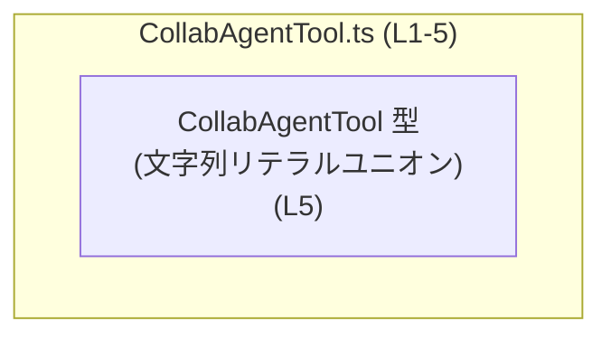
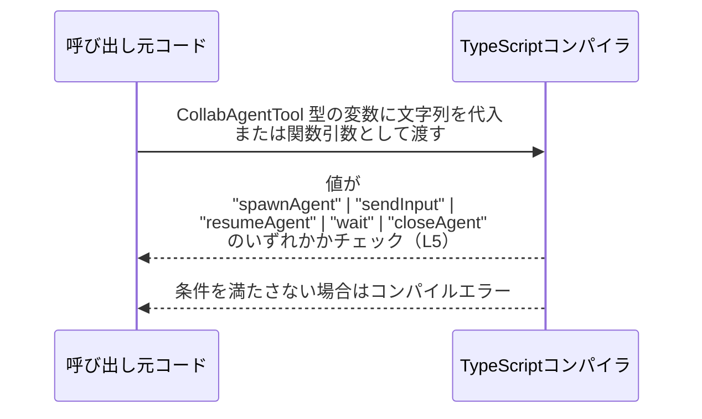

# app-server-protocol\schema\typescript\v2\CollabAgentTool.ts

## 0. ざっくり一言

このファイルは、`CollabAgentTool` という TypeScript の文字列リテラルユニオン型を定義する、自動生成された型定義ファイルです（`ts-rs` により生成、L1–3・L5）。

---

## 1. このモジュールの役割

### 1.1 概要

- このモジュールは、`CollabAgentTool` 型として **5 種類の文字列リテラル** のいずれかだけを許可する型を提供します（L5）。
- 実行時の関数やロジックは含まず、**コンパイル時の型チェック専用**の定義です（L5）。

```ts
export type CollabAgentTool =
  | "spawnAgent"
  | "sendInput"
  | "resumeAgent"
  | "wait"
  | "closeAgent"; // CollabAgentTool.ts:L5-5
```

### 1.2 アーキテクチャ内での位置づけ

- ファイル先頭コメントから、このファイルは **`ts-rs` による自動生成物** であり、Rust 側の定義から生成されていることが分かります（L1–3）。
- この TypeScript ファイル自体には `import` は存在せず（L1–5）、他モジュールへの依存は持ちません。
- 一方で `export type` によって `CollabAgentTool` を公開しているため（L5）、**他の TypeScript コードから参照される前提の「スキーマ定義」的な役割**を担っていると判断できます（役割はコード構造からの解釈）。



※ `CollabAgentTool` を実際にどのモジュールが使っているかは、このチャンクには現れません。

### 1.3 設計上のポイント

- **自動生成コード**  
  - 「GENERATED CODE」「Do not edit this file manually」と明示されており（L1, L3）、人手での編集を前提としていません。
- **文字列リテラルユニオン型での列挙**  
  - `enum` ではなく `type ... = "a" | "b" ...` という形式で列挙しているため、**実行時 JavaScript には一切コードを生成せず、型情報だけを提供**します（TypeScript の仕様による一般的な性質・定義自体は L5）。
- **状態や関数を持たない**  
  - クラス・インターフェース・関数の定義はなく（L1–5）、副作用や実行時の挙動は一切含みません。

---

## 2. 主要な機能一覧

このモジュールが提供する機能は 1 つだけです。

- `CollabAgentTool` 型:  
  - `"spawnAgent" | "sendInput" | "resumeAgent" | "wait" | "closeAgent"` のいずれかに限定された文字列型を提供します（L5）。

---

## 3. 公開 API と詳細解説

### 3.1 型一覧（構造体・列挙体など）

| 名前               | 種別                               | 役割 / 用途                                                                                         | 定義位置                         | 許可される値                                                                                                   |
|--------------------|------------------------------------|------------------------------------------------------------------------------------------------------|----------------------------------|----------------------------------------------------------------------------------------------------------------|
| `CollabAgentTool` | 型エイリアス（文字列リテラルユニオン） | 5 種類の文字列リテラルのいずれかだけを取る型。文字列をこの 5 パターンに制約するための型定義です。 | `CollabAgentTool.ts:L5-5` | `"spawnAgent"`, `"sendInput"`, `"resumeAgent"`, `"wait"`, `"closeAgent"`（すべて L5 に列挙） |

> 事実レベルでは「5 つの文字列を列挙した型」であることだけがコードから読み取れます（L5）。
> それぞれの文字列がアプリケーション内で何を意味するか（具体的な動き・プロトコル上の意味）は、このチャンクからは分かりません。

#### 型としての契約とエッジケース

- 契約（Contract）
  - **コンパイル時**において、`CollabAgentTool` 型の変数・引数・プロパティは、5 つの文字列のいずれかでなければなりません（L5）。
  - それ以外の文字列を代入しようとすると、TypeScript コンパイラがエラーにします。
- エッジケース
  - `""`（空文字列）や `"spawnagent"`（大文字小文字が違う）などは **許可されません**。
  - `string` 型のまま扱う場合と違い、「スペルミス」「値の取りうる範囲を広く取りすぎる」といったミスをコンパイル時に検出できます。
- 実行時の注意
  - この型定義自体には実行時チェックがないため、JSON などの外部入力を `CollabAgentTool` にキャストする場合は、**実行時検証を別途実装する必要**があります（一般的な TypeScript の性質）。

#### バグ / セキュリティ観点（この型に関して）

- このファイル単体には実行時ロジックがないため、直接的なバグやセキュリティホールは含まれていません（L1–5）。
- ただし、**型と実装が乖離している場合**（例: バックエンド側が `"pauseAgent"` も受け付けるが、この型に含まれていない）には、型定義が誤った安心感を与える可能性があります。  
  → その場合は、生成元となる Rust 側の定義を確認し、整合性を保つ必要があります（生成元はこのチャンクには現れませんが、L3 のコメントから Rust 側に存在すると分かります）。

### 3.2 関数詳細（最大 7 件）

このファイルには関数定義が存在しません（`export type` のみ、L5）。  
そのため、関数の詳細テンプレートに沿って説明すべき対象はありません。

### 3.3 その他の関数

- なし（このチャンクには関数・メソッド・クラスは現れません、L1–5）。

---

## 4. データフロー

このファイルには実行時処理はありませんが、**型チェックという観点での「データ（文字列）の流れ」**を整理します。

### 4.1 型チェック上のフロー（概念図）



説明:

1. アプリケーションコード側で、`CollabAgentTool` 型の変数や引数を宣言します。
2. 何らかの文字列を代入したとき、TypeScript コンパイラが **その文字列が 5 種類のいずれかに一致するか** を静的にチェックします（L5）。
3. 一致しない場合はコンパイルエラーとなり、実行バイナリ（JavaScript）は生成されません。

※ 実行時に外部入力から文字列を受け取る部分や、その文字列をどのように `CollabAgentTool` として扱うかは、このファイルには現れません。

---

## 5. 使い方（How to Use）

### 5.1 基本的な使用方法

`CollabAgentTool` 型を使うことで、**操作名を表す文字列を 5 パターンに限定**できます。

```ts
// CollabAgentTool.ts と同じディレクトリにある別ファイルからの利用例
import type { CollabAgentTool } from "./CollabAgentTool"; // export type に対応するインポート

// CollabAgentTool 型の変数を宣言する
const tool: CollabAgentTool = "spawnAgent"; // OK: L5 で定義された値のひとつ

// 以下はコンパイルエラー（型チェックで弾かれる例）
// const invalidTool: CollabAgentTool = "spawnagent"; // エラー: "spawnagent" は L5 に定義されていない
// const anotherInvalid: CollabAgentTool = "unknown";  // エラー: 定義外の文字列
```

ポイント:

- `CollabAgentTool` 型を付けることで、IDE の補完やコンパイルエラーにより、**スペルミスや未定義の操作名を防止**できます。
- `import type` を使うと、型情報だけをインポートし、バンドルや実行時コードに影響を与えません（このファイルは型のみのため、挙動としても一致します）。

### 5.2 よくある使用パターン

#### パターン1: 関数の引数として使う

```ts
import type { CollabAgentTool } from "./CollabAgentTool";

// CollabAgentTool を引数に取る関数
function handleTool(tool: CollabAgentTool) {
    switch (tool) {
        case "spawnAgent":
            // 新しいエージェントを開始する処理を書くことが想定される（処理内容はこのファイルからは不明）
            break;
        case "sendInput":
            // エージェントに入力を送る処理など（内容は不明）
            break;
        case "resumeAgent":
            // 一時停止していたエージェントを再開する処理など（内容は不明）
            break;
        case "wait":
            // 待機状態に関する処理など（内容は不明）
            break;
        case "closeAgent":
            // エージェントを終了/クローズする処理など（内容は不明）
            break;
    }
}
```

- `switch` 文で全てのケースを列挙すると、**漏れがあればコンパイラが警告できる**パターンになります（`never` チェックなどを併用するとより厳密になります）。

#### パターン2: オブジェクトのプロパティとして使う

```ts
import type { CollabAgentTool } from "./CollabAgentTool";

interface ToolCommand {
    tool: CollabAgentTool; // 操作種別
    payload: unknown;      // 操作ごとの追加データ（この例では型は任意）
}

const cmd: ToolCommand = {
    tool: "wait",   // OK: CollabAgentTool の許可値
    payload: null,  // 追加データ
};
```

- こうした「コマンドオブジェクト」の形で使うと、**操作名と付随データをセットで扱う**ときにも型安全性を保てます。

### 5.3 よくある間違い

#### 間違い例1: 素の `string` 型のまま扱う

```ts
// 間違い例: string 型のままにしてしまう
function handleToolBad(tool: string) {
    // 任意の文字列が来てしまうため、"sponAgent" などのタイプミスも通ってしまう
}
```

```ts
// 正しい方向性: CollabAgentTool 型を使う
import type { CollabAgentTool } from "./CollabAgentTool";

function handleToolGood(tool: CollabAgentTool) {
    // tool は 5 種類に限定されるため、タイプミスがコンパイル時に検出される
}
```

#### 間違い例2: 型アサーションで無理やり通す

```ts
import type { CollabAgentTool } from "./CollabAgentTool";

const valueFromUser: string = "unknown";

// 間違い例: 実行時チェック無しに as で通してしまう
const badTool = valueFromUser as CollabAgentTool; // コンパイルは通るが、実行時には "unknown" が入る可能性がある
```

- このような `as CollabAgentTool` は **型安全性を失わせる**ため、  
  外部入力に対しては必ず `if` や関数での実行時チェックを行う方が安全です。

### 5.4 使用上の注意点（まとめ）

- このファイルは **自動生成**されており、コメントで「手で編集しないこと」が明示されています（L1, L3）。  
  → 値の追加・変更は、生成元となる Rust 側の定義を変更し、再生成するのが前提です（生成元の場所はこのチャンクには現れません）。
- `CollabAgentTool` は **コンパイル時のみ有効な型情報**であり、実行時のバリデーションは行いません。  
  → 外部入力を扱う場合は、別途ランタイムチェックを実装する必要があります。
- 許可される値は **5 種類に固定**されているため（L5）、新しい値を追加する場合は、**既存コードがその新しい値を扱えるか**を確認する必要があります（`switch` 文や `if` 分岐など）。

---

## 6. 変更の仕方（How to Modify）

### 6.1 新しい機能（値）を追加する場合

このファイルは自動生成であり、「Do not edit this file manually」と書かれているため（L1, L3）、**直接の編集は推奨されません**。

一般的な `ts-rs` 利用パターンから言えること:

1. 生成元の Rust 側で `enum` や `struct` などの定義を変更する。  
   - 具体的な定義やファイルパスは、このチャンクには現れません（不明）。
2. `ts-rs` を用いて TypeScript コードを再生成する。
3. 新たに追加された値に対して、TypeScript 側の利用箇所（`switch` 文など）を更新する。

変更時の注意:

- `CollabAgentTool` に新しい文字列リテラルを追加すると、**既存の `switch` などで未処理のケースが生じうる**ため、利用箇所の見直しが必要です。
- 生成元と TypeScript 側の両方で **値のスペルや意味が一致しているか** を確認する必要があります。

### 6.2 既存の機能（値）を変更する場合

値名を変更したり削除したりするときの注意点:

- `"spawnAgent"` などの文字列を変更すると、**その文字列を使っている全ての TypeScript コードがコンパイルエラー**になります。  
  → 型安全性の観点では望ましいですが、影響範囲が広いため、IDE のリファクタリング機能などで参照箇所を確認する必要があります。
- 値の削除は、バックエンド側のプロトコル／機能にも影響を与えます。  
  → Rust 側の定義と通信仕様の両方を確認・更新する必要があります（ただし具体的なプロトコル仕様はこのチャンクには現れません）。

---

## 7. 関連ファイル

このチャンクから直接参照できる関連ファイル情報は限られていますが、コメント内容から推測できる範囲を事実と推測を分けて整理します。

| パス / 種別                                      | 役割 / 関係                                                                                                      |
|-------------------------------------------------|-------------------------------------------------------------------------------------------------------------------|
| （不明）ts-rs 生成元の Rust ファイル           | コメント `This file was generated by [ts-rs]` から、この TypeScript 型に対応する Rust 定義が存在すると分かります（L3）。ただし、このチャンクにはそのパスやファイル名は現れません。 |
| app-server-protocol\\schema\\typescript\\v2\\… | このファイルのディレクトリ構成から、同じディレクトリに他の v2 スキーマ定義が存在する可能性はありますが、具体的なファイル名はこのチャンクには現れません。 |

---

## コンポーネントインベントリー（このチャンクのまとめ）

| 種別 | 名前             | 説明                                                                                     | 根拠行 |
|------|------------------|------------------------------------------------------------------------------------------|--------|
| 型   | `CollabAgentTool` | 5 種類の文字列リテラル（"spawnAgent" 等）のユニオン型として定義された公開型エイリアス。 | `CollabAgentTool.ts:L5-5` |
| コメント | 自動生成メタ情報 | このファイルが `ts-rs` により生成され、手動編集が禁止されていることを示すメタ情報。         | `CollabAgentTool.ts:L1-3` |

このチャンクには、関数・クラス・インターフェース・実行時ロジックは登場しません。
