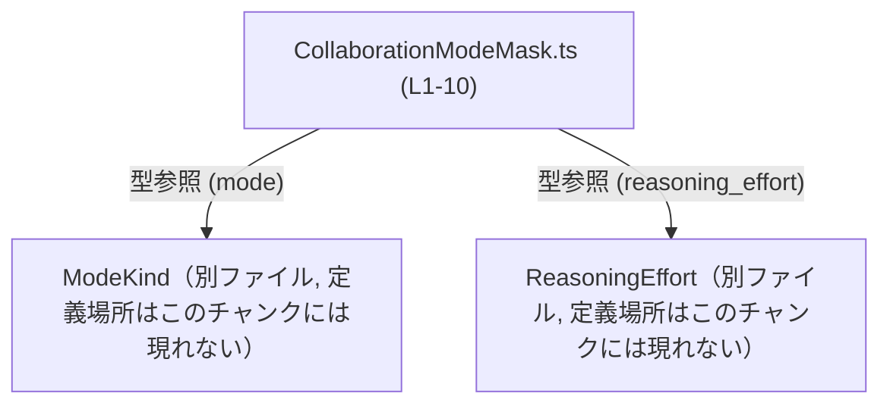
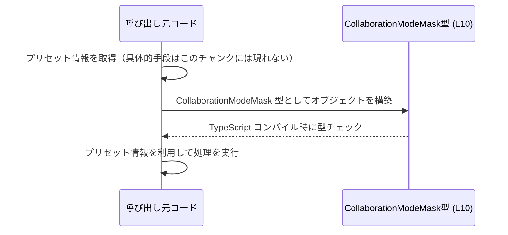

# app-server-protocol/schema/typescript/v2/CollaborationModeMask.ts コード解説

## 0. ざっくり一言

クライアント向けの「コラボレーションモードのプリセット」のメタデータを表す **`CollaborationModeMask` 型（オブジェクト型エイリアス）** を 1 つだけ定義した、自動生成の TypeScript スキーマファイルです。  
（コメントと型定義に基づく説明です。`CollaborationModeMask.ts:L1-3,L7-10`）

---

## 1. このモジュールの役割

### 1.1 概要

- このモジュールは、**「collaboration mode preset metadata for clients」** を表現するための型 `CollaborationModeMask` を提供します（JSDoc コメントより）。`CollaborationModeMask.ts:L7-9`
- 型は 4 つのプロパティ（`name`, `mode`, `model`, `reasoning_effort`）から成るオブジェクト型として定義されています。`CollaborationModeMask.ts:L10-10`
- 実行時処理（関数やクラス）は含まれず、あくまで **型レベルの契約** を提供するモジュールです。`CollaborationModeMask.ts:L4-5,L10`

### 1.2 アーキテクチャ内での位置づけ

- このファイルは `schema/typescript/v2` 配下にあり、アプリケーションサーバプロトコルの **TypeScript スキーマ定義群の 1 ファイル** と位置づけられます（パス名から読み取れる範囲の説明です）。
- 型 `CollaborationModeMask` は、他ファイルで定義された `ModeKind` と `ReasoningEffort` に依存していますが、どちらも `import type` による **型専用インポート** であり、ランタイム依存はありません。`CollaborationModeMask.ts:L4-5`

依存関係の概略を以下に示します（この図は、このチャンクのコード範囲に基づく構造イメージです）。



### 1.3 設計上のポイント

- **自動生成ファイルであることの明示**  
  - 冒頭コメントで「GENERATED CODE」「Do not edit this file manually」と明記されています。`CollaborationModeMask.ts:L1-3`  
  - 生成元ツールとして `ts-rs`（Rust から TypeScript 型を生成するツール）が示されていますが、このファイルからは生成元の具体的な型やロジックは分かりません。`CollaborationModeMask.ts:L3`
- **型のみを提供する薄いモジュール**  
  - エクスポートは `export type CollaborationModeMask = ...` の 1 つのみです。`CollaborationModeMask.ts:L10`  
  - 関数や実行時ロジックは含まれません。
- **nullable プロパティによる柔軟な表現**  
  - `mode`, `model`, `reasoning_effort` は `... | null` として定義され、値が存在しないケースを表現できます。`CollaborationModeMask.ts:L10`
  - `reasoning_effort` の型は `ReasoningEffort | null | null` と書かれていますが、TypeScript の仕様上は `ReasoningEffort | null` と同等です（`null` の重複は意味的に冗長ですが安全です）。`CollaborationModeMask.ts:L10`

---

## 2. 主要な機能一覧

このファイルが提供する機能は型定義のみです。

- `CollaborationModeMask` 型:  
  クライアント向けのコラボレーションモードプリセットのメタデータ 1 件を表すオブジェクト型です。`CollaborationModeMask.ts:L7-10`

---

## 3. 公開 API と詳細解説

### 3.1 型一覧（構造体・列挙体など）

このファイルで公開されている主要な型は 1 つです。

| 名前                    | 種別                            | 役割 / 用途                                                                                  | 定義位置                               |
|-------------------------|---------------------------------|----------------------------------------------------------------------------------------------|----------------------------------------|
| `CollaborationModeMask` | 型エイリアス（オブジェクト型） | クライアント向け「コラボレーションモードプリセット」のメタデータ構造を表す。              | `CollaborationModeMask.ts:L7-10`      |

`CollaborationModeMask` のフィールド構造は以下のとおりです（すべて 1 行の型定義内に含まれます）。`CollaborationModeMask.ts:L10-10`

- `name: string`  
  - プリセットを識別する名前を表す文字列です。具体的な命名ルールまでは、このチャンクからは分かりません。
- `mode: ModeKind | null`  
  - 別ファイルで定義された `ModeKind` 型か `null` です。  
  - `ModeKind` がどのような値を取りうるかは、このチャンクには現れません。`CollaborationModeMask.ts:L4`
- `model: string | null`  
  - 文字列もしくは `null` です。  
  - 文字列が何を意味するか（例: モデル名、ID 等）は、このチャンクからは分かりません。
- `reasoning_effort: ReasoningEffort | null | null`  
  - 別ファイルで定義された `ReasoningEffort` 型か `null` を表します。  
  - `ReasoningEffort | null | null` という書き方ですが、TypeScript では重複した `null` は統合されるため、意味的には `ReasoningEffort | null` と同じです。  
  - `ReasoningEffort` がどのような値を取りうるかも、このチャンクには現れません。`CollaborationModeMask.ts:L5`

### 3.2 関数詳細

このファイルには関数・メソッド・クラスコンストラクタなど、**実行時ロジックを持つ要素は定義されていません**。`CollaborationModeMask.ts:L1-10`  
そのため、関数詳細テンプレートに該当する項目はありません。

### 3.3 その他の関数

- 該当なし（ヘルパー関数やラッパー関数も存在しません）。`CollaborationModeMask.ts:L1-10`

---

## 4. データフロー

このファイル自体には実行コードがないため、**実際の処理フローは記述されていません**。`CollaborationModeMask.ts:L1-10`  
ここでは、`CollaborationModeMask` を利用する典型的な流れのイメージを、型レベルの観点で示します（あくまで利用例としての概念図です）。



要点:

- `CollaborationModeMask` は **コンパイル時の型チェックにのみ関与し、ランタイムの処理は行いません**。
- 実際のデータ取得元（ネットワーク・ファイル・ハードコードなど）は、このチャンクには現れません。
- 並行処理やエラーハンドリングのロジックはここには含まれず、それらはこの型を利用する側のコードで扱われます。

---

## 5. 使い方（How to Use）

### 5.1 基本的な使用方法

`CollaborationModeMask` をインポートし、オブジェクトの型として利用する例です。

```typescript
// CollaborationModeMask 型をインポートする                         // 型エイリアスのみをインポート（ランタイムには影響しない）
import type { CollaborationModeMask } from "./CollaborationModeMask"; // パスは利用側からの相対パス

// CollaborationModeMask 型の値を 1 つ定義する                      // コラボレーションモードのプリセット1件を表す
const preset: CollaborationModeMask = {                               // preset 変数の型を明示
    name: "default-collab",                                           // name: 必須の string
    mode: null,                                                       // mode: ModeKind | null なので、とりあえず null を指定
    model: null,                                                      // model: string | null なので、まだ未設定なら null
    reasoning_effort: null,                                           // reasoning_effort: ReasoningEffort | null（実質）のため null も可
};                                                                    // コンパイル時にプロパティ漏れや型の不一致がチェックされる
```

このように定義することで、`preset` を利用する箇所で **プロパティ名のタイプミスや null 安全性** が TypeScript によって検査されます。

### 5.2 よくある使用パターン

#### パターン 1: 配列として複数のプリセットを扱う

複数のプリセットを扱う場合は、`CollaborationModeMask[]` として配列にできます。

```typescript
import type { CollaborationModeMask } from "./CollaborationModeMask"; // CollaborationModeMask 型のインポート

// プリセットの一覧を定義する                                       // 複数の CollaborationModeMask をまとめて保持
const presets: CollaborationModeMask[] = [                           // 配列の各要素が CollaborationModeMask 型
    {
        name: "default",                                             // 1 件目のプリセット
        mode: null,                                                  // mode は未設定
        model: null,                                                 // model も未設定
        reasoning_effort: null,                                      // reasoning_effort も未設定
    },
    {
        name: "advanced",                                            // 2 件目のプリセット
        mode: null,                                                  // ここでは例として null を継続
        model: null,                                                 // 実際には string 値が入る想定かもしれないが、このチャンクからは不明
        reasoning_effort: null,                                      // ReasoningEffort 型の値または null
    },
];
```

#### パターン 2: 関数の引数として受け取る

この型を関数のパラメータとして利用することで、呼び出し側の型チェックを強化できます。

```typescript
import type { CollaborationModeMask } from "./CollaborationModeMask"; // CollaborationModeMask 型をインポート

// CollaborationModeMask 型を受け取り、name を利用する関数         // メタデータの利用例
function describePreset(preset: CollaborationModeMask): string {     // preset に必須プロパティ name が保証される
    // nullable なフィールドは null チェックが必要                  // mode, model, reasoning_effort は null かもしれない
    return `Preset: ${preset.name}`;                                 // name は string なのでそのまま使用可能
}
```

### 5.3 よくある間違い

#### 間違い例 1: nullable フィールドをそのままメソッド呼び出し

```typescript
import type { CollaborationModeMask } from "./CollaborationModeMask"; // 型のインポート

declare const mask: CollaborationModeMask;                            // どこかから渡されると仮定

// 間違い例: mode を null でないと仮定してメソッド呼び出し
// const s = mask.mode.toString();                                   // コンパイルエラー: 'mode' は 'ModeKind | null'

// 正しい例: null チェックを行う
if (mask.mode !== null) {                                            // mode が null でないか確認
    const s = mask.mode.toString();                                  // ここでは mode の型が ModeKind に絞り込まれる（型ガード）
    // s を使った処理を書く                                          // 具体的な処理内容はこのチャンクには現れない
}
```

`mode`, `model`, `reasoning_effort` はいずれも `... | null` なので、**null チェックを行わずに非 null として扱おうとするとコンパイルエラー** になります。`CollaborationModeMask.ts:L10`

#### 間違い例 2: 必須フィールド `name` の省略

```typescript
import type { CollaborationModeMask } from "./CollaborationModeMask"; // 型のインポート

// 間違い例: name を省略してオブジェクトを定義
// const invalidPreset: CollaborationModeMask = {                     // コンパイルエラー: 'name' プロパティが不足
//     mode: null,
//     model: null,
//     reasoning_effort: null,
// };

// 正しい例: name を含めて定義する
const validPreset: CollaborationModeMask = {                          // 正しいオブジェクト
    name: "with-name",                                                // name は必須
    mode: null,
    model: null,
    reasoning_effort: null,
};
```

### 5.4 使用上の注意点（まとめ）

- **必須プロパティ `name`**  
  - `name` は `string` で必須です。省略するとコンパイルエラーになります。`CollaborationModeMask.ts:L10`
- **nullable フィールドの取り扱い**  
  - `mode`, `model`, `reasoning_effort` は `null` を取りうるため、利用時は必ず null チェック（またはオプショナルチェーンなど）を行う必要があります。`CollaborationModeMask.ts:L10`
- **ランタイム安全性について**  
  - TypeScript の型はコンパイル時のみ有効であり、実行時に自動検証は行われません。外部ソース（ネットワークやユーザ入力など）からデータを受け取る場合は、別途バリデーションが必要です。このチャンクにはバリデーションコードは存在しません。`CollaborationModeMask.ts:L1-10`
- **自動生成ファイルであること**  
  - ファイル先頭に「GENERATED CODE! DO NOT MODIFY BY HAND!」と明記されているため、直接の手編集は推奨されません。変更が必要な場合は、生成元の設定やソースを変更する必要があります。`CollaborationModeMask.ts:L1-3`
- **並行性・エラー処理**  
  - このファイルには非同期処理やエラーハンドリングに関するロジックは含まれていません。並行処理やエラーハンドリングは、この型を利用する側で設計する必要があります。`CollaborationModeMask.ts:L1-10`

---

## 6. 変更の仕方（How to Modify）

### 6.1 新しい機能を追加する場合

このファイルは自動生成されているため、**直接編集すると再生成時に上書きされる可能性が高い** です。`CollaborationModeMask.ts:L1-3`  
それでも構造を理解するために、一般的な変更ポイントを整理します。

- **新しいプロパティを追加したい場合**  
  - 本来は `ts-rs` の生成元（おそらくは別言語の型定義）にフィールドを追加し、コード生成を再実行するのが自然です。  
  - このチャンクには生成元のコードや設定は現れないため、「どこを変更すべきか」の具体的な場所は不明です。
- **TypeScript 側で一時的に拡張したい場合**（一時的な利用パターン）  
  - 生成ファイルを直接編集せず、別ファイルで拡張型を定義する方法が考えられます（例としての利用パターンです）。

```typescript
import type { CollaborationModeMask } from "./CollaborationModeMask"; // 生成された元の型

// CollaborationModeMask を拡張した型エイリアスを定義           // 生成ファイルを変更せずに拡張する例
type ExtendedCollaborationModeMask = CollaborationModeMask & {        // 交差型 (&) を使ってフィールド追加
    // extraField: string;                                            // 追加したいフィールド（例: 実際の定義は利用側で決める）
};
```

※ このような拡張方法は可能ですが、実際に採用してよいかはプロジェクトの設計方針次第であり、このチャンクからは判断できません。

### 6.2 既存の機能を変更する場合

- **既存フィールドの型変更（例: `model` を `string` から別の型に）**  
  - TypeScript 側だけを変更すると、生成元と不整合が生じる可能性があります。  
  - そのため、原則として生成元（`ts-rs` の入力側）で型を変更し、このファイルは再生成するのが安全です。`CollaborationModeMask.ts:L1-3`
- **影響範囲の確認**  
  - `CollaborationModeMask` を使用しているすべてのファイルでコンパイルエラーが出る可能性があるため、IDE の参照検索機能などで使用箇所を確認する必要があります。  
  - このチャンク内には使用箇所は存在しません。`CollaborationModeMask.ts:L1-10`
- **契約（Contract）の維持**  
  - `name` が必須であること、他のフィールドが null 許容であることは、この型の契約の一部とみなせます。`CollaborationModeMask.ts:L10`  
  - これらを変更すると、呼び出し側コードの前提が崩れるため、影響範囲の確認が重要です。

---

## 7. 関連ファイル

このモジュールと直接的に関係するファイルは、インポートされている型定義ファイルです。

| パス                       | 役割 / 関係                                                                                 |
|----------------------------|--------------------------------------------------------------------------------------------|
| `../ModeKind`             | `CollaborationModeMask.mode` の型として利用される `ModeKind` を提供するファイル（詳細不明）。`CollaborationModeMask.ts:L4` |
| `../ReasoningEffort`      | `CollaborationModeMask.reasoning_effort` の型として利用される `ReasoningEffort` を提供するファイル（詳細不明）。`CollaborationModeMask.ts:L5` |

※ どちらのファイルも、このチャンクには中身が現れないため、列挙値や構造などの具体的な内容は不明です。

---

### コンポーネントインベントリー（このチャンクのまとめ）

| 種別         | 名称                   | 説明                                                                                      | 根拠                           |
|--------------|------------------------|-------------------------------------------------------------------------------------------|--------------------------------|
| 型エイリアス | `CollaborationModeMask` | コラボレーションモードプリセットのメタデータを表すオブジェクト型。                       | `CollaborationModeMask.ts:L7-10` |
| 型インポート | `ModeKind`            | `mode` フィールドで使用される型。定義内容はこのチャンクには現れない。                   | `CollaborationModeMask.ts:L4` |
| 型インポート | `ReasoningEffort`     | `reasoning_effort` フィールドで使用される型。定義内容はこのチャンクには現れない。       | `CollaborationModeMask.ts:L5` |

このチャンクにはテストコード、ログ出力、性能に関わる処理、セキュリティ対策ロジックなどは一切現れず、**型定義のみ** が含まれていることが確認できます。`CollaborationModeMask.ts:L1-10`
