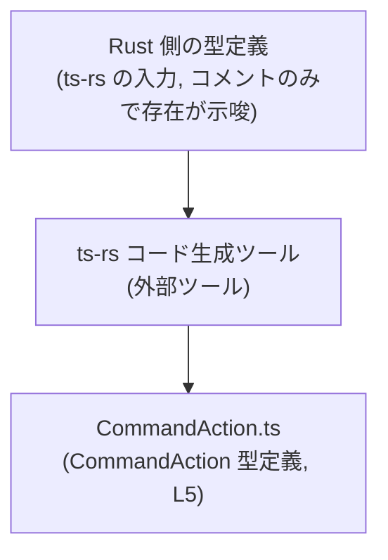
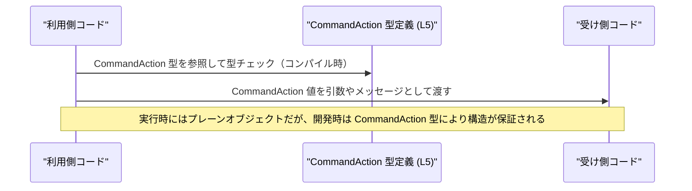

# app-server-protocol/schema/typescript/v2/CommandAction.ts

## 0. ざっくり一言

`CommandAction` という名前の **コマンドを表現するユニオン型**（共用体型）を定義する、ts-rs による自動生成 TypeScript ファイルです (CommandAction.ts:L1-3, CommandAction.ts:L5-5)。

---

## 1. このモジュールの役割

### 1.1 概要

- このファイルは、いくつかの種類の「コマンドアクション」（`read` / `listFiles` / `search` / `unknown`）を 1 つの型 `CommandAction` としてまとめたユニオン型を公開します (CommandAction.ts:L5-5)。
- Rust 側の定義から ts-rs によって自動生成されたコードであり、手動で編集しない前提になっています (CommandAction.ts:L1-3)。

### 1.2 アーキテクチャ内での位置づけ

コメントから、このファイルは **Rust の型定義 → ts-rs → TypeScript 型定義** という生成パイプラインの一部であることが分かります (CommandAction.ts:L1-3)。



- このファイル自身は型エイリアスを 1 つだけ公開しており (CommandAction.ts:L5-5)、実行時ロジックや関数呼び出しは含みません。
- どのモジュールからインポートされているか・どの経路で使われるかは、このチャンクだけからは分かりません（関連ファイル名や import 文が存在しないため）。

### 1.3 設計上のポイント

- **自動生成コード**  
  - 冒頭コメントで「GENERATED CODE」「Do not edit this file manually」と明示されています (CommandAction.ts:L1-3)。
- **単一の公開 API**  
  - `export type CommandAction = ...` という 1 つの型エイリアスのみが公開 API です (CommandAction.ts:L5-5)。
- **判別可能ユニオン（discriminated union）**  
  - 各バリアントは `"type"` プロパティに `"read" | "listFiles" | "search" | "unknown"` の文字列リテラルを持ち、これが判別キーとして機能します (CommandAction.ts:L5-5)。
- **null 許容フィールドでのオプション表現**  
  - 一部のプロパティ（`path`, `query`）は `string | null` として定義されており、値が存在しない状態を `null` で表現します (CommandAction.ts:L5-5)。

---

## 2. 主要な機能一覧

このファイルは関数を持たず、**データ型の定義**のみを提供します。主な役割は次の 4 種類のコマンドアクションを型として区別することです (CommandAction.ts:L5-5)。

- `type: "read"`:  
  - `command: string`, `name: string`, `path: string` を持つ読み取り系アクション。
- `type: "listFiles"`:  
  - `command: string`, `path: string | null` を持つファイル一覧取得系アクション。
- `type: "search"`:  
  - `command: string`, `query: string | null`, `path: string | null` を持つ検索アクション。
- `type: "unknown"`:  
  - `command: string` のみを持つ、型システム上のフォールバック用アクション。

---

## 3. 公開 API と詳細解説

### 3.1 型一覧（構造体・列挙体など）

このファイルに登場する公開型は 1 つだけです。

| 名前            | 種別      | 役割 / 用途                                                                                                             | 定義箇所                       |
|-----------------|-----------|-------------------------------------------------------------------------------------------------------------------------|--------------------------------|
| `CommandAction` | 型エイリアス（ユニオン型） | 4 種類のコマンドアクション (`"read"`, `"listFiles"`, `"search"`, `"unknown"`) のいずれかであることを表す判別可能ユニオン | CommandAction.ts:L5-5 |

#### `CommandAction` のバリアント詳細

すべて `CommandAction` の一部として 1 行で定義されています (CommandAction.ts:L5-5)。ここでは読みやすいように分解した形で説明します。

```typescript
export type CommandAction =
  | { "type": "read"; command: string; name: string; path: string }
  | { "type": "listFiles"; command: string; path: string | null }
  | { "type": "search"; command: string; query: string | null; path: string | null }
  | { "type": "unknown"; command: string };
```

- `"type": "read"` バリアント  
  - 必須フィールド:  
    - `"type"`: `"read"`  
    - `command: string`  
    - `name: string`  
    - `path: string`  
- `"type": "listFiles"` バリアント  
  - 必須フィールド:  
    - `"type"`: `"listFiles"`  
    - `command: string`  
    - `path: string | null`（`null` を許容）
- `"type": "search"` バリアント  
  - 必須フィールド:  
    - `"type"`: `"search"`  
    - `command: string`  
    - `query: string | null`  
    - `path: string | null`
- `"type": "unknown"` バリアント  
  - 必須フィールド:  
    - `"type"`: `"unknown"`  
    - `command: string`  

> `"type"` がダブルクォートで囲まれていますが、TypeScript では `"type"` も `type` も同じプロパティ名として扱われます (CommandAction.ts:L5-5)。

### 3.2 関数詳細（最大 7 件）

このファイルには **関数・メソッドは定義されていません**。  
提供されているのは `CommandAction` 型エイリアスのみです (CommandAction.ts:L5-5)。

### 3.3 その他の関数

- 該当なし（このチャンクには関数が存在しません）。

---

## 4. データフロー

このファイルは型定義のみであり、実行時処理や関数呼び出しフローは含みません。  
ここでは **一般的な TypeScript 型エイリアスの利用イメージ**として、`CommandAction` がどのようにコード間を渡るかを模式的に示します。



- 実行時には `CommandAction` はただのオブジェクトですが、TypeScript コンパイラと IDE は `CommandAction` の定義 (CommandAction.ts:L5-5) を用いて構造を検査します。
- どのモジュールが `Caller` / `Callee` に相当するかは、このチャンクには現れていません。

---

## 5. 使い方（How to Use）

### 5.1 基本的な使用方法

`CommandAction` 型の値を作成し、パターンマッチ（`switch`）で安全に扱う例です。

```typescript
// CommandAction 型をインポートする
// 実際のプロジェクト構成に応じてパスを調整する必要があります。
import type { CommandAction } from "./CommandAction";

// CommandAction の値を生成する例
const readAction: CommandAction = {                   // CommandAction 型として宣言
  type: "read",                                       // "read" バリアントであることを示す
  command: "open",                                    // 任意のコマンド名（意味は本ファイルからは不明）
  name: "README.md",                                  // 読み取る対象の名前
  path: "/repo/README.md",                            // 対象のパス（null 非許容）
};

const listFilesAction: CommandAction = {
  type: "listFiles",                                  // ファイル一覧用バリアント
  command: "ls",
  path: null,                                         // パスを指定しない場合に null を許容
};

// CommandAction を処理する関数の例
function handleCommand(action: CommandAction) {       // 判別可能ユニオンとして受け取る
  switch (action.type) {                              // "type" による分岐で型が絞り込まれる
    case "read":
      // このブロック内では action は
      // { type: "read"; command: string; name: string; path: string }
      console.log("read:", action.name, action.path);
      break;

    case "listFiles":
      // このブロック内では action は
      // { type: "listFiles"; command: string; path: string | null }
      if (action.path !== null) {
        console.log("listFiles in", action.path);
      } else {
        console.log("listFiles with default path");
      }
      break;

    case "search":
      // query と path は string | null なので null チェックが必要
      if (action.query) {
        console.log("search:", action.query, "in", action.path);
      } else {
        console.log("search with no query");
      }
      break;

    case "unknown":
      // "unknown" バリアントには command 以外の情報がない
      console.warn("unknown command:", action.command);
      break;
  }
}
```

- `switch (action.type)` によって **各ケースごとに型が自動で絞り込まれる**（型ガード）ため、存在しないプロパティへのアクセスをコンパイル時に防げます。
- `string | null` なフィールド (`path`, `query`) は、使用前に `null` チェックが必要です (CommandAction.ts:L5-5)。

### 5.2 よくある使用パターン

1. **JSON メッセージとしてシリアライズ**

```typescript
function send(action: CommandAction) {
  const payload = JSON.stringify(action);   // そのまま JSON に変換できる
  // ネットワーク送信など（ここでは具体的な送信処理は省略）
}
```

- `CommandAction` はプレーンなオブジェクト構造なので、そのまま JSON 化してシリアライズできます (CommandAction.ts:L5-5)。

1. **外部入力の型付け（キャスト時の注意）**

```typescript
function handleFromJson(json: string) {
  const raw = JSON.parse(json) as CommandAction; // 型アサーションは実行時検証を行わない

  // 実行時には構造が保証されていない可能性があるため、
  // 信頼できない入力に対しては別途バリデーションが必要
  handleCommand(raw);
}
```

- `as CommandAction` は **コンパイル時だけの宣言**であり、実際にフィールドや `"type"` が正しい形かどうかは検証されません。  
  セキュリティ上、安全な入力経路でない場合は別途バリデーションが必要です。

### 5.3 よくある間違い

```typescript
// 間違い例: "read" バリアントなのに必須プロパティ path が欠けている
// const invalidRead: CommandAction = {
//   type: "read",
//   command: "open",
//   name: "README.md",
//   // path がないためコンパイルエラーになる
// };

// 正しい例: "read" バリアントの必須フィールドをすべて指定する
const validRead: CommandAction = {
  type: "read",
  command: "open",
  name: "README.md",
  path: "/repo/README.md",
};
```

```typescript
// 間違い例: "search" バリアントで query の null を考慮しない
function badSearchHandler(action: CommandAction) {
  if (action.type === "search") {
    // action.query は string | null なので、直接 toLowerCase を呼ぶと
    // 実行時に null で落ちる可能性がある
    // console.log(action.query.toLowerCase()); // 危険
  }
}

// 正しい例: null チェックを行う
function goodSearchHandler(action: CommandAction) {
  if (action.type === "search") {
    if (action.query !== null) {
      console.log(action.query.toLowerCase());
    } else {
      console.log("no query");
    }
  }
}
```

### 5.4 使用上の注意点（まとめ）

- **このファイルは手動で編集しない**  
  - コメントで「GENERATED CODE」「Do not edit this file manually」と明示されているため、変更は元の Rust 定義と ts-rs の設定側で行う必要があります (CommandAction.ts:L1-3)。
- **`type` による判別を前提にする**  
  - `CommandAction` は `"type"` フィールドによる判別可能ユニオンであり、`switch` / `if` で `action.type` に基づいて分岐する前提の設計です (CommandAction.ts:L5-5)。
- **`null` 許容フィールドの扱い**  
  - `path` や `query` は `string | null` になり得るため、使用前に必ず null チェックを行う必要があります (CommandAction.ts:L5-5)。
- **実行時の安全性**  
  - TypeScript の型はコンパイル時の静的チェックのみであり、JSON などの動的入力に対しては構造検証・サニタイズを別途行う必要があります（型アサーションだけではセキュリティになりません）。
- **並行性**  
  - この型は単なるデータ構造であり、スレッド安全性や非同期処理に関する特別な制御は行いません。並行実行に関する注意点はこの型自体にはありません。

---

## 6. 変更の仕方（How to Modify）

### 6.1 新しい機能を追加する場合

このファイルは ts-rs による自動生成であるため、**直接編集は想定されていません** (CommandAction.ts:L1-3)。

新しいコマンド種別を追加したい場合の一般的な流れは次のようになります（Rust 側の具体的なファイル名や型名は、このチャンクからは分かりません）。

1. **Rust 側の型定義を変更する**  
   - ts-rs 対象になっている Rust の構造体・列挙体に、新しいバリアントやフィールドを追加する。  
   - このチャンクには Rust 側の定義は現れていないため、どのファイルかは不明です。
2. **ts-rs によるコード生成を再実行する**  
   - ビルドスクリプトや専用コマンドなど、プロジェクトで定義された方法で ts-rs による TypeScript 生成を再実行します。
3. **`CommandAction` を利用している TypeScript コードを更新する**  
   - 新しい `"type"` の値に対して `switch` 文などで処理分岐を追加する。  
   - 判別可能ユニオンのため、適切なパターンで書いていればコンパイラが未処理ケースを検出しやすくなります。

### 6.2 既存の機能を変更する場合

- **既存フィールドの削除・型変更に注意する**  
  - 例: `"read"` バリアントから `name` を削除すると、`action.name` を使っているすべての箇所がコンパイルエラーになります (CommandAction.ts:L5-5)。
- **`string | null` から `string` への変更など**  
  - 実装側で `null` を許容している前提のコード（`if (path !== null)` 等）が不要になったり、逆に `null` が来ないと仮定したコードが実行時エラーの原因になり得ます。
- **`"unknown"` バリアントの扱い**  
  - `"unknown"` バリアントの追加・削除やフィールド追加は、「未知のコマンド」へのフォールバックロジックに影響します。利用側コードのエラーハンドリング方針と合わせる必要があります。
- **テストと型チェック**  
  - このチャンクにはテストコードは含まれていませんが、変更後は TypeScript の型チェックに加え、実際の入出力に対するテストで JSON との整合性や `null` の扱いを確認するのが望ましいです。

---

## 7. 関連ファイル

このチャンクには import 文や他ファイルへの参照が存在しないため、具体的なファイルパスは分かりませんが、コメントとディレクトリ名から次のような関連が読み取れます。

| パス / 種別                            | 役割 / 関係                                                                                                   |
|----------------------------------------|--------------------------------------------------------------------------------------------------------------|
| （Rust 側の ts-rs 対象型定義）        | ts-rs により本ファイルを生成する元の Rust 型定義が存在しますが、具体的なパスや型名はこのチャンクには現れません (CommandAction.ts:L1-3)。 |
| app-server-protocol/schema/typescript/v2 配下の他ファイル | 同じスキーマ世代 (`v2`) の他 TypeScript 型定義ファイルが存在する可能性がありますが、詳細はこのチャンクからは不明です。 |

---

### まとめ（安全性・バグ・エッジケースの観点）

- **バグになりやすい点**  
  - `string | null` フィールドを null チェックせずに文字列として扱うと実行時エラーの原因になります (CommandAction.ts:L5-5)。
- **セキュリティ上の注意**  
  - 型定義だけでは、外部からの JSON などの入力がこの構造に従っているかは保証されません。信頼できない入力に対しては別途バリデーションやサニタイズが必要です。
- **契約・エッジケース**  
  - `"type"` の値が 4 種類のいずれかであること、各バリアントで必須フィールドが決まっていることがコントラクトです (CommandAction.ts:L5-5)。  
  - `path` や `query` に `null` が入るケースがエッジケースとして重要です。
- **性能・スケーラビリティ**  
  - 型エイリアス定義のみであり、実行時コストはほぼありません。大規模な利用でも性能上の問題は、この型自体からは生じません。
