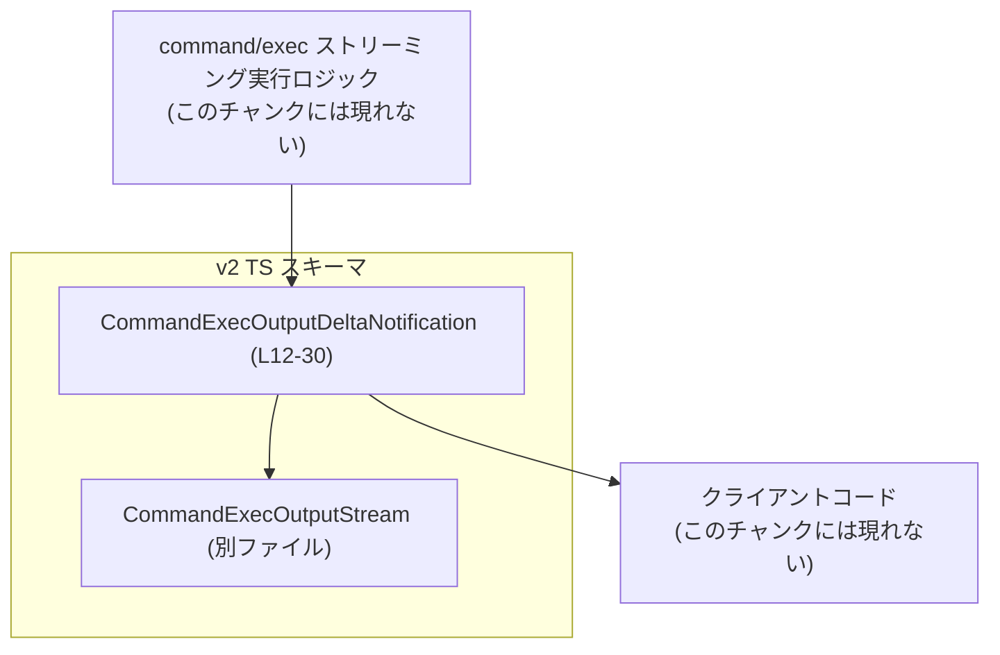
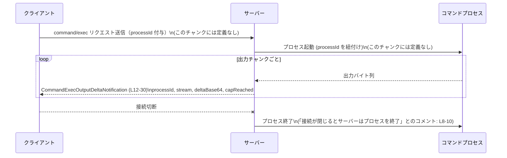

# app-server-protocol/schema/typescript/v2/CommandExecOutputDeltaNotification.ts

## 0. ざっくり一言

ストリーミングな `command/exec` リクエストに対して、サーバーがクライアントへ送る **Base64 でエンコードされた出力チャンク通知** を表現する TypeScript の型定義です。[根拠: CommandExecOutputDeltaNotification.ts:L6-11, L12-30]

---

## 1. このモジュールの役割

### 1.1 概要

- このモジュールは、ストリーミング実行されるコマンド (`command/exec`) の標準出力・標準エラー等の **出力断片（デルタ）** をクライアントに通知するためのペイロード形式を定義します。[根拠: L6-7, L22-25]
- 各通知は接続単位（connection-scoped）であり、もし元の接続が閉じられた場合はサーバー側でプロセスを終了する、という前提で利用されます。[根拠: L8-10]
- このファイルは `ts-rs` による自動生成コードであり、手動での編集は想定されていません。[根拠: L1-3]

### 1.2 アーキテクチャ内での位置づけ

この型は、アプリケーションサーバープロトコル (`app-server-protocol`) の TypeScript スキーマ v2 の一部であり、`CommandExecOutputStream` 型と組み合わせて「どのプロセスの、どのストリームの、どの出力チャンクか」を表現します。[根拠: L4, L12-30]

依存関係の概略は次の通りです。



- `CommandExecOutputDeltaNotification` は、フィールド `stream` を通じて `CommandExecOutputStream` に依存します。[根拠: L21]
- 実際の送受信（シリアライズ／デシリアライズ）や通信路（WebSocket 等）は、このチャンクには登場しません。

### 1.3 設計上のポイント

- **自動生成コード**  
  - ファイル先頭のコメントで `ts-rs` による自動生成であることと、手で編集すべきでないことが明示されています。[根拠: L1-3]
- **純粋なデータ型（POJO）**  
  - 関数やクラスはなく、単一のエクスポートされた型エイリアスのみが定義されています。[根拠: L12-30]
  - 状態やメソッドは持たず、シリアライズ可能なデータ構造として扱える前提です。
- **接続スコープとプロセス管理に関する契約**  
  - コメントに「これらの通知は接続スコープであり、元の接続が閉じるとサーバーはプロセスを終了する」とあります。[根拠: L8-10]  
    この約束事は実装側（サーバー）が守る必要がありますが、本ファイルはその契約を **表現** するだけで、実装は含みません。
- **出力サイズ制限の存在**  
  - `capReached` フィールドの説明に、`outputBytesCap` による出力切り詰め（トランケーション）の概念が現れます。[根拠: L26-28]  
    これにより、クライアント側は「出力が途中で切られていないか」を知ることができます。

---

## 2. 主要な機能一覧

このファイルは「型定義のみ」を提供しますが、プロトコル上の機能としては次のように整理できます。

- `CommandExecOutputDeltaNotification`:  
  ストリーミング `command/exec` 実行の出力チャンクを表す通知ペイロード。
  - `processId`: オリジナルの `command/exec` リクエストに紐づく、クライアント提供のプロセス ID。[根拠: L13-17]
  - `stream`: どの出力ストリーム（例: 標準出力・標準エラー等）かを表す型。[根拠: L18-21]
  - `deltaBase64`: Base64 エンコードされた出力バイト列。[根拠: L22-25]
  - `capReached`: 出力上限 (`outputBytesCap`) によってそのストリームの以降の出力が切り捨てられた場合、そのストリームの「最後のチャンク」で `true` となるフラグ。[根拠: L26-28]

---

## 3. 公開 API と詳細解説

### 3.1 型一覧（構造体・列挙体など）

このファイルに現れる主要な型の一覧です。

| 名前 | 種別 | 役割 / 用途 | 定義位置 |
|------|------|-------------|----------|
| `CommandExecOutputDeltaNotification` | 型エイリアス（オブジェクト型） | ストリーミング `command/exec` 出力チャンク通知のペイロードを表す | `CommandExecOutputDeltaNotification.ts:L12-30` |
| `CommandExecOutputStream` | 型（詳細不明、import のみ） | 出力ストリーム種別（例: stdout/stderr 等）を表す型。`stream` フィールドの型として使用される | `CommandExecOutputDeltaNotification.ts:L4, L21`（定義自体は `./CommandExecOutputStream` にあり、このチャンクには現れません） |

### 3.2 関数詳細（代わりに主要型の詳細）

このファイルには関数が定義されていないため、ここでは公開型 `CommandExecOutputDeltaNotification` の詳細をフィールド単位で説明します。[根拠: L12-30]

#### `CommandExecOutputDeltaNotification`

**概要**

- ストリーミングな `command/exec` リクエストに対して送られる、Base64 エンコード済みの出力チャンクを表現するオブジェクト型です。[根拠: L6-7, L22-25]
- 通知は接続スコープであり、接続が切断されるとサーバーはプロセスを終了する、という前提で利用されます。[根拠: L8-10]

**フィールド一覧**

| フィールド名 | 型 | 説明 | 根拠 |
|--------------|----|------|------|
| `processId` | `string` | クライアントが元の `command/exec` リクエストで指定した、接続スコープの `processId`。どのプロセスの出力かを識別します。 | L13-17 |
| `stream` | `CommandExecOutputStream` | このチャンクがどの出力ストリーム（例: 標準出力・標準エラーなど）に属するかを表します。具体的なバリアントなどは別ファイル定義です。 | L18-21 |
| `deltaBase64` | `string` | 出力バイト列を Base64 エンコードした文字列です。実際のバイト列を得るには、クライアント側で Base64 デコードを行う必要があります。 | L22-25 |
| `capReached` | `boolean` | `outputBytesCap` により後続の出力が切り捨てられた場合、そのストリームに対する最終チャンクで `true` になるフラグです。それ以外のチャンクでは通常 `false` です。 | L26-28 |

**内部処理の流れ**

- この型自体にはロジック（関数やメソッド）は含まれていません。  
  そのため、「内部処理」という概念はなく、純粋なデータコンテナです。[根拠: 関数やクラス宣言が存在しないこと: L12-30]

**Examples（使用例）**

1. サーバー側で通知を構築する例（概念的なコード）

```typescript
import type {
    CommandExecOutputDeltaNotification,
} from "./CommandExecOutputDeltaNotification";
import type { CommandExecOutputStream } from "./CommandExecOutputStream";

// 既にどこかで決定されている値を仮定します
declare const processId: string;                  // command/exec リクエスト由来
declare const stream: CommandExecOutputStream;    // stdout / stderr など
declare const chunkBytes: Uint8Array;             // プロセスから得た生の出力バイト列
declare const capReached: boolean;                // 出力上限到達かどうか（サーバーロジック側で判定）

const deltaBase64 = Buffer.from(chunkBytes).toString("base64");

const notification: CommandExecOutputDeltaNotification = {
    processId,
    stream,
    deltaBase64,
    capReached,
};

// ここで WebSocket や他のプロトコルでクライアントに送信する想定
```

- このコードは、「どのように `CommandExecOutputDeltaNotification` オブジェクトを構築するか」を示す例であり、実際の送信手段や `CommandExecOutputStream` の中身はこのチャンクからは分かりません。

1. クライアント側で通知を処理する例（受信してデコードする）

```typescript
import type { CommandExecOutputDeltaNotification } from "./CommandExecOutputDeltaNotification";

// 何らかの方法で受信したメッセージ (JSON パース済み) を仮定
declare const msg: CommandExecOutputDeltaNotification;

// processId と stream でどのプロセスのどのストリームかを識別
const { processId, stream, deltaBase64, capReached } = msg;

// Base64 をデコードしてバイト列に戻す
const outputBytes = Buffer.from(deltaBase64, "base64");

// テキストとして扱える場合は文字列に変換
const outputText = outputBytes.toString("utf8");

// capReached が true なら、このストリームの出力が途中で切り詰められたことが分かる
if (capReached) {
    console.warn(
        `processId=${processId}, stream=${String(stream)} の出力は ` +
        "outputBytesCap により途中で切り捨てられています。",
    );
}
```

**Errors / Panics**

- この型定義自体はエラーを発生させる処理を持ちません。[根拠: 関数/メソッドの不在: L12-30]
- 実際のエラー発生箇所は、この型を使う側のコード（Base64 デコード・ネットワーク I/O 等）に存在します。
  - 例として、クライアント側で `deltaBase64` をデコードするとき、値が不正な Base64 文字列であればランタイムエラーになる可能性がありますが、そのチェックはこのファイルには含まれていません。

**Edge cases（エッジケース）**

この型のフィールドに関して想定されるエッジケースを列挙します（挙動は利用側の実装に依存します）。

- `processId` が空文字列または不正な ID である場合  
  - このチャンクからは検証ロジックは見えず、`processId` は単なる `string` 型です。[根拠: L17]  
    実際に妥当な ID かどうかのチェックは、サーバー・クライアント実装に依存します。
- `deltaBase64` が空文字列の場合  
  - コメントからは空文字列を禁止する記述はなく、単に "Base64-encoded output bytes" とだけ書かれています。[根拠: L22-25]  
    出力がないチャンクを表すのか、そもそもこうしたチャンクを送らないのかは、このチャンクだけでは不明です。
- `deltaBase64` が不正な Base64 文字列の場合  
  - 型は `string` であるため、静的には防げません。[根拠: L22-25]  
    クライアント側はデコード時に例外やエラー処理が必要です。
- `capReached` の意味合い  
  - コメントによると、`capReached` は「`outputBytesCap` により後続の出力が切り捨てられた場合の、そのストリームの最終チャンク」で `true` となるとされています。[根拠: L26-28]  
  - したがって、`capReached === true` のチャンクが複数回送られるかどうか、非トランケーション時の最終チャンクが `true` か `false` かなどの詳細な仕様は、このチャンクからは確定できません（不明です）。

**使用上の注意点**

- **Base64 デコードの責任**  
  - `deltaBase64` は単なる `string` 型のため、クライアント側で Base64 デコードする際に不正値への対処が必要です。[根拠: L22-25]
- **接続スコープの前提**  
  - コメント上、「通知は接続スコープであり、接続が閉じるとサーバーはプロセスを終了する」とあります。[根拠: L8-10]  
    これはプロトコル上の重要な契約であり、クライアントが接続を閉じるとプロセスも終了することを前提に設計すべきです。
- **自動生成ファイルのため直接編集不可**  
  - 仕様を変更したい場合は元の Rust 側定義（`ts-rs` のソース）を変更する必要がありますが、このチャンクにはその場所は現れていません。[根拠: L1-3]
- **スレッド安全性 / 並行性**  
  - この型自体は不変のデータコンテナであり、共有しても並行性の問題はありません。  
    実際の並行実行やメッセージ配送順序の保証は、周辺の通信レイヤー実装に依存します（このチャンクには現れません）。

### 3.3 その他の関数

- このファイルには関数・メソッド・ヘルパーは定義されていません。[根拠: L1-30]

---

## 4. データフロー

ここでは、`command/exec` のストリーミング実行における、出力がどのように `CommandExecOutputDeltaNotification` としてクライアントに届くかを、コメントから読み取れる範囲でシーケンス図として示します。

コメントに基づき、「通知は接続スコープであり、接続が切れるとサーバーがプロセスを終了する」という振る舞いを図示します。[根拠: L6-10]



- 実際のメッセージフォーマット（JSON かどうか等）や通信路（WebSocket、RPC など）は、このチャンクには出てきません。
- `CommandExecOutputDeltaNotification` は、プロセス出力の「一部（デルタ）」を表すため、上図のようにループ内で複数回送信されることが想定されます。[根拠: "output chunk" と "streamed chunk" という用語: L6-7, L26-28]

---

## 5. 使い方（How to Use）

### 5.1 基本的な使用方法

最も基本的な使い方は、「コマンド実行の出力チャンクを送受信するデータ構造」としてこの型を利用することです。

#### オブジェクトの生成（サーバー側イメージ）

```typescript
import type {
    CommandExecOutputDeltaNotification,
} from "./CommandExecOutputDeltaNotification";
import type { CommandExecOutputStream } from "./CommandExecOutputStream";

function makeNotification(
    processId: string,                          // 接続スコープのプロセス ID
    stream: CommandExecOutputStream,           // 対象ストリーム
    chunkBytes: Uint8Array,                    // 出力バイト列
    capReached: boolean,                       // 出力上限を超えたかどうか
): CommandExecOutputDeltaNotification {
    const deltaBase64 = Buffer.from(chunkBytes).toString("base64"); // Base64 エンコード

    return {
        processId,
        stream,
        deltaBase64,
        capReached,
    };
}
```

### 5.2 よくある使用パターン

1. **クライアント側でプロセス出力をストリーム別に蓄積する**

```typescript
import type { CommandExecOutputDeltaNotification } from "./CommandExecOutputDeltaNotification";

type OutputKey = string; // 例: `${processId}:${stream}`

const outputs = new Map<OutputKey, Uint8Array[]>();

function handleNotification(msg: CommandExecOutputDeltaNotification) {
    const key = `${msg.processId}:${String(msg.stream)}`;

    const chunk = Buffer.from(msg.deltaBase64, "base64");
    const list = outputs.get(key) ?? [];
    list.push(chunk);
    outputs.set(key, list);

    if (msg.capReached) {
        console.warn(`出力が outputBytesCap により切り詰められている可能性があります: ${key}`);
    }
}
```

- `processId` と `stream` の組でストリームを識別し、`deltaBase64` をデコードしてチャンクとして蓄積する典型的なパターンです。

1. **テキストとしてリアルタイム表示**

```typescript
function appendToTerminal(
    msg: CommandExecOutputDeltaNotification,
    appendLine: (stream: string, text: string) => void,
) {
    const bytes = Buffer.from(msg.deltaBase64, "base64");
    const text = bytes.toString("utf8"); // バイナリの場合は別処理が必要

    appendLine(String(msg.stream), text);

    if (msg.capReached) {
        appendLine(
            String(msg.stream),
            "[出力が outputBytesCap により途中で切り捨てられました]",
        );
    }
}
```

### 5.3 よくある間違い

（このファイル自体にエラーハンドリングはありませんが、利用上起こりやすい誤りの例です）

```typescript
// 間違い例: deltaBase64 をそのまま表示してしまう
function wrongUsage(msg: CommandExecOutputDeltaNotification) {
    console.log(msg.deltaBase64); // Base64 文字列がそのまま表示されるだけ
}

// 正しい例: Base64 デコードしてから文字列化する
function correctUsage(msg: CommandExecOutputDeltaNotification) {
    const text = Buffer.from(msg.deltaBase64, "base64").toString("utf8");
    console.log(text);
}
```

```typescript
// 間違い例: capReached を無視して「すべての出力を取得できた」と仮定する
function assumeFullOutput(msg: CommandExecOutputDeltaNotification) {
    // capReached を確認していない
    // 完全な出力を得たかどうかが分からない
}

// 正しい例: capReached を確認し、不完全な出力の可能性を考慮する
function checkCap(msg: CommandExecOutputDeltaNotification) {
    if (msg.capReached) {
        console.warn("出力が途中で切り捨てられている可能性があります。");
    }
}
```

### 5.4 使用上の注意点（まとめ）

- **Base64 処理**  
  - `deltaBase64` は必ず Base64 デコードして使用する必要があります。[根拠: L22-25]
- **接続のライフサイクルに依存する**  
  - コメントによると、接続が閉じるとサーバーはプロセスを終了します。[根拠: L8-10]  
    途中で接続を切断すると、後続の出力が一切届かなくなります。
- **出力上限 (`outputBytesCap`) の存在**  
  - `capReached` が `true` の場合、そのストリームの出力が途中までしか届いていない可能性があることを前提に処理する必要があります。[根拠: L26-28]
- **信頼境界**  
  - この型自体はバリデーションを行いません。  
    外部から受け取ったデータをこの型にマッピングする場合は、`processId`・`deltaBase64` などの検証やサニタイズを利用側で行う必要があります。

---

## 6. 変更の仕方（How to Modify）

### 6.1 新しい機能を追加する場合

- ファイル先頭コメントにある通り、このファイルは `ts-rs` による自動生成コードです。[根拠: L1-3]
  - そのため、**直接この TypeScript ファイルにフィールドを追加・削除することは推奨されません。**
- プロトコルに新しい情報（例: タイムスタンプ、チャンクシーケンス番号など）を追加したい場合の一般的な手順は次の通りです（このチャンクから元定義の場所は分からないため、抽象的な記述になります）。
  1. `ts-rs` の元となる Rust 側の構造体定義（またはスキーマ定義）を変更する。（場所はこのチャンクには現れません。）
  2. `ts-rs` を再実行して TypeScript スキーマ全体を再生成する。
  3. 生成された `CommandExecOutputDeltaNotification.ts` に新しいフィールドが追加されていることを確認する。
  4. サーバー側・クライアント側の両方で新しいフィールドを扱うように実装を更新する。

### 6.2 既存の機能を変更する場合

- **フィールド名・型の変更は後方互換性に影響**  
  - 例えば `deltaBase64: string` の型を変更した場合、既存クライアントは新しいスキーマを理解できなくなります。[根拠: L22-25]
- **`capReached` の意味を変更する場合**  
  - コメントで「`outputBytesCap` により切り捨てられた場合の最終チャンクで `true`」と説明されています。[根拠: L26-28]  
    この意味を変える場合は、サーバー・クライアント双方のロジックとドキュメントを同時に更新する必要があります。
- 変更時に確認すべき点（このチャンクから直接は分かりませんが、一般的な観点）:
  - どのメッセージルータ／ハンドラが `CommandExecOutputDeltaNotification` を送信・受信しているか。
  - シリアライズ形式（JSON など）と、そのスキーマ定義（OpenAPI, JSON Schema 等）があれば、それらとの整合性。
  - E2E テストや統合テストでストリーミング出力のシナリオをカバーしているか。

---

## 7. 関連ファイル

このモジュールと密接に関係すると思われるファイル・ディレクトリ（コードから読み取れる範囲）です。

| パス | 役割 / 関係 |
|------|------------|
| `./CommandExecOutputStream` | `stream` フィールドの型定義を提供します。[根拠: L4, L21] このファイル内では詳細は分かりませんが、おそらく標準出力・標準エラーなどの出力ストリーム種別を表す型と考えられます（ただし、このチャンクからは確定できません）。 |
| `app-server-protocol/schema/typescript/v2/` 以下の他のファイル | v2 プロトコル全体の TypeScript スキーマを構成する仲間の定義群と考えられますが、このチャンクには具体的な一覧は現れません。 |

---

### 補足：テスト / パフォーマンス / セキュリティ観点（このチャンクから分かる範囲）

- **テスト**  
  - このファイル内にテストコードは存在しません。[根拠: L1-30]
- **パフォーマンス / スケーラビリティ**  
  - 型定義のみであり、性能に直接影響する実装は含まれていません。  
    実際のボトルネックは出力のエンコード・送信・デコードなど、周辺ロジックにあります。
- **セキュリティ**  
  - `deltaBase64` を含むペイロードは、外部から送られてくるデータとして扱われる可能性が高いため、利用側では次のような点に注意が必要です（一般的な注意であり、このチャンク単独からは挙動は分かりません）。
    - Base64 デコード時のエラー処理。
    - デコード後のバイト列／文字列を表示・保存・実行する際のサニタイズ。
    - `processId` などの ID を用いて内部リソースを参照する際の検証（ID スプーフィング対策）。

このファイル自体はバリデーションや安全性チェックを行わない、純粋なデータスキーマとして設計されていると解釈できます。[根拠: 型定義のみで追加ロジックがないこと: L12-30]
