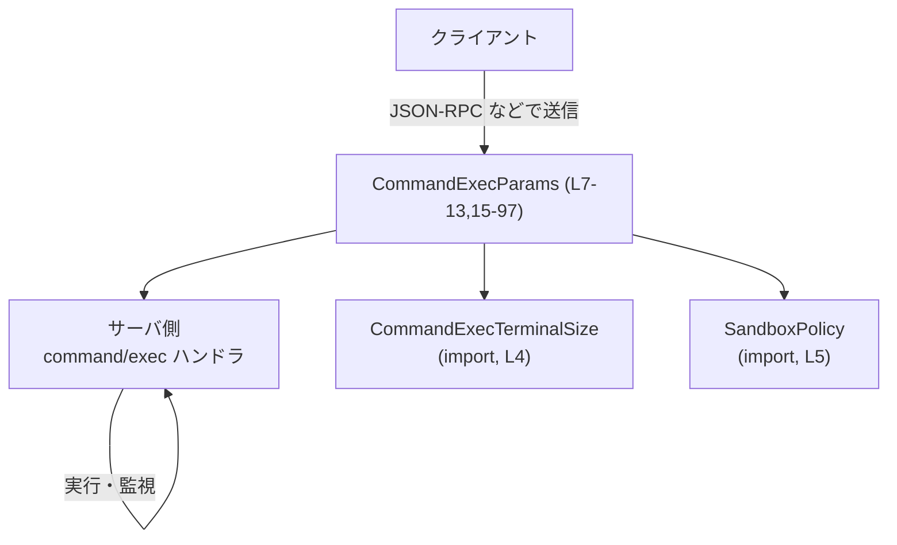
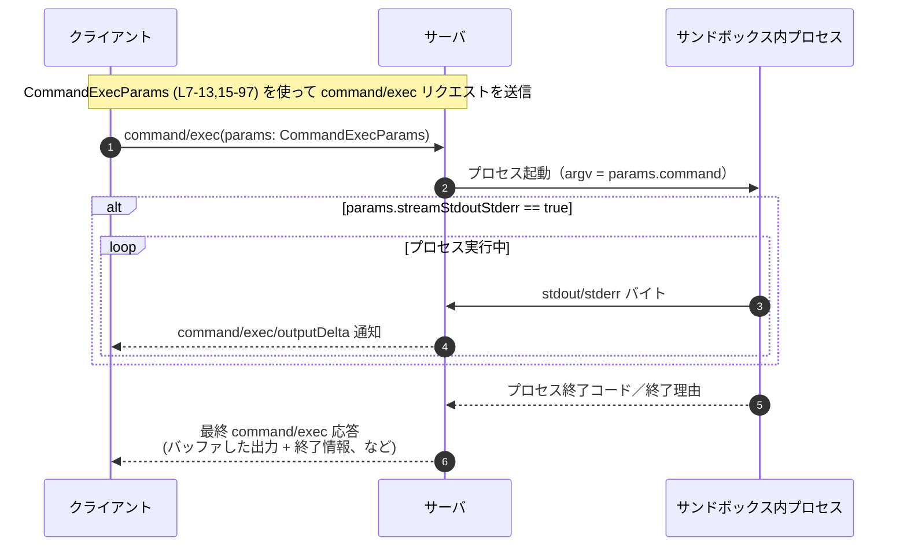

# app-server-protocol/schema/typescript/v2/CommandExecParams.ts

## 0. ざっくり一言

`CommandExecParams` は、サーバの「command/exec」的な RPC で、サンドボックス内でスタンドアロンのコマンドを実行する際の **パラメータ（リクエストボディの型定義）** を表す TypeScript のオブジェクト型です（根拠: CommandExecParams.ts:L7-13, L15-97）。

---

## 1. このモジュールの役割

### 1.1 概要

- このモジュールは、サーバサンドボックス内で **スレッドや turn を作らずに単一のコマンドを実行する** RPC のパラメータを表現します（根拠: CommandExecParams.ts:L7-9）。
- 実行結果は、必要に応じて
  - ストリーム通知（`command/exec/outputDelta`）と
  - プロセス終了後の最終レスポンス
  の組み合わせで返されることがコメントに記載されています（根拠: CommandExecParams.ts:L11-13）。
- TypeScript 側では **純粋な型定義のみ** を提供し、実際の処理ロジックは別コンポーネント（サーバ側実装）に委ねられます（根拠: 関数定義が存在しないこと CommandExecParams.ts:L1-97）。

### 1.2 アーキテクチャ内での位置づけ

- この型は **クライアント ↔ サーバ間のプロトコルスキーマ** の一部として振る舞います。
- 他ファイルから `CommandExecTerminalSize` と `SandboxPolicy` 型を import しており（根拠: CommandExecParams.ts:L4-5）、それらを埋め込んだ形でパラメータを構成します。
- ファイル先頭のコメントから、このファイルは `ts-rs` による **自動生成コード** であり、Rust 側の定義と 1:1 に対応した型であることが分かります（根拠: CommandExecParams.ts:L1-3）。

依存関係を簡略化した図です。



### 1.3 設計上のポイント

- **自動生成ファイル**  
  - 「GENERATED CODE」「Do not edit manually」というコメントがあり、ソースは別（Rust + ts-rs）にあります（根拠: CommandExecParams.ts:L1-3）。
- **オブジェクト型によるリクエストスキーマ**  
  - `export type CommandExecParams = { ... }` という 1 つの型エイリアスだけを公開しています（根拠: CommandExecParams.ts:L15-97）。
- **TypeScript の型安全性**  
  - すべてのフィールドに型アノテーションが付いており、IDE 補完とコンパイル時型チェックが得られます。
  - 多くのフィールドが `?`（オプショナル）と `| null` を併用しており、「プロパティ自体が存在しない」と「明示的に null が設定されている」を区別できる形になっています（例: `processId?: string | null`、根拠: CommandExecParams.ts:L28）。
- **コメントによる「契約」を表現**  
  - フィールド間の依存関係や禁止される組み合わせ（例: `outputBytesCap` と `disableOutputCap` の同時指定禁止）がコメントで明示されていますが、型レベルでは強制されていません（根拠: CommandExecParams.ts:L49-53, L56-60, L62-66, L68-72, L86-90）。
- **並行性の示唆**  
  - `processId` が「connection-scoped process id」と説明されており、接続ごとに複数プロセスや追跡が行われる設計であることが示唆されています（根拠: CommandExecParams.ts:L21-26）。型自体は並行制御を行いませんが、プロトコルレベルでは重要なキーとなります。

---

## 2. 主要な機能一覧

このファイルは関数を持たないため、「機能」は `CommandExecParams` 型の各プロパティで表現されます。

- `command`: 実行するコマンドの argv ベクタ（空配列は拒否）（根拠: CommandExecParams.ts:L16-19）。
- `processId`: クライアント指定の接続スコープなプロセス ID。ストリーミングや後続操作に必須（根拠: CommandExecParams.ts:L21-26, L28）。
- `tty`: PTY モードの有効化フラグ。暗黙に `streamStdin` / `streamStdoutStderr` を含意（根拠: CommandExecParams.ts:L29-34）。
- `streamStdin`: 後続の `command/exec/write` による stdin ストリーム書き込みを許可（要 `processId`）（根拠: CommandExecParams.ts:L35-40）。
- `streamStdoutStderr`: `command/exec/outputDelta` 通知による stdout/stderr ストリーミングを有効化（要 `processId`）（根拠: CommandExecParams.ts:L41-47）。
- `outputBytesCap`: stdout/stderr の捕捉バイト数上限。サーバデフォルト上書き。`disableOutputCap` と排他（根拠: CommandExecParams.ts:L48-54）。
- `disableOutputCap`: このリクエストに限り stdout/stderr の切り詰め無効化。`outputBytesCap` と排他（根拠: CommandExecParams.ts:L55-60）。
- `disableTimeout`: このリクエストのタイムアウトを完全無効化。`timeoutMs` と排他（根拠: CommandExecParams.ts:L61-66）。
- `timeoutMs`: ミリ秒単位のタイムアウト。サーバデフォルト上書き。`disableTimeout` と排他（根拠: CommandExecParams.ts:L67-73）。
- `cwd`: 作業ディレクトリ。指定がなければサーバ cwd が使われる（根拠: CommandExecParams.ts:L74-77）。
- `env`: 環境変数の上書き/削除。`null` 指定で継承された変数を削除（根拠: CommandExecParams.ts:L78-85）。
- `size`: 初期 PTY サイズ（文字セル数）。`tty` が true のときのみ有効（根拠: CommandExecParams.ts:L86-90）。
- `sandboxPolicy`: このコマンド専用のサンドボックスポリシー。省略時はユーザ設定のデフォルト（根拠: CommandExecParams.ts:L91-97）。

---

## 3. 公開 API と詳細解説

### 3.1 型一覧（構造体・列挙体など）

| 名前 | 種別 | 役割 / 用途 | 定義 / 使用箇所 |
|------|------|-------------|-----------------|
| `CommandExecParams` | オブジェクト型の型エイリアス | command/exec リクエストのパラメータ全体を表現 | 定義: CommandExecParams.ts:L15-97 |
| `CommandExecTerminalSize` | 型（別ファイル） | PTY の行・列などのサイズを表す型。`size` プロパティで使用 | import: CommandExecParams.ts:L4, 使用: L90 |
| `SandboxPolicy` | 型（別ファイル） | サンドボックス実行ポリシーを表す型。`sandboxPolicy` プロパティで使用 | import: CommandExecParams.ts:L5, 使用: L97 |

※ このファイルで **export** されているのは `CommandExecParams` のみです（根拠: CommandExecParams.ts:L15）。

### 3.2 型 `CommandExecParams` の詳細

（このファイルに関数は存在しないため、関数テンプレートを「型の詳細」に読み替えて説明します）

#### `CommandExecParams`（オブジェクト型）

**概要**

- サーバのサンドボックス内で 1 つのプロセスを実行するための、すべてのオプションを含んだパラメータオブジェクトです（根拠: CommandExecParams.ts:L7-13, L15-97）。
- ストリーミング（stdin/out/err）、TTY モード、タイムアウト、作業ディレクトリ、環境変数、サンドボックスポリシーなどを細かく制御できます。

**フィールド一覧**

| プロパティ名 | 型 | 必須/任意 | 説明 | 根拠 |
|--------------|----|-----------|------|------|
| `command` | `Array<string>` | 必須 | 実行するコマンドの argv ベクタ。空配列はサーバ側で拒否されるとコメントに記載 | CommandExecParams.ts:L16-19 |
| `processId` | `string \| null`（オプショナル） | 任意 | クライアント指定の接続スコープなプロセス ID。TTY/ストリーミングや後続操作に必要 | CommandExecParams.ts:L21-26, L28 |
| `tty` | `boolean`（オプショナル） | 任意 | PTY モードを有効化。暗黙に `streamStdin` / `streamStdoutStderr` を含意 | CommandExecParams.ts:L29-34 |
| `streamStdin` | `boolean`（オプショナル） | 任意 | 後続の `command/exec/write` による stdin 書き込みを許可。`processId` 必須 | CommandExecParams.ts:L35-40 |
| `streamStdoutStderr` | `boolean`（オプショナル） | 任意 | `command/exec/outputDelta` による stdout/stderr ストリーミングを有効化。`processId` 必須 | CommandExecParams.ts:L41-47 |
| `outputBytesCap` | `number \| null`（オプショナル） | 任意 | stdout/stderr 各ストリームのキャプチャ上限バイト数。サーバデフォルト上書き。`disableOutputCap` と排他 | CommandExecParams.ts:L48-54 |
| `disableOutputCap` | `boolean`（オプショナル） | 任意 | このリクエストに限り stdout/stderr の切り詰めを無効化。`outputBytesCap` と排他 | CommandExecParams.ts:L55-60 |
| `disableTimeout` | `boolean`（オプショナル） | 任意 | このリクエストのタイムアウトを完全無効化。`timeoutMs` と排他 | CommandExecParams.ts:L61-66 |
| `timeoutMs` | `number \| null`（オプショナル） | 任意 | ミリ秒単位のタイムアウト。サーバデフォルト上書き。`disableTimeout` と排他 | CommandExecParams.ts:L67-73 |
| `cwd` | `string \| null`（オプショナル） | 任意 | 作業ディレクトリ。省略時はサーバのカレントディレクトリ | CommandExecParams.ts:L74-77 |
| `env` | `{ [key: string]?: string \| null } \| null`（オプショナル） | 任意 | 環境変数の上書き・削除を表すマップ。`null` 指定で継承された変数を削除 | CommandExecParams.ts:L78-85 |
| `size` | `CommandExecTerminalSize \| null`（オプショナル） | 任意 | 初期 PTY サイズ。`tty` が true の時のみ有効 | CommandExecParams.ts:L86-90 |
| `sandboxPolicy` | `SandboxPolicy \| null`（オプショナル） | 任意 | このコマンド専用のサンドボックスポリシー。省略時はユーザの設定済みポリシー | CommandExecParams.ts:L91-97 |

**内部的な制約・相関（コメントから読み取れる契約）**

TypeScript 型としては表現されていませんが、コメントから次のような **論理的制約** が読み取れます。

- `command` は空配列不可  
  - 「Empty arrays are rejected.」とあるため、サーバは空配列をエラーとして扱う契約になっています（根拠: CommandExecParams.ts:L16-19）。
- `processId` が必須となる条件  
  - `tty` が true の場合（含意する `streamStdin` / `streamStdoutStderr` のため）  
  - `streamStdin` が true の場合（根拠: CommandExecParams.ts:L35-40）。  
  - `streamStdoutStderr` が true の場合（根拠: CommandExecParams.ts:L41-47）。  
  - 後続の `command/exec/write` / `resize` / `terminate` を呼ぶ場合（根拠: CommandExecParams.ts:L23-26）。
- 出力キャプチャ関連の排他条件  
  - `outputBytesCap` と `disableOutputCap` は **同時に指定してはならない**（根拠: CommandExecParams.ts:L48-53, L55-60）。
- タイムアウト関連の排他条件  
  - `timeoutMs` と `disableTimeout` は **同時に指定してはならない**（根拠: CommandExecParams.ts:L61-66, L67-72）。
- PTY サイズの前提条件  
  - `size` は `tty` が true の場合にのみ有効である、と明記されています（根拠: CommandExecParams.ts:L86-90）。

これらはコメントベースの契約であり、TypeScript コンパイラは自動的には検査しません。

**Examples（使用例）**

1. **シンプルなバッファリング実行（ストリームなし）**

```typescript
import type { CommandExecParams } from "./CommandExecParams";

const params: CommandExecParams = {                    // CommandExecParams 型のオブジェクトを作成
  command: ["echo", "hello"],                         // 空でないコマンド配列（必須）
  // processId は指定しない → バッファリング実行で内部 ID が使われる（コメントより）
  // streamStdin, streamStdoutStderr, tty も無効のまま
};

// 例: JSON-RPC クライアントで送信する（実装は別モジュール）
rpcClient.notify("command/exec", params);
```

- このパターンでは、標準出力/エラーは最終レスポンスにまとめて返され、`command/exec/outputDelta` 通知は使われないことが想定されます（通知の仕様自体はこのファイルには実装されていませんが、コメントの文脈から読み取れます: CommandExecParams.ts:L11-13）。

1. **TTY + ストリーミング実行**

```typescript
import type { CommandExecParams } from "./CommandExecParams";

const params: CommandExecParams = {
  command: ["bash"],                                  // 例: 対話シェル
  processId: "sess-1234",                             // 接続スコープなプロセス ID（クライアントが決める）
  tty: true,                                          // PTY モードを有効化
  // tty: true により、コメント上は streamStdin/streamStdoutStderr が含意される
  streamStdin: true,                                  // 明示的に true にしても問題ない
  streamStdoutStderr: true,                           // 出力を outputDelta でストリームする
  timeoutMs: null,                                    // サーバデフォルトのタイムアウトを利用
  cwd: "/home/user",                                  // 作業ディレクトリを変更
  env: { PATH: "/usr/local/bin:/usr/bin", LANG: "en_US.UTF-8" }, // 環境変数の上書き
};

rpcClient.notify("command/exec", params);

// 以降、同じ processId を使って write/resize/terminate を送る
```

1. **出力キャプチャ制御とタイムアウト無効化**

```typescript
const params: CommandExecParams = {
  command: ["long-running-tool", "--verbose"],
  disableTimeout: true,                               // タイムアウトを完全無効化
  disableOutputCap: true,                             // 出力キャプチャの切り詰めも無効化
  // outputBytesCap と timeoutMs は併用しない（コメント上の契約）
};
```

**Errors / 不正な組み合わせ**

この型自体は `Result` や例外を返す関数ではありませんが、コメントから次のような **「サーバ側でエラーになりうる条件」** が読み取れます。

- `command` が空配列のとき  
  - 「Empty arrays are rejected」とあるため、サーバ側でエラー応答もしくはリクエスト拒否となる可能性があります（根拠: CommandExecParams.ts:L16-19）。
- `streamStdin` または `streamStdoutStderr` が true だが `processId` を指定していないとき  
  - コメントで `Requires a client-supplied processId.` と明記されているため（根拠: CommandExecParams.ts:L35-40, L41-47）、サーバ側で不正リクエスト扱いになることが想定されます。
- `tty` が true なのに `processId` を指定しない場合  
  - `tty` が `streamStdin` / `streamStdoutStderr` を含意するため、上記と同じく `processId` が必要になります（根拠: CommandExecParams.ts:L29-34）。
- `outputBytesCap` と `disableOutputCap` を同時に指定した場合  
  - 「Cannot be combined with …」と明記されているため、プロトコル契約違反です（根拠: CommandExecParams.ts:L48-53, L55-60）。
- `timeoutMs` と `disableTimeout` を同時に指定した場合  
  - 同様に「Cannot be combined with …」と明記されています（根拠: CommandExecParams.ts:L61-66, L67-72）。
- `tty` が false または未指定なのに `size` を指定した場合  
  - 「Only valid when `tty` is true」とあるため、無視されるかエラーになる可能性があります（根拠: CommandExecParams.ts:L86-90）。

これらの扱いが「エラーになるのか」「指定が無視されるのか」は、サーバ実装側コードがこのチャンクに含まれていないため不明です。

**Edge cases（エッジケース）**

- `processId` を `null` にする  
  - 型上は許可されています（`string | null`）。コメントからは「省略時に内部 ID が付く」とあるため（根拠: CommandExecParams.ts:L21-26）、`null` を指定した場合の挙動はこのチャンクだけでは分かりません。
- `env` における `null` 値  
  - コメントに「Set a key to `null` to unset an inherited variable.」とあり（根拠: CommandExecParams.ts:L82-83）、継承された環境変数を明示的に削除する機構として使われます。
- `outputBytesCap` / `timeoutMs` に `null` を与える  
  - コメント上は「省略時にサーバデフォルトを使う」とあるのみで、`null` を明示するとどう扱うかは書かれていません（根拠: CommandExecParams.ts:L48-53, L67-72）。型が `number | null` なので `null` は許可されますが、意味はこのチャンクからは読み取れません。
- `sandboxPolicy` を省略 or `null`  
  - いずれの場合も「ユーザ設定のポリシーを使う」とみなされる可能性がありますが、コメントには「省略時」（omitted）についてのみ言及があります（根拠: CommandExecParams.ts:L91-97）。`null` の扱いは不明です。

**使用上の注意点**

- このファイルは **生成コードであり直接編集しない** ことが前提です（根拠: CommandExecParams.ts:L1-3）。
- TypeScript の型は **プロトコル契約を表現するだけ** であり、コメントに書かれた制約（排他条件や必須関係）はコンパイル時には検査されません。  
  → アプリケーション側でバリデーションを行うか、サーバからのエラー応答を考慮した設計が必要です。
- `processId` は「connection-scoped」と明記されているため、接続ごとに一意となるようアプリケーション側で管理する必要があります（根拠: CommandExecParams.ts:L21-22）。
- ストリーミング（`streamStdoutStderr`）を有効にした場合、コメントに「Streamed bytes are not duplicated into the final response」とあり、最終レスポンスにはストリーム済みのバイトは含まれないことに注意が必要です（根拠: CommandExecParams.ts:L41-45）。

### 3.3 その他の関数

- このファイルには **関数・メソッド・クラス定義は一切含まれていません**（根拠: CommandExecParams.ts:L1-97）。

---

## 4. データフロー

この型は **リクエストパラメータのスキーマ** なので、代表的なデータフローは「クライアントが `CommandExecParams` を構築し、サーバに送信 → サーバがプロセスを起動し、出力をストリーミング → 終了時に最終レスポンスを返す」という流れです。



- このシーケンス図は、ファイル先頭のコメントにある説明に基づきます（「最終レスポンスはプロセス終了まで遅延」「outputDelta 通知送信後に返される」、根拠: CommandExecParams.ts:L11-13）。
- `streamStdin` が有効な場合は、別途 `command/exec/write` リクエストが `processId` をキーにして P に書き込まれる流れが追加されますが、その詳細はこのファイルには記述されていません（根拠: CommandExecParams.ts:L35-40）。

---

## 5. 使い方（How to Use）

### 5.1 基本的な使用方法

典型的なフローは以下のようになります。

1. 必須の `command` と、必要に応じてオプションを設定して `CommandExecParams` オブジェクトを構築する。
2. RPC クライアント（JSON-RPC 等）で `command/exec` メソッドに対して送信する。
3. ストリーミングモードの場合は、`processId` を用いて後続の write/resize/terminate を発行する。

```typescript
import type { CommandExecParams } from "./CommandExecParams";

// 1. パラメータオブジェクトを構築
const params: CommandExecParams = {
  command: ["ls", "-la"],            // 実行コマンド（必須）
  timeoutMs: 5_000,                  // 5 秒タイムアウト（サーバデフォルトを上書き）
};

// 2. RPC クライアントから送信
await rpcClient.request("command/exec", params);

// 3. 応答を受け取り、標準出力/エラー・終了コードなどを利用（実装は別モジュール）
```

### 5.2 よくある使用パターン

1. **短時間コマンドの一括実行**

```typescript
const params: CommandExecParams = {
  command: ["git", "status"],
  cwd: "/repos/project",             // 作業ディレクトリを指定
};
```

1. **ログ量の大きいコマンドの出力上限を Explicit に指定**

```typescript
const params: CommandExecParams = {
  command: ["my-tool", "--debug"],
  outputBytesCap: 1024 * 1024,       // 各ストリーム 1MB までバッファ
  // disableOutputCap は指定しない（排他条件）
};
```

1. **環境変数の上書きと削除**

```typescript
const params: CommandExecParams = {
  command: ["printenv"],
  env: {
    PATH: "/custom/bin:" + process.env.PATH,  // PATH を上書き
    OLD_VAR: null,                            // 継承された OLD_VAR を削除（コメントの契約）
  },
};
```

1. **TTY + リサイズ対応セッション**

```typescript
const params: CommandExecParams = {
  command: ["bash"],
  processId: "shell-session-1",
  tty: true,
  size: { rows: 40, cols: 120 },     // CommandExecTerminalSize 側の定義に依存
  streamStdin: true,
  streamStdoutStderr: true,
};
```

### 5.3 よくある間違い

コメントから想定される誤用と、その修正版の例です。

```typescript
// ❌ 誤り例 1: streamStdin を有効にしているが processId がない
const bad1: CommandExecParams = {
  command: ["bash"],
  streamStdin: true,                 // Requires processId
  // processId: がないため契約違反（サーバ側でエラーになる可能性）
};

// ✅ 正しい例
const ok1: CommandExecParams = {
  command: ["bash"],
  processId: "session-1",
  streamStdin: true,
};
```

```typescript
// ❌ 誤り例 2: outputBytesCap と disableOutputCap を両方指定
const bad2: CommandExecParams = {
  command: ["my-tool"],
  outputBytesCap: 100_000,
  disableOutputCap: true,            // Cannot be combined with outputBytesCap
};

// ✅ 正しい例（どちらか片方のみ）
const ok2a: CommandExecParams = {
  command: ["my-tool"],
  outputBytesCap: 100_000,
};

const ok2b: CommandExecParams = {
  command: ["my-tool"],
  disableOutputCap: true,
};
```

```typescript
// ❌ 誤り例 3: tty ではないのに size を指定
const bad3: CommandExecParams = {
  command: ["cat", "file.txt"],
  size: { rows: 24, cols: 80 },      // Only valid when tty is true
};

// ✅ 正しい例
const ok3: CommandExecParams = {
  command: ["bash"],
  tty: true,
  size: { rows: 24, cols: 80 },
};
```

```typescript
// ❌ 誤り例 4: timeoutMs と disableTimeout を同時指定
const bad4: CommandExecParams = {
  command: ["sleep", "10"],
  timeoutMs: 5_000,
  disableTimeout: true,              // Cannot be combined with timeoutMs
};

// ✅ 正しい例
const ok4a: CommandExecParams = {
  command: ["sleep", "10"],
  timeoutMs: 5_000,
};

const ok4b: CommandExecParams = {
  command: ["sleep", "10"],
  disableTimeout: true,
};
```

### 5.4 使用上の注意点（まとめ）

- **必須フィールド**: `command` は必須で、空配列は禁止です。
- **ストリーミング関連**:
  - `tty` / `streamStdin` / `streamStdoutStderr` を使う場合は必ず `processId` を指定する必要があります。
  - 出力をストリームすると、ストリーム済みのバイトは最終レスポンスに重複しない点に注意します。
- **排他オプション**:
  - `outputBytesCap` vs `disableOutputCap`  
  - `timeoutMs` vs `disableTimeout`  
  これらはコメントで排他とされており、同時指定は契約違反です。
- **環境変数の扱い**:
  - `env` の各キーは、`undefined` / 未指定: 変更なし、`string`: 上書き、`null`: 削除、という三値的な意味を持ちます（根拠: CommandExecParams.ts:L78-85）。
- **セキュリティ・サンドボックス**:
  - `sandboxPolicy` を指定しない場合、「ユーザ設定のデフォルトポリシー」が使われるとコメントにあります（根拠: CommandExecParams.ts:L91-97）。  
    セキュリティ要件が厳しい場合は、明示的なポリシー指定が必要になる可能性があります。

---

## 6. 変更の仕方（How to Modify）

### 6.1 新しい機能を追加する場合

- このファイルは **ts-rs による自動生成コード** のため（根拠: CommandExecParams.ts:L1-3）、直接編集すべきではありません。
- 新しいプロパティや機能を追加する場合は:
  1. **元になっている Rust 側の型定義**（`ts-rs` の derive が付いた構造体など）を変更する。
  2. スキーマ生成プロセス（build スクリプトなど）を実行して、この TypeScript ファイルを再生成する。
  3. 変更されたプロパティを利用するクライアントコードを更新する。

このチャンクには Rust 側の定義や生成コマンドは含まれていないため、具体的なファイル名・コマンドは不明です。

### 6.2 既存の機能を変更する場合

- 既存プロパティの意味・契約を変更したい場合も、同様に **元の Rust 定義と ts-rs の設定** を変更する必要があります。
- 影響範囲としては:
  - この TypeScript 型を参照しているすべてのクライアントコード
  - サーバ側の `command/exec` 実装と、そのプロトコル処理ロジック
  が考えられますが、このチャンクには参照元の一覧は含まれていません。
- 特に、コメントで明示されている契約（排他条件・必須関係）を変更する場合は:
  - サーバ側のバリデーションロジック
  - クライアント側のバリデーション・UI
  も併せて確認する必要があります。

---

## 7. 関連ファイル

このモジュールと密接に関係するファイルは、import から次のように読み取れます。

| パス | 役割 / 関係 |
|------|------------|
| `./CommandExecTerminalSize` | `size` プロパティの型を定義するファイル。PTY の行数・列数などの情報を持つと考えられますが、このチャンクには中身は現れません（根拠: CommandExecParams.ts:L4, L86-90）。 |
| `./SandboxPolicy` | `sandboxPolicy` プロパティの型を定義するファイル。スレッド/turn 実行時と同じポリシー構造を共有するとコメントにあります（根拠: CommandExecParams.ts:L5, L91-97）。 |
| Rust 側の ts-rs 対応 struct | この TypeScript 型の元になっている定義。ファイル名やモジュール名はこのチャンクには現れませんが、`ts-rs` のコメントから存在が示唆されます（根拠: CommandExecParams.ts:L1-3）。 |

テストコードやサーバ側の実装ファイル（`command/exec` ハンドラなど）は、このチャンクには現れないため不明です。
