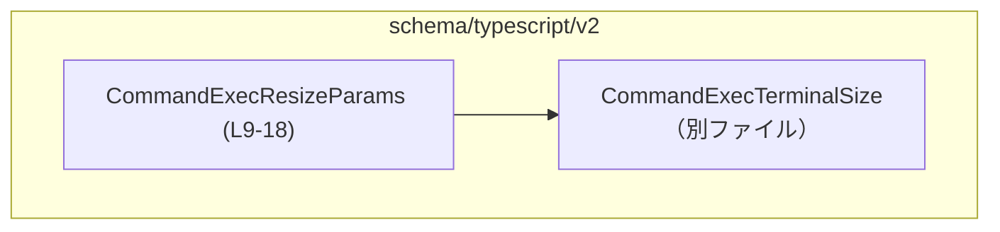
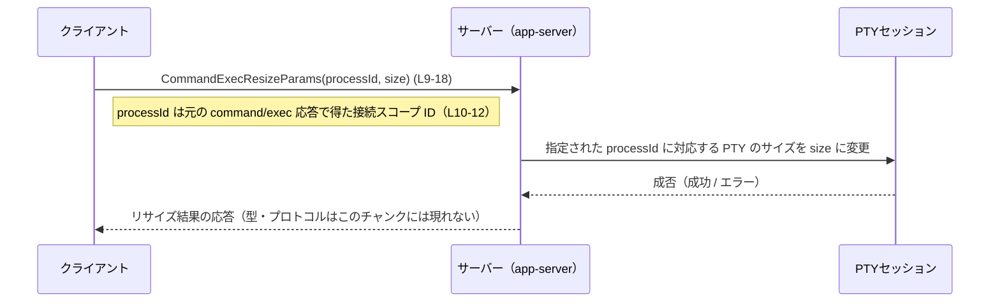

# app-server-protocol/schema/typescript/v2/CommandExecResizeParams.ts

## 0. ざっくり一言

PTY バックエンドの `command/exec` セッションに対して、「どのプロセスを」「どのサイズに」リサイズするかを表す **リクエストパラメータ型** を定義する、自動生成 TypeScript ファイルです（`CommandExecResizeParams.ts:L1-3, L6-8, L9-18`）。

---

## 1. このモジュールの役割

### 1.1 概要

- このモジュールは、実行中の PTY（擬似ターミナル）に裏付けされた `command/exec` セッションをリサイズするための **パラメータ型** `CommandExecResizeParams` を提供します（コメントより、`CommandExecResizeParams.ts:L6-8`）。
- クライアント側が送信する `processId` と、新しい端末サイズ `size` を 1 つのオブジェクトにまとめる役割を持ちます（`CommandExecResizeParams.ts:L10-12, L14-18`）。

### 1.2 アーキテクチャ内での位置づけ

- このファイルは **スキーマ定義層** に属し、アプリケーションロジックではなく、「どのような形のデータがやりとりされるか」を TypeScript の型として表現しています。
- 依存関係として、端末サイズを表す別ファイル `CommandExecTerminalSize` 型を import しています（`CommandExecResizeParams.ts:L4`）。

依存関係（型レベル）の簡易図:



※ `CommandExecTerminalSize` の中身はこのチャンクには現れないため不明です。

### 1.3 設計上のポイント

- **自動生成コード**  
  - 冒頭コメントから、本ファイルは `ts-rs` により自動生成されており、手動編集しないことが明示されています（`CommandExecResizeParams.ts:L1-3`）。
- **純粋な型定義のみ**  
  - 実行時ロジックや関数は一切含まれず、`export type` によるオブジェクト型のエイリアス定義のみです（`CommandExecResizeParams.ts:L9-18`）。
- **構造的型付け**  
  - TypeScript の構造的型システムにより、`processId` が `string`、`size` が `CommandExecTerminalSize` を満たす任意のオブジェクトであれば、この型として扱えます。
- **エラー・並行性**  
  - このファイルはコンパイル時の型情報のみを提供し、実行時エラー処理や並行実行（WebSocket の複数メッセージ処理など）は、すべて別の層で扱われる前提の構造になっています。

---

## 2. 主要な機能一覧（コンポーネントインベントリー）

このファイルが提供する主な「機能＝型」を列挙します。

- `CommandExecResizeParams`: 実行中 `command/exec` セッションをリサイズするリクエストのパラメータ型（`CommandExecResizeParams.ts:L9-18`）
- `processId` フィールド: 元の `command/exec` リクエストで払い出された、接続スコープの `processId` を表す（`CommandExecResizeParams.ts:L10-12, L14`）
- `size` フィールド: 新しい PTY サイズ（文字セル数）を表す `CommandExecTerminalSize` 型（`CommandExecResizeParams.ts:L15-18`）

---

## 3. 公開 API と詳細解説

### 3.1 型一覧（構造体・列挙体など）

| 名前                        | 種別                         | 役割 / 用途                                                                                     | 定義箇所                               |
|-----------------------------|------------------------------|--------------------------------------------------------------------------------------------------|----------------------------------------|
| `CommandExecResizeParams`   | オブジェクト型の型エイリアス | PTY バックエンド `command/exec` セッションのリサイズ要求のパラメータをまとめる                  | `CommandExecResizeParams.ts:L9-18`     |
| `CommandExecTerminalSize`   | import された型              | 新しい PTY サイズ（文字セル数）を表す。詳細は別ファイルのため、このチャンクからは不明          | `CommandExecResizeParams.ts:L4`        |

`CommandExecResizeParams` のフィールド詳細:

| フィールド名 | 型                         | 説明                                                                                                                      | 定義箇所                               |
|-------------|----------------------------|---------------------------------------------------------------------------------------------------------------------------|----------------------------------------|
| `processId` | `string`                   | クライアントが元の `command/exec` リクエストで受け取った、接続スコープの `processId`（コメントより）                     | `CommandExecResizeParams.ts:L10-12,14` |
| `size`      | `CommandExecTerminalSize`  | 新しい PTY のサイズ（文字セル単位）。具体的な構造は別ファイルだが、「文字セル数」とコメントされている（`L15-17`）       | `CommandExecResizeParams.ts:L15-18`    |

### 3.2 関数の詳細

- このファイルには **関数・メソッドは定義されていません**（`CommandExecResizeParams.ts:L1-18` 全体を確認）。

そのため、関数詳細テンプレートを適用すべき対象はありません。

### 3.3 その他の関数

- 補助関数やラッパー関数も、このチャンクには一切現れません。

---

## 4. データフロー（推定される利用シナリオ）

このファイルにはデータフローの実装コードはありませんが、コメントの説明から典型的な利用フローを推定できます（根拠: `Resize a running PTY-backed 'command/exec' session.` `CommandExecResizeParams.ts:L6-8`）。

想定されるシーケンス図（概念レベル、コードはこのチャンクにはありません）:



注意点:

- 上記フローはコメントと型名からの **推定** であり、実際のメッセージ名やトランスポート（WebSocket / HTTP など）は、このチャンクからは分かりません。
- `CommandExecResizeParams` 自体にはバリデーションやエラー処理は含まれず、純粋なデータコンテナとして振る舞います。

---

## 5. 使い方（How to Use）

### 5.1 基本的な使用方法

`CommandExecResizeParams` 型の値を作成し、何らかの RPC / メッセージ送信関数に渡す、という使い方が想定されます。

```typescript
import type { CommandExecResizeParams } from "./CommandExecResizeParams"; // 本ファイルの型を import する
import type { CommandExecTerminalSize } from "./CommandExecTerminalSize"; // 端末サイズ型（別ファイル）

// 新しいサイズを計算または取得する関数（アプリケーション側で定義する想定）
function getNewTerminalSize(): CommandExecTerminalSize {        // CommandExecTerminalSize を返す
    // 実装は利用者側の責務。このチャンクには定義がないためダミーを返す。
    throw new Error("not implemented");                         // サンプルのため未実装
}

// リサイズリクエストのペイロードを組み立てる
function buildResizeParams(processId: string): CommandExecResizeParams {
    const size = getNewTerminalSize();                          // 新しいサイズを取得
    return {                                                    // CommandExecResizeParams 型のオブジェクトを返す
        processId,                                              // 元の command/exec で得た ID
        size,                                                   // 新しい PTY サイズ
    };
}
```

このように、**型注釈** によって `processId` が文字列、`size` が `CommandExecTerminalSize` であることがコンパイル時に保証されます。

### 5.2 よくある使用パターン（想定）

※ ここでの使用パターンは、この型名とコメントからの一般的な想定であり、実際の呼び出し元コードはこのチャンクには存在しません。

1. **ウィンドウリサイズイベントに応じて送信する**
   - ブラウザやターミナル UI のリサイズにフックし、都度 `CommandExecResizeParams` を構築してサーバーへ送信する。
2. **初回接続後の補正リサイズ**
   - `command/exec` 開始直後はデフォルトサイズで開始し、その直後に実際のクライアントビューサイズへリサイズするために利用する。

### 5.3 よくある間違い（起こり得る誤用の例）

コードから直接は確認できませんが、コメントに書かれた契約（`connection-scoped processId`）から、次のような誤用が問題になり得ます。

```typescript
// 誤りの可能性がある例: 別の接続の processId を使い回してしまう
const paramsWrong: CommandExecResizeParams = {
    processId: "old-connection-process-id",  // 接続が変わったのに古い ID を利用している
    size: someSize,
};

// 望ましい例: 現在の接続に紐づく processId を利用する
const paramsCorrect: CommandExecResizeParams = {
    processId: currentConnection.processId,  // 接続スコープで有効な ID
    size: someSize,
};
```

> ※ 上記 `currentConnection` や `someSize` は利用者アプリケーション側で定義される概念であり、このチャンクには登場しません。

### 5.4 使用上の注意点（まとめ）

- **接続スコープの `processId` を使うこと**  
  コメントに「connection-scoped `processId`」とあるため（`CommandExecResizeParams.ts:L10-12`）、他の接続やユーザーの `processId` を混在させないことが重要です。サーバー側のセキュリティに依存しますが、クライアント側でも意図しない ID を送らない設計が望ましいです。
- **バリデーションは別層の責務**  
  この型自体は値の妥当性（存在する `processId` か、サイズが非負かなど）をチェックしません。実際のチェックはサーバー側や上位ロジックで行う必要があります。
- **高頻度リサイズによる負荷**  
  TypeScript の型としては制限しませんが、UI のリサイズイベントをそのまま高頻度で送るとサーバー負荷が高くなる可能性があります。デバウンスやスロットリングはアプリケーションレベルで考慮する必要があります。
- **並行性について**  
  この型はただのデータ構造であり、JavaScript のイベントループ上でどのタイミングでどの順序で扱うかは利用側に依存します。同じ `processId` に対して短時間に複数のリサイズ要求を投げた場合の扱い（どれが最終的に有効になるか）は、このチャンクからは分かりません。

---

## 6. 変更の仕方（How to Modify）

### 6.1 新しい機能を追加する場合

- 冒頭コメントにある通り、このファイルは `ts-rs` によって自動生成されており、**手で編集すべきではありません**（`CommandExecResizeParams.ts:L1-3`）。
- 新しいフィールドを追加したい場合や構造を変えたい場合は、**元になっている Rust 側（`ts-rs` の入力）** の定義を変更し、その上で再生成する必要があります。
  - Rust 側で構造体フィールドを追加 → `ts-rs` を再実行 → 本ファイルが更新される、という流れが想定されます（ただし Rust 側のファイル名・型名はこのチャンクには現れないため不明）。

変更時の注意:

- 既存クライアントとの互換性:  
  フィールドを削除・型変更するとクライアントコードがコンパイルエラーになったり、実行時に古いクライアントが期待しないペイロードを受け取る可能性があります。
- `CommandExecTerminalSize` への影響:  
  サイズ表現を変更したい場合は `CommandExecTerminalSize` 側の定義変更になるため、このファイルを直接編集してはいけません（`CommandExecResizeParams.ts:L4`）。

### 6.2 既存の機能を変更する場合

- **`processId` の意味を変えたい**  
  - 例えば「接続スコープ」から「グローバルスコープ」に意味を変えるといった変更は、コメントとサーバー側実装の両方の更新が必要になります。
  - このファイルのコメント（`CommandExecResizeParams.ts:L10-12`）も生成元から変わるはずなので、まずは生成元を修正する必要があります。
- **サイズの扱いを変更したい**  
  - 文字セルではなくピクセル単位にしたいなどの変更は `CommandExecTerminalSize` 側の責務です。このファイルはそれを参照するだけです。

影響範囲の確認例:

- TypeScript 側では、`CommandExecResizeParams` を import している全ファイルを検索し、  
  新しいフィールドや意味に合わせてコード・テストを更新する必要があります。
- テストコードはこのチャンクには存在しませんが、通常は:
  - `command/exec` の開始・リサイズ・終了に関する統合テスト
  - 異常な `processId` やサイズを送った場合のエラーハンドリングテスト  
  などが影響範囲となります（実在するかどうかはこのチャンクからは不明）。

---

## 7. 関連ファイル

このモジュールと直接関係が確認できるファイルは次の通りです。

| パス / シンボル                       | 役割 / 関係                                                                                 | 根拠                                     |
|---------------------------------------|--------------------------------------------------------------------------------------------|------------------------------------------|
| `./CommandExecTerminalSize`           | 新しい PTY サイズを表す型。`size` フィールドの型として利用される                         | import 文 `CommandExecResizeParams.ts:L4` |
| Rust 側の `ts-rs` 入力（詳細不明）   | 本 TypeScript 型の生成元。`ts-rs` のコメントから存在が示唆されるが、場所・名前は不明     | 自動生成コメント `CommandExecResizeParams.ts:L1-3` |

テストコードや実際の RPC ハンドラ、`command/exec` 開始時に `processId` を払い出すロジックなどは、このチャンクには現れないため、「どのファイルか」「どう実装されているか」は不明です。

---

### 付記: バグ・セキュリティ・パフォーマンス観点（簡潔な整理）

- **バグの可能性（型レベル）**  
  - このファイル自体は単純な型定義のみであり、ロジック上のバグはほぼ考えにくい構造です。
- **セキュリティ面**  
  - `processId` はクライアントから送られる任意の `string` なので、サーバー側で「接続スコープか」「権限があるか」を検証する必要があります。  
    ただし、その検証ロジックはこのファイルには含まれていません。
- **パフォーマンス・スケーラビリティ**  
  - 型定義自体はパフォーマンスへの影響はほぼありません。  
  - 実運用では、リサイズメッセージの頻度とサーバー側 PTY 操作のコストがスケーラビリティに影響する点に注意が必要ですが、それはアプリケーションロジック側の関心事です。
- **観測性（ログ・メトリクス）**  
  - この型にはログやメトリクスの仕組みは含まれません。  
  - リサイズ処理の成功・失敗や頻度を観測したい場合は、`CommandExecResizeParams` を受け取るハンドラ側でログやメトリクスを記録する必要があります。
