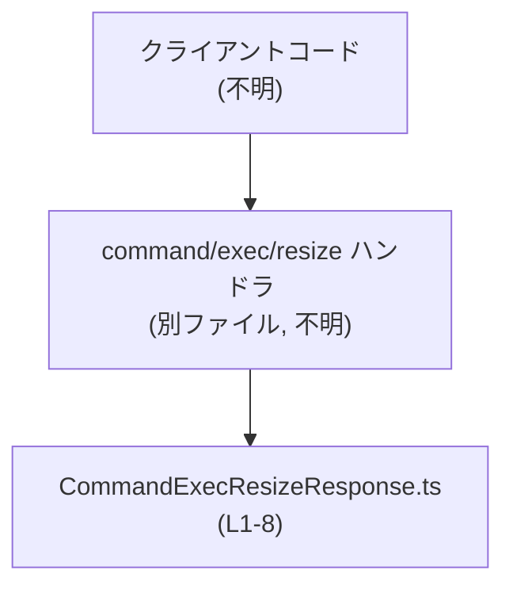
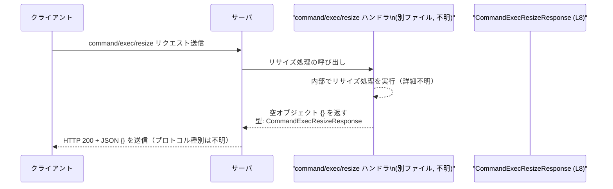

app-server-protocol/schema/typescript/v2/CommandExecResizeResponse.ts コード解説
---

## 0. ざっくり一言

`command/exec/resize` という操作の「成功時レスポンス」を、**中身が空であることを型レベルで表現した TypeScript 型定義**です（根拠: CommandExecResizeResponse.ts:L5-8）。

---

## 1. このモジュールの役割

### 1.1 概要

- このモジュールは、`command/exec/resize` というコマンドの成功レスポンスを表現するための **型エイリアス** を 1 つだけ提供します（根拠: CommandExecResizeResponse.ts:L5-8）。
- レスポンスボディにはフィールドが一切存在しないことを、`Record<string, never>` を使って型として表現しています（根拠: CommandExecResizeResponse.ts:L8）。

### 1.2 アーキテクチャ内での位置づけ

- ファイルパスから、この型は「アプリケーションサーバのプロトコル定義（TypeScript v2 スキーマ）」の一部と位置づけられます（根拠: ファイルパス）。
- このファイル自体はほかのモジュールを import しておらず、**純粋な型定義モジュール**です（根拠: CommandExecResizeResponse.ts:L1-8）。
- 実際にどの関数・モジュールから参照されるかは、このチャンクには現れません（不明）。

依存関係イメージ（利用側は推測であり、このチャンクには現れません）:



### 1.3 設計上のポイント

- **自動生成コード**  
  - ファイル先頭に「GENERATED CODE」「Do not edit this file manually」とあり、自動生成されたコードであることが明示されています（根拠: CommandExecResizeResponse.ts:L1-3）。
  - `ts-rs` というツールから生成されていることがコメントに書かれています（根拠: CommandExecResizeResponse.ts:L3）。
- **責務の明確な分離**  
  - このモジュールはビジネスロジックを一切持たず、プロトコルの型定義だけを担います（根拠: CommandExecResizeResponse.ts:L5-8）。
- **状態・並行性**  
  - 型エイリアスのみを定義し、状態（state）を保持しません。
  - 実行時の処理や並行性に関わるコードは一切含まれていないため、このファイル自体には並行性に起因する問題はありません（根拠: CommandExecResizeResponse.ts:L1-8）。
- **エラーハンドリング**  
  - 成功レスポンス専用の型であり、エラー情報を表現する仕組みは含まれていません（根拠: コメント "Empty success response" CommandExecResizeResponse.ts:L5-7）。

---

## 2. 主要な機能一覧

このファイルの「機能」は 1 つの公開型エイリアスに集約されています。

- `CommandExecResizeResponse`: `command/exec/resize` 成功時のレスポンスボディが「空オブジェクト」であることを表現する型（根拠: CommandExecResizeResponse.ts:L5-8）。

---

## 3. 公開 API と詳細解説

### 3.1 型一覧（構造体・列挙体など）

| 名前                         | 種別       | 役割 / 用途                                                                                 | 定義位置                                   |
|------------------------------|------------|---------------------------------------------------------------------------------------------|--------------------------------------------|
| `CommandExecResizeResponse`  | 型エイリアス | `command/exec/resize` 操作の成功レスポンスボディを表現する。値は「キーを持たないオブジェクト」に限定されることを意図している。 | CommandExecResizeResponse.ts:L5-8          |

補足:

- 実体は `Record<string, never>` です（根拠: CommandExecResizeResponse.ts:L8）。
- `Record<K, V>` は TypeScript 標準のユーティリティ型で、「キーが `K` 型で値が `V` 型のオブジェクト」を表します。
- `never` は「値を持ち得ない型」であり、`Record<string, never>` とすることで「任意のキーを想定しない」ことを型レベルで表現します（型システムの仕様による一般知識）。

### 3.2 関数詳細（最大 7 件）

このファイルには **関数・メソッドは定義されていません**（根拠: CommandExecResizeResponse.ts:L1-8）。

### 3.3 その他の関数

このファイルには **補助的な関数も存在しません**（根拠: CommandExecResizeResponse.ts:L1-8）。

---

## 4. データフロー

### 4.1 代表的な処理シナリオ

コメントから、この型は `command/exec/resize` という操作の **「成功レスポンス」** を表すことが読み取れます（根拠: CommandExecResizeResponse.ts:L5-7）。  
実際のハンドラや通信処理はこのチャンクには現れませんが、典型的なデータフローは次のように解釈できます。

1. クライアントが `command/exec/resize` リクエストを送信する（HTTP/WebSocket/API RPC など、具体的プロトコルは不明）。
2. サーバ側でリサイズ処理を行う。
3. 処理が成功した場合、サーバはレスポンスボディとして **空オブジェクト `{}`** を返す。その型が `CommandExecResizeResponse` です（根拠: "Empty success response" および `Record<string, never>` CommandExecResizeResponse.ts:L5-8）。
4. クライアントはレスポンスボディの中身ではなく、ステータスコードや外側のメタデータを見て成功を判断する想定と考えられます（コメントからの解釈。実装コードはこのチャンクには現れません）。

### 4.2 シーケンス図（イメージ）

実装は他ファイルですが、本型が使われると考えられる典型的な流れを図示します。



この図はコメントに基づく**典型例**であり、実際の呼び出し元・プロトコルはこのチャンクには現れません。

---

## 5. 使い方（How to Use）

### 5.1 基本的な使用方法

`CommandExecResizeResponse` を **API クライアントの戻り値の型**として利用する例です。  
ここではこのファイルを同じディレクトリに `CommandExecResizeResponse.ts` として配置している前提のサンプルです。

```typescript
// CommandExecResizeResponse 型をインポートする                          // 型だけをインポートする
import type { CommandExecResizeResponse } from "./CommandExecResizeResponse"; // CommandExecResizeResponse.ts:L8

// command/exec/resize API を呼び出すクライアント関数の例                 // リサイズAPIを呼び出す関数の例
async function resizeCommandExec(                                       // 非同期関数として定義
    sessionId: string,                                                  // セッションID
    size: { cols: number; rows: number }                                // 変更後のサイズ
): Promise<CommandExecResizeResponse> {                                 // 戻り値の型に CommandExecResizeResponse を指定
    const response = await fetch("/api/command/exec/resize", {          // APIエンドポイントへのHTTPリクエスト（例）
        method: "POST",                                                 // POSTメソッドを利用
        headers: { "Content-Type": "application/json" },                // JSONとして送信
        body: JSON.stringify({ sessionId, size }),                      // リクエストボディをJSON文字列に変換
    });

    if (!response.ok) {                                                 // HTTPステータスコードが 2xx 以外の場合
        throw new Error(`Resize failed: ${response.status}`);           // エラーとして扱う（エラー型は例）
    }

    // レスポンスボディは空オブジェクト {} を想定                        // 成功時は中身のないJSONオブジェクトを想定
    const body: CommandExecResizeResponse = await response.json();      // 型注釈で CommandExecResizeResponse を適用

    // body は {} しか許されないため、ここでは中身を使わない            // フィールドは存在しない前提なので内容は参照しない
    return body;                                                        // 呼び出し元へ返す
}
```

この例では、成功時には `body` が **空オブジェクト `{}`** であることを `CommandExecResizeResponse` によって型レベルで示しています（根拠: CommandExecResizeResponse.ts:L5-8）。

### 5.2 よくある使用パターン

1. **成功レスポンスを型で区別したい場合**

   ```typescript
   import type { CommandExecResizeResponse } from "./CommandExecResizeResponse"; // L8

   // 成功と失敗をまとめて扱うための共用体型を定義する例                // 正常/異常を一つの型にまとめる例
   type ResizeResult =
       | { ok: true; value: CommandExecResizeResponse }                // 成功時は空オブジェクトを返す
       | { ok: false; error: { code: string; message: string } };      // 失敗時はエラー情報を持つ（例）

   async function resize(...): Promise<ResizeResult> {                 // 戻り値に ResizeResult を利用
       // 実装は省略（このチャンクには存在しない）                      // 実処理は別ファイル
       throw new Error("not implemented");
   }
   ```

   ここでは `CommandExecResizeResponse` が「成功ケース」であることを意味するラッパー型の一部として利用されています。

2. **値を無視する用途**

   成功時に特に利用すべき値がないため、呼び出し側では「戻り値を無視する」パターンもよくあります。

   ```typescript
   async function example() {
       // 戻り値の空オブジェクトには興味がない場合                      // 成功したかだけ見たい場合
       await resizeCommandExec("session-1", { cols: 80, rows: 24 });   // 戻り値を変数に束縛しない
       // ここまで来れば成功とみなせる                                 // 例外が投げられていなければ成功
   }
   ```

### 5.3 よくある間違い

1. **プロパティを追加しようとする**

```typescript
import type { CommandExecResizeResponse } from "./CommandExecResizeResponse";

// 間違い例: プロパティを持たせようとする                             // CommandExecResizeResponse は空オブジェクトを表す
// const res: CommandExecResizeResponse = { message: "ok" };           // コンパイルエラーになる

// 正しい例: 空オブジェクトのみを代入する                             // プロパティを持たないオブジェクトだけが許される
const res: CommandExecResizeResponse = {};                             // OK
```

- `Record<string, never>` であるため、`{ message: "ok" }` のようにプロパティを持つオブジェクトを代入すると、TypeScript の型チェックでエラーになります（根拠: CommandExecResizeResponse.ts:L8）。

1. **この型を「汎用のレスポンス型」と誤解する**

- `CommandExecResizeResponse` は **特定の操作 (`command/exec/resize`) 専用**であり、ほかの API のレスポンスに流用すると意図が曖昧になります（根拠: コメント内の具体名 CommandExecResizeResponse.ts:L5-7）。

### 5.4 使用上の注意点（まとめ）

- **前提条件**
  - `CommandExecResizeResponse` は「成功かどうか」の情報自体を持ちません。成功・失敗はステータスコードや別のラッパー型で判断する必要があります（根拠: "Empty success response" CommandExecResizeResponse.ts:L5-7）。
- **禁止事項 / 注意**
  - コメントに「Do not edit this file manually」とあるため、このファイルを直接編集することは前提にされていません（根拠: CommandExecResizeResponse.ts:L1-3）。
  - レスポンスに何らかの情報を追加したい場合、このファイルではなく生成元のスキーマ定義を変更する必要があります（自動生成コードであることからの合理的な解釈）。
- **安全性・エラー・並行性**
  - この型はコンパイル時の型チェックにのみ影響し、実行時の副作用や並行性には関与しません（根拠: 型定義のみである CommandExecResizeResponse.ts:L8）。
  - セキュリティ上の懸念は、この型そのものからは特に読み取れません。バリデーションや認可は他の層で行われる想定です（このチャンクには現れません）。
- **パフォーマンス**
  - 型定義のみであり、実行時のパフォーマンスに直接の影響はありません。

---

## 6. 変更の仕方（How to Modify）

### 6.1 新しい機能を追加する場合

コメントにある通り、このファイルは `ts-rs` によって生成されたコードであり、手動編集は想定されていません（根拠: CommandExecResizeResponse.ts:L1-3）。

新しい機能（例: レスポンスにメタ情報を追加するなど）を追加したい場合、一般的には次のような流れになります:

1. **生成元のスキーマ・Rust 側定義を変更する**
   - `ts-rs` は通常、Rust の型定義から TypeScript 型を生成します。  
   - コメントからも、そのようなパイプラインが存在することが示唆されます（根拠: CommandExecResizeResponse.ts:L3）。
   - 具体的な生成元ファイルはこのチャンクには現れないため、「どのファイルか」は不明です。

2. **コード生成を再実行する**
   - `ts-rs` のコード生成コマンド（例: `cargo test` / `build` 時に自動生成など）を再実行し、新しい型定義を生成します。
   - これにより、このファイルが上書きされます。

3. **利用側コードの修正**
   - 新たに追加されたプロパティを利用する場合、クライアント側などで `CommandExecResizeResponse` 型に基づいたアクセスを追加します。
   - どの利用箇所があるかは、このチャンクからは不明です。

### 6.2 既存の機能を変更する場合

例えば、「レスポンスを空ではなく、`{ success: true }` のような形にしたい」など、既存の契約を変更する場合には次の点に注意する必要があります。

- **影響範囲の確認**
  - `CommandExecResizeResponse` を参照している全てのクライアント・サーバコードに影響します。
  - このチャンクには参照元が現れないため、実際の影響範囲の特定は別途コードベース全体の検索が必要です。

- **契約（コントラクト）の変更**
  - 現在の型は「空オブジェクト」を前提とした契約です（根拠: CommandExecResizeResponse.ts:L5-8）。
  - プロパティを追加すると、既存クライアントがそのプロパティを使っていない場合は問題にならないこともありますが、「空」であることに依存したコードがある場合には動作変更になります。

- **テスト**
  - このチャンクにはテストコードが含まれていません（根拠: CommandExecResizeResponse.ts:L1-8）。
  - プロトコルレベルの変更を行う場合、エンドツーエンドテストや API 契約テストの追加・更新が必要になります。

---

## 7. 関連ファイル

このファイルからの **import / export 関係** は次の通りです。

- `export type CommandExecResizeResponse = ...;` のみが定義されており、他のファイルの import はありません（根拠: CommandExecResizeResponse.ts:L1-8）。

したがって、このチャンクから直接わかる関連ファイルは存在しませんが、論理的に関係があると考えられるファイル種別を整理します（具体的なパスは不明です）。

| パス / 種別                    | 役割 / 関係                                             |
|--------------------------------|----------------------------------------------------------|
| （不明）`command/exec/resize` リクエスト型定義 | 同じプロトコルのリクエスト側のスキーマ。対になる存在があると考えられますが、このチャンクには現れません。 |
| （不明）`command/exec/resize` ハンドラ実装     | 実際にリサイズを行い、成功時に `CommandExecResizeResponse` 相当の値（空オブジェクト）を返す処理。 |
| Rust 側の元定義ファイル（不明）              | `ts-rs` によってこの型が生成される元となる Rust の型定義。コメントから存在が示唆されますが、ファイル名は不明です。 |

---

### まとめ

- このファイルは、`command/exec/resize` の **成功レスポンスが中身のないオブジェクトである**ことを TypeScript の型として表現する、極めて小さな自動生成モジュールです（根拠: CommandExecResizeResponse.ts:L5-8）。
- 型定義のみを含み、実行時のロジック・並行性・エラーハンドリングの実装は一切含まれません。
- 変更や拡張が必要な場合は、コメントにある通り、直接編集ではなく生成元のスキーマ（Rust 側など）を更新する必要があります（根拠: CommandExecResizeResponse.ts:L1-3）。
