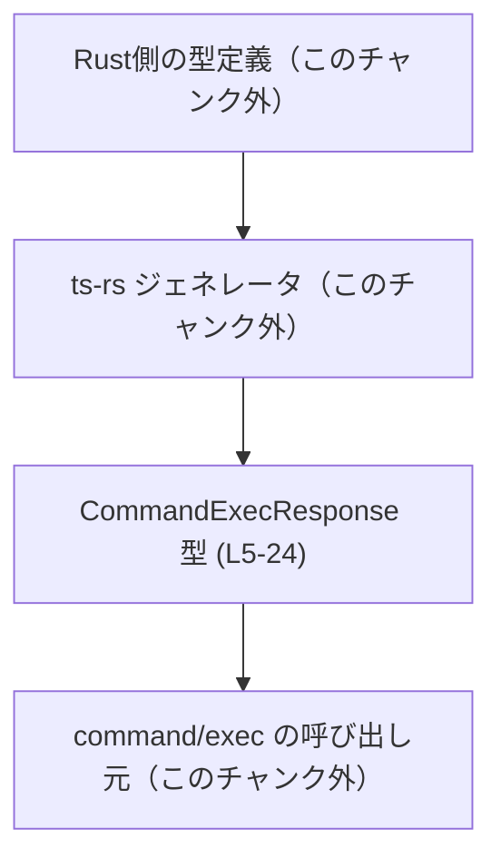
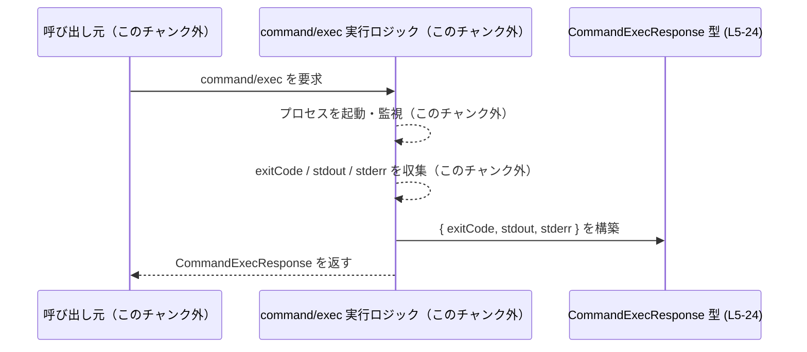

# app-server-protocol/schema/typescript/v2/CommandExecResponse.ts コード解説

## 0. ざっくり一言

`command/exec` の「最終的なバッファ済み結果」を表現するための、TypeScript のレスポンス型エイリアスです（`exitCode`, `stdout`, `stderr` の3つのフィールドを持つ単純なデータ構造）。  
`CommandExecResponse.ts:L5-24`

---

## 1. このモジュールの役割

### 1.1 概要

- このファイルは、`command/exec` 操作の最終結果を表現するための **型定義** を提供します。  
  `CommandExecResponse.ts:L5-8`
- 実際のコマンド実行ロジックやネットワーク通信は一切含まず、結果として得られるデータの形だけを規定しています。
- コメントによると、標準出力・標準エラーがストリーミングされた場合には、それぞれのバッファ文字列は空になる、という契約が記述されています。  
  `CommandExecResponse.ts:L13-17, L19-23`

### 1.2 アーキテクチャ内での位置づけ

このファイルから読み取れる範囲では、以下のような位置づけになります。

- Rust 側の型定義から `ts-rs` により自動生成された TypeScript 型エイリアスであることがコメントから分かります。  
  `CommandExecResponse.ts:L1-3`
- `command/exec` の実装本体や、その結果を受け取るクライアントコードはこのチャンクには現れません（不明）。

概念的な依存関係を Mermaid で表すと、次のようになります（実装本体・呼び出し元は「このチャンク外」であることを明示しています）。



### 1.3 設計上のポイント

コードから読み取れる設計上の特徴は次のとおりです。

- **自動生成コード**  
  - 冒頭コメントにより、「手で編集しない」前提の自動生成ファイルであることが明示されています。  
    `CommandExecResponse.ts:L1-3`
- **シンプルなデータキャリア**  
  - `export type CommandExecResponse = { ... }` というオブジェクト型エイリアスのみを定義し、ロジックやメソッドは持ちません。  
    `CommandExecResponse.ts:L8-24`
- **バッファ結果とストリーミングの区別**  
  - `stdout`, `stderr` フィールドのコメントに、ストリーミングされた場合は空文字列になるという仕様が書かれています。  
    `CommandExecResponse.ts:L13-17, L19-23`
- **状態を持たない不変データ**  
  - ただのオブジェクト型であり、ミューテーションロジックは一切含まれません。スレッド / タスク間で共有しても（TypeScript の観点では）安全な、「単なる値」として扱われます。

---

## 2. 主要な機能一覧

このファイルには関数はなく、1つの公開型とそのフィールドが主な「機能」です。

- `CommandExecResponse`: `command/exec` の最終結果を表すレスポンス型。`exitCode`, `stdout`, `stderr` を保持する。  
  `CommandExecResponse.ts:L5-24`
- `exitCode`: プロセスの終了コードを表す数値フィールド。  
  `CommandExecResponse.ts:L9-12`
- `stdout`: バッファされた標準出力内容を表す文字列フィールド（ストリーミング時は空）。  
  `CommandExecResponse.ts:L13-18`
- `stderr`: バッファされた標準エラー内容を表す文字列フィールド（ストリーミング時は空）。  
  `CommandExecResponse.ts:L19-24`

---

## 3. 公開 API と詳細解説

### 3.1 型一覧（構造体・列挙体など）

| 名前                   | 種別          | 役割 / 用途                                                                                       | 定義位置                              |
|------------------------|---------------|----------------------------------------------------------------------------------------------------|----------------------------------------|
| `CommandExecResponse`  | 型エイリアス  | `command/exec` の「最終的なバッファ済み結果」を表現するレスポンス型。`exitCode`, `stdout`, `stderr` を保持する。 | `CommandExecResponse.ts:L5-24`         |

#### `CommandExecResponse` のフィールド一覧

| フィールド名 | 型      | 説明                                                                                                     | 定義位置                               |
|--------------|---------|----------------------------------------------------------------------------------------------------------|----------------------------------------|
| `exitCode`   | `number` | プロセスの終了コード。具体的な値の意味づけ（0 が成功かなど）はこのファイル内では定義されていません。  | `CommandExecResponse.ts:L9-12`         |
| `stdout`     | `string` | バッファされた標準出力。`command/exec/outputDelta` によってストリーミングされた場合は空文字列とされる。 | `CommandExecResponse.ts:L13-18`        |
| `stderr`     | `string` | バッファされた標準エラー。`command/exec/outputDelta` によってストリーミングされた場合は空文字列とされる。| `CommandExecResponse.ts:L19-24`        |

### 3.2 「関数詳細」相当: `CommandExecResponse` 型の詳細

このファイルには関数が存在しないため、本セクションでは同じフォーマットを用いて **`CommandExecResponse` 型そのもの** を詳細化します。

#### `CommandExecResponse`

**概要**

- `command/exec` 操作の「最終的なバッファ済み結果」を表現するオブジェクト型です。  
  `CommandExecResponse.ts:L5-7`
- プロセスの終了コードと、標準出力・標準エラーのバッファ内容を 3 つのフィールドに分けて保持します。  
  `CommandExecResponse.ts:L8-24`

**フィールド**

| フィールド名 | 型       | 説明 | 根拠 |
|--------------|----------|------|------|
| `exitCode`   | `number` | プロセスの終了コードを表す数値です。                             | `CommandExecResponse.ts:L9-12`  |
| `stdout`     | `string` | バッファされた標準出力。ストリーミングされていた場合は空になります。 | `CommandExecResponse.ts:L13-18` |
| `stderr`     | `string` | バッファされた標準エラー。ストリーミングされていた場合は空になります。| `CommandExecResponse.ts:L19-24` |

**オブジェクト全体の意味（戻り値相当）**

- 1 つのコマンド実行に対する「まとめられた結果」を 3 フィールドに分割して保持する構造です。
- この型がどの関数から返されるか、どの通信プロトコルで用いられるかは、このチャンクには現れません（不明）。

**内部構造のポイント**

- TypeScript の観点では、`number` と `string` の組み合わせからなる単純な構造体に相当します。  
  `CommandExecResponse.ts:L8-24`
- 任意の JavaScript オブジェクトがこの形に準拠しているとコンパイラが判断すれば、構造的部分型システムにより `CommandExecResponse` として扱われます。

**Examples（使用例）**

以下は、`CommandExecResponse` を引数として受け取り、結果をログに出力する例です。

```typescript
// CommandExecResponse 型をインポートする                           // 型定義を利用側に読み込む
import type { CommandExecResponse } from "./CommandExecResponse";  // 相対パスはプロジェクト構成に合わせて変更

// コマンド実行結果を処理する関数                                   // 実行結果をログ出力する処理
function logCommandResult(result: CommandExecResponse): void {     // result は CommandExecResponse 型
    console.log("exitCode:", result.exitCode);                     // 終了コードを出力
    console.log("stdout:", result.stdout);                         // 標準出力バッファを出力
    console.log("stderr:", result.stderr);                         // 標準エラーバッファを出力
}
```

非同期 API からの戻り値として利用する例です。

```typescript
import type { CommandExecResponse } from "./CommandExecResponse";

// コマンドを実行し、その結果を Promise で返すと仮定した関数           // 実際の実装はこのチャンクには存在しない想定コード
declare function runCommand(cmd: string): Promise<CommandExecResponse>;

async function main() {
    const result = await runCommand("ls -la");                     // CommandExecResponse 型の結果を受け取る
    if (result.exitCode === 0) {                                   // exitCode を用いて判定
        console.log("Command succeeded");
        console.log(result.stdout);
    } else {
        console.error("Command failed with code", result.exitCode);
        console.error(result.stderr);
    }
}
```

**Errors / Panics**

- このファイルは **型定義のみ** を含み、実行時の処理ロジックを持ちません。そのため、型自体がエラーや例外を発生させることはありません。
- TypeScript の型としては、すべてのフィールドが必須 (`?` が付いていない) であり、`exitCode` が `number` でない、`stdout`/`stderr` が `string` でないオブジェクトを `CommandExecResponse` として扱うと、コンパイル時にエラーとなります。
- 実行時（JavaScript）には型情報が消えるため、外部データから復元する場合は **ランタイムバリデーション** を別途実装しない限り、不正な形のオブジェクトが紛れ込む可能性があります。

**Edge cases（エッジケース）**

- `exitCode` の値域  
  - 型としては単なる `number` であり、負の値や非常に大きな数値も許容されます。  
    プロセス終了コードとして妥当かどうかの検証は、このファイルからは分かりません（不明）。
- `stdout` / `stderr` が空文字列 (`""`) の場合  
  - コメントにより、「対応するストリームが `command/exec/outputDelta` 経由でストリーミングされた場合は空になる」と記載されています。  
    `CommandExecResponse.ts:L13-17, L19-23`
  - 実際に何も出力がなかった場合も空文字列になり得るかどうかは、このチャンクからは判断できません（不明）。
- 文字コードやバイナリデータ  
  - 値は `string` 型であり、バイナリデータがどのようにエンコードされるか（例: Base64 など）は記載されていません（不明）。

**使用上の注意点**

- **ストリーミングとの併用**  
  - `stdout` / `stderr` が空でも、「出力がなかった」のか「ストリーミングされた」のか区別がつかない可能性があります。  
    コメントにはストリーミング時に空になることだけが明記されており、その他のケースについてはこのチャンクには記載がありません。
- **型安全性（TypeScript 固有の観点）**  
  - この型を利用することで、`exitCode` を誤って文字列扱いする、`stdout` に数値を代入する、といった誤用をコンパイル時に防ぐことができます。
- **ランタイム安全性**  
  - 外部プロセスからの出力をそのまま格納する構造であるため、`stdout` / `stderr` の内容は信頼できない入力として扱う必要があります（例: HTML に埋め込む場合のエスケープなど）。  
    ただし、そのようなセキュリティ対策の実装はこのファイルには含まれません。
- **並行性 / 非同期処理**  
  - 型自体は不変なプレーンオブジェクトであり、複数の非同期タスク間で共有しても TypeScript の観点では問題ありません。  
  - ただし、同一の変数を複数箇所から書き換えるようなコードを書くと、通常の JavaScript 同様に競合状態が発生し得ます。これはこの型に固有の問題ではありません。

### 3.3 その他の関数

- このファイルには関数・メソッド・補助的なラッパーは一切定義されていません。  
  `CommandExecResponse.ts:L1-24`

---

## 4. データフロー

このチャンクには実際の処理ロジックは含まれていませんが、コメントに基づき、`CommandExecResponse` がどのようなデータフローの中で利用されるかの **概念図** を示します。

- `command/exec` の実行ロジック（このチャンク外）がプロセスを起動し、その終了コードと標準出力・標準エラーを収集する。
- その結果を `CommandExecResponse` 型のオブジェクトに詰め、呼び出し元に返す。
- `stdout` / `stderr` は、出力の一部または全部がストリーミングされている場合には空になる、とコメントに記載されています。  
  `CommandExecResponse.ts:L13-17, L19-23`



> 注: `Caller` と `Exec` は、この TypeScript ファイルには登場しない抽象的なコンポーネントです。  
> 実際にどのモジュール・サービスがこれらの役割を担うかは、このチャンクからは分かりません。

---

## 5. 使い方（How to Use）

### 5.1 基本的な使用方法

典型的な利用方法は、「コマンド実行 API の結果として `CommandExecResponse` を受け取り、終了コードと出力を評価する」というパターンです。

```typescript
import type { CommandExecResponse } from "./CommandExecResponse";

// コマンド結果を処理して、成功/失敗を呼び出し元に返す関数           // CommandExecResponse 型をそのまま利用する例
function isCommandSuccess(result: CommandExecResponse): boolean {
    // このファイルでは exitCode の意味は定義されていないため          // ここでは一般的な慣習に従い 0 なら成功とする例を示す
    return result.exitCode === 0;                                      // （実際の意味付けは呼び出し側の契約に依存）
}

// 実行結果をログにまとめて表示する例
function printCommandSummary(result: CommandExecResponse): void {
    console.log(`Exit code: ${result.exitCode}`);
    console.log("=== STDOUT ===");
    console.log(result.stdout);
    console.log("=== STDERR ===");
    console.log(result.stderr);
}
```

> 備考: 上記の「0 を成功とみなす」判定は一般的な UNIX 的慣習による例示であり、この型定義自体がその契約を保証しているわけではありません。

### 5.2 よくある使用パターン

1. **終了コードに基づく分岐処理**

```typescript
import type { CommandExecResponse } from "./CommandExecResponse";

function handleResult(result: CommandExecResponse) {
    if (result.exitCode === 0) {
        // 正常終了とみなす処理                                      // 実際の成功条件はプロジェクトの契約に依存
        console.log("OK:", result.stdout);
    } else {
        // エラーとして扱う処理                                      // stderr を中心にログを採取するなど
        console.error("Command failed:", result.exitCode);
        console.error(result.stderr);
    }
}
```

1. **ストリーミングとの組み合わせを考慮した処理**

コメントによるストリーミング仕様を踏まえた例です。

```typescript
import type { CommandExecResponse } from "./CommandExecResponse";

function handleStreamingAware(result: CommandExecResponse) {
    const hasBufferedStdout = result.stdout.length > 0;         // バッファされた出力があるか確認
    const hasBufferedStderr = result.stderr.length > 0;

    // stdout/stderr が空でも、ストリーミングされていた可能性があることに注意
    if (!hasBufferedStdout) {
        console.log("stdout is empty (no buffered output or streamed).");
    }
    if (!hasBufferedStderr) {
        console.log("stderr is empty (no buffered output or streamed).");
    }
}
```

### 5.3 よくある間違い

この型から推測される、起こりやすそうな誤用例とその修正例です。

```typescript
import type { CommandExecResponse } from "./CommandExecResponse";

// 誤り例: stdout が空なら「出力が一切なかった」と決めつけている
function wrongAssumption(result: CommandExecResponse) {
    if (result.stdout === "") {
        console.log("Command produced absolutely no output.");  // ストリーミングされていた場合も空になる可能性がある
    }
}

// 修正例: コメントで示されているストリーミング可能性を考慮したメッセージにする
function saferAssumption(result: CommandExecResponse) {
    if (result.stdout === "") {
        console.log("No buffered stdout (either no output or streamed elsewhere).");
    }
}
```

```typescript
// 誤り例: exitCode を文字列として扱ってしまう
function wrongTypeUsage(result: any) {
    // any を使うと型チェックが効かない                             // TypeScript の型安全性が失われる
    console.log("Exit code length:", result.exitCode.length);   // 実行時エラーの可能性
}

// 正しい例: CommandExecResponse 型として扱い、number として利用する
function correctTypeUsage(result: CommandExecResponse) {
    console.log("Exit code:", result.exitCode);                 // number 型として扱う
}
```

### 5.4 使用上の注意点（まとめ）

- **型の信頼範囲**  
  - `CommandExecResponse` はコンパイル時の型安全性を提供しますが、外部から受け取るデータについては別途バリデーションを行う必要があります。
- **ストリーミングとの関係**  
  - `stdout` / `stderr` が空であることの意味は一意ではなく、「バッファが空」なのか「ストリーミングされていた」のか、この型だけでは区別できません。
- **編集禁止ファイルであること**  
  - コメントに「GENERATED CODE! DO NOT MODIFY BY HAND!」と明記されており、直接書き換えないことが前提です。  
    `CommandExecResponse.ts:L1-3`
- **並行性**  
  - 型そのものは不変のデータ構造であり、複数の非同期処理から同じインスタンスを読み取るだけであれば問題はありません。  
  - 共有オブジェクトに対する書き込みは、通常の JavaScript と同様に注意が必要ですが、このファイルにはそのようなロジックは含まれていません。

---

## 6. 変更の仕方（How to Modify）

### 6.1 新しい機能を追加する場合

このファイルは `ts-rs` による **自動生成ファイル** であり、冒頭コメントで手動編集が禁止されています。  
`CommandExecResponse.ts:L1-3`

そのため、新しいフィールドや機能を追加したい場合の一般的な手順は次のとおりです（具体的な Rust 側ファイル名などはこのチャンクからは分かりません）。

1. **Rust 側の元となる型定義を変更する**  
   - `ts-rs` 属性が付与された構造体（このチャンク外）にフィールドを追加・変更します。（具体的な場所は不明）
2. **`ts-rs` を再実行する**  
   - ビルドスクリプトや生成スクリプトを通じて TypeScript コードを再生成します。
3. **生成された `CommandExecResponse.ts` を確認する**  
   - 追加されたフィールドが期待通りに TypeScript 側に反映されているか確認します。

### 6.2 既存の機能を変更する場合

- **型の意味（契約）を変える場合の影響範囲**  
  - 例えば `stdout` を `string` から別の型に変更した場合、`CommandExecResponse` を利用しているすべての TypeScript コードが影響を受けます。
  - 利用箇所の特定は、IDE の参照検索機能（「型として `CommandExecResponse` を利用している箇所」）を使うのが実用的です。
- **前提条件・返り値の意味**  
  - `exitCode` の意味や `stdout`/`stderr` が空になる条件など、コメントに記述されている契約を変更する場合は、プロトコル全体の合意が必要になります。
- **テスト・検証**  
  - このチャンクにはテストコードは含まれていないため（不明）、変更後はプロジェクト全体のテストを実行し、プロトコル互換性が保たれているかを確認する必要があります。

---

## 7. 関連ファイル

このチャンクから直接参照されている具体的なファイル名は存在しませんが、推測される関連コンポーネントを「不明」であることを明示しつつ整理します。

| パス / コンポーネント             | 役割 / 関係                                                                                             | 状態 |
|-----------------------------------|--------------------------------------------------------------------------------------------------------|------|
| Rust 側の元型定義（不明なパス）   | `ts-rs` によってこの TypeScript 型に変換される元の Rust 型。                                          | このチャンクには現れない |
| `command/exec` 実装（不明なパス） | コマンドを実行し、その終了コード・出力を生成するロジック。`CommandExecResponse` の値を構築すると考えられる。 | このチャンクには現れない |
| `command/exec/outputDelta` 関連   | コメントに登場するストリーミング用エンドポイント。`stdout`/`stderr` のバッファ有無に影響する。       | 実装はこのチャンクには現れない |

> いずれの関連ファイルも、この TypeScript ファイル内には具体的なモジュール名やパスとしては現れず、コメントや文脈から推測される概念上の存在にとどまります。コード上の事実として確定できるのは、「このファイルが `ts-rs` で生成された `CommandExecResponse` 型を定義している」という点のみです。
