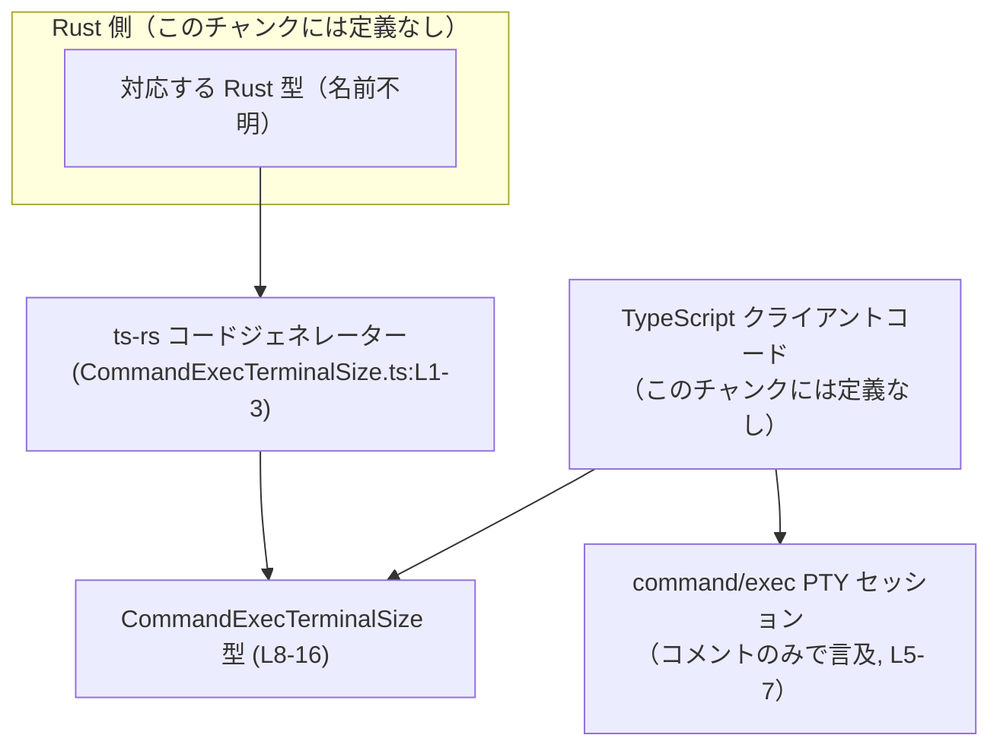
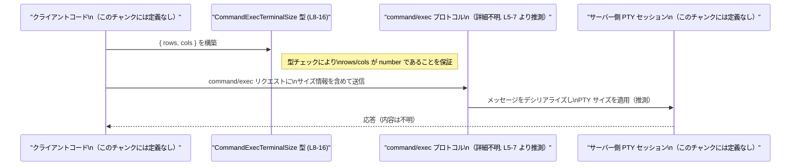

# app-server-protocol/schema/typescript/v2/CommandExecTerminalSize.ts

## 0. ざっくり一言

`CommandExecTerminalSize` は、`command/exec` の PTY セッションにおけるターミナルのサイズ（行数・列数）を表す TypeScript の型エイリアスです（`CommandExecTerminalSize.ts:L5-8`）。  
`ts-rs` によって Rust 側から自動生成されており、手動での編集は想定されていません（`CommandExecTerminalSize.ts:L1-3`）。

---

## 1. このモジュールの役割

### 1.1 概要

- このモジュールは、`command/exec` の PTY セッションで使用される **ターミナルの高さ（行数）と幅（列数）** を表現するための型を提供します（`CommandExecTerminalSize.ts:L5-8`）。
- TypeScript 側のアプリケーションから、プロトコルメッセージの一部としてターミナルサイズを安全にやり取りするための **スキーマ定義** です（`export type` により公開されていることから推測、`CommandExecTerminalSize.ts:L8-16`）。

### 1.2 アーキテクチャ内での位置づけ

- コメントより、このファイルは `ts-rs` により生成されており、Rust 側の定義と TypeScript 側のスキーマを橋渡しする役割を持つことが分かります（`CommandExecTerminalSize.ts:L1-3`）。
- `export type` で公開されているため、同じ TypeScript プロジェクト内の他モジュールからインポートして利用されることが想定されます（`CommandExecTerminalSize.ts:L8`）。
- 実際にどのモジュールから参照されているか・どのプロトコルメッセージに埋め込まれるかは、このチャンクには現れていません。

代表的な依存関係（推測を含む）を簡略に図示します。



※ Rust 側の具体的な型名や、`command/exec` API の実装位置は、このチャンクからは分かりません。

### 1.3 設計上のポイント

- **純粋なデータ構造のみ**  
  - `export type ... = { ... }` で定義されたオブジェクト型であり、メソッドやロジックを持たない **データコンテナ** になっています（`CommandExecTerminalSize.ts:L8-16`）。
- **自動生成コードであることを明示**  
  - 冒頭コメントで「GENERATED CODE」「Do not edit this file manually」と明示されており、手動編集は禁止されています（`CommandExecTerminalSize.ts:L1-3`）。
- **数値型のみで構成**  
  - `rows` と `cols` はともに `number` 型で定義されており、整数／正の値などの制約は型レベルでは付与されていません（`CommandExecTerminalSize.ts:L12-16`）。
- **状態やエラーハンドリングは非保持**  
  - フィールドのみのオブジェクト型であり、例外・エラー状態・並行性に関するロジックは一切持ちません（`CommandExecTerminalSize.ts:L8-16`）。

---

## 2. 主要な機能一覧

このファイルは型定義のみを提供しますが、機能的には次の 1 点に集約されます。

- `CommandExecTerminalSize`: `command/exec` PTY セッションのターミナルサイズ（`rows`, `cols`）を表すスキーマ定義（`CommandExecTerminalSize.ts:L5-8, L12-16`）

---

## 3. 公開 API と詳細解説

### 3.1 型一覧（構造体・列挙体など）

このファイルで公開されている型は 1 つです。

| 名前                       | 種別        | 役割 / 用途                                                                                  | 主なフィールド                               | 定義位置                         |
|----------------------------|-------------|-----------------------------------------------------------------------------------------------|----------------------------------------------|----------------------------------|
| `CommandExecTerminalSize`  | 型エイリアス | `command/exec` の PTY セッションにおけるターミナルサイズを表すオブジェクト型                     | `rows: number`, `cols: number`               | `CommandExecTerminalSize.ts:L8-16` |

フィールドの詳細は次のとおりです。

| フィールド名 | 型      | 説明                                             | 根拠 |
|--------------|---------|--------------------------------------------------|------|
| `rows`       | `number` | ターミナルの高さ（行数）を文字セル単位で表す値   | `CommandExecTerminalSize.ts:L9-12` |
| `cols`       | `number` | ターミナルの幅（列数）を文字セル単位で表す値     | `CommandExecTerminalSize.ts:L13-16` |

### 3.2 関数詳細（最大 7 件）

このファイルには関数・メソッドの定義は存在しません（`CommandExecTerminalSize.ts:L1-16`）。  
したがって、ここで詳細解説すべき「呼び出し API」はありません。

### 3.3 その他の関数

- 該当なし（関数定義が 0 件のため）。

---

## 4. データフロー

このファイル単独では具体的な処理フローは定義されていませんが、コメントから想定される典型的な利用シナリオを示します（**ここから先はコメント内容に基づく推測であり、厳密なフローはこのチャンクからは断定できません**）。

### 想定シナリオ: クライアントから PTY サイズを送信する

1. クライアント側 TypeScript コードで、ウィンドウやターミナルの行・列数を取得する（この処理は本チャンクには存在しません）。
2. その値を `CommandExecTerminalSize` 型に従って `{ rows, cols }` というオブジェクトにまとめる（`CommandExecTerminalSize.ts:L8-16`）。
3. `command/exec` 用のリクエストメッセージに、このオブジェクトを含めてサーバーに送信する（`CommandExecTerminalSize.ts:L5-7`）。
4. サーバー側では対応する Rust 型にデシリアライズし、PTY セッションのサイズ変更などに利用する（Rust 側はこのチャンクには現れません）。

このイメージを sequence diagram で表すと次のようになります。



※ 具体的なシリアライズ形式（JSON など）やメッセージ構造は、このファイルからは分かりません。

---

## 5. 使い方（How to Use）

### 5.1 基本的な使用方法

この型は、ターミナルサイズを表すオブジェクトの **型注釈** として利用します。  
以下は想定される利用例です（インポートパスはプロジェクト構成によって異なるため、コメントとして扱います）。

```typescript
// 実際のパスはプロジェクト構成に依存する
// import type { CommandExecTerminalSize } from "./schema/typescript/v2/CommandExecTerminalSize";

type CommandExecTerminalSize = {
    rows: number; // 行数（高さ）
    cols: number; // 列数（幅）
};

// ウィンドウサイズなどから値を取得したと仮定
const size: CommandExecTerminalSize = {
    rows: 24,  // 24 行
    cols: 80,  // 80 列
};

// 例: command/exec リクエストに埋め込む（実装はこのチャンク外）
sendCommandExec({
    // ...
    ptySize: size, // CommandExecTerminalSize 型として送る
});
```

このように型注釈を付けることで、`rows` と `cols` が `number` 型であることを TypeScript コンパイラがチェックし、誤った型の代入を防ぎます（`CommandExecTerminalSize.ts:L12-16`）。

### 5.2 よくある使用パターン

1. **初期サイズの指定**

    ```typescript
    const defaultSize: CommandExecTerminalSize = {
        rows: 30,
        cols: 120,
    };
    ```

2. **リサイズイベントからの更新**

    ```typescript
    function onResize(rows: number, cols: number): CommandExecTerminalSize {
        // 引数からそのまま CommandExecTerminalSize を構築する
        return { rows, cols };
    }
    ```

どちらの場合も、`rows` / `cols` を `number` として扱う限り、コンパイル時に型安全性が保たれます。

### 5.3 よくある間違い

#### 数値を文字列で渡してしまう

```typescript
// ❌ 間違い例: rows/cols を string にしてしまう
const wrong: CommandExecTerminalSize = {
    rows: "24",     // エラー: string は number に代入できない
    cols: "80",     // エラー: string は number に代入できない
};
```

#### 値の意味上の誤り（0 や負数）

```typescript
// ❌ コンパイラは通るが意味的には不正な可能性が高い例
const invalid: CommandExecTerminalSize = {
    rows: 0,   // 高さ 0 行
    cols: -1,  // 負の列数
};
```

- 型定義上は `number` であれば通るため、**0 や負数を排除するチェックは呼び出し側ロジックで行う必要があります**。  
- このファイルには、そうした制約やバリデーションロジックは含まれていません（`CommandExecTerminalSize.ts:L8-16`）。

### 5.4 使用上の注意点（まとめ）

- **前提条件**
  - `rows` と `cols` は 0 より大きい整数であることが自然ですが、型レベルにはそうした制約はありません。呼び出し側で意味上の妥当性チェックを行う必要があります（この制約はコメントからの推測です）。
- **エラー・安全性**
  - 型自体は `number` しか使っていないため、TypeScript の型システム上のエラーは「非数値を代入した場合」に限られます（`CommandExecTerminalSize.ts:L12-16`）。
  - ランタイム時の安全性（極端に大きな値によるリソース消費など）は、この型定義では制御されません。
- **並行性**
  - この型はイミュータブルなプレーンオブジェクトとして扱われることが多く、スレッドセーフティや共有可変状態に関する問題は、この型単体では発生しません。
- **セキュリティ上の観点**
  - 値そのものは単純な数値ですが、サーバー側がこれをそのままリソース割り当てに使用する場合、非常に大きい値を受け取ると負荷増大につながる可能性があります。防御的な実装はサーバー側やバリデーション層で行う必要があります（このファイルにはバリデーションはありません）。

---

## 6. 変更の仕方（How to Modify）

### 6.1 新しい機能を追加する場合

このファイルは **`ts-rs` により自動生成される** ため（`CommandExecTerminalSize.ts:L1-3`）、直接編集するのではなく、生成元の定義を変更する必要があります。

一般的な手順（このチャンクからは概要のみ推測できます）:

1. Rust 側の対応する型定義（構造体など）にフィールドを追加・変更する。  
   - 例: `rows`, `cols` に加えて `pixel_width` などを追加したい場合。
2. `ts-rs` のコード生成コマンドを再実行し、TypeScript 側のファイルを再生成する。
3. 再生成された `CommandExecTerminalSize.ts` を利用する TypeScript コードで、変更されたフィールドに合わせて修正を行う。

このチャンクには Rust 側の定義やコード生成の具体的なコマンドは現れていないため、詳細は不明です。

### 6.2 既存の機能を変更する場合

- **フィールド名の変更**  
  - 例: `rows` → `height` にしたい場合、生成元（Rust 側）とすべての利用箇所に影響します。
- **フィールド型の変更**  
  - 例: `number` → `bigint` や文字列のように変更したい場合も、生成元で変更し、`ts-rs` を再実行する必要があります。
- **影響範囲の確認**
  - `CommandExecTerminalSize` をインポートしている全ての TypeScript ファイルが影響を受けるため、IDE の参照検索などで利用箇所を確認する必要があります。
- **契約（前提条件）の維持**
  - 「ターミナルサイズは文字セル単位」（`CommandExecTerminalSize.ts:L5-7`）という意味上の契約がコメントで示されているため、この意味を変える場合はクライアント・サーバー双方の実装・ドキュメントの見直しが必要です。

---

## 7. 関連ファイル

このチャンクから確実に読み取れる関連は限定的ですが、推測も含めて整理します。

| パス / 種別                              | 役割 / 関係                                                                                   |
|------------------------------------------|-----------------------------------------------------------------------------------------------|
| 対応する Rust 側の型定義（パス不明）     | `ts-rs` の生成元となる Rust 型。`CommandExecTerminalSize` と同じ構造を持つと考えられますが、このチャンクには現れません。 |
| `ts-rs` 設定ファイル / ビルドスクリプト（不明） | 本ファイルを生成するための設定。具体的なファイル名・パスはこのチャンクからは分かりません。          |
| 同ディレクトリの他の `v2` スキーマファイル | プロトコル v2 の他メッセージスキーマ。存在はディレクトリ構成から想像できますが、内容はこのチャンクには現れません。 |

---

### コンポーネントインベントリー（まとめ）

最後に、このチャンクで確認できるコンポーネントの一覧と位置をまとめます。

| コンポーネント名              | 種別        | 説明                                                         | 定義位置                         |
|-------------------------------|-------------|--------------------------------------------------------------|----------------------------------|
| 自動生成ファイルである旨のコメント | コメント    | 本ファイルが `ts-rs` により生成され、手動編集禁止であることを示す | `CommandExecTerminalSize.ts:L1-3` |
| `CommandExecTerminalSize`     | 型エイリアス | `command/exec` PTY セッションのターミナルサイズを表す型       | `CommandExecTerminalSize.ts:L5-8` |
| `rows`                        | フィールド  | ターミナルの高さ（行数）を表す数値                           | `CommandExecTerminalSize.ts:L9-12` |
| `cols`                        | フィールド  | ターミナルの幅（列数）を表す数値                             | `CommandExecTerminalSize.ts:L13-16` |

このファイルには関数・クラス・列挙体・ネームスペースなどは定義されていません。
