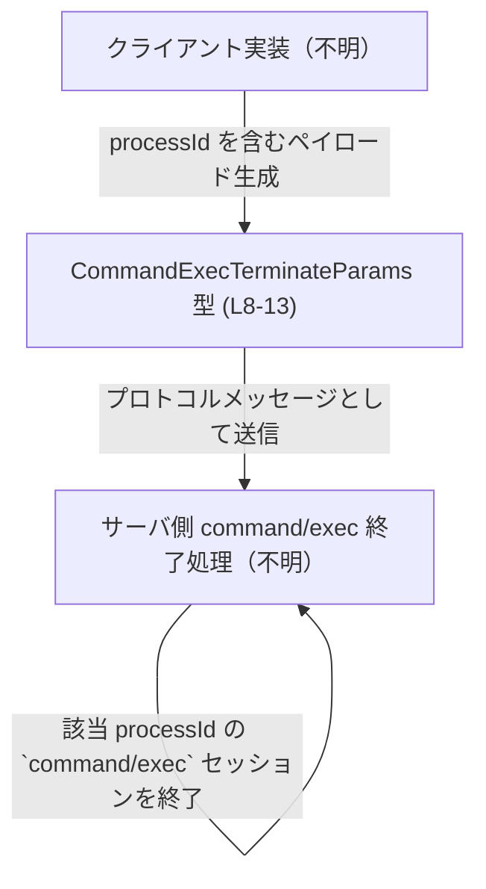
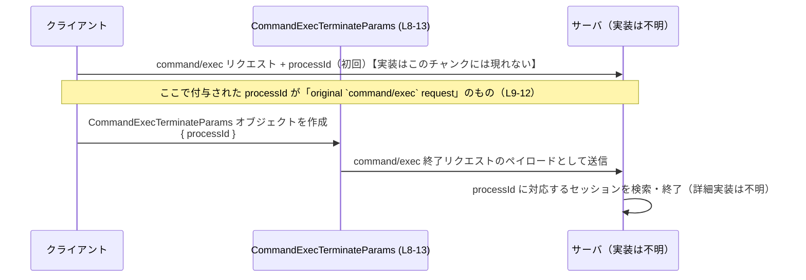

# app-server-protocol/schema/typescript/v2/CommandExecTerminateParams.ts

## 0. ざっくり一言

`command/exec` セッションを終了させるリクエストのパラメータとして、必須フィールド `processId: string` だけを持つオブジェクト型を公開する、自動生成された TypeScript スキーマです（CommandExecTerminateParams.ts:L1-3, L5-7, L8-13）。

---

## 1. このモジュールの役割

### 1.1 概要

- このモジュールは、「実行中の `command/exec` セッションを終了する」ためのパラメータ型を提供します（CommandExecTerminateParams.ts:L5-7）。
- パラメータは、元の `command/exec` リクエストでクライアントが指定した、接続単位の `processId` だけを含みます（CommandExecTerminateParams.ts:L9-12）。
- コード全体は ts-rs によって自動生成されており、手動での編集は禁止されています（CommandExecTerminateParams.ts:L1-3）。

### 1.2 アーキテクチャ内での位置づけ

このファイルは `app-server-protocol/schema/typescript/v2` 以下にあり、プロトコルの **スキーマ定義層** に属すると解釈できます。  
コメントから以下の関係だけが読み取れます（実際のクライアント・サーバ実装の場所や名前は、このチャンクには現れません）。



- クライアントは、元の `command/exec` リクエストで使った `processId` を保持しておき、この型に詰めて終了リクエストを送る、という利用がコメントから読み取れます（CommandExecTerminateParams.ts:L9-12）。
- どの通信手段（HTTP / WebSocket など）で送られるか、どのメソッド名と結びついているかは、このチャンクからは分かりません。

### 1.3 設計上のポイント

- **自動生成コード**  
  - ファイル先頭に「GENERATED CODE! DO NOT MODIFY BY HAND!」と明記されており（CommandExecTerminateParams.ts:L1-3）、このファイル自体は編集対象ではない設計になっています。
- **責務の限定**  
  - ひとつの型エイリアス `CommandExecTerminateParams` だけを定義し（CommandExecTerminateParams.ts:L8-13）、セッション終了リクエストのパラメータ構造の表現に専念しています。
- **状態・ロジックを持たない**  
  - 関数やクラス、メソッドは一切定義されておらず、このファイル単体では振る舞い（ロジック）は持ちません（このチャンク全体を通じて関数定義が存在しないことから）。
- **型安全性**  
  - `processId` を `string` の必須プロパティとして型定義することで、TypeScript のコンパイル時にパラメータの取り違えや欠落を検出できる設計です（CommandExecTerminateParams.ts:L8-13）。

---

## 2. 主要な機能一覧

このモジュールが提供する機能は、型定義に関するものに限定されます。

- `CommandExecTerminateParams`: 実行中の `command/exec` セッションを終了するためのパラメータ型を提供する（CommandExecTerminateParams.ts:L5-7, L8-13）。
- `processId` フィールド: 元の `command/exec` リクエストでクライアントが指定した、接続スコープの `processId` を保持する（CommandExecTerminateParams.ts:L9-12）。

---

## 3. 公開 API と詳細解説

### 3.1 型一覧（構造体・列挙体など）

このファイルで公開されている主要な型は 1 つです。

| 名前                         | 種別                         | 役割 / 用途                                                                                          | フィールド概要                                                                                                                  | 根拠 |
|------------------------------|------------------------------|-------------------------------------------------------------------------------------------------------|-------------------------------------------------------------------------------------------------------------------------------|------|
| `CommandExecTerminateParams` | 型エイリアス（オブジェクト） | 実行中の `command/exec` セッションを終了するリクエストのパラメータを表現する                         | `processId: string` — クライアントが元の `command/exec` リクエストで指定した、接続スコープの `processId`（必須プロパティ） | CommandExecTerminateParams.ts:L5-7, L8-13 |

`CommandExecTerminateParams` のプロパティ詳細:

| フィールド名 | 型      | 必須/任意 | 説明                                                                                                       | 根拠 |
|--------------|---------|-----------|------------------------------------------------------------------------------------------------------------|------|
| `processId`  | string  | 必須      | 「Client-supplied, connection-scoped `processId` from the original `command/exec` request」とコメントされる ID | CommandExecTerminateParams.ts:L9-12, L13 |

TypeScript の観点では、これは以下のような形のオブジェクトを表します。

```typescript
export type CommandExecTerminateParams = {
    processId: string;
};
```

（実際のファイルでは `processId` と `};` が同一行にありますが、意味としては上記と同等です。CommandExecTerminateParams.ts:L8-13）

#### 安全性・エラー・並行性の観点

- **型安全性**  
  - `processId` が必須の `string` として定義されているため、この型を期待する関数に対して `{}` や `{ processId: 123 }` などを渡そうとすると、コンパイル時に型エラーになります。
- **実行時エラー**  
  - このファイルはあくまで型定義のみであり、実行時の値検証（バリデーション）ロジックは含まれません。  
    したがって、`any` 型を経由するなど型チェックを迂回した場合、実行時に `processId` が欠落していても、このファイルだけではエラーになりません。
- **並行性**  
  - 型定義のみで状態を持たないため、並行実行やスレッド安全性に関する懸念はこのファイルの範囲内では生じません。

### 3.2 関数詳細（最大 7 件）

このファイルには関数・メソッドが定義されていません（CommandExecTerminateParams.ts 全体を確認しても `function` やメソッド構文が存在しないため）。  
そのため、関数詳細テンプレートに沿って解説すべき対象はありません。

### 3.3 その他の関数

- 補助的な関数やラッパー関数も、このチャンクには現れません。

---

## 4. データフロー

コメントから読み取れる範囲で、`CommandExecTerminateParams` が関わる典型的なデータフローを整理します。

1. クライアントが `command/exec` リクエストを発行し、その際に `processId` をサーバに伝える。（このフロー自体はコメントで言及されるのみで、実装はこのチャンクには現れませんが、`original command/exec request` という表現から依存関係が示唆されます。CommandExecTerminateParams.ts:L9-12）
2. クライアントは、後でセッションを終了したいときに、元の `processId` を `CommandExecTerminateParams` に格納し、`command/exec` セッション終了リクエストとして送信する（CommandExecTerminateParams.ts:L5-7, L9-12）。
3. サーバ側は受信した `processId` を使って、対応するセッションを識別し、終了処理を行うと考えられます（「Terminate a running `command/exec` session.」というコメントからの解釈。CommandExecTerminateParams.ts:L5-7）。

このフローをシーケンス図として表現すると、次のようになります（型定義部分の行番号を注記しています）。



> 実際のメソッド名・エンドポイント・トランスポート（HTTP / WebSocket 等）は、このファイルには記述がなく、「不明」としています。

---

## 5. 使い方（How to Use）

### 5.1 基本的な使用方法

このモジュールの典型的な利用は、「`command/exec` セッション終了リクエストのペイロードを表す型」として、関数や API クライアントのパラメータに使うことです。

```typescript
// この import パスは、実際のプロジェクト構成に応じて調整が必要です。
// このファイルには import 文は含まれていないため、ここでは想定例として記述しています。
import type { CommandExecTerminateParams } from "./CommandExecTerminateParams";

// command/exec セッションを終了するための関数の例（この関数自体はこのファイルには存在しません）
async function terminateCommandExecSession(
    params: CommandExecTerminateParams, // 終了対象セッションを表すパラメータ
): Promise<void> {
    // ここで実際にはプロトコルに従ってサーバへリクエストを送る想定
    // sendProtocolMessage("command/exec/terminate", params);
}

// どこかの処理での利用例
const params: CommandExecTerminateParams = {
    processId: "abc123", // 元の command/exec リクエストで使用した processId
};

terminateCommandExecSession(params)
    .catch((err) => {
        console.error("セッション終了に失敗しました", err);
    });
```

ポイント:

- `processId` は `string` で必須なので、省略すると TypeScript のコンパイルエラーになります。
- `terminateCommandExecSession` や `sendProtocolMessage` はこのファイルには定義されておらず、あくまで利用イメージを示す疑似コードです。

### 5.2 よくある使用パターン

1. **セッション管理オブジェクトからの利用**

   既にどこかで `processId` を保持している場合、その情報を束ねてこの型に詰めるパターンが考えられます。

   ```typescript
   interface CommandExecSessionInfo {
       processId: string; // セッション管理側で保持している ID
       // ... その他セッションに関する情報
   }

   function buildTerminateParams(
       session: CommandExecSessionInfo
   ): CommandExecTerminateParams {
       // session.processId は string なのでそのまま代入できる
       return { processId: session.processId };
   }
   ```

2. **ユーザー入力からの構築**

   ユーザーが GUI や CLI から processId を指定するケースでは、入力値を `string` として受け取り、そのまま構築します（入力の妥当性チェックは別途必要です）。

   ```typescript
   function fromUserInput(input: string): CommandExecTerminateParams {
       // この段階では input が有効な processId かどうかは別問題
       return { processId: input };
   }
   ```

### 5.3 よくある間違い

TypeScript の型に関連して起こりそうな誤用例と、その修正例です。

```typescript
import type { CommandExecTerminateParams } from "./CommandExecTerminateParams";

// 間違い例: processId を指定していない
const badParams1: CommandExecTerminateParams = {
    // processId が欠落 → コンパイルエラー
};

// 間違い例: processId を number として扱ってしまう
const badParams2: CommandExecTerminateParams = {
    // processId: 123, // 型 'number' を型 'string' に割り当てられない → コンパイルエラー
    processId: String(123), // 正しい: string に変換してから代入
};

// 正しい例
const goodParams: CommandExecTerminateParams = {
    processId: "123",
};
```

注意:

- `any` や `unknown` を多用すると、コンパイル時の型チェックを迂回してしまい、`processId` の欠落を見逃す可能性があります。
- このファイルには実行時のバリデーションは含まれないため、外部入力を使う場合は別途検証する必要があります。

### 5.4 使用上の注意点（まとめ）

- **必須フィールド**  
  - `processId` は必須です。`CommandExecTerminateParams` を受け取る関数では、`processId` が存在すると仮定して実装されることが多いため、型を迂回して `undefined` や `null` を渡すと実行時エラーにつながる可能性があります。
- **識別子の整合性**  
  - コメントから、「元の `command/exec` リクエスト」との対応が前提になっていることが分かります（CommandExecTerminateParams.ts:L9-12）。  
    したがって、別の接続や別のセッションの `processId` を誤って指定すると、意図しないセッションを終了してしまう危険があります。
- **セキュリティ上の観点**  
  - `processId` の具体的なフォーマットや推測困難性について、このファイルからは分かりません。  
    もし `processId` が推測しやすい値であり、かつ認可チェックなしに終了リクエストを受け付けるような設計になっている場合、他人のセッションを終了させられるリスクがありますが、これはこのチャンクからは判断できません。
- **並行性**  
  - 型定義自体は不変なオブジェクト構造を表すだけなので、並行アクセスに起因する問題はこのレベルでは発生しません。  
    実際のセッション終了処理の並行制御（同じ `processId` に対する同時終了リクエストなど）は、サーバ実装側の関心事であり、このファイルには現れません。

---

## 6. 変更の仕方（How to Modify）

### 6.1 新しい機能を追加する場合

ファイル先頭に次のコメントがあり、このファイルが自動生成コードであることが明示されています（CommandExecTerminateParams.ts:L1-3）。

```typescript
// GENERATED CODE! DO NOT MODIFY BY HAND!

// This file was generated by [ts-rs](https://github.com/Aleph-Alpha/ts-rs). Do not edit this file manually.
```

そのため:

- このファイルに直接プロパティを追加したり、型を変更したりするのは想定されていません。
- 新しいフィールド（例: `reason: string` など）を追加したい場合は、「ts-rs による生成元」となる定義（このチャンクには現れない）を変更し、コード生成プロセスを再実行する必要があります。
- 生成元がどのファイル・どの言語で書かれているかは、このチャンクからは分かりません。

変更のステップ（このチャンクから言える範囲）:

1. ts-rs による生成元を特定する（この情報はリポジトリ全体の構成に依存し、このチャンクには現れません）。
2. 生成元の型定義に、新しいフィールドを追加する。
3. コード生成を再実行し、`CommandExecTerminateParams.ts` を再生成する。

### 6.2 既存の機能を変更する場合

例: `processId` の型を `string` から別の型に変えたい、フィールド名を変えたい、など。

- 直接 `CommandExecTerminateParams.ts` を編集すると、次回のコード生成で上書きされる可能性が高く、またコメントの禁止事項にも反します（CommandExecTerminateParams.ts:L1-3）。
- 変更がプロトコルに与える影響（既存クライアントとの互換性、サーバ側の実装変更など）は、このチャンクからは判断できません。変更前に、利用箇所の洗い出しが必要です。

変更時に注意すべき点（このファイルから推測できる範囲）:

- `processId` は「original `command/exec` request」と論理的に結びついているので（CommandExecTerminateParams.ts:L9-12）、その意味が変わるような変更（例: 別の ID に置き換える）は、プロトコル仕様全体の見直しを伴う可能性があります。
- 型名 `CommandExecTerminateParams` は「command/exec 終了」に特化した命名になっているため、用途を拡張したい場合は、新しい型を別名で定義する選択肢もありますが、生成元の設計ポリシーによります（このチャンクからは詳細不明）。

---

## 7. 関連ファイル

このチャンクには、他ファイルへの import やパスの記述はありません。  
コメントやパス名から間接的に推測できるものを含めて、確実に言えることだけを整理します。

| パス / 区分 | 役割 / 関係 | 根拠 |
|------------|------------|------|
| `app-server-protocol/schema/typescript/v2/CommandExecTerminateParams.ts` | `CommandExecTerminateParams` 型の定義そのもの | ユーザー指定のファイルパス |
| （元の `command/exec` リクエストの型） | `processId` を最初に提供するリクエストの型が存在すると想定されるが、このチャンクには現れない | コメントの "original `command/exec` request" という文言から存在が示唆されるが、具体的なファイル名・場所は不明（CommandExecTerminateParams.ts:L9-12） |
| ts-rs の生成元ファイル | 本ファイルを生成した元の定義。言語・場所はこのチャンクからは特定できない | "generated by [ts-rs]" というコメントから生成元の存在は分かるが、具体的情報は不明（CommandExecTerminateParams.ts:L1-3） |

> まとめると、このファイルは「`command/exec` 終了パラメータ」の型定義を担当する **単一コンポーネント** であり、関数や他ファイルとの直接の依存関係はこのチャンクには現れていません。
