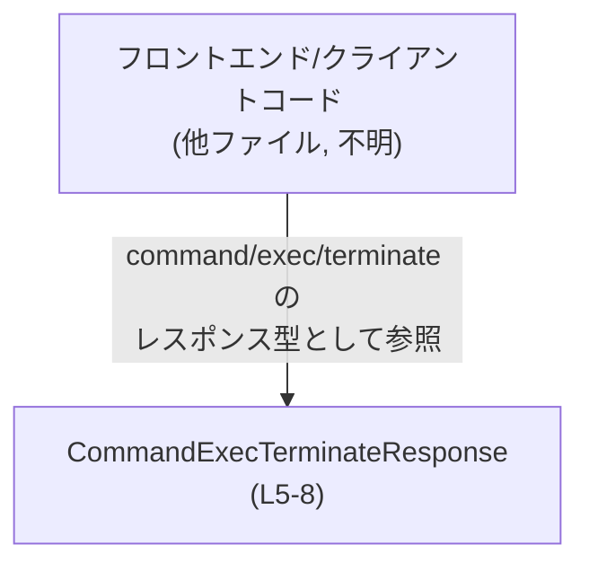
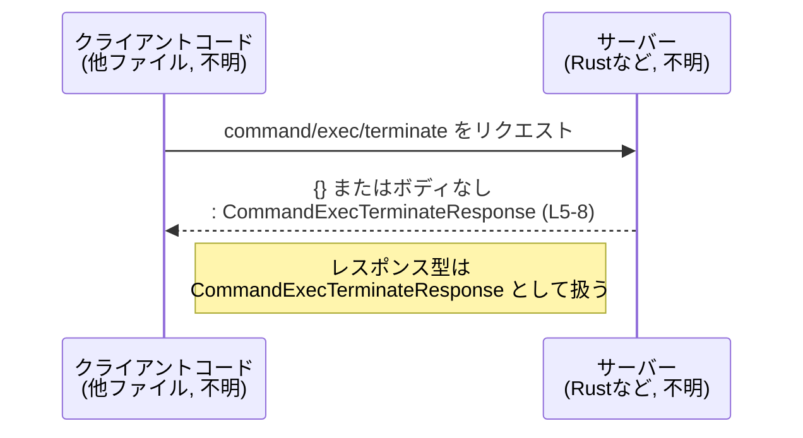

# app-server-protocol/schema/typescript/v2/CommandExecTerminateResponse.ts

## 0. ざっくり一言

`command/exec/terminate` というコマンドに対する **「空の成功レスポンス」** を表す、TypeScript の型エイリアス定義ファイルです（`CommandExecTerminateResponse.ts:L5-8`）。

---

## 1. このモジュールの役割

### 1.1 概要

- このモジュールは、`command/exec/terminate` API のレスポンスが **「中身がない成功応答」であることを型レベルで保証する** ために存在します（コメントより: `CommandExecTerminateResponse.ts:L5-7`）。
- TypeScript 側では `Record<string, never>` を用いることで、**プロパティを一切持たないオブジェクト型** として表現しています（`CommandExecTerminateResponse.ts:L8`）。

### 1.2 アーキテクチャ内での位置づけ

このファイルは生成コードであり、Rust 側の定義を `ts-rs` 経由で TypeScript に落としたものとコメントに記載されています（`CommandExecTerminateResponse.ts:L1-3`）。  
他モジュールとの具体的な依存関係（どこから import されるか）は、このチャンクには現れません。

典型的には、次のような位置づけで利用されると考えられます（呼び出し元はファイルからは不明です）:



### 1.3 設計上のポイント

コードから読み取れる設計上の特徴は次のとおりです。

- **生成コードであり手動編集禁止**  
  - 冒頭コメントで「GENERATED CODE」「Do not edit this file manually」と明示されています（`CommandExecTerminateResponse.ts:L1-3`）。
- **状態を持たない純粋な型定義のみ**  
  - クラスや関数、変数定義はなく、型エイリアスのみをエクスポートしています（`CommandExecTerminateResponse.ts:L8`）。
- **空レスポンスの表現に `Record<string, never>` を採用**  
  - `Record<string, never>` は「string キーを許容するが、値型が `never` のため実質的にプロパティを持てない」型であり、**TypeScript レベルでは「空オブジェクト」のみを許す契約**になります（`CommandExecTerminateResponse.ts:L8`）。
- **エラーハンドリングや並行性の制御ロジックは存在しない**
  - 実行時処理は含まれず、コンパイル時型チェックのためだけの定義です。このチャンクからは、エラー処理や並行性に関する情報は読み取れません。

---

## 2. 主要な機能一覧

このファイルは実行時の「機能」ではなく、型定義のみを提供します。

- `CommandExecTerminateResponse`: `command/exec/terminate` 成功時の空レスポンスを表す型エイリアス（`CommandExecTerminateResponse.ts:L8`）

---

## 3. 公開 API と詳細解説

### 3.1 型一覧（構造体・列挙体など）

| 名前                          | 種別        | 役割 / 用途                                                                 | 定義位置                                   |
|-------------------------------|-------------|-----------------------------------------------------------------------------|--------------------------------------------|
| `CommandExecTerminateResponse` | 型エイリアス | `command/exec/terminate` の **空の成功レスポンス** を表すオブジェクト型 | `CommandExecTerminateResponse.ts:L5-8` |

#### `CommandExecTerminateResponse`

- **定義**  

  ```ts
  export type CommandExecTerminateResponse = Record<string, never>;
  ```

  （`CommandExecTerminateResponse.ts:L8`）

- **意味**  
  - `Record<string, never>` は、キーが `string`、値が `never` 型のオブジェクトを意味します。
  - `never` は「値を持ち得ない型」なので、**実質的に「プロパティを持たないオブジェクトのみ許容する」型**になります。
  - コメントに「Empty success response for `command/exec/terminate`.」とあるため（`CommandExecTerminateResponse.ts:L5-7`）、この型は **中身のない成功レスポンス** を表します。

- **TypeScript 型システム上の効果**  
  - `CommandExecTerminateResponse` 型の値にプロパティを追加しようとすると、コンパイルエラーになります。
  - 既存コード上で「レスポンスに何らかのプロパティを期待してアクセスする」コードを書くと、型エラーとして検出されます。  
    → API 仕様が「空レスポンス」であることをクライアント側に強制する契約になっています。

- **実行時の挙動**  
  - 実行時には型は存在せず、あくまでコンパイル時の制約です。
  - 実際の HTTP レスポンスなどでは `{}`（空オブジェクト）や、レスポンスボディなし（ステータスコードのみ）といった形になると推測されますが、具体的なシリアライズ形式はこのチャンクからは分かりません。

### 3.2 関数詳細（最大 7 件）

このファイルには **関数・メソッド定義は存在しません**。  
したがって、関数詳細テンプレートを適用できる対象はありません（このチャンクには現れません）。

### 3.3 その他の関数

- なし（ユーティリティ関数やラッパー関数は定義されていません）。

---

## 4. データフロー

このファイル単体には処理ロジックがありませんが、コメントに基づく典型的なデータフローを示します。

### 4.1 代表的なシナリオ

1. クライアントが `command/exec/terminate` API を呼び出して、あるコマンドの実行を終了させる。
2. サーバー側で終了処理が成功する。
3. サーバーは「成功したが返すべき追加データはない」ことを示すため、**空レスポンス** を返す。
4. TypeScript クライアントコードでは、そのレスポンスを `CommandExecTerminateResponse` 型として扱う。

これを sequence diagram として表すと、次のようになります。



この図は、「レスポンスの型表現として `CommandExecTerminateResponse`（`Record<string, never>`）を使用する」という点のみを表します。  
サーバー内部の処理やエラーケースの挙動は、このチャンクからは分かりません。

---

## 5. 使い方（How to Use）

### 5.1 基本的な使用方法

HTTP クライアントコードから `command/exec/terminate` を呼び出す際の、典型的な TypeScript の利用例です。  
ここでは、レスポンスを `CommandExecTerminateResponse` として型付けし、「何もフィールドが存在しない」ことを型で保証します。

```typescript
// CommandExecTerminateResponse 型をインポートする
import type { CommandExecTerminateResponse } from "./CommandExecTerminateResponse"; // 実際のパスはプロジェクト構成に依存（このチャンクには現れません）

// 終了コマンドを投げる関数の例
async function terminateCommand(commandId: string): Promise<CommandExecTerminateResponse> {
    // 実際の HTTP クライアント実装は別ファイルに存在すると想定される（このチャンクには現れません）
    const response = await fetch(`/api/command/exec/${commandId}/terminate`, {
        method: "POST",
    });

    // ここではレスポンスボディが空オブジェクトで返るケースを例示する
    const body = (await response.json()) as CommandExecTerminateResponse;

    // body にはプロパティが存在しないことが TypeScript 型として保証される
    return body;
}

// 利用側のコード例
async function example() {
    const res = await terminateCommand("cmd-123");

    // 以下のようなアクセスはコンパイルエラーになる
    // res.status;          // Property 'status' does not exist on type 'CommandExecTerminateResponse'

    // 成功したことだけが意味を持ち、追加情報は存在しない
    console.log("terminate succeeded");
}
```

### 5.2 よくある使用パターン

- **「戻り値に情報を期待しない」ことを明示する**  
  - 関数の戻り値型に `Promise<CommandExecTerminateResponse>` を用いることで、「この API は成功/失敗だけが意味を持ち、成功時にペイロードはない」ことを表現できます。
- **ユニオン型の一部として利用する**  
  - 他のレスポンス型と組み合わせて、「成功: `CommandExecTerminateResponse` / 失敗: `ErrorResponse`」のようなユニオン型の一部として利用することも考えられますが、そのような定義はこのチャンクには現れません。

### 5.3 よくある間違い

**1) レスポンスにフィールドがあると期待してしまう**

```typescript
// 誤り例: terminate API のレスポンスに status フィールドがあると仮定している
async function wrongUsage() {
    const res: CommandExecTerminateResponse = await terminateCommand("cmd-123");
    // 下の行はコンパイルエラーになる（プロパティが定義されていない）
    // console.log(res.status);
}
```

```typescript
// 正しい扱い方: 成功/失敗のみを扱い、レスポンスボディには何も期待しない
async function correctUsage() {
    await terminateCommand("cmd-123");
    console.log("terminate succeeded");
}
```

**2) `any` にキャストして契約を壊す**

```typescript
// 誤り例: レスポンスを any にキャストし、プロパティを自由に使ってしまう
async function unsafeUsage() {
    const res = (await terminateCommand("cmd-123")) as any;
    console.log(res.status); // 型安全性が失われる
}
```

このような `any` の使用は、`CommandExecTerminateResponse` によって意図された「空レスポンス」という契約を無視してしまうため、避けるべきです。

### 5.4 使用上の注意点（まとめ）

- **前提条件**
  - `CommandExecTerminateResponse` は「空の成功レスポンス」であるとコメントに明記されています（`CommandExecTerminateResponse.ts:L5-7`）。  
    成功時に追加情報を返す設計には適しません。
- **エッジケース / Contracts**
  - TypeScript 型レベルではプロパティを許容しませんが、実行時には `{ extra: "value" }` のようなオブジェクトが来る可能性があります。  
    その場合でも、型に従うコードを書いていれば「プロパティを参照しない」ため、安全側に倒れます。
- **Bugs / Security 観点**
  - この型自体はマーカー的な役割であり、ビジネスロジックや権限チェックなどは含みません。  
    セキュリティバグが潜むとすればサーバー側の処理であり、このチャンクからは判別できません。
- **Performance / Scalability**
  - コンパイル時の型のみであり、実行時に追加コストはほぼありません。パフォーマンスやスケーラビリティへの影響は無視できる範囲です。
- **Observability**
  - ログ出力やメトリクス収集などの仕組みは含まれていません（このチャンクには現れません）。  
    成功/失敗の監視は HTTP ステータスやエラー型など、別の層で行われると考えられます。

---

## 6. 変更の仕方（How to Modify）

### 6.1 新しい機能を追加する場合

このファイルは `ts-rs` による生成コードであり、「手動で変更すべきでない」旨がコメントされています（`CommandExecTerminateResponse.ts:L1-3`）。

- 新しいフィールドをレスポンスに追加したい場合は、**Rust 側の元定義を変更し、`ts-rs` によるコード生成を再実行する**必要があります。
- TypeScript ファイルを直接編集すると、次回の自動生成で上書きされる可能性が高く、変更が失われます。

### 6.2 既存の機能を変更する場合

- **影響範囲**
  - `CommandExecTerminateResponse` を利用している全てのクライアントコードに影響します。
  - たとえば、レスポンスに `status` フィールドを追加するような変更を行うと、`res.status` にアクセスしている既存コードはコンパイルエラーからコンパイル成功に変わるため、**仕様の変化として扱う必要**があります。
- **契約の確認**
  - 現状コメントで「Empty success response」と明示されているため（`CommandExecTerminateResponse.ts:L5-7`）、この仕様を変更するかどうかをプロトコルレベルで合意する必要があります。
- **テスト**
  - このチャンクにはテストコードは含まれていません。  
    プロトコル変更に伴い、API レスポンスのテスト（統合テストや契約テスト）の更新が必要になりますが、具体的なテスト位置は不明です。

---

## 7. 関連ファイル

このチャンクには import 文や他ファイルへの参照が含まれていないため、**具体的な関連ファイルは特定できません**。  
しかし、コメントから次のような関係が推測できます（推測であることを明示します）。

| パス (推測) | 役割 / 関係 |
|------------|------------|
| Rust 側の `CommandExecTerminateResponse` 定義ファイル（不明） | `ts-rs` により本 TypeScript 型に変換される元定義。コメントに「This file was generated by ts-rs」とあるため（`CommandExecTerminateResponse.ts:L3`）。 |
| `command/exec/terminate` API を呼び出すクライアントコード（不明） | `CommandExecTerminateResponse` 型を import し、レスポンスの型として利用すると考えられますが、このチャンクには現れません。 |

以上が、このファイルに関するコードベースから読み取れる範囲での客観的な解説です。
