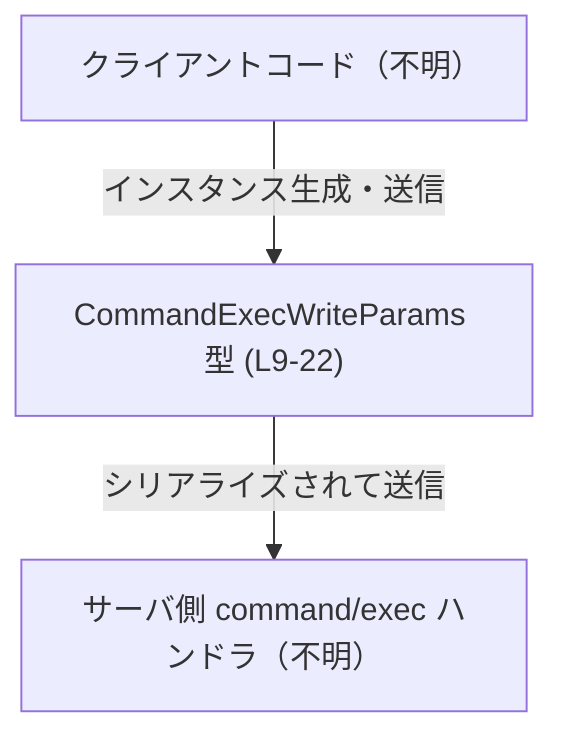
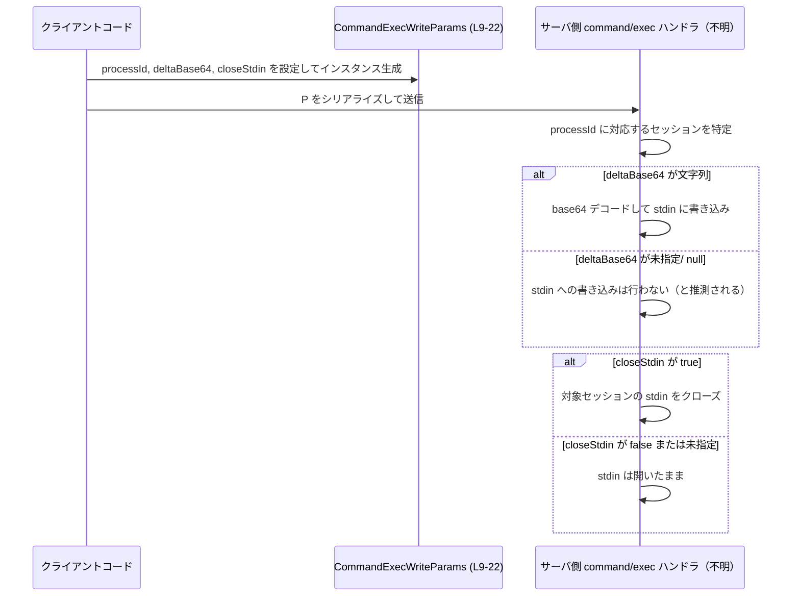

# app-server-protocol/schema/typescript/v2/CommandExecWriteParams.ts

## 0. ざっくり一言

`command/exec` で起動中のプロセスに対して、標準入力（stdin）のバイト列を書き込んだり、stdin をクローズしたりするための **リクエストパラメータ型** を定義するファイルです（CommandExecWriteParams.ts:L5-8, L9-22）。

---

## 1. このモジュールの役割

### 1.1 概要

- このモジュールは、アプリケーションサーバプロトコルにおける `command/exec` セッションに対して、
  - stdin のデータを書き込む
  - stdin をクローズする  
  といった操作のパラメータを表現するために存在します（CommandExecWriteParams.ts:L5-8, L9-22）。
- Rust 側の定義から `ts-rs` によって自動生成された **TypeScript の型定義** であり、手動編集を前提としていません（CommandExecWriteParams.ts:L1-3）。

### 1.2 アーキテクチャ内での位置づけ

- このチャンクでは、他モジュールを `import` したり、この型以外を `export` したりしていないため、TypeScript レベルの直接の依存関係は確認できません（CommandExecWriteParams.ts:L1-22）。
- コメントから、この型は「クライアント側またはクライアント相当の層」が生成し、「サーバ側の `command/exec` ハンドラ」が受け取る **データ転送オブジェクト（DTO）** として使われることが読み取れます（CommandExecWriteParams.ts:L5-8, L11-12）。

概念的な依存関係を示すと、次のようになります（本図は `CommandExecWriteParams` 定義部分（L9-22）を中心にした概念図です）。



> 呼び出し元・サーバ側の具体的なモジュール名やファイル構成は、このチャンクには現れません。

### 1.3 設計上のポイント

- **自動生成コード**  
  - 冒頭コメントで、このファイルが `ts-rs` により生成されており、「手動で編集しないこと」が明示されています（CommandExecWriteParams.ts:L1-3）。
- **ステートレスなデータ定義のみ**  
  - `export type CommandExecWriteParams = { ... }` という **型エイリアス** 定義のみを含み、関数やクラスはありません（CommandExecWriteParams.ts:L9-22）。
- **必須フィールドとオプションフィールドの明確な区別**  
  - `processId: string` は必須の文字列です（CommandExecWriteParams.ts:L14）。
  - `deltaBase64?: string | null` と `closeStdin?: boolean` は **オプショナルプロパティ**（`?:`）であり、さらに `deltaBase64` は `string | null` という **ユニオン型** になっています（CommandExecWriteParams.ts:L18, L22）。  
    これにより、`deltaBase64` には「未指定(undefined)」「null」「文字列」の三状態がありうることが表現されています。
- **ドキュメントコメントによる契約の明示**  
  - 各フィールドには JSDoc コメントが付与され、それぞれの意味（プロセス ID、base64 でエンコードされた stdin データ、stdin クローズフラグ）が記述されています（CommandExecWriteParams.ts:L10-12, L16-17, L19-20）。

---

## 2. 主要な機能一覧

このファイル自体にはロジックや関数はなく、データ構造のみを提供します。

- `CommandExecWriteParams`:  
  `command/exec` セッションに対する stdin 書き込み・クローズ操作のための **パラメータオブジェクト**（CommandExecWriteParams.ts:L9-22）。

---

## 3. 公開 API と詳細解説

### 3.1 型一覧（構造体・列挙体など）

| 名前                       | 種別        | 役割 / 用途 |
|----------------------------|-------------|-------------|
| `CommandExecWriteParams`   | 型エイリアス（オブジェクト型） | 起動中の `command/exec` セッションに対し、stdin データを書き込んだり、stdin をクローズしたりする操作のパラメータを表現する（CommandExecWriteParams.ts:L5-8, L9-22）。 |

#### `CommandExecWriteParams` のフィールド詳細

| フィールド名  | 型                     | 必須 / 任意 | 説明 |
|---------------|------------------------|-------------|------|
| `processId`   | `string`               | 必須        | 元の `command/exec` リクエストでクライアントが指定した、接続スコープの `processId`（CommandExecWriteParams.ts:L11-12, L14）。これによりどのセッションに対する書き込みかを識別します。 |
| `deltaBase64` | `string \| null`（オプショナル） | 任意        | stdin に書き込む base64 エンコード済みのバイト列（CommandExecWriteParams.ts:L16-17, L18）。未指定 (`undefined`)・`null`・文字列のいずれかになりえます。 |
| `closeStdin`  | `boolean`（オプショナル）        | 任意        | （`deltaBase64` があればそれを書き込んだ後に）stdin をクローズするかどうかのフラグ（CommandExecWriteParams.ts:L19-20, L22）。 |

> 型として表現されるのはコンパイル時の契約のみであり、実際のバリデーションやエラー処理がどのように行われるかは、このチャンクからは分かりません。

### 3.2 関数詳細（最大 7 件）

このファイルには関数・メソッド定義が存在しません（CommandExecWriteParams.ts:L1-22）。  
したがって、関数の詳細テンプレートに従って解説できる対象はありません。

### 3.3 その他の関数

同様に、ヘルパー関数やラッパー関数も定義されていません（CommandExecWriteParams.ts:L1-22）。

---

## 4. データフロー

この型が関与すると考えられる典型的なフローを、コメントの説明に基づき概念的に整理します（実際の呼び出し元やサーバ実装はこのチャンクには現れません）。

1. クライアントコードが、すでに確立済みの `command/exec` セッションの `processId` を把握している（CommandExecWriteParams.ts:L11-12）。
2. クライアントコードは stdin に送りたいバイト列を base64 文字列に変換し、`deltaBase64` に設定する（CommandExecWriteParams.ts:L16-17）。
3. 必要に応じて `closeStdin` を `true` にし、「書き込んだ後に stdin をクローズする」という意図を伝える（CommandExecWriteParams.ts:L19-20）。
4. 構築された `CommandExecWriteParams` オブジェクトがシリアライズされ、サーバへ送信される。
5. サーバ側の `command/exec` ハンドラは、`processId` に対応するセッションを特定し、`deltaBase64` をデコードして stdin に書き込み、`closeStdin` が `true` なら stdin をクローズする、という処理を行うと想定されます（このステップの具体的な実装はこのチャンクには現れません）。

この流れを示すシーケンス図（`CommandExecWriteParams` 定義部分 (L9-22) を中心にした概念図）は次のとおりです。



> 上記のサーバ側処理の詳細はコメントからの推測を含みますが、`processId`・`deltaBase64`・`closeStdin` の役割自体はファイル内コメントで明示されています（CommandExecWriteParams.ts:L10-12, L16-17, L19-20）。

---

## 5. 使い方（How to Use）

### 5.1 基本的な使用方法

TypeScript で `CommandExecWriteParams` を使って stdin にデータを書き込み、必要に応じてクローズする基本例です。

```typescript
// command-exec セッションに対して stdin を書き込むためのパラメータを構築する例
import type { CommandExecWriteParams } from "./CommandExecWriteParams";  // 実際のパスはこのチャンクからは不明

// 既にどこかで取得している processId（command/exec 開始時に受け取ったもの）
const processId: string = "abc123";  // 必須フィールド（CommandExecWriteParams.ts:L11-12, L14）

// 送信したい stdin データ（バイト列）を base64 にエンコードする（エンコード処理は任意の方法で実装）
const stdinBytes = new TextEncoder().encode("echo hello\n"); // 元のバイト列
const deltaBase64 = btoa(String.fromCharCode(...stdinBytes)); // base64 文字列を生成

// CommandExecWriteParams オブジェクトを構築する
const params: CommandExecWriteParams = {
    processId,              // 必須（CommandExecWriteParams.ts:L14）
    deltaBase64,            // 任意: stdin に書き込むデータ（CommandExecWriteParams.ts:L16-17, L18）
    closeStdin: false,      // 任意: 今回は stdin を開いたままにする（CommandExecWriteParams.ts:L19-20, L22）
};

// この params を使って、何らかの通信レイヤ経由でサーバに送信する（実装はこのチャンクには現れない）
sendCommandExecWrite(params);
```

> ここでは `sendCommandExecWrite` の実装はこのファイルには存在しないため、概念的な関数名として記載しています。

### 5.2 よくある使用パターン

1. **データを書き込むだけ（stdin は開いたまま）**

```typescript
const params: CommandExecWriteParams = {
    processId: "abc123",
    deltaBase64: base64Data,  // 書き込みたいデータ（CommandExecWriteParams.ts:L16-17, L18）
    // closeStdin は指定しないか false にする
};
```

1. **stdin をクローズするだけ（データは書かない）**

```typescript
const params: CommandExecWriteParams = {
    processId: "abc123",
    // deltaBase64 は未指定または null にする
    deltaBase64: null,        // "書き込みデータなし" を明示したい場合（CommandExecWriteParams.ts:L18）
    closeStdin: true,         // stdin をクローズしたい（CommandExecWriteParams.ts:L19-20, L22）
};
```

> `deltaBase64` を未指定 (`undefined`) にする場合と `null` にする場合の違いがサーバ側でどのように扱われるかは、このチャンクには記述がありません。

1. **データを書き込んだ後に stdin をクローズする**

```typescript
const params: CommandExecWriteParams = {
    processId: "abc123",
    deltaBase64: base64Data,
    closeStdin: true,         // 書き込み後に stdin を閉じる（CommandExecWriteParams.ts:L19-20, L22）
};
```

### 5.3 よくある間違い

この型定義とコメントから推測される、起こり得る誤用例と注意点です。

```typescript
// 誤り例: processId を省略してしまう
const badParams1 /* : CommandExecWriteParams */ = {
    // processId がない -> 型チェックを有効にしていればコンパイルエラー
    deltaBase64: base64Data,
};

// 正しい例: processId は必須
const goodParams1: CommandExecWriteParams = {
    processId: "abc123",      // 必須（CommandExecWriteParams.ts:L14）
    deltaBase64: base64Data,
};
```

```typescript
// 誤り例: base64 ではない任意の文字列を deltaBase64 に渡してしまう
const badParams2: CommandExecWriteParams = {
    processId: "abc123",
    deltaBase64: "raw-text-not-base64",  // 型的には string なので通るが、プロトコル上は不正の可能性
};

// TypeScript の型は「string」でしかないため、
// 実際に base64 かどうかは呼び出し側で保証する必要がある（CommandExecWriteParams.ts:L16-17, L18）。
```

```typescript
// 誤り例: closeStdin のデフォルトを誤解する
const badParams3: CommandExecWriteParams = {
    processId: "abc123",
    // closeStdin を指定しない場合のサーバ側挙動は、このチャンクからは不明
    // "必ずクローズされる" と期待すると誤解になる可能性がある
};

// 明示的に意図を表現することが安全
const goodParams3: CommandExecWriteParams = {
    processId: "abc123",
    closeStdin: true, // または false を明示
};
```

### 5.4 使用上の注意点（まとめ）

- **型安全性（TypeScript 固有の観点）**
  - `processId` が必須フィールドのため、TypeScript の型チェックを有効にしていれば、`processId` の指定漏れはコンパイル時に検出できます（CommandExecWriteParams.ts:L14）。
  - `deltaBase64` は `string | null` ですが、ランタイムでは `undefined` も許されるため、「省略」「null」「文字列」の三状態を意識する必要があります（CommandExecWriteParams.ts:L18）。
- **バリデーション・エラー**
  - この型は **静的な型情報のみ** を提供し、値の妥当性（`deltaBase64` が正しい base64 かどうか、`processId` が有効なセッションを指すかどうか）までは保証しません。
  - 実際のエラー処理やレスポンス仕様は、別のファイルまたはサーバ実装に依存し、このチャンクからは分かりません。
- **並行性**
  - この型は単なるオブジェクト型であり、並行な書き込みやロックなどの制御は表現しません。
  - 同じ `processId` に対して複数の `CommandExecWriteParams` を同時に送った場合の挙動は、このチャンクからは不明です。
- **セキュリティ**
  - `processId` の値はクライアントが指定するため、サーバ側で適切な認可・検証が必要です（型自体は認可情報を含みません）。
  - `deltaBase64` 経由で大量データや不正なデータが送信される可能性があり、サーバ側でサイズ制限や内容チェックが求められますが、そのような制約はこの型からは読み取れません。

---

## 6. 変更の仕方（How to Modify）

### 6.1 新しい機能を追加する場合

このファイルは `ts-rs` による自動生成コードであり、「手で変更しないこと」が明示されています（CommandExecWriteParams.ts:L1-3）。

- 新しいフィールドを追加したい場合は、**元になっている Rust 側の型定義** を修正し、再度 `ts-rs` を実行してこのファイルを再生成するのが前提です。
- このチャンクには元の Rust ファイルのパスや型名が現れていないため、どのファイルを編集すべきかは不明です。

変更時に考慮すべき点（一般論）:

- フィールド追加は、JSON ベースの通信であれば多くの場合後方互換ですが、古いクライアント／サーバとの互換性ポリシーは別途確認が必要です。
- 型が公開 API になっている場合、フィールド名や型を変更すると TypeScript 側のコードにコンパイルエラーを引き起こします。

### 6.2 既存の機能を変更する場合

- `processId` の型を `string` 以外に変える、`deltaBase64` から `null` を外す、`closeStdin` を必須にするなどの変更は、既存クライアントとの **互換性に影響** します。
- 変更前に、
  - どのコードが `CommandExecWriteParams` を生成しているか
  - どのサーバ側ロジックがこの型を受け取っているか  
  を検索し、影響範囲を確認する必要があります（ただし、このチャンクだけでは使用箇所は分かりません）。
- テスト観点としては、
  - フィールドの有無や値の組み合わせ（`deltaBase64` が undefined/null/string、`closeStdin` が undefined/true/false）に対する挙動
  - 不正な base64 文字列や存在しない `processId` に対するサーバ側の応答  
  などをカバーするのが望ましいと考えられます。

---

## 7. 関連ファイル

このチャンクから直接分かる関連ファイル・モジュールはありません。`import` / `export` 文がなく、他ファイルへの参照が書かれていないためです（CommandExecWriteParams.ts:L1-22）。

| パス | 役割 / 関係 |
|------|------------|
| （不明） | この TypeScript 型を生成している Rust 側の型定義ファイルが存在するはずですが、このチャンクにはそのパスや名前は現れません（CommandExecWriteParams.ts:L1-3）。 |
| （不明） | `CommandExecWriteParams` を利用して `command/exec` セッションに書き込み要求を送るクライアント側・サーバ側コードが存在すると考えられますが、具体的な位置はこのチャンクからは分かりません。 |

---

### コンポーネントインベントリー（このチャンク時点のまとめ）

| 種別 | 名前                    | 定義範囲                  | 説明 |
|------|-------------------------|---------------------------|------|
| 型   | `CommandExecWriteParams` | CommandExecWriteParams.ts:L9-22 | `command/exec` セッションへの stdin 書き込みおよび stdin クローズ操作のためのパラメータオブジェクト。 |

> このファイルには関数・クラス・列挙体など、他のコンポーネントは定義されていません（CommandExecWriteParams.ts:L1-22）。
