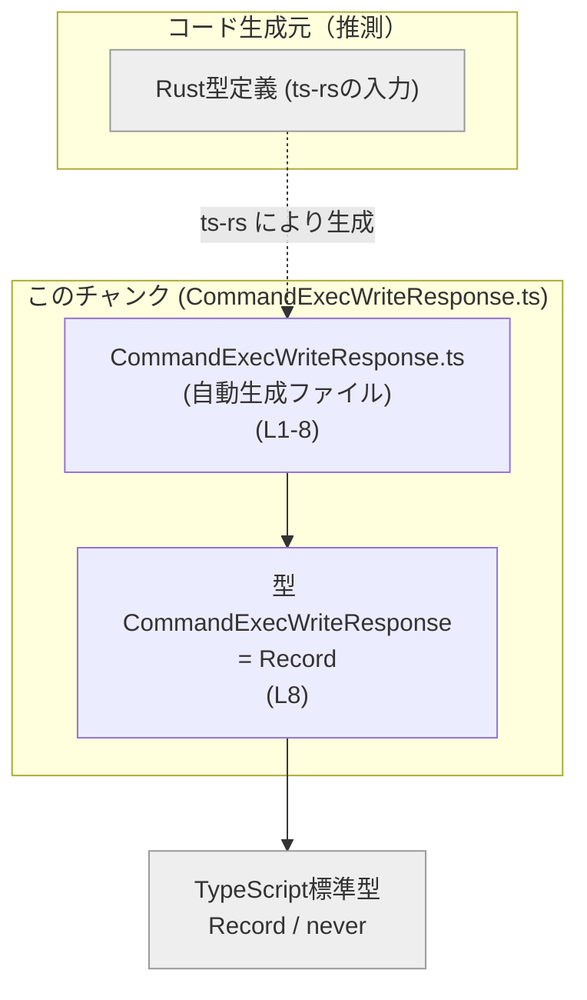
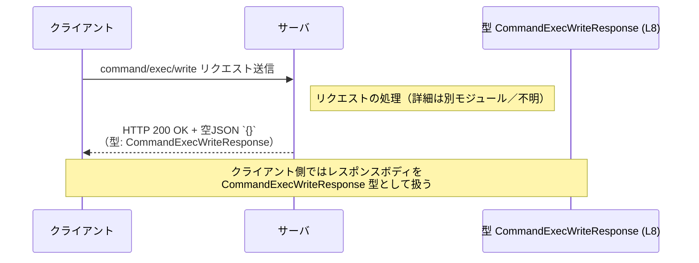

# app-server-protocol/schema/typescript/v2/CommandExecWriteResponse.ts

## 0. ざっくり一言

`command/exec/write` という操作の「成功時のレスポンスが空である」ことを型レベルで表現するための、型エイリアス定義だけを含む自動生成ファイルです（CommandExecWriteResponse.ts:L5-8）。

---

## 1. このモジュールの役割

### 1.1 概要

- このモジュールは、`command/exec/write` 操作に対する **空の成功レスポンス** を表す TypeScript 型 `CommandExecWriteResponse` を提供します（CommandExecWriteResponse.ts:L5-8）。
- 型の実体は `Record<string, never>` であり、「任意の文字列キーに対して値の型が `never`」という制約により、実質的に **プロパティを持たないオブジェクト（空オブジェクト）** を表します（CommandExecWriteResponse.ts:L8）。
- ファイル全体は `ts-rs` によって生成されることがコメントで明示されています（CommandExecWriteResponse.ts:L1-3）。

### 1.2 アーキテクチャ内での位置づけ

- ファイル先頭コメントより、この型は Rust 側の型定義から `ts-rs` によって生成された TypeScript 型スキーマの一部と読み取れます（CommandExecWriteResponse.ts:L1-3）。
- 実際にどのモジュールから参照されるか、どのような API クライアントやサーバコードに組み込まれているかは、このチャンクには現れていません。

このファイル内で把握できる依存関係を簡略化した図です。



- 外部の TypeScript コード（クライアントやサーバなど）から `CommandExecWriteResponse` が参照されることは自然に想定されますが、その具体的な位置づけはこのチャンクには出てこないため「不明」とします。

### 1.3 設計上のポイント

- **自動生成ファイルであることが明示**  
  - 「手動で変更しないこと」がコメントで明記されています（CommandExecWriteResponse.ts:L1-3）。
- **空レスポンスを明確に型として表現**  
  - JSDoc コメントにより、「`command/exec/write` の空の成功レスポンス」であることが説明されています（CommandExecWriteResponse.ts:L5-7）。
  - 実装は `Record<string, never>` で、プロパティを追加しようとするとコンパイルエラーになるため、「成功時には本当に何も返さない」という契約を型で表現しています（CommandExecWriteResponse.ts:L8）。
- **状態やロジックを持たない**  
  - 関数・クラス・実行ロジックは一切なく、**純粋な型定義**のみです（CommandExecWriteResponse.ts:L8）。
- **エラー・並行性**  
  - このモジュール単体では実行時コードがないため、エラー処理や並行性に関するロジックは存在しません。  
  - 型安全性の観点では、「レスポンスに余計なフィールドを期待したり、追加したりする誤用」をコンパイル時に防ぐ役割があります。

---

## 2. 主要な機能一覧（コンポーネントインベントリー）

このファイルに存在する「公開API（コンポーネント）」は型 1 つのみです。

### 型・関数インベントリー

| 種別 | 名前 | 役割 / 用途 | 根拠 |
|------|------|-------------|------|
| 型エイリアス | `CommandExecWriteResponse` | `command/exec/write` の空の成功レスポンスを表す型。実体は `Record<string, never>`。 | CommandExecWriteResponse.ts:L5-8 |

※ 関数・クラス・列挙体などは、このチャンクには登場しません。

---

## 3. 公開 API と詳細解説

### 3.1 型一覧（構造体・列挙体など）

| 名前 | 種別 | 役割 / 用途 | 定義 | 根拠 |
|------|------|-------------|------|------|
| `CommandExecWriteResponse` | 型エイリアス（`Record<string, never>`） | `command/exec/write` の空の成功レスポンス用の型。空オブジェクトを表現するために使われます。 | `export type CommandExecWriteResponse = Record<string, never>;` | CommandExecWriteResponse.ts:L5-8 |

**型の意味（TypeScript的な解説）**

- `Record<string, never>` は「キーが `string` で、値の型が `never` なオブジェクト」を表します。
- `never` は「値が存在しない」ことを表す型のため、**この型に対して有効なプロパティ値は存在しない**という意味になります。
- 実際のコードでは、空オブジェクト `{}` を `CommandExecWriteResponse` に代入できますが、プロパティを追加しようとするとコンパイルエラーになります。  
  → これにより、「レスポンスには何も含まれない」という契約が型で保証されます。

### 3.2 関数詳細（最大 7 件）

このファイルには **関数・メソッドが定義されていません**（CommandExecWriteResponse.ts:L1-8）。

したがって、関数詳細テンプレートを適用すべき対象もありません。

### 3.3 その他の関数

- 該当なし（このチャンクには関数定義が存在しません）。

---

## 4. データフロー

このファイル単体に実行コードはありませんが、JSDoc コメントから読み取れる用途に基づき、「`command/exec/write` 操作の成功レスポンス」としての典型的なデータフロー像を示します。

※ 以下はコメントの説明（CommandExecWriteResponse.ts:L5-7）から読み取れる設計意図に沿ったイメージであり、本チャンク内に対応する呼び出しコードは存在しません。



- サーバ側は成功時に空の JSON オブジェクト `{}` を返し、それが `CommandExecWriteResponse` に対応すると解釈できます（コメントより）（CommandExecWriteResponse.ts:L5-7）。
- クライアント側ではこの型を用いることで、「成功してもレスポンスボディに意味のあるフィールドはない」ことを型で表現できます。

---

## 5. 使い方（How to Use）

### 5.1 基本的な使用方法

`CommandExecWriteResponse` を返り値型として利用し、「成功しても返す内容がない」ことを明示する例です。

```ts
// CommandExecWriteResponse 型をインポートする（実際のパスはプロジェクト構成に依存する）
import type { CommandExecWriteResponse } from "./CommandExecWriteResponse"; // このファイルの型を参照

// command/exec/write に相当する処理の戻り値として利用する例
async function handleCommandExecWrite(/* 引数など */): Promise<CommandExecWriteResponse> { // 成功時には空レスポンスを返す契約
    // ここで実際のコマンド実行や書き込み処理を行う（このファイルには実装はない）
    // ...

    return {}; // 空オブジェクトは Record<string, never>（= CommandExecWriteResponse）として扱える
}
```

このコードにより、呼び出し側は「成功してもボディに意味のあるデータが載らない」ということを型から理解できます。

### 5.2 よくある使用パターン

1. **API クライアント／サーバの戻り値型**

   ```ts
   import type { CommandExecWriteResponse } from "./CommandExecWriteResponse";

   // API クライアント側の例
   async function commandExecWrite(/* ... */): Promise<CommandExecWriteResponse> {
       const res = await fetch("/command/exec/write", { method: "POST" }); // HTTP リクエストを送る
       if (!res.ok) {
           throw new Error("request failed"); // エラー時の扱いは別途定義
       }
       // 成功時は空 JSON を期待する
       const body = (await res.json()) as CommandExecWriteResponse; // 型アサーションで型付け
       return body; // 呼び出し側は中身を参照しない前提
   }
   ```

2. **他のレスポンス型とのユニオン**

   ```ts
   import type { CommandExecWriteResponse } from "./CommandExecWriteResponse";

   // 成功・失敗を別の型で表す例（失敗型はここではダミー）
   type CommandExecWriteResult =
       | { status: "ok"; body: CommandExecWriteResponse }       // 成功時は空ボディ
       | { status: "error"; errorCode: string; message: string }; // 失敗時はエラー情報を持つ

   // 呼び出し側では、成功分岐で body を参照しないことが自然になる
   ```

### 5.3 よくある間違い

`CommandExecWriteResponse` にプロパティを定義しようとすると、型の契約に反します。

```ts
import type { CommandExecWriteResponse } from "./CommandExecWriteResponse";

// 間違い例: 空レスポンス型にフィールドを持たせようとしている
const bad: CommandExecWriteResponse = {
    // @ts-expect-error: 型 'boolean' を型 'never' に割り当てることはできない
    success: true, // 型は Record<string, never> なのでプロパティを追加できない
};

// 正しい例: 完全な空オブジェクト
const ok: CommandExecWriteResponse = {}; // プロパティがないため型に適合する
```

- **誤用パターン**  
  - 成功レスポンスに `success: true` や `id: string` などのフィールドを追加してしまう。  
    → TypeScript の型チェックによりコンパイルエラーになります（値の型が `never` でなければならないため）。
- **正しいパターン**  
  - 成功時はレスポンスボディを参照しないか、空オブジェクトとして扱う。

### 5.4 使用上の注意点（まとめ）

- このファイルは **自動生成（ts-rs）** であり、直接編集しないことが前提です（CommandExecWriteResponse.ts:L1-3）。
- `CommandExecWriteResponse` にプロパティの追加・変更を期待してはいけません。  
  - 何か情報を返したくなった場合は、この型ではなく **元となる Rust 側の定義** を変更し、再生成する必要があります（元ファイルはこのチャンクには現れません）。
- 実行時には、サーバが空の JSON 以外を返しても JavaScript としては動作しますが、TypeScript 型定義とは不整合になります。  
  - 型定義と実際の API レスポンスが乖離しないよう、コード生成プロセスを維持することが重要です。

---

## 6. 変更の仕方（How to Modify）

### 6.1 新しい機能を追加する場合

このファイルは冒頭で「GENERATED CODE! DO NOT MODIFY BY HAND!」と宣言されているため、**直接編集するべきではありません**（CommandExecWriteResponse.ts:L1-3）。

`command/exec/write` の成功レスポンスに新しいフィールドを追加したい場合の一般的な手順は次の通りです（元定義はこのチャンクにはないため抽象的な説明になります）。

1. **Rust 側の元となる型定義を探す**  
   - `ts-rs` が入力としている Rust の構造体／型を特定します（パスや名前はこのチャンクには不明）。
2. **Rust 型にフィールドを追加する**  
   - たとえば `struct CommandExecWriteResponse { /* 新しいフィールド */ }` のように変更する（名称・構造は不明）。
3. **ts-rs により TypeScript コードを再生成する**  
   - ビルドスクリプトや専用コマンドを実行して、本ファイルを再生成します。
4. **生成された TypeScript 型を再確認する**  
   - 期待したプロパティが TypeScript 側に反映されていることを確認します。

### 6.2 既存の機能を変更する場合

- **契約の確認**  
  - `CommandExecWriteResponse` が「空レスポンス」であることを前提にするコードが既に存在する可能性がありますが、このチャンクからは利用箇所を特定できません。
  - 返り値が空であることを前提にしている処理（レスポンスを無視しているなど）が破壊されないか、リポジトリ全体を検索して確認する必要があります（このチャンクでは不明）。
- **変更時の注意点**  
  - 直接このファイルを編集せず、必ず元の Rust 定義 → ts-rs 再生成という流れで変更する必要があります（CommandExecWriteResponse.ts:L1-3）。
  - API の契約を変更した場合、クライアント側のコードにも影響が及ぶため、型エラーやランタイムの不整合がないか確認が必要です。

---

## 7. 関連ファイル

このチャンクから直接分かる関連情報は限定的です。

| パス / 要素 | 役割 / 関係 | 根拠 |
|------------|-------------|------|
| Rust 側の ts-rs 対応型定義（パス不明） | `CommandExecWriteResponse` の元となる型定義。ここを変更し ts-rs を再実行することで、このファイルが再生成されると考えられます。 | ファイル先頭コメントに「This file was generated by [ts-rs]」とあるため（CommandExecWriteResponse.ts:L1-3）。 |
| その他の TypeScript スキーマファイル（同ディレクトリ配下と推測） | 同じプロトコルバージョン `v2` における他のメッセージ型を定義している可能性がありますが、このチャンクには具体的なファイル名・参照は現れません。 | ディレクトリパス `schema/typescript/v2` から推測される構成ですが、詳細は不明です。 |

---

### Bugs / Security / Contracts / Edge Cases / Tests / 性能に関する補足

- **Bugs（バグの可能性）**  
  - このファイル自体は単なる型エイリアスであり、ロジックを含まないため、直接的なバグは想定しにくいです。
  - 実際の API が空レスポンスではなくフィールドを返している場合、**型定義と実体の不整合** が起きる可能性がありますが、それは生成元の定義や API 実装側で検討すべき事項です。
- **Security（セキュリティ）**  
  - この型は実行時の処理や検証を行わないため、単体ではセキュリティ上の影響はありません。
- **Contracts / Edge Cases（契約・エッジケース）**  
  - 契約: 成功時レスポンスには意味のあるデータが含まれない（空オブジェクト）という前提を表します（CommandExecWriteResponse.ts:L5-8）。
  - エッジケース: 実際にはサーバが `{ "debug": "..." }` のような追加情報を返しても、クライアント側 TypeScript からは `CommandExecWriteResponse` 経由では参照できないため、仕様と運用を揃えることが重要です。
- **Tests（テスト）**  
  - このチャンクにはテストコードやテストに関する記述はありません。
- **性能・スケーラビリティ**  
  - 型エイリアスのみであり、実行時のオーバーヘッドはありません。スケーラビリティへの影響もありません。
- **並行性**  
  - 実行コードを含まないため、スレッドセーフティや並行実行に関する懸念はこのファイル単体には存在しません。
