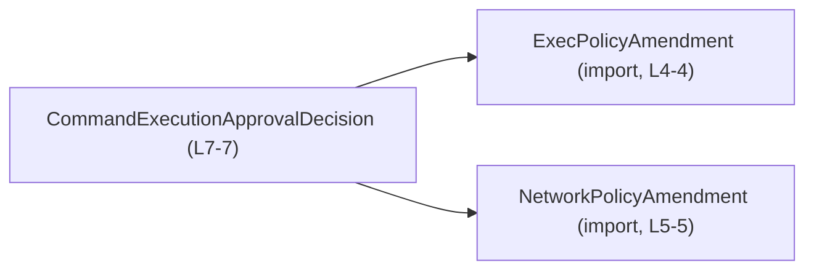
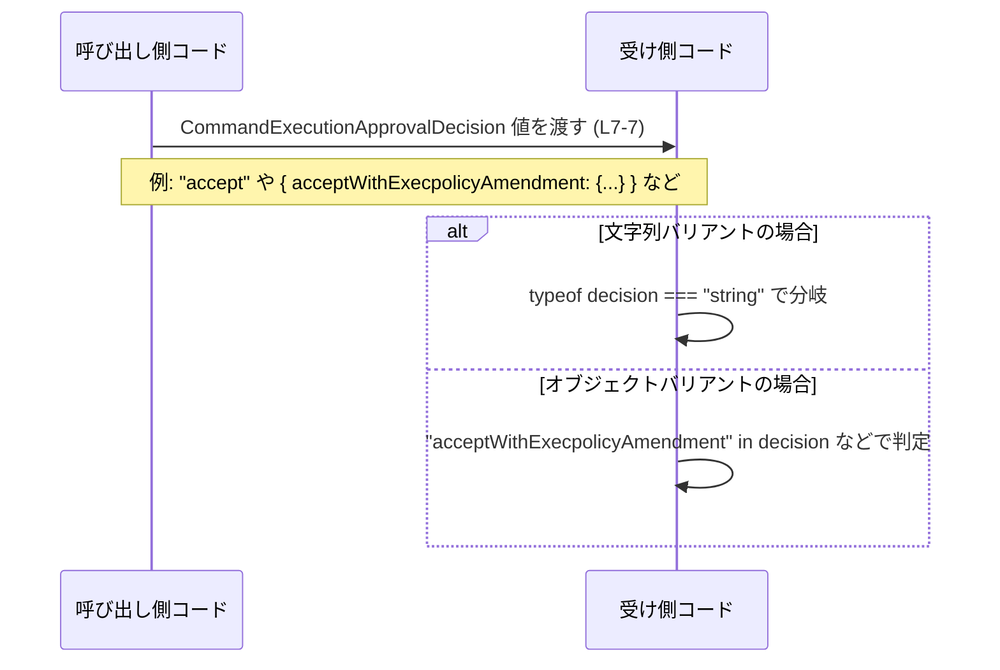

# app-server-protocol/schema/typescript/v2/CommandExecutionApprovalDecision.ts

## 0. ざっくり一言

- コマンド実行の承認結果を表す **判別可能なユニオン型** `CommandExecutionApprovalDecision` を定義する、自動生成済みの TypeScript 型定義ファイルです（`CommandExecutionApprovalDecision.ts:L1-1`, `CommandExecutionApprovalDecision.ts:L7-7`）。

---

## 1. このモジュールの役割

### 1.1 概要

- このモジュールは、コマンド実行リクエストに対する **承認・拒否・ポリシー変更付き承認** などの結果を表現するための型 `CommandExecutionApprovalDecision` を提供します（`CommandExecutionApprovalDecision.ts:L7-7`）。
- ファイル冒頭のコメントから、この型定義は Rust から TypeScript 型を生成するツール **ts-rs** により自動生成されており、手動編集しないことが明示されています（`CommandExecutionApprovalDecision.ts:L1-1`, `CommandExecutionApprovalDecision.ts:L3-3`）。

### 1.2 アーキテクチャ内での位置づけ

- このモジュールは、同じディレクトリにある `ExecPolicyAmendment` と `NetworkPolicyAmendment` 型に依存しています（`CommandExecutionApprovalDecision.ts:L4-5`）。
- いずれも `import type` で読み込まれているため、**型情報のみ** を参照し、JavaScript には出力されません（`CommandExecutionApprovalDecision.ts:L4-5`）。

依存関係を簡略化した図は次のとおりです。



### 1.3 設計上のポイント

- **自動生成コード**  
  - `// GENERATED CODE! DO NOT MODIFY BY HAND!` というコメントにより、手動編集禁止であることが明示されています（`CommandExecutionApprovalDecision.ts:L1-1`）。
  - ts-rs により生成されるため、Rust 側の型と 1:1 に対応することが意図された設計と考えられます（`CommandExecutionApprovalDecision.ts:L3-3`）。
- **判別可能なユニオン型**  
  - 単純な文字列リテラルと、オブジェクト形式のバリアントを組み合わせたユニオン型になっています（`CommandExecutionApprovalDecision.ts:L7-7`）。
- **ポリシー変更を伴うバリアント**  
  - 実行ポリシー／ネットワークポリシーの変更を表すバリアントが存在し、それぞれ `ExecPolicyAmendment` と `NetworkPolicyAmendment` をペイロードとして持ちます（`CommandExecutionApprovalDecision.ts:L4-5`, `CommandExecutionApprovalDecision.ts:L7-7`）。
- **型専用インポート**  
  - `import type` により、ランタイムには影響を与えず型チェックにのみ利用される設計になっています（`CommandExecutionApprovalDecision.ts:L4-5`）。

---

## 2. 主要な機能一覧

このファイルが提供する機能は、型 1 つに集約されています。

- `CommandExecutionApprovalDecision` 型: コマンド実行承認の結果を表すユニオン型（`CommandExecutionApprovalDecision.ts:L7-7`）。

---

## 3. 公開 API と詳細解説

### 3.1 型一覧（構造体・列挙体など）

| 名前                           | 種別        | 役割 / 用途                                                                 | 定義/参照位置                                |
|--------------------------------|-------------|------------------------------------------------------------------------------|----------------------------------------------|
| `CommandExecutionApprovalDecision` | 型エイリアス（ユニオン型） | コマンド実行の承認・拒否・ポリシー変更付き承認などの結果を表す             | 定義: `CommandExecutionApprovalDecision.ts:L7-7` |
| `ExecPolicyAmendment`         | 型（import） | 実行ポリシー変更の内容を表す型。詳細は本チャンクには現れません             | 参照: `CommandExecutionApprovalDecision.ts:L4-4` |
| `NetworkPolicyAmendment`      | 型（import） | ネットワークポリシー変更の内容を表す型。詳細は本チャンクには現れません     | 参照: `CommandExecutionApprovalDecision.ts:L5-5` |

※ `ExecPolicyAmendment` と `NetworkPolicyAmendment` の実体定義は、別ファイルに存在しており、このチャンクには含まれていません。

---

### 3.2 関数詳細の代わりに: 型 `CommandExecutionApprovalDecision` の詳細

このファイルには関数定義が存在しないため、この節では公開 API の中核である型 `CommandExecutionApprovalDecision` を詳細に説明します。

#### 型 `CommandExecutionApprovalDecision`

**概要**

- 次の 6 種類のバリアントからなる **ユニオン型** です（`CommandExecutionApprovalDecision.ts:L7-7`）。
  - `"accept"`
  - `"acceptForSession"`
  - `"decline"`
  - `"cancel"`
  - `{ "acceptWithExecpolicyAmendment": { execpolicy_amendment: ExecPolicyAmendment } }`
  - `{ "applyNetworkPolicyAmendment": { network_policy_amendment: NetworkPolicyAmendment } }`

**構造（「引数」「戻り値」に相当）**

関数ではないため「引数」「戻り値」は存在しませんが、各バリアントの構造を一覧します（`CommandExecutionApprovalDecision.ts:L7-7`）。

| バリアント名                         | 型の形 | ペイロード | 説明 |
|--------------------------------------|--------|-----------|------|
| `"accept"`                           | 文字列 | なし      | コマンド実行をそのまま許可することを表す文字列リテラル |
| `"acceptForSession"`                | 文字列 | なし      | セッション単位での実行許可などを表すと解釈できる文字列リテラル |
| `"decline"`                         | 文字列 | なし      | 実行を拒否することを表す文字列リテラル |
| `"cancel"`                          | 文字列 | なし      | 承認プロセス自体のキャンセルなどを表すと解釈できる文字列リテラル |
| `"acceptWithExecpolicyAmendment"`   | オブジェクト | `execpolicy_amendment: ExecPolicyAmendment` | 実行ポリシーの変更と併せて許可するバリアント |
| `"applyNetworkPolicyAmendment"`     | オブジェクト | `network_policy_amendment: NetworkPolicyAmendment` | ネットワークポリシー変更を適用するバリアント |

> 備考: 上記の説明のうち、ビジネス上の意味合い（「〜と解釈できる」）は型名に基づく推測であり、コードから厳密に確定できるのは「列挙されている文字列とフィールド構造」のみです。

**内部処理の流れ（アルゴリズム）**

- この型は純粋な型定義であり、処理ロジックやアルゴリズムは含みません（`CommandExecutionApprovalDecision.ts:L7-7`）。

**Examples（使用例）**

1. すべてのバリアントを生成する基本例

```typescript
// コマンド実行承認の決定を表す型をインポートする               // このファイルで定義されている型を利用する
import type { CommandExecutionApprovalDecision } from "./CommandExecutionApprovalDecision"; // 同一ディレクトリから型を読み込む
import type { ExecPolicyAmendment } from "./ExecPolicyAmendment";                          // 実行ポリシー変更の型を読み込む
import type { NetworkPolicyAmendment } from "./NetworkPolicyAmendment";                    // ネットワークポリシー変更の型を読み込む

// それぞれのバリアントを生成してみる例                         // 6 種類のバリアントを作る
function demo(decisionType: "simple" | "exec" | "network"): CommandExecutionApprovalDecision { // 引数に応じて異なるバリアントを返す
    if (decisionType === "simple") {                                                         // 単純な許可・拒否系を選ぶ場合
        return "accept";                                                                     // 例として "accept" を返す（他に "decline" 等も選べる）
    }

    if (decisionType === "exec") {                                                           // 実行ポリシー変更付きの許可を返したい場合
        const amendment: ExecPolicyAmendment = {/* ... 実際のフィールドは別ファイル参照 ... */}; // ExecPolicyAmendment の値を用意する（詳細はこのチャンクにはない）
        return {                                                                             // オブジェクト形式のバリアントを返す
            acceptWithExecpolicyAmendment: {                                                 // バリアント名に対応するプロパティ
                execpolicy_amendment: amendment,                                             // ペイロードとして ExecPolicyAmendment を渡す
            },
        };
    }

    // decisionType === "network" の場合                                                    // ネットワークポリシー変更バリアント
    const networkAmendment: NetworkPolicyAmendment = {/* ... */};                           // NetworkPolicyAmendment の値を用意する
    return {                                                                                 // オブジェクト形式のバリアントを返す
        applyNetworkPolicyAmendment: {                                                       // バリアント名に対応するプロパティ
            network_policy_amendment: networkAmendment,                                      // ペイロードとして NetworkPolicyAmendment を渡す
        },
    };
}
```

1. 受け取った `CommandExecutionApprovalDecision` を判別して処理する例

```typescript
import type { CommandExecutionApprovalDecision } from "./CommandExecutionApprovalDecision"; // 型をインポート

// 決定内容に応じて異なる処理を行う関数                           // ユニオン型を分岐して処理する
function handleDecision(decision: CommandExecutionApprovalDecision): void {                  // decision は 6 種類のいずれか
    if (typeof decision === "string") {                                                      // 文字列バリアントかどうかを判定
        switch (decision) {                                                                  // 文字列の内容で分岐
            case "accept":                                                                   // 実行許可
                // 実行を続行する処理                                                         // ここに実行許可時の処理を書く
                break;                                                                       // 分岐を抜ける
            case "acceptForSession":                                                         // セッション単位の許可
                // セッションに紐づけた処理                                                  // ここに対応処理を書く
                break;                                                                       // 分岐を抜ける
            case "decline":                                                                  // 実行拒否
                // 拒否時の処理                                                              // 例えばログ記録やエラー返却など
                break;                                                                       // 分岐を抜ける
            case "cancel":                                                                   // キャンセル
                // キャンセル時の処理                                                        // 対応するロジックを書く
                break;                                                                       // 分岐を抜ける
        }
        return;                                                                              // 文字列バリアントの処理を終える
    }

    // ここまで来たら decision はオブジェクトバリアント                                     // typeof が "object" の場合のみ
    if ("acceptWithExecpolicyAmendment" in decision) {                                       // 実行ポリシー変更付き許可かどうか
        const amendment = decision.acceptWithExecpolicyAmendment.execpolicy_amendment;      // ExecPolicyAmendment を取り出す
        // amendment を適用した上で実行を許可する処理                                       // 実行ポリシーを変更してから実行する
        return;                                                                              // 処理を終える
    }

    if ("applyNetworkPolicyAmendment" in decision) {                                         // ネットワークポリシー変更バリアントかどうか
        const amendment = decision.applyNetworkPolicyAmendment.network_policy_amendment;    // NetworkPolicyAmendment を取り出す
        // amendment を適用する処理                                                         // ネットワークポリシーを適用する
        return;                                                                              // 処理を終える
    }

    // ここに到達するのは型上ありえないため、通常は unreachable                            // ユニオンを網羅していればここには来ない
}
```

**Errors / Panics（エラー挙動）**

- このファイルには実行コードは含まれていないため、**型定義自体がランタイムエラーやパニックを起こすことはありません**（`CommandExecutionApprovalDecision.ts:L7-7`）。
- TypeScript の型チェック上のエラー:
  - ユニオンに含まれない文字列（例: `"approve"`）を `CommandExecutionApprovalDecision` に代入しようとすると、**コンパイル時エラー** になります（言語仕様に基づく説明）。
  - オブジェクトバリアントでプロパティ名を間違える（例: `acceptWithExecPolicyAmendment` と大文字小文字を変える）と、こちらもコンパイル時エラーになります。
- ランタイム安全性:
  - 外部から受け取った JSON をこの型として扱う場合、TypeScript の型だけでは **ランタイムでの不正な形を防げない** ため、別途バリデーションが必要です。これは TypeScript 全般に共通する注意点です。

**Edge cases（エッジケース）**

- **未知のバリアント**  
  - ユニオンに含まれない文字列やオブジェクト形状は、型チェックを通過しないため、コンパイル時に検出されます。
- **部分的なオブジェクト**  
  - `acceptWithExecpolicyAmendment` バリアントでは、`execpolicy_amendment` フィールドが必須です。これを省略するとコンパイル時エラーになります（`CommandExecutionApprovalDecision.ts:L7-7`）。
- **`null` / `undefined` の扱い**  
  - `CommandExecutionApprovalDecision` の定義には `null` や `undefined` は含まれていないため、それらを代入するには明示的なユニオン拡張（`CommandExecutionApprovalDecision | null` 等）が必要です。
- **any / unknown 経由の代入**  
  - `any` から代入すると型チェックが効かず、不正な形状の値が紛れ込む可能性があります。`unknown` を使い、適切な型ガードで絞り込む方が安全です。

**使用上の注意点**

- このファイルはコメントにより **手動編集禁止** とされているため、バリアントを変更したい場合は **元の Rust 側定義と ts-rs の設定を変更する必要** があります（`CommandExecutionApprovalDecision.ts:L1-1`, `CommandExecutionApprovalDecision.ts:L3-3`）。
- ユニオン型を利用するときは、**すべてのバリアントを網羅する分岐**（`switch` + `never` チェックなど）を用意すると、将来的なバリアント追加時にコンパイルエラーで気づきやすくなります。
- `import type` による依存なので、ランタイムバンドルには影響しませんが、**バンドラの設定上も型専用インポートとして扱われること** を想定する必要があります（`CommandExecutionApprovalDecision.ts:L4-5`）。

---

### 3.3 その他の関数

- このファイルには関数は定義されていません（`CommandExecutionApprovalDecision.ts:L1-7` 全体より）。

---

## 4. データフロー

このチャンクには関数やメソッド呼び出しは存在しないため、**実際のアプリケーション内の呼び出し関係をコードから直接特定することはできません**。  
ここでは、前節の使用例に基づいた「典型的な利用シナリオ」を想定したデータフローを示します（あくまで例示であり、実アプリケーションの構造を断定するものではありません）。

### 概念的なシーケンス（例）



この図が表す要点:

- 呼び出し側コードは `CommandExecutionApprovalDecision` 型に従った値のみを生成することが期待されます（`CommandExecutionApprovalDecision.ts:L7-7`）。
- 受け側コードは、**文字列かオブジェクトか** を基準にまず分岐し、その後オブジェクトのプロパティ有無でさらに分岐するのが自然です。

---

## 5. 使い方（How to Use）

### 5.1 基本的な使用方法

典型的なフローとしては、「値の生成 → 関数引数として渡す → 分岐処理」という形になります。

```typescript
import type { CommandExecutionApprovalDecision } from "./CommandExecutionApprovalDecision"; // 承認決定を表す型
import type { ExecPolicyAmendment } from "./ExecPolicyAmendment";                          // 実行ポリシー変更内容
import type { NetworkPolicyAmendment } from "./NetworkPolicyAmendment";                    // ネットワークポリシー変更内容

// 承認決定を生成する関数の例                                   // CommandExecutionApprovalDecision を返す関数
function createDecision(needNetworkChange: boolean): CommandExecutionApprovalDecision {    // 引数に応じて返すバリアントを変える
    if (!needNetworkChange) {                                                              // ネットワーク変更が不要な場合
        return "accept";                                                                   // 単純な accept を返す
    }

    const amendment: NetworkPolicyAmendment = {/* ... */};                                 // NetworkPolicyAmendment の値を用意する
    return {                                                                               // オブジェクトバリアントを返す
        applyNetworkPolicyAmendment: {                                                     // バリアント名に対応するプロパティ
            network_policy_amendment: amendment,                                           // ペイロードとして amendment を渡す
        },
    };
}

// 生成した決定値を利用する関数の例                               // 受け取った決定に応じて処理を変える
function processDecision(decision: CommandExecutionApprovalDecision): void {               // ユニオン型を引数に取る
    if (typeof decision === "string") {                                                    // 文字列バリアントかどうか
        // "accept" / "decline" などに応じた処理                                             // ここで switch 文等を使って細かく分岐できる
        return;                                                                            // 処理を終了
    }

    // オブジェクトバリアントの場合                                                        // typeof が "object" のケース
    if ("applyNetworkPolicyAmendment" in decision) {                                       // ネットワークポリシー変更付きかどうか
        const amendment = decision.applyNetworkPolicyAmendment.network_policy_amendment;   // ネットワークポリシー変更を取り出す
        // amendment を適用する処理                                                        // 実際の適用ロジックを書く
    }
}
```

### 5.2 よくある使用パターン

1. **パターンマッチ的な分岐**

```typescript
function exhaustive(decision: CommandExecutionApprovalDecision): void {                    // すべてのバリアントを網羅する処理
    if (typeof decision === "string") {                                                    // 文字列バリアントの分岐
        switch (decision) {                                                                // decision の値で分岐
            case "accept":                                                                 // ...
            case "acceptForSession":                                                       // ...
            case "decline":                                                                // ...
            case "cancel":                                                                 // ...
                // 各ケースごとの処理                                                     // それぞれのロジックを書く
                return;                                                                    // 処理を終了
        }
    } else if ("acceptWithExecpolicyAmendment" in decision) {                              // 実行ポリシー変更付き許可
        // decision.acceptWithExecpolicyAmendment.execpolicy_amendment を利用             // ペイロードを使った処理
        return;                                                                            // 処理を終了
    } else if ("applyNetworkPolicyAmendment" in decision) {                                // ネットワークポリシー変更
        // decision.applyNetworkPolicyAmendment.network_policy_amendment を利用           // ペイロードを使った処理
        return;                                                                            // 処理を終了
    } else {
        const _exhaustiveCheck: never = decision;                                          // ユニオンを網羅できていない場合はここがコンパイルエラー
        return _exhaustiveCheck;                                                           // never を返す（実行されない）
    }
}
```

1. **外部入力のバリデーション後にこの型へ変換**

- 外部 API や JSON からの入力を直接 `CommandExecutionApprovalDecision` として扱うのではなく、一度 `unknown` として受け取り、構造をチェックしてからこの型へキャストするパターンが安全です。
- この部分の実装はこのチャンクには存在しないため、詳細は不明です。

### 5.3 よくある間違い

```typescript
// 間違い例: バリアント名のタイプミス                              // 型定義にない文字列を使っている
// const decision: CommandExecutionApprovalDecision = "accepted";   // コンパイルエラー: "accepted" はユニオンに含まれない

// 正しい例: 定義済みの文字列リテラルを使う                       // "accept" はユニオンに含まれる
const decisionOk: CommandExecutionApprovalDecision = "accept";      // OK: 型定義に一致する
```

```typescript
// 間違い例: オブジェクトバリアントの構造違反                      // プロパティ名を間違えている
/*
const badDecision: CommandExecutionApprovalDecision = {
    acceptWithExecPolicyAmendment: {                                // 大文字 P が余計で、型定義と一致しない
        execpolicy_amendment: {/* ... */},
    },
};
*/

// 正しい例: 定義どおりのプロパティ名を使う                        // 型定義と同じ綴りにする
const goodDecision: CommandExecutionApprovalDecision = {            // オブジェクトバリアント
    acceptWithExecpolicyAmendment: {                                // 型定義どおりのキー名
        execpolicy_amendment: {} as ExecPolicyAmendment,            // ペイロードに適切な型の値を渡す
    },
};
```

### 5.4 使用上の注意点（まとめ）

- **型安全性**
  - `any` を介してこの型に値を代入すると、型チェックが効かなくなり不正な形状が紛れ込む可能性があります。`unknown` と型ガードの利用が推奨されます。
- **外部入力のバリデーション**
  - この型は **コンパイル時の制約** を表すだけなので、外部システムから受け取る JSON などについては、別途ランタイムバリデーションが必要です。
- **将来のバリアント追加**
  - Rust 側の型が拡張され、ts-rs により新しいバリアントが生成された場合、`switch` などで網羅チェックをしているとコンパイルエラーで気づきやすくなります。
- **並行性・パフォーマンス**
  - このファイルは純粋な型定義のみであり、非同期処理・並行性・パフォーマンスへの直接的な影響はありません（`CommandExecutionApprovalDecision.ts:L1-7`）。

---

## 6. 変更の仕方（How to Modify）

### 6.1 新しい機能を追加する場合

- このファイルはコメントにより「手動で変更しない」ことが明示されているため（`CommandExecutionApprovalDecision.ts:L1-1`, `CommandExecutionApprovalDecision.ts:L3-3`）、**直接編集は推奨されません**。
- 新しいバリアントを追加したい場合の一般的な手順（ts-rs を利用する前提の一般論）:
  1. Rust 側の対応する型（おそらく `CommandExecutionApprovalDecision` など）に、新しいバリアントを追加する。
  2. ts-rs のコード生成を再実行し、TypeScript 側の型定義を再生成する。
  3. TypeScript コードベース全体で、新しいバリアントをハンドリングするよう分岐処理を更新する。
- このチャンクには Rust 側の定義もコード生成の手順も含まれていないため、具体的なファイル名やコマンドは不明です。

### 6.2 既存の機能を変更する場合

- バリアント名や構造を変更すると、`CommandExecutionApprovalDecision` を利用しているすべてのコードに影響します。特に:
  - 文字列バリアントに依存する `switch` 文や比較ロジック。
  - オブジェクトバリアントのプロパティ名に依存するコード（`"acceptWithExecpolicyAmendment" in decision` など）。
- 変更時に確認すべき点:
  - 型の利用箇所（エディタの「参照の検索」など）を通じて、すべての呼び出し点が新しいバリアント構造に対応しているか。
  - 外部とのプロトコル（JSON シリアライズ形式など）が存在する場合、その仕様との整合性。
  - テストコード（存在する場合）が新しいバリアントを含むよう更新されているか。  
    ※ テストコードはこのチャンクには現れないため、実在するかは不明です。

---

## 7. 関連ファイル

このモジュールと直接関係するファイル（推定を含む）を列挙します。

| パス / モジュール名                    | 役割 / 関係                                                                 |
|----------------------------------------|------------------------------------------------------------------------------|
| `./ExecPolicyAmendment`               | `ExecPolicyAmendment` 型の定義を提供し、本モジュールのオブジェクトバリアントで利用されます（`CommandExecutionApprovalDecision.ts:L4-4`）。ファイル拡張子はこのチャンクには記載されていません。 |
| `./NetworkPolicyAmendment`            | `NetworkPolicyAmendment` 型の定義を提供し、本モジュールのオブジェクトバリアントで利用されます（`CommandExecutionApprovalDecision.ts:L5-5`）。 |
| （Rust 側対応型ファイル）             | コメントから ts-rs による自動生成であることが分かるため、Rust 側に対応する型定義ファイルが存在すると考えられますが、このチャンクからパスは判別できません（`CommandExecutionApprovalDecision.ts:L3-3`）。 |

---

### Bugs / Security / Tests / Observability に関する補足（本ファイルに限った整理）

- **Bugs（バグ要因）**
  - 型としては明確ですが、「文字列バリアントだけを想定して分岐を書き、オブジェクトバリアントを考慮しない」といったロジック上の抜けが起こりやすい構造です。
- **Security（セキュリティ）**
  - この型自体はセキュリティ機能を持ちませんが、外部入力をこの型として扱う場合に **未検証のデータを信頼してしまう** と、承認ロジックの抜けにつながる危険があります（これはアプリケーション側の実装次第であり、このチャンクからは具体的な実装は分かりません）。
- **Tests（テスト）**
  - このチャンクにはテストコードは含まれていません。通常は、`CommandExecutionApprovalDecision` を受け取る関数やモジュールに対して、全バリアントをカバーするテストケースを用意することが想定されます。
- **Performance / Scalability（性能・スケーラビリティ）**
  - 型定義のみであり、性能への直接の影響はありません。
- **Observability（観測性）**
  - ログ出力やメトリクスといった観測関連のコードは、このチャンクには含まれていません。どのようにログが出されるか等は、本ファイルからは不明です。
