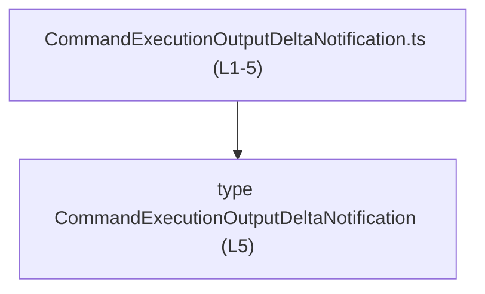
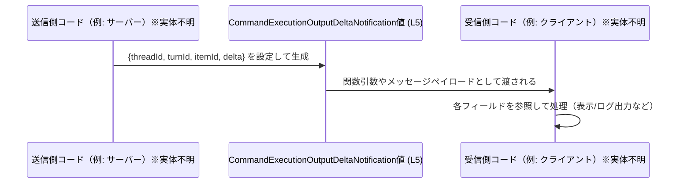

# app-server-protocol\schema\typescript\v2\CommandExecutionOutputDeltaNotification.ts コード解説

## 0. ざっくり一言

- コマンド実行の出力に関する「差分通知」を表現するための、TypeScript のオブジェクト型エイリアスを 1 つ定義したファイルです（`export type ...` 定義: CommandExecutionOutputDeltaNotification.ts:L5-5）。
- Rust 側など別の言語から `ts-rs` で自動生成されており、手動編集しないことがコメントで明示されています（CommandExecutionOutputDeltaNotification.ts:L1-1, L3-3）。

---

## 1. このモジュールの役割

### 1.1 概要

- このファイルは、`CommandExecutionOutputDeltaNotification` という型エイリアスを定義しエクスポートします（CommandExecutionOutputDeltaNotification.ts:L5-5）。
- 型は 4 つの文字列プロパティ `threadId`, `turnId`, `itemId`, `delta` を持つオブジェクト構造を表します（CommandExecutionOutputDeltaNotification.ts:L5-5）。
- 先頭のコメントにより、この型定義はコード生成ツール `ts-rs` によって生成されたものであり、手で編集しない前提であることが分かります（CommandExecutionOutputDeltaNotification.ts:L1-1, L3-3）。

### 1.2 アーキテクチャ内での位置づけ

このチャンクに現れる情報から分かる範囲は次のとおりです。

- **エクスポートされる型**  
  `CommandExecutionOutputDeltaNotification` は `export type` で公開されているため、同一プロジェクト内の他の TypeScript ファイルからインポートして利用できる公開 API です（CommandExecutionOutputDeltaNotification.ts:L5-5）。
- **依存関係**  
  このファイルには `import` 文が存在せず（CommandExecutionOutputDeltaNotification.ts:L1-5）、TypeScript レベルで他モジュールに依存している様子は見えません。
- **生成元との関係**  
  コメントから、`ts-rs` により「生成された」ことのみが分かりますが、生成元（Rust の型など）の実体はこのチャンクには現れていません（CommandExecutionOutputDeltaNotification.ts:L3-3）。

これを簡単な依存関係図で表すと、次のようになります。



> 補足: 実際にこの型を利用するモジュール（インポート元）や、生成元の定義（Rust など）は、このチャンクには現れていないため図には含めていません。

### 1.3 設計上のポイント

コードから読み取れる設計上の特徴は次のとおりです。

- **コード生成された型定義**  
  - 先頭コメントで「GENERATED CODE」「Do not edit this file manually」と宣言されており（CommandExecutionOutputDeltaNotification.ts:L1-1, L3-3）、人間が直接編集することを前提としていません。
- **状態を持たない単純なデータ構造**  
  - 関数やクラスは存在せず、1 つのオブジェクト型エイリアスのみが定義されています（CommandExecutionOutputDeltaNotification.ts:L5-5）。
- **必須プロパティのみ**  
  - `threadId`, `turnId`, `itemId`, `delta` はいずれも `string` 型で `?` が付いておらず、すべて必須プロパティとして設計されています（CommandExecutionOutputDeltaNotification.ts:L5-5）。
- **エラーハンドリング・並行性**  
  - このファイルにはロジック（関数・クラス・非同期処理）が存在しないため、エラーハンドリングや並行実行に関する方針はコードからは分かりません（CommandExecutionOutputDeltaNotification.ts:L1-5）。

---

## 2. 主要な機能一覧

このファイルが提供する機能は、型定義 1 つに集約されています。

- `CommandExecutionOutputDeltaNotification` 型:  
  4 つの文字列フィールドを持つ通知オブジェクトの構造を定義する型エイリアスです（CommandExecutionOutputDeltaNotification.ts:L5-5）。

---

## 3. 公開 API と詳細解説

### 3.1 型一覧（構造体・列挙体など）

このファイルで公開されている型は次の 1 つです。

| 名前 | 種別 | フィールド | 役割 / 用途（名前からの解釈） | 定義位置 |
|------|------|-----------|------------------------------|----------|
| `CommandExecutionOutputDeltaNotification` | 型エイリアス（オブジェクト型） | `threadId: string`, `turnId: string`, `itemId: string`, `delta: string` | 型名とプロパティ名から、特定のスレッド (`threadId`) 内のあるターン (`turnId`) に属するアイテム (`itemId`) についての出力差分 (`delta`) を 1 つのオブジェクトにまとめた通知データを表すものと解釈できます（名前からの推測であり、実際の意味はこのチャンクには明記されていません）。 | CommandExecutionOutputDeltaNotification.ts:L5-5 |

#### 契約（Contracts）とエッジケース（型レベル）

コードから読み取れる「契約」と、型レベルのエッジケースは次のとおりです（すべて CommandExecutionOutputDeltaNotification.ts:L5-5 に基づきます）。

- **契約（型システム上の前提）**
  - 4 つのプロパティはすべて **必須** です。
    - 省略すると TypeScript のコンパイルエラーになります。
  - 各プロパティは `string` 型です。
    - 数値・オブジェクトなどをそのまま代入するとコンパイルエラーになります（型アサーション等を除く）。
- **エッジケース（型で表現されていない部分）**
  - 空文字列 (`""`) を禁止するルールは型に含まれていません。
    - `threadId: ""` のような値も型的には許容されます。
  - `delta` の中身（テキスト形式か、JSON 文字列かなど）は型定義からは分かりません。
  - 特定の ID 形式（UUID など）も型では表現されておらず、単なる `string` として扱われます。

### 3.2 関数詳細（最大 7 件）

このファイルには関数・メソッド定義が存在しません（CommandExecutionOutputDeltaNotification.ts:L1-5）。

- そのため、アルゴリズム・エラーハンドリング・非同期処理などのロジックは、このチャンクからは読み取れません。

### 3.3 その他の関数

- 該当なし（関数が 1 つも定義されていません: CommandExecutionOutputDeltaNotification.ts:L1-5）。

---

## 4. データフロー

このファイルには値生成や送受信を行うコードは含まれていないため、**実際の処理フローは不明**です（CommandExecutionOutputDeltaNotification.ts:L1-5）。

ただし、型名・フィールド名から、次のような「アプリケーション内での値の流れ」が想定されます。  
以下は **使用イメージとしての一般的なデータフロー** であり、実際の実装がこの通りであるとは限りません。



- 上記は、**この型が単に 4 つの `string` フィールドを持つオブジェクトである**という事実（CommandExecutionOutputDeltaNotification.ts:L5-5）と、型名から読み取れる「通知」のニュアンスから構成した一般図です。
- 実際にネットワーク送信されるか、ローカルでのみ使われるかなどは、このチャンクには現れていません。

---

## 5. 使い方（How to Use）

### 5.1 基本的な使用方法

以下は、`CommandExecutionOutputDeltaNotification` 型をインポートして値を生成し、別の関数に渡す基本的な例です。  
ここで示すファイルパスは例であり、実際のパスはプロジェクト構造に依存します。

```typescript
// CommandExecutionOutputDeltaNotification 型をインポートする例                     // 公開された型を利用するためにインポートする
import type { CommandExecutionOutputDeltaNotification } from "./CommandExecutionOutputDeltaNotification"; // 実際の相対パスはプロジェクトに依存

// 通知を受け取って処理する関数の例                                               // この型の値を引数として受け取る関数
function handleDeltaNotification(
    notification: CommandExecutionOutputDeltaNotification,                         // 型注釈により、4 つの string フィールドが必須になる
): void {
    console.log("thread", notification.threadId);                                  // threadId フィールドを使用
    console.log("turn", notification.turnId);                                      // turnId フィールドを使用
    console.log("item", notification.itemId);                                      // itemId フィールドを使用
    console.log("delta", notification.delta);                                      // delta フィールドを使用
}

// 通知オブジェクトを生成して関数に渡す例                                         // 型に適合するオブジェクトリテラルを作成
const notification: CommandExecutionOutputDeltaNotification = {                    // 4 つのフィールドがすべて必要
    threadId: "thread-123",                                                        // スレッドを識別する文字列（意味は実装側に依存）
    turnId: "turn-1",                                                              // ターンを識別する文字列
    itemId: "item-42",                                                             // アイテムを識別する文字列
    delta: "partial output text",                                                  // 出力の差分を表す文字列（形式はこの型からは分からない）
};

handleDeltaNotification(notification);                                             // 通知を処理する
```

この例では、TypeScript の静的型検査により、各フィールドの **有無** と **型 (`string`)** がコンパイル時にチェックされます。

### 5.2 よくある使用パターン

この型は単なるオブジェクト構造の定義なので、次のような使い方が考えられます。

1. **イベントハンドラの引数として受け取る**

```typescript
// 通知をコールバックで受け取るインターフェースの例                      // コールバックの引数型として利用
type DeltaListener = (notification: CommandExecutionOutputDeltaNotification) => void;

// リスナーを登録する関数のシグネチャ例                                   // 実装は別ファイルで行う想定
function registerDeltaListener(listener: DeltaListener): void {
    // 実装はこのチャンクには存在しない（ここでは例示のみ）
}
```

1. **外部から受け取ったデータをこの型にマッピングして扱う**

```typescript
// 任意の入力を this 型に変換するヘルパーのシグネチャ例                       // 実際の変換ロジックはアプリケーション固有
function toCommandExecutionOutputDeltaNotification(
    raw: any,                                                                      // 入力データ: 形式は不明
): CommandExecutionOutputDeltaNotification {
    // 実装詳細はこのチャンクには存在しないので省略                          // ここでは「型の戻り値」を示す用途のみ
    return raw as CommandExecutionOutputDeltaNotification;                         // 例として型アサーションを使用
}
```

> 実際のイベント駆動方式やデータ受信元（WebSocket, HTTP など）は、このチャンクには現れていません。

### 5.3 よくある間違い

型定義から推測できる誤用例と、正しい利用例を対比します。

```typescript
import type { CommandExecutionOutputDeltaNotification } from "./CommandExecutionOutputDeltaNotification";

// 間違い例: 必須フィールドの欠落                                              // itemId が欠けている
const badNotification1: CommandExecutionOutputDeltaNotification = {
    threadId: "t1",
    turnId: "turn-1",
    // itemId: "item-1",                                                         // これがないとコンパイルエラー
    delta: "output",
};

// 間違い例: 型の不一致                                                       // threadId に number を入れている
const badNotification2: CommandExecutionOutputDeltaNotification = {
    threadId: 123,                                                                // エラー: number は string に代入できない
    turnId: "turn-1",
    itemId: "item-1",
    delta: "output",
};

// 正しい例: 4 つのフィールドすべてに string を指定                           // 型定義に完全に一致する
const okNotification: CommandExecutionOutputDeltaNotification = {
    threadId: "t1",
    turnId: "turn-1",
    itemId: "item-1",
    delta: "output",
};
```

TypeScript の型安全性により、上記 `badNotification1`, `badNotification2` はコンパイル時に検出されます。

### 5.4 使用上の注意点（まとめ）

- **生成コードは直接編集しない**
  - ファイル先頭に「GENERATED CODE」「Do not edit this file manually」とあるため（CommandExecutionOutputDeltaNotification.ts:L1-1, L3-3）、型を変更したい場合は**生成元の定義**（このチャンクには存在しません）を修正し、再生成する必要があります。
- **フィールドはすべて必須**
  - 4 つのプロパティはすべて必須であり、省略するとコンパイルエラーになります（CommandExecutionOutputDeltaNotification.ts:L5-5）。
- **値の妥当性検証は別途必要**
  - 型はすべて単なる `string` 型であり、空文字や特定フォーマットの妥当性は保証しません（CommandExecutionOutputDeltaNotification.ts:L5-5）。
  - 実際の ID 形式や `delta` の内容に対する検証・エラー処理は、別のレイヤーで行う必要があります。
- **安全性・エラー・並行性**
  - この型はコンパイル時の静的な構造定義に限られており、実行時のエラー処理や並行実行の制御は行いません。
  - 非同期処理やネットワーク通信に関する安全性は、この型を利用する側のコードで担保する必要があります。

---

## 6. 変更の仕方（How to Modify）

### 6.1 新しい機能を追加する場合

このファイルは生成コードであり、先頭コメントから「手で編集しない」ことが明示されています（CommandExecutionOutputDeltaNotification.ts:L1-1, L3-3）。  
そのため、型を拡張したい場合の一般的な方針は次のようになります。

1. **生成元の定義を修正する**
   - 生成元（おそらく別言語で書かれた型定義）で、`threadId` などと対応する構造体・型にフィールドを追加・変更します。
   - 生成元の場所や言語はこのチャンクには現れていないため「不明」です。
2. **`ts-rs` による再生成を実行する**
   - コメントから、`ts-rs` が生成に使用されていることは分かりますが（CommandExecutionOutputDeltaNotification.ts:L3-3）、実際のコマンドやビルド手順はこのチャンクには含まれていません。
3. **生成後、利用箇所のコンパイルエラーを確認する**
   - フィールド追加や型変更により、他ファイルでの利用コードにコンパイルエラーが発生し得ます。
   - 型エラーを解消することで、新しい構造に全利用箇所を追随させます。

### 6.2 既存の機能を変更する場合

このファイル内だけに着目した場合の注意点は次のとおりです。

- **影響範囲の確認**
  - `CommandExecutionOutputDeltaNotification` は `export type` なので（CommandExecutionOutputDeltaNotification.ts:L5-5）、他モジュールから利用されている可能性があります。
  - フィールド名の変更や削除は、すべてのインポート先でのコンパイルエラーにつながります。
- **契約の維持**
  - フィールドの意味や必須性を変更する場合、利用側コードが暗黙に前提としている契約を壊さないよう注意する必要があります。
  - ただし、そのような前提がどのように使われているかは、このチャンクからは分かりません。
- **リファクタリング上の注意**
  - 手でこのファイルを編集すると、再生成時に上書きされる可能性が高いと考えられます（生成コードであることが明示されているため: CommandExecutionOutputDeltaNotification.ts:L1-1, L3-3）。
  - 永続的な変更を行う場合は、必ず生成元の定義を変更する必要があります。

---

## 7. 関連ファイル

このチャンクに現れる情報から、直接の関連ファイルとして確実に言えるのは次の点だけです。

| パス | 役割 / 関係 |
|------|------------|
| 不明 | このファイルには `import` 文が存在せず（CommandExecutionOutputDeltaNotification.ts:L1-5）、他の TypeScript ファイルとの直接の依存関係は確認できません。 |
| （生成元ファイル・不明） | コメントにより、この型は `ts-rs` により生成されたことが示されていますが（CommandExecutionOutputDeltaNotification.ts:L3-3）、生成元のファイルパスや言語（Rust など）はこのチャンクには現れていません。 |
| （テストコード・不明） | このファイルと直接対応するテストファイル（例: `CommandExecutionOutputDeltaNotification.test.ts` など）は、このチャンクには現れていません。 |

---

### Bugs / Security / Tests / Performance に関する補足

- **Bugs / Security**
  - このファイルは単なる型定義であり、実行時ロジックを含まないため、ここに記述されたコード単体から特有のバグやセキュリティ脆弱性は読み取れません（CommandExecutionOutputDeltaNotification.ts:L1-5）。
- **Contracts / Edge Cases**
  - 契約・エッジケースについては 3.1 の表およびその下の節にまとめたとおり、型レベルで「4 つの string フィールドが必須」という点のみが明示されています（CommandExecutionOutputDeltaNotification.ts:L5-5）。
- **Tests**
  - テストコードはこのチャンクには含まれておらず、どのようにこの型が検証されているかは不明です。
- **Performance / Scalability**
  - 型定義のみであるため、パフォーマンスやスケーラビリティに関する懸念はこのファイル単体からは生じません。実際の負荷は、この型をどの程度の頻度で生成・送受信するかといった利用側の実装に依存します。
