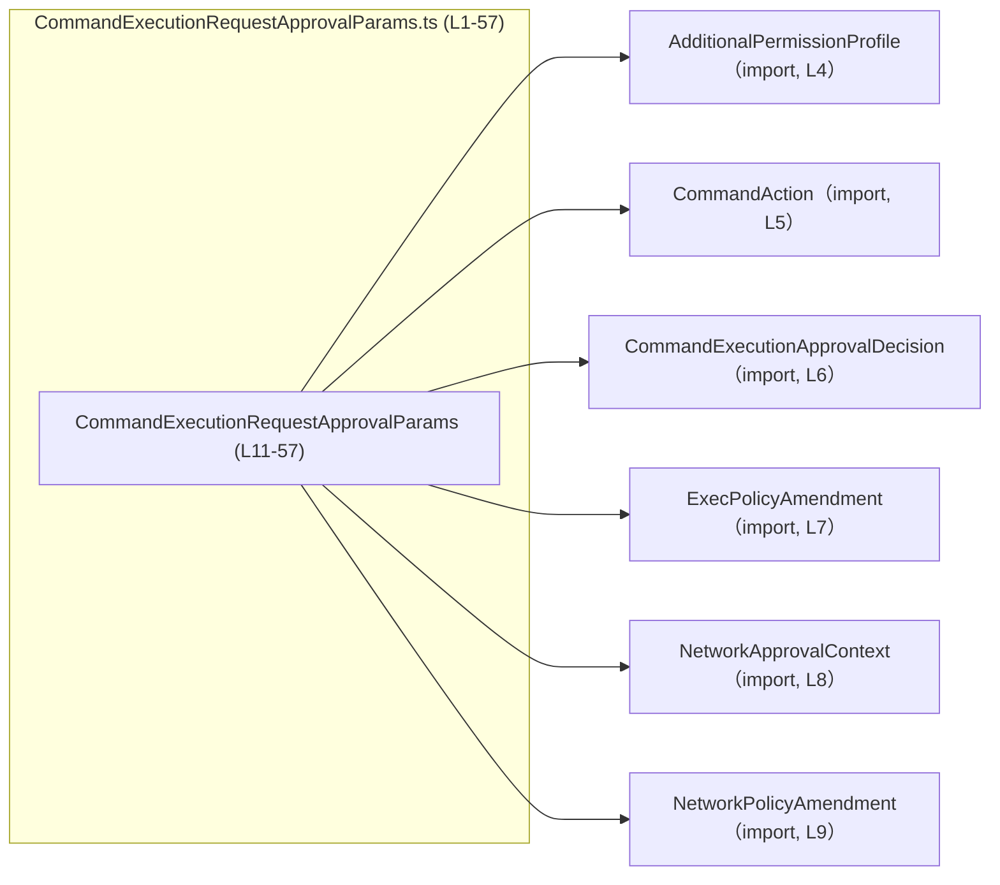
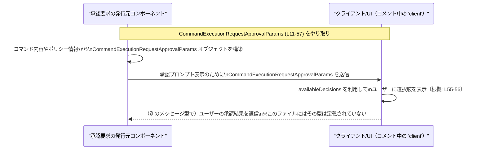

# app-server-protocol/schema/typescript/v2/CommandExecutionRequestApprovalParams.ts

## 0. ざっくり一言

このファイルは、**コマンド実行の承認プロンプト用のパラメータを表現する TypeScript 型 `CommandExecutionRequestApprovalParams`** を定義する、自動生成コードです。  
Rust の型から ts-rs によって生成されており、手動編集は想定されていません（`GENERATED CODE! DO NOT MODIFY BY HAND!` のコメントより。根拠: CommandExecutionRequestApprovalParams.ts:L1-3）。

---

## 1. このモジュールの役割

### 1.1 概要

- このモジュールは、**アプリケーションサーバーとクライアント間のプロトコル**において、コマンド実行の承認を行う際の**リクエスト（承認コールバック）パラメータの構造**を提供します（型名とコメントの「approval callback」より。根拠: L11, L13）。
- スレッド・ターン・アイテムを識別する ID に加えて、**承認 ID、説明文、ネットワーク承認コンテキスト、コマンド文字列や作業ディレクトリ、ポリシー変更案、選択可能な決定肢**など、承認 UI に必要な情報をまとめて持ちます（根拠: L11, L21, L25, L29, L33, L37, L41, L45, L49, L53, L57）。

### 1.2 アーキテクチャ内での位置づけ

このファイルは TypeScript のスキーマ定義であり、他のスキーマ型に依存しています。依存関係は次のとおりです。

- `CommandExecutionRequestApprovalParams` は、追加パーミッションやコマンド解析結果、ネットワーク関連の情報、承認決定肢に関して、別ファイルで定義された型を参照します（根拠: import 文 L4-9）。



> 補足: 依存先の各型の具体的な中身はこのチャンクには現れません（根拠: CommandExecutionRequestApprovalParams.ts:L4-9）。

### 1.3 設計上のポイント

- **自動生成コード**  
  - ファイル冒頭に「GENERATED CODE! DO NOT MODIFY BY HAND!」とあり、ts-rs により生成されていることが明示されています（根拠: L1-3）。  
  - そのため、この型の変更は Rust 側の定義から行う設計になっています。

- **データ専用（ロジックなし）**  
  - `export type ... = { ... }` で 1 つの型エイリアスを定義しているだけで、関数やクラス、ロジックは一切含まれていません（根拠: L11-57）。

- **必須 ID + 多くの任意フィールド**  
  - `threadId`, `turnId`, `itemId` の 3 つは必須の `string` プロパティとして定義されています（根拠: L11）。
  - それ以外のプロパティはすべて `?:` でオプショナルかつ `| null` を許容しており、「**プロパティ自体が存在しない場合**」と「**存在するが値が null の場合**」の両方を表現できます（例: `approvalId?: string | null`。根拠: L21, L25, L29, L33, L37, L41, L45, L49, L53, L57）。

- **コメントで挙動の契約を記述**  
  - `approvalId` について、「通常の shell/unified_exec の承認では null」「zsh-exec-bridge のサブコマンド承認では、親 `itemId` と異なる UUID が入る」といった詳細な契約がコメントで説明されています（根拠: L13-19）。
  - `availableDecisions` については「クライアントがこのプロンプトで提示してよい決定肢の順序付きリスト」とコメントされています（根拠: L55-56）。

---

## 2. 主要な機能一覧

このモジュール（ファイル）が提供する主要な「機能」は、1 つの型定義に集約されています。

- `CommandExecutionRequestApprovalParams` 型:  
  コマンド実行の承認プロンプトに必要な情報（ID、コマンド内容、ネットワークコンテキスト、ポリシー変更案、選択可能な決定肢など）を 1 つのオブジェクトとして表現する（根拠: L11-57）。

---

## 3. 公開 API と詳細解説

### 3.1 型一覧（構造体・列挙体など）

このファイルで直接エクスポートされるのは 1 つの型エイリアスです。その他は参照だけ行っています。

| 名前 | 種別 | 役割 / 用途 | 定義位置 / 備考 |
|------|------|-------------|------------------|
| `CommandExecutionRequestApprovalParams` | 型エイリアス（オブジェクト型） | コマンド実行承認コールバックのパラメータ全体を表現するコンテナ | 本ファイルで定義・エクスポート（根拠: L11-57） |
| `AdditionalPermissionProfile` | 型（詳細不明） | 追加で要求されるパーミッションのプロファイルを表現すると解釈できる | 別ファイルから import のみ（根拠: L4）。中身はこのチャンクには現れない |
| `CommandAction` | 型（詳細不明） | コマンドを「親コマンド + 引数」などにパースした結果を表すものと解釈できる | 別ファイルから import のみ（根拠: L5） |
| `CommandExecutionApprovalDecision` | 型（詳細不明） | クライアントが選択できる承認・拒否・一時許可などの決定肢と解釈できる | 別ファイルから import のみ（根拠: L6, L55-56） |
| `ExecPolicyAmendment` | 型（詳細不明） | 実行ポリシーを変更する提案（特定コマンドを今後自動許可する等）を表すと解釈できる | 別ファイルから import のみ（根拠: L7, L47-49） |
| `NetworkApprovalContext` | 型（詳細不明） | マネージドネットワークに関する承認プロンプト用コンテキストを表す | 別ファイルから import のみ（根拠: L8, L27-29） |
| `NetworkPolicyAmendment` | 型（詳細不明） | ネットワークポリシー（ホストの許可/拒否）変更案を表すと解釈できる | 別ファイルから import のみ（根拠: L9, L51-53） |

> 「解釈できる」という表現を用いているものは、型名とコメントからの推測であり、このチャンクだけでは厳密な定義は分かりません。

### 3.2 `CommandExecutionRequestApprovalParams` 型の詳細

#### `CommandExecutionRequestApprovalParams`

**概要**

- コマンド実行の承認コールバックに渡される情報をまとめたオブジェクト型です（根拠: 型名 L11 と `approvalId` コメント L13-19）。
- スレッド/ターン/アイテムを識別する ID に加え、UI 上での説明やネットワーク関連情報、実際のコマンド情報、ポリシー変更案、利用可能な承認決定肢を含みます（根拠: L11, L21, L25, L29, L33, L37, L41, L45, L49, L53, L57）。

**フィールド**

| フィールド名 | 型 | 必須/任意 | 説明 |
|-------------|----|-----------|------|
| `threadId` | `string` | 必須 | 会話スレッドやセッションを識別する ID と推測されますが、コメントはありません（根拠: L11）。 |
| `turnId` | `string` | 必須 | スレッド内の「ターン」（発話やステップ）を識別する ID と推測されますが、コメントはありません（根拠: L11）。 |
| `itemId` | `string` | 必須 | この承認対象アイテムを識別する ID。`approvalId` コメント内で「parent itemId」として参照されています（根拠: L11, L17-18）。 |
| `approvalId` | `string \| null`（オプショナル） | 任意 | この承認コールバック自体の一意な ID。通常の shell/unified_exec 承認では null で、zsh-exec-bridge のサブコマンド承認では親 `itemId` と異なる UUID が入る、と説明されています（根拠: L13-19, L21）。 |
| `reason` | `string \| null`（オプショナル） | 任意 | 承認の理由や説明（例: ネットワークアクセスの要求）を人間向けに伝える文字列（根拠: L23, L25）。 |
| `networkApprovalContext` | `NetworkApprovalContext \| null`（オプショナル） | 任意 | マネージドネットワークに関する承認プロンプト用コンテキスト。具体的な構造は別ファイルの定義に依存します（根拠: L27-29）。 |
| `command` | `string \| null`（オプショナル） | 任意 | 実行されるコマンドライン文字列（根拠: L31-33）。 |
| `cwd` | `string \| null`（オプショナル） | 任意 | コマンドの実行時カレントディレクトリ（working directory）（根拠: L35-37）。 |
| `commandActions` | `Array<CommandAction> \| null`（オプショナル） | 任意 | コマンドをパースした「アクション」のリスト。UI 向けの見やすい表示用としてベストエフォートで生成されるとコメントされています（根拠: L39-41）。 |
| `additionalPermissions` | `AdditionalPermissionProfile \| null`（オプショナル） | 任意 | このコマンドに対して追加で要求されるパーミッションの情報（根拠: L43, L45）。 |
| `proposedExecpolicyAmendment` | `ExecPolicyAmendment \| null`（オプショナル） | 任意 | 今後同種のコマンドをプロンプトなしで許可するための「実行ポリシー変更案」。承認 UI から適用できることを意図していると解釈できます（根拠: L47-49）。 |
| `proposedNetworkPolicyAmendments` | `Array<NetworkPolicyAmendment> \| null`（オプショナル） | 任意 | 将来のリクエスト向けのネットワークポリシー変更案（ホストの許可/拒否など）のリスト（根拠: L51-53）。 |
| `availableDecisions` | `Array<CommandExecutionApprovalDecision> \| null`（オプショナル） | 任意 | クライアントがこのプロンプトに対して提示できる決定肢（承認/拒否/一度だけ許可など）の順序付きリスト（根拠: L55-57）。 |

> フィールド定義全体の根拠: CommandExecutionRequestApprovalParams.ts:L11-57。

**用途**

- コメント中の「approval callback」から、この型は **承認コールバックに渡されるパラメータ**として使われることが分かります（根拠: L13-19）。
- `availableDecisions` が「クライアントが提示できる決定肢」と説明されているため、クライアント側の UI はこのリストを元にボタンやメニューを構築することが想定されます（根拠: L55-56）。
- `proposedExecpolicyAmendment` や `proposedNetworkPolicyAmendments` は、「今後同様のリクエストを自動的に許可/拒否できるようにするためのポリシー変更案」を提示する目的で使われると解釈できます（根拠: L47-49, L51-53）。

**内部構造のポイント（ロジックの代わりに）**

ロジックはありませんが、情報の層構造として整理できます。

1. **識別情報層**（必須）  
   - `threadId`, `turnId`, `itemId` によって、この承認リクエストがどの会話/ターン/アイテムに属するかを表します（根拠: L11）。

2. **承認コールバック識別子**  
   - `approvalId` により、同じ `itemId` に対して複数のサブコマンド承認がある場合でも、一意にコールバックを識別できます（根拠: L17-19, L21）。

3. **説明・コンテキスト層**  
   - `reason`, `networkApprovalContext` により、なぜ承認が必要なのか（例: ネットワークアクセス）をユーザーに説明するための情報が付与されます（根拠: L23-25, L27-29）。

4. **コマンド実行コンテキスト層**  
   - `command`, `cwd`, `commandActions` により、実際に何がどこで実行されるのかを表します（根拠: L31-33, L35-37, L39-41）。

5. **ポリシー変更案層**  
   - `additionalPermissions`, `proposedExecpolicyAmendment`, `proposedNetworkPolicyAmendments` により、現在の承認に加えて今後のリクエスト運用（権限やネットワークポリシー）をどう変えるかの提案が含まれます（根拠: L43-45, L47-49, L51-53）。

6. **決定肢層**  
   - `availableDecisions` により、クライアントが提示すべき意思決定の選択肢が順序付きで提供されます（根拠: L55-57）。

**Examples（使用例）**

> ここでの関数 `sendApprovalRequest` は、この型を利用してどこかに承認リクエストを送る架空の関数であり、このファイルには定義されていません。

```typescript
// CommandExecutionRequestApprovalParams 型をインポートする
import type { CommandExecutionRequestApprovalParams } from "./CommandExecutionRequestApprovalParams"; // 本ファイルと同じディレクトリ想定

// 最小限の情報だけを設定した承認リクエストの例
const minimalParams: CommandExecutionRequestApprovalParams = { // 型注釈により必須フィールドがチェックされる
    threadId: "thread-123",   // 必須: スレッド ID（意味はこのファイルからは詳細不明）
    turnId: "turn-001",       // 必須: ターン ID
    itemId: "item-abc",       // 必須: アイテム ID
    // それ以外のフィールドは省略可能・null 許容
};

// よりリッチな承認リクエストの例
const richParams: CommandExecutionRequestApprovalParams = {
    threadId: "thread-123",
    turnId: "turn-002",
    itemId: "item-def",
    approvalId: null,                     // 通常の shell/unified_exec 承認では null（根拠: L15, L21）
    reason: "Requires outbound network",  // なぜ承認が必要かの説明（根拠: L23-25）
    command: "curl https://example.com",  // 実行コマンド（根拠: L31-33）
    cwd: "/home/user",                    // 作業ディレクトリ（根拠: L35-37）
    // networkApprovalContext, commandActions, などは必要に応じて設定
};

// 仮の送信関数に渡す
declare function sendApprovalRequest(
    params: CommandExecutionRequestApprovalParams, // この型を受け取ると仮定
): Promise<void>;

await sendApprovalRequest(richParams); // 型安全に送信される
```

**Errors / Panics**

- この型自体にはロジックがなく、**実行時エラーやパニックを発生させるコードは含まれていません**（根拠: 関数定義が皆無であること L1-57）。
- TypeScript の型検査により、以下のような**コンパイル時エラー**が発生しうる点が安全性のポイントです:
  - `threadId` / `turnId` / `itemId` を省略した場合: 必須プロパティ欠如エラー（根拠: L11）。
  - `availableDecisions` に `CommandExecutionApprovalDecision` 以外の型の要素を入れた場合: 型不一致エラー（根拠: L57）。

**Edge cases（エッジケース）**

- **オプショナル + null の二重表現**  
  - 例えば `approvalId?: string | null` は、次の 3 状態を取り得ます（根拠: L21）。
    - `approvalId` プロパティが存在しない（`"approvalId" in obj` が false）
    - `approvalId` プロパティはあるが値が `null`
    - `approvalId` プロパティが `string` 値を持つ
  - 利用側は単に `== null` チェック（`approvalId == null`）を用いると、`undefined` と `null` をまとめて扱えますが、`in` チェックと組み合わせて区別することもできます。
- **`availableDecisions` が null/未定義/空配列**  
  - `availableDecisions` は `Array<...> | null` かつオプショナルなので、次のケースがあります（根拠: L57）。
    - プロパティが存在しない（`undefined`）
    - プロパティはあるが `null`
    - 空配列 `[]`
    - 1 個以上の要素を持つ配列
  - コメント上は「クライアントが提示できる決定肢の順序付きリスト」とのみあり、どのケースをどう扱うべきかはこのファイルからは分かりません。クライアント実装時には仕様を別途確認する必要があります。
- **`command` や `cwd` が absent/null**  
  - `command` や `cwd` に対し、利用側で即座に文字列メソッドを呼ぶと、`null` / `undefined` ケースで実行時エラーになり得ます。常に null/undefined チェックを行う必要があります（根拠: L33, L37）。

**使用上の注意点**

- **必須 ID の扱い**  
  - `threadId`, `turnId`, `itemId` の意味はこのファイルだけでは明確ではないため、「**不透明な ID（opaque ID）**」として扱うのが安全です。文字列のフォーマットに依存したロジックを組むと、サーバー側の実装変更に弱くなります（根拠: L11）。
- **セキュリティ上の注意 (`command` / `cwd`)**  
  - `command` は任意のコマンドライン文字列を含みうるため、これをそのままシェルに渡して実行する箇所は**コマンドインジェクション**のリスクを伴います（根拠: 「The command to be executed.」コメント L31-33）。
  - この型自体は単なるデータですが、「**外部入力をそのままコマンドとして実行しない**」「承認 UI で明示的なユーザー同意を得る」などの一般的な防御策が必要です。
- **ネットワーク・ポリシー変更案の適用**  
  - `proposedExecpolicyAmendment` や `proposedNetworkPolicyAmendments` は「提案」に過ぎず、自動的に適用されるものではないと考えられます（コメントに "proposed" とあるため。根拠: L47, L51）。
  - 実際に適用するかどうかはユーザー操作や上位ロジックの判断に委ねる必要があります。
- **コード生成ファイルを直接編集しない**  
  - 冒頭コメントにある通り、「手で編集しない」ことが前提です（根拠: L1-3）。  
    変更が必要な場合は、Rust 側の定義や ts-rs の設定を変更した上で再生成するべきです。

### 3.3 その他の関数

- このファイルには**関数・メソッドの定義は一切存在しません**（根拠: CommandExecutionRequestApprovalParams.ts:L1-57）。
- したがって、補助関数やラッパー関数の一覧もこのチャンクには存在しません。

---

## 4. データフロー

このファイルには実際の処理ロジックは含まれていませんが、コメントから **「承認コールバック」** や **「クライアントが提示する決定肢」** といった役割が読み取れます（根拠: L13-19, L55-56）。  
ここでは、あくまで概念的なレベルで、この型がどのように流れるかの典型的シナリオを図示します。



> 注意: `Producer` や `Consumer` は、この型を使う可能性のある抽象的なコンポーネントを示すものであり、具体的なクラス名や関数名はこのチャンクには現れません。

---

## 5. 使い方（How to Use）

### 5.1 基本的な使用方法

**最小限の承認リクエストを組み立てて送る例**

```typescript
// CommandExecutionRequestApprovalParams 型をインポート
import type { CommandExecutionRequestApprovalParams } from "./CommandExecutionRequestApprovalParams"; // 根拠: 本ファイルの型名 L11

// この型を受け取る外部関数（仮）の宣言
declare function sendApprovalRequest(
    params: CommandExecutionRequestApprovalParams, // 承認リクエストを送る関数と仮定
): Promise<void>;

// 最小限のパラメータで承認リクエストを構築する
const params: CommandExecutionRequestApprovalParams = {
    threadId: "thread-123",   // 必須 ID（L11）
    turnId: "turn-001",       // 必須 ID（L11）
    itemId: "item-xyz",       // 必須 ID（L11）
    // 他のフィールドは省略可
};

// 非同期に承認リクエストを送信する
await sendApprovalRequest(params);
```

### 5.2 よくある使用パターン

コメントに現れるユースケースをもとに、代表的なパターンを 3 つ示します。

#### パターン1: 通常の shell / unified_exec 承認

通常ケースでは `approvalId` は null とされているため（根拠: L15）、省略するか `null` を設定するパターンです。

```typescript
const normalShellApproval: CommandExecutionRequestApprovalParams = {
    threadId: "t1",
    turnId: "turn-shell",
    itemId: "item-shell",
    approvalId: null,                            // 通常のケースでは null（L15, L21）
    command: "ls -la",
    cwd: "/home/user",
    reason: "List directory contents",           // 任意の説明（L23-25）
};
```

#### パターン2: zsh-exec-bridge サブコマンド承認

`approvalId` コメントで説明されている特殊ケースです（根拠: L17-19）。

```typescript
const subcommandApproval: CommandExecutionRequestApprovalParams = {
    threadId: "t1",
    turnId: "turn-zsh",
    itemId: "item-parent",                       // 親アイテムの ID（L17）
    approvalId: "a5e0e2b4-1234-5678-9abc-def0",  // 親 itemId と異なる UUID（L18-19）
    command: "git status",
    cwd: "/repo/project",
    // 同じ itemId に対して複数の approvalId が存在し得る
};
```

#### パターン3: マネージドネットワーク承認 + ポリシー変更案

ネットワーク関連のプロンプト用情報と、今後のポリシー変更案を添付するパターンです（根拠: L27-29, L51-53）。

```typescript
import type { NetworkApprovalContext } from "./NetworkApprovalContext";           // L8
import type { NetworkPolicyAmendment } from "./NetworkPolicyAmendment";           // L9

declare const netCtx: NetworkApprovalContext;                                     // 実際の定義は別ファイル
declare const amendments: NetworkPolicyAmendment[];                               // ネットワークポリシー変更案

const networkApproval: CommandExecutionRequestApprovalParams = {
    threadId: "t-net",
    turnId: "turn-net",
    itemId: "item-net",
    reason: "Requesting outbound HTTP to example.com",                            // ネットワークアクセス要求（L23-25）
    networkApprovalContext: netCtx,                                               // マネージドネットワーク用コンテキスト（L27-29）
    command: "curl https://example.com",
    proposedNetworkPolicyAmendments: amendments,                                  // 将来のポリシー変更案（L51-53）
};
```

### 5.3 よくある間違い

この型の定義から推測される、誤りやすい使い方を示します。

```typescript
import type { CommandExecutionRequestApprovalParams } from "./CommandExecutionRequestApprovalParams";

// 誤り例: オプショナルかつ null 許容のフィールドを null チェックせずに使う
function showCommandWrong(params: CommandExecutionRequestApprovalParams) {
    // command は string | null | undefined になり得る（L31-33）
    console.log(params.command.toUpperCase());  // コンパイル時には通るが、ランタイムで TypeError の可能性
}

// 正しい例: null / undefined の可能性を考慮する
function showCommandSafe(params: CommandExecutionRequestApprovalParams) {
    if (params.command == null) {               // null と undefined をまとめてチェック
        console.log("(no command)");
    } else {
        console.log(params.command.toUpperCase());
    }
}
```

```typescript
// 誤り例: availableDecisions を無視して決定肢をハードコードする
function renderPromptWrong(params: CommandExecutionRequestApprovalParams) {
    // コメントでは availableDecisions は「クライアントが提示できる決定肢のリスト」とされている（L55-56）
    // にもかかわらず、ここでは UI を固定のボタンにしてしまっている
    console.log("Buttons: [Allow] [Deny]");
}

// より良い例: availableDecisions を尊重して UI を構築する
function renderPromptBetter(params: CommandExecutionRequestApprovalParams) {
    if (!params.availableDecisions || params.availableDecisions.length === 0) {
        // 仕様上どう扱うべきかはこのファイルからは不明なので、ログやフォールバック処理が必要
        console.warn("No availableDecisions; falling back to default UI");
        return;
    }

    for (const decision of params.availableDecisions) {
        // CommandExecutionApprovalDecision の具体的な構造は不明だが、
        // ここでボタンのラベルや動作を決めると解釈できる（L55-57）
        console.log("Button for decision:", decision);
    }
}
```

### 5.4 使用上の注意点（まとめ）

- **必須フィールドの設定を忘れない**  
  - `threadId`, `turnId`, `itemId` は必須であり、欠如するとコンパイルエラーになります（根拠: L11）。
- **オプショナル + null なフィールドは常にガードする**  
  - `approvalId`, `reason`, `command`, `cwd` などは「存在しない」ケースと「null」のケースがどちらもあり得るため、条件分岐を慎重に行う必要があります（根拠: L21, L25, L29, L33, L37, L41, L45, L49, L53, L57）。
- **セキュリティ上の重要情報を含み得る**  
  - `command`, `cwd`, `additionalPermissions`, ネットワークポリシー変更案などは、誤用すると権限昇格や危険なコマンド実行につながり得るため、常に外部入力として扱うのが安全です（根拠: L31-33, L35-37, L43-45, L47-49, L51-53）。
- **コード生成ファイルを直接編集しない**  
  - ファイル冒頭の注意書きに従い、変更は生成元の Rust 側定義で行う必要があります（根拠: L1-3）。

---

## 6. 変更の仕方（How to Modify）

### 6.1 新しい機能（フィールド）を追加する場合

このファイルは ts-rs による自動生成であり、**直接編集すべきではない**と明記されています（根拠: L1-3）。新しいフィールドを追加したい場合の一般的な流れは次のとおりです。

1. **Rust 側の元となる構造体を特定する**  
   - ts-rs は通常、Rust の構造体や列挙体に `#[derive(TS)]` などを付与して TypeScript 型を生成します。  
   - `CommandExecutionRequestApprovalParams` に対応する Rust 型を検索します（このチャンクには Rust コードは含まれていません）。

2. **Rust 構造体にフィールドを追加する**  
   - 追加したいプロパティ名・型を Rust 側に定義します。
   - プロトコル互換性を考慮する場合は、新しいフィールドをオプショナルにする等の工夫が必要です（TypeScript 側でも `?:` や `| null` に反映される可能性があります）。

3. **ts-rs によるコード生成を再実行する**  
   - ビルドスクリプトや専用コマンドを通じて TypeScript スキーマを再生成します。
   - これにより、本ファイルの内容も自動的に更新されます。

4. **クライアント / サーバー両側の利用箇所を更新する**  
   - 新フィールドを使う場合は、送信側と受信側のロジックをそれぞれ更新し、null/undefined も含めたハンドリングを実装する必要があります。

### 6.2 既存の機能（フィールド）を変更する場合

既存フィールドの名前や型を変更する際には、次の注意点があります。

- **影響範囲の確認**  
  - この型を import しているすべての TypeScript ファイル（例: 同ディレクトリの他のスキーマやクライアント実装）を検索し、利用箇所を洗い出す必要があります。
- **プロトコル互換性**  
  - 型の変更はプロトコルレベルの互換性を破壊する可能性があります。特に、必須フィールドの削除や型変更は既存クライアントに重大な影響を与えます。
  - 互換性を保つには、「フィールドの追加はオプショナルで行う」「意味変更は新しいフィールド名で導入する」などの戦略が一般的です。
- **仕様との整合性**  
  - コメントは仕様の一部として機能しているため（例: `approvalId` の挙動 L13-19）、意味を変える場合はコメントも合わせて更新する必要があります。
- **テストの必要性**  
  - このチャンクにはテストコードは含まれていませんが、プロトコル変更後は、片側だけ古いバージョンのクライアント/サーバーで動作させた場合の挙動も含めて、統合テストを行うことが望ましいです。

---

## 7. 関連ファイル

このモジュールと密接に関係するファイルは、import 文から次のように推定できます（根拠: L4-9）。

| パス | 役割 / 関係 |
|------|------------|
| `./AdditionalPermissionProfile` | `additionalPermissions` フィールドの型を提供する。追加パーミッションに関するスキーマと思われます（根拠: L4, L45）。 |
| `./CommandAction` | `commandActions` フィールドの要素型。コマンドを構造化表現したものと解釈できます（根拠: L5, L41）。 |
| `./CommandExecutionApprovalDecision` | `availableDecisions` の要素型。クライアントに提示される承認決定肢を表すスキーマです（根拠: L6, L55-57）。 |
| `./ExecPolicyAmendment` | `proposedExecpolicyAmendment` の型。実行ポリシー変更案を表すと思われます（根拠: L7, L47-49）。 |
| `./NetworkApprovalContext` | `networkApprovalContext` の型。マネージドネットワーク承認プロンプトのコンテキストを表します（根拠: L8, L27-29）。 |
| `./NetworkPolicyAmendment` | `proposedNetworkPolicyAmendments` の要素型。ネットワークポリシー変更案を表すと解釈できます（根拠: L9, L51-53）。 |

> これらのファイルの中身はこのチャンクには含まれていないため、正確な構造や振る舞いは不明です。
