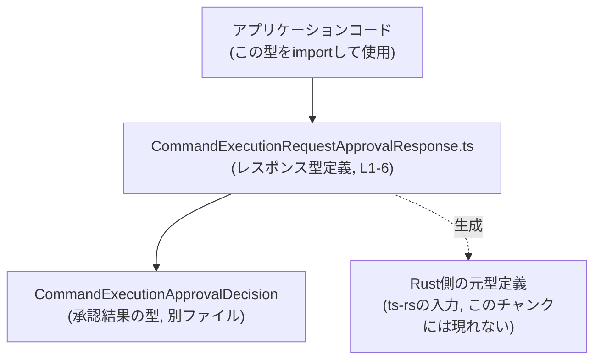
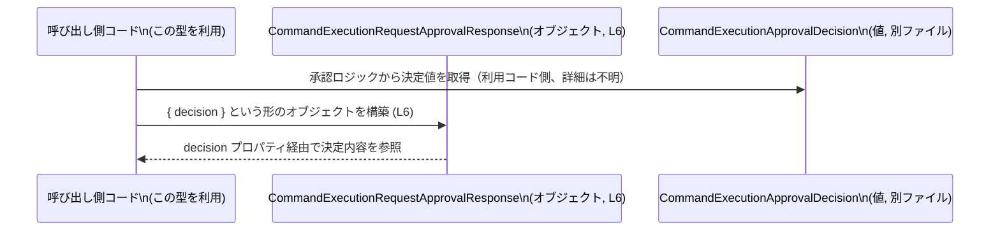

# app-server-protocol/schema/typescript/v2/CommandExecutionRequestApprovalResponse.ts コード解説

## 0. ざっくり一言

`CommandExecutionRequestApprovalResponse` は、**コマンド実行リクエストに対する承認結果を表す TypeScript のレスポンス型**を定義する、コード生成されたファイルです（`CommandExecutionRequestApprovalResponse.ts:L1-3, L6`）。

---

## 1. このモジュールの役割

### 1.1 概要

- このモジュールは、コマンド実行リクエストに対する承認処理の結果を、TypeScript 側で安全に扱うための **レスポンス型** を提供します（`CommandExecutionRequestApprovalResponse.ts:L6`）。
- 中身は `decision` という 1 つのフィールドのみを持つオブジェクト型で、その型は別モジュール `CommandExecutionApprovalDecision` の型により制約されています（`CommandExecutionRequestApprovalResponse.ts:L4, L6`）。
- ファイル全体が `ts-rs` によって自動生成されることがコメントで明示されており、手動編集は禁止されています（`CommandExecutionRequestApprovalResponse.ts:L1-3`）。

### 1.2 アーキテクチャ内での位置づけ

このファイルは、「Rust 側の定義 → ts-rs による生成 → TypeScript 側での利用」という構成の中で、**TypeScript 側の公開スキーマ**を担う位置づけと解釈できます（`CommandExecutionRequestApprovalResponse.ts:L1-3`）。

- 依存関係（このチャンクから読み取れる範囲）:
  - 依存先: `./CommandExecutionApprovalDecision`（承認結果の型）（`CommandExecutionRequestApprovalResponse.ts:L4`）
  - 依存元: このファイルを `import` するアプリケーションコード（このチャンクには現れないので詳細不明）

概念的な依存関係は次のようになります。



※ Rust 側定義や `CommandExecutionApprovalDecision` の中身は、このチャンクには現れないため詳細は不明です。

### 1.3 設計上のポイント

コードから読み取れる設計上の特徴は次のとおりです。

- **自動生成コードであることの明示**  
  - 冒頭コメントに「GENERATED CODE! DO NOT MODIFY BY HAND!」とあり、`ts-rs` による生成であることが書かれています（`CommandExecutionRequestApprovalResponse.ts:L1-3`）。
- **純粋な型定義モジュール**  
  - 関数やクラス、実行ロジックは存在せず、`export type` による型エイリアスのみを公開しています（`CommandExecutionRequestApprovalResponse.ts:L6`）。
- **強い型付けによる安全性**  
  - `decision` フィールドは `CommandExecutionApprovalDecision` 型として明示されており、任意の文字列などを代入できないようにコンパイル時チェックが効きます（`CommandExecutionRequestApprovalResponse.ts:L4, L6`）。
- **状態や並行性は持たない**  
  - 実行コード・状態保持・非同期処理は一切含まれていないため、並行性やスレッドセーフティに関する懸念はこのモジュール単体ではありません（`CommandExecutionRequestApprovalResponse.ts:L4-6`）。

---

## コンポーネントインベントリー（このファイル内）

このチャンクに現れるコンポーネント（型・インポート）の一覧です。

| 名前 | 種別 | 位置 | 公開範囲 | 説明 |
|------|------|------|----------|------|
| `CommandExecutionRequestApprovalResponse` | 型エイリアス（オブジェクト型） | `CommandExecutionRequestApprovalResponse.ts:L6` | `export` | `decision` フィールドを持つレスポンス型。承認リクエストの結果を表現する。 |
| `CommandExecutionApprovalDecision` | 型（詳細不明） | `CommandExecutionRequestApprovalResponse.ts:L4` | このファイルからは `import type` のみ | `decision` の型。決定内容（承認／拒否などと推測されるが、中身はこのチャンクには現れない）。 |

---

## 2. 主要な機能一覧

このモジュールは実行ロジックや関数は持たず、**型定義の提供**が主な機能です。

- `CommandExecutionRequestApprovalResponse` 型: コマンド実行リクエストの承認応答を表すオブジェクト型（`decision` フィールドのみ）（`CommandExecutionRequestApprovalResponse.ts:L6`）。
- `CommandExecutionApprovalDecision` 型の再利用: 別モジュールで定義された承認決定を、そのままレスポンスの `decision` フィールド型として利用（`CommandExecutionRequestApprovalResponse.ts:L4, L6`）。

---

## 3. 公開 API と詳細解説

### 3.1 型一覧（構造体・列挙体など）

このファイル内で直接定義されている、またはインポートされている主要な型の一覧です。

| 名前 | 種別 | 役割 / 用途 | フィールド / 構造 | 位置 |
|------|------|-------------|--------------------|------|
| `CommandExecutionRequestApprovalResponse` | 型エイリアス（オブジェクト型） | コマンド実行リクエストの承認結果を表すレスポンスの構造 | `{ decision: CommandExecutionApprovalDecision }` の形を持つ。`decision` は必須プロパティ。 | `CommandExecutionRequestApprovalResponse.ts:L6` |
| `CommandExecutionApprovalDecision` | 型（別ファイル定義） | `decision` プロパティの型として利用される承認決定の表現。列挙型や union 型である可能性があるが、このチャンクからは不明。 | 構造・具体的なバリアントはこのチャンクには現れない。 | `CommandExecutionRequestApprovalResponse.ts:L4` |

#### `CommandExecutionRequestApprovalResponse` の詳細

**概要**

- `CommandExecutionRequestApprovalResponse` は、**必ず `decision` プロパティを持つオブジェクト**を表す型です（`CommandExecutionRequestApprovalResponse.ts:L6`）。
- `decision` は `CommandExecutionApprovalDecision` 型であり、承認フローにおける「最終的な決定」を表現するために利用されます（`CommandExecutionRequestApprovalResponse.ts:L4, L6`）。

**構造**

```typescript
export type CommandExecutionRequestApprovalResponse = {
    decision: CommandExecutionApprovalDecision,
};
```

（`CommandExecutionRequestApprovalResponse.ts:L6`）

- `decision`: 必須プロパティ。型は `CommandExecutionApprovalDecision`（`CommandExecutionRequestApprovalResponse.ts:L4, L6`）。

**言語固有の安全性**

- TypeScript の静的型チェックにより、`decision` を設定し忘れたり、`CommandExecutionApprovalDecision` と互換性のない値を代入するとコンパイルエラーになります（型構造からの一般的性質）。
- `import type` を用いているため（`CommandExecutionRequestApprovalResponse.ts:L4`）、ビルド時に型情報のみを利用し、バンドル結果にこの型定義が実行コードとして含まれることはありません。これは型情報専用のモジュールであることを示します。

**エラー・並行性**

- このファイルは実行関数を含まないため、このモジュール単体では実行時エラーや並行性の問題は発生しません。
- エラー処理は、この型を利用する側のロジック（例えば HTTP ハンドラやサービス層）に委ねられます。このチャンクにはその利用コードは現れません。

### 3.2 関数詳細

- このファイルには関数定義が存在しません（`CommandExecutionRequestApprovalResponse.ts:L1-6`）。
- したがって、関数に関する詳細テンプレートは適用対象がありません。

### 3.3 その他の関数

| 関数名 | 役割（1 行） |
|--------|--------------|
| なし | このファイルには関数・メソッド定義がありません。 |

---

## 4. データフロー

このモジュール自身には実行ロジックが無いため、「処理フロー」という意味でのデータフローは定義されていません（`CommandExecutionRequestApprovalResponse.ts:L1-6`）。  
ただし、**型レベルでのデータの流れ（どの型がどの型に含まれているか）**は次のように整理できます。

- `CommandExecutionApprovalDecision` 型の値が、レスポンスオブジェクトの `decision` プロパティに格納される（`CommandExecutionRequestApprovalResponse.ts:L4, L6`）。
- 呼び出し側のコードは、このレスポンス型を通じて `decision` を受け取り、分岐などのロジックに利用することが想定されます（名前からの一般的解釈であり、具体的な利用コードはこのチャンクには現れません）。

概念的なシーケンスを図示すると、次のようになります。



> 注意: 上記は、この型構造から自然に想定される**概念図**です。実際にどのコンポーネントが `Decision` を生成するか、どのように送受信されるかはこのチャンクには現れません。

---

## 5. 使い方（How to Use）

### 5.1 基本的な使用方法

`CommandExecutionRequestApprovalResponse` 型を利用して、承認結果レスポンスの型安全性を確保する基本的な例です。

```typescript
// 型定義のインポート                                  // このファイルと依存型を型としてインポート
import type { CommandExecutionRequestApprovalResponse } from "./CommandExecutionRequestApprovalResponse";
import type { CommandExecutionApprovalDecision } from "./CommandExecutionApprovalDecision";

// 承認決定を返す何らかの関数（実装は別モジュール）    // 決定値は CommandExecutionApprovalDecision 型
declare function getApprovalDecision(): CommandExecutionApprovalDecision;

// レスポンスオブジェクトを構築する例
function buildApprovalResponse(): CommandExecutionRequestApprovalResponse {
    const decision = getApprovalDecision();              // 決定値を取得
    return { decision };                                 // decision プロパティを設定して返す
    // { decision } の形でなければコンパイルエラー      // プロパティ名の間違いや未設定はエラーになる
}
```

- `decision` プロパティを省略したり、プロパティ名を変えたりするとコンパイルエラーになります（型構造より）。

### 5.2 よくある使用パターン

#### パターン 1: 非同期 API の戻り値として利用

REST API クライアントや RPC クライアントで、承認結果を取得する非同期関数の戻り値に利用できます。

```typescript
import type { CommandExecutionRequestApprovalResponse } from "./CommandExecutionRequestApprovalResponse";

// コマンド実行承認を問い合わせる API クライアント関数の例
async function fetchApprovalResponse(commandId: string): Promise<CommandExecutionRequestApprovalResponse> {
    const res = await fetch(`/api/commands/${commandId}/approval`);
    // 実際にはレスポンスのバリデーションが必要            // TypeScriptの型は実行時には存在しない
    const json = await res.json() as CommandExecutionRequestApprovalResponse;
    return json;
}

// 呼び出し側
async function handleApproval(commandId: string) {
    const response = await fetchApprovalResponse(commandId);
    // response.decision の型は CommandExecutionApprovalDecision
    // ここから先は decision の値に応じて処理を分岐させる
}
```

> 実行時には型情報が無いため、`as CommandExecutionRequestApprovalResponse` でのキャストは  
> 型安全上は注意が必要です。実運用では `zod` などでのバリデーションが推奨されますが、  
> そのようなライブラリの利用有無はこのチャンクには現れません。

### 5.3 よくある間違い

#### 間違い例 1: プロパティ名の誤り

```typescript
import type { CommandExecutionRequestApprovalResponse } from "./CommandExecutionRequestApprovalResponse";
import type { CommandExecutionApprovalDecision } from "./CommandExecutionApprovalDecision";

declare const decision: CommandExecutionApprovalDecision;

// ❌ 間違い例: プロパティ名が誤っている
const badResponse: CommandExecutionRequestApprovalResponse = {
    // result: decision,  // エラー: 'result' プロパティは存在しない
};

// ✅ 正しい例
const goodResponse: CommandExecutionRequestApprovalResponse = {
    decision, // 正しく decision プロパティとして指定
};
```

#### 間違い例 2: `decision` を省略

```typescript
// ❌ 間違い例: decision プロパティが無い
const invalidResponse: CommandExecutionRequestApprovalResponse = {
    // 空オブジェクトは型を満たさない
    // {} // コンパイルエラー: 'decision' が不足している
};
```

### 5.4 使用上の注意点（まとめ）

- **手動で編集しない**  
  - ファイル先頭にある通り、`ts-rs` による生成ファイルであり、直接編集しない前提です（`CommandExecutionRequestApprovalResponse.ts:L1-3`）。
- **プロパティ `decision` は必須**  
  - `decision` を省略したり、別名にしたりするとコンパイルエラーになります（`CommandExecutionRequestApprovalResponse.ts:L6`）。
- **実行時の型保証はない**  
  - TypeScript の型はコンパイル時のみ有効であり、実行時に外部から JSON を読み込む場合は別途バリデーションが必要です。
- **並行性・スレッド安全性への影響はない**  
  - このモジュールは純粋な型定義のみで、非同期処理や共有状態を扱わないため、並行性に関する考慮は不要です（`CommandExecutionRequestApprovalResponse.ts:L4-6`）。

---

## 6. 変更の仕方（How to Modify）

### 6.1 新しい機能を追加する場合

このファイルは自動生成されているため（`CommandExecutionRequestApprovalResponse.ts:L1-3`）、**直接変更するべきではありません**。  
一般的には、次のような手順になります（ただし、具体的な Rust 側ファイルパスなどはこのチャンクには現れません）。

1. **Rust 側の元定義を変更する**  
   - `CommandExecutionRequestApprovalResponse` に対応する Rust の構造体または型定義にフィールドを追加・変更する（ts-rs の一般的な運用）。
2. **ts-rs のコード生成を再実行する**  
   - プロジェクトのビルドスクリプトや専用コマンドで TypeScript コードを再生成する。
3. **再生成されたこのファイルを利用する**  
   - 追加されたフィールドが自動的に TypeScript 側にも反映される。

このチャンクだけでは ts-rs の実行方法や Rust 側の具体的な定義場所は分からないため、「Rust 側定義と ts-rs の生成プロセスを確認する必要がある」というレベルにとどまります。

### 6.2 既存の機能を変更する場合

`CommandExecutionRequestApprovalResponse` の構造を変更したい場合も、基本的には 6.1 と同様です。

- **影響範囲の確認**
  - この型を `import` している TypeScript コードすべてに影響します（ファイル自体からは参照先は分かりません）。
- **契約（前提条件）の維持**
  - `decision` プロパティの意味や型（`CommandExecutionApprovalDecision`）を変更すると、利用側コードのロジックにも変更が必要になる可能性があります。
- **テストの再確認**
  - この型を前提にした API レスポンスのテストや型テストが存在する場合、それらの更新が必要です。このチャンクにはテストコードは現れません。

---

## 7. 関連ファイル

このファイルと密接に関係するのは、少なくとも次のファイルです。

| パス（相対 / 予想される位置） | 役割 / 関係 |
|-----------------------------|------------|
| `./CommandExecutionApprovalDecision` | `decision` プロパティの型を定義するモジュール。インポートされているが、このチャンクには中身は現れない（`CommandExecutionRequestApprovalResponse.ts:L4`）。 |
| Rust 側の ts-rs 対応定義ファイル | この TypeScript 型の元になる Rust の型定義。コメントに `ts-rs` とあるため存在が示唆されるが、具体的なパスや内容はこのチャンクには現れません（`CommandExecutionRequestApprovalResponse.ts:L1-3`）。 |

---

### Bugs / Security / Edge Cases についての補足

- **Bugs（バグ）**  
  - このモジュールは型定義のみであり、実行ロジックを含まないため、ロジック上のバグはここからは発生しません。  
    不整合があるとすれば、「Rust 側元定義」と「生成された TypeScript 型」の間のズレですが、これは生成プロセス全体の問題であり、このチャンクだけでは判断できません。
- **Security（セキュリティ）**  
  - セキュリティ上の問題は主に実行ロジック側に依存し、この型定義自体から特別な脆弱性は読み取れません。
- **Edge Cases（エッジケース）**  
  - 型レベルでは、`decision` が `undefined` / `null` になることは許容されていません（プロパティは必須で、Union に `undefined` が含まれていない限り）（`CommandExecutionRequestApprovalResponse.ts:L6`）。
  - 実行時に外部入力をパースしてこの型にマッピングする場合、`decision` が欠けている・型が違うなどのケースは、利用側で明示的に扱う必要があります（このチャンクには具体的な処理は現れません）。

以上が、このファイル `CommandExecutionRequestApprovalResponse.ts` のコードから読み取れる範囲での、役割・構造・使用方法の整理です。
