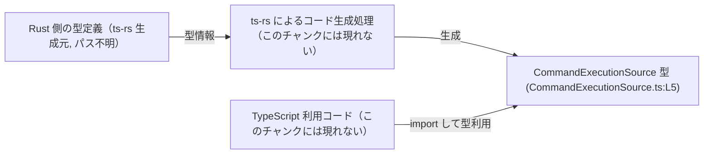
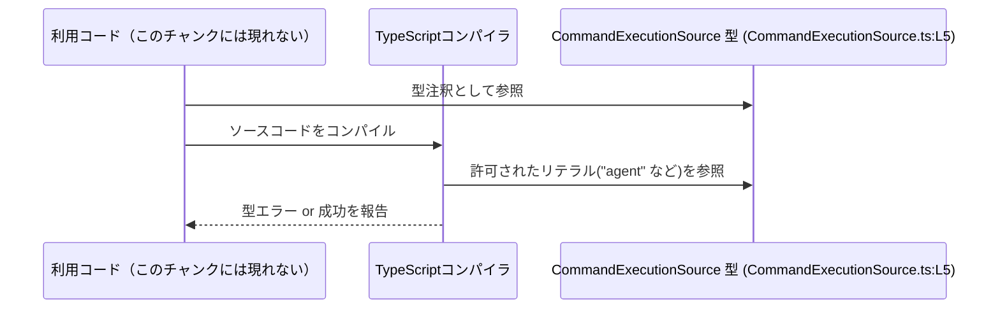

# app-server-protocol/schema/typescript/v2/CommandExecutionSource.ts

## 0. ざっくり一言

このファイルは、`CommandExecutionSource` という TypeScript の文字列リテラル・ユニオン型（string literal union）を 1 つだけ定義する、自動生成された型定義モジュールです（CommandExecutionSource.ts:L1-5）。

---

## 1. このモジュールの役割

### 1.1 概要

- このモジュールは、`CommandExecutionSource` という型エイリアスを定義します（CommandExecutionSource.ts:L5-5）。
- `CommandExecutionSource` は、4 種類の固定された文字列リテラル  
  `"agent" | "userShell" | "unifiedExecStartup" | "unifiedExecInteraction"` のいずれかだけを取ることを型レベルで表現するための型です（CommandExecutionSource.ts:L5-5）。
- ファイル先頭のコメントから、この定義は `ts-rs` によって Rust 側の型から自動生成されており、手動での編集は意図されていません（CommandExecutionSource.ts:L1-3）。

### 1.2 アーキテクチャ内での位置づけ

- コメントより、このファイルは `ts-rs` によるコード生成物であり（CommandExecutionSource.ts:L1-3）、Rust 側の型定義を TypeScript にエクスポートする「スキーマ層」の一部と位置づけられます。
- モジュール自体は `export type` のみを含むため、他の TypeScript コードから `import` されて利用される、純粋な型定義モジュールです（CommandExecutionSource.ts:L5-5）。
- このチャンクには Rust 側の元定義や、実際にこの型を利用するコードは含まれていません。

これを簡略な依存関係図で表すと、次のようになります。



### 1.3 設計上のポイント

コードから読み取れる設計上の特徴は次の通りです。

- **自動生成コードであることが明示されている**  
  - 「GENERATED CODE! DO NOT MODIFY BY HAND!」というコメントがあり（CommandExecutionSource.ts:L1-1）、`ts-rs` により生成されたことが明記されています（CommandExecutionSource.ts:L3-3）。
- **状態やロジックを持たない純粋な型定義**  
  - ファイル内には `export type` の 1 行のみで、関数・クラス・変数定義は存在しません（CommandExecutionSource.ts:L5-5）。
- **文字列リテラル・ユニオンによる型安全性の付与**  
  - `"agent" | "userShell" | "unifiedExecStartup" | "unifiedExecInteraction"` の 4 文字列以外をコンパイル時に排除できる構造になっています（CommandExecutionSource.ts:L5-5）。
- **ランタイムコードを増やさない構成**  
  - TypeScript の型エイリアスはコンパイル後に JavaScript へは出力されないため、このファイルはランタイムの挙動やパフォーマンスに直接の影響を与えません（一般的な TypeScript の仕様による）。

---

## 2. 主要な機能一覧

このモジュールが提供する機能は 1 つです。

- `CommandExecutionSource` 型: 4 種類の文字列リテラル `"agent" | "userShell" | "unifiedExecStartup" | "unifiedExecInteraction"` のみを許可する型エイリアス（CommandExecutionSource.ts:L5-5）

---

## 3. 公開 API と詳細解説

### 3.1 型一覧（構造体・列挙体など）

| 名前                    | 種別                                        | 役割 / 用途                                                                                   | 定義位置                         |
|-------------------------|---------------------------------------------|-----------------------------------------------------------------------------------------------|----------------------------------|
| `CommandExecutionSource` | 型エイリアス（文字列リテラルのユニオン型） | 4 種類の特定文字列 `"agent"`, `"userShell"`, `"unifiedExecStartup"`, `"unifiedExecInteraction"` のみを取りうる型 | CommandExecutionSource.ts:L5-5 |

#### `CommandExecutionSource` の詳細

**概要**

- `CommandExecutionSource` は、値が特定の 4 つの文字列に限定されることを静的型として表現するための型エイリアスです（CommandExecutionSource.ts:L5-5）。
- この型を使うことで、「許可されていない文字列が紛れ込む」ことをコンパイル時に検出できます。

**具体的な定義**

```typescript
export type CommandExecutionSource =
    "agent" |
    "userShell" |
    "unifiedExecStartup" |
    "unifiedExecInteraction"; // CommandExecutionSource.ts:L5-5
```

**型としての意味**

- `CommandExecutionSource` 型の変数に代入できるのは、次の 4 つのいずれかの文字列リテラルだけです。
  - `"agent"`
  - `"userShell"`
  - `"unifiedExecStartup"`
  - `"unifiedExecInteraction"`  
  （いずれも CommandExecutionSource.ts:L5-5）

この型は TypeScript のコンパイル時にのみ存在し、生成される JavaScript のランタイムには登場しません（TypeScript の言語仕様によります）。

### 3.2 関数詳細（最大 7 件）

- このファイルには関数・メソッドは定義されていません（CommandExecutionSource.ts:L1-5）。

### 3.3 その他の関数

- 補助関数・ラッパー関数なども定義されていません（CommandExecutionSource.ts:L1-5）。

---

## 4. データフロー

このファイル単体では実際のビジネスロジックや API 呼び出しは定義されていないため、  
**コンパイル時における型チェックの流れ** を代表的なシナリオとして示します。

1. 利用側の TypeScript コードが `CommandExecutionSource` を `import` して型注釈に使用する。
2. TypeScript コンパイラが、その変数や引数に代入された文字列が 4 種類のいずれかかどうかをチェックする。
3. 許可されていない文字列が使われていればコンパイルエラーになる。

これをシーケンス図にすると、次のようになります。



このチャンクには、`CommandExecutionSource` を実際に利用する関数やモジュールは現れないため、  
それらのデータフローの詳細は不明です。

---

## 5. 使い方（How to Use）

### 5.1 基本的な使用方法

`CommandExecutionSource` を変数の型や関数の引数として利用する基本例です。  
import パスは実際のプロジェクト構成に応じて調整が必要です。

```typescript
// CommandExecutionSource 型をインポートする                   // 型定義モジュールから CommandExecutionSource を読み込む
import type { CommandExecutionSource } from "./CommandExecutionSource"; // 実際のパスはプロジェクト構成に合わせて変更する

// 変数に CommandExecutionSource 型を付ける                    // 4 つのいずれかの文字列しか代入できない変数
const source: CommandExecutionSource = "agent";               // OK: 許可されたリテラルの 1 つ

// const invalidSource: CommandExecutionSource = "other";     // NG: コンパイルエラーになる（"other" はユニオンに含まれない）
```

このように、型注釈を付けることで、許可されていない値の代入をコンパイル時に防げます。

### 5.2 よくある使用パターン

#### 1) 関数の引数として利用する

```typescript
import type { CommandExecutionSource } from "./CommandExecutionSource"; // CommandExecutionSource 型を読み込む

// CommandExecutionSource を引数として受け取る関数               // source には 4 種類の文字列のみ渡せる
function logCommand(source: CommandExecutionSource, command: string): void { // ログ出力用の例
    // source の値に応じて処理を分岐する                           // 各ソースごとに別の処理を行うことも可能
    switch (source) {                                            // ユニオン型なのでケースを網羅しやすい
        case "agent":
            console.log("[agent] " + command);
            break;
        case "userShell":
            console.log("[userShell] " + command);
            break;
        case "unifiedExecStartup":
            console.log("[startup] " + command);
            break;
        case "unifiedExecInteraction":
            console.log("[interaction] " + command);
            break;
    }
}
```

#### 2) オブジェクトのプロパティとして利用する

```typescript
import type { CommandExecutionSource } from "./CommandExecutionSource"; // CommandExecutionSource 型を読み込む

// CommandExecutionSource を含むオブジェクト型を定義する         // source プロパティで発行元を表すイメージ
interface CommandEvent {                                         // ここでは例として CommandEvent 型を定義
    source: CommandExecutionSource;                              // 発行元を CommandExecutionSource で表現
    payload: string;                                             // 実際のコマンド内容など
}

// CommandEvent 型のオブジェクトを作成する                       // source に許可された値を指定する
const event: CommandEvent = {
    source: "userShell",                                         // OK: ユニオンの一要素
    payload: "ls -la",
};
```

### 5.3 よくある間違い

#### 間違い例: 型を付けずに適当な文字列を使う

```typescript
// NG 例: 型注釈を付けずに文字列を直接使う                        // この場合、TypeScript は単なる string と解釈する
const src = "userShell";                                        // string 型になり、制約がない
// 他の場所で "user_shell" など誤った値を使ってもコンパイルが通ってしまう可能性がある
```

#### 正しい例: `CommandExecutionSource` を明示的に使う

```typescript
import type { CommandExecutionSource } from "./CommandExecutionSource"; // CommandExecutionSource 型を読み込む

// OK 例: CommandExecutionSource 型を明示する                      // ユニオン型により値が制限される
const src: CommandExecutionSource = "userShell";                 // "userShell" 以外を代入するとコンパイルエラーになる
```

### 5.4 使用上の注意点（まとめ）

- **コンパイル時のみの保証**  
  - `CommandExecutionSource` は TypeScript の型エイリアスであり、JavaScript のランタイムには存在しません。  
    そのため、実行時に外部から文字列を受け取る場合は、必要に応じて別途バリデーションが必要です。
- **自動生成ファイルのため直接編集しない**  
  - ファイル先頭に「DO NOT MODIFY BY HAND」とある通り（CommandExecutionSource.ts:L1-1）、値の追加・変更は生成元（Rust 側など）で行う必要があります（CommandExecutionSource.ts:L3-3）。
- **`string` 型で受けてしまうと型安全性が失われる**  
  - 関数やオブジェクトに `string` を使う代わりに `CommandExecutionSource` を使うことで、入力値を 4 種類に限定できます。

---

## 6. 変更の仕方（How to Modify）

### 6.1 新しい機能を追加する場合（例: バリアントの追加）

このファイルは `ts-rs` による生成物であり、直接編集すべきではないと明記されています（CommandExecutionSource.ts:L1-3）。  
たとえば、`"scheduler"` のような新しいソースを追加したい場合の一般的な流れは次の通りです。

1. **生成元の型定義を変更する**  
   - Rust 側の `ts-rs` 対象となっている型（列挙型など）に、新しいバリアントや値を追加します。  
     （具体的なファイルパスや型名は、このチャンクには現れません。）
2. **`ts-rs` によるコード生成を再実行する**  
   - プロジェクトで定義されているビルド／スクリプト（`cargo` コマンドや npm スクリプトなど）を用いて TypeScript コードを再生成します。  
     （具体的なコマンドはこのチャンクからは不明です。）
3. **生成された `CommandExecutionSource` を確認する**  
   - 新しい文字列リテラルが `CommandExecutionSource` のユニオンに追加されていることを確認します（CommandExecutionSource.ts:L5-5 に相当する行が更新される想定）。

### 6.2 既存の機能を変更する場合（例: 文字列の名前変更）

既存の文字列（例: `"userShell"`）の名称を変更する場合も、基本的な流れは同様です。

- **影響範囲の確認**  
  - `CommandExecutionSource` を利用しているすべての TypeScript コードで、該当リテラルを検索し、変更が必要かどうかを確認します。  
    このチャンクには利用箇所は現れないため、プロジェクト全体検索が必要です。
- **契約（前提条件）の変更**  
  - 型のユニオンに含まれる文字列は、そのまま「許可された値の一覧」という契約になっています。  
    ここを変更すると、当該値を前提としていた呼び出し側コードのコンパイルが通らなくなります（これは変更漏れを知らせる有用なシグナルです）。
- **生成元の変更と再生成**  
  - 直接このファイルを書き換えるのではなく、元の Rust 型を変更し、`ts-rs` で再生成する必要があります（CommandExecutionSource.ts:L1-3）。

---

## 7. 関連ファイル

このチャンクには直接の関連ファイル情報は含まれていませんが、コメントから推定できる範囲で整理すると次の通りです。

| パス                         | 役割 / 関係 |
|------------------------------|------------|
| 不明（Rust 側の ts-rs 対象型） | `ts-rs` によるコード生成の元となる Rust の型定義。`CommandExecutionSource` 型の情報源と考えられます（CommandExecutionSource.ts:L3-3）。 |
| app-server-protocol/schema/typescript/v2/\* | 同一ディレクトリ配下の他の TypeScript スキーマファイル群が存在する可能性がありますが、このチャンクには内容は現れません。 |

---

### Bugs / Security / Edge Cases について

- **バグ・セキュリティ観点**  
  - このファイルは型エイリアス定義のみであり、ロジックや I/O を含まないため、このファイル単体から明確なバグやセキュリティリスクは読み取れません（CommandExecutionSource.ts:L1-5）。
- **エッジケース**  
  - 型レベルのエッジケースとしては、「ユニオンに含まれない文字列を渡した場合」にコンパイルエラーとなることが挙げられます。  
    これは設計された挙動であり、異常値の早期検出に役立ちます。
- **テスト**  
  - このファイル内にはテストコードは含まれていません（CommandExecutionSource.ts:L1-5）。  
    型レベルの制約に対するテストが必要な場合は、利用側コードのコンパイル時エラーを確認する形（型テスト）になることが多いです。

以上が、このファイルに基づいて読み取れる情報と、その実用的な使い方のまとめです。
