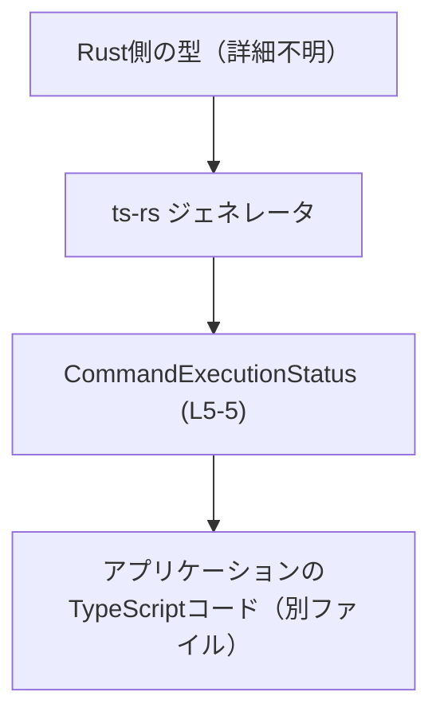
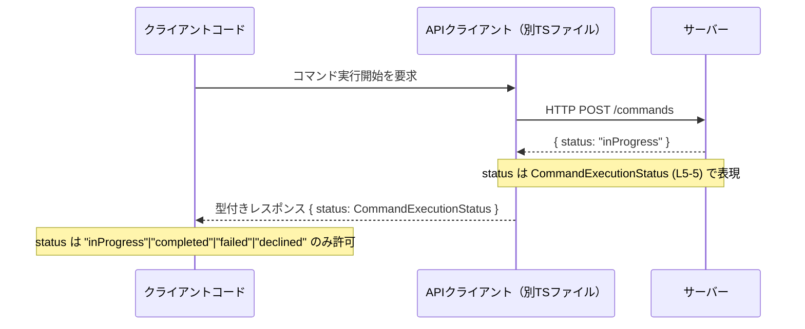

# app-server-protocol\schema\typescript\v2\CommandExecutionStatus.ts コード解説

## 0. ざっくり一言

- コマンドの実行状態を、4 種類の文字列のいずれかに制約する **TypeScript の文字列リテラル・ユニオン型** を定義したファイルです（自動生成コード、手動編集禁止）。  

```ts
// GENERATED CODE! DO NOT MODIFY BY HAND!
// ...
export type CommandExecutionStatus = "inProgress" | "completed" | "failed" | "declined";
```

---

## 1. このモジュールの役割

### 1.1 概要

- このモジュールは、アプリケーション内で扱う「コマンド実行状態」を TypeScript の型として表現し、  
  状態文字列が `"inProgress" | "completed" | "failed" | "declined"` の 4 種類に限定されることを **コンパイル時に保証**するために存在しています。  
- 実行時のロジックや副作用は含まず、**静的型付けのためのスキーマ定義**のみを提供します。

### 1.2 アーキテクチャ内での位置づけ

このファイルは `app-server-protocol/schema/typescript/v2` 配下にあり、プロトコルスキーマの一部として  
クライアント・サーバー間の通信や内部 API の型定義で利用されることが想定されます。

ファイル先頭コメントから、この型は Rust コードから `ts-rs` により自動生成されていることが分かります  
（`CommandExecutionStatus.ts:L1-3`）。

```ts
// GENERATED CODE! DO NOT MODIFY BY HAND!                               // L1
//                                                                        L2
// This file was generated by [ts-rs](https://github.com/Aleph-Alpha/...  // L3
```

この情報をもとに、生成プロセスと利用位置の**概念的な関係**を図示します。



- Rust 側の具体的な型名・定義場所や、この型を実際に import している TypeScript ファイルは、  
  **このチャンクには現れないため不明**です。

### 1.3 設計上のポイント

コードから読み取れる設計上の特徴は次のとおりです。

- **自動生成コードであることが明示**されており、手動編集禁止（`CommandExecutionStatus.ts:L1-3`）。
- 1 行の `export type` による **型エイリアス定義のみ**で、実行時コード（関数・クラス）は存在しません（`L5`）。
- 型の実体は **文字列リテラル・ユニオン型**であり、  
  `"inProgress" | "completed" | "failed" | "declined"` 以外をコンパイル時に排除できます（`L5`）。
- 文字列リテラルを用いることで、生成後の JavaScript では単なる文字列として扱われ、  
  **ランタイムオーバーヘッドは発生しない**構造になっています。
- 状態値は文字列であり、イミュータブルな値であるため、この型自体は  
  **並行性・スレッドセーフティに関する懸念を持ちません**（JavaScript の文字列の性質による）。

---

## 2. 主要な機能一覧

このファイルは「型定義」だけを提供し、関数等のロジックはありません。  
機能に相当する内容は次の 1 点です。

- **コマンド実行状態の表現**  
  - `CommandExecutionStatus` 型で、状態を `"inProgress" | "completed" | "failed" | "declined"` のいずれかに制約します（`CommandExecutionStatus.ts:L5-5`）。  
  - 型安全性により、誤った状態文字列の利用をコンパイル時に検出できます。

---

## 3. 公開 API と詳細解説

### 3.1 型一覧（構造体・列挙体など）

このファイルで公開されている主要な型は 1 つです。

| 名前 | 種別 | 役割 / 用途 | 定義箇所 |
|------|------|-------------|----------|
| `CommandExecutionStatus` | 型エイリアス（文字列リテラル・ユニオン型） | コマンドの実行状態を 4 種類の文字列のいずれかに制約する | `CommandExecutionStatus.ts:L5-5` |

許可される値をもう少し詳細に整理すると次のとおりです。

| リテラル値 | 意味（名前からの推測） | 備考 |
|-----------|------------------------|------|
| `"inProgress"` | 実行中 | 実際の意味はコマンド仕様側のドキュメント依存（このチャンクからは詳細不明） |
| `"completed"`  | 正常完了 | 同上 |
| `"failed"`     | 失敗 | 同上 |
| `"declined"`   | キャンセル・拒否 | 同上 |

> 注: 各状態の厳密な意味や遷移ルールは、このファイルからは分かりません。

#### 型としての契約（Contract）

`CommandExecutionStatus` 型に関する型レベルの契約は次のとおりです（`CommandExecutionStatus.ts:L5-5` を根拠）。

- この型の変数・プロパティには、**4 つの文字列リテラルのいずれか**しか代入できません。
- TypeScript の型チェックが有効なコードでは、例えば `"complete"` や `"FAIL"` のような  
  誤った綴りの文字列はコンパイルエラーになります。
- ただし、生成された JavaScript では単なる `string` になるため、  
  **外部入力から文字列を受け取る場合は、別途ランタイムのバリデーションが必要**です。

### 3.2 関数詳細（最大 7 件）

- **このファイルには関数・メソッドは定義されていません。**  
  そのため、関数詳細テンプレートに該当する対象はありません（`CommandExecutionStatus.ts:L1-5` から確認できます）。

### 3.3 その他の関数

- ヘルパー関数・ユーティリティ関数は一切定義されていません（`CommandExecutionStatus.ts:L1-5`）。

---

## 4. データフロー

このファイル単体には処理フローは存在せず、  
`CommandExecutionStatus` はほかのコードから状態値として参照されるだけです。

ここでは、**一般的な利用イメージ**として、  
コマンド実行 API のレスポンスでこの型がどのように流れるかの一例を示します。  
※あくまで参考例であり、実際のリポジトリに同一の API が存在するかどうかは、このチャンクからは分かりません。



このような構成の場合の要点は次のとおりです。

- サーバーは JSON レスポンスに `status` フィールドを含め、  
  その値として `"inProgress"` などの文字列を返します。
- TypeScript 側では `status: CommandExecutionStatus` と型注釈することで、  
  **クライアントコードが扱う状態値を 4 種類に限定**できます。
- 外部からの生の文字列に対しては、**パース関数や型ガードで検証する責務**が API クライアント側に生じます  
  （そのような関数はこのファイルには含まれていません）。

---

## 5. 使い方（How to Use）

### 5.1 基本的な使用方法

`CommandExecutionStatus` を関数の引数や戻り値に使うことで、  
状態文字列の誤りをコンパイル時に検出できます。

```ts
// CommandExecutionStatus 型をインポートする例
import type { CommandExecutionStatus } from "./CommandExecutionStatus"; // 実際の相対パスはプロジェクト構成による

// 状態に応じてメッセージを生成する関数の例
function formatStatusMessage(status: CommandExecutionStatus): string { // status は 4 種類のいずれか
    switch (status) {                                                   // ユニオン型に対する switch
        case "inProgress":                                              // 1. 実行中
            return "コマンドを実行中です。";
        case "completed":                                               // 2. 完了
            return "コマンドは正常に完了しました。";
        case "failed":                                                  // 3. 失敗
            return "コマンドは失敗しました。";
        case "declined":                                                // 4. 拒否
            return "コマンドは拒否されました。";
        // ここで default を書かないことで、将来値が増えたときにコンパイラがエラーにできます
    }
}
```

- `status` に `"inProgress"` 以外の誤った綴りを渡そうとすると、TypeScript がコンパイルエラーにします。
- 将来、Rust 側の型拡張によりユニオンに新しい状態が追加された場合、  
  `switch` の `case` が不足している箇所をコンパイラが指摘できるため、変更漏れを減らせます。

### 5.2 よくある使用パターン

1. **インターフェースや DTO のフィールドとして利用**

```ts
// API レスポンス形の例
interface CommandResult {                                         // コマンド結果全体の型
    id: string;                                                   // コマンドID
    status: CommandExecutionStatus;                               // 実行状態
    // 他のフィールド...
}

// 利用例
const result: CommandResult = {                                   // CommandResult 型の値
    id: "cmd-123",                                                // ID
    status: "completed",                                          // 4 値のうちの 1 つ
};
```

1. **外部入力からのパース時に型ガードを組み合わせる**

```ts
import type { CommandExecutionStatus } from "./CommandExecutionStatus";

// ランタイムで string から CommandExecutionStatus に絞り込む型ガード
function isCommandExecutionStatus(value: string): value is CommandExecutionStatus { // 型ガード
    return value === "inProgress"                                                   // 4 つのいずれかなら true
        || value === "completed"
        || value === "failed"
        || value === "declined";
}

// 外部入力を安全にパースする関数例
function parseStatus(raw: unknown): CommandExecutionStatus | undefined {            // 不正値は undefined を返す
    if (typeof raw !== "string") {                                                  // 型チェック
        return undefined;
    }
    return isCommandExecutionStatus(raw) ? raw : undefined;                         // ユニオンに含まれるか検査
}
```

- このように **ランタイムチェックを伴う型ガード**を用いると、  
  外部から来る生の値に対しても `CommandExecutionStatus` の契約を守ることができます。

1. **非同期処理の状態管理に利用**

```ts
import type { CommandExecutionStatus } from "./CommandExecutionStatus";

// 状態を保持する例（特定のフレームワークに依存しない単純な実装）
let currentStatus: CommandExecutionStatus = "inProgress";             // 初期状態

async function executeCommand(): Promise<void> {                       // コマンド実行関数
    try {
        // 実行開始
        currentStatus = "inProgress";                                  // 状態を更新
        // ... コマンド実行処理 ...
        currentStatus = "completed";                                   // 正常完了
    } catch (e) {
        currentStatus = "failed";                                      // 失敗
    }
}
```

- 文字列リテラル・ユニオン型であるため、  
  非同期処理間で `currentStatus` を共有しても、値の型は常に 4 種類のいずれかに制約されます。

### 5.3 よくある間違い

この型を利用する際に起こりやすい誤りとその修正例です。

1. **任意の文字列を許容してしまう**

```ts
// 誤り例: string 型にしてしまい、状態値がバラバラになる可能性がある
interface BadResult {
    status: string;                         // 何でも入ってしまう
}

// 正しい例: CommandExecutionStatus で制約する
interface GoodResult {
    status: CommandExecutionStatus;         // 4 種類に限定
}
```

1. **外部入力に対して無理に型アサーションする**

```ts
// 誤り例: 生のレスポンスをそのまま as でキャストしてしまう
const raw: any = JSON.parse(responseText);                   // 外部入力
const status = raw.status as CommandExecutionStatus;         // 型アサーションで強制

// raw.status が "unknown" でもコンパイルは通るため、実行時に想定外の分岐に入る可能性がある
```

```ts
// より安全な例: 前述の型ガードを用いる
const maybeStatus = parseStatus(raw.status);                 // CommandExecutionStatus | undefined
if (!maybeStatus) {
    // 不正な状態値として扱う（ログ、エラー、フォールバックなど）
} else {
    // maybeStatus は CommandExecutionStatus として安全に利用可能
}
```

1. **綴りを間違える**

```ts
// 誤り例: "complete" と書いてしまう
const status: CommandExecutionStatus = "complete";   // コンパイルエラー（"completed" が正しい）

// 正しい例
const status2: CommandExecutionStatus = "completed"; // OK
```

### 5.4 使用上の注意点（まとめ）

- **このファイルを直接編集しないこと**  
  - 冒頭コメントに「GENERATED CODE! DO NOT MODIFY BY HAND!」とあり（`CommandExecutionStatus.ts:L1-3`）、  
    手動編集は再生成で上書きされる可能性があります。
- **外部入力には必ずランタイム検証を行うこと**  
  - TypeScript の型はコンパイル時のみ有効であり、実行時には `string` になります。  
    不正な文字列を防ぐには、型ガードやバリデーション関数が必要です。
- **状態値は 4 つに限定されていることを前提に分岐を書くこと**  
  - `switch` 文などで default 分岐を設けないことで、将来状態が追加された時に  
    コンパイルエラーで変更漏れを検知しやすくなります。
- **並行性・スレッド安全性**  
  - 値はイミュータブルな文字列であり、この型自体はスレッド安全です。  
    非同期処理で共有しても、値の変更は新しい文字列を再代入する形になり、データ競合は発生しません。
- **セキュリティ上の観点**  
  - 不正値をそのまま受け入れると、「完了していないのに completed と扱う」など、  
    ビジネスロジック上の誤動作を招く可能性があります。  
  - ただし、この型自体が直接的なコードインジェクションなどを引き起こす要素は持ちません。

---

## 6. 変更の仕方（How to Modify）

### 6.1 新しい機能を追加する場合

ここでいう「新しい機能」は、状態値の追加・変更など `CommandExecutionStatus` の拡張を意味します。

1. **TypeScript ファイルを直接変更しない**  
   - `CommandExecutionStatus.ts` は `ts-rs` による自動生成コードのため、  
     直接編集しても再生成で上書きされる可能性があります（`CommandExecutionStatus.ts:L1-3`）。
2. **Rust 側の元定義を変更する**  
   - コメントの URL から、この型が `ts-rs` によって Rust から生成されていることが分かります。  
   - 対応する Rust の型（おそらく enum など）に状態を追加・変更します。  
   - 具体的なファイルパス・型名は **このチャンクには現れないため不明**です。
3. **ts-rs を再実行して TypeScript を再生成する**  
   - プロジェクトのビルドスクリプトやドキュメントに従って再生成を行います。
4. **利用箇所の対応**  
   - `CommandExecutionStatus` を参照している TypeScript コード（`import` しているファイル）を IDE 等で検索し、  
     新しい状態に対する処理を追加します。  
   - 特に `switch` 文などで全列挙している箇所は、コンパイルエラーや `never` を用いた網羅性チェックで  
     変更漏れを検知できます。

### 6.2 既存の機能を変更する場合

既存の状態値の削除・名称変更などを行う場合の注意点です。

- **後方互換性**  
  - プロトコルの一部である場合、既存のクライアントが `"failed"` などの状態を前提に動作している可能性があります。  
  - 状態名の変更・削除は、外部クライアントとの互換性に影響するため、仕様レベルでの検討が必要です。
- **型レベルの影響範囲**  
  - `CommandExecutionStatus` を使っているすべての TypeScript コードで、  
    該当する状態値を利用している箇所がコンパイルエラーになります。  
  - これは変更漏れ検知には有効ですが、影響範囲が広い可能性があります。
- **テスト**  
  - このファイル単体にはテストは含まれていませんが、  
    利用側のユニットテスト・統合テストを実行し、状態変更による振る舞いの変化を確認する必要があります  
    （具体的なテストファイルの場所はこのチャンクからは不明です）。

---

## 7. 関連ファイル

このチャンクから直接確認できる関連ファイルはありませんが、構造とコメントから推測される関連要素を整理します。

| パス | 役割 / 関係 |
|------|------------|
| `（不明: ts-rs が参照する Rust 側の型定義）` | `CommandExecutionStatus` の元となる型定義。`ts-rs` のコメント（`CommandExecutionStatus.ts:L3`）から存在が推測されるが、このチャンクには現れないため具体的なパス・型名は不明です。 |
| `app-server-protocol/schema/typescript/v2/*.ts`（同ディレクトリの他ファイル） | 同一バージョン `v2` のプロトコルスキーマを定義していると考えられますが、このチャンクには内容が現れないため詳細は不明です。 |
| `（不明: CommandExecutionStatus を import している TS ファイル群）` | 実際に `CommandExecutionStatus` を利用しているアプリケーションコード。IDE の参照検索などで特定する必要があります。 |

---

### まとめ

- `CommandExecutionStatus` は、コマンド実行状態を 4 種類に限定する **文字列リテラル・ユニオン型**であり、  
  TypeScript の型チェックを通じて状態値の誤りを防ぐために使われます（`CommandExecutionStatus.ts:L5-5`）。
- ファイルは `ts-rs` により自動生成されており、手動編集せず、元となる Rust 側の定義を変更して再生成する運用が前提です（`L1-3`）。
- この型自体には実行時ロジック・エラー処理・並行性の懸念はなく、  
  安全性に関するポイントはもっぱら「外部入力のバリデーション」と「プロトコル仕様との整合性」にあります。
