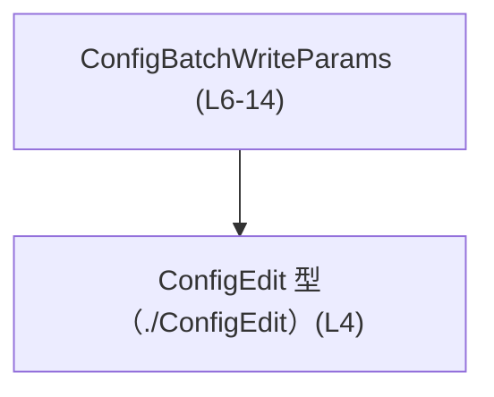
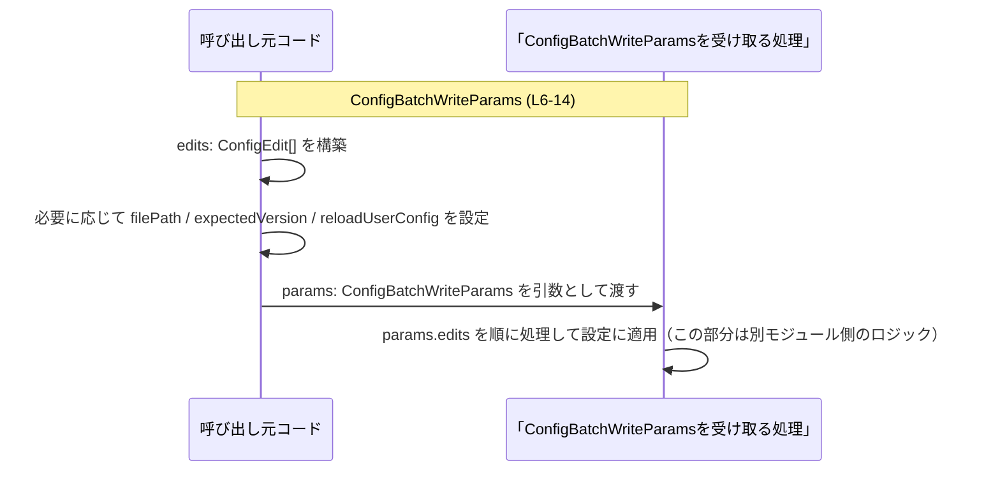

# app-server-protocol/schema/typescript/v2/ConfigBatchWriteParams.ts

## 0. ざっくり一言

`ConfigBatchWriteParams` は、複数の設定変更 (`ConfigEdit`) をまとめて書き込む処理に渡すための **パラメータオブジェクト型** を定義するファイルです（`app-server-protocol/schema/typescript/v2/ConfigBatchWriteParams.ts:L6-14`）。

---

## 1. このモジュールの役割

### 1.1 概要

- このモジュールは、設定ファイルへのバッチ書き込み処理に必要な情報を 1 つのオブジェクトにまとめるための **型定義** を提供します（`ConfigBatchWriteParams.ts:L6-14`）。
- 実装ロジックは一切含まず、**型情報のみ** を TypeScript 側に公開するための自動生成ファイルです（`ConfigBatchWriteParams.ts:L1-3`）。

### 1.2 アーキテクチャ内での位置づけ

- `ConfigBatchWriteParams` は、他所で定義された `ConfigEdit` 型（`./ConfigEdit`）を配列として保持します（`ConfigBatchWriteParams.ts:L4,L6`）。
- この型はおそらく「設定編集要求」を受け付ける API や関数の **引数型** として利用されますが、どの関数・モジュールが使うかはこのチャンクからは分かりません（コードには参照先が現れていません）。

依存関係を Mermaid で表すと次のようになります。



この図は、`ConfigBatchWriteParams` が `ConfigEdit` 型に依存していることだけを示しています。

### 1.3 設計上のポイント

コードから読み取れる設計上の特徴は次のとおりです。

- **自動生成ファイル**  
  - 先頭コメントにより、`ts-rs` による自動生成ファイルであり、手動編集禁止であることが明示されています（`ConfigBatchWriteParams.ts:L1-3`）。
- **状態やロジックを持たない**  
  - 関数やクラスは定義されておらず、型エイリアスのみです（`ConfigBatchWriteParams.ts:L4-14`）。
- **オプショナルかつ null 許容フィールド**  
  - `filePath` と `expectedVersion` は `string | null` かつオプショナル、`reloadUserConfig` は `boolean` のオプショナルです（`ConfigBatchWriteParams.ts:L10,L14`）。
- **ドキュメンテーションコメントによる契約の一部表現**  
  - `filePath` の省略時挙動と、`reloadUserConfig` が `true` のときの挙動がコメントで説明されています（`ConfigBatchWriteParams.ts:L7-10,L11-13`）。

---

## 2. 主要な機能一覧

このファイル自体には関数・ロジックはなく、**型定義のみ** が公開 API です。

- `ConfigBatchWriteParams` 型:  
  設定の編集内容 (`edits`) と、対象ファイルパス・期待する設定バージョン・ホットリロードフラグをまとめたパラメータオブジェクト（`ConfigBatchWriteParams.ts:L6-14`）。

---

## 3. 公開 API と詳細解説

### 3.1 型一覧（構造体・列挙体など）

このチャンクに現れる型・型エイリアスの一覧です。

| 名前                    | 種別         | 役割 / 用途                                                                                                 | 定義位置 / 根拠 |
|-------------------------|--------------|--------------------------------------------------------------------------------------------------------------|-----------------|
| `ConfigBatchWriteParams` | 型エイリアス | 設定ファイルへのバッチ書き込みに必要なパラメータ（複数編集・ファイルパス・期待バージョン・ホットリロード指示）を保持する | `ConfigBatchWriteParams.ts:L6-14` |
| `ConfigEdit`            | （別ファイル）型 | 単一の設定編集操作を表す型。詳細はこのチャンクには現れず不明。`ConfigBatchWriteParams.edits` の要素型として使用 | `ConfigBatchWriteParams.ts:L4,L6` |

#### `ConfigBatchWriteParams` のフィールド詳細

型定義は次のようになっています（整形して再掲）。

```typescript
// app-server-protocol/schema/typescript/v2/ConfigBatchWriteParams.ts

import type { ConfigEdit } from "./ConfigEdit";                  // ConfigEdit 型を型としてインポート（L4）

export type ConfigBatchWriteParams = {                           // パラメータオブジェクトの型エイリアス（L6）
    edits: Array<ConfigEdit>,                                    // 必須: ConfigEdit の配列（L6）
    /**
     * Path to the config file to write; defaults to the user's `config.toml` when omitted.
     */
    filePath?: string | null,                                    // 任意: ファイルパス。省略時はデフォルト config（L7-10）
    expectedVersion?: string | null,                             // 任意: 期待するバージョン（L10）
    /**
     * When true, hot-reload the updated user config into all loaded threads after writing.
     */
    reloadUserConfig?: boolean,                                  // 任意: true なら書き込み後にホットリロード（L11-14）
};
```

各フィールドの意味と制約は以下のとおりです（すべて型レベルの情報とコメントに基づきます）。

| フィールド名        | 型                     | 必須/任意 | 説明 / 挙動 (コメントに基づく)                                                                                       | 根拠 |
|---------------------|------------------------|-----------|------------------------------------------------------------------------------------------------------------------------|------|
| `edits`             | `Array<ConfigEdit>`    | 必須      | 適用したい設定編集操作の配列。空配列も型上は許容されます（コード上の制約なし）。                                      | `ConfigBatchWriteParams.ts:L6` |
| `filePath`          | `string \| null`（?）  | 任意      | 書き込み対象の設定ファイルへのパス。省略時は「ユーザーの `config.toml`」がデフォルトになるとコメントに明示されています。 | `ConfigBatchWriteParams.ts:L7-10` |
| `expectedVersion`   | `string \| null`（?）  | 任意      | 「期待するバージョン」を表す文字列と推測できますが、コメントがなく詳細な意味は不明です。                               | `ConfigBatchWriteParams.ts:L10` |
| `reloadUserConfig`  | `boolean`（?）         | 任意      | `true` の場合、書き込み後に「読み込まれているすべてのスレッドに対しユーザー設定をホットリロードする」とコメントされています。 | `ConfigBatchWriteParams.ts:L11-14` |

> `?` が付いているフィールドは **TypeScript のオプショナルプロパティ** であり、「プロパティ自体が存在しない」状態もありえます。

### 3.2 関数詳細

このファイルには関数は定義されていません（`ConfigBatchWriteParams.ts:L1-14`）。  
そのため、このセクションで詳細解説する対象となる関数は **ありません**。

### 3.3 その他の関数

このチャンクに関数は一切登場しないため、一覧も **ありません**。

---

## コンポーネントインベントリー（サマリ）

このチャンクに現れる主要コンポーネントをまとめると次のとおりです。

| 種別       | 名前                    | 概要                                                | 定義/参照位置 |
|------------|-------------------------|-----------------------------------------------------|---------------|
| 型エイリアス | `ConfigBatchWriteParams` | 設定バッチ書き込みパラメータオブジェクトの型        | `ConfigBatchWriteParams.ts:L6-14` |
| （外部型） | `ConfigEdit`            | 単一の設定編集操作を表す型（詳細は別ファイル）      | `ConfigBatchWriteParams.ts:L4,L6` |

---

## 4. データフロー

このファイルは型定義のみですが、`ConfigBatchWriteParams` インスタンスがどのように使われるかの一般的なデータフローを示します。  
具体的な関数名やモジュール名はコードからは分からないため、抽象的な表現にとどめます。



要点：

- 呼び出し元は `ConfigEdit` の配列を用意し、それを `edits` に設定します（`ConfigBatchWriteParams.ts:L4,L6`）。
- `filePath` を省略した場合、コメントによれば受け取り側がユーザーの `config.toml` をデフォルトとして扱う想定です（`ConfigBatchWriteParams.ts:L7-10`）。
- `reloadUserConfig` が `true` の場合、受け取り側が「すべてのロード済みスレッド」に対してホットリロードを行うとコメントに書かれています（`ConfigBatchWriteParams.ts:L11-13`）。  
  ただし、具体的な処理はこのファイルには含まれていません。

---

## 5. 使い方（How to Use）

### 5.1 基本的な使用方法

`ConfigBatchWriteParams` を利用する典型的なコードフローの例です。  
ここでは「設定バッチ書き込みを受け付ける関数」を仮に `applyConfigBatch` としていますが、実際の関数名はこのチャンクからは分かりません。

```typescript
import type { ConfigBatchWriteParams } from "./ConfigBatchWriteParams";  // 本ファイルの型をインポート
import type { ConfigEdit } from "./ConfigEdit";                          // 編集内容の型（詳細は別ファイル）

// ConfigEdit の配列を用意する例（具体的な構造は ConfigEdit の定義による）
const edits: ConfigEdit[] = [
    // ここに個々の設定変更操作を入れる
];

// ConfigBatchWriteParams オブジェクトを組み立てる
const params: ConfigBatchWriteParams = {
    edits,                                           // 必須フィールド（L6）
    filePath: null,                                  // null を明示する場合（省略も可）（L10）
    expectedVersion: "v1",                           // 任意のバージョン文字列（意味は別側のロジック次第）（L10）
    reloadUserConfig: true,                          // true ならホットリロードを依頼（L11-14）
};

// 仮の利用例: 何らかの関数に渡す
// await applyConfigBatch(params);
```

このコードでは：

- TypeScript の型チェックにより `params.edits` に `ConfigEdit[]` 以外を渡すとコンパイル時エラーになります。
- `filePath`, `expectedVersion`, `reloadUserConfig` は省略可能です。省略すると、それぞれ `undefined` となります。

### 5.2 よくある使用パターン

**1. デフォルトの `config.toml` に対して編集を適用し、リロードも行う**

```typescript
const params: ConfigBatchWriteParams = {
    edits,
    // filePath を指定しない: コメントの通りユーザーの config.toml がデフォルト想定（L7-10）
    reloadUserConfig: true,             // 書き込み後にすべてのスレッドで設定を再読み込み（L11-13）
};
```

**2. 特定のファイルパスに対して編集を適用し、リロードは行わない**

```typescript
const params: ConfigBatchWriteParams = {
    edits,
    filePath: "/path/to/another-config.toml",  // 任意の設定ファイルパス（L10）
    // reloadUserConfig は省略 => undefined として扱われる
};
```

### 5.3 よくある間違い

**間違い例: `edits` を省略してしまう**

```typescript
// 型エラーになる例（コンパイル時に検出される）
const badParams: ConfigBatchWriteParams = {
    // edits: [...] を指定していない  => 必須フィールド欠如
    reloadUserConfig: true,
};
```

**正しい例: `edits` は必ず指定する**

```typescript
const goodParams: ConfigBatchWriteParams = {
    edits,                      // 必須フィールド（L6）
    reloadUserConfig: true,
};
```

**間違い例: `filePath` に `undefined` を明示的に代入して扱いを誤解する**

```typescript
const params: ConfigBatchWriteParams = {
    edits,
    filePath: undefined,  // 型としては許容される（オプショナルなので）が、
                          // コメント上は「省略時にデフォルト」が想定されている（L7-10）
};
```

`filePath?: string | null` のため `undefined` も technically 代入可能ですが、コメントでは「省略時にデフォルト」としか書かれていないため、

- 「プロパティが存在しない (`filePath` 未定義)」
- 「プロパティは存在するが値が `undefined`」

を受け取り側が区別するかは、このチャンクからは分かりません。  
動作を明確にしたい場合は、**「本当に指定したい場合は `string` か `null` を使い、それ以外はプロパティごと省略する」** 方が期待に沿いやすいと考えられます（一般的な TypeScript の慣行として）。

### 5.4 使用上の注意点（まとめ）

- このファイルは **自動生成** されており、「手で編集しないこと」が明示されています（`ConfigBatchWriteParams.ts:L1-3`）。  
  仕様変更は元の定義（Rust 側など）で行う必要があります。
- `edits` は必須フィールドであり、常に `ConfigEdit[]` を渡す必要があります（`ConfigBatchWriteParams.ts:L6`）。
- `filePath` / `expectedVersion` は `string | null` でオプショナルです。  
  - 省略時の挙動は `filePath` についてのみコメントで定義されており（ユーザーの `config.toml` がデフォルト、`ConfigBatchWriteParams.ts:L7-10`）、`expectedVersion` の挙動はコードからは不明です。
- `reloadUserConfig` を `true` にした場合の具体的な再読み込み手順や対象スレッドの範囲は、このファイルからは分かりません（`ConfigBatchWriteParams.ts:L11-13`）。  
  呼び出し側は、関連ドキュメントや実装側のコードを確認する必要があります。

---

## 6. 変更の仕方（How to Modify）

### 6.1 新しい機能を追加する場合

このファイルは `ts-rs` によって生成されているため（`ConfigBatchWriteParams.ts:L1-3`）、**直接この TypeScript ファイルを編集するべきではありません**。

一般的な変更手順は次のようになります（コードから推測できる範囲にとどめます）。

1. 元の定義（Rust 側の構造体など）を変更する。  
   - 例: `ConfigBatchWriteParams` に対応する Rust の型にフィールドを追加する。
2. `ts-rs` の生成プロセスを再実行して、本ファイルを再生成する。
3. 生成された `ConfigBatchWriteParams.ts` に新しいフィールドが追加されていることを確認する。

このチャンクに Rust 側のファイルパスや生成コマンドは現れていないため、具体的な手順は別のドキュメントまたはビルド設定を参照する必要があります。

### 6.2 既存の機能を変更する場合

既存フィールドの型や意味を変更したい場合も、同様に **元の定義側で変更** する必要があります。

変更時に注意すべき点（この型に関する契約として読み取れる範囲）は次のとおりです。

- `filePath` のコメントにある「省略時にデフォルトの `config.toml`」という仕様（`ConfigBatchWriteParams.ts:L7-10`）を変える場合、  
  - 受け側ロジック
  - それに依存するクライアントコード  
 への影響が大きい可能性があります。
- `reloadUserConfig` のコメント（ホットリロード）を変更する場合（`ConfigBatchWriteParams.ts:L11-13`）、  
  - 同名フラグに依存した挙動を期待している呼び出し元が存在するかを確認する必要があります。
- `expectedVersion` の意味はこのチャンクからは不明なため、  
  - 実際にどこでチェックされているか（サーバ側 / クライアント側）を調べた上で変更する必要があります。

---

## 7. 関連ファイル

このチャンクから直接分かる関連ファイルは次のとおりです。

| パス                                                | 役割 / 関係 |
|-----------------------------------------------------|------------|
| `app-server-protocol/schema/typescript/v2/ConfigBatchWriteParams.ts` | 本ドキュメント対象。設定バッチ書き込みパラメータの TypeScript 型定義。 |
| `app-server-protocol/schema/typescript/v2/ConfigEdit.ts`（推定パス） | `import type { ConfigEdit } from "./ConfigEdit";` により参照される型定義ファイル。`ConfigBatchWriteParams.edits` の要素型を提供する（`ConfigBatchWriteParams.ts:L4`）。 |

※ `ConfigEdit.ts` の正確な内容や役割は、このチャンクには現れておらず不明です。
