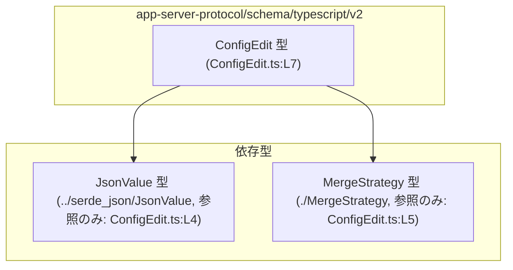
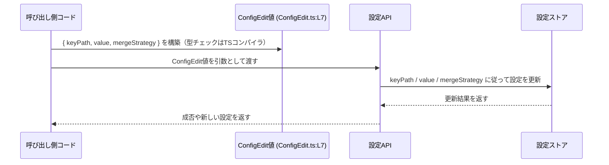

# app-server-protocol/schema/typescript/v2/ConfigEdit.ts コード解説

## 0. ざっくり一言

`ConfigEdit` という **設定編集操作を表す型** を定義する、自動生成された TypeScript ファイルです（ConfigEdit.ts:L1-3, L7-7）。  
設定の「どのキーを」「どの値に」「どのマージ戦略で」変更するかを表現するための **データ構造のみ** を提供します。

---

## 1. このモジュールの役割

### 1.1 概要

- このモジュールは、アプリケーション設定などの「編集要求」を TypeScript 側で型安全に表現するための型 `ConfigEdit` を提供します（ConfigEdit.ts:L7-7）。
- 型は自動生成されており、直接編集しないことが前提になっています（ConfigEdit.ts:L1-3）。
- 実行時ロジック（関数やクラスなど）は一切含まれておらず、**静的な型情報のみ** を定義しています（ConfigEdit.ts:L1-7）。

### 1.2 アーキテクチャ内での位置づけ

このファイルは、TypeScript 側のプロトコル定義の一部として、他の型に依存した **データ定義レイヤ** を構成していると解釈できます。

- 依存関係（事実として分かる範囲）
  - `ConfigEdit` は `JsonValue` 型を利用します（ConfigEdit.ts:L4, L7）。
  - `ConfigEdit` は `MergeStrategy` 型を利用します（ConfigEdit.ts:L5, L7）。
  - `JsonValue` と `MergeStrategy` の具体的な中身は、このチャンクには現れません（ConfigEdit.ts:L4-5）。

これを簡易な依存関係図として表すと、次のようになります。



この図は、「`ConfigEdit` がどの型に依存しているか」を示すものであり、実際の処理フローやネットワーク通信などの動きは、このファイルからは分かりません（ConfigEdit.ts:L1-7）。

### 1.3 設計上のポイント

コードから読み取れる設計上の特徴は次のとおりです。

- **自動生成ファイルであることの明示**  
  先頭コメントに「GENERATED CODE! DO NOT MODIFY BY HAND!」および ts-rs による生成である旨が書かれており（ConfigEdit.ts:L1-3）、人手による編集が想定されていません。

- **型専用モジュール（状態やロジックを持たない）**  
  import と export type のみで構成されており、クラス・関数・変数定義はありません（ConfigEdit.ts:L4-5, L7）。  
  そのため、**状態を保持せず、実行時副作用もありません。**

- **JSON 互換値とマージ戦略の組み合わせ**  
  - `value` フィールドは `JsonValue` 型であり（ConfigEdit.ts:L4, L7）、通常は JSON シリアライズ可能な値を表現するための型名です。  
    ただし、`JsonValue` の中身はこのチャンクにはないため、厳密な仕様は分かりません（ConfigEdit.ts:L4）。
  - `mergeStrategy` フィールドは `MergeStrategy` 型であり（ConfigEdit.ts:L5, L7）、設定値をどのように既存値と統合するかを表す列挙やユニオン型である可能性が名前から推測されますが、型の実体はこのチャンクには現れません（ConfigEdit.ts:L5）。

- **キー指定は string のみ**  
  `keyPath` は単純な `string` 型です（ConfigEdit.ts:L7）。  
  どのような書式のパス（ドット区切り、スラッシュ区切りなど）かは、このコードからは判断できません。

---

## 2. 主要な機能一覧

このモジュールが提供するのは一つの型定義のみです。

- `ConfigEdit`: 設定編集操作を表すオブジェクト型。  
  - どの設定キー（`keyPath`）を  
  - どの値（`value: JsonValue`）で  
  - どのマージ戦略（`mergeStrategy: MergeStrategy`）で  
  書き換えるかをまとめて表現します（ConfigEdit.ts:L7）。

---

## 3. 公開 API と詳細解説

### 3.1 型一覧（構造体・列挙体など）

このファイルに現れる型とその役割を一覧にします。

| 名前 | 種別 | 役割 / 用途 | 定義 / 参照位置 |
|------|------|-------------|-----------------|
| `ConfigEdit` | 型エイリアス（オブジェクト型） | 単一の設定編集操作を表現するコンテナ。`keyPath`, `value`, `mergeStrategy` の 3 つのフィールドを持つ（ConfigEdit.ts:L7）。 | 定義: `ConfigEdit.ts:L7-7` |
| `JsonValue` | 外部定義の型（インポート） | 設定値 `value` に許可される値の型を表す。一般的には JSON 互換値を意味する名前だが、このチャンクには定義がなく詳細は不明（ConfigEdit.ts:L4）。 | 参照: `ConfigEdit.ts:L4-4, L7-7`（実体は `../serde_json/JsonValue` 側） |
| `MergeStrategy` | 外部定義の型（インポート） | 設定値を既存値とどのようにマージするかを指示する戦略を表す型と推測されるが、具体的なバリアントはこのチャンクにはない（ConfigEdit.ts:L5）。 | 参照: `ConfigEdit.ts:L5-5, L7-7`（実体は `./MergeStrategy` 側） |

`ConfigEdit` のフィールド構造は次の通りです（ConfigEdit.ts:L7）。

- `keyPath: string`
- `value: JsonValue`
- `mergeStrategy: MergeStrategy`

### 3.2 関数詳細（最大 7 件）

このファイルには関数定義が存在しません。

- import 文と型エイリアス定義のみで構成されており（ConfigEdit.ts:L4-5, L7）、  
  関数・メソッド・クラスコンストラクタなどの実行可能なエンティティは一切定義されていません（ConfigEdit.ts:L1-7）。

したがって、本セクションで詳細に解説すべき関数はありません。

### 3.3 その他の関数

- このファイルには補助的な関数やラッパー関数も存在しません（ConfigEdit.ts:L1-7）。

---

## 4. データフロー

このファイル自体には処理ロジックがなく、実際のデータフローは記述されていません（ConfigEdit.ts:L1-7）。  
そのため、「`ConfigEdit` がどのタイミングでどこからどこへ渡されるか」は、このチャンクからは特定できません。

ただし、型名とフィールド名から一般的に想定される利用シナリオを **推測** として示します。  
（※以下は命名規則と一般的な設計パターンに基づく想像であり、このファイルから直接導かれる事実ではありません。）



このようなシーケンスにおいて、`ConfigEdit` は「**設定更新リクエストのペイロード**」として機能すると考えられますが、その具体的な処理内容やエラーハンドリングは、このチャンクからは分かりません。

---

## 5. 使い方（How to Use）

### 5.1 基本的な使用方法

このファイルから分かる範囲で、「`ConfigEdit` 型の値を作成して他の API に渡す」という基本的な利用例を示します。

```typescript
// ConfigEdit 型と、その構成要素となる型をインポートする                     // 型定義ファイルから型のみをインポートしている
import type { ConfigEdit } from "./ConfigEdit";                                   // ConfigEdit.ts で定義されている ConfigEdit 型
import type { JsonValue } from "../serde_json/JsonValue";                         // value に使う JsonValue 型（実体は別ファイル）
import type { MergeStrategy } from "./MergeStrategy";                             // mergeStrategy に使う MergeStrategy 型（実体は別ファイル）

// ConfigEdit を引数に受け取って、どこかに送信する関数の例                     // ConfigEdit を利用する側の関数の例（このファイルには定義されていない）
function sendConfigEdit(edit: ConfigEdit): void {                                 // ConfigEdit 型の edit を受け取る
    // ここで edit をサーバーに送る・ローカル設定に適用する等の処理を行う       // 実際の処理内容はこのファイルからは分からないので仮のコメント
    console.log("Config edit:", edit);                                            // デバッグ用に内容を表示するだけのダミー実装
}

// 呼び出し元で ConfigEdit を構築する例                                         // ConfigEdit の値を作る側のコード例
function updateSomeSetting(                                                        // ある設定を更新するための関数
    keyPath: string,                                                               // 更新対象を指すキーのパス（形式はこのファイルからは不明）
    value: JsonValue,                                                              // 設定値として許可されている JsonValue
    mergeStrategy: MergeStrategy                                                   // どのようにマージするかを示す MergeStrategy
): void {
    const edit: ConfigEdit = {                                                     // ConfigEdit 型のオブジェクトリテラルを作成
        keyPath,                                                                   // 渡された keyPath をそのままフィールドに設定
        value,                                                                     // 渡された value をそのままフィールドに設定
        mergeStrategy,                                                             // 渡された mergeStrategy をそのままフィールドに設定
    };

    sendConfigEdit(edit);                                                          // 構築した ConfigEdit を別の処理に渡す
}
```

この例では、`ConfigEdit` は単なる **データコンテナ** として使われています。  
どのような `keyPath`・`JsonValue`・`MergeStrategy` が有効かは、それぞれの型の仕様および呼び出し先の API 契約に依存します（`JsonValue` と `MergeStrategy` の具体的な仕様はこのチャンクには現れません：ConfigEdit.ts:L4-5）。

### 5.2 よくある使用パターン（想定）

コードから直接は読み取れませんが、次のようなパターンが考えられます（推測）。

1. **複数の `ConfigEdit` をまとめて適用するパターン**

   複数の設定変更を配列にまとめて送るような API がある場合、次のようなコードになると考えられます。

   ```typescript
   // 複数の設定編集をまとめて送る想定の例                               // 実際にこのような API が存在するかどうかはこのチャンクからは不明
   function applyEdits(edits: ConfigEdit[]): void {                             // ConfigEdit の配列を受け取る
       for (const edit of edits) {                                              // 各編集を順に処理する
           sendConfigEdit(edit);                                               // 先ほどの sendConfigEdit を呼び出す
       }
   }
   ```

2. **`keyPath` を生成するラッパーから `ConfigEdit` を組み立てるパターン**

   設定キーのパス生成ロジックを別関数に切り出し、その結果と値・マージ戦略から `ConfigEdit` を構築する形もありえます。

   ※これらはあくまで一般的な使用イメージであり、実際の API や呼び出しパターンはこのファイルからは分かりません。

### 5.3 よくある間違い（起こりうる誤用例のイメージ）

このファイルは型定義のみですが、`ConfigEdit` の構造から起こりうる誤用を想像すると、次のような例が挙げられます（いずれも一般論としての推測です）。

```typescript
// 誤りの例: value に any を使ってしまう                                    // JsonValue の型安全性を損なうパターン
// const badValue: any = { some: "thing" };                                    // any を使うとコンパイル時のチェックが効かない
// const badEdit: ConfigEdit = {                                              // 型エイリアス上は JsonValue を要求している
//     keyPath: "some.path",                                                  // keyPath は string なので通る
//     value: badValue,                                                       // any から JsonValue への代入は許可される可能性がある
//     mergeStrategy: someMergeStrategy,                                      // MergeStrategy としてはコンパイル時にチェックされる
// };
//
// 正しい方向性: value を JsonValue として扱う                             // JsonValue 型を通して値を扱うことで IDE とコンパイラの支援を得る
// const goodValue: JsonValue = { some: "thing" };                            // JsonValue 型に合う値を作成（実際の構造は別ファイルの定義に依存）
// const goodEdit: ConfigEdit = {
//     keyPath: "some.path",
//     value: goodValue,
//     mergeStrategy: someMergeStrategy,
// };
```

ここでのポイントは、「`JsonValue` と `MergeStrategy` による **型レベルの制約** を活かし、`any` や不明な文字列などで逃げないこと」が安全性向上につながる、という一般的な TypeScript の考え方です。

### 5.4 使用上の注意点（まとめ）

このファイルから読み取れる、または一般的に注意すべき点を整理します。

- **このファイル自体は編集しない**  
  先頭コメントにて「GENERATED CODE! DO NOT MODIFY BY HAND!」と明示されているため（ConfigEdit.ts:L1-3）、  
  フィールドの追加・変更は生成元（おそらく Rust 側の ts-rs 対象型）を修正して再生成する必要があります。

- **`keyPath` の形式は型レベルでは制約されていない**  
  `keyPath` は単なる `string` であり（ConfigEdit.ts:L7）、空文字列や無効なパスも型上は許容されてしまいます。  
  そのため、実際のバリデーション（空チェックや書式チェック）は、`ConfigEdit` を利用するロジック側で行う必要があると考えられます。

- **`JsonValue` / `MergeStrategy` の詳細仕様は別ファイルに依存**  
  これらの型の許容値や意味は、このチャンクには現れません（ConfigEdit.ts:L4-5）。  
  型を正しく使うには、それぞれの定義ファイル（`../serde_json/JsonValue` と `./MergeStrategy`）を参照する必要があります。

- **並行性・エラー処理は関係しない**  
  このファイルは型定義のみであり、非同期処理・例外処理・ロックなどの並行性に関するコードは存在しません（ConfigEdit.ts:L1-7）。  
  これらは `ConfigEdit` を利用する側の実装に委ねられます。

---

## 6. 変更の仕方（How to Modify）

### 6.1 新しい機能を追加する場合

コメントから、このファイルは ts-rs によって生成されていることが分かります（ConfigEdit.ts:L1-3）。  
そのため、**直接 TypeScript ファイルを編集するのではなく、生成元の定義を変更することが前提** になります。

一般的な ts-rs の利用形態に基づく手順（ここから先は ts-rs の一般的な使い方に基づく説明であり、このリポジトリ固有の構成はこのチャンクからは分かりません）:

1. Rust 側で `ConfigEdit` に対応する構造体や型定義を探す。  
   （通常は `#[derive(TS)]` が付与された型になっています。）
2. その型にフィールドの追加・型の変更などを行う。
3. ts-rs のコード生成コマンドを再実行して、`ConfigEdit.ts` を再生成する。
4. 生成された TypeScript 側の変更内容を確認する（`keyPath`・`value`・`mergeStrategy` 以外のフィールドが追加されていれば、その差分を確認）。

このチャンクには Rust 側のファイル構成やビルド手順は現れないため、具体的なコマンドやパスまでは分かりません。

### 6.2 既存の機能を変更する場合

`ConfigEdit` の型を変更すると、**それを利用しているすべての TypeScript コードに影響** します。  
変更時に考慮すべき点を、コードから分かる範囲と一般論を組み合わせて整理します。

- 影響範囲の確認
  - `ConfigEdit` をインポートしているすべてのファイルを検索する必要があります（このチャンクには参照箇所は現れません）。
  - 特に `keyPath` / `value` / `mergeStrategy` のいずれかを削除・型変更する場合、コンパイルエラーとして顕在化します。

- 契約（前提条件・返り値の意味など）
  - `keyPath` が string であること、`value` が `JsonValue`、`mergeStrategy` が `MergeStrategy` であることが現在の契約です（ConfigEdit.ts:L7）。
  - これらを別の型に変更すると、プロトコルの仕様自体が変わるため、サーバー側・クライアント側双方の対応が必要になります。

- テストの観点
  - このファイルにはテストコードは含まれていません（ConfigEdit.ts:L1-7）。
  - 実際のテストは、`ConfigEdit` を引数に取る関数・API・プロトコル層で行われていると考えるのが自然ですが、このチャンクからは場所や内容は分かりません。

---

## 7. 関連ファイル

このモジュールと密接に関係するファイルは、import から次の 2 つが読み取れます（ConfigEdit.ts:L4-5）。

| パス | 役割 / 関係 |
|------|------------|
| `../serde_json/JsonValue` | `value` フィールドに使用されている `JsonValue` 型の定義を提供するモジュールです（ConfigEdit.ts:L4, L7）。JSON 互換の値表現である可能性がありますが、具体的な構造はこのチャンクには現れません。 |
| `./MergeStrategy` | `mergeStrategy` フィールドに使用されている `MergeStrategy` 型の定義を提供するモジュールです（ConfigEdit.ts:L5, L7）。設定値のマージ方法（上書き、マージなど）を表現する列挙/ユニオン型であると推測されますが、詳細はこのチャンクには現れません。 |

テストコードや補助ユーティリティなど、その他の関連ファイルは、このチャンクからは特定できません。
