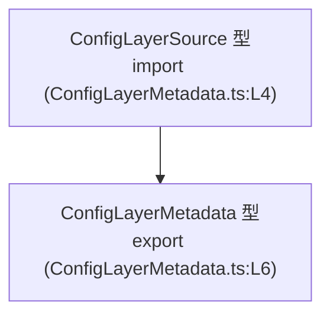
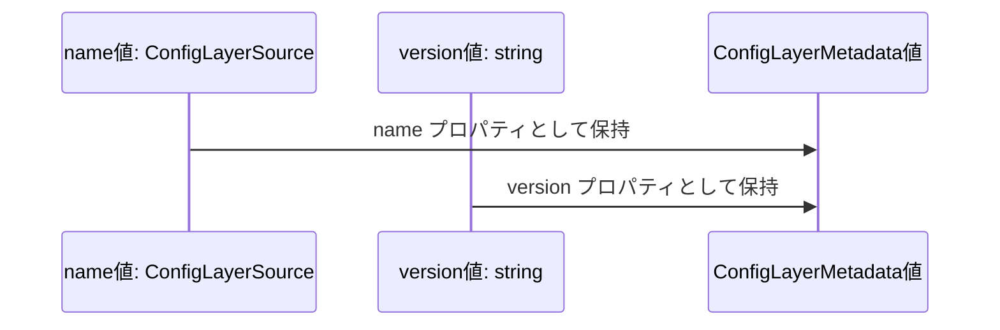

# app-server-protocol/schema/typescript/v2/ConfigLayerMetadata.ts コード解説

## 0. ざっくり一言

- 設定レイヤーのメタデータを表現する `ConfigLayerMetadata` 型を 1 つだけ定義した、**自動生成された TypeScript の型定義ファイル**です（`ConfigLayerMetadata.ts:L1-3, L6`）。

---

## 1. このモジュールの役割

### 1.1 概要

- このモジュールは、**設定レイヤーに関するメタ情報**を表現するための型 `ConfigLayerMetadata` を提供します（`ConfigLayerMetadata.ts:L6`）。
- `ConfigLayerMetadata` は、`name`（`ConfigLayerSource` 型）と `version`（`string` 型）という 2 つのプロパティを持つオブジェクト型として定義されています（`ConfigLayerMetadata.ts:L4, L6`）。
- ファイル全体は `ts-rs` により自動生成されており、**手動編集すべきではない**ことが明示されています（`ConfigLayerMetadata.ts:L1-3`）。

### 1.2 アーキテクチャ内での位置づけ

- このモジュールは、同一ディレクトリ内の `./ConfigLayerSource` モジュールから `ConfigLayerSource` 型を `import type` で参照し（`ConfigLayerMetadata.ts:L4`）、それを `ConfigLayerMetadata` の `name` プロパティの型として利用しています（`ConfigLayerMetadata.ts:L6`）。
- このファイル自身は型定義のみで、実行時ロジックや関数は含みません（`ConfigLayerMetadata.ts:L1-6`）。



*この図は、このチャンク内に現れる型同士の依存関係を示しています。*

### 1.3 設計上のポイント

- **自動生成コード**  
  - 冒頭コメントにより、`ts-rs` による生成コードであり手動編集禁止と明示されています（`ConfigLayerMetadata.ts:L1-3`）。
- **型のみのモジュール**  
  - `import type` と `export type` のみで構成されており、実行時に影響するコード（関数・クラス・変数宣言など）はありません（`ConfigLayerMetadata.ts:L4, L6`）。
- **構造の明確なオブジェクト型**  
  - `name: ConfigLayerSource` と `version: string` を必須プロパティとして持つ、最小限のメタデータ構造になっています（`ConfigLayerMetadata.ts:L6`）。
- **エラー処理・並行性**  
  - 実行コードを持たないため、このファイル自体にはエラー処理や並行性に関する挙動は存在しません（`ConfigLayerMetadata.ts:L1-6`）。

---

## 2. 主要な機能一覧

このファイルは 1 つの型を公開します。

- `ConfigLayerMetadata` 型:  
  `name`（`ConfigLayerSource` 型）と `version`（`string` 型）の 2 つのプロパティからなる、**設定レイヤーのメタデータ**を表現するオブジェクト型です（`ConfigLayerMetadata.ts:L4, L6`）。

---

## 3. 公開 API と詳細解説

### 3.1 型一覧（構造体・列挙体など）

#### 公開される型

| 名前                  | 種別         | 役割 / 用途                                                                 | 根拠 |
|-----------------------|--------------|-------------------------------------------------------------------------------|------|
| `ConfigLayerMetadata` | 型エイリアス | 設定レイヤーのメタデータ（`name: ConfigLayerSource` と `version: string`）を表す | `ConfigLayerMetadata.ts:L4, L6` |

#### 依存する型（このファイルでは宣言されないもの）

| 名前                | 種別       | 役割 / 用途（このファイルから分かる範囲）                             | 根拠 |
|---------------------|------------|--------------------------------------------------------------------------|------|
| `ConfigLayerSource` | 型（不明） | 他モジュール `./ConfigLayerSource` から import され、`name` の型として使われる | `ConfigLayerMetadata.ts:L4, L6` |

> `ConfigLayerSource` の具体的な定義内容は、このチャンクには現れません。

### 3.2 関数詳細（最大 7 件）

- **このファイルには関数・メソッドの定義はありません**（`ConfigLayerMetadata.ts:L1-6`）。  
  そのため、この節で詳述すべき対象関数はありません。

### 3.3 その他の関数

- 関数・メソッドは一切定義されていません（`ConfigLayerMetadata.ts:L1-6`）。

---

## 4. データフロー

このファイルは型定義のみですが、**型レベルでのデータ構造の流れ**を整理します。

- `ConfigLayerMetadata` 型の値は、少なくとも以下 2 つの情報を持つオブジェクトです（`ConfigLayerMetadata.ts:L6`）。
  - `name`: `ConfigLayerSource` 型の値
  - `version`: `string` 型の値
- 実行時ロジックは含まれないため、ここでは「値の構造がどう組み合わさるか」という静的な関係のみを示します。



- この図は、「`ConfigLayerMetadata` 型の値が、`ConfigLayerSource` と `string` の 2 つの値をプロパティとして内包する」という関係を表現しています（`ConfigLayerMetadata.ts:L4, L6`）。
- エラー処理や非同期処理などのランタイムのデータフローは、このファイルからは読み取れません。

---

## 5. 使い方（How to Use）

### 5.1 基本的な使用方法

外部モジュールから `ConfigLayerMetadata` を利用する典型的な型付けの例です。  
`ConfigLayerSource` の具体的な中身はこのファイルからは分からないため、プレースホルダコメントとしています。

```typescript
// 別モジュール側からの利用例（概念的なコード例）
import type { ConfigLayerSource } from "./ConfigLayerSource";      // ConfigLayerMetadata.ts:L4 と同じモジュールを参照
import type { ConfigLayerMetadata } from "./ConfigLayerMetadata";  // 本ファイルを型として利用

// ConfigLayerSource 型の値をどこかから取得する（実装はこのファイルには現れない）
const source: ConfigLayerSource = /* ConfigLayerSource の定義側に従って適切な値を用意する */ null as any;

// ConfigLayerMetadata 型の値を作成する
const metadata: ConfigLayerMetadata = {
    name: source,           // name プロパティ: ConfigLayerSource 型（ConfigLayerMetadata.ts:L6）
    version: "1.0.0",       // version プロパティ: string 型（ConfigLayerMetadata.ts:L6）
};

// TypeScript によって、name が ConfigLayerSource 型であり
// version が string 型であることがコンパイル時にチェックされます。
```

- このように利用することで、**設定レイヤーの名称/識別子 (`name`) とバージョン (`version`) を 1 つのオブジェクトとして扱う**ことができます（`ConfigLayerMetadata.ts:L4, L6`）。
- TypeScript の静的型チェックにより、`version` に数値を入れる等の誤りはコンパイル時に検出されます。

### 5.2 よくある使用パターン

このファイルから直接分かるのは「name と version を 1 つにまとめたメタデータ型」という点のみです（`ConfigLayerMetadata.ts:L6`）。それを前提にした一般的な使い方を挙げます。

1. **メタデータの配列として管理する**

```typescript
import type { ConfigLayerMetadata } from "./ConfigLayerMetadata";

// 複数レイヤーのメタデータを配列で保持
const layers: ConfigLayerMetadata[] = [
    {
        name: /* ConfigLayerSource 値 */ null as any,
        version: "1.0.0",
    },
    {
        name: /* ConfigLayerSource 値 */ null as any,
        version: "2.0.0",
    },
];
```

1. **関数の引数や戻り値に使う（型レベルの契約）**

```typescript
import type { ConfigLayerMetadata } from "./ConfigLayerMetadata";

function describeLayer(meta: ConfigLayerMetadata): string {
    // ここでは meta.version が string であることが保証されている（ConfigLayerMetadata.ts:L6）
    return `Layer version: ${meta.version}`;
}
```

- いずれも、`ConfigLayerMetadata` が「必ず `name` と `version` を持つ」という前提を関数のインターフェースに埋め込む使い方です（`ConfigLayerMetadata.ts:L6`）。

### 5.3 よくある間違い

TypeScript の型に基づく、起こりうる誤用例と、その修正例です。

```typescript
import type { ConfigLayerMetadata } from "./ConfigLayerMetadata";

// 間違い例: version に number を入れている
const wrong1: ConfigLayerMetadata = {
    name: null as any,
    // version: 1,  // エラー: number を string 型のプロパティに代入している（ConfigLayerMetadata.ts:L6）
    version: "1",  // ← string に修正するとコンパイルが通る
};

// 間違い例: 必須プロパティ version を省略している
const wrong2: ConfigLayerMetadata = {
    // version がないためエラー（ConfigLayerMetadata.ts:L6）
    // version: "1.0.0", // この行を追加すれば型エラーは解消される
    name: null as any,
};
```

- `ConfigLayerMetadata` の両プロパティ `name` と `version` は必須であり、オプショナル（`?`）ではありません（`ConfigLayerMetadata.ts:L6`）。
- そのため、**プロパティの型違い**や**必須プロパティの欠落**はコンパイル時に検出されます。

### 5.4 使用上の注意点（まとめ）

- **自動生成ファイルのため直接編集しないこと**  
  - 先頭コメントにある通り、手動編集は禁止されています（`ConfigLayerMetadata.ts:L1-3`）。
- **必須プロパティの存在**  
  - `name` と `version` は必須プロパティであり、`undefined` や省略は許容されません（`ConfigLayerMetadata.ts:L6`）。
- **`version` の内容は型レベルでは制約されない**  
  - 型は単なる `string` のため、空文字列や任意の文字列も型的には許容されます（`ConfigLayerMetadata.ts:L6`）。値の妥当性チェックは別ロジック側の責務になります（このファイルには存在しません）。
- **ランタイムのエラーや並行性はこのファイルの外側の問題**  
  - このファイルは型定義のみのため、例外発生やスレッドセーフティなどの問題は、この型を利用する実装側で考慮する必要があります（`ConfigLayerMetadata.ts:L1-6`）。

---

## 6. 変更の仕方（How to Modify）

### 6.1 新しい機能を追加する場合

- 冒頭コメントにより、このファイルは `ts-rs` による生成物であり、**直接編集すべきでない**と明示されています（`ConfigLayerMetadata.ts:L1-3`）。
- そのため、「プロパティを追加したい」「型名を変えたい」といった変更は、**生成元（ts-rs の入力となる定義）を変更する**のが前提になります。
  - 生成元がどこにあるか、このチャンクだけからは分かりません（不明）。
- 生成フローの一般的な流れ（このリポジトリの詳細は不明）:
  1. ts-rs の入力側の定義を変更する（このファイルには現れない）。
  2. コード生成スクリプトを再実行して、新しい `ConfigLayerMetadata.ts` を生成する。
  3. 生成された型に依存する TypeScript コード側で、必要な対応を行う。

### 6.2 既存の機能を変更する場合

`ConfigLayerMetadata` の構造や意味を変える場合の注意点を、このファイルから読み取れる範囲で整理します。

- **影響範囲の確認**
  - `ConfigLayerMetadata` 型を利用しているすべての場所で、`name` と `version` が前提になっていると考えられます（一般論）。  
    このファイルからは利用箇所は分からないため、IDE 等で参照元検索が必要です（不明）。
- **契約（型レベルの前提条件）**
  - `ConfigLayerMetadata` は、`name: ConfigLayerSource` と `version: string` を必須とする契約になっています（`ConfigLayerMetadata.ts:L6`）。
  - これを変更すると、既存コードの型チェックが通らなくなる可能性があります。
- **変更時の注意**
  - 自動生成ファイルであるため、TypeScript 側だけを書き換えると、再生成時に上書きされる、あるいは生成元との不整合が発生することが想定されます（`ConfigLayerMetadata.ts:L1-3`）。
  - 変更は必ず ts-rs の生成元を起点に行う必要があります（生成元はこのチャンクには現れません）。

---

## 7. 関連ファイル

このモジュールと直接関係があるファイル・モジュールを整理します。

| パス / モジュール指定         | 役割 / 関係                                                                                 | 根拠 |
|------------------------------|----------------------------------------------------------------------------------------------|------|
| `./ConfigLayerSource`        | `ConfigLayerSource` 型を提供するモジュール。`ConfigLayerMetadata` の `name` プロパティの型として利用される | `ConfigLayerMetadata.ts:L4, L6` |
| （生成元ファイル: 不明）     | `ts-rs` によってこのファイルを生成する元定義。場所や形式はこのチャンクからは分かりません               | `ConfigLayerMetadata.ts:L1-3` |

- テストコードや他の利用側コードは、このチャンクには現れないため不明です。

---

### 付記: Bugs / Security / テスト / 性能 について

- **Bugs / Security**  
  - このファイルは純粋な型定義のみであり、実行時処理を持たないため、**直接的なバグやセキュリティホールの原因にはなりません**（`ConfigLayerMetadata.ts:L1-6`）。  
  - ただし、`version` が単なる `string` であるため、値の検証が適切に行われないと意味的なバグ（想定外のバージョン文字列）が別の箇所で生じる可能性はあります。
- **テスト**  
  - このファイル単体を対象とするユニットテストは通常不要であり、`ConfigLayerMetadata` を利用するロジックのテストで間接的に検証される形になると考えられます。このチャンクにはテストコードは含まれていません。
- **性能・スケーラビリティ・観測性**  
  - 型定義のみのため、ランタイム性能やスケーラビリティ、ログ出力などの観測性に直接影響を与える要素はありません。これらは、この型を利用する実装側の関心事になります。
