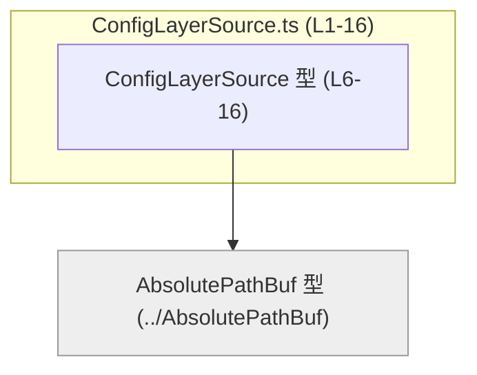
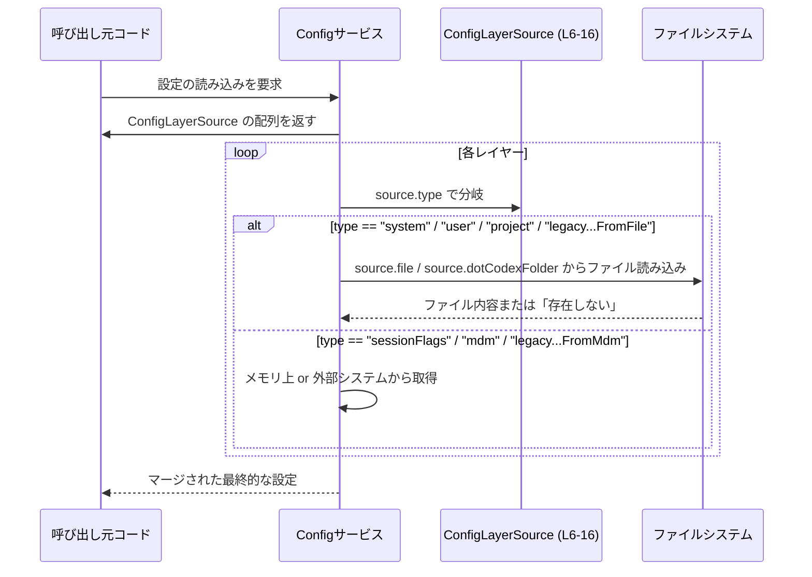

app-server-protocol/schema/typescript/v2/ConfigLayerSource.ts のコード解説です。

---

## 0. ざっくり一言

設定をどこから読み込むかを表現するための **設定レイヤーの列挙（直和）型** `ConfigLayerSource` を定義する TypeScript ファイルです。  
システム／ユーザー／プロジェクトなど複数の設定ファイルやフラグの「出どころ」を型安全に区別できるようにしています（`ConfigLayerSource.ts:L6-16`）。

---

## 1. このモジュールの役割

### 1.1 概要

- このモジュールは、設定情報がどのレイヤー（system, user, project, など）から来たものかを型として表現するために存在します（`ConfigLayerSource.ts:L6-16`）。
- 文字列リテラル `"type"` プロパティをタグとした **判別可能共用体（discriminated union）** で実装されています（`ConfigLayerSource.ts:L6-16`）。
- `AbsolutePathBuf` 型を使うことで、ファイルパスを表すフィールドを明示的に区別しています（`ConfigLayerSource.ts:L4,L6-16`）。

### 1.2 アーキテクチャ内での位置づけ

- 依存関係として、同一スキーマ階層の `AbsolutePathBuf` 型のみをインポートしています（`ConfigLayerSource.ts:L4`）。
- 自身は `export type` として公開されており、他のモジュールから設定読み込み処理の入力・戻り値の型として利用されることが想定されます（`ConfigLayerSource.ts:L6`）。
- ファイル先頭コメントから、この型は Rust 側の定義から `ts-rs` によって自動生成されていることが分かります（`ConfigLayerSource.ts:L1-3`）。

依存関係の図（このチャンクの範囲 `L1-16`）:



- `ConfigLayerSource` が `AbsolutePathBuf` に依存していることを示しています（`ConfigLayerSource.ts:L4,L6-16`）。
- 逆方向の依存（`AbsolutePathBuf` からこの型を参照するなど）は、このチャンクからは分かりません。

### 1.3 設計上のポイント

- **生成コード**  
  - 「手で編集してはいけない」ことが明示されており（`ConfigLayerSource.ts:L1-3`）、変更は元となる Rust 側の型定義経由で行う設計になっています。
- **判別可能共用体によるレイヤー表現**  
  - `"type"` プロパティをタグとして、7 種類のバリアントを 1 つの型にまとめています（`ConfigLayerSource.ts:L6-16`）。
- **ファイルの存在非保証という契約**  
  - `system` と `user` バリアントの `file` は「そのパスのファイルが存在することは保証されない」とコメントされています（`ConfigLayerSource.ts:L7-10,L12-15`）。
- **状態やロジックを持たない**  
  - このファイルには関数やクラスはなく、純粋なデータ型のみを提供します（`ConfigLayerSource.ts:L4-16`）。
  - したがって並行性（スレッドセーフティ）やランタイムのエラーハンドリングは、これを利用する側のコードに委ねられています。

---

## 2. 主要な機能一覧（コンポーネントインベントリー）

このファイルが提供する「機能」は、型定義のみです。

- `ConfigLayerSource` 型:  
  設定レイヤーの種類と、そのレイヤーに紐づくメタデータ（パス・ドメイン・キーなど）を表す discriminated union（`ConfigLayerSource.ts:L6-16`）。

バリアント（サブコンポーネント）の一覧:

| バリアント `"type"` 値 | 追加フィールド | 役割（推測を含まない説明） | 根拠 |
|------------------------|----------------|-----------------------------|------|
| `"mdm"` | `domain: string`, `key: string` | `"mdm"` ソースを識別するためのドメインとキーの組み合わせを持つレイヤー | `ConfigLayerSource.ts:L6` |
| `"system"` | `file: AbsolutePathBuf` | システム全体の `config.toml` へのパスを持つレイヤー。ファイルの存在は保証されない | `ConfigLayerSource.ts:L6-11` |
| `"user"` | `file: AbsolutePathBuf` | ユーザー固有の `config.toml` へのパスを持つレイヤー。ファイルの存在は保証されない | `ConfigLayerSource.ts:L11-16` |
| `"project"` | `dotCodexFolder: AbsolutePathBuf` | プロジェクト固有の設定を含む `.codex` フォルダへのパスを持つレイヤー | `ConfigLayerSource.ts:L16` |
| `"sessionFlags"` | （なし） | セッション中のフラグから構成されるレイヤー | `ConfigLayerSource.ts:L16` |
| `"legacyManagedConfigTomlFromFile"` | `file: AbsolutePathBuf` | レガシーな managed `config.toml` をファイルから読み込むレイヤー | `ConfigLayerSource.ts:L16` |
| `"legacyManagedConfigTomlFromMdm"` | （なし） | レガシーな managed 設定を `"mdm"` 経由で取得するレイヤー | `ConfigLayerSource.ts:L16` |

> `"mdm"` や `"legacyManaged..."` の意味（例: どのような外部システムを指すか）は、このチャンク内のコメント・コードからは読み取れません。

---

## 3. 公開 API と詳細解説

### 3.1 型一覧

| 名前 | 種別 | 役割 / 用途 | 根拠 |
|------|------|-------------|------|
| `ConfigLayerSource` | 型エイリアス（判別可能共用体） | 設定を構成する各レイヤー（system, user, project など）の「出どころ」とメタデータをまとめて表すトップレベル型 | `ConfigLayerSource.ts:L6-16` |
| `AbsolutePathBuf` | 型（別ファイルで定義） | 絶対パスを表す型。`ConfigLayerSource` の `file` や `dotCodexFolder` で使用されています | `ConfigLayerSource.ts:L4,L6-16` |

#### `ConfigLayerSource` の構造（詳細）

TypeScript の定義（整形済み）:

```typescript
import type { AbsolutePathBuf } from "../AbsolutePathBuf";

export type ConfigLayerSource =
  | { type: "mdm"; domain: string; key: string }
  | {
      type: "system";
      /**
       * This is the path to the system config.toml file, though it is not
       * guaranteed to exist.
       */
      file: AbsolutePathBuf;
    }
  | {
      type: "user";
      /**
       * This is the path to the user's config.toml file, though it is not
       * guaranteed to exist.
       */
      file: AbsolutePathBuf;
    }
  | { type: "project"; dotCodexFolder: AbsolutePathBuf }
  | { type: "sessionFlags" }
  | { type: "legacyManagedConfigTomlFromFile"; file: AbsolutePathBuf }
  | { type: "legacyManagedConfigTomlFromMdm" };
```

（コメント内容は `ConfigLayerSource.ts:L7-10,L12-15`、構造自体は `ConfigLayerSource.ts:L6-16` を元に再整形しています）

**型としての契約（Contract）**

- すべてのバリアントが共通して `type` プロパティを持ち、その値は上記 7 個の文字列のいずれかです（`ConfigLayerSource.ts:L6-16`）。
- `"system"` / `"user"` バリアントの `file` は該当する `config.toml` のパスを指しますが、「ファイルが存在することは保証されない」と明記されています（`ConfigLayerSource.ts:L7-10,L12-15`）。
- `AbsolutePathBuf` は `import type` によって取り込まれており、コンパイル時の型情報だけを参照することが分かります（`ConfigLayerSource.ts:L4`）。

**エッジケース / 注意すべき点**

- `"system"` / `"user"` レイヤーの `file` が指すパスにファイルが存在しないことは、正常な状況として想定されています。利用側で「存在しない場合」の処理を必ず検討する必要があります（コメントより: `ConfigLayerSource.ts:L7-10,L12-15`）。
- 将来的にバリアントが増えた場合、`switch (source.type)` などでの処理分岐が非網羅的になる可能性があります。コンパイラによる網羅性チェックを活かすことが推奨されます（これは TypeScript の一般的な union 利用パターンに関する説明であり、このチャンクに明記はされていません）。

### 3.2 関数詳細（最大 7 件）

このファイルには **関数は定義されていません**（`ConfigLayerSource.ts:L1-16`）。  
そのため、このセクションで説明すべき公開関数 API は存在しません。

### 3.3 その他の関数

- なし（ヘルパー関数・メソッドなども定義されていません）。

---

## 4. データフロー

このファイル単体には処理ロジックはありませんが、`ConfigLayerSource` がどのように利用されるかの典型的なフローを、**一般的な discriminated union の扱い方** に基づいて示します。  
以下は「想定される利用パターン」であり、具体的な呼び出し元のクラス名などはこのチャンクからは分かりません。



- 実際にどのようなサービス名・関数名で扱われるかは、このチャンクからは読み取れません。
- ただし、`ConfigLayerSource` にファイルパス情報と「存在非保証」のコメントが付いていることから（`ConfigLayerSource.ts:L7-10,L12-15`）、利用側がファイルの存在可否を考慮した読み込みフローを実装する必要があることは読み取れます。

---

## 5. 使い方（How to Use）

### 5.1 基本的な使用方法

`ConfigLayerSource` を使って設定レイヤーを表現し、`switch` 文でバリアントごとの処理を行う例です。

```typescript
import type { ConfigLayerSource } from "./ConfigLayerSource";   // このファイルの型をインポート
// import type { AbsolutePathBuf } from "../AbsolutePathBuf";   // 必要ならパス型も

// レイヤーを 1 つ作る例: システム設定ファイル
const systemLayer: ConfigLayerSource = {                        // type が "system" のバリアントを作成
  type: "system",                                               // 判別用のタグ
  file: "/etc/myapp/config.toml" as any,                        // 実際は AbsolutePathBuf 型を渡す
};

// レイヤーの配列を処理する例
function loadConfigFromLayers(layers: ConfigLayerSource[]) {    // ConfigLayerSource の配列を受け取る
  for (const layer of layers) {                                 // 各レイヤーを順に処理
    switch (layer.type) {                                       // 判別用タグで分岐
      case "system":
      case "user":
      case "legacyManagedConfigTomlFromFile":
        // layer.file は AbsolutePathBuf 型
        // ファイルが存在しない可能性がコメントで示されている点に注意
        console.log("Try read config from", layer.file);
        break;

      case "project":
        console.log("Project folder:", layer.dotCodexFolder);
        break;

      case "sessionFlags":
        console.log("Apply session flags");
        break;

      case "mdm":
      case "legacyManagedConfigTomlFromMdm":
        console.log("Load managed config using domain/key or MDM");
        break;

      default:
        // 現状 union が網羅されていればここには来ない想定
        const _: never = layer;                                 // 将来のバリアント追加に備えたコンパイル時チェック用
        break;
    }
  }
}
```

- `layer.type` による分岐により、TypeScript の型ナローイングが働き、各ケースの中では該当バリアントのフィールドだけにアクセスできるようになります。
- 上記の `never` 代入パターンは、将来 union のバリアントが増えたときに `switch` の網羅漏れをコンパイルエラーで検出する一般的なテクニックです（本ファイルには書かれていませんが、TypeScript の慣習として有用です）。

### 5.2 よくある使用パターン

1. **レイヤーを優先順位付き配列として扱う**

   ```typescript
   const layersInOrder: ConfigLayerSource[] = [
     { type: "legacyManagedConfigTomlFromMdm" },
     { type: "system", file: /* ... */ } as any,
     { type: "user", file: /* ... */ } as any,
     { type: "project", dotCodexFolder: /* ... */ } as any,
     { type: "sessionFlags" },
   ];
   ```

   - 上位のレイヤーほど優先度が高い、というように解釈するのは自然ですが、その優先順位ルール自体はこのチャンクには書かれていません。

2. **設定の出どころをログに記録する**

   ```typescript
   function describeLayer(layer: ConfigLayerSource): string {
     switch (layer.type) {
       case "system":
         return `system config at ${layer.file}`;
       case "user":
         return `user config at ${layer.file}`;
       case "project":
         return `project config in ${layer.dotCodexFolder}`;
       case "sessionFlags":
         return "session flags";
       case "mdm":
         return `MDM config for ${layer.domain}/${layer.key}`;
       case "legacyManagedConfigTomlFromFile":
         return `legacy managed config file at ${layer.file}`;
       case "legacyManagedConfigTomlFromMdm":
         return "legacy managed config via MDM";
     }
   }
   ```

### 5.3 よくある間違い（想定）

このチャンクから直接観察できる情報と TypeScript の一般的な使用パターンから、起こり得る誤用例を挙げます。

```typescript
// 誤り例: type の文字列を間違える
const badLayer: ConfigLayerSource = {
  // @ts-expect-error: "systemConfig" は union に含まれない
  type: "systemConfig",
  file: "/etc/myapp/config.toml" as any,
};

// 誤り例: system/user のファイルが必ず存在すると決めつける
function readSystemConfig(layer: ConfigLayerSource) {
  if (layer.type === "system") {
    // コメントでは「存在は保証されない」と明示されている（ConfigLayerSource.ts:L7-10）
    // ここで存在チェックをしないと、ファイルアクセス時にランタイムエラーになる可能性がある
    // fs.readFileSync(layer.file);  // 存在確認なしは危険
  }
}
```

### 5.4 使用上の注意点（まとめ）

- **手で編集しないこと**  
  - ファイル先頭のコメントにある通り、これは `ts-rs` による生成コードであり、手動での編集は想定されていません（`ConfigLayerSource.ts:L1-3`）。
- **ファイルの存在確認**  
  - `"system"` / `"user"` の `file` は存在しない可能性があるため、読み込み前に存在確認を行う必要があります（`ConfigLayerSource.ts:L7-10,L12-15`）。
- **バリアントの網羅的処理**  
  - 新しい `"type"` 値が将来追加されることを考慮し、`switch` と `never` チェックなどでコンパイル時の網羅性チェックを活用すると安全です。
- **並行性・スレッド安全性**  
  - この型自体はただのデータ構造であり、共有してもレースコンディションは発生しません。  
    ただし、同じ `file` パスを複数スレッド／プロセスから同時に読み書きする場合の安全性は、この型ではなくファイルアクセスの実装側の問題になります。

---

## 6. 変更の仕方（How to Modify）

### 6.1 新しい機能（バリアント）を追加する場合

- ファイル先頭に「生成コードである」と明示されているため（`ConfigLayerSource.ts:L1-3`）、**この TypeScript ファイルを直接書き換えるのではなく、元となる Rust 側の型定義**（`ts-rs` の入力）を変更し、再生成する必要があります。
- 一般的な手順（このチャンクからは Rust 側ファイル名などは分かりません）:
  1. Rust の構造体／列挙体など、`ConfigLayerSource` に対応する型定義に新しいバリアントを追加する。
  2. `ts-rs` を再実行して TypeScript コードを生成する。
  3. `ConfigLayerSource` を使用している TypeScript コードで、新バリアントに対する処理を `switch` などに追加する。

### 6.2 既存の機能を変更する場合

- **フィールドの追加・削除・型変更**  
  - やはり Rust 側の型を変更して `ts-rs` 再生成、という流れになります（`ConfigLayerSource.ts:L1-3`）。
- **影響範囲の確認ポイント**
  - `ConfigLayerSource` をインポートしているすべての TypeScript ファイル。
  - `"type"` の文字列値を元に分岐している箇所（`switch` 文や if 文）。
  - `file` や `dotCodexFolder` を使ってファイルアクセスをしている箇所（ファイルの存在条件が変わる可能性があるため）。
- **契約に注意すべき点**
  - `"system"` / `"user"` の `file` の「存在非保証」という前提を変える場合、コメントの更新と、既存コードのエラー処理ロジックの見直しが必要になります。

---

## 7. 関連ファイル

| パス | 役割 / 関係 |
|------|------------|
| `app-server-protocol/schema/typescript/v2/AbsolutePathBuf.ts`（推定パス） | `AbsolutePathBuf` 型の定義を提供するファイル。`ConfigLayerSource` の `file` および `dotCodexFolder` フィールドで使用される（`ConfigLayerSource.ts:L4,L6-16`）。 |
| Rust 側の `ConfigLayerSource` に対応する型定義（ファイル名不明） | `ts-rs` による生成元となる Rust の型。このチャンクには場所や名前は記載されていませんが、`ConfigLayerSource.ts:L1-3` のコメントから存在が示唆されます。 |

このチャンクにはテストコードや他のユーティリティ関数は含まれていないため、テスト用ファイルや補助モジュールとの関係は不明です。
