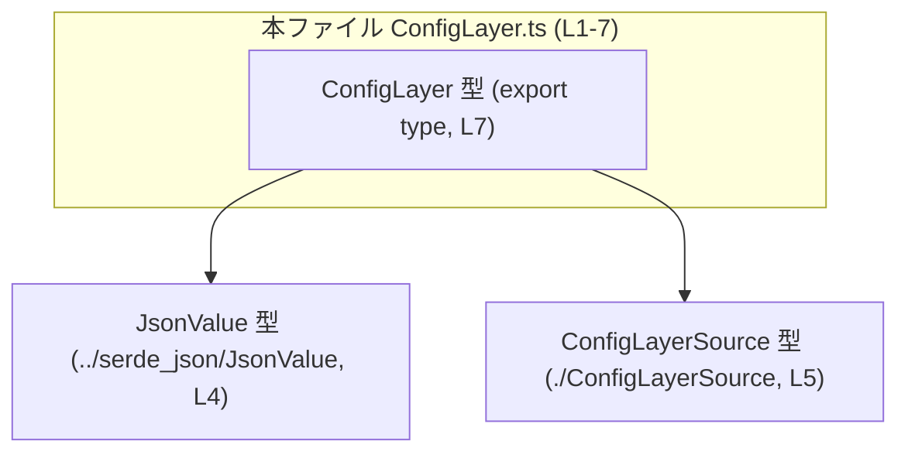
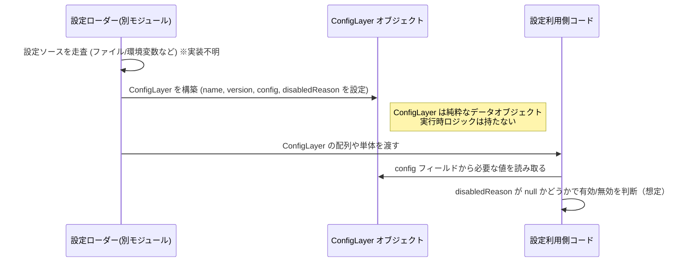

# app-server-protocol/schema/typescript/v2/ConfigLayer.ts

## 0. ざっくり一言

`ConfigLayer` という設定レイヤーを表す TypeScript の型エイリアスを 1 つだけ定義する、自動生成ファイルです。  
各レイヤーの「ソース」「バージョン」「JSON形式の設定内容」「無効化理由」を 1 つのオブジェクトとして扱えるようにしています（根拠: `ConfigLayer.ts:L1-7`）。

---

## 1. このモジュールの役割

### 1.1 概要

- このモジュールは、設定情報の 1 レイヤーを表現するための **型定義** を提供します。
- 実行時のロジック（関数やクラス）は一切含まず、**静的な型安全性** を付与するためだけのファイルです（根拠: 関数定義が存在しない `ConfigLayer.ts:L1-7`）。
- Rust 側の型から `ts-rs` によって自動生成されていることがコメントで明示されています（根拠: `ConfigLayer.ts:L1-3`）。

### 1.2 アーキテクチャ内での位置づけ

このファイルは、他の TypeScript コードから参照される **DTO（データ転送用オブジェクト）の型** として機能します。

依存関係は次のとおりです。

- 依存先:
  - `JsonValue` 型（JSON 値を表す型）: `../serde_json/JsonValue` からインポート（根拠: `ConfigLayer.ts:L4`）
  - `ConfigLayerSource` 型: `./ConfigLayerSource` からインポート（根拠: `ConfigLayer.ts:L5`）
- 提供:
  - `ConfigLayer` 型エイリアス（根拠: `ConfigLayer.ts:L7`）

この関係を簡単な依存関係図にすると、次のようになります（この図は `ConfigLayer.ts:L1-7` を対象とします）。



### 1.3 設計上のポイント

コードから読み取れる設計上の特徴は次のとおりです。

- **自動生成コード**  
  - ファイル先頭コメントで、`ts-rs` による自動生成であり手動編集禁止であることが明示されています（根拠: `ConfigLayer.ts:L1-3`）。
- **状態を持たない型定義のみ**  
  - クラスや関数、変数定義はなく、`export type` による型エイリアスのみを提供しています（根拠: `ConfigLayer.ts:L7`）。
- **JSON ベースの設定表現**  
  - `config` フィールドが `JsonValue` 型であることから、設定内容が JSON 互換の値として表現される前提になっています（根拠: `ConfigLayer.ts:L4,L7`）。
- **有効/無効のメタ情報を含む**  
  - `disabledReason: string | null` により、そのレイヤーが無効化されている理由（なければ `null`）を保持できる構造になっています（根拠: `ConfigLayer.ts:L7`）。

---

## 2. 主要な機能一覧

このファイルはロジックを持たないため、「機能」はすべて型レベルの表現です。

- `ConfigLayer` 型: 設定レイヤー 1 つ分のメタ情報と JSON 設定本体をまとめて表すオブジェクト型（根拠: `ConfigLayer.ts:L7`）。

---

## 3. 公開 API と詳細解説

### 3.1 型一覧（構造体・列挙体など）

このファイルで公開される型は 1 つだけです。

| 名前          | 種別        | 役割 / 用途                                                                 | 定義位置 |
|---------------|-------------|-------------------------------------------------------------------------------|----------|
| `ConfigLayer` | 型エイリアス | 設定レイヤーのソース、バージョン、JSON 形式の設定内容、無効化理由をまとめた型 | `ConfigLayer.ts:L7` |

#### `ConfigLayer` のフィールド構造

`ConfigLayer` は次のようなオブジェクト型です（根拠: `ConfigLayer.ts:L7`）。

```ts
export type ConfigLayer = {
    name: ConfigLayerSource,
    version: string,
    config: JsonValue,
    disabledReason: string | null,
};
```

各フィールドの意味は、名前と型から次のように解釈できます（※フィールド名からの推測を含みますが、構造自体はコードに基づきます）。

| フィールド名       | 型                   | 説明（役割）                                                                                                                                          | 根拠 |
|--------------------|----------------------|-------------------------------------------------------------------------------------------------------------------------------------------------------|------|
| `name`             | `ConfigLayerSource`  | レイヤーの「ソース」を表す識別子・列挙など。どこから来た設定レイヤーか（例: ファイル、環境変数、デフォルトなど）を区別するための型と推測できます。 | `ConfigLayer.ts:L5,L7` |
| `version`          | `string`             | このレイヤーのバージョン文字列。セマンティックバージョンやリビジョン ID などが入ると考えられますが、詳細な形式はコードからは分かりません。         | `ConfigLayer.ts:L7` |
| `config`           | `JsonValue`          | 実際の設定内容を JSON 値として保持するフィールドです。オブジェクトや配列など任意の JSON 構造を取りうる可能性があります。                           | `ConfigLayer.ts:L4,L7` |
| `disabledReason`   | `string \| null`     | レイヤーが無効化されている場合の理由メッセージ。理由がなければ `null` とする契約になっていると読み取れます。                                        | `ConfigLayer.ts:L7` |

### 3.2 関数詳細（最大 7 件）

このファイルには **関数・メソッドは定義されていません**（根拠: `ConfigLayer.ts:L1-7` に `function` / `=>` / `class` などが存在しない）。

そのため、関数詳細テンプレートに従って解説すべき対象はありません。

### 3.3 その他の関数

- 該当なし（補助関数やラッパー関数を含め、関数定義は存在しません）。

---

## 4. データフロー

このファイル自体には実行時処理がなく、`ConfigLayer` を「どう生成・利用するか」は他ファイルに依存します。そのため、厳密なデータフローはこのチャンクだけからは分かりません。

ここでは、**「`ConfigLayer` を利用する典型的な流れ」** を、型の構造から推測した概念図として示します。  
※図はあくまで利用イメージであり、実際の実装フローはこのチャンクからは特定できません。



要点:

- `ConfigLayer` は「設定ローダー」的なコンポーネントで作られ、「設定利用側」のコードに渡される中間データとして使われる構造が想定されます。
- 実際の生成ロジックやライフサイクルは、このファイルには記述がありません（「このチャンクには現れない」）。

---

## 5. 使い方（How to Use）

### 5.1 基本的な使用方法

`ConfigLayer` は単なる型エイリアスなので、他のモジュールからインポートしてオブジェクトの型注釈として利用します。

```typescript
// ConfigLayer型を利用する側のコード例
// ファイルパスは、このファイル名に基づく想定です。
import type { ConfigLayer } from "./ConfigLayer";           // 本ファイルのエクスポートを利用する
import type { ConfigLayerSource } from "./ConfigLayerSource"; // nameフィールドの型（根拠: ConfigLayer.ts:L5）

// 何らかのConfigLayerSource値を得たと仮定
const source: ConfigLayerSource = /* ... */;                // 具体的な値の定義はこのチャンクには現れない

// JsonValueに互換なオブジェクトを用意する
const configBody = {
    featureFlag: true,
    timeoutMs: 3000,
};                                                          // JsonValueとの互換性は../serde_json/JsonValueの定義に依存（このチャンクには現れない）

// ConfigLayerオブジェクトを構築する
const layer: ConfigLayer = {
    name: source,                                           // ConfigLayerSource型（L5,L7）
    version: "1.0.0",                                       // string型（L7）
    config: configBody,                                     // JsonValue型（L4,L7）
    disabledReason: null,                                   // 有効なレイヤーなので理由なし
};
```

このコードにより、`layer` オブジェクトが `ConfigLayer` の構造に合致しているかが、TypeScript のコンパイル時にチェックされます（型安全性）。

### 5.2 よくある使用パターン

想定される（推測を含む）使用パターンを挙げます。

1. **複数レイヤーを配列で扱う**

```typescript
import type { ConfigLayer } from "./ConfigLayer";

// 複数の設定レイヤーを配列で保持
const layers: ConfigLayer[] = loadLayersFromSomewhere();    // 実装は別モジュール（このチャンクには現れない）

// 有効なレイヤーだけを抽出する例
const enabledLayers = layers.filter(layer => layer.disabledReason === null);
```

1. **無効化されたレイヤーの理由をログ出力する**

```typescript
import type { ConfigLayer } from "./ConfigLayer";

function logDisabledLayers(layers: ConfigLayer[]): void {
    for (const layer of layers) {
        if (layer.disabledReason !== null) {
            console.warn(
                `Config layer ${String(layer.name)} is disabled: ${layer.disabledReason}`,
            );
        }
    }
}
```

> ※ `name` の実際の表示形式（文字列か enum かなど）は `ConfigLayerSource` の定義に依存し、このチャンクからは分かりません。

### 5.3 よくある間違い

この型に関連して起こりそうな誤用例と、正しい使い方の対比です。

```typescript
import type { ConfigLayer } from "./ConfigLayer";

// 間違い例: disabledReasonを省略している
const badLayer: ConfigLayer = {
    name: "file",          // ここでstringを代入できるかはConfigLayerSourceの定義次第
    version: "1.0.0",
    config: {},
    // disabledReason がないため型エラーになる
};

// 正しい例: disabledReasonを明示的に指定する
const goodLayer: ConfigLayer = {
    name: "file" as any,   // 実際にはConfigLayerSource型に合わせる必要がある
    version: "1.0.0",
    config: {},
    disabledReason: null,  // 有効な場合は null
};
```

よくある誤りとして考えられる点:

- `disabledReason` を省略して `ConfigLayer` として扱おうとする（必須フィールドのため型エラー）。
- `config` に JSON として不正な値（例えば関数や `undefined`）を入れてしまう（`JsonValue` の正確な定義によりますが、多くの場合これらは許容されません）。

### 5.4 使用上の注意点（まとめ）

- **前提条件**
  - `ConfigLayer` は純粋なデータ型であり、構築・検証のロジックは別モジュールに存在する必要があります（このチャンクには現れない）。
  - `config` フィールドの中身は `JsonValue` 型の制約に従う必要があります。`JsonValue` の定義は `../serde_json/JsonValue` にあり、このチャンクだけでは詳細は分かりません（根拠: `ConfigLayer.ts:L4`）。

- **エラー・安全性**
  - TypeScript の型チェックはコンパイル時のみであり、実行時には `ConfigLayer` 型は消失します。そのため、外部から取り込んだ JSON をそのまま `ConfigLayer` にキャストすると、実行時には不正な形でも入りうる点に注意が必要です。
  - セキュリティ上、`config` にユーザー入力が入る場合は、別途バリデーション・サニタイズが必要です（このファイルにはそうした検証ロジックは存在しません）。

- **並行性**
  - `ConfigLayer` は単なるイミュータブルなオブジェクトとして扱うことが想定されます（このチャンクにはミューテーションや共有状態は存在しません）。  
    並行処理（Web Worker 等）で扱う場合も、シリアライズ可能な JSON に準拠していれば問題になりにくい構造です。

---

## 6. 変更の仕方（How to Modify）

### 6.1 新しい機能を追加する場合

ファイル先頭で次のように宣言されているとおり、このファイルは **自動生成コードであり手動編集禁止** です（根拠: `ConfigLayer.ts:L1-3`）。

```ts
// GENERATED CODE! DO NOT MODIFY BY HAND!

// This file was generated by [ts-rs](https://github.com/Aleph-Alpha/ts-rs). Do not edit this file manually.
```

そのため、新しいフィールドを追加したい場合や構造を変えたい場合は:

1. **元になっている Rust 側の型定義**（`ts-rs` でエクスポートされている struct / enum 等）を変更する。
2. `ts-rs` によるコード生成プロセスを再実行して、この `ConfigLayer.ts` を再生成する。
3. 生成された `ConfigLayer` の構造に合わせて TypeScript 側の利用コードを更新する。

このチャンクには元の Rust 型の場所・名称は現れていないため、「どのファイルを修正すべきか」の詳細は不明です。

### 6.2 既存の機能を変更する場合

`ConfigLayer` のフィールドを変更する場合に注意すべき点:

- **影響範囲の確認**
  - `ConfigLayer` をインポートしているすべての TypeScript ファイル（`import type { ConfigLayer } from "./ConfigLayer"` など）でコンパイルエラーが発生する可能性があります。
  - 特に `disabledReason` をオプションに変更する・型を変える場合は、`null` を前提にしたロジックを見直す必要があります。

- **契約（前提条件・返り値の意味）**
  - `disabledReason: string | null` という契約を `string` のみに変更すると、「null の場合は有効」という意味が変わるため、既存コードと意味の不整合が生じます。
  - `config: JsonValue` の型を変更する場合、シリアライズや API 通信のプロトコルにも影響する可能性があります。

- **Bugs / Security 観点**
  - 型定義を緩くすると（例: `config: any` に変更）、型安全性が低下し、バグが潜り込みやすくなります。
  - 逆に型を厳しくしすぎると、外部から受け取る JSON をそのまま割り当てできず、変換処理が必要になります。この変換処理にバグが入りやすい点に注意が必要です。

---

## 7. 関連ファイル

このモジュールと密接に関係するファイル・型は、インポートから次の 2 つが読み取れます。

| パス                               | 役割 / 関係                                                                                             | 根拠                 |
|------------------------------------|----------------------------------------------------------------------------------------------------------|----------------------|
| `../serde_json/JsonValue`          | `config` フィールドの型。JSON 互換の値を表す型であり、設定内容の表現を担います。詳細な定義はこのチャンクには現れません。 | `ConfigLayer.ts:L4`  |
| `./ConfigLayerSource`              | `name` フィールドの型。設定レイヤーのソースを識別する型（enum や string 型など）と考えられますが、実体はこのチャンクには現れません。 | `ConfigLayer.ts:L5`  |

テストコードや補助ユーティリティは、このチャンク内には現れていないため不明です。
